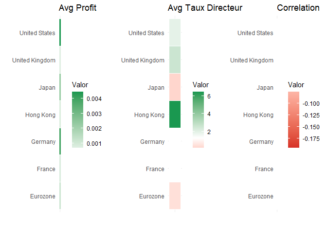

## Présentation de la question de recherche

1.  **Contexte et justification**

Au cours des dernières décennies, la relation entre les taux d’intérêt
et l’évolution des marchés boursiers s’est érigée en l’un des axes
centraux de l’analyse financière et de la politique monétaire. Les taux
d’intérêt fixés par les banques centrales déterminent le coût de
l’argent pour les entreprises et les ménages, influencent l’évaluation
des flux de trésorerie futurs et conditionnent l’allocation des
portefeuilles entre revenu fixe et revenu variable. Dans un contexte de
mondialisation et de flux de capitaux de plus en plus rapides,
comprendre jusqu’à quel point les variations des taux d’intérêt
affectent la rentabilité et la volatilité des bourses est indispensable
tant pour les décideurs de politiques économiques que pour les
gestionnaires d’actifs et les investisseurs particuliers.

La littérature empirique sur ce lien a majoritairement mis en évidence
une relation inverse : lorsque les taux d’intérêt augmentent, le coût de
l’endettement s’alourdit et les modèles d’actualisation des dividendes
et des bénéfices futurs pèsent à la baisse sur les prix des actions ; à
l’inverse, une baisse des taux tend à stimuler la liquidité et les
anticipations de croissance, favorisant les tendances haussières.
Toutefois, les études de panel multinational révèlent une hétérogénéité
selon les pays et les horizons temporels, et les analyses en séries
temporelles isolées montrent parfois des corrélations faibles, voire
positives, en période d’expansion créditrice soutenue.

Un aspect critique encore peu exploré est celui de **l’endogénéité** :
les taux d’intérêt et les prix des actions peuvent être simultanément
influencés par des chocs macroéconomiques communs, par les réactions ex
ante des banques centrales aux mouvements boursiers, ou par l’effet
richesse qu’un marché haussier exerce sur l’inflation et, par ricochet,
sur la politique monétaire. Ignorer cette simultanéité risque
d’attribuer aux taux d’intérêt un rôle causal unique, alors que la
relation est bidirectionnelle et médiée par des variables non observées
(attentes d’inflation, conditions de liquidité mondiale, chocs de
confiance…).

1.  **Problématique de recherche**

> **Les taux d’intérêt influencent-ils la performance des marchés
> boursiers dans les pays développés, et quel est le rôle de
> l’endogénéité ?**

## Présentation des données

### Définitions

- **Date**  
  Période au format année‑mois (`YYYY‑MM`).  
  *Importance :* Permet d’aligner temporellement les rendements
  boursiers et les taux directeurs pour l’analyse des séries
  chronologiques et des modèles en panel.

- **Code\_Pays**  
  Code court du pays ou de la zone (`EA`, `HK`, `JP`, etc.).  
  *Importance :* Clé pour fusionner les différentes sources (Yahoo
  Finance, FRED, Eurostat…) et pour filtrer ou regrouper les résultats
  de manière cohérente.

- **Pays**  
  Nom complet du marché (`Germany`, `France`, `Hong Kong`, `Japan`,
  …).  
  *Importance :* Facilite l’interprétation des résultats et la création
  de graphiques avec des libellés clairs.

- **Indice\_Bourcier**  
  Nom de l’indice boursier de référence (`DAX`, `CAC 40`, `Hang Seng`,
  `Nikkei 225`, …).  
  *Importance :* Sert de proxy pour la performance agrégée du marché
  local, et constitue la variable dépendante de l’étude.

- **Profit**  
  Rendement logarithmique mensuel de l’indice :

- **Taux\_Directeur** Taux d’intérêt officiel (%) fixé par la banque
  centrale à la fin de chaque mois. \_Importance : Variable explicative
  principale : reflète la politique monétaire dont on cherche à estimer
  l’effet (positif ou négatif) sur le Profit.

### Données

<table>
<colgroup>
<col style="width: 10%" />
<col style="width: 13%" />
<col style="width: 20%" />
<col style="width: 21%" />
<col style="width: 14%" />
<col style="width: 20%" />
</colgroup>
<thead>
<tr>
<th style="text-align: left;">Date</th>
<th style="text-align: left;">Code_Pays</th>
<th style="text-align: left;">Pays</th>
<th style="text-align: left;">Indice_Bourcier</th>
<th style="text-align: right;">Profit</th>
<th style="text-align: right;">Taux_Directeur</th>
</tr>
</thead>
<tbody>
<tr>
<td style="text-align: left;">2000-01</td>
<td style="text-align: left;">EA</td>
<td style="text-align: left;">France</td>
<td style="text-align: left;">CAC 40</td>
<td style="text-align: right;">-0.0624242</td>
<td style="text-align: right;">3.04290</td>
</tr>
<tr>
<td style="text-align: left;">2000-01</td>
<td style="text-align: left;">EA</td>
<td style="text-align: left;">Germany</td>
<td style="text-align: left;">DAX</td>
<td style="text-align: right;">-0.0182823</td>
<td style="text-align: right;">3.04290</td>
</tr>
<tr>
<td style="text-align: left;">2000-01</td>
<td style="text-align: left;">HK</td>
<td style="text-align: left;">Hong Kong</td>
<td style="text-align: left;">Hang Seng</td>
<td style="text-align: right;">-0.0936774</td>
<td style="text-align: right;">NA</td>
</tr>
<tr>
<td style="text-align: left;">2000-01</td>
<td style="text-align: left;">JP</td>
<td style="text-align: left;">Japan</td>
<td style="text-align: left;">Nikkei 225</td>
<td style="text-align: right;">0.0313069</td>
<td style="text-align: right;">0.02000</td>
</tr>
<tr>
<td style="text-align: left;">2000-01</td>
<td style="text-align: left;">UK</td>
<td style="text-align: left;">United Kingdom</td>
<td style="text-align: left;">FTSE 100</td>
<td style="text-align: right;">-0.1003516</td>
<td style="text-align: right;">6.13632</td>
</tr>
<tr>
<td style="text-align: left;">2000-01</td>
<td style="text-align: left;">US</td>
<td style="text-align: left;">United States</td>
<td style="text-align: left;">S&amp;P 500</td>
<td style="text-align: right;">-0.0522449</td>
<td style="text-align: right;">5.45000</td>
</tr>
<tr>
<td style="text-align: left;">2000-01</td>
<td style="text-align: left;">US</td>
<td style="text-align: left;">United States</td>
<td style="text-align: left;">NASDAQ</td>
<td style="text-align: right;">-0.0605214</td>
<td style="text-align: right;">5.45000</td>
</tr>
<tr>
<td style="text-align: left;">2000-01</td>
<td style="text-align: left;">US</td>
<td style="text-align: left;">United States</td>
<td style="text-align: left;">Dow Jones</td>
<td style="text-align: right;">-0.0500336</td>
<td style="text-align: right;">5.45000</td>
</tr>
<tr>
<td style="text-align: left;">2000-02</td>
<td style="text-align: left;">EA</td>
<td style="text-align: left;">Germany</td>
<td style="text-align: left;">DAX</td>
<td style="text-align: right;">0.1118487</td>
<td style="text-align: right;">3.27570</td>
</tr>
<tr>
<td style="text-align: left;">2000-02</td>
<td style="text-align: left;">EA</td>
<td style="text-align: left;">France</td>
<td style="text-align: left;">CAC 40</td>
<td style="text-align: right;">0.0896998</td>
<td style="text-align: right;">3.27570</td>
</tr>
<tr>
<td style="text-align: left;">2000-02</td>
<td style="text-align: left;">HK</td>
<td style="text-align: left;">Hong Kong</td>
<td style="text-align: left;">Hang Seng</td>
<td style="text-align: right;">0.1002067</td>
<td style="text-align: right;">8.75000</td>
</tr>
<tr>
<td style="text-align: left;">2000-02</td>
<td style="text-align: left;">JP</td>
<td style="text-align: left;">Japan</td>
<td style="text-align: left;">Nikkei 225</td>
<td style="text-align: right;">0.0212579</td>
<td style="text-align: right;">0.03000</td>
</tr>
<tr>
<td style="text-align: left;">2000-02</td>
<td style="text-align: left;">UK</td>
<td style="text-align: left;">United Kingdom</td>
<td style="text-align: left;">FTSE 100</td>
<td style="text-align: right;">-0.0057435</td>
<td style="text-align: right;">6.23781</td>
</tr>
<tr>
<td style="text-align: left;">2000-02</td>
<td style="text-align: left;">US</td>
<td style="text-align: left;">United States</td>
<td style="text-align: left;">S&amp;P 500</td>
<td style="text-align: right;">-0.0203130</td>
<td style="text-align: right;">5.73000</td>
</tr>
<tr>
<td style="text-align: left;">2000-02</td>
<td style="text-align: left;">US</td>
<td style="text-align: left;">United States</td>
<td style="text-align: left;">NASDAQ</td>
<td style="text-align: right;">0.1755884</td>
<td style="text-align: right;">5.73000</td>
</tr>
<tr>
<td style="text-align: left;">2000-02</td>
<td style="text-align: left;">US</td>
<td style="text-align: left;">United States</td>
<td style="text-align: left;">Dow Jones</td>
<td style="text-align: right;">-0.0771398</td>
<td style="text-align: right;">5.73000</td>
</tr>
<tr>
<td style="text-align: left;">2000-03</td>
<td style="text-align: left;">EA</td>
<td style="text-align: left;">Germany</td>
<td style="text-align: left;">DAX</td>
<td style="text-align: right;">-0.0059250</td>
<td style="text-align: right;">3.51040</td>
</tr>
<tr>
<td style="text-align: left;">2000-03</td>
<td style="text-align: left;">EA</td>
<td style="text-align: left;">France</td>
<td style="text-align: left;">CAC 40</td>
<td style="text-align: right;">0.0152427</td>
<td style="text-align: right;">3.51040</td>
</tr>
<tr>
<td style="text-align: left;">2000-03</td>
<td style="text-align: left;">HK</td>
<td style="text-align: left;">Hong Kong</td>
<td style="text-align: left;">Hang Seng</td>
<td style="text-align: right;">0.0137149</td>
<td style="text-align: right;">9.00000</td>
</tr>
<tr>
<td style="text-align: left;">2000-03</td>
<td style="text-align: left;">JP</td>
<td style="text-align: left;">Japan</td>
<td style="text-align: left;">Nikkei 225</td>
<td style="text-align: right;">0.0187514</td>
<td style="text-align: right;">0.02000</td>
</tr>
<tr>
<td style="text-align: left;">2000-03</td>
<td style="text-align: left;">UK</td>
<td style="text-align: left;">United Kingdom</td>
<td style="text-align: left;">FTSE 100</td>
<td style="text-align: right;">0.0481742</td>
<td style="text-align: right;">6.22838</td>
</tr>
<tr>
<td style="text-align: left;">2000-03</td>
<td style="text-align: left;">US</td>
<td style="text-align: left;">United States</td>
<td style="text-align: left;">NASDAQ</td>
<td style="text-align: right;">-0.0267257</td>
<td style="text-align: right;">5.85000</td>
</tr>
<tr>
<td style="text-align: left;">2000-03</td>
<td style="text-align: left;">US</td>
<td style="text-align: left;">United States</td>
<td style="text-align: left;">Dow Jones</td>
<td style="text-align: right;">0.0754373</td>
<td style="text-align: right;">5.85000</td>
</tr>
<tr>
<td style="text-align: left;">2000-03</td>
<td style="text-align: left;">US</td>
<td style="text-align: left;">United States</td>
<td style="text-align: left;">S&amp;P 500</td>
<td style="text-align: right;">0.0923238</td>
<td style="text-align: right;">5.85000</td>
</tr>
<tr>
<td style="text-align: left;">2000-04</td>
<td style="text-align: left;">EA</td>
<td style="text-align: left;">Germany</td>
<td style="text-align: left;">DAX</td>
<td style="text-align: right;">-0.0246062</td>
<td style="text-align: right;">3.68500</td>
</tr>
<tr>
<td style="text-align: left;">2000-04</td>
<td style="text-align: left;">EA</td>
<td style="text-align: left;">France</td>
<td style="text-align: left;">CAC 40</td>
<td style="text-align: right;">0.0210417</td>
<td style="text-align: right;">3.68500</td>
</tr>
<tr>
<td style="text-align: left;">2000-04</td>
<td style="text-align: left;">HK</td>
<td style="text-align: left;">Hong Kong</td>
<td style="text-align: left;">Hang Seng</td>
<td style="text-align: right;">-0.1147615</td>
<td style="text-align: right;">NA</td>
</tr>
<tr>
<td style="text-align: left;">2000-04</td>
<td style="text-align: left;">JP</td>
<td style="text-align: left;">Japan</td>
<td style="text-align: left;">Nikkei 225</td>
<td style="text-align: right;">-0.1235481</td>
<td style="text-align: right;">0.02000</td>
</tr>
<tr>
<td style="text-align: left;">2000-04</td>
<td style="text-align: left;">UK</td>
<td style="text-align: left;">United Kingdom</td>
<td style="text-align: left;">FTSE 100</td>
<td style="text-align: right;">-0.0330784</td>
<td style="text-align: right;">6.29647</td>
</tr>
<tr>
<td style="text-align: left;">2000-04</td>
<td style="text-align: left;">US</td>
<td style="text-align: left;">United States</td>
<td style="text-align: left;">Dow Jones</td>
<td style="text-align: right;">-0.0173639</td>
<td style="text-align: right;">6.02000</td>
</tr>
<tr>
<td style="text-align: left;">2000-04</td>
<td style="text-align: left;">US</td>
<td style="text-align: left;">United States</td>
<td style="text-align: left;">NASDAQ</td>
<td style="text-align: right;">-0.1692942</td>
<td style="text-align: right;">6.02000</td>
</tr>
<tr>
<td style="text-align: left;">2000-04</td>
<td style="text-align: left;">US</td>
<td style="text-align: left;">United States</td>
<td style="text-align: left;">S&amp;P 500</td>
<td style="text-align: right;">-0.0312799</td>
<td style="text-align: right;">6.02000</td>
</tr>
<tr>
<td style="text-align: left;">2000-05</td>
<td style="text-align: left;">EA</td>
<td style="text-align: left;">France</td>
<td style="text-align: left;">CAC 40</td>
<td style="text-align: right;">0.0010181</td>
<td style="text-align: right;">3.92000</td>
</tr>
<tr>
<td style="text-align: left;">2000-05</td>
<td style="text-align: left;">EA</td>
<td style="text-align: left;">Germany</td>
<td style="text-align: left;">DAX</td>
<td style="text-align: right;">-0.0420060</td>
<td style="text-align: right;">3.92000</td>
</tr>
<tr>
<td style="text-align: left;">2000-05</td>
<td style="text-align: left;">HK</td>
<td style="text-align: left;">Hong Kong</td>
<td style="text-align: left;">Hang Seng</td>
<td style="text-align: right;">-0.0532945</td>
<td style="text-align: right;">9.50000</td>
</tr>
<tr>
<td style="text-align: left;">2000-05</td>
<td style="text-align: left;">JP</td>
<td style="text-align: left;">Japan</td>
<td style="text-align: left;">Nikkei 225</td>
<td style="text-align: right;">-0.0957556</td>
<td style="text-align: right;">0.02000</td>
</tr>
<tr>
<td style="text-align: left;">2000-05</td>
<td style="text-align: left;">UK</td>
<td style="text-align: left;">United Kingdom</td>
<td style="text-align: left;">FTSE 100</td>
<td style="text-align: right;">0.0050446</td>
<td style="text-align: right;">6.30356</td>
</tr>
<tr>
<td style="text-align: left;">2000-05</td>
<td style="text-align: left;">US</td>
<td style="text-align: left;">United States</td>
<td style="text-align: left;">NASDAQ</td>
<td style="text-align: right;">-0.1267951</td>
<td style="text-align: right;">6.27000</td>
</tr>
<tr>
<td style="text-align: left;">2000-05</td>
<td style="text-align: left;">US</td>
<td style="text-align: left;">United States</td>
<td style="text-align: left;">Dow Jones</td>
<td style="text-align: right;">-0.0199082</td>
<td style="text-align: right;">6.27000</td>
</tr>
<tr>
<td style="text-align: left;">2000-05</td>
<td style="text-align: left;">US</td>
<td style="text-align: left;">United States</td>
<td style="text-align: left;">S&amp;P 500</td>
<td style="text-align: right;">-0.0221588</td>
<td style="text-align: right;">6.27000</td>
</tr>
<tr>
<td style="text-align: left;">2000-06</td>
<td style="text-align: left;">EA</td>
<td style="text-align: left;">France</td>
<td style="text-align: left;">CAC 40</td>
<td style="text-align: right;">0.0031509</td>
<td style="text-align: right;">4.29450</td>
</tr>
<tr>
<td style="text-align: left;">2000-06</td>
<td style="text-align: left;">EA</td>
<td style="text-align: left;">Germany</td>
<td style="text-align: left;">DAX</td>
<td style="text-align: right;">-0.0301939</td>
<td style="text-align: right;">4.29450</td>
</tr>
<tr>
<td style="text-align: left;">2000-06</td>
<td style="text-align: left;">HK</td>
<td style="text-align: left;">Hong Kong</td>
<td style="text-align: left;">Hang Seng</td>
<td style="text-align: right;">0.0934880</td>
<td style="text-align: right;">NA</td>
</tr>
<tr>
<td style="text-align: left;">2000-06</td>
<td style="text-align: left;">JP</td>
<td style="text-align: left;">Japan</td>
<td style="text-align: left;">Nikkei 225</td>
<td style="text-align: right;">0.0639512</td>
<td style="text-align: right;">0.02000</td>
</tr>
<tr>
<td style="text-align: left;">2000-06</td>
<td style="text-align: left;">UK</td>
<td style="text-align: left;">United Kingdom</td>
<td style="text-align: left;">FTSE 100</td>
<td style="text-align: right;">-0.0073705</td>
<td style="text-align: right;">6.22682</td>
</tr>
<tr>
<td style="text-align: left;">2000-06</td>
<td style="text-align: left;">US</td>
<td style="text-align: left;">United States</td>
<td style="text-align: left;">S&amp;P 500</td>
<td style="text-align: right;">0.0236516</td>
<td style="text-align: right;">6.53000</td>
</tr>
<tr>
<td style="text-align: left;">2000-06</td>
<td style="text-align: left;">US</td>
<td style="text-align: left;">United States</td>
<td style="text-align: left;">NASDAQ</td>
<td style="text-align: right;">0.1537428</td>
<td style="text-align: right;">6.53000</td>
</tr>
<tr>
<td style="text-align: left;">2000-06</td>
<td style="text-align: left;">US</td>
<td style="text-align: left;">United States</td>
<td style="text-align: left;">Dow Jones</td>
<td style="text-align: right;">-0.0070997</td>
<td style="text-align: right;">6.53000</td>
</tr>
<tr>
<td style="text-align: left;">2000-07</td>
<td style="text-align: left;">EA</td>
<td style="text-align: left;">France</td>
<td style="text-align: left;">CAC 40</td>
<td style="text-align: right;">0.0147743</td>
<td style="text-align: right;">4.30860</td>
</tr>
<tr>
<td style="text-align: left;">2000-07</td>
<td style="text-align: left;">EA</td>
<td style="text-align: left;">Germany</td>
<td style="text-align: left;">DAX</td>
<td style="text-align: right;">0.0414807</td>
<td style="text-align: right;">4.30860</td>
</tr>
<tr>
<td style="text-align: left;">2000-07</td>
<td style="text-align: left;">HK</td>
<td style="text-align: left;">Hong Kong</td>
<td style="text-align: left;">Hang Seng</td>
<td style="text-align: right;">0.0415373</td>
<td style="text-align: right;">NA</td>
</tr>
<tr>
<td style="text-align: left;">2000-07</td>
<td style="text-align: left;">JP</td>
<td style="text-align: left;">Japan</td>
<td style="text-align: left;">Nikkei 225</td>
<td style="text-align: right;">-0.1016950</td>
<td style="text-align: right;">0.02000</td>
</tr>
<tr>
<td style="text-align: left;">2000-07</td>
<td style="text-align: left;">UK</td>
<td style="text-align: left;">United Kingdom</td>
<td style="text-align: left;">FTSE 100</td>
<td style="text-align: right;">0.0082978</td>
<td style="text-align: right;">6.19247</td>
</tr>
<tr>
<td style="text-align: left;">2000-07</td>
<td style="text-align: left;">US</td>
<td style="text-align: left;">United States</td>
<td style="text-align: left;">NASDAQ</td>
<td style="text-align: right;">-0.0515095</td>
<td style="text-align: right;">6.54000</td>
</tr>
<tr>
<td style="text-align: left;">2000-07</td>
<td style="text-align: left;">US</td>
<td style="text-align: left;">United States</td>
<td style="text-align: left;">Dow Jones</td>
<td style="text-align: right;">0.0070664</td>
<td style="text-align: right;">6.54000</td>
</tr>
<tr>
<td style="text-align: left;">2000-07</td>
<td style="text-align: left;">US</td>
<td style="text-align: left;">United States</td>
<td style="text-align: left;">S&amp;P 500</td>
<td style="text-align: right;">-0.0164763</td>
<td style="text-align: right;">6.54000</td>
</tr>
<tr>
<td style="text-align: left;">2000-08</td>
<td style="text-align: left;">EA</td>
<td style="text-align: left;">France</td>
<td style="text-align: left;">CAC 40</td>
<td style="text-align: right;">0.0125959</td>
<td style="text-align: right;">4.41910</td>
</tr>
<tr>
<td style="text-align: left;">2000-08</td>
<td style="text-align: left;">EA</td>
<td style="text-align: left;">Germany</td>
<td style="text-align: left;">DAX</td>
<td style="text-align: right;">0.0036205</td>
<td style="text-align: right;">4.41910</td>
</tr>
<tr>
<td style="text-align: left;">2000-08</td>
<td style="text-align: left;">HK</td>
<td style="text-align: left;">Hong Kong</td>
<td style="text-align: left;">Hang Seng</td>
<td style="text-align: right;">0.0151176</td>
<td style="text-align: right;">NA</td>
</tr>
<tr>
<td style="text-align: left;">2000-08</td>
<td style="text-align: left;">JP</td>
<td style="text-align: left;">Japan</td>
<td style="text-align: left;">Nikkei 225</td>
<td style="text-align: right;">0.0696085</td>
<td style="text-align: right;">0.16000</td>
</tr>
<tr>
<td style="text-align: left;">2000-08</td>
<td style="text-align: left;">UK</td>
<td style="text-align: left;">United Kingdom</td>
<td style="text-align: left;">FTSE 100</td>
<td style="text-align: right;">0.0471633</td>
<td style="text-align: right;">6.21754</td>
</tr>
<tr>
<td style="text-align: left;">2000-08</td>
<td style="text-align: left;">US</td>
<td style="text-align: left;">United States</td>
<td style="text-align: left;">Dow Jones</td>
<td style="text-align: right;">0.0637946</td>
<td style="text-align: right;">6.50000</td>
</tr>
<tr>
<td style="text-align: left;">2000-08</td>
<td style="text-align: left;">US</td>
<td style="text-align: left;">United States</td>
<td style="text-align: left;">S&amp;P 500</td>
<td style="text-align: right;">0.0589282</td>
<td style="text-align: right;">6.50000</td>
</tr>
<tr>
<td style="text-align: left;">2000-08</td>
<td style="text-align: left;">US</td>
<td style="text-align: left;">United States</td>
<td style="text-align: left;">NASDAQ</td>
<td style="text-align: right;">0.1103190</td>
<td style="text-align: right;">6.50000</td>
</tr>
<tr>
<td style="text-align: left;">2000-09</td>
<td style="text-align: left;">EA</td>
<td style="text-align: left;">France</td>
<td style="text-align: left;">CAC 40</td>
<td style="text-align: right;">-0.0556750</td>
<td style="text-align: right;">4.59050</td>
</tr>
<tr>
<td style="text-align: left;">2000-09</td>
<td style="text-align: left;">EA</td>
<td style="text-align: left;">Germany</td>
<td style="text-align: left;">DAX</td>
<td style="text-align: right;">-0.0597170</td>
<td style="text-align: right;">4.59050</td>
</tr>
<tr>
<td style="text-align: left;">2000-09</td>
<td style="text-align: left;">HK</td>
<td style="text-align: left;">Hong Kong</td>
<td style="text-align: left;">Hang Seng</td>
<td style="text-align: right;">-0.0885271</td>
<td style="text-align: right;">NA</td>
</tr>
<tr>
<td style="text-align: left;">2000-09</td>
<td style="text-align: left;">JP</td>
<td style="text-align: left;">Japan</td>
<td style="text-align: left;">Nikkei 225</td>
<td style="text-align: right;">-0.0683523</td>
<td style="text-align: right;">0.25000</td>
</tr>
<tr>
<td style="text-align: left;">2000-09</td>
<td style="text-align: left;">UK</td>
<td style="text-align: left;">United Kingdom</td>
<td style="text-align: left;">FTSE 100</td>
<td style="text-align: right;">-0.0583960</td>
<td style="text-align: right;">6.20569</td>
</tr>
<tr>
<td style="text-align: left;">2000-09</td>
<td style="text-align: left;">US</td>
<td style="text-align: left;">United States</td>
<td style="text-align: left;">Dow Jones</td>
<td style="text-align: right;">-0.0516148</td>
<td style="text-align: right;">6.52000</td>
</tr>
<tr>
<td style="text-align: left;">2000-09</td>
<td style="text-align: left;">US</td>
<td style="text-align: left;">United States</td>
<td style="text-align: left;">S&amp;P 500</td>
<td style="text-align: right;">-0.0549663</td>
<td style="text-align: right;">6.52000</td>
</tr>
<tr>
<td style="text-align: left;">2000-09</td>
<td style="text-align: left;">US</td>
<td style="text-align: left;">United States</td>
<td style="text-align: left;">NASDAQ</td>
<td style="text-align: right;">-0.1356355</td>
<td style="text-align: right;">6.52000</td>
</tr>
<tr>
<td style="text-align: left;">2000-10</td>
<td style="text-align: left;">EA</td>
<td style="text-align: left;">France</td>
<td style="text-align: left;">CAC 40</td>
<td style="text-align: right;">0.0206936</td>
<td style="text-align: right;">4.76270</td>
</tr>
<tr>
<td style="text-align: left;">2000-10</td>
<td style="text-align: left;">EA</td>
<td style="text-align: left;">Germany</td>
<td style="text-align: left;">DAX</td>
<td style="text-align: right;">0.0402661</td>
<td style="text-align: right;">4.76270</td>
</tr>
<tr>
<td style="text-align: left;">2000-10</td>
<td style="text-align: left;">HK</td>
<td style="text-align: left;">Hong Kong</td>
<td style="text-align: left;">Hang Seng</td>
<td style="text-align: right;">-0.0493574</td>
<td style="text-align: right;">NA</td>
</tr>
<tr>
<td style="text-align: left;">2000-10</td>
<td style="text-align: left;">JP</td>
<td style="text-align: left;">Japan</td>
<td style="text-align: left;">Nikkei 225</td>
<td style="text-align: right;">-0.0797904</td>
<td style="text-align: right;">0.25000</td>
</tr>
<tr>
<td style="text-align: left;">2000-10</td>
<td style="text-align: left;">UK</td>
<td style="text-align: left;">United Kingdom</td>
<td style="text-align: left;">FTSE 100</td>
<td style="text-align: right;">0.0226514</td>
<td style="text-align: right;">6.16274</td>
</tr>
<tr>
<td style="text-align: left;">2000-10</td>
<td style="text-align: left;">US</td>
<td style="text-align: left;">United States</td>
<td style="text-align: left;">S&amp;P 500</td>
<td style="text-align: right;">-0.0049618</td>
<td style="text-align: right;">6.51000</td>
</tr>
<tr>
<td style="text-align: left;">2000-10</td>
<td style="text-align: left;">US</td>
<td style="text-align: left;">United States</td>
<td style="text-align: left;">NASDAQ</td>
<td style="text-align: right;">-0.0861569</td>
<td style="text-align: right;">6.51000</td>
</tr>
<tr>
<td style="text-align: left;">2000-10</td>
<td style="text-align: left;">US</td>
<td style="text-align: left;">United States</td>
<td style="text-align: left;">Dow Jones</td>
<td style="text-align: right;">0.0296219</td>
<td style="text-align: right;">6.51000</td>
</tr>
<tr>
<td style="text-align: left;">2000-11</td>
<td style="text-align: left;">EA</td>
<td style="text-align: left;">France</td>
<td style="text-align: left;">CAC 40</td>
<td style="text-align: right;">-0.0762319</td>
<td style="text-align: right;">4.82910</td>
</tr>
<tr>
<td style="text-align: left;">2000-11</td>
<td style="text-align: left;">EA</td>
<td style="text-align: left;">Germany</td>
<td style="text-align: left;">DAX</td>
<td style="text-align: right;">-0.1049471</td>
<td style="text-align: right;">4.82910</td>
</tr>
<tr>
<td style="text-align: left;">2000-11</td>
<td style="text-align: left;">HK</td>
<td style="text-align: left;">Hong Kong</td>
<td style="text-align: left;">Hang Seng</td>
<td style="text-align: right;">-0.0631067</td>
<td style="text-align: right;">NA</td>
</tr>
<tr>
<td style="text-align: left;">2000-11</td>
<td style="text-align: left;">JP</td>
<td style="text-align: left;">Japan</td>
<td style="text-align: left;">Nikkei 225</td>
<td style="text-align: right;">0.0074627</td>
<td style="text-align: right;">0.25000</td>
</tr>
<tr>
<td style="text-align: left;">2000-11</td>
<td style="text-align: left;">UK</td>
<td style="text-align: left;">United Kingdom</td>
<td style="text-align: left;">FTSE 100</td>
<td style="text-align: right;">-0.0470970</td>
<td style="text-align: right;">6.08629</td>
</tr>
<tr>
<td style="text-align: left;">2000-11</td>
<td style="text-align: left;">US</td>
<td style="text-align: left;">United States</td>
<td style="text-align: left;">S&amp;P 500</td>
<td style="text-align: right;">-0.0834562</td>
<td style="text-align: right;">6.51000</td>
</tr>
<tr>
<td style="text-align: left;">2000-11</td>
<td style="text-align: left;">US</td>
<td style="text-align: left;">United States</td>
<td style="text-align: left;">NASDAQ</td>
<td style="text-align: right;">-0.2600880</td>
<td style="text-align: right;">6.51000</td>
</tr>
<tr>
<td style="text-align: left;">2000-11</td>
<td style="text-align: left;">US</td>
<td style="text-align: left;">United States</td>
<td style="text-align: left;">Dow Jones</td>
<td style="text-align: right;">-0.0520700</td>
<td style="text-align: right;">6.51000</td>
</tr>
<tr>
<td style="text-align: left;">2000-12</td>
<td style="text-align: left;">EA</td>
<td style="text-align: left;">France</td>
<td style="text-align: left;">CAC 40</td>
<td style="text-align: right;">-0.0002801</td>
<td style="text-align: right;">4.82680</td>
</tr>
<tr>
<td style="text-align: left;">2000-12</td>
<td style="text-align: left;">EA</td>
<td style="text-align: left;">Germany</td>
<td style="text-align: left;">DAX</td>
<td style="text-align: right;">0.0095706</td>
<td style="text-align: right;">4.82680</td>
</tr>
<tr>
<td style="text-align: left;">2000-12</td>
<td style="text-align: left;">HK</td>
<td style="text-align: left;">Hong Kong</td>
<td style="text-align: left;">Hang Seng</td>
<td style="text-align: right;">0.0764570</td>
<td style="text-align: right;">NA</td>
</tr>
<tr>
<td style="text-align: left;">2000-12</td>
<td style="text-align: left;">JP</td>
<td style="text-align: left;">Japan</td>
<td style="text-align: left;">Nikkei 225</td>
<td style="text-align: right;">-0.0607075</td>
<td style="text-align: right;">0.24000</td>
</tr>
<tr>
<td style="text-align: left;">2000-12</td>
<td style="text-align: left;">UK</td>
<td style="text-align: left;">United Kingdom</td>
<td style="text-align: left;">FTSE 100</td>
<td style="text-align: right;">0.0129887</td>
<td style="text-align: right;">5.95539</td>
</tr>
<tr>
<td style="text-align: left;">2000-12</td>
<td style="text-align: left;">US</td>
<td style="text-align: left;">United States</td>
<td style="text-align: left;">Dow Jones</td>
<td style="text-align: right;">0.0352354</td>
<td style="text-align: right;">6.40000</td>
</tr>
<tr>
<td style="text-align: left;">2000-12</td>
<td style="text-align: left;">US</td>
<td style="text-align: left;">United States</td>
<td style="text-align: left;">S&amp;P 500</td>
<td style="text-align: right;">0.0040453</td>
<td style="text-align: right;">6.40000</td>
</tr>
<tr>
<td style="text-align: left;">2000-12</td>
<td style="text-align: left;">US</td>
<td style="text-align: left;">United States</td>
<td style="text-align: left;">NASDAQ</td>
<td style="text-align: right;">-0.0502863</td>
<td style="text-align: right;">6.40000</td>
</tr>
<tr>
<td style="text-align: left;">2001-01</td>
<td style="text-align: left;">EA</td>
<td style="text-align: left;">Germany</td>
<td style="text-align: left;">DAX</td>
<td style="text-align: right;">0.0546719</td>
<td style="text-align: right;">4.75590</td>
</tr>
<tr>
<td style="text-align: left;">2001-01</td>
<td style="text-align: left;">EA</td>
<td style="text-align: left;">France</td>
<td style="text-align: left;">CAC 40</td>
<td style="text-align: right;">0.0120875</td>
<td style="text-align: right;">4.75590</td>
</tr>
<tr>
<td style="text-align: left;">2001-01</td>
<td style="text-align: left;">HK</td>
<td style="text-align: left;">Hong Kong</td>
<td style="text-align: left;">Hang Seng</td>
<td style="text-align: right;">0.0645665</td>
<td style="text-align: right;">9.00000</td>
</tr>
<tr>
<td style="text-align: left;">2001-01</td>
<td style="text-align: left;">JP</td>
<td style="text-align: left;">Japan</td>
<td style="text-align: left;">Nikkei 225</td>
<td style="text-align: right;">0.0041883</td>
<td style="text-align: right;">0.25000</td>
</tr>
<tr>
<td style="text-align: left;">2001-01</td>
<td style="text-align: left;">UK</td>
<td style="text-align: left;">United Kingdom</td>
<td style="text-align: left;">FTSE 100</td>
<td style="text-align: right;">0.0119810</td>
<td style="text-align: right;">5.84578</td>
</tr>
<tr>
<td style="text-align: left;">2001-01</td>
<td style="text-align: left;">US</td>
<td style="text-align: left;">United States</td>
<td style="text-align: left;">Dow Jones</td>
<td style="text-align: right;">0.0091690</td>
<td style="text-align: right;">5.98000</td>
</tr>
<tr>
<td style="text-align: left;">2001-01</td>
<td style="text-align: left;">US</td>
<td style="text-align: left;">United States</td>
<td style="text-align: left;">S&amp;P 500</td>
<td style="text-align: right;">0.0340502</td>
<td style="text-align: right;">5.98000</td>
</tr>
<tr>
<td style="text-align: left;">2001-01</td>
<td style="text-align: left;">US</td>
<td style="text-align: left;">United States</td>
<td style="text-align: left;">NASDAQ</td>
<td style="text-align: right;">0.1154037</td>
<td style="text-align: right;">5.98000</td>
</tr>
<tr>
<td style="text-align: left;">2001-02</td>
<td style="text-align: left;">EA</td>
<td style="text-align: left;">France</td>
<td style="text-align: left;">CAC 40</td>
<td style="text-align: right;">-0.1111493</td>
<td style="text-align: right;">4.99250</td>
</tr>
<tr>
<td style="text-align: left;">2001-02</td>
<td style="text-align: left;">EA</td>
<td style="text-align: left;">Germany</td>
<td style="text-align: left;">DAX</td>
<td style="text-align: right;">-0.0903302</td>
<td style="text-align: right;">4.99250</td>
</tr>
<tr>
<td style="text-align: left;">2001-02</td>
<td style="text-align: left;">HK</td>
<td style="text-align: left;">Hong Kong</td>
<td style="text-align: left;">Hang Seng</td>
<td style="text-align: right;">-0.0851579</td>
<td style="text-align: right;">8.50000</td>
</tr>
<tr>
<td style="text-align: left;">2001-02</td>
<td style="text-align: left;">JP</td>
<td style="text-align: left;">Japan</td>
<td style="text-align: left;">Nikkei 225</td>
<td style="text-align: right;">-0.0718689</td>
<td style="text-align: right;">0.25000</td>
</tr>
<tr>
<td style="text-align: left;">2001-02</td>
<td style="text-align: left;">UK</td>
<td style="text-align: left;">United Kingdom</td>
<td style="text-align: left;">FTSE 100</td>
<td style="text-align: right;">-0.0621711</td>
<td style="text-align: right;">5.75655</td>
</tr>
<tr>
<td style="text-align: left;">2001-02</td>
<td style="text-align: left;">US</td>
<td style="text-align: left;">United States</td>
<td style="text-align: left;">Dow Jones</td>
<td style="text-align: right;">-0.0366769</td>
<td style="text-align: right;">5.49000</td>
</tr>
<tr>
<td style="text-align: left;">2001-02</td>
<td style="text-align: left;">US</td>
<td style="text-align: left;">United States</td>
<td style="text-align: left;">S&amp;P 500</td>
<td style="text-align: right;">-0.0968311</td>
<td style="text-align: right;">5.49000</td>
</tr>
<tr>
<td style="text-align: left;">2001-02</td>
<td style="text-align: left;">US</td>
<td style="text-align: left;">United States</td>
<td style="text-align: left;">NASDAQ</td>
<td style="text-align: right;">-0.2535137</td>
<td style="text-align: right;">5.49000</td>
</tr>
<tr>
<td style="text-align: left;">2001-03</td>
<td style="text-align: left;">EA</td>
<td style="text-align: left;">France</td>
<td style="text-align: left;">CAC 40</td>
<td style="text-align: right;">-0.0354666</td>
<td style="text-align: right;">4.78140</td>
</tr>
<tr>
<td style="text-align: left;">2001-03</td>
<td style="text-align: left;">EA</td>
<td style="text-align: left;">Germany</td>
<td style="text-align: left;">DAX</td>
<td style="text-align: right;">-0.0628690</td>
<td style="text-align: right;">4.78140</td>
</tr>
<tr>
<td style="text-align: left;">2001-03</td>
<td style="text-align: left;">HK</td>
<td style="text-align: left;">Hong Kong</td>
<td style="text-align: left;">Hang Seng</td>
<td style="text-align: right;">-0.1474419</td>
<td style="text-align: right;">8.00000</td>
</tr>
<tr>
<td style="text-align: left;">2001-03</td>
<td style="text-align: left;">JP</td>
<td style="text-align: left;">Japan</td>
<td style="text-align: left;">Nikkei 225</td>
<td style="text-align: right;">0.0089758</td>
<td style="text-align: right;">0.11000</td>
</tr>
<tr>
<td style="text-align: left;">2001-03</td>
<td style="text-align: left;">UK</td>
<td style="text-align: left;">United Kingdom</td>
<td style="text-align: left;">FTSE 100</td>
<td style="text-align: right;">-0.0492152</td>
<td style="text-align: right;">5.55126</td>
</tr>
<tr>
<td style="text-align: left;">2001-03</td>
<td style="text-align: left;">US</td>
<td style="text-align: left;">United States</td>
<td style="text-align: left;">S&amp;P 500</td>
<td style="text-align: right;">-0.0663585</td>
<td style="text-align: right;">5.31000</td>
</tr>
<tr>
<td style="text-align: left;">2001-03</td>
<td style="text-align: left;">US</td>
<td style="text-align: left;">United States</td>
<td style="text-align: left;">NASDAQ</td>
<td style="text-align: right;">-0.1564118</td>
<td style="text-align: right;">5.31000</td>
</tr>
<tr>
<td style="text-align: left;">2001-03</td>
<td style="text-align: left;">US</td>
<td style="text-align: left;">United States</td>
<td style="text-align: left;">Dow Jones</td>
<td style="text-align: right;">-0.0605366</td>
<td style="text-align: right;">5.31000</td>
</tr>
<tr>
<td style="text-align: left;">2001-04</td>
<td style="text-align: left;">EA</td>
<td style="text-align: left;">Germany</td>
<td style="text-align: left;">DAX</td>
<td style="text-align: right;">0.0718919</td>
<td style="text-align: right;">5.06420</td>
</tr>
<tr>
<td style="text-align: left;">2001-04</td>
<td style="text-align: left;">EA</td>
<td style="text-align: left;">France</td>
<td style="text-align: left;">CAC 40</td>
<td style="text-align: right;">0.0849974</td>
<td style="text-align: right;">5.06420</td>
</tr>
<tr>
<td style="text-align: left;">2001-04</td>
<td style="text-align: left;">HK</td>
<td style="text-align: left;">Hong Kong</td>
<td style="text-align: left;">Hang Seng</td>
<td style="text-align: right;">0.0478470</td>
<td style="text-align: right;">7.50000</td>
</tr>
<tr>
<td style="text-align: left;">2001-04</td>
<td style="text-align: left;">JP</td>
<td style="text-align: left;">Japan</td>
<td style="text-align: left;">Nikkei 225</td>
<td style="text-align: right;">0.0694286</td>
<td style="text-align: right;">0.02000</td>
</tr>
<tr>
<td style="text-align: left;">2001-04</td>
<td style="text-align: left;">UK</td>
<td style="text-align: left;">United Kingdom</td>
<td style="text-align: left;">FTSE 100</td>
<td style="text-align: right;">0.0574778</td>
<td style="text-align: right;">5.40449</td>
</tr>
<tr>
<td style="text-align: left;">2001-04</td>
<td style="text-align: left;">US</td>
<td style="text-align: left;">United States</td>
<td style="text-align: left;">NASDAQ</td>
<td style="text-align: right;">0.1397341</td>
<td style="text-align: right;">4.80000</td>
</tr>
<tr>
<td style="text-align: left;">2001-04</td>
<td style="text-align: left;">US</td>
<td style="text-align: left;">United States</td>
<td style="text-align: left;">Dow Jones</td>
<td style="text-align: right;">0.0831176</td>
<td style="text-align: right;">4.80000</td>
</tr>
<tr>
<td style="text-align: left;">2001-04</td>
<td style="text-align: left;">US</td>
<td style="text-align: left;">United States</td>
<td style="text-align: left;">S&amp;P 500</td>
<td style="text-align: right;">0.0740070</td>
<td style="text-align: right;">4.80000</td>
</tr>
<tr>
<td style="text-align: left;">2001-05</td>
<td style="text-align: left;">EA</td>
<td style="text-align: left;">Germany</td>
<td style="text-align: left;">DAX</td>
<td style="text-align: right;">-0.0228057</td>
<td style="text-align: right;">4.65360</td>
</tr>
<tr>
<td style="text-align: left;">2001-05</td>
<td style="text-align: left;">EA</td>
<td style="text-align: left;">France</td>
<td style="text-align: left;">CAC 40</td>
<td style="text-align: right;">-0.0335052</td>
<td style="text-align: right;">4.65360</td>
</tr>
<tr>
<td style="text-align: left;">2001-05</td>
<td style="text-align: left;">HK</td>
<td style="text-align: left;">Hong Kong</td>
<td style="text-align: left;">Hang Seng</td>
<td style="text-align: right;">-0.0159361</td>
<td style="text-align: right;">7.00000</td>
</tr>
<tr>
<td style="text-align: left;">2001-05</td>
<td style="text-align: left;">JP</td>
<td style="text-align: left;">Japan</td>
<td style="text-align: left;">Nikkei 225</td>
<td style="text-align: right;">-0.0494416</td>
<td style="text-align: right;">0.02000</td>
</tr>
<tr>
<td style="text-align: left;">2001-05</td>
<td style="text-align: left;">UK</td>
<td style="text-align: left;">United Kingdom</td>
<td style="text-align: left;">FTSE 100</td>
<td style="text-align: right;">-0.0290417</td>
<td style="text-align: right;">5.24858</td>
</tr>
<tr>
<td style="text-align: left;">2001-05</td>
<td style="text-align: left;">US</td>
<td style="text-align: left;">United States</td>
<td style="text-align: left;">Dow Jones</td>
<td style="text-align: right;">0.0163510</td>
<td style="text-align: right;">4.21000</td>
</tr>
<tr>
<td style="text-align: left;">2001-05</td>
<td style="text-align: left;">US</td>
<td style="text-align: left;">United States</td>
<td style="text-align: left;">S&amp;P 500</td>
<td style="text-align: right;">0.0050773</td>
<td style="text-align: right;">4.21000</td>
</tr>
<tr>
<td style="text-align: left;">2001-05</td>
<td style="text-align: left;">US</td>
<td style="text-align: left;">United States</td>
<td style="text-align: left;">NASDAQ</td>
<td style="text-align: right;">-0.0027208</td>
<td style="text-align: right;">4.21000</td>
</tr>
<tr>
<td style="text-align: left;">2001-06</td>
<td style="text-align: left;">EA</td>
<td style="text-align: left;">France</td>
<td style="text-align: left;">CAC 40</td>
<td style="text-align: right;">-0.0428661</td>
<td style="text-align: right;">4.53950</td>
</tr>
<tr>
<td style="text-align: left;">2001-06</td>
<td style="text-align: left;">EA</td>
<td style="text-align: left;">Germany</td>
<td style="text-align: left;">DAX</td>
<td style="text-align: right;">-0.0106522</td>
<td style="text-align: right;">4.53950</td>
</tr>
<tr>
<td style="text-align: left;">2001-06</td>
<td style="text-align: left;">HK</td>
<td style="text-align: left;">Hong Kong</td>
<td style="text-align: left;">Hang Seng</td>
<td style="text-align: right;">-0.0100607</td>
<td style="text-align: right;">NA</td>
</tr>
<tr>
<td style="text-align: left;">2001-06</td>
<td style="text-align: left;">JP</td>
<td style="text-align: left;">Japan</td>
<td style="text-align: left;">Nikkei 225</td>
<td style="text-align: right;">-0.0223476</td>
<td style="text-align: right;">0.02000</td>
</tr>
<tr>
<td style="text-align: left;">2001-06</td>
<td style="text-align: left;">UK</td>
<td style="text-align: left;">United Kingdom</td>
<td style="text-align: left;">FTSE 100</td>
<td style="text-align: right;">-0.0268753</td>
<td style="text-align: right;">5.25854</td>
</tr>
<tr>
<td style="text-align: left;">2001-06</td>
<td style="text-align: left;">US</td>
<td style="text-align: left;">United States</td>
<td style="text-align: left;">Dow Jones</td>
<td style="text-align: right;">-0.0382538</td>
<td style="text-align: right;">3.97000</td>
</tr>
<tr>
<td style="text-align: left;">2001-06</td>
<td style="text-align: left;">US</td>
<td style="text-align: left;">United States</td>
<td style="text-align: left;">S&amp;P 500</td>
<td style="text-align: right;">-0.0253541</td>
<td style="text-align: right;">3.97000</td>
</tr>
<tr>
<td style="text-align: left;">2001-06</td>
<td style="text-align: left;">US</td>
<td style="text-align: left;">United States</td>
<td style="text-align: left;">NASDAQ</td>
<td style="text-align: right;">0.0234381</td>
<td style="text-align: right;">3.97000</td>
</tr>
<tr>
<td style="text-align: left;">2001-07</td>
<td style="text-align: left;">EA</td>
<td style="text-align: left;">Germany</td>
<td style="text-align: left;">DAX</td>
<td style="text-align: right;">-0.0330898</td>
<td style="text-align: right;">4.50550</td>
</tr>
<tr>
<td style="text-align: left;">2001-07</td>
<td style="text-align: left;">EA</td>
<td style="text-align: left;">France</td>
<td style="text-align: left;">CAC 40</td>
<td style="text-align: right;">-0.0271227</td>
<td style="text-align: right;">4.50550</td>
</tr>
<tr>
<td style="text-align: left;">2001-07</td>
<td style="text-align: left;">HK</td>
<td style="text-align: left;">Hong Kong</td>
<td style="text-align: left;">Hang Seng</td>
<td style="text-align: right;">-0.0572603</td>
<td style="text-align: right;">6.75000</td>
</tr>
<tr>
<td style="text-align: left;">2001-07</td>
<td style="text-align: left;">JP</td>
<td style="text-align: left;">Japan</td>
<td style="text-align: left;">Nikkei 225</td>
<td style="text-align: right;">-0.0893295</td>
<td style="text-align: right;">0.01000</td>
</tr>
<tr>
<td style="text-align: left;">2001-07</td>
<td style="text-align: left;">UK</td>
<td style="text-align: left;">United Kingdom</td>
<td style="text-align: left;">FTSE 100</td>
<td style="text-align: right;">-0.0203022</td>
<td style="text-align: right;">5.25436</td>
</tr>
<tr>
<td style="text-align: left;">2001-07</td>
<td style="text-align: left;">US</td>
<td style="text-align: left;">United States</td>
<td style="text-align: left;">NASDAQ</td>
<td style="text-align: right;">-0.0637372</td>
<td style="text-align: right;">3.77000</td>
</tr>
<tr>
<td style="text-align: left;">2001-07</td>
<td style="text-align: left;">US</td>
<td style="text-align: left;">United States</td>
<td style="text-align: left;">Dow Jones</td>
<td style="text-align: right;">0.0019414</td>
<td style="text-align: right;">3.77000</td>
</tr>
<tr>
<td style="text-align: left;">2001-07</td>
<td style="text-align: left;">US</td>
<td style="text-align: left;">United States</td>
<td style="text-align: left;">S&amp;P 500</td>
<td style="text-align: right;">-0.0107982</td>
<td style="text-align: right;">3.77000</td>
</tr>
<tr>
<td style="text-align: left;">2001-08</td>
<td style="text-align: left;">EA</td>
<td style="text-align: left;">Germany</td>
<td style="text-align: left;">DAX</td>
<td style="text-align: right;">-0.1219716</td>
<td style="text-align: right;">4.49130</td>
</tr>
<tr>
<td style="text-align: left;">2001-08</td>
<td style="text-align: left;">EA</td>
<td style="text-align: left;">France</td>
<td style="text-align: left;">CAC 40</td>
<td style="text-align: right;">-0.0811035</td>
<td style="text-align: right;">4.49130</td>
</tr>
<tr>
<td style="text-align: left;">2001-08</td>
<td style="text-align: left;">HK</td>
<td style="text-align: left;">Hong Kong</td>
<td style="text-align: left;">Hang Seng</td>
<td style="text-align: right;">-0.1048682</td>
<td style="text-align: right;">6.50000</td>
</tr>
<tr>
<td style="text-align: left;">2001-08</td>
<td style="text-align: left;">JP</td>
<td style="text-align: left;">Japan</td>
<td style="text-align: left;">Nikkei 225</td>
<td style="text-align: right;">-0.1017307</td>
<td style="text-align: right;">0.01000</td>
</tr>
<tr>
<td style="text-align: left;">2001-08</td>
<td style="text-align: left;">UK</td>
<td style="text-align: left;">United Kingdom</td>
<td style="text-align: left;">FTSE 100</td>
<td style="text-align: right;">-0.0338635</td>
<td style="text-align: right;">4.99658</td>
</tr>
<tr>
<td style="text-align: left;">2001-08</td>
<td style="text-align: left;">US</td>
<td style="text-align: left;">United States</td>
<td style="text-align: left;">Dow Jones</td>
<td style="text-align: right;">-0.0559978</td>
<td style="text-align: right;">3.65000</td>
</tr>
<tr>
<td style="text-align: left;">2001-08</td>
<td style="text-align: left;">US</td>
<td style="text-align: left;">United States</td>
<td style="text-align: left;">NASDAQ</td>
<td style="text-align: right;">-0.1158222</td>
<td style="text-align: right;">3.65000</td>
</tr>
<tr>
<td style="text-align: left;">2001-08</td>
<td style="text-align: left;">US</td>
<td style="text-align: left;">United States</td>
<td style="text-align: left;">S&amp;P 500</td>
<td style="text-align: right;">-0.0662556</td>
<td style="text-align: right;">3.65000</td>
</tr>
<tr>
<td style="text-align: left;">2001-09</td>
<td style="text-align: left;">EA</td>
<td style="text-align: left;">France</td>
<td style="text-align: left;">CAC 40</td>
<td style="text-align: right;">-0.1394350</td>
<td style="text-align: right;">3.98650</td>
</tr>
<tr>
<td style="text-align: left;">2001-09</td>
<td style="text-align: left;">EA</td>
<td style="text-align: left;">Germany</td>
<td style="text-align: left;">DAX</td>
<td style="text-align: right;">-0.1858725</td>
<td style="text-align: right;">3.98650</td>
</tr>
<tr>
<td style="text-align: left;">2001-09</td>
<td style="text-align: left;">HK</td>
<td style="text-align: left;">Hong Kong</td>
<td style="text-align: left;">Hang Seng</td>
<td style="text-align: right;">-0.1084442</td>
<td style="text-align: right;">6.00000</td>
</tr>
<tr>
<td style="text-align: left;">2001-09</td>
<td style="text-align: left;">JP</td>
<td style="text-align: left;">Japan</td>
<td style="text-align: left;">Nikkei 225</td>
<td style="text-align: right;">-0.0917102</td>
<td style="text-align: right;">0.01000</td>
</tr>
<tr>
<td style="text-align: left;">2001-09</td>
<td style="text-align: left;">UK</td>
<td style="text-align: left;">United Kingdom</td>
<td style="text-align: left;">FTSE 100</td>
<td style="text-align: right;">-0.0862327</td>
<td style="text-align: right;">4.72946</td>
</tr>
<tr>
<td style="text-align: left;">2001-09</td>
<td style="text-align: left;">US</td>
<td style="text-align: left;">United States</td>
<td style="text-align: left;">Dow Jones</td>
<td style="text-align: right;">-0.1174058</td>
<td style="text-align: right;">3.07000</td>
</tr>
<tr>
<td style="text-align: left;">2001-09</td>
<td style="text-align: left;">US</td>
<td style="text-align: left;">United States</td>
<td style="text-align: left;">NASDAQ</td>
<td style="text-align: right;">-0.1861340</td>
<td style="text-align: right;">3.07000</td>
</tr>
<tr>
<td style="text-align: left;">2001-09</td>
<td style="text-align: left;">US</td>
<td style="text-align: left;">United States</td>
<td style="text-align: left;">S&amp;P 500</td>
<td style="text-align: right;">-0.0852566</td>
<td style="text-align: right;">3.07000</td>
</tr>
<tr>
<td style="text-align: left;">2001-10</td>
<td style="text-align: left;">EA</td>
<td style="text-align: left;">France</td>
<td style="text-align: left;">CAC 40</td>
<td style="text-align: right;">0.0623148</td>
<td style="text-align: right;">3.97130</td>
</tr>
<tr>
<td style="text-align: left;">2001-10</td>
<td style="text-align: left;">EA</td>
<td style="text-align: left;">Germany</td>
<td style="text-align: left;">DAX</td>
<td style="text-align: right;">0.0566232</td>
<td style="text-align: right;">3.97130</td>
</tr>
<tr>
<td style="text-align: left;">2001-10</td>
<td style="text-align: left;">HK</td>
<td style="text-align: left;">Hong Kong</td>
<td style="text-align: left;">Hang Seng</td>
<td style="text-align: right;">0.0123119</td>
<td style="text-align: right;">5.50000</td>
</tr>
<tr>
<td style="text-align: left;">2001-10</td>
<td style="text-align: left;">JP</td>
<td style="text-align: left;">Japan</td>
<td style="text-align: left;">Nikkei 225</td>
<td style="text-align: right;">0.0587687</td>
<td style="text-align: right;">0.00000</td>
</tr>
<tr>
<td style="text-align: left;">2001-10</td>
<td style="text-align: left;">UK</td>
<td style="text-align: left;">United Kingdom</td>
<td style="text-align: left;">FTSE 100</td>
<td style="text-align: right;">0.0274178</td>
<td style="text-align: right;">4.42821</td>
</tr>
<tr>
<td style="text-align: left;">2001-10</td>
<td style="text-align: left;">US</td>
<td style="text-align: left;">United States</td>
<td style="text-align: left;">S&amp;P 500</td>
<td style="text-align: right;">0.0179373</td>
<td style="text-align: right;">2.49000</td>
</tr>
<tr>
<td style="text-align: left;">2001-10</td>
<td style="text-align: left;">US</td>
<td style="text-align: left;">United States</td>
<td style="text-align: left;">Dow Jones</td>
<td style="text-align: right;">0.0253971</td>
<td style="text-align: right;">2.49000</td>
</tr>
<tr>
<td style="text-align: left;">2001-10</td>
<td style="text-align: left;">US</td>
<td style="text-align: left;">United States</td>
<td style="text-align: left;">NASDAQ</td>
<td style="text-align: right;">0.1201820</td>
<td style="text-align: right;">2.49000</td>
</tr>
<tr>
<td style="text-align: left;">2001-11</td>
<td style="text-align: left;">EA</td>
<td style="text-align: left;">France</td>
<td style="text-align: left;">CAC 40</td>
<td style="text-align: right;">0.0305717</td>
<td style="text-align: right;">3.50730</td>
</tr>
<tr>
<td style="text-align: left;">2001-11</td>
<td style="text-align: left;">EA</td>
<td style="text-align: left;">Germany</td>
<td style="text-align: left;">DAX</td>
<td style="text-align: right;">0.0902861</td>
<td style="text-align: right;">3.50730</td>
</tr>
<tr>
<td style="text-align: left;">2001-11</td>
<td style="text-align: left;">HK</td>
<td style="text-align: left;">Hong Kong</td>
<td style="text-align: left;">Hang Seng</td>
<td style="text-align: right;">0.1130099</td>
<td style="text-align: right;">5.25000</td>
</tr>
<tr>
<td style="text-align: left;">2001-11</td>
<td style="text-align: left;">JP</td>
<td style="text-align: left;">Japan</td>
<td style="text-align: left;">Nikkei 225</td>
<td style="text-align: right;">0.0314405</td>
<td style="text-align: right;">0.00000</td>
</tr>
<tr>
<td style="text-align: left;">2001-11</td>
<td style="text-align: left;">UK</td>
<td style="text-align: left;">United Kingdom</td>
<td style="text-align: left;">FTSE 100</td>
<td style="text-align: right;">0.0320041</td>
<td style="text-align: right;">3.99675</td>
</tr>
<tr>
<td style="text-align: left;">2001-11</td>
<td style="text-align: left;">US</td>
<td style="text-align: left;">United States</td>
<td style="text-align: left;">Dow Jones</td>
<td style="text-align: right;">0.0820910</td>
<td style="text-align: right;">2.09000</td>
</tr>
<tr>
<td style="text-align: left;">2001-11</td>
<td style="text-align: left;">US</td>
<td style="text-align: left;">United States</td>
<td style="text-align: left;">S&amp;P 500</td>
<td style="text-align: right;">0.0724843</td>
<td style="text-align: right;">2.09000</td>
</tr>
<tr>
<td style="text-align: left;">2001-11</td>
<td style="text-align: left;">US</td>
<td style="text-align: left;">United States</td>
<td style="text-align: left;">NASDAQ</td>
<td style="text-align: right;">0.1329736</td>
<td style="text-align: right;">2.09000</td>
</tr>
<tr>
<td style="text-align: left;">2001-12</td>
<td style="text-align: left;">EA</td>
<td style="text-align: left;">Germany</td>
<td style="text-align: left;">DAX</td>
<td style="text-align: right;">0.0335381</td>
<td style="text-align: right;">3.33890</td>
</tr>
<tr>
<td style="text-align: left;">2001-12</td>
<td style="text-align: left;">EA</td>
<td style="text-align: left;">France</td>
<td style="text-align: left;">CAC 40</td>
<td style="text-align: right;">0.0326424</td>
<td style="text-align: right;">3.33890</td>
</tr>
<tr>
<td style="text-align: left;">2001-12</td>
<td style="text-align: left;">HK</td>
<td style="text-align: left;">Hong Kong</td>
<td style="text-align: left;">Hang Seng</td>
<td style="text-align: right;">0.0104038</td>
<td style="text-align: right;">5.12500</td>
</tr>
<tr>
<td style="text-align: left;">2001-12</td>
<td style="text-align: left;">JP</td>
<td style="text-align: left;">Japan</td>
<td style="text-align: left;">Nikkei 225</td>
<td style="text-align: right;">-0.0145784</td>
<td style="text-align: right;">0.00000</td>
</tr>
<tr>
<td style="text-align: left;">2001-12</td>
<td style="text-align: left;">UK</td>
<td style="text-align: left;">United Kingdom</td>
<td style="text-align: left;">FTSE 100</td>
<td style="text-align: right;">0.0026485</td>
<td style="text-align: right;">4.05060</td>
</tr>
<tr>
<td style="text-align: left;">2001-12</td>
<td style="text-align: left;">US</td>
<td style="text-align: left;">United States</td>
<td style="text-align: left;">Dow Jones</td>
<td style="text-align: right;">0.0171100</td>
<td style="text-align: right;">1.82000</td>
</tr>
<tr>
<td style="text-align: left;">2001-12</td>
<td style="text-align: left;">US</td>
<td style="text-align: left;">United States</td>
<td style="text-align: left;">S&amp;P 500</td>
<td style="text-align: right;">0.0075453</td>
<td style="text-align: right;">1.82000</td>
</tr>
<tr>
<td style="text-align: left;">2001-12</td>
<td style="text-align: left;">US</td>
<td style="text-align: left;">United States</td>
<td style="text-align: left;">NASDAQ</td>
<td style="text-align: right;">0.0102140</td>
<td style="text-align: right;">1.82000</td>
</tr>
<tr>
<td style="text-align: left;">2002-01</td>
<td style="text-align: left;">EA</td>
<td style="text-align: left;">Germany</td>
<td style="text-align: left;">DAX</td>
<td style="text-align: right;">-0.0102244</td>
<td style="text-align: right;">3.29360</td>
</tr>
<tr>
<td style="text-align: left;">2002-01</td>
<td style="text-align: left;">EA</td>
<td style="text-align: left;">France</td>
<td style="text-align: left;">CAC 40</td>
<td style="text-align: right;">-0.0358176</td>
<td style="text-align: right;">3.29360</td>
</tr>
<tr>
<td style="text-align: left;">2002-01</td>
<td style="text-align: left;">HK</td>
<td style="text-align: left;">Hong Kong</td>
<td style="text-align: left;">Hang Seng</td>
<td style="text-align: right;">-0.0607632</td>
<td style="text-align: right;">NA</td>
</tr>
<tr>
<td style="text-align: left;">2002-01</td>
<td style="text-align: left;">JP</td>
<td style="text-align: left;">Japan</td>
<td style="text-align: left;">Nikkei 225</td>
<td style="text-align: right;">-0.0530611</td>
<td style="text-align: right;">0.00000</td>
</tr>
<tr>
<td style="text-align: left;">2002-01</td>
<td style="text-align: left;">UK</td>
<td style="text-align: left;">United Kingdom</td>
<td style="text-align: left;">FTSE 100</td>
<td style="text-align: right;">-0.0101328</td>
<td style="text-align: right;">4.04677</td>
</tr>
<tr>
<td style="text-align: left;">2002-01</td>
<td style="text-align: left;">US</td>
<td style="text-align: left;">United States</td>
<td style="text-align: left;">NASDAQ</td>
<td style="text-align: right;">-0.0084286</td>
<td style="text-align: right;">1.73000</td>
</tr>
<tr>
<td style="text-align: left;">2002-01</td>
<td style="text-align: left;">US</td>
<td style="text-align: left;">United States</td>
<td style="text-align: left;">S&amp;P 500</td>
<td style="text-align: right;">-0.0156964</td>
<td style="text-align: right;">1.73000</td>
</tr>
<tr>
<td style="text-align: left;">2002-01</td>
<td style="text-align: left;">US</td>
<td style="text-align: left;">United States</td>
<td style="text-align: left;">Dow Jones</td>
<td style="text-align: right;">-0.0101869</td>
<td style="text-align: right;">1.73000</td>
</tr>
<tr>
<td style="text-align: left;">2002-02</td>
<td style="text-align: left;">EA</td>
<td style="text-align: left;">Germany</td>
<td style="text-align: left;">DAX</td>
<td style="text-align: right;">-0.0135080</td>
<td style="text-align: right;">3.28300</td>
</tr>
<tr>
<td style="text-align: left;">2002-02</td>
<td style="text-align: left;">EA</td>
<td style="text-align: left;">France</td>
<td style="text-align: left;">CAC 40</td>
<td style="text-align: right;">0.0002510</td>
<td style="text-align: right;">3.28300</td>
</tr>
<tr>
<td style="text-align: left;">2002-02</td>
<td style="text-align: left;">HK</td>
<td style="text-align: left;">Hong Kong</td>
<td style="text-align: left;">Hang Seng</td>
<td style="text-align: right;">-0.0228935</td>
<td style="text-align: right;">NA</td>
</tr>
<tr>
<td style="text-align: left;">2002-02</td>
<td style="text-align: left;">JP</td>
<td style="text-align: left;">Japan</td>
<td style="text-align: left;">Nikkei 225</td>
<td style="text-align: right;">0.0573402</td>
<td style="text-align: right;">0.00000</td>
</tr>
<tr>
<td style="text-align: left;">2002-02</td>
<td style="text-align: left;">UK</td>
<td style="text-align: left;">United Kingdom</td>
<td style="text-align: left;">FTSE 100</td>
<td style="text-align: right;">-0.0124297</td>
<td style="text-align: right;">4.05268</td>
</tr>
<tr>
<td style="text-align: left;">2002-02</td>
<td style="text-align: left;">US</td>
<td style="text-align: left;">United States</td>
<td style="text-align: left;">Dow Jones</td>
<td style="text-align: right;">0.0185892</td>
<td style="text-align: right;">1.74000</td>
</tr>
<tr>
<td style="text-align: left;">2002-02</td>
<td style="text-align: left;">US</td>
<td style="text-align: left;">United States</td>
<td style="text-align: left;">S&amp;P 500</td>
<td style="text-align: right;">-0.0209849</td>
<td style="text-align: right;">1.74000</td>
</tr>
<tr>
<td style="text-align: left;">2002-02</td>
<td style="text-align: left;">US</td>
<td style="text-align: left;">United States</td>
<td style="text-align: left;">NASDAQ</td>
<td style="text-align: right;">-0.1106236</td>
<td style="text-align: right;">1.74000</td>
</tr>
<tr>
<td style="text-align: left;">2002-03</td>
<td style="text-align: left;">EA</td>
<td style="text-align: left;">France</td>
<td style="text-align: left;">CAC 40</td>
<td style="text-align: right;">0.0491913</td>
<td style="text-align: right;">3.26400</td>
</tr>
<tr>
<td style="text-align: left;">2002-03</td>
<td style="text-align: left;">EA</td>
<td style="text-align: left;">Germany</td>
<td style="text-align: left;">DAX</td>
<td style="text-align: right;">0.0686734</td>
<td style="text-align: right;">3.26400</td>
</tr>
<tr>
<td style="text-align: left;">2002-03</td>
<td style="text-align: left;">HK</td>
<td style="text-align: left;">Hong Kong</td>
<td style="text-align: left;">Hang Seng</td>
<td style="text-align: right;">0.0511716</td>
<td style="text-align: right;">NA</td>
</tr>
<tr>
<td style="text-align: left;">2002-03</td>
<td style="text-align: left;">JP</td>
<td style="text-align: left;">Japan</td>
<td style="text-align: left;">Nikkei 225</td>
<td style="text-align: right;">0.0404548</td>
<td style="text-align: right;">0.00000</td>
</tr>
<tr>
<td style="text-align: left;">2002-03</td>
<td style="text-align: left;">UK</td>
<td style="text-align: left;">United Kingdom</td>
<td style="text-align: left;">FTSE 100</td>
<td style="text-align: right;">0.0329352</td>
<td style="text-align: right;">4.13055</td>
</tr>
<tr>
<td style="text-align: left;">2002-03</td>
<td style="text-align: left;">US</td>
<td style="text-align: left;">United States</td>
<td style="text-align: left;">S&amp;P 500</td>
<td style="text-align: right;">0.0360801</td>
<td style="text-align: right;">1.73000</td>
</tr>
<tr>
<td style="text-align: left;">2002-03</td>
<td style="text-align: left;">US</td>
<td style="text-align: left;">United States</td>
<td style="text-align: left;">NASDAQ</td>
<td style="text-align: right;">0.0636866</td>
<td style="text-align: right;">1.73000</td>
</tr>
<tr>
<td style="text-align: left;">2002-03</td>
<td style="text-align: left;">US</td>
<td style="text-align: left;">United States</td>
<td style="text-align: left;">Dow Jones</td>
<td style="text-align: right;">0.0290425</td>
<td style="text-align: right;">1.73000</td>
</tr>
<tr>
<td style="text-align: left;">2002-04</td>
<td style="text-align: left;">EA</td>
<td style="text-align: left;">Germany</td>
<td style="text-align: left;">DAX</td>
<td style="text-align: right;">-0.0682528</td>
<td style="text-align: right;">3.31620</td>
</tr>
<tr>
<td style="text-align: left;">2002-04</td>
<td style="text-align: left;">EA</td>
<td style="text-align: left;">France</td>
<td style="text-align: left;">CAC 40</td>
<td style="text-align: right;">-0.0492473</td>
<td style="text-align: right;">3.31620</td>
</tr>
<tr>
<td style="text-align: left;">2002-04</td>
<td style="text-align: left;">HK</td>
<td style="text-align: left;">Hong Kong</td>
<td style="text-align: left;">Hang Seng</td>
<td style="text-align: right;">0.0412531</td>
<td style="text-align: right;">NA</td>
</tr>
<tr>
<td style="text-align: left;">2002-04</td>
<td style="text-align: left;">JP</td>
<td style="text-align: left;">Japan</td>
<td style="text-align: left;">Nikkei 225</td>
<td style="text-align: right;">0.0415381</td>
<td style="text-align: right;">0.10000</td>
</tr>
<tr>
<td style="text-align: left;">2002-04</td>
<td style="text-align: left;">UK</td>
<td style="text-align: left;">United Kingdom</td>
<td style="text-align: left;">FTSE 100</td>
<td style="text-align: right;">-0.0203505</td>
<td style="text-align: right;">4.17319</td>
</tr>
<tr>
<td style="text-align: left;">2002-04</td>
<td style="text-align: left;">US</td>
<td style="text-align: left;">United States</td>
<td style="text-align: left;">NASDAQ</td>
<td style="text-align: right;">-0.0889883</td>
<td style="text-align: right;">1.75000</td>
</tr>
<tr>
<td style="text-align: left;">2002-04</td>
<td style="text-align: left;">US</td>
<td style="text-align: left;">United States</td>
<td style="text-align: left;">Dow Jones</td>
<td style="text-align: right;">-0.0449921</td>
<td style="text-align: right;">1.75000</td>
</tr>
<tr>
<td style="text-align: left;">2002-04</td>
<td style="text-align: left;">US</td>
<td style="text-align: left;">United States</td>
<td style="text-align: left;">S&amp;P 500</td>
<td style="text-align: right;">-0.0633847</td>
<td style="text-align: right;">1.75000</td>
</tr>
<tr>
<td style="text-align: left;">2002-05</td>
<td style="text-align: left;">EA</td>
<td style="text-align: left;">France</td>
<td style="text-align: left;">CAC 40</td>
<td style="text-align: right;">-0.0430631</td>
<td style="text-align: right;">3.31000</td>
</tr>
<tr>
<td style="text-align: left;">2002-05</td>
<td style="text-align: left;">EA</td>
<td style="text-align: left;">Germany</td>
<td style="text-align: left;">DAX</td>
<td style="text-align: right;">-0.0452231</td>
<td style="text-align: right;">3.31000</td>
</tr>
<tr>
<td style="text-align: left;">2002-05</td>
<td style="text-align: left;">HK</td>
<td style="text-align: left;">Hong Kong</td>
<td style="text-align: left;">Hang Seng</td>
<td style="text-align: right;">-0.0171622</td>
<td style="text-align: right;">NA</td>
</tr>
<tr>
<td style="text-align: left;">2002-05</td>
<td style="text-align: left;">JP</td>
<td style="text-align: left;">Japan</td>
<td style="text-align: left;">Nikkei 225</td>
<td style="text-align: right;">0.0233204</td>
<td style="text-align: right;">0.08000</td>
</tr>
<tr>
<td style="text-align: left;">2002-05</td>
<td style="text-align: left;">UK</td>
<td style="text-align: left;">United Kingdom</td>
<td style="text-align: left;">FTSE 100</td>
<td style="text-align: right;">-0.0157066</td>
<td style="text-align: right;">4.15370</td>
</tr>
<tr>
<td style="text-align: left;">2002-05</td>
<td style="text-align: left;">US</td>
<td style="text-align: left;">United States</td>
<td style="text-align: left;">NASDAQ</td>
<td style="text-align: right;">-0.0438938</td>
<td style="text-align: right;">1.75000</td>
</tr>
<tr>
<td style="text-align: left;">2002-05</td>
<td style="text-align: left;">US</td>
<td style="text-align: left;">United States</td>
<td style="text-align: left;">Dow Jones</td>
<td style="text-align: right;">-0.0021105</td>
<td style="text-align: right;">1.75000</td>
</tr>
<tr>
<td style="text-align: left;">2002-05</td>
<td style="text-align: left;">US</td>
<td style="text-align: left;">United States</td>
<td style="text-align: left;">S&amp;P 500</td>
<td style="text-align: right;">-0.0091230</td>
<td style="text-align: right;">1.75000</td>
</tr>
<tr>
<td style="text-align: left;">2002-06</td>
<td style="text-align: left;">EA</td>
<td style="text-align: left;">Germany</td>
<td style="text-align: left;">DAX</td>
<td style="text-align: right;">-0.0947881</td>
<td style="text-align: right;">3.34850</td>
</tr>
<tr>
<td style="text-align: left;">2002-06</td>
<td style="text-align: left;">EA</td>
<td style="text-align: left;">France</td>
<td style="text-align: left;">CAC 40</td>
<td style="text-align: right;">-0.0922389</td>
<td style="text-align: right;">3.34850</td>
</tr>
<tr>
<td style="text-align: left;">2002-06</td>
<td style="text-align: left;">HK</td>
<td style="text-align: left;">Hong Kong</td>
<td style="text-align: left;">Hang Seng</td>
<td style="text-align: right;">-0.0642572</td>
<td style="text-align: right;">NA</td>
</tr>
<tr>
<td style="text-align: left;">2002-06</td>
<td style="text-align: left;">JP</td>
<td style="text-align: left;">Japan</td>
<td style="text-align: left;">Nikkei 225</td>
<td style="text-align: right;">-0.1021063</td>
<td style="text-align: right;">0.09000</td>
</tr>
<tr>
<td style="text-align: left;">2002-06</td>
<td style="text-align: left;">UK</td>
<td style="text-align: left;">United Kingdom</td>
<td style="text-align: left;">FTSE 100</td>
<td style="text-align: right;">-0.0880721</td>
<td style="text-align: right;">4.17758</td>
</tr>
<tr>
<td style="text-align: left;">2002-06</td>
<td style="text-align: left;">US</td>
<td style="text-align: left;">United States</td>
<td style="text-align: left;">NASDAQ</td>
<td style="text-align: right;">-0.0991542</td>
<td style="text-align: right;">1.75000</td>
</tr>
<tr>
<td style="text-align: left;">2002-06</td>
<td style="text-align: left;">US</td>
<td style="text-align: left;">United States</td>
<td style="text-align: left;">Dow Jones</td>
<td style="text-align: right;">-0.0711874</td>
<td style="text-align: right;">1.75000</td>
</tr>
<tr>
<td style="text-align: left;">2002-06</td>
<td style="text-align: left;">US</td>
<td style="text-align: left;">United States</td>
<td style="text-align: left;">S&amp;P 500</td>
<td style="text-align: right;">-0.0752143</td>
<td style="text-align: right;">1.75000</td>
</tr>
<tr>
<td style="text-align: left;">2002-07</td>
<td style="text-align: left;">EA</td>
<td style="text-align: left;">France</td>
<td style="text-align: left;">CAC 40</td>
<td style="text-align: right;">-0.1321723</td>
<td style="text-align: right;">3.30170</td>
</tr>
<tr>
<td style="text-align: left;">2002-07</td>
<td style="text-align: left;">EA</td>
<td style="text-align: left;">Germany</td>
<td style="text-align: left;">DAX</td>
<td style="text-align: right;">-0.1692624</td>
<td style="text-align: right;">3.30170</td>
</tr>
<tr>
<td style="text-align: left;">2002-07</td>
<td style="text-align: left;">HK</td>
<td style="text-align: left;">Hong Kong</td>
<td style="text-align: left;">Hang Seng</td>
<td style="text-align: right;">-0.0317472</td>
<td style="text-align: right;">NA</td>
</tr>
<tr>
<td style="text-align: left;">2002-07</td>
<td style="text-align: left;">JP</td>
<td style="text-align: left;">Japan</td>
<td style="text-align: left;">Nikkei 225</td>
<td style="text-align: right;">-0.0726082</td>
<td style="text-align: right;">0.09000</td>
</tr>
<tr>
<td style="text-align: left;">2002-07</td>
<td style="text-align: left;">UK</td>
<td style="text-align: left;">United Kingdom</td>
<td style="text-align: left;">FTSE 100</td>
<td style="text-align: right;">-0.0922181</td>
<td style="text-align: right;">4.06054</td>
</tr>
<tr>
<td style="text-align: left;">2002-07</td>
<td style="text-align: left;">US</td>
<td style="text-align: left;">United States</td>
<td style="text-align: left;">Dow Jones</td>
<td style="text-align: right;">-0.0563747</td>
<td style="text-align: right;">1.73000</td>
</tr>
<tr>
<td style="text-align: left;">2002-07</td>
<td style="text-align: left;">US</td>
<td style="text-align: left;">United States</td>
<td style="text-align: left;">S&amp;P 500</td>
<td style="text-align: right;">-0.0822999</td>
<td style="text-align: right;">1.73000</td>
</tr>
<tr>
<td style="text-align: left;">2002-07</td>
<td style="text-align: left;">US</td>
<td style="text-align: left;">United States</td>
<td style="text-align: left;">NASDAQ</td>
<td style="text-align: right;">-0.0967628</td>
<td style="text-align: right;">1.73000</td>
</tr>
<tr>
<td style="text-align: left;">2002-08</td>
<td style="text-align: left;">EA</td>
<td style="text-align: left;">Germany</td>
<td style="text-align: left;">DAX</td>
<td style="text-align: right;">0.0034534</td>
<td style="text-align: right;">3.29270</td>
</tr>
<tr>
<td style="text-align: left;">2002-08</td>
<td style="text-align: left;">EA</td>
<td style="text-align: left;">France</td>
<td style="text-align: left;">CAC 40</td>
<td style="text-align: right;">-0.0145013</td>
<td style="text-align: right;">3.29270</td>
</tr>
<tr>
<td style="text-align: left;">2002-08</td>
<td style="text-align: left;">HK</td>
<td style="text-align: left;">Hong Kong</td>
<td style="text-align: left;">Hang Seng</td>
<td style="text-align: right;">-0.0220075</td>
<td style="text-align: right;">NA</td>
</tr>
<tr>
<td style="text-align: left;">2002-08</td>
<td style="text-align: left;">JP</td>
<td style="text-align: left;">Japan</td>
<td style="text-align: left;">Nikkei 225</td>
<td style="text-align: right;">-0.0265326</td>
<td style="text-align: right;">0.07000</td>
</tr>
<tr>
<td style="text-align: left;">2002-08</td>
<td style="text-align: left;">UK</td>
<td style="text-align: left;">United Kingdom</td>
<td style="text-align: left;">FTSE 100</td>
<td style="text-align: right;">-0.0044611</td>
<td style="text-align: right;">3.98654</td>
</tr>
<tr>
<td style="text-align: left;">2002-08</td>
<td style="text-align: left;">US</td>
<td style="text-align: left;">United States</td>
<td style="text-align: left;">Dow Jones</td>
<td style="text-align: right;">-0.0084011</td>
<td style="text-align: right;">1.74000</td>
</tr>
<tr>
<td style="text-align: left;">2002-08</td>
<td style="text-align: left;">US</td>
<td style="text-align: left;">United States</td>
<td style="text-align: left;">S&amp;P 500</td>
<td style="text-align: right;">0.0048696</td>
<td style="text-align: right;">1.74000</td>
</tr>
<tr>
<td style="text-align: left;">2002-08</td>
<td style="text-align: left;">US</td>
<td style="text-align: left;">United States</td>
<td style="text-align: left;">NASDAQ</td>
<td style="text-align: right;">-0.0101473</td>
<td style="text-align: right;">1.74000</td>
</tr>
<tr>
<td style="text-align: left;">2002-09</td>
<td style="text-align: left;">EA</td>
<td style="text-align: left;">France</td>
<td style="text-align: left;">CAC 40</td>
<td style="text-align: right;">-0.1922542</td>
<td style="text-align: right;">3.31860</td>
</tr>
<tr>
<td style="text-align: left;">2002-09</td>
<td style="text-align: left;">EA</td>
<td style="text-align: left;">Germany</td>
<td style="text-align: left;">DAX</td>
<td style="text-align: right;">-0.2933269</td>
<td style="text-align: right;">3.31860</td>
</tr>
<tr>
<td style="text-align: left;">2002-09</td>
<td style="text-align: left;">HK</td>
<td style="text-align: left;">Hong Kong</td>
<td style="text-align: left;">Hang Seng</td>
<td style="text-align: right;">-0.1017466</td>
<td style="text-align: right;">NA</td>
</tr>
<tr>
<td style="text-align: left;">2002-09</td>
<td style="text-align: left;">JP</td>
<td style="text-align: left;">Japan</td>
<td style="text-align: left;">Nikkei 225</td>
<td style="text-align: right;">-0.0248410</td>
<td style="text-align: right;">0.08000</td>
</tr>
<tr>
<td style="text-align: left;">2002-09</td>
<td style="text-align: left;">UK</td>
<td style="text-align: left;">United Kingdom</td>
<td style="text-align: left;">FTSE 100</td>
<td style="text-align: right;">-0.1273560</td>
<td style="text-align: right;">3.98872</td>
</tr>
<tr>
<td style="text-align: left;">2002-09</td>
<td style="text-align: left;">US</td>
<td style="text-align: left;">United States</td>
<td style="text-align: left;">Dow Jones</td>
<td style="text-align: right;">-0.1320329</td>
<td style="text-align: right;">1.75000</td>
</tr>
<tr>
<td style="text-align: left;">2002-09</td>
<td style="text-align: left;">US</td>
<td style="text-align: left;">United States</td>
<td style="text-align: left;">S&amp;P 500</td>
<td style="text-align: right;">-0.1165611</td>
<td style="text-align: right;">1.75000</td>
</tr>
<tr>
<td style="text-align: left;">2002-09</td>
<td style="text-align: left;">US</td>
<td style="text-align: left;">United States</td>
<td style="text-align: left;">NASDAQ</td>
<td style="text-align: right;">-0.1149596</td>
<td style="text-align: right;">1.75000</td>
</tr>
<tr>
<td style="text-align: left;">2002-10</td>
<td style="text-align: left;">EA</td>
<td style="text-align: left;">France</td>
<td style="text-align: left;">CAC 40</td>
<td style="text-align: right;">0.1258819</td>
<td style="text-align: right;">3.30040</td>
</tr>
<tr>
<td style="text-align: left;">2002-10</td>
<td style="text-align: left;">EA</td>
<td style="text-align: left;">Germany</td>
<td style="text-align: left;">DAX</td>
<td style="text-align: right;">0.1298097</td>
<td style="text-align: right;">3.30040</td>
</tr>
<tr>
<td style="text-align: left;">2002-10</td>
<td style="text-align: left;">HK</td>
<td style="text-align: left;">Hong Kong</td>
<td style="text-align: left;">Hang Seng</td>
<td style="text-align: right;">0.0398725</td>
<td style="text-align: right;">NA</td>
</tr>
<tr>
<td style="text-align: left;">2002-10</td>
<td style="text-align: left;">JP</td>
<td style="text-align: left;">Japan</td>
<td style="text-align: left;">Nikkei 225</td>
<td style="text-align: right;">-0.0824723</td>
<td style="text-align: right;">0.08000</td>
</tr>
<tr>
<td style="text-align: left;">2002-10</td>
<td style="text-align: left;">UK</td>
<td style="text-align: left;">United Kingdom</td>
<td style="text-align: left;">FTSE 100</td>
<td style="text-align: right;">0.0819630</td>
<td style="text-align: right;">3.96401</td>
</tr>
<tr>
<td style="text-align: left;">2002-10</td>
<td style="text-align: left;">US</td>
<td style="text-align: left;">United States</td>
<td style="text-align: left;">NASDAQ</td>
<td style="text-align: right;">0.1262280</td>
<td style="text-align: right;">1.75000</td>
</tr>
<tr>
<td style="text-align: left;">2002-10</td>
<td style="text-align: left;">US</td>
<td style="text-align: left;">United States</td>
<td style="text-align: left;">Dow Jones</td>
<td style="text-align: right;">0.1007922</td>
<td style="text-align: right;">1.75000</td>
</tr>
<tr>
<td style="text-align: left;">2002-10</td>
<td style="text-align: left;">US</td>
<td style="text-align: left;">United States</td>
<td style="text-align: left;">S&amp;P 500</td>
<td style="text-align: right;">0.0829144</td>
<td style="text-align: right;">1.75000</td>
</tr>
<tr>
<td style="text-align: left;">2002-11</td>
<td style="text-align: left;">EA</td>
<td style="text-align: left;">Germany</td>
<td style="text-align: left;">DAX</td>
<td style="text-align: right;">0.0517543</td>
<td style="text-align: right;">3.30430</td>
</tr>
<tr>
<td style="text-align: left;">2002-11</td>
<td style="text-align: left;">EA</td>
<td style="text-align: left;">France</td>
<td style="text-align: left;">CAC 40</td>
<td style="text-align: right;">0.0545506</td>
<td style="text-align: right;">3.30430</td>
</tr>
<tr>
<td style="text-align: left;">2002-11</td>
<td style="text-align: left;">HK</td>
<td style="text-align: left;">Hong Kong</td>
<td style="text-align: left;">Hang Seng</td>
<td style="text-align: right;">0.0644594</td>
<td style="text-align: right;">5.00000</td>
</tr>
<tr>
<td style="text-align: left;">2002-11</td>
<td style="text-align: left;">JP</td>
<td style="text-align: left;">Japan</td>
<td style="text-align: left;">Nikkei 225</td>
<td style="text-align: right;">0.0644351</td>
<td style="text-align: right;">0.08000</td>
</tr>
<tr>
<td style="text-align: left;">2002-11</td>
<td style="text-align: left;">UK</td>
<td style="text-align: left;">United Kingdom</td>
<td style="text-align: left;">FTSE 100</td>
<td style="text-align: right;">0.0316017</td>
<td style="text-align: right;">3.97142</td>
</tr>
<tr>
<td style="text-align: left;">2002-11</td>
<td style="text-align: left;">US</td>
<td style="text-align: left;">United States</td>
<td style="text-align: left;">NASDAQ</td>
<td style="text-align: right;">0.1062265</td>
<td style="text-align: right;">1.34000</td>
</tr>
<tr>
<td style="text-align: left;">2002-11</td>
<td style="text-align: left;">US</td>
<td style="text-align: left;">United States</td>
<td style="text-align: left;">S&amp;P 500</td>
<td style="text-align: right;">0.0555006</td>
<td style="text-align: right;">1.34000</td>
</tr>
<tr>
<td style="text-align: left;">2002-11</td>
<td style="text-align: left;">US</td>
<td style="text-align: left;">United States</td>
<td style="text-align: left;">Dow Jones</td>
<td style="text-align: right;">0.0577337</td>
<td style="text-align: right;">1.34000</td>
</tr>
<tr>
<td style="text-align: left;">2002-12</td>
<td style="text-align: left;">EA</td>
<td style="text-align: left;">France</td>
<td style="text-align: left;">CAC 40</td>
<td style="text-align: right;">-0.0822739</td>
<td style="text-align: right;">3.09450</td>
</tr>
<tr>
<td style="text-align: left;">2002-12</td>
<td style="text-align: left;">EA</td>
<td style="text-align: left;">Germany</td>
<td style="text-align: left;">DAX</td>
<td style="text-align: right;">-0.1378951</td>
<td style="text-align: right;">3.09450</td>
</tr>
<tr>
<td style="text-align: left;">2002-12</td>
<td style="text-align: left;">HK</td>
<td style="text-align: left;">Hong Kong</td>
<td style="text-align: left;">Hang Seng</td>
<td style="text-align: right;">-0.0772468</td>
<td style="text-align: right;">NA</td>
</tr>
<tr>
<td style="text-align: left;">2002-12</td>
<td style="text-align: left;">JP</td>
<td style="text-align: left;">Japan</td>
<td style="text-align: left;">Nikkei 225</td>
<td style="text-align: right;">-0.0715818</td>
<td style="text-align: right;">0.10000</td>
</tr>
<tr>
<td style="text-align: left;">2002-12</td>
<td style="text-align: left;">UK</td>
<td style="text-align: left;">United Kingdom</td>
<td style="text-align: left;">FTSE 100</td>
<td style="text-align: right;">-0.0564899</td>
<td style="text-align: right;">4.01777</td>
</tr>
<tr>
<td style="text-align: left;">2002-12</td>
<td style="text-align: left;">US</td>
<td style="text-align: left;">United States</td>
<td style="text-align: left;">NASDAQ</td>
<td style="text-align: right;">-0.1019042</td>
<td style="text-align: right;">1.24000</td>
</tr>
<tr>
<td style="text-align: left;">2002-12</td>
<td style="text-align: left;">US</td>
<td style="text-align: left;">United States</td>
<td style="text-align: left;">S&amp;P 500</td>
<td style="text-align: right;">-0.0622293</td>
<td style="text-align: right;">1.24000</td>
</tr>
<tr>
<td style="text-align: left;">2002-12</td>
<td style="text-align: left;">US</td>
<td style="text-align: left;">United States</td>
<td style="text-align: left;">Dow Jones</td>
<td style="text-align: right;">-0.0643532</td>
<td style="text-align: right;">1.24000</td>
</tr>
<tr>
<td style="text-align: left;">2003-01</td>
<td style="text-align: left;">EA</td>
<td style="text-align: left;">Germany</td>
<td style="text-align: left;">DAX</td>
<td style="text-align: right;">-0.0513545</td>
<td style="text-align: right;">2.78680</td>
</tr>
<tr>
<td style="text-align: left;">2003-01</td>
<td style="text-align: left;">EA</td>
<td style="text-align: left;">France</td>
<td style="text-align: left;">CAC 40</td>
<td style="text-align: right;">-0.0420037</td>
<td style="text-align: right;">2.78680</td>
</tr>
<tr>
<td style="text-align: left;">2003-01</td>
<td style="text-align: left;">HK</td>
<td style="text-align: left;">Hong Kong</td>
<td style="text-align: left;">Hang Seng</td>
<td style="text-align: right;">-0.0067104</td>
<td style="text-align: right;">NA</td>
</tr>
<tr>
<td style="text-align: left;">2003-01</td>
<td style="text-align: left;">JP</td>
<td style="text-align: left;">Japan</td>
<td style="text-align: left;">Nikkei 225</td>
<td style="text-align: right;">-0.0282555</td>
<td style="text-align: right;">0.10000</td>
</tr>
<tr>
<td style="text-align: left;">2003-01</td>
<td style="text-align: left;">UK</td>
<td style="text-align: left;">United Kingdom</td>
<td style="text-align: left;">FTSE 100</td>
<td style="text-align: right;">-0.0994452</td>
<td style="text-align: right;">3.98263</td>
</tr>
<tr>
<td style="text-align: left;">2003-01</td>
<td style="text-align: left;">US</td>
<td style="text-align: left;">United States</td>
<td style="text-align: left;">NASDAQ</td>
<td style="text-align: right;">-0.0109923</td>
<td style="text-align: right;">1.24000</td>
</tr>
<tr>
<td style="text-align: left;">2003-01</td>
<td style="text-align: left;">US</td>
<td style="text-align: left;">United States</td>
<td style="text-align: left;">S&amp;P 500</td>
<td style="text-align: right;">-0.0277975</td>
<td style="text-align: right;">1.24000</td>
</tr>
<tr>
<td style="text-align: left;">2003-01</td>
<td style="text-align: left;">US</td>
<td style="text-align: left;">United States</td>
<td style="text-align: left;">Dow Jones</td>
<td style="text-align: right;">-0.0351133</td>
<td style="text-align: right;">1.24000</td>
</tr>
<tr>
<td style="text-align: left;">2003-02</td>
<td style="text-align: left;">EA</td>
<td style="text-align: left;">Germany</td>
<td style="text-align: left;">DAX</td>
<td style="text-align: right;">-0.0758757</td>
<td style="text-align: right;">2.76350</td>
</tr>
<tr>
<td style="text-align: left;">2003-02</td>
<td style="text-align: left;">EA</td>
<td style="text-align: left;">France</td>
<td style="text-align: left;">CAC 40</td>
<td style="text-align: right;">-0.0646084</td>
<td style="text-align: right;">2.76350</td>
</tr>
<tr>
<td style="text-align: left;">2003-02</td>
<td style="text-align: left;">HK</td>
<td style="text-align: left;">Hong Kong</td>
<td style="text-align: left;">Hang Seng</td>
<td style="text-align: right;">-0.0148292</td>
<td style="text-align: right;">NA</td>
</tr>
<tr>
<td style="text-align: left;">2003-02</td>
<td style="text-align: left;">JP</td>
<td style="text-align: left;">Japan</td>
<td style="text-align: left;">Nikkei 225</td>
<td style="text-align: right;">0.0027659</td>
<td style="text-align: right;">0.09000</td>
</tr>
<tr>
<td style="text-align: left;">2003-02</td>
<td style="text-align: left;">UK</td>
<td style="text-align: left;">United Kingdom</td>
<td style="text-align: left;">FTSE 100</td>
<td style="text-align: right;">0.0244233</td>
<td style="text-align: right;">3.75425</td>
</tr>
<tr>
<td style="text-align: left;">2003-02</td>
<td style="text-align: left;">US</td>
<td style="text-align: left;">United States</td>
<td style="text-align: left;">S&amp;P 500</td>
<td style="text-align: right;">-0.0171498</td>
<td style="text-align: right;">1.26000</td>
</tr>
<tr>
<td style="text-align: left;">2003-02</td>
<td style="text-align: left;">US</td>
<td style="text-align: left;">United States</td>
<td style="text-align: left;">Dow Jones</td>
<td style="text-align: right;">-0.0204123</td>
<td style="text-align: right;">1.26000</td>
</tr>
<tr>
<td style="text-align: left;">2003-02</td>
<td style="text-align: left;">US</td>
<td style="text-align: left;">United States</td>
<td style="text-align: left;">NASDAQ</td>
<td style="text-align: right;">0.0124962</td>
<td style="text-align: right;">1.26000</td>
</tr>
<tr>
<td style="text-align: left;">2003-03</td>
<td style="text-align: left;">EA</td>
<td style="text-align: left;">France</td>
<td style="text-align: left;">CAC 40</td>
<td style="text-align: right;">-0.0504935</td>
<td style="text-align: right;">2.74900</td>
</tr>
<tr>
<td style="text-align: left;">2003-03</td>
<td style="text-align: left;">EA</td>
<td style="text-align: left;">Germany</td>
<td style="text-align: left;">DAX</td>
<td style="text-align: right;">-0.0495704</td>
<td style="text-align: right;">2.74900</td>
</tr>
<tr>
<td style="text-align: left;">2003-03</td>
<td style="text-align: left;">HK</td>
<td style="text-align: left;">Hong Kong</td>
<td style="text-align: left;">Hang Seng</td>
<td style="text-align: right;">-0.0550014</td>
<td style="text-align: right;">NA</td>
</tr>
<tr>
<td style="text-align: left;">2003-03</td>
<td style="text-align: left;">JP</td>
<td style="text-align: left;">Japan</td>
<td style="text-align: left;">Nikkei 225</td>
<td style="text-align: right;">-0.0477975</td>
<td style="text-align: right;">0.08000</td>
</tr>
<tr>
<td style="text-align: left;">2003-03</td>
<td style="text-align: left;">UK</td>
<td style="text-align: left;">United Kingdom</td>
<td style="text-align: left;">FTSE 100</td>
<td style="text-align: right;">-0.0116388</td>
<td style="text-align: right;">3.65503</td>
</tr>
<tr>
<td style="text-align: left;">2003-03</td>
<td style="text-align: left;">US</td>
<td style="text-align: left;">United States</td>
<td style="text-align: left;">Dow Jones</td>
<td style="text-align: right;">0.0127243</td>
<td style="text-align: right;">1.25000</td>
</tr>
<tr>
<td style="text-align: left;">2003-03</td>
<td style="text-align: left;">US</td>
<td style="text-align: left;">United States</td>
<td style="text-align: left;">S&amp;P 500</td>
<td style="text-align: right;">0.0083228</td>
<td style="text-align: right;">1.25000</td>
</tr>
<tr>
<td style="text-align: left;">2003-03</td>
<td style="text-align: left;">US</td>
<td style="text-align: left;">United States</td>
<td style="text-align: left;">NASDAQ</td>
<td style="text-align: right;">0.0027252</td>
<td style="text-align: right;">1.25000</td>
</tr>
<tr>
<td style="text-align: left;">2003-04</td>
<td style="text-align: left;">EA</td>
<td style="text-align: left;">France</td>
<td style="text-align: left;">CAC 40</td>
<td style="text-align: right;">0.1204621</td>
<td style="text-align: right;">2.56050</td>
</tr>
<tr>
<td style="text-align: left;">2003-04</td>
<td style="text-align: left;">EA</td>
<td style="text-align: left;">Germany</td>
<td style="text-align: left;">DAX</td>
<td style="text-align: right;">0.1937377</td>
<td style="text-align: right;">2.56050</td>
</tr>
<tr>
<td style="text-align: left;">2003-04</td>
<td style="text-align: left;">HK</td>
<td style="text-align: left;">Hong Kong</td>
<td style="text-align: left;">Hang Seng</td>
<td style="text-align: right;">0.0095403</td>
<td style="text-align: right;">NA</td>
</tr>
<tr>
<td style="text-align: left;">2003-04</td>
<td style="text-align: left;">JP</td>
<td style="text-align: left;">Japan</td>
<td style="text-align: left;">Nikkei 225</td>
<td style="text-align: right;">-0.0178806</td>
<td style="text-align: right;">0.08000</td>
</tr>
<tr>
<td style="text-align: left;">2003-04</td>
<td style="text-align: left;">UK</td>
<td style="text-align: left;">United Kingdom</td>
<td style="text-align: left;">FTSE 100</td>
<td style="text-align: right;">0.0829996</td>
<td style="text-align: right;">3.64598</td>
</tr>
<tr>
<td style="text-align: left;">2003-04</td>
<td style="text-align: left;">US</td>
<td style="text-align: left;">United States</td>
<td style="text-align: left;">Dow Jones</td>
<td style="text-align: right;">0.0592638</td>
<td style="text-align: right;">1.26000</td>
</tr>
<tr>
<td style="text-align: left;">2003-04</td>
<td style="text-align: left;">US</td>
<td style="text-align: left;">United States</td>
<td style="text-align: left;">S&amp;P 500</td>
<td style="text-align: right;">0.0779273</td>
<td style="text-align: right;">1.26000</td>
</tr>
<tr>
<td style="text-align: left;">2003-04</td>
<td style="text-align: left;">US</td>
<td style="text-align: left;">United States</td>
<td style="text-align: left;">NASDAQ</td>
<td style="text-align: right;">0.0878418</td>
<td style="text-align: right;">1.26000</td>
</tr>
<tr>
<td style="text-align: left;">2003-05</td>
<td style="text-align: left;">EA</td>
<td style="text-align: left;">Germany</td>
<td style="text-align: left;">DAX</td>
<td style="text-align: right;">0.0137190</td>
<td style="text-align: right;">2.55710</td>
</tr>
<tr>
<td style="text-align: left;">2003-05</td>
<td style="text-align: left;">EA</td>
<td style="text-align: left;">France</td>
<td style="text-align: left;">CAC 40</td>
<td style="text-align: right;">0.0128101</td>
<td style="text-align: right;">2.55710</td>
</tr>
<tr>
<td style="text-align: left;">2003-05</td>
<td style="text-align: left;">HK</td>
<td style="text-align: left;">Hong Kong</td>
<td style="text-align: left;">Hang Seng</td>
<td style="text-align: right;">0.0846621</td>
<td style="text-align: right;">NA</td>
</tr>
<tr>
<td style="text-align: left;">2003-05</td>
<td style="text-align: left;">JP</td>
<td style="text-align: left;">Japan</td>
<td style="text-align: left;">Nikkei 225</td>
<td style="text-align: right;">0.0730014</td>
<td style="text-align: right;">0.08000</td>
</tr>
<tr>
<td style="text-align: left;">2003-05</td>
<td style="text-align: left;">UK</td>
<td style="text-align: left;">United Kingdom</td>
<td style="text-align: left;">FTSE 100</td>
<td style="text-align: right;">0.0306266</td>
<td style="text-align: right;">3.63252</td>
</tr>
<tr>
<td style="text-align: left;">2003-05</td>
<td style="text-align: left;">US</td>
<td style="text-align: left;">United States</td>
<td style="text-align: left;">S&amp;P 500</td>
<td style="text-align: right;">0.0496457</td>
<td style="text-align: right;">1.26000</td>
</tr>
<tr>
<td style="text-align: left;">2003-05</td>
<td style="text-align: left;">US</td>
<td style="text-align: left;">United States</td>
<td style="text-align: left;">Dow Jones</td>
<td style="text-align: right;">0.0427258</td>
<td style="text-align: right;">1.26000</td>
</tr>
<tr>
<td style="text-align: left;">2003-05</td>
<td style="text-align: left;">US</td>
<td style="text-align: left;">United States</td>
<td style="text-align: left;">NASDAQ</td>
<td style="text-align: right;">0.0860599</td>
<td style="text-align: right;">1.26000</td>
</tr>
<tr>
<td style="text-align: left;">2003-06</td>
<td style="text-align: left;">EA</td>
<td style="text-align: left;">Germany</td>
<td style="text-align: left;">DAX</td>
<td style="text-align: right;">0.0767393</td>
<td style="text-align: right;">2.21330</td>
</tr>
<tr>
<td style="text-align: left;">2003-06</td>
<td style="text-align: left;">EA</td>
<td style="text-align: left;">France</td>
<td style="text-align: left;">CAC 40</td>
<td style="text-align: right;">0.0304014</td>
<td style="text-align: right;">2.21330</td>
</tr>
<tr>
<td style="text-align: left;">2003-06</td>
<td style="text-align: left;">HK</td>
<td style="text-align: left;">Hong Kong</td>
<td style="text-align: left;">Hang Seng</td>
<td style="text-align: right;">0.0094145</td>
<td style="text-align: right;">NA</td>
</tr>
<tr>
<td style="text-align: left;">2003-06</td>
<td style="text-align: left;">JP</td>
<td style="text-align: left;">Japan</td>
<td style="text-align: left;">Nikkei 225</td>
<td style="text-align: right;">0.0752714</td>
<td style="text-align: right;">0.09000</td>
</tr>
<tr>
<td style="text-align: left;">2003-06</td>
<td style="text-align: left;">UK</td>
<td style="text-align: left;">United Kingdom</td>
<td style="text-align: left;">FTSE 100</td>
<td style="text-align: right;">-0.0041836</td>
<td style="text-align: right;">3.63966</td>
</tr>
<tr>
<td style="text-align: left;">2003-06</td>
<td style="text-align: left;">US</td>
<td style="text-align: left;">United States</td>
<td style="text-align: left;">Dow Jones</td>
<td style="text-align: right;">0.0151587</td>
<td style="text-align: right;">1.22000</td>
</tr>
<tr>
<td style="text-align: left;">2003-06</td>
<td style="text-align: left;">US</td>
<td style="text-align: left;">United States</td>
<td style="text-align: left;">NASDAQ</td>
<td style="text-align: right;">0.0167090</td>
<td style="text-align: right;">1.22000</td>
</tr>
<tr>
<td style="text-align: left;">2003-06</td>
<td style="text-align: left;">US</td>
<td style="text-align: left;">United States</td>
<td style="text-align: left;">S&amp;P 500</td>
<td style="text-align: right;">0.0112586</td>
<td style="text-align: right;">1.22000</td>
</tr>
<tr>
<td style="text-align: left;">2003-07</td>
<td style="text-align: left;">EA</td>
<td style="text-align: left;">France</td>
<td style="text-align: left;">CAC 40</td>
<td style="text-align: right;">0.0400951</td>
<td style="text-align: right;">2.07830</td>
</tr>
<tr>
<td style="text-align: left;">2003-07</td>
<td style="text-align: left;">EA</td>
<td style="text-align: left;">Germany</td>
<td style="text-align: left;">DAX</td>
<td style="text-align: right;">0.0797269</td>
<td style="text-align: right;">2.07830</td>
</tr>
<tr>
<td style="text-align: left;">2003-07</td>
<td style="text-align: left;">HK</td>
<td style="text-align: left;">Hong Kong</td>
<td style="text-align: left;">Hang Seng</td>
<td style="text-align: right;">0.0566011</td>
<td style="text-align: right;">NA</td>
</tr>
<tr>
<td style="text-align: left;">2003-07</td>
<td style="text-align: left;">JP</td>
<td style="text-align: left;">Japan</td>
<td style="text-align: left;">Nikkei 225</td>
<td style="text-align: right;">0.0515068</td>
<td style="text-align: right;">0.09000</td>
</tr>
<tr>
<td style="text-align: left;">2003-07</td>
<td style="text-align: left;">UK</td>
<td style="text-align: left;">United Kingdom</td>
<td style="text-align: left;">FTSE 100</td>
<td style="text-align: right;">0.0307296</td>
<td style="text-align: right;">3.49022</td>
</tr>
<tr>
<td style="text-align: left;">2003-07</td>
<td style="text-align: left;">US</td>
<td style="text-align: left;">United States</td>
<td style="text-align: left;">Dow Jones</td>
<td style="text-align: right;">0.0272651</td>
<td style="text-align: right;">1.01000</td>
</tr>
<tr>
<td style="text-align: left;">2003-07</td>
<td style="text-align: left;">US</td>
<td style="text-align: left;">United States</td>
<td style="text-align: left;">S&amp;P 500</td>
<td style="text-align: right;">0.0160935</td>
<td style="text-align: right;">1.01000</td>
</tr>
<tr>
<td style="text-align: left;">2003-07</td>
<td style="text-align: left;">US</td>
<td style="text-align: left;">United States</td>
<td style="text-align: left;">NASDAQ</td>
<td style="text-align: right;">0.0668659</td>
<td style="text-align: right;">1.01000</td>
</tr>
<tr>
<td style="text-align: left;">2003-08</td>
<td style="text-align: left;">EA</td>
<td style="text-align: left;">France</td>
<td style="text-align: left;">CAC 40</td>
<td style="text-align: right;">0.0310220</td>
<td style="text-align: right;">2.09810</td>
</tr>
<tr>
<td style="text-align: left;">2003-08</td>
<td style="text-align: left;">EA</td>
<td style="text-align: left;">Germany</td>
<td style="text-align: left;">DAX</td>
<td style="text-align: right;">-0.0009409</td>
<td style="text-align: right;">2.09810</td>
</tr>
<tr>
<td style="text-align: left;">2003-08</td>
<td style="text-align: left;">HK</td>
<td style="text-align: left;">Hong Kong</td>
<td style="text-align: left;">Hang Seng</td>
<td style="text-align: right;">0.0736092</td>
<td style="text-align: right;">NA</td>
</tr>
<tr>
<td style="text-align: left;">2003-08</td>
<td style="text-align: left;">JP</td>
<td style="text-align: left;">Japan</td>
<td style="text-align: left;">Nikkei 225</td>
<td style="text-align: right;">0.0784397</td>
<td style="text-align: right;">0.09000</td>
</tr>
<tr>
<td style="text-align: left;">2003-08</td>
<td style="text-align: left;">UK</td>
<td style="text-align: left;">United Kingdom</td>
<td style="text-align: left;">FTSE 100</td>
<td style="text-align: right;">0.0009858</td>
<td style="text-align: right;">3.52249</td>
</tr>
<tr>
<td style="text-align: left;">2003-08</td>
<td style="text-align: left;">US</td>
<td style="text-align: left;">United States</td>
<td style="text-align: left;">S&amp;P 500</td>
<td style="text-align: right;">0.0177154</td>
<td style="text-align: right;">1.03000</td>
</tr>
<tr>
<td style="text-align: left;">2003-08</td>
<td style="text-align: left;">US</td>
<td style="text-align: left;">United States</td>
<td style="text-align: left;">Dow Jones</td>
<td style="text-align: right;">0.0195206</td>
<td style="text-align: right;">1.03000</td>
</tr>
<tr>
<td style="text-align: left;">2003-08</td>
<td style="text-align: left;">US</td>
<td style="text-align: left;">United States</td>
<td style="text-align: left;">NASDAQ</td>
<td style="text-align: right;">0.0425565</td>
<td style="text-align: right;">1.03000</td>
</tr>
<tr>
<td style="text-align: left;">2003-09</td>
<td style="text-align: left;">EA</td>
<td style="text-align: left;">France</td>
<td style="text-align: left;">CAC 40</td>
<td style="text-align: right;">-0.0547511</td>
<td style="text-align: right;">2.02090</td>
</tr>
<tr>
<td style="text-align: left;">2003-09</td>
<td style="text-align: left;">EA</td>
<td style="text-align: left;">Germany</td>
<td style="text-align: left;">DAX</td>
<td style="text-align: right;">-0.0676086</td>
<td style="text-align: right;">2.02090</td>
</tr>
<tr>
<td style="text-align: left;">2003-09</td>
<td style="text-align: left;">HK</td>
<td style="text-align: left;">Hong Kong</td>
<td style="text-align: left;">Hang Seng</td>
<td style="text-align: right;">0.0289900</td>
<td style="text-align: right;">NA</td>
</tr>
<tr>
<td style="text-align: left;">2003-09</td>
<td style="text-align: left;">JP</td>
<td style="text-align: left;">Japan</td>
<td style="text-align: left;">Nikkei 225</td>
<td style="text-align: right;">-0.0121095</td>
<td style="text-align: right;">0.09000</td>
</tr>
<tr>
<td style="text-align: left;">2003-09</td>
<td style="text-align: left;">UK</td>
<td style="text-align: left;">United Kingdom</td>
<td style="text-align: left;">FTSE 100</td>
<td style="text-align: right;">-0.0169167</td>
<td style="text-align: right;">3.69670</td>
</tr>
<tr>
<td style="text-align: left;">2003-09</td>
<td style="text-align: left;">US</td>
<td style="text-align: left;">United States</td>
<td style="text-align: left;">Dow Jones</td>
<td style="text-align: right;">-0.0150623</td>
<td style="text-align: right;">1.01000</td>
</tr>
<tr>
<td style="text-align: left;">2003-09</td>
<td style="text-align: left;">US</td>
<td style="text-align: left;">United States</td>
<td style="text-align: left;">S&amp;P 500</td>
<td style="text-align: right;">-0.0120163</td>
<td style="text-align: right;">1.01000</td>
</tr>
<tr>
<td style="text-align: left;">2003-09</td>
<td style="text-align: left;">US</td>
<td style="text-align: left;">United States</td>
<td style="text-align: left;">NASDAQ</td>
<td style="text-align: right;">-0.0130708</td>
<td style="text-align: right;">1.01000</td>
</tr>
<tr>
<td style="text-align: left;">2003-10</td>
<td style="text-align: left;">EA</td>
<td style="text-align: left;">France</td>
<td style="text-align: left;">CAC 40</td>
<td style="text-align: right;">0.0732359</td>
<td style="text-align: right;">2.01480</td>
</tr>
<tr>
<td style="text-align: left;">2003-10</td>
<td style="text-align: left;">EA</td>
<td style="text-align: left;">Germany</td>
<td style="text-align: left;">DAX</td>
<td style="text-align: right;">0.1156279</td>
<td style="text-align: right;">2.01480</td>
</tr>
<tr>
<td style="text-align: left;">2003-10</td>
<td style="text-align: left;">HK</td>
<td style="text-align: left;">Hong Kong</td>
<td style="text-align: left;">Hang Seng</td>
<td style="text-align: right;">0.0820469</td>
<td style="text-align: right;">NA</td>
</tr>
<tr>
<td style="text-align: left;">2003-10</td>
<td style="text-align: left;">JP</td>
<td style="text-align: left;">Japan</td>
<td style="text-align: left;">Nikkei 225</td>
<td style="text-align: right;">0.0327808</td>
<td style="text-align: right;">0.09000</td>
</tr>
<tr>
<td style="text-align: left;">2003-10</td>
<td style="text-align: left;">UK</td>
<td style="text-align: left;">United Kingdom</td>
<td style="text-align: left;">FTSE 100</td>
<td style="text-align: right;">0.0468644</td>
<td style="text-align: right;">3.80338</td>
</tr>
<tr>
<td style="text-align: left;">2003-10</td>
<td style="text-align: left;">US</td>
<td style="text-align: left;">United States</td>
<td style="text-align: left;">NASDAQ</td>
<td style="text-align: right;">0.0781598</td>
<td style="text-align: right;">1.01000</td>
</tr>
<tr>
<td style="text-align: left;">2003-10</td>
<td style="text-align: left;">US</td>
<td style="text-align: left;">United States</td>
<td style="text-align: left;">Dow Jones</td>
<td style="text-align: right;">0.0551676</td>
<td style="text-align: right;">1.01000</td>
</tr>
<tr>
<td style="text-align: left;">2003-10</td>
<td style="text-align: left;">US</td>
<td style="text-align: left;">United States</td>
<td style="text-align: left;">S&amp;P 500</td>
<td style="text-align: right;">0.0535043</td>
<td style="text-align: right;">1.01000</td>
</tr>
<tr>
<td style="text-align: left;">2003-11</td>
<td style="text-align: left;">EA</td>
<td style="text-align: left;">Germany</td>
<td style="text-align: left;">DAX</td>
<td style="text-align: right;">0.0243083</td>
<td style="text-align: right;">1.97300</td>
</tr>
<tr>
<td style="text-align: left;">2003-11</td>
<td style="text-align: left;">EA</td>
<td style="text-align: left;">France</td>
<td style="text-align: left;">CAC 40</td>
<td style="text-align: right;">0.0151783</td>
<td style="text-align: right;">1.97300</td>
</tr>
<tr>
<td style="text-align: left;">2003-11</td>
<td style="text-align: left;">HK</td>
<td style="text-align: left;">Hong Kong</td>
<td style="text-align: left;">Hang Seng</td>
<td style="text-align: right;">0.0103944</td>
<td style="text-align: right;">NA</td>
</tr>
<tr>
<td style="text-align: left;">2003-11</td>
<td style="text-align: left;">JP</td>
<td style="text-align: left;">Japan</td>
<td style="text-align: left;">Nikkei 225</td>
<td style="text-align: right;">-0.0444425</td>
<td style="text-align: right;">0.08000</td>
</tr>
<tr>
<td style="text-align: left;">2003-11</td>
<td style="text-align: left;">UK</td>
<td style="text-align: left;">United Kingdom</td>
<td style="text-align: left;">FTSE 100</td>
<td style="text-align: right;">0.0127461</td>
<td style="text-align: right;">3.98043</td>
</tr>
<tr>
<td style="text-align: left;">2003-11</td>
<td style="text-align: left;">US</td>
<td style="text-align: left;">United States</td>
<td style="text-align: left;">NASDAQ</td>
<td style="text-align: right;">0.0144127</td>
<td style="text-align: right;">1.00000</td>
</tr>
<tr>
<td style="text-align: left;">2003-11</td>
<td style="text-align: left;">US</td>
<td style="text-align: left;">United States</td>
<td style="text-align: left;">S&amp;P 500</td>
<td style="text-align: right;">0.0071032</td>
<td style="text-align: right;">1.00000</td>
</tr>
<tr>
<td style="text-align: left;">2003-11</td>
<td style="text-align: left;">US</td>
<td style="text-align: left;">United States</td>
<td style="text-align: left;">Dow Jones</td>
<td style="text-align: right;">-0.0019057</td>
<td style="text-align: right;">1.00000</td>
</tr>
<tr>
<td style="text-align: left;">2003-12</td>
<td style="text-align: left;">EA</td>
<td style="text-align: left;">France</td>
<td style="text-align: left;">CAC 40</td>
<td style="text-align: right;">0.0381303</td>
<td style="text-align: right;">2.05670</td>
</tr>
<tr>
<td style="text-align: left;">2003-12</td>
<td style="text-align: left;">EA</td>
<td style="text-align: left;">Germany</td>
<td style="text-align: left;">DAX</td>
<td style="text-align: right;">0.0568709</td>
<td style="text-align: right;">2.05670</td>
</tr>
<tr>
<td style="text-align: left;">2003-12</td>
<td style="text-align: left;">HK</td>
<td style="text-align: left;">Hong Kong</td>
<td style="text-align: left;">Hang Seng</td>
<td style="text-align: right;">0.0207669</td>
<td style="text-align: right;">NA</td>
</tr>
<tr>
<td style="text-align: left;">2003-12</td>
<td style="text-align: left;">JP</td>
<td style="text-align: left;">Japan</td>
<td style="text-align: left;">Nikkei 225</td>
<td style="text-align: right;">0.0554663</td>
<td style="text-align: right;">0.10000</td>
</tr>
<tr>
<td style="text-align: left;">2003-12</td>
<td style="text-align: left;">UK</td>
<td style="text-align: left;">United Kingdom</td>
<td style="text-align: left;">FTSE 100</td>
<td style="text-align: right;">0.0304576</td>
<td style="text-align: right;">4.01864</td>
</tr>
<tr>
<td style="text-align: left;">2003-12</td>
<td style="text-align: left;">US</td>
<td style="text-align: left;">United States</td>
<td style="text-align: left;">Dow Jones</td>
<td style="text-align: right;">0.0663860</td>
<td style="text-align: right;">0.98000</td>
</tr>
<tr>
<td style="text-align: left;">2003-12</td>
<td style="text-align: left;">US</td>
<td style="text-align: left;">United States</td>
<td style="text-align: left;">NASDAQ</td>
<td style="text-align: right;">0.0217536</td>
<td style="text-align: right;">0.98000</td>
</tr>
<tr>
<td style="text-align: left;">2003-12</td>
<td style="text-align: left;">US</td>
<td style="text-align: left;">United States</td>
<td style="text-align: left;">S&amp;P 500</td>
<td style="text-align: right;">0.0495190</td>
<td style="text-align: right;">0.98000</td>
</tr>
<tr>
<td style="text-align: left;">2004-01</td>
<td style="text-align: left;">EA</td>
<td style="text-align: left;">France</td>
<td style="text-align: left;">CAC 40</td>
<td style="text-align: right;">0.0223845</td>
<td style="text-align: right;">2.02140</td>
</tr>
<tr>
<td style="text-align: left;">2004-01</td>
<td style="text-align: left;">EA</td>
<td style="text-align: left;">Germany</td>
<td style="text-align: left;">DAX</td>
<td style="text-align: right;">0.0232919</td>
<td style="text-align: right;">2.02140</td>
</tr>
<tr>
<td style="text-align: left;">2004-01</td>
<td style="text-align: left;">HK</td>
<td style="text-align: left;">Hong Kong</td>
<td style="text-align: left;">Hang Seng</td>
<td style="text-align: right;">0.0551790</td>
<td style="text-align: right;">NA</td>
</tr>
<tr>
<td style="text-align: left;">2004-01</td>
<td style="text-align: left;">JP</td>
<td style="text-align: left;">Japan</td>
<td style="text-align: left;">Nikkei 225</td>
<td style="text-align: right;">0.0099693</td>
<td style="text-align: right;">0.09000</td>
</tr>
<tr>
<td style="text-align: left;">2004-01</td>
<td style="text-align: left;">UK</td>
<td style="text-align: left;">United Kingdom</td>
<td style="text-align: left;">FTSE 100</td>
<td style="text-align: right;">-0.0194421</td>
<td style="text-align: right;">4.05531</td>
</tr>
<tr>
<td style="text-align: left;">2004-01</td>
<td style="text-align: left;">US</td>
<td style="text-align: left;">United States</td>
<td style="text-align: left;">Dow Jones</td>
<td style="text-align: right;">0.0032614</td>
<td style="text-align: right;">1.00000</td>
</tr>
<tr>
<td style="text-align: left;">2004-01</td>
<td style="text-align: left;">US</td>
<td style="text-align: left;">United States</td>
<td style="text-align: left;">S&amp;P 500</td>
<td style="text-align: right;">0.0171288</td>
<td style="text-align: right;">1.00000</td>
</tr>
<tr>
<td style="text-align: left;">2004-01</td>
<td style="text-align: left;">US</td>
<td style="text-align: left;">United States</td>
<td style="text-align: left;">NASDAQ</td>
<td style="text-align: right;">0.0308562</td>
<td style="text-align: right;">1.00000</td>
</tr>
<tr>
<td style="text-align: left;">2004-02</td>
<td style="text-align: left;">EA</td>
<td style="text-align: left;">France</td>
<td style="text-align: left;">CAC 40</td>
<td style="text-align: right;">0.0236299</td>
<td style="text-align: right;">2.03150</td>
</tr>
<tr>
<td style="text-align: left;">2004-02</td>
<td style="text-align: left;">EA</td>
<td style="text-align: left;">Germany</td>
<td style="text-align: left;">DAX</td>
<td style="text-align: right;">-0.0100140</td>
<td style="text-align: right;">2.03150</td>
</tr>
<tr>
<td style="text-align: left;">2004-02</td>
<td style="text-align: left;">HK</td>
<td style="text-align: left;">Hong Kong</td>
<td style="text-align: left;">Hang Seng</td>
<td style="text-align: right;">0.0454300</td>
<td style="text-align: right;">NA</td>
</tr>
<tr>
<td style="text-align: left;">2004-02</td>
<td style="text-align: left;">JP</td>
<td style="text-align: left;">Japan</td>
<td style="text-align: left;">Nikkei 225</td>
<td style="text-align: right;">0.0236715</td>
<td style="text-align: right;">0.09000</td>
</tr>
<tr>
<td style="text-align: left;">2004-02</td>
<td style="text-align: left;">UK</td>
<td style="text-align: left;">United Kingdom</td>
<td style="text-align: left;">FTSE 100</td>
<td style="text-align: right;">0.0228539</td>
<td style="text-align: right;">4.16654</td>
</tr>
<tr>
<td style="text-align: left;">2004-02</td>
<td style="text-align: left;">US</td>
<td style="text-align: left;">United States</td>
<td style="text-align: left;">S&amp;P 500</td>
<td style="text-align: right;">0.0121350</td>
<td style="text-align: right;">1.01000</td>
</tr>
<tr>
<td style="text-align: left;">2004-02</td>
<td style="text-align: left;">US</td>
<td style="text-align: left;">United States</td>
<td style="text-align: left;">Dow Jones</td>
<td style="text-align: right;">0.0090974</td>
<td style="text-align: right;">1.01000</td>
</tr>
<tr>
<td style="text-align: left;">2004-02</td>
<td style="text-align: left;">US</td>
<td style="text-align: left;">United States</td>
<td style="text-align: left;">NASDAQ</td>
<td style="text-align: right;">-0.0177398</td>
<td style="text-align: right;">1.01000</td>
</tr>
<tr>
<td style="text-align: left;">2004-03</td>
<td style="text-align: left;">EA</td>
<td style="text-align: left;">France</td>
<td style="text-align: left;">CAC 40</td>
<td style="text-align: right;">-0.0272672</td>
<td style="text-align: right;">2.00570</td>
</tr>
<tr>
<td style="text-align: left;">2004-03</td>
<td style="text-align: left;">EA</td>
<td style="text-align: left;">Germany</td>
<td style="text-align: left;">DAX</td>
<td style="text-align: right;">-0.0410122</td>
<td style="text-align: right;">2.00570</td>
</tr>
<tr>
<td style="text-align: left;">2004-03</td>
<td style="text-align: left;">HK</td>
<td style="text-align: left;">Hong Kong</td>
<td style="text-align: left;">Hang Seng</td>
<td style="text-align: right;">-0.0922368</td>
<td style="text-align: right;">NA</td>
</tr>
<tr>
<td style="text-align: left;">2004-03</td>
<td style="text-align: left;">JP</td>
<td style="text-align: left;">Japan</td>
<td style="text-align: left;">Nikkei 225</td>
<td style="text-align: right;">0.0592044</td>
<td style="text-align: right;">0.08000</td>
</tr>
<tr>
<td style="text-align: left;">2004-03</td>
<td style="text-align: left;">UK</td>
<td style="text-align: left;">United Kingdom</td>
<td style="text-align: left;">FTSE 100</td>
<td style="text-align: right;">-0.0239933</td>
<td style="text-align: right;">4.29673</td>
</tr>
<tr>
<td style="text-align: left;">2004-03</td>
<td style="text-align: left;">US</td>
<td style="text-align: left;">United States</td>
<td style="text-align: left;">NASDAQ</td>
<td style="text-align: right;">-0.0176941</td>
<td style="text-align: right;">1.00000</td>
</tr>
<tr>
<td style="text-align: left;">2004-03</td>
<td style="text-align: left;">US</td>
<td style="text-align: left;">United States</td>
<td style="text-align: left;">Dow Jones</td>
<td style="text-align: right;">-0.0216056</td>
<td style="text-align: right;">1.00000</td>
</tr>
<tr>
<td style="text-align: left;">2004-03</td>
<td style="text-align: left;">US</td>
<td style="text-align: left;">United States</td>
<td style="text-align: left;">S&amp;P 500</td>
<td style="text-align: right;">-0.0164942</td>
<td style="text-align: right;">1.00000</td>
</tr>
<tr>
<td style="text-align: left;">2004-04</td>
<td style="text-align: left;">EA</td>
<td style="text-align: left;">France</td>
<td style="text-align: left;">CAC 40</td>
<td style="text-align: right;">0.0134395</td>
<td style="text-align: right;">2.07800</td>
</tr>
<tr>
<td style="text-align: left;">2004-04</td>
<td style="text-align: left;">EA</td>
<td style="text-align: left;">Germany</td>
<td style="text-align: left;">DAX</td>
<td style="text-align: right;">0.0327781</td>
<td style="text-align: right;">2.07800</td>
</tr>
<tr>
<td style="text-align: left;">2004-04</td>
<td style="text-align: left;">HK</td>
<td style="text-align: left;">Hong Kong</td>
<td style="text-align: left;">Hang Seng</td>
<td style="text-align: right;">-0.0600157</td>
<td style="text-align: right;">NA</td>
</tr>
<tr>
<td style="text-align: left;">2004-04</td>
<td style="text-align: left;">JP</td>
<td style="text-align: left;">Japan</td>
<td style="text-align: left;">Nikkei 225</td>
<td style="text-align: right;">0.0039528</td>
<td style="text-align: right;">0.08000</td>
</tr>
<tr>
<td style="text-align: left;">2004-04</td>
<td style="text-align: left;">UK</td>
<td style="text-align: left;">United Kingdom</td>
<td style="text-align: left;">FTSE 100</td>
<td style="text-align: right;">0.0234366</td>
<td style="text-align: right;">4.39472</td>
</tr>
<tr>
<td style="text-align: left;">2004-04</td>
<td style="text-align: left;">US</td>
<td style="text-align: left;">United States</td>
<td style="text-align: left;">NASDAQ</td>
<td style="text-align: right;">-0.0378497</td>
<td style="text-align: right;">1.00000</td>
</tr>
<tr>
<td style="text-align: left;">2004-04</td>
<td style="text-align: left;">US</td>
<td style="text-align: left;">United States</td>
<td style="text-align: left;">Dow Jones</td>
<td style="text-align: right;">-0.0128387</td>
<td style="text-align: right;">1.00000</td>
</tr>
<tr>
<td style="text-align: left;">2004-04</td>
<td style="text-align: left;">US</td>
<td style="text-align: left;">United States</td>
<td style="text-align: left;">S&amp;P 500</td>
<td style="text-align: right;">-0.0169333</td>
<td style="text-align: right;">1.00000</td>
</tr>
<tr>
<td style="text-align: left;">2004-05</td>
<td style="text-align: left;">EA</td>
<td style="text-align: left;">France</td>
<td style="text-align: left;">CAC 40</td>
<td style="text-align: right;">-0.0012664</td>
<td style="text-align: right;">2.01520</td>
</tr>
<tr>
<td style="text-align: left;">2004-05</td>
<td style="text-align: left;">EA</td>
<td style="text-align: left;">Germany</td>
<td style="text-align: left;">DAX</td>
<td style="text-align: right;">-0.0161387</td>
<td style="text-align: right;">2.01520</td>
</tr>
<tr>
<td style="text-align: left;">2004-05</td>
<td style="text-align: left;">HK</td>
<td style="text-align: left;">Hong Kong</td>
<td style="text-align: left;">Hang Seng</td>
<td style="text-align: right;">0.0211497</td>
<td style="text-align: right;">NA</td>
</tr>
<tr>
<td style="text-align: left;">2004-05</td>
<td style="text-align: left;">JP</td>
<td style="text-align: left;">Japan</td>
<td style="text-align: left;">Nikkei 225</td>
<td style="text-align: right;">-0.0457003</td>
<td style="text-align: right;">0.08000</td>
</tr>
<tr>
<td style="text-align: left;">2004-05</td>
<td style="text-align: left;">UK</td>
<td style="text-align: left;">United Kingdom</td>
<td style="text-align: left;">FTSE 100</td>
<td style="text-align: right;">-0.0132283</td>
<td style="text-align: right;">4.52872</td>
</tr>
<tr>
<td style="text-align: left;">2004-05</td>
<td style="text-align: left;">US</td>
<td style="text-align: left;">United States</td>
<td style="text-align: left;">Dow Jones</td>
<td style="text-align: right;">-0.0036367</td>
<td style="text-align: right;">1.00000</td>
</tr>
<tr>
<td style="text-align: left;">2004-05</td>
<td style="text-align: left;">US</td>
<td style="text-align: left;">United States</td>
<td style="text-align: left;">NASDAQ</td>
<td style="text-align: right;">0.0340918</td>
<td style="text-align: right;">1.00000</td>
</tr>
<tr>
<td style="text-align: left;">2004-05</td>
<td style="text-align: left;">US</td>
<td style="text-align: left;">United States</td>
<td style="text-align: left;">S&amp;P 500</td>
<td style="text-align: right;">0.0120110</td>
<td style="text-align: right;">1.00000</td>
</tr>
<tr>
<td style="text-align: left;">2004-06</td>
<td style="text-align: left;">EA</td>
<td style="text-align: left;">Germany</td>
<td style="text-align: left;">DAX</td>
<td style="text-align: right;">0.0329395</td>
<td style="text-align: right;">2.02770</td>
</tr>
<tr>
<td style="text-align: left;">2004-06</td>
<td style="text-align: left;">EA</td>
<td style="text-align: left;">France</td>
<td style="text-align: left;">CAC 40</td>
<td style="text-align: right;">0.0171187</td>
<td style="text-align: right;">2.02770</td>
</tr>
<tr>
<td style="text-align: left;">2004-06</td>
<td style="text-align: left;">HK</td>
<td style="text-align: left;">Hong Kong</td>
<td style="text-align: left;">Hang Seng</td>
<td style="text-align: right;">0.0071484</td>
<td style="text-align: right;">NA</td>
</tr>
<tr>
<td style="text-align: left;">2004-06</td>
<td style="text-align: left;">JP</td>
<td style="text-align: left;">Japan</td>
<td style="text-align: left;">Nikkei 225</td>
<td style="text-align: right;">0.0539203</td>
<td style="text-align: right;">0.09000</td>
</tr>
<tr>
<td style="text-align: left;">2004-06</td>
<td style="text-align: left;">UK</td>
<td style="text-align: left;">United Kingdom</td>
<td style="text-align: left;">FTSE 100</td>
<td style="text-align: right;">0.0075100</td>
<td style="text-align: right;">4.78974</td>
</tr>
<tr>
<td style="text-align: left;">2004-06</td>
<td style="text-align: left;">US</td>
<td style="text-align: left;">United States</td>
<td style="text-align: left;">Dow Jones</td>
<td style="text-align: right;">0.0239568</td>
<td style="text-align: right;">1.03000</td>
</tr>
<tr>
<td style="text-align: left;">2004-06</td>
<td style="text-align: left;">US</td>
<td style="text-align: left;">United States</td>
<td style="text-align: left;">S&amp;P 500</td>
<td style="text-align: right;">0.0178291</td>
<td style="text-align: right;">1.03000</td>
</tr>
<tr>
<td style="text-align: left;">2004-06</td>
<td style="text-align: left;">US</td>
<td style="text-align: left;">United States</td>
<td style="text-align: left;">NASDAQ</td>
<td style="text-align: right;">0.0302661</td>
<td style="text-align: right;">1.03000</td>
</tr>
<tr>
<td style="text-align: left;">2004-07</td>
<td style="text-align: left;">EA</td>
<td style="text-align: left;">France</td>
<td style="text-align: left;">CAC 40</td>
<td style="text-align: right;">-0.0232772</td>
<td style="text-align: right;">2.06770</td>
</tr>
<tr>
<td style="text-align: left;">2004-07</td>
<td style="text-align: left;">EA</td>
<td style="text-align: left;">Germany</td>
<td style="text-align: left;">DAX</td>
<td style="text-align: right;">-0.0395404</td>
<td style="text-align: right;">2.06770</td>
</tr>
<tr>
<td style="text-align: left;">2004-07</td>
<td style="text-align: left;">HK</td>
<td style="text-align: left;">Hong Kong</td>
<td style="text-align: left;">Hang Seng</td>
<td style="text-align: right;">-0.0038917</td>
<td style="text-align: right;">NA</td>
</tr>
<tr>
<td style="text-align: left;">2004-07</td>
<td style="text-align: left;">JP</td>
<td style="text-align: left;">Japan</td>
<td style="text-align: left;">Nikkei 225</td>
<td style="text-align: right;">-0.0459946</td>
<td style="text-align: right;">0.09000</td>
</tr>
<tr>
<td style="text-align: left;">2004-07</td>
<td style="text-align: left;">UK</td>
<td style="text-align: left;">United Kingdom</td>
<td style="text-align: left;">FTSE 100</td>
<td style="text-align: right;">-0.0114902</td>
<td style="text-align: right;">4.85702</td>
</tr>
<tr>
<td style="text-align: left;">2004-07</td>
<td style="text-align: left;">US</td>
<td style="text-align: left;">United States</td>
<td style="text-align: left;">NASDAQ</td>
<td style="text-align: right;">-0.0815822</td>
<td style="text-align: right;">1.26000</td>
</tr>
<tr>
<td style="text-align: left;">2004-07</td>
<td style="text-align: left;">US</td>
<td style="text-align: left;">United States</td>
<td style="text-align: left;">Dow Jones</td>
<td style="text-align: right;">-0.0287522</td>
<td style="text-align: right;">1.26000</td>
</tr>
<tr>
<td style="text-align: left;">2004-07</td>
<td style="text-align: left;">US</td>
<td style="text-align: left;">United States</td>
<td style="text-align: left;">S&amp;P 500</td>
<td style="text-align: right;">-0.0348922</td>
<td style="text-align: right;">1.26000</td>
</tr>
<tr>
<td style="text-align: left;">2004-08</td>
<td style="text-align: left;">EA</td>
<td style="text-align: left;">Germany</td>
<td style="text-align: left;">DAX</td>
<td style="text-align: right;">-0.0287489</td>
<td style="text-align: right;">2.04050</td>
</tr>
<tr>
<td style="text-align: left;">2004-08</td>
<td style="text-align: left;">EA</td>
<td style="text-align: left;">France</td>
<td style="text-align: left;">CAC 40</td>
<td style="text-align: right;">-0.0145887</td>
<td style="text-align: right;">2.04050</td>
</tr>
<tr>
<td style="text-align: left;">2004-08</td>
<td style="text-align: left;">HK</td>
<td style="text-align: left;">Hong Kong</td>
<td style="text-align: left;">Hang Seng</td>
<td style="text-align: right;">0.0488173</td>
<td style="text-align: right;">NA</td>
</tr>
<tr>
<td style="text-align: left;">2004-08</td>
<td style="text-align: left;">JP</td>
<td style="text-align: left;">Japan</td>
<td style="text-align: left;">Nikkei 225</td>
<td style="text-align: right;">-0.0217783</td>
<td style="text-align: right;">0.09000</td>
</tr>
<tr>
<td style="text-align: left;">2004-08</td>
<td style="text-align: left;">UK</td>
<td style="text-align: left;">United Kingdom</td>
<td style="text-align: left;">FTSE 100</td>
<td style="text-align: right;">0.0104143</td>
<td style="text-align: right;">4.96284</td>
</tr>
<tr>
<td style="text-align: left;">2004-08</td>
<td style="text-align: left;">US</td>
<td style="text-align: left;">United States</td>
<td style="text-align: left;">NASDAQ</td>
<td style="text-align: right;">-0.0264466</td>
<td style="text-align: right;">1.43000</td>
</tr>
<tr>
<td style="text-align: left;">2004-08</td>
<td style="text-align: left;">US</td>
<td style="text-align: left;">United States</td>
<td style="text-align: left;">Dow Jones</td>
<td style="text-align: right;">0.0033682</td>
<td style="text-align: right;">1.43000</td>
</tr>
<tr>
<td style="text-align: left;">2004-08</td>
<td style="text-align: left;">US</td>
<td style="text-align: left;">United States</td>
<td style="text-align: left;">S&amp;P 500</td>
<td style="text-align: right;">0.0022847</td>
<td style="text-align: right;">1.43000</td>
</tr>
<tr>
<td style="text-align: left;">2004-09</td>
<td style="text-align: left;">EA</td>
<td style="text-align: left;">France</td>
<td style="text-align: left;">CAC 40</td>
<td style="text-align: right;">0.0128076</td>
<td style="text-align: right;">2.05180</td>
</tr>
<tr>
<td style="text-align: left;">2004-09</td>
<td style="text-align: left;">EA</td>
<td style="text-align: left;">Germany</td>
<td style="text-align: left;">DAX</td>
<td style="text-align: right;">0.0280530</td>
<td style="text-align: right;">2.05180</td>
</tr>
<tr>
<td style="text-align: left;">2004-09</td>
<td style="text-align: left;">HK</td>
<td style="text-align: left;">Hong Kong</td>
<td style="text-align: left;">Hang Seng</td>
<td style="text-align: right;">0.0207745</td>
<td style="text-align: right;">5.12500</td>
</tr>
<tr>
<td style="text-align: left;">2004-09</td>
<td style="text-align: left;">JP</td>
<td style="text-align: left;">Japan</td>
<td style="text-align: left;">Nikkei 225</td>
<td style="text-align: right;">-0.0235770</td>
<td style="text-align: right;">0.09000</td>
</tr>
<tr>
<td style="text-align: left;">2004-09</td>
<td style="text-align: left;">UK</td>
<td style="text-align: left;">United Kingdom</td>
<td style="text-align: left;">FTSE 100</td>
<td style="text-align: right;">0.0246964</td>
<td style="text-align: right;">4.94690</td>
</tr>
<tr>
<td style="text-align: left;">2004-09</td>
<td style="text-align: left;">US</td>
<td style="text-align: left;">United States</td>
<td style="text-align: left;">Dow Jones</td>
<td style="text-align: right;">-0.0092476</td>
<td style="text-align: right;">1.61000</td>
</tr>
<tr>
<td style="text-align: left;">2004-09</td>
<td style="text-align: left;">US</td>
<td style="text-align: left;">United States</td>
<td style="text-align: left;">NASDAQ</td>
<td style="text-align: right;">0.0314569</td>
<td style="text-align: right;">1.61000</td>
</tr>
<tr>
<td style="text-align: left;">2004-09</td>
<td style="text-align: left;">US</td>
<td style="text-align: left;">United States</td>
<td style="text-align: left;">S&amp;P 500</td>
<td style="text-align: right;">0.0093203</td>
<td style="text-align: right;">1.61000</td>
</tr>
<tr>
<td style="text-align: left;">2004-10</td>
<td style="text-align: left;">EA</td>
<td style="text-align: left;">Germany</td>
<td style="text-align: left;">DAX</td>
<td style="text-align: right;">0.0171528</td>
<td style="text-align: right;">2.11140</td>
</tr>
<tr>
<td style="text-align: left;">2004-10</td>
<td style="text-align: left;">EA</td>
<td style="text-align: left;">France</td>
<td style="text-align: left;">CAC 40</td>
<td style="text-align: right;">0.0180231</td>
<td style="text-align: right;">2.11140</td>
</tr>
<tr>
<td style="text-align: left;">2004-10</td>
<td style="text-align: left;">HK</td>
<td style="text-align: left;">Hong Kong</td>
<td style="text-align: left;">Hang Seng</td>
<td style="text-align: right;">-0.0049949</td>
<td style="text-align: right;">NA</td>
</tr>
<tr>
<td style="text-align: left;">2004-10</td>
<td style="text-align: left;">JP</td>
<td style="text-align: left;">Japan</td>
<td style="text-align: left;">Nikkei 225</td>
<td style="text-align: right;">-0.0048299</td>
<td style="text-align: right;">0.09000</td>
</tr>
<tr>
<td style="text-align: left;">2004-10</td>
<td style="text-align: left;">UK</td>
<td style="text-align: left;">United Kingdom</td>
<td style="text-align: left;">FTSE 100</td>
<td style="text-align: right;">0.0116152</td>
<td style="text-align: right;">4.90071</td>
</tr>
<tr>
<td style="text-align: left;">2004-10</td>
<td style="text-align: left;">US</td>
<td style="text-align: left;">United States</td>
<td style="text-align: left;">Dow Jones</td>
<td style="text-align: right;">-0.0052517</td>
<td style="text-align: right;">1.76000</td>
</tr>
<tr>
<td style="text-align: left;">2004-10</td>
<td style="text-align: left;">US</td>
<td style="text-align: left;">United States</td>
<td style="text-align: left;">S&amp;P 500</td>
<td style="text-align: right;">0.0139170</td>
<td style="text-align: right;">1.76000</td>
</tr>
<tr>
<td style="text-align: left;">2004-10</td>
<td style="text-align: left;">US</td>
<td style="text-align: left;">United States</td>
<td style="text-align: left;">NASDAQ</td>
<td style="text-align: right;">0.0403740</td>
<td style="text-align: right;">1.76000</td>
</tr>
<tr>
<td style="text-align: left;">2004-11</td>
<td style="text-align: left;">EA</td>
<td style="text-align: left;">France</td>
<td style="text-align: left;">CAC 40</td>
<td style="text-align: right;">0.0125810</td>
<td style="text-align: right;">2.08500</td>
</tr>
<tr>
<td style="text-align: left;">2004-11</td>
<td style="text-align: left;">EA</td>
<td style="text-align: left;">Germany</td>
<td style="text-align: left;">DAX</td>
<td style="text-align: right;">0.0410013</td>
<td style="text-align: right;">2.08500</td>
</tr>
<tr>
<td style="text-align: left;">2004-11</td>
<td style="text-align: left;">HK</td>
<td style="text-align: left;">Hong Kong</td>
<td style="text-align: left;">Hang Seng</td>
<td style="text-align: right;">0.0741923</td>
<td style="text-align: right;">5.00000</td>
</tr>
<tr>
<td style="text-align: left;">2004-11</td>
<td style="text-align: left;">JP</td>
<td style="text-align: left;">Japan</td>
<td style="text-align: left;">Nikkei 225</td>
<td style="text-align: right;">0.0117977</td>
<td style="text-align: right;">0.09000</td>
</tr>
<tr>
<td style="text-align: left;">2004-11</td>
<td style="text-align: left;">UK</td>
<td style="text-align: left;">United Kingdom</td>
<td style="text-align: left;">FTSE 100</td>
<td style="text-align: right;">0.0169397</td>
<td style="text-align: right;">4.88359</td>
</tr>
<tr>
<td style="text-align: left;">2004-11</td>
<td style="text-align: left;">US</td>
<td style="text-align: left;">United States</td>
<td style="text-align: left;">S&amp;P 500</td>
<td style="text-align: right;">0.0378688</td>
<td style="text-align: right;">1.93000</td>
</tr>
<tr>
<td style="text-align: left;">2004-11</td>
<td style="text-align: left;">US</td>
<td style="text-align: left;">United States</td>
<td style="text-align: left;">Dow Jones</td>
<td style="text-align: right;">0.0391681</td>
<td style="text-align: right;">1.93000</td>
</tr>
<tr>
<td style="text-align: left;">2004-11</td>
<td style="text-align: left;">US</td>
<td style="text-align: left;">United States</td>
<td style="text-align: left;">NASDAQ</td>
<td style="text-align: right;">0.0598538</td>
<td style="text-align: right;">1.93000</td>
</tr>
<tr>
<td style="text-align: left;">2004-12</td>
<td style="text-align: left;">EA</td>
<td style="text-align: left;">France</td>
<td style="text-align: left;">CAC 40</td>
<td style="text-align: right;">0.0177987</td>
<td style="text-align: right;">2.05350</td>
</tr>
<tr>
<td style="text-align: left;">2004-12</td>
<td style="text-align: left;">EA</td>
<td style="text-align: left;">Germany</td>
<td style="text-align: left;">DAX</td>
<td style="text-align: right;">0.0310402</td>
<td style="text-align: right;">2.05350</td>
</tr>
<tr>
<td style="text-align: left;">2004-12</td>
<td style="text-align: left;">HK</td>
<td style="text-align: left;">Hong Kong</td>
<td style="text-align: left;">Hang Seng</td>
<td style="text-align: right;">0.0120248</td>
<td style="text-align: right;">NA</td>
</tr>
<tr>
<td style="text-align: left;">2004-12</td>
<td style="text-align: left;">JP</td>
<td style="text-align: left;">Japan</td>
<td style="text-align: left;">Nikkei 225</td>
<td style="text-align: right;">0.0526752</td>
<td style="text-align: right;">0.10000</td>
</tr>
<tr>
<td style="text-align: left;">2004-12</td>
<td style="text-align: left;">UK</td>
<td style="text-align: left;">United Kingdom</td>
<td style="text-align: left;">FTSE 100</td>
<td style="text-align: right;">0.0233474</td>
<td style="text-align: right;">4.87103</td>
</tr>
<tr>
<td style="text-align: left;">2004-12</td>
<td style="text-align: left;">US</td>
<td style="text-align: left;">United States</td>
<td style="text-align: left;">Dow Jones</td>
<td style="text-align: right;">0.0334754</td>
<td style="text-align: right;">2.16000</td>
</tr>
<tr>
<td style="text-align: left;">2004-12</td>
<td style="text-align: left;">US</td>
<td style="text-align: left;">United States</td>
<td style="text-align: left;">NASDAQ</td>
<td style="text-align: right;">0.0368137</td>
<td style="text-align: right;">2.16000</td>
</tr>
<tr>
<td style="text-align: left;">2004-12</td>
<td style="text-align: left;">US</td>
<td style="text-align: left;">United States</td>
<td style="text-align: left;">S&amp;P 500</td>
<td style="text-align: right;">0.0319426</td>
<td style="text-align: right;">2.16000</td>
</tr>
<tr>
<td style="text-align: left;">2005-01</td>
<td style="text-align: left;">EA</td>
<td style="text-align: left;">France</td>
<td style="text-align: left;">CAC 40</td>
<td style="text-align: right;">0.0239266</td>
<td style="text-align: right;">2.07710</td>
</tr>
<tr>
<td style="text-align: left;">2005-01</td>
<td style="text-align: left;">EA</td>
<td style="text-align: left;">Germany</td>
<td style="text-align: left;">DAX</td>
<td style="text-align: right;">-0.0002890</td>
<td style="text-align: right;">2.07710</td>
</tr>
<tr>
<td style="text-align: left;">2005-01</td>
<td style="text-align: left;">HK</td>
<td style="text-align: left;">Hong Kong</td>
<td style="text-align: left;">Hang Seng</td>
<td style="text-align: right;">-0.0363844</td>
<td style="text-align: right;">NA</td>
</tr>
<tr>
<td style="text-align: left;">2005-01</td>
<td style="text-align: left;">JP</td>
<td style="text-align: left;">Japan</td>
<td style="text-align: left;">Nikkei 225</td>
<td style="text-align: right;">-0.0088450</td>
<td style="text-align: right;">0.10000</td>
</tr>
<tr>
<td style="text-align: left;">2005-01</td>
<td style="text-align: left;">UK</td>
<td style="text-align: left;">United Kingdom</td>
<td style="text-align: left;">FTSE 100</td>
<td style="text-align: right;">0.0078622</td>
<td style="text-align: right;">4.87316</td>
</tr>
<tr>
<td style="text-align: left;">2005-01</td>
<td style="text-align: left;">US</td>
<td style="text-align: left;">United States</td>
<td style="text-align: left;">S&amp;P 500</td>
<td style="text-align: right;">-0.0256158</td>
<td style="text-align: right;">2.28000</td>
</tr>
<tr>
<td style="text-align: left;">2005-01</td>
<td style="text-align: left;">US</td>
<td style="text-align: left;">United States</td>
<td style="text-align: left;">Dow Jones</td>
<td style="text-align: right;">-0.0275550</td>
<td style="text-align: right;">2.28000</td>
</tr>
<tr>
<td style="text-align: left;">2005-01</td>
<td style="text-align: left;">US</td>
<td style="text-align: left;">United States</td>
<td style="text-align: left;">NASDAQ</td>
<td style="text-align: right;">-0.0533558</td>
<td style="text-align: right;">2.28000</td>
</tr>
<tr>
<td style="text-align: left;">2005-02</td>
<td style="text-align: left;">EA</td>
<td style="text-align: left;">Germany</td>
<td style="text-align: left;">DAX</td>
<td style="text-align: right;">0.0222290</td>
<td style="text-align: right;">2.05850</td>
</tr>
<tr>
<td style="text-align: left;">2005-02</td>
<td style="text-align: left;">EA</td>
<td style="text-align: left;">France</td>
<td style="text-align: left;">CAC 40</td>
<td style="text-align: right;">0.0285807</td>
<td style="text-align: right;">2.05850</td>
</tr>
<tr>
<td style="text-align: left;">2005-02</td>
<td style="text-align: left;">HK</td>
<td style="text-align: left;">Hong Kong</td>
<td style="text-align: left;">Hang Seng</td>
<td style="text-align: right;">0.0339366</td>
<td style="text-align: right;">NA</td>
</tr>
<tr>
<td style="text-align: left;">2005-02</td>
<td style="text-align: left;">JP</td>
<td style="text-align: left;">Japan</td>
<td style="text-align: left;">Nikkei 225</td>
<td style="text-align: right;">0.0305287</td>
<td style="text-align: right;">0.10000</td>
</tr>
<tr>
<td style="text-align: left;">2005-02</td>
<td style="text-align: left;">UK</td>
<td style="text-align: left;">United Kingdom</td>
<td style="text-align: left;">FTSE 100</td>
<td style="text-align: right;">0.0236652</td>
<td style="text-align: right;">4.89069</td>
</tr>
<tr>
<td style="text-align: left;">2005-02</td>
<td style="text-align: left;">US</td>
<td style="text-align: left;">United States</td>
<td style="text-align: left;">NASDAQ</td>
<td style="text-align: right;">-0.0051967</td>
<td style="text-align: right;">2.50000</td>
</tr>
<tr>
<td style="text-align: left;">2005-02</td>
<td style="text-align: left;">US</td>
<td style="text-align: left;">United States</td>
<td style="text-align: left;">Dow Jones</td>
<td style="text-align: right;">0.0259977</td>
<td style="text-align: right;">2.50000</td>
</tr>
<tr>
<td style="text-align: left;">2005-02</td>
<td style="text-align: left;">US</td>
<td style="text-align: left;">United States</td>
<td style="text-align: left;">S&amp;P 500</td>
<td style="text-align: right;">0.0187269</td>
<td style="text-align: right;">2.50000</td>
</tr>
<tr>
<td style="text-align: left;">2005-03</td>
<td style="text-align: left;">EA</td>
<td style="text-align: left;">Germany</td>
<td style="text-align: left;">DAX</td>
<td style="text-align: right;">-0.0003955</td>
<td style="text-align: right;">2.05670</td>
</tr>
<tr>
<td style="text-align: left;">2005-03</td>
<td style="text-align: left;">EA</td>
<td style="text-align: left;">France</td>
<td style="text-align: left;">CAC 40</td>
<td style="text-align: right;">0.0100360</td>
<td style="text-align: right;">2.05670</td>
</tr>
<tr>
<td style="text-align: left;">2005-03</td>
<td style="text-align: left;">HK</td>
<td style="text-align: left;">Hong Kong</td>
<td style="text-align: left;">Hang Seng</td>
<td style="text-align: right;">-0.0489752</td>
<td style="text-align: right;">5.25000</td>
</tr>
<tr>
<td style="text-align: left;">2005-03</td>
<td style="text-align: left;">JP</td>
<td style="text-align: left;">Japan</td>
<td style="text-align: left;">Nikkei 225</td>
<td style="text-align: right;">-0.0061214</td>
<td style="text-align: right;">0.08000</td>
</tr>
<tr>
<td style="text-align: left;">2005-03</td>
<td style="text-align: left;">UK</td>
<td style="text-align: left;">United Kingdom</td>
<td style="text-align: left;">FTSE 100</td>
<td style="text-align: right;">-0.0150263</td>
<td style="text-align: right;">4.98736</td>
</tr>
<tr>
<td style="text-align: left;">2005-03</td>
<td style="text-align: left;">US</td>
<td style="text-align: left;">United States</td>
<td style="text-align: left;">Dow Jones</td>
<td style="text-align: right;">-0.0246812</td>
<td style="text-align: right;">2.63000</td>
</tr>
<tr>
<td style="text-align: left;">2005-03</td>
<td style="text-align: left;">US</td>
<td style="text-align: left;">United States</td>
<td style="text-align: left;">NASDAQ</td>
<td style="text-align: right;">-0.0259164</td>
<td style="text-align: right;">2.63000</td>
</tr>
<tr>
<td style="text-align: left;">2005-03</td>
<td style="text-align: left;">US</td>
<td style="text-align: left;">United States</td>
<td style="text-align: left;">S&amp;P 500</td>
<td style="text-align: right;">-0.0193028</td>
<td style="text-align: right;">2.63000</td>
</tr>
<tr>
<td style="text-align: left;">2005-04</td>
<td style="text-align: left;">EA</td>
<td style="text-align: left;">Germany</td>
<td style="text-align: left;">DAX</td>
<td style="text-align: right;">-0.0384246</td>
<td style="text-align: right;">2.07570</td>
</tr>
<tr>
<td style="text-align: left;">2005-04</td>
<td style="text-align: left;">EA</td>
<td style="text-align: left;">France</td>
<td style="text-align: left;">CAC 40</td>
<td style="text-align: right;">-0.0391228</td>
<td style="text-align: right;">2.07570</td>
</tr>
<tr>
<td style="text-align: left;">2005-04</td>
<td style="text-align: left;">HK</td>
<td style="text-align: left;">Hong Kong</td>
<td style="text-align: left;">Hang Seng</td>
<td style="text-align: right;">0.0285947</td>
<td style="text-align: right;">NA</td>
</tr>
<tr>
<td style="text-align: left;">2005-04</td>
<td style="text-align: left;">JP</td>
<td style="text-align: left;">Japan</td>
<td style="text-align: left;">Nikkei 225</td>
<td style="text-align: right;">-0.0582274</td>
<td style="text-align: right;">0.08000</td>
</tr>
<tr>
<td style="text-align: left;">2005-04</td>
<td style="text-align: left;">UK</td>
<td style="text-align: left;">United Kingdom</td>
<td style="text-align: left;">FTSE 100</td>
<td style="text-align: right;">-0.0191216</td>
<td style="text-align: right;">4.94336</td>
</tr>
<tr>
<td style="text-align: left;">2005-04</td>
<td style="text-align: left;">US</td>
<td style="text-align: left;">United States</td>
<td style="text-align: left;">S&amp;P 500</td>
<td style="text-align: right;">-0.0203135</td>
<td style="text-align: right;">2.79000</td>
</tr>
<tr>
<td style="text-align: left;">2005-04</td>
<td style="text-align: left;">US</td>
<td style="text-align: left;">United States</td>
<td style="text-align: left;">Dow Jones</td>
<td style="text-align: right;">-0.0300802</td>
<td style="text-align: right;">2.79000</td>
</tr>
<tr>
<td style="text-align: left;">2005-04</td>
<td style="text-align: left;">US</td>
<td style="text-align: left;">United States</td>
<td style="text-align: left;">NASDAQ</td>
<td style="text-align: right;">-0.0395779</td>
<td style="text-align: right;">2.79000</td>
</tr>
<tr>
<td style="text-align: left;">2005-05</td>
<td style="text-align: left;">EA</td>
<td style="text-align: left;">Germany</td>
<td style="text-align: left;">DAX</td>
<td style="text-align: right;">0.0638216</td>
<td style="text-align: right;">2.07000</td>
</tr>
<tr>
<td style="text-align: left;">2005-05</td>
<td style="text-align: left;">EA</td>
<td style="text-align: left;">France</td>
<td style="text-align: left;">CAC 40</td>
<td style="text-align: right;">0.0520557</td>
<td style="text-align: right;">2.07000</td>
</tr>
<tr>
<td style="text-align: left;">2005-05</td>
<td style="text-align: left;">HK</td>
<td style="text-align: left;">Hong Kong</td>
<td style="text-align: left;">Hang Seng</td>
<td style="text-align: right;">-0.0030169</td>
<td style="text-align: right;">5.75000</td>
</tr>
<tr>
<td style="text-align: left;">2005-05</td>
<td style="text-align: left;">JP</td>
<td style="text-align: left;">Japan</td>
<td style="text-align: left;">Nikkei 225</td>
<td style="text-align: right;">0.0240248</td>
<td style="text-align: right;">0.08000</td>
</tr>
<tr>
<td style="text-align: left;">2005-05</td>
<td style="text-align: left;">UK</td>
<td style="text-align: left;">United Kingdom</td>
<td style="text-align: left;">FTSE 100</td>
<td style="text-align: right;">0.0332418</td>
<td style="text-align: right;">4.89375</td>
</tr>
<tr>
<td style="text-align: left;">2005-05</td>
<td style="text-align: left;">US</td>
<td style="text-align: left;">United States</td>
<td style="text-align: left;">Dow Jones</td>
<td style="text-align: right;">0.0266202</td>
<td style="text-align: right;">3.00000</td>
</tr>
<tr>
<td style="text-align: left;">2005-05</td>
<td style="text-align: left;">US</td>
<td style="text-align: left;">United States</td>
<td style="text-align: left;">NASDAQ</td>
<td style="text-align: right;">0.0735041</td>
<td style="text-align: right;">3.00000</td>
</tr>
<tr>
<td style="text-align: left;">2005-05</td>
<td style="text-align: left;">US</td>
<td style="text-align: left;">United States</td>
<td style="text-align: left;">S&amp;P 500</td>
<td style="text-align: right;">0.0295122</td>
<td style="text-align: right;">3.00000</td>
</tr>
<tr>
<td style="text-align: left;">2005-06</td>
<td style="text-align: left;">EA</td>
<td style="text-align: left;">Germany</td>
<td style="text-align: left;">DAX</td>
<td style="text-align: right;">0.0277792</td>
<td style="text-align: right;">2.06230</td>
</tr>
<tr>
<td style="text-align: left;">2005-06</td>
<td style="text-align: left;">EA</td>
<td style="text-align: left;">France</td>
<td style="text-align: left;">CAC 40</td>
<td style="text-align: right;">0.0260180</td>
<td style="text-align: right;">2.06230</td>
</tr>
<tr>
<td style="text-align: left;">2005-06</td>
<td style="text-align: left;">HK</td>
<td style="text-align: left;">Hong Kong</td>
<td style="text-align: left;">Hang Seng</td>
<td style="text-align: right;">0.0237996</td>
<td style="text-align: right;">NA</td>
</tr>
<tr>
<td style="text-align: left;">2005-06</td>
<td style="text-align: left;">JP</td>
<td style="text-align: left;">Japan</td>
<td style="text-align: left;">Nikkei 225</td>
<td style="text-align: right;">0.0268968</td>
<td style="text-align: right;">0.09000</td>
</tr>
<tr>
<td style="text-align: left;">2005-06</td>
<td style="text-align: left;">UK</td>
<td style="text-align: left;">United Kingdom</td>
<td style="text-align: left;">FTSE 100</td>
<td style="text-align: right;">0.0296136</td>
<td style="text-align: right;">4.84144</td>
</tr>
<tr>
<td style="text-align: left;">2005-06</td>
<td style="text-align: left;">US</td>
<td style="text-align: left;">United States</td>
<td style="text-align: left;">NASDAQ</td>
<td style="text-align: right;">-0.0054592</td>
<td style="text-align: right;">3.04000</td>
</tr>
<tr>
<td style="text-align: left;">2005-06</td>
<td style="text-align: left;">US</td>
<td style="text-align: left;">United States</td>
<td style="text-align: left;">Dow Jones</td>
<td style="text-align: right;">-0.0185625</td>
<td style="text-align: right;">3.04000</td>
</tr>
<tr>
<td style="text-align: left;">2005-06</td>
<td style="text-align: left;">US</td>
<td style="text-align: left;">United States</td>
<td style="text-align: left;">S&amp;P 500</td>
<td style="text-align: right;">-0.0001427</td>
<td style="text-align: right;">3.04000</td>
</tr>
<tr>
<td style="text-align: left;">2005-07</td>
<td style="text-align: left;">EA</td>
<td style="text-align: left;">Germany</td>
<td style="text-align: left;">DAX</td>
<td style="text-align: right;">0.0634071</td>
<td style="text-align: right;">2.07290</td>
</tr>
<tr>
<td style="text-align: left;">2005-07</td>
<td style="text-align: left;">EA</td>
<td style="text-align: left;">France</td>
<td style="text-align: left;">CAC 40</td>
<td style="text-align: right;">0.0512467</td>
<td style="text-align: right;">2.07290</td>
</tr>
<tr>
<td style="text-align: left;">2005-07</td>
<td style="text-align: left;">HK</td>
<td style="text-align: left;">Hong Kong</td>
<td style="text-align: left;">Hang Seng</td>
<td style="text-align: right;">0.0467673</td>
<td style="text-align: right;">6.50000</td>
</tr>
<tr>
<td style="text-align: left;">2005-07</td>
<td style="text-align: left;">HK</td>
<td style="text-align: left;">Hong Kong</td>
<td style="text-align: left;">Hang Seng</td>
<td style="text-align: right;">0.0467673</td>
<td style="text-align: right;">6.25000</td>
</tr>
<tr>
<td style="text-align: left;">2005-07</td>
<td style="text-align: left;">JP</td>
<td style="text-align: left;">Japan</td>
<td style="text-align: left;">Nikkei 225</td>
<td style="text-align: right;">0.0268791</td>
<td style="text-align: right;">0.09000</td>
</tr>
<tr>
<td style="text-align: left;">2005-07</td>
<td style="text-align: left;">UK</td>
<td style="text-align: left;">United Kingdom</td>
<td style="text-align: left;">FTSE 100</td>
<td style="text-align: right;">0.0325361</td>
<td style="text-align: right;">4.65794</td>
</tr>
<tr>
<td style="text-align: left;">2005-07</td>
<td style="text-align: left;">US</td>
<td style="text-align: left;">United States</td>
<td style="text-align: left;">Dow Jones</td>
<td style="text-align: right;">0.0349952</td>
<td style="text-align: right;">3.26000</td>
</tr>
<tr>
<td style="text-align: left;">2005-07</td>
<td style="text-align: left;">US</td>
<td style="text-align: left;">United States</td>
<td style="text-align: left;">NASDAQ</td>
<td style="text-align: right;">0.0603089</td>
<td style="text-align: right;">3.26000</td>
</tr>
<tr>
<td style="text-align: left;">2005-07</td>
<td style="text-align: left;">US</td>
<td style="text-align: left;">United States</td>
<td style="text-align: left;">S&amp;P 500</td>
<td style="text-align: right;">0.0353365</td>
<td style="text-align: right;">3.26000</td>
</tr>
<tr>
<td style="text-align: left;">2005-08</td>
<td style="text-align: left;">EA</td>
<td style="text-align: left;">Germany</td>
<td style="text-align: left;">DAX</td>
<td style="text-align: right;">-0.0116940</td>
<td style="text-align: right;">2.06090</td>
</tr>
<tr>
<td style="text-align: left;">2005-08</td>
<td style="text-align: left;">EA</td>
<td style="text-align: left;">France</td>
<td style="text-align: left;">CAC 40</td>
<td style="text-align: right;">-0.0118360</td>
<td style="text-align: right;">2.06090</td>
</tr>
<tr>
<td style="text-align: left;">2005-08</td>
<td style="text-align: left;">HK</td>
<td style="text-align: left;">Hong Kong</td>
<td style="text-align: left;">Hang Seng</td>
<td style="text-align: right;">0.0015155</td>
<td style="text-align: right;">6.75000</td>
</tr>
<tr>
<td style="text-align: left;">2005-08</td>
<td style="text-align: left;">JP</td>
<td style="text-align: left;">Japan</td>
<td style="text-align: left;">Nikkei 225</td>
<td style="text-align: right;">0.0422879</td>
<td style="text-align: right;">0.09000</td>
</tr>
<tr>
<td style="text-align: left;">2005-08</td>
<td style="text-align: left;">UK</td>
<td style="text-align: left;">United Kingdom</td>
<td style="text-align: left;">FTSE 100</td>
<td style="text-align: right;">0.0027602</td>
<td style="text-align: right;">4.59465</td>
</tr>
<tr>
<td style="text-align: left;">2005-08</td>
<td style="text-align: left;">US</td>
<td style="text-align: left;">United States</td>
<td style="text-align: left;">S&amp;P 500</td>
<td style="text-align: right;">-0.0112855</td>
<td style="text-align: right;">3.50000</td>
</tr>
<tr>
<td style="text-align: left;">2005-08</td>
<td style="text-align: left;">US</td>
<td style="text-align: left;">United States</td>
<td style="text-align: left;">NASDAQ</td>
<td style="text-align: right;">-0.0150986</td>
<td style="text-align: right;">3.50000</td>
</tr>
<tr>
<td style="text-align: left;">2005-08</td>
<td style="text-align: left;">US</td>
<td style="text-align: left;">United States</td>
<td style="text-align: left;">Dow Jones</td>
<td style="text-align: right;">-0.0150847</td>
<td style="text-align: right;">3.50000</td>
</tr>
<tr>
<td style="text-align: left;">2005-09</td>
<td style="text-align: left;">EA</td>
<td style="text-align: left;">Germany</td>
<td style="text-align: left;">DAX</td>
<td style="text-align: right;">0.0434410</td>
<td style="text-align: right;">2.09410</td>
</tr>
<tr>
<td style="text-align: left;">2005-09</td>
<td style="text-align: left;">EA</td>
<td style="text-align: left;">France</td>
<td style="text-align: left;">CAC 40</td>
<td style="text-align: right;">0.0446016</td>
<td style="text-align: right;">2.09410</td>
</tr>
<tr>
<td style="text-align: left;">2005-09</td>
<td style="text-align: left;">HK</td>
<td style="text-align: left;">Hong Kong</td>
<td style="text-align: left;">Hang Seng</td>
<td style="text-align: right;">0.0346183</td>
<td style="text-align: right;">7.00000</td>
</tr>
<tr>
<td style="text-align: left;">2005-09</td>
<td style="text-align: left;">JP</td>
<td style="text-align: left;">Japan</td>
<td style="text-align: left;">Nikkei 225</td>
<td style="text-align: right;">0.0893857</td>
<td style="text-align: right;">0.09000</td>
</tr>
<tr>
<td style="text-align: left;">2005-09</td>
<td style="text-align: left;">UK</td>
<td style="text-align: left;">United Kingdom</td>
<td style="text-align: left;">FTSE 100</td>
<td style="text-align: right;">0.0335636</td>
<td style="text-align: right;">4.59686</td>
</tr>
<tr>
<td style="text-align: left;">2005-09</td>
<td style="text-align: left;">US</td>
<td style="text-align: left;">United States</td>
<td style="text-align: left;">S&amp;P 500</td>
<td style="text-align: right;">0.0069250</td>
<td style="text-align: right;">3.62000</td>
</tr>
<tr>
<td style="text-align: left;">2005-09</td>
<td style="text-align: left;">US</td>
<td style="text-align: left;">United States</td>
<td style="text-align: left;">NASDAQ</td>
<td style="text-align: right;">-0.0001860</td>
<td style="text-align: right;">3.62000</td>
</tr>
<tr>
<td style="text-align: left;">2005-09</td>
<td style="text-align: left;">US</td>
<td style="text-align: left;">United States</td>
<td style="text-align: left;">Dow Jones</td>
<td style="text-align: right;">0.0082755</td>
<td style="text-align: right;">3.62000</td>
</tr>
<tr>
<td style="text-align: left;">2005-10</td>
<td style="text-align: left;">EA</td>
<td style="text-align: left;">France</td>
<td style="text-align: left;">CAC 40</td>
<td style="text-align: right;">-0.0362061</td>
<td style="text-align: right;">2.06710</td>
</tr>
<tr>
<td style="text-align: left;">2005-10</td>
<td style="text-align: left;">EA</td>
<td style="text-align: left;">Germany</td>
<td style="text-align: left;">DAX</td>
<td style="text-align: right;">-0.0230729</td>
<td style="text-align: right;">2.06710</td>
</tr>
<tr>
<td style="text-align: left;">2005-10</td>
<td style="text-align: left;">HK</td>
<td style="text-align: left;">Hong Kong</td>
<td style="text-align: left;">Hang Seng</td>
<td style="text-align: right;">-0.0699365</td>
<td style="text-align: right;">NA</td>
</tr>
<tr>
<td style="text-align: left;">2005-10</td>
<td style="text-align: left;">JP</td>
<td style="text-align: left;">Japan</td>
<td style="text-align: left;">Nikkei 225</td>
<td style="text-align: right;">0.0023693</td>
<td style="text-align: right;">0.09000</td>
</tr>
<tr>
<td style="text-align: left;">2005-10</td>
<td style="text-align: left;">UK</td>
<td style="text-align: left;">United Kingdom</td>
<td style="text-align: left;">FTSE 100</td>
<td style="text-align: right;">-0.0297197</td>
<td style="text-align: right;">4.58701</td>
</tr>
<tr>
<td style="text-align: left;">2005-10</td>
<td style="text-align: left;">US</td>
<td style="text-align: left;">United States</td>
<td style="text-align: left;">NASDAQ</td>
<td style="text-align: right;">-0.0146959</td>
<td style="text-align: right;">3.78000</td>
</tr>
<tr>
<td style="text-align: left;">2005-10</td>
<td style="text-align: left;">US</td>
<td style="text-align: left;">United States</td>
<td style="text-align: left;">Dow Jones</td>
<td style="text-align: right;">-0.0122455</td>
<td style="text-align: right;">3.78000</td>
</tr>
<tr>
<td style="text-align: left;">2005-10</td>
<td style="text-align: left;">US</td>
<td style="text-align: left;">United States</td>
<td style="text-align: left;">S&amp;P 500</td>
<td style="text-align: right;">-0.0179000</td>
<td style="text-align: right;">3.78000</td>
</tr>
<tr>
<td style="text-align: left;">2005-11</td>
<td style="text-align: left;">EA</td>
<td style="text-align: left;">Germany</td>
<td style="text-align: left;">DAX</td>
<td style="text-align: right;">0.0522383</td>
<td style="text-align: right;">2.08590</td>
</tr>
<tr>
<td style="text-align: left;">2005-11</td>
<td style="text-align: left;">EA</td>
<td style="text-align: left;">France</td>
<td style="text-align: left;">CAC 40</td>
<td style="text-align: right;">0.0290918</td>
<td style="text-align: right;">2.08590</td>
</tr>
<tr>
<td style="text-align: left;">2005-11</td>
<td style="text-align: left;">HK</td>
<td style="text-align: left;">Hong Kong</td>
<td style="text-align: left;">Hang Seng</td>
<td style="text-align: right;">0.0375695</td>
<td style="text-align: right;">7.50000</td>
</tr>
<tr>
<td style="text-align: left;">2005-11</td>
<td style="text-align: left;">JP</td>
<td style="text-align: left;">Japan</td>
<td style="text-align: left;">Nikkei 225</td>
<td style="text-align: right;">0.0889427</td>
<td style="text-align: right;">0.09000</td>
</tr>
<tr>
<td style="text-align: left;">2005-11</td>
<td style="text-align: left;">UK</td>
<td style="text-align: left;">United Kingdom</td>
<td style="text-align: left;">FTSE 100</td>
<td style="text-align: right;">0.0197205</td>
<td style="text-align: right;">4.61847</td>
</tr>
<tr>
<td style="text-align: left;">2005-11</td>
<td style="text-align: left;">US</td>
<td style="text-align: left;">United States</td>
<td style="text-align: left;">S&amp;P 500</td>
<td style="text-align: right;">0.0345812</td>
<td style="text-align: right;">4.00000</td>
</tr>
<tr>
<td style="text-align: left;">2005-11</td>
<td style="text-align: left;">US</td>
<td style="text-align: left;">United States</td>
<td style="text-align: left;">NASDAQ</td>
<td style="text-align: right;">0.0517078</td>
<td style="text-align: right;">4.00000</td>
</tr>
<tr>
<td style="text-align: left;">2005-11</td>
<td style="text-align: left;">US</td>
<td style="text-align: left;">United States</td>
<td style="text-align: left;">Dow Jones</td>
<td style="text-align: right;">0.0344382</td>
<td style="text-align: right;">4.00000</td>
</tr>
<tr>
<td style="text-align: left;">2005-12</td>
<td style="text-align: left;">EA</td>
<td style="text-align: left;">France</td>
<td style="text-align: left;">CAC 40</td>
<td style="text-align: right;">0.0318514</td>
<td style="text-align: right;">2.27570</td>
</tr>
<tr>
<td style="text-align: left;">2005-12</td>
<td style="text-align: left;">EA</td>
<td style="text-align: left;">Germany</td>
<td style="text-align: left;">DAX</td>
<td style="text-align: right;">0.0405388</td>
<td style="text-align: right;">2.27570</td>
</tr>
<tr>
<td style="text-align: left;">2005-12</td>
<td style="text-align: left;">HK</td>
<td style="text-align: left;">Hong Kong</td>
<td style="text-align: left;">Hang Seng</td>
<td style="text-align: right;">-0.0040726</td>
<td style="text-align: right;">7.75000</td>
</tr>
<tr>
<td style="text-align: left;">2005-12</td>
<td style="text-align: left;">JP</td>
<td style="text-align: left;">Japan</td>
<td style="text-align: left;">Nikkei 225</td>
<td style="text-align: right;">0.0800386</td>
<td style="text-align: right;">0.10000</td>
</tr>
<tr>
<td style="text-align: left;">2005-12</td>
<td style="text-align: left;">UK</td>
<td style="text-align: left;">United Kingdom</td>
<td style="text-align: left;">FTSE 100</td>
<td style="text-align: right;">0.0354320</td>
<td style="text-align: right;">4.63732</td>
</tr>
<tr>
<td style="text-align: left;">2005-12</td>
<td style="text-align: left;">US</td>
<td style="text-align: left;">United States</td>
<td style="text-align: left;">S&amp;P 500</td>
<td style="text-align: right;">-0.0009528</td>
<td style="text-align: right;">4.16000</td>
</tr>
<tr>
<td style="text-align: left;">2005-12</td>
<td style="text-align: left;">US</td>
<td style="text-align: left;">United States</td>
<td style="text-align: left;">Dow Jones</td>
<td style="text-align: right;">-0.0082116</td>
<td style="text-align: right;">4.16000</td>
</tr>
<tr>
<td style="text-align: left;">2005-12</td>
<td style="text-align: left;">US</td>
<td style="text-align: left;">United States</td>
<td style="text-align: left;">NASDAQ</td>
<td style="text-align: right;">-0.0123927</td>
<td style="text-align: right;">4.16000</td>
</tr>
<tr>
<td style="text-align: left;">2006-01</td>
<td style="text-align: left;">EA</td>
<td style="text-align: left;">Germany</td>
<td style="text-align: left;">DAX</td>
<td style="text-align: right;">0.0479934</td>
<td style="text-align: right;">2.32640</td>
</tr>
<tr>
<td style="text-align: left;">2006-01</td>
<td style="text-align: left;">EA</td>
<td style="text-align: left;">France</td>
<td style="text-align: left;">CAC 40</td>
<td style="text-align: right;">0.0481838</td>
<td style="text-align: right;">2.32640</td>
</tr>
<tr>
<td style="text-align: left;">2006-01</td>
<td style="text-align: left;">HK</td>
<td style="text-align: left;">Hong Kong</td>
<td style="text-align: left;">Hang Seng</td>
<td style="text-align: right;">0.0572616</td>
<td style="text-align: right;">NA</td>
</tr>
<tr>
<td style="text-align: left;">2006-01</td>
<td style="text-align: left;">JP</td>
<td style="text-align: left;">Japan</td>
<td style="text-align: left;">Nikkei 225</td>
<td style="text-align: right;">0.0328705</td>
<td style="text-align: right;">0.10360</td>
</tr>
<tr>
<td style="text-align: left;">2006-01</td>
<td style="text-align: left;">UK</td>
<td style="text-align: left;">United Kingdom</td>
<td style="text-align: left;">FTSE 100</td>
<td style="text-align: right;">0.0248714</td>
<td style="text-align: right;">4.60368</td>
</tr>
<tr>
<td style="text-align: left;">2006-01</td>
<td style="text-align: left;">US</td>
<td style="text-align: left;">United States</td>
<td style="text-align: left;">S&amp;P 500</td>
<td style="text-align: right;">0.0251479</td>
<td style="text-align: right;">4.29000</td>
</tr>
<tr>
<td style="text-align: left;">2006-01</td>
<td style="text-align: left;">US</td>
<td style="text-align: left;">United States</td>
<td style="text-align: left;">Dow Jones</td>
<td style="text-align: right;">0.0136558</td>
<td style="text-align: right;">4.29000</td>
</tr>
<tr>
<td style="text-align: left;">2006-01</td>
<td style="text-align: left;">US</td>
<td style="text-align: left;">United States</td>
<td style="text-align: left;">NASDAQ</td>
<td style="text-align: right;">0.0445637</td>
<td style="text-align: right;">4.29000</td>
</tr>
<tr>
<td style="text-align: left;">2006-02</td>
<td style="text-align: left;">EA</td>
<td style="text-align: left;">France</td>
<td style="text-align: left;">CAC 40</td>
<td style="text-align: right;">0.0105465</td>
<td style="text-align: right;">2.34950</td>
</tr>
<tr>
<td style="text-align: left;">2006-02</td>
<td style="text-align: left;">EA</td>
<td style="text-align: left;">Germany</td>
<td style="text-align: left;">DAX</td>
<td style="text-align: right;">0.0212542</td>
<td style="text-align: right;">2.34950</td>
</tr>
<tr>
<td style="text-align: left;">2006-02</td>
<td style="text-align: left;">HK</td>
<td style="text-align: left;">Hong Kong</td>
<td style="text-align: left;">Hang Seng</td>
<td style="text-align: right;">0.0104410</td>
<td style="text-align: right;">NA</td>
</tr>
<tr>
<td style="text-align: left;">2006-02</td>
<td style="text-align: left;">JP</td>
<td style="text-align: left;">Japan</td>
<td style="text-align: left;">Nikkei 225</td>
<td style="text-align: right;">-0.0270531</td>
<td style="text-align: right;">0.11000</td>
</tr>
<tr>
<td style="text-align: left;">2006-02</td>
<td style="text-align: left;">UK</td>
<td style="text-align: left;">United Kingdom</td>
<td style="text-align: left;">FTSE 100</td>
<td style="text-align: right;">0.0054018</td>
<td style="text-align: right;">4.58199</td>
</tr>
<tr>
<td style="text-align: left;">2006-02</td>
<td style="text-align: left;">US</td>
<td style="text-align: left;">United States</td>
<td style="text-align: left;">NASDAQ</td>
<td style="text-align: right;">-0.0106515</td>
<td style="text-align: right;">4.49000</td>
</tr>
<tr>
<td style="text-align: left;">2006-02</td>
<td style="text-align: left;">US</td>
<td style="text-align: left;">United States</td>
<td style="text-align: left;">Dow Jones</td>
<td style="text-align: right;">0.0117623</td>
<td style="text-align: right;">4.49000</td>
</tr>
<tr>
<td style="text-align: left;">2006-02</td>
<td style="text-align: left;">US</td>
<td style="text-align: left;">United States</td>
<td style="text-align: left;">S&amp;P 500</td>
<td style="text-align: right;">0.0004531</td>
<td style="text-align: right;">4.49000</td>
</tr>
<tr>
<td style="text-align: left;">2006-03</td>
<td style="text-align: left;">EA</td>
<td style="text-align: left;">Germany</td>
<td style="text-align: left;">DAX</td>
<td style="text-align: right;">0.0295854</td>
<td style="text-align: right;">2.52000</td>
</tr>
<tr>
<td style="text-align: left;">2006-03</td>
<td style="text-align: left;">EA</td>
<td style="text-align: left;">France</td>
<td style="text-align: left;">CAC 40</td>
<td style="text-align: right;">0.0431323</td>
<td style="text-align: right;">2.52000</td>
</tr>
<tr>
<td style="text-align: left;">2006-03</td>
<td style="text-align: left;">HK</td>
<td style="text-align: left;">Hong Kong</td>
<td style="text-align: left;">Hang Seng</td>
<td style="text-align: right;">-0.0071518</td>
<td style="text-align: right;">8.00000</td>
</tr>
<tr>
<td style="text-align: left;">2006-03</td>
<td style="text-align: left;">JP</td>
<td style="text-align: left;">Japan</td>
<td style="text-align: left;">Nikkei 225</td>
<td style="text-align: right;">0.0513703</td>
<td style="text-align: right;">0.12550</td>
</tr>
<tr>
<td style="text-align: left;">2006-03</td>
<td style="text-align: left;">UK</td>
<td style="text-align: left;">United Kingdom</td>
<td style="text-align: left;">FTSE 100</td>
<td style="text-align: right;">0.0294507</td>
<td style="text-align: right;">4.58741</td>
</tr>
<tr>
<td style="text-align: left;">2006-03</td>
<td style="text-align: left;">US</td>
<td style="text-align: left;">United States</td>
<td style="text-align: left;">Dow Jones</td>
<td style="text-align: right;">0.0104884</td>
<td style="text-align: right;">4.59000</td>
</tr>
<tr>
<td style="text-align: left;">2006-03</td>
<td style="text-align: left;">US</td>
<td style="text-align: left;">United States</td>
<td style="text-align: left;">S&amp;P 500</td>
<td style="text-align: right;">0.0110347</td>
<td style="text-align: right;">4.59000</td>
</tr>
<tr>
<td style="text-align: left;">2006-03</td>
<td style="text-align: left;">US</td>
<td style="text-align: left;">United States</td>
<td style="text-align: left;">NASDAQ</td>
<td style="text-align: right;">0.0252763</td>
<td style="text-align: right;">4.59000</td>
</tr>
<tr>
<td style="text-align: left;">2006-04</td>
<td style="text-align: left;">EA</td>
<td style="text-align: left;">Germany</td>
<td style="text-align: left;">DAX</td>
<td style="text-align: right;">0.0066461</td>
<td style="text-align: right;">2.62830</td>
</tr>
<tr>
<td style="text-align: left;">2006-04</td>
<td style="text-align: left;">EA</td>
<td style="text-align: left;">France</td>
<td style="text-align: left;">CAC 40</td>
<td style="text-align: right;">-0.0062349</td>
<td style="text-align: right;">2.62830</td>
</tr>
<tr>
<td style="text-align: left;">2006-04</td>
<td style="text-align: left;">HK</td>
<td style="text-align: left;">Hong Kong</td>
<td style="text-align: left;">Hang Seng</td>
<td style="text-align: right;">0.0527598</td>
<td style="text-align: right;">NA</td>
</tr>
<tr>
<td style="text-align: left;">2006-04</td>
<td style="text-align: left;">JP</td>
<td style="text-align: left;">Japan</td>
<td style="text-align: left;">Nikkei 225</td>
<td style="text-align: right;">-0.0090344</td>
<td style="text-align: right;">0.14000</td>
</tr>
<tr>
<td style="text-align: left;">2006-04</td>
<td style="text-align: left;">UK</td>
<td style="text-align: left;">United Kingdom</td>
<td style="text-align: left;">FTSE 100</td>
<td style="text-align: right;">0.0097601</td>
<td style="text-align: right;">4.62960</td>
</tr>
<tr>
<td style="text-align: left;">2006-04</td>
<td style="text-align: left;">US</td>
<td style="text-align: left;">United States</td>
<td style="text-align: left;">Dow Jones</td>
<td style="text-align: right;">0.0229423</td>
<td style="text-align: right;">4.79000</td>
</tr>
<tr>
<td style="text-align: left;">2006-04</td>
<td style="text-align: left;">US</td>
<td style="text-align: left;">United States</td>
<td style="text-align: left;">NASDAQ</td>
<td style="text-align: right;">-0.0073868</td>
<td style="text-align: right;">4.79000</td>
</tr>
<tr>
<td style="text-align: left;">2006-04</td>
<td style="text-align: left;">US</td>
<td style="text-align: left;">United States</td>
<td style="text-align: left;">S&amp;P 500</td>
<td style="text-align: right;">0.0120824</td>
<td style="text-align: right;">4.79000</td>
</tr>
<tr>
<td style="text-align: left;">2006-05</td>
<td style="text-align: left;">EA</td>
<td style="text-align: left;">Germany</td>
<td style="text-align: left;">DAX</td>
<td style="text-align: right;">-0.0541937</td>
<td style="text-align: right;">2.57680</td>
</tr>
<tr>
<td style="text-align: left;">2006-05</td>
<td style="text-align: left;">EA</td>
<td style="text-align: left;">France</td>
<td style="text-align: left;">CAC 40</td>
<td style="text-align: right;">-0.0510498</td>
<td style="text-align: right;">2.57680</td>
</tr>
<tr>
<td style="text-align: left;">2006-05</td>
<td style="text-align: left;">HK</td>
<td style="text-align: left;">Hong Kong</td>
<td style="text-align: left;">Hang Seng</td>
<td style="text-align: right;">-0.0494216</td>
<td style="text-align: right;">NA</td>
</tr>
<tr>
<td style="text-align: left;">2006-05</td>
<td style="text-align: left;">JP</td>
<td style="text-align: left;">Japan</td>
<td style="text-align: left;">Nikkei 225</td>
<td style="text-align: right;">-0.0889522</td>
<td style="text-align: right;">0.27000</td>
</tr>
<tr>
<td style="text-align: left;">2006-05</td>
<td style="text-align: left;">UK</td>
<td style="text-align: left;">United Kingdom</td>
<td style="text-align: left;">FTSE 100</td>
<td style="text-align: right;">-0.0509692</td>
<td style="text-align: right;">4.70150</td>
</tr>
<tr>
<td style="text-align: left;">2006-05</td>
<td style="text-align: left;">US</td>
<td style="text-align: left;">United States</td>
<td style="text-align: left;">NASDAQ</td>
<td style="text-align: right;">-0.0638634</td>
<td style="text-align: right;">4.94000</td>
</tr>
<tr>
<td style="text-align: left;">2006-05</td>
<td style="text-align: left;">US</td>
<td style="text-align: left;">United States</td>
<td style="text-align: left;">Dow Jones</td>
<td style="text-align: right;">-0.0176464</td>
<td style="text-align: right;">4.94000</td>
</tr>
<tr>
<td style="text-align: left;">2006-05</td>
<td style="text-align: left;">US</td>
<td style="text-align: left;">United States</td>
<td style="text-align: left;">S&amp;P 500</td>
<td style="text-align: right;">-0.0314049</td>
<td style="text-align: right;">4.94000</td>
</tr>
<tr>
<td style="text-align: left;">2006-06</td>
<td style="text-align: left;">EA</td>
<td style="text-align: left;">Germany</td>
<td style="text-align: left;">DAX</td>
<td style="text-align: right;">-0.0016789</td>
<td style="text-align: right;">2.69770</td>
</tr>
<tr>
<td style="text-align: left;">2006-06</td>
<td style="text-align: left;">EA</td>
<td style="text-align: left;">France</td>
<td style="text-align: left;">CAC 40</td>
<td style="text-align: right;">0.0072311</td>
<td style="text-align: right;">2.69770</td>
</tr>
<tr>
<td style="text-align: left;">2006-06</td>
<td style="text-align: left;">HK</td>
<td style="text-align: left;">Hong Kong</td>
<td style="text-align: left;">Hang Seng</td>
<td style="text-align: right;">0.0255095</td>
<td style="text-align: right;">NA</td>
</tr>
<tr>
<td style="text-align: left;">2006-06</td>
<td style="text-align: left;">JP</td>
<td style="text-align: left;">Japan</td>
<td style="text-align: left;">Nikkei 225</td>
<td style="text-align: right;">0.0024441</td>
<td style="text-align: right;">0.35000</td>
</tr>
<tr>
<td style="text-align: left;">2006-06</td>
<td style="text-align: left;">UK</td>
<td style="text-align: left;">United Kingdom</td>
<td style="text-align: left;">FTSE 100</td>
<td style="text-align: right;">0.0189671</td>
<td style="text-align: right;">4.73498</td>
</tr>
<tr>
<td style="text-align: left;">2006-06</td>
<td style="text-align: left;">US</td>
<td style="text-align: left;">United States</td>
<td style="text-align: left;">S&amp;P 500</td>
<td style="text-align: right;">0.0000866</td>
<td style="text-align: right;">4.99000</td>
</tr>
<tr>
<td style="text-align: left;">2006-06</td>
<td style="text-align: left;">US</td>
<td style="text-align: left;">United States</td>
<td style="text-align: left;">Dow Jones</td>
<td style="text-align: right;">-0.0016211</td>
<td style="text-align: right;">4.99000</td>
</tr>
<tr>
<td style="text-align: left;">2006-06</td>
<td style="text-align: left;">US</td>
<td style="text-align: left;">United States</td>
<td style="text-align: left;">NASDAQ</td>
<td style="text-align: right;">-0.0031211</td>
<td style="text-align: right;">4.99000</td>
</tr>
<tr>
<td style="text-align: left;">2006-07</td>
<td style="text-align: left;">EA</td>
<td style="text-align: left;">France</td>
<td style="text-align: left;">CAC 40</td>
<td style="text-align: right;">0.0087135</td>
<td style="text-align: right;">2.81380</td>
</tr>
<tr>
<td style="text-align: left;">2006-07</td>
<td style="text-align: left;">EA</td>
<td style="text-align: left;">Germany</td>
<td style="text-align: left;">DAX</td>
<td style="text-align: right;">-0.0002358</td>
<td style="text-align: right;">2.81380</td>
</tr>
<tr>
<td style="text-align: left;">2006-07</td>
<td style="text-align: left;">HK</td>
<td style="text-align: left;">Hong Kong</td>
<td style="text-align: left;">Hang Seng</td>
<td style="text-align: right;">0.0423494</td>
<td style="text-align: right;">NA</td>
</tr>
<tr>
<td style="text-align: left;">2006-07</td>
<td style="text-align: left;">JP</td>
<td style="text-align: left;">Japan</td>
<td style="text-align: left;">Nikkei 225</td>
<td style="text-align: right;">-0.0031245</td>
<td style="text-align: right;">0.44000</td>
</tr>
<tr>
<td style="text-align: left;">2006-07</td>
<td style="text-align: left;">UK</td>
<td style="text-align: left;">United Kingdom</td>
<td style="text-align: left;">FTSE 100</td>
<td style="text-align: right;">0.0161375</td>
<td style="text-align: right;">4.73322</td>
</tr>
<tr>
<td style="text-align: left;">2006-07</td>
<td style="text-align: left;">US</td>
<td style="text-align: left;">United States</td>
<td style="text-align: left;">Dow Jones</td>
<td style="text-align: right;">0.0031752</td>
<td style="text-align: right;">5.24000</td>
</tr>
<tr>
<td style="text-align: left;">2006-07</td>
<td style="text-align: left;">US</td>
<td style="text-align: left;">United States</td>
<td style="text-align: left;">S&amp;P 500</td>
<td style="text-align: right;">0.0050730</td>
<td style="text-align: right;">5.24000</td>
</tr>
<tr>
<td style="text-align: left;">2006-07</td>
<td style="text-align: left;">US</td>
<td style="text-align: left;">United States</td>
<td style="text-align: left;">NASDAQ</td>
<td style="text-align: right;">-0.0378227</td>
<td style="text-align: right;">5.24000</td>
</tr>
<tr>
<td style="text-align: left;">2006-08</td>
<td style="text-align: left;">EA</td>
<td style="text-align: left;">Germany</td>
<td style="text-align: left;">DAX</td>
<td style="text-align: right;">0.0307782</td>
<td style="text-align: right;">2.96830</td>
</tr>
<tr>
<td style="text-align: left;">2006-08</td>
<td style="text-align: left;">EA</td>
<td style="text-align: left;">France</td>
<td style="text-align: left;">CAC 40</td>
<td style="text-align: right;">0.0305927</td>
<td style="text-align: right;">2.96830</td>
</tr>
<tr>
<td style="text-align: left;">2006-08</td>
<td style="text-align: left;">HK</td>
<td style="text-align: left;">Hong Kong</td>
<td style="text-align: left;">Hang Seng</td>
<td style="text-align: right;">0.0244998</td>
<td style="text-align: right;">NA</td>
</tr>
<tr>
<td style="text-align: left;">2006-08</td>
<td style="text-align: left;">JP</td>
<td style="text-align: left;">Japan</td>
<td style="text-align: left;">Nikkei 225</td>
<td style="text-align: right;">0.0432981</td>
<td style="text-align: right;">0.43200</td>
</tr>
<tr>
<td style="text-align: left;">2006-08</td>
<td style="text-align: left;">UK</td>
<td style="text-align: left;">United Kingdom</td>
<td style="text-align: left;">FTSE 100</td>
<td style="text-align: right;">-0.0037517</td>
<td style="text-align: right;">4.94425</td>
</tr>
<tr>
<td style="text-align: left;">2006-08</td>
<td style="text-align: left;">US</td>
<td style="text-align: left;">United States</td>
<td style="text-align: left;">NASDAQ</td>
<td style="text-align: right;">0.0431764</td>
<td style="text-align: right;">5.25000</td>
</tr>
<tr>
<td style="text-align: left;">2006-08</td>
<td style="text-align: left;">US</td>
<td style="text-align: left;">United States</td>
<td style="text-align: left;">S&amp;P 500</td>
<td style="text-align: right;">0.0210511</td>
<td style="text-align: right;">5.25000</td>
</tr>
<tr>
<td style="text-align: left;">2006-08</td>
<td style="text-align: left;">US</td>
<td style="text-align: left;">United States</td>
<td style="text-align: left;">Dow Jones</td>
<td style="text-align: right;">0.0173242</td>
<td style="text-align: right;">5.25000</td>
</tr>
<tr>
<td style="text-align: left;">2006-09</td>
<td style="text-align: left;">EA</td>
<td style="text-align: left;">France</td>
<td style="text-align: left;">CAC 40</td>
<td style="text-align: right;">0.0163171</td>
<td style="text-align: right;">3.04100</td>
</tr>
<tr>
<td style="text-align: left;">2006-09</td>
<td style="text-align: left;">EA</td>
<td style="text-align: left;">Germany</td>
<td style="text-align: left;">DAX</td>
<td style="text-align: right;">0.0244047</td>
<td style="text-align: right;">3.04100</td>
</tr>
<tr>
<td style="text-align: left;">2006-09</td>
<td style="text-align: left;">HK</td>
<td style="text-align: left;">Hong Kong</td>
<td style="text-align: left;">Hang Seng</td>
<td style="text-align: right;">0.0086321</td>
<td style="text-align: right;">NA</td>
</tr>
<tr>
<td style="text-align: left;">2006-09</td>
<td style="text-align: left;">JP</td>
<td style="text-align: left;">Japan</td>
<td style="text-align: left;">Nikkei 225</td>
<td style="text-align: right;">-0.0008169</td>
<td style="text-align: right;">0.43600</td>
</tr>
<tr>
<td style="text-align: left;">2006-09</td>
<td style="text-align: left;">UK</td>
<td style="text-align: left;">United Kingdom</td>
<td style="text-align: left;">FTSE 100</td>
<td style="text-align: right;">0.0092189</td>
<td style="text-align: right;">5.02501</td>
</tr>
<tr>
<td style="text-align: left;">2006-09</td>
<td style="text-align: left;">US</td>
<td style="text-align: left;">United States</td>
<td style="text-align: left;">S&amp;P 500</td>
<td style="text-align: right;">0.0242694</td>
<td style="text-align: right;">5.25000</td>
</tr>
<tr>
<td style="text-align: left;">2006-09</td>
<td style="text-align: left;">US</td>
<td style="text-align: left;">United States</td>
<td style="text-align: left;">Dow Jones</td>
<td style="text-align: right;">0.0258399</td>
<td style="text-align: right;">5.25000</td>
</tr>
<tr>
<td style="text-align: left;">2006-09</td>
<td style="text-align: left;">US</td>
<td style="text-align: left;">United States</td>
<td style="text-align: left;">NASDAQ</td>
<td style="text-align: right;">0.0336263</td>
<td style="text-align: right;">5.25000</td>
</tr>
<tr>
<td style="text-align: left;">2006-10</td>
<td style="text-align: left;">EA</td>
<td style="text-align: left;">Germany</td>
<td style="text-align: left;">DAX</td>
<td style="text-align: right;">0.0431232</td>
<td style="text-align: right;">3.27820</td>
</tr>
<tr>
<td style="text-align: left;">2006-10</td>
<td style="text-align: left;">EA</td>
<td style="text-align: left;">France</td>
<td style="text-align: left;">CAC 40</td>
<td style="text-align: right;">0.0186292</td>
<td style="text-align: right;">3.27820</td>
</tr>
<tr>
<td style="text-align: left;">2006-10</td>
<td style="text-align: left;">HK</td>
<td style="text-align: left;">Hong Kong</td>
<td style="text-align: left;">Hang Seng</td>
<td style="text-align: right;">0.0435729</td>
<td style="text-align: right;">NA</td>
</tr>
<tr>
<td style="text-align: left;">2006-10</td>
<td style="text-align: left;">JP</td>
<td style="text-align: left;">Japan</td>
<td style="text-align: left;">Nikkei 225</td>
<td style="text-align: right;">0.0167133</td>
<td style="text-align: right;">0.44700</td>
</tr>
<tr>
<td style="text-align: left;">2006-10</td>
<td style="text-align: left;">UK</td>
<td style="text-align: left;">United Kingdom</td>
<td style="text-align: left;">FTSE 100</td>
<td style="text-align: right;">0.0278596</td>
<td style="text-align: right;">5.13176</td>
</tr>
<tr>
<td style="text-align: left;">2006-10</td>
<td style="text-align: left;">US</td>
<td style="text-align: left;">United States</td>
<td style="text-align: left;">NASDAQ</td>
<td style="text-align: right;">0.0468309</td>
<td style="text-align: right;">5.25000</td>
</tr>
<tr>
<td style="text-align: left;">2006-10</td>
<td style="text-align: left;">US</td>
<td style="text-align: left;">United States</td>
<td style="text-align: left;">S&amp;P 500</td>
<td style="text-align: right;">0.0310218</td>
<td style="text-align: right;">5.25000</td>
</tr>
<tr>
<td style="text-align: left;">2006-10</td>
<td style="text-align: left;">US</td>
<td style="text-align: left;">United States</td>
<td style="text-align: left;">Dow Jones</td>
<td style="text-align: right;">0.0338133</td>
<td style="text-align: right;">5.25000</td>
</tr>
<tr>
<td style="text-align: left;">2006-11</td>
<td style="text-align: left;">EA</td>
<td style="text-align: left;">France</td>
<td style="text-align: left;">CAC 40</td>
<td style="text-align: right;">-0.0039508</td>
<td style="text-align: right;">3.32770</td>
</tr>
<tr>
<td style="text-align: left;">2006-11</td>
<td style="text-align: left;">EA</td>
<td style="text-align: left;">Germany</td>
<td style="text-align: left;">DAX</td>
<td style="text-align: right;">0.0064032</td>
<td style="text-align: right;">3.32770</td>
</tr>
<tr>
<td style="text-align: left;">2006-11</td>
<td style="text-align: left;">HK</td>
<td style="text-align: left;">Hong Kong</td>
<td style="text-align: left;">Hang Seng</td>
<td style="text-align: right;">0.0341261</td>
<td style="text-align: right;">7.75000</td>
</tr>
<tr>
<td style="text-align: left;">2006-11</td>
<td style="text-align: left;">JP</td>
<td style="text-align: left;">Japan</td>
<td style="text-align: left;">Nikkei 225</td>
<td style="text-align: right;">-0.0076552</td>
<td style="text-align: right;">0.50200</td>
</tr>
<tr>
<td style="text-align: left;">2006-11</td>
<td style="text-align: left;">UK</td>
<td style="text-align: left;">United Kingdom</td>
<td style="text-align: left;">FTSE 100</td>
<td style="text-align: right;">-0.0131878</td>
<td style="text-align: right;">5.22544</td>
</tr>
<tr>
<td style="text-align: left;">2006-11</td>
<td style="text-align: left;">US</td>
<td style="text-align: left;">United States</td>
<td style="text-align: left;">NASDAQ</td>
<td style="text-align: right;">0.0271186</td>
<td style="text-align: right;">5.25000</td>
</tr>
<tr>
<td style="text-align: left;">2006-11</td>
<td style="text-align: left;">US</td>
<td style="text-align: left;">United States</td>
<td style="text-align: left;">S&amp;P 500</td>
<td style="text-align: right;">0.0163326</td>
<td style="text-align: right;">5.25000</td>
</tr>
<tr>
<td style="text-align: left;">2006-11</td>
<td style="text-align: left;">US</td>
<td style="text-align: left;">United States</td>
<td style="text-align: left;">Dow Jones</td>
<td style="text-align: right;">0.0116202</td>
<td style="text-align: right;">5.25000</td>
</tr>
<tr>
<td style="text-align: left;">2006-12</td>
<td style="text-align: left;">EA</td>
<td style="text-align: left;">France</td>
<td style="text-align: left;">CAC 40</td>
<td style="text-align: right;">0.0394037</td>
<td style="text-align: right;">3.50110</td>
</tr>
<tr>
<td style="text-align: left;">2006-12</td>
<td style="text-align: left;">EA</td>
<td style="text-align: left;">Germany</td>
<td style="text-align: left;">DAX</td>
<td style="text-align: right;">0.0445956</td>
<td style="text-align: right;">3.50110</td>
</tr>
<tr>
<td style="text-align: left;">2006-12</td>
<td style="text-align: left;">HK</td>
<td style="text-align: left;">Hong Kong</td>
<td style="text-align: left;">Hang Seng</td>
<td style="text-align: right;">0.0516099</td>
<td style="text-align: right;">NA</td>
</tr>
<tr>
<td style="text-align: left;">2006-12</td>
<td style="text-align: left;">JP</td>
<td style="text-align: left;">Japan</td>
<td style="text-align: left;">Nikkei 225</td>
<td style="text-align: right;">0.0568210</td>
<td style="text-align: right;">0.54000</td>
</tr>
<tr>
<td style="text-align: left;">2006-12</td>
<td style="text-align: left;">UK</td>
<td style="text-align: left;">United Kingdom</td>
<td style="text-align: left;">FTSE 100</td>
<td style="text-align: right;">0.0280221</td>
<td style="text-align: right;">5.29167</td>
</tr>
<tr>
<td style="text-align: left;">2006-12</td>
<td style="text-align: left;">US</td>
<td style="text-align: left;">United States</td>
<td style="text-align: left;">Dow Jones</td>
<td style="text-align: right;">0.0195445</td>
<td style="text-align: right;">5.24000</td>
</tr>
<tr>
<td style="text-align: left;">2006-12</td>
<td style="text-align: left;">US</td>
<td style="text-align: left;">United States</td>
<td style="text-align: left;">NASDAQ</td>
<td style="text-align: right;">-0.0068000</td>
<td style="text-align: right;">5.24000</td>
</tr>
<tr>
<td style="text-align: left;">2006-12</td>
<td style="text-align: left;">US</td>
<td style="text-align: left;">United States</td>
<td style="text-align: left;">S&amp;P 500</td>
<td style="text-align: right;">0.0125369</td>
<td style="text-align: right;">5.24000</td>
</tr>
<tr>
<td style="text-align: left;">2007-01</td>
<td style="text-align: left;">EA</td>
<td style="text-align: left;">Germany</td>
<td style="text-align: left;">DAX</td>
<td style="text-align: right;">0.0287170</td>
<td style="text-align: right;">3.56320</td>
</tr>
<tr>
<td style="text-align: left;">2007-01</td>
<td style="text-align: left;">EA</td>
<td style="text-align: left;">France</td>
<td style="text-align: left;">CAC 40</td>
<td style="text-align: right;">0.0119373</td>
<td style="text-align: right;">3.56320</td>
</tr>
<tr>
<td style="text-align: left;">2007-01</td>
<td style="text-align: left;">HK</td>
<td style="text-align: left;">Hong Kong</td>
<td style="text-align: left;">Hang Seng</td>
<td style="text-align: right;">0.0070724</td>
<td style="text-align: right;">NA</td>
</tr>
<tr>
<td style="text-align: left;">2007-01</td>
<td style="text-align: left;">JP</td>
<td style="text-align: left;">Japan</td>
<td style="text-align: left;">Nikkei 225</td>
<td style="text-align: right;">0.0091069</td>
<td style="text-align: right;">0.54000</td>
</tr>
<tr>
<td style="text-align: left;">2007-01</td>
<td style="text-align: left;">UK</td>
<td style="text-align: left;">United Kingdom</td>
<td style="text-align: left;">FTSE 100</td>
<td style="text-align: right;">-0.0028493</td>
<td style="text-align: right;">5.48623</td>
</tr>
<tr>
<td style="text-align: left;">2007-01</td>
<td style="text-align: left;">US</td>
<td style="text-align: left;">United States</td>
<td style="text-align: left;">NASDAQ</td>
<td style="text-align: right;">0.0199382</td>
<td style="text-align: right;">5.25000</td>
</tr>
<tr>
<td style="text-align: left;">2007-01</td>
<td style="text-align: left;">US</td>
<td style="text-align: left;">United States</td>
<td style="text-align: left;">Dow Jones</td>
<td style="text-align: right;">0.0126405</td>
<td style="text-align: right;">5.25000</td>
</tr>
<tr>
<td style="text-align: left;">2007-01</td>
<td style="text-align: left;">US</td>
<td style="text-align: left;">United States</td>
<td style="text-align: left;">S&amp;P 500</td>
<td style="text-align: right;">0.0139611</td>
<td style="text-align: right;">5.25000</td>
</tr>
<tr>
<td style="text-align: left;">2007-02</td>
<td style="text-align: left;">EA</td>
<td style="text-align: left;">France</td>
<td style="text-align: left;">CAC 40</td>
<td style="text-align: right;">-0.0165385</td>
<td style="text-align: right;">3.56950</td>
</tr>
<tr>
<td style="text-align: left;">2007-02</td>
<td style="text-align: left;">EA</td>
<td style="text-align: left;">Germany</td>
<td style="text-align: left;">DAX</td>
<td style="text-align: right;">-0.0109105</td>
<td style="text-align: right;">3.56950</td>
</tr>
<tr>
<td style="text-align: left;">2007-02</td>
<td style="text-align: left;">HK</td>
<td style="text-align: left;">Hong Kong</td>
<td style="text-align: left;">Hang Seng</td>
<td style="text-align: right;">-0.0228850</td>
<td style="text-align: right;">NA</td>
</tr>
<tr>
<td style="text-align: left;">2007-02</td>
<td style="text-align: left;">JP</td>
<td style="text-align: left;">Japan</td>
<td style="text-align: left;">Nikkei 225</td>
<td style="text-align: right;">0.0126160</td>
<td style="text-align: right;">0.66000</td>
</tr>
<tr>
<td style="text-align: left;">2007-02</td>
<td style="text-align: left;">UK</td>
<td style="text-align: left;">United Kingdom</td>
<td style="text-align: left;">FTSE 100</td>
<td style="text-align: right;">-0.0051073</td>
<td style="text-align: right;">5.56570</td>
</tr>
<tr>
<td style="text-align: left;">2007-02</td>
<td style="text-align: left;">US</td>
<td style="text-align: left;">United States</td>
<td style="text-align: left;">S&amp;P 500</td>
<td style="text-align: right;">-0.0220883</td>
<td style="text-align: right;">5.26000</td>
</tr>
<tr>
<td style="text-align: left;">2007-02</td>
<td style="text-align: left;">US</td>
<td style="text-align: left;">United States</td>
<td style="text-align: left;">Dow Jones</td>
<td style="text-align: right;">-0.0283712</td>
<td style="text-align: right;">5.26000</td>
</tr>
<tr>
<td style="text-align: left;">2007-02</td>
<td style="text-align: left;">US</td>
<td style="text-align: left;">United States</td>
<td style="text-align: left;">NASDAQ</td>
<td style="text-align: right;">-0.0195823</td>
<td style="text-align: right;">5.26000</td>
</tr>
<tr>
<td style="text-align: left;">2007-03</td>
<td style="text-align: left;">EA</td>
<td style="text-align: left;">Germany</td>
<td style="text-align: left;">DAX</td>
<td style="text-align: right;">0.0295771</td>
<td style="text-align: right;">3.69090</td>
</tr>
<tr>
<td style="text-align: left;">2007-03</td>
<td style="text-align: left;">EA</td>
<td style="text-align: left;">Eurozone</td>
<td style="text-align: left;">Euro Stoxx 50</td>
<td style="text-align: right;">0.0008039</td>
<td style="text-align: right;">3.69090</td>
</tr>
<tr>
<td style="text-align: left;">2007-03</td>
<td style="text-align: left;">EA</td>
<td style="text-align: left;">France</td>
<td style="text-align: left;">CAC 40</td>
<td style="text-align: right;">0.0211372</td>
<td style="text-align: right;">3.69090</td>
</tr>
<tr>
<td style="text-align: left;">2007-03</td>
<td style="text-align: left;">HK</td>
<td style="text-align: left;">Hong Kong</td>
<td style="text-align: left;">Hang Seng</td>
<td style="text-align: right;">0.0075747</td>
<td style="text-align: right;">NA</td>
</tr>
<tr>
<td style="text-align: left;">2007-03</td>
<td style="text-align: left;">JP</td>
<td style="text-align: left;">Japan</td>
<td style="text-align: left;">Nikkei 225</td>
<td style="text-align: right;">-0.0181405</td>
<td style="text-align: right;">0.66000</td>
</tr>
<tr>
<td style="text-align: left;">2007-03</td>
<td style="text-align: left;">UK</td>
<td style="text-align: left;">United Kingdom</td>
<td style="text-align: left;">FTSE 100</td>
<td style="text-align: right;">0.0218767</td>
<td style="text-align: right;">5.54946</td>
</tr>
<tr>
<td style="text-align: left;">2007-03</td>
<td style="text-align: left;">US</td>
<td style="text-align: left;">United States</td>
<td style="text-align: left;">Dow Jones</td>
<td style="text-align: right;">0.0069626</td>
<td style="text-align: right;">5.26000</td>
</tr>
<tr>
<td style="text-align: left;">2007-03</td>
<td style="text-align: left;">US</td>
<td style="text-align: left;">United States</td>
<td style="text-align: left;">S&amp;P 500</td>
<td style="text-align: right;">0.0099305</td>
<td style="text-align: right;">5.26000</td>
</tr>
<tr>
<td style="text-align: left;">2007-03</td>
<td style="text-align: left;">US</td>
<td style="text-align: left;">United States</td>
<td style="text-align: left;">NASDAQ</td>
<td style="text-align: right;">0.0022696</td>
<td style="text-align: right;">5.26000</td>
</tr>
<tr>
<td style="text-align: left;">2007-04</td>
<td style="text-align: left;">EA</td>
<td style="text-align: left;">Eurozone</td>
<td style="text-align: left;">Euro Stoxx 50</td>
<td style="text-align: right;">0.0493045</td>
<td style="text-align: right;">3.81950</td>
</tr>
<tr>
<td style="text-align: left;">2007-04</td>
<td style="text-align: left;">EA</td>
<td style="text-align: left;">Germany</td>
<td style="text-align: left;">DAX</td>
<td style="text-align: right;">0.0686915</td>
<td style="text-align: right;">3.81950</td>
</tr>
<tr>
<td style="text-align: left;">2007-04</td>
<td style="text-align: left;">EA</td>
<td style="text-align: left;">France</td>
<td style="text-align: left;">CAC 40</td>
<td style="text-align: right;">0.0562291</td>
<td style="text-align: right;">3.81950</td>
</tr>
<tr>
<td style="text-align: left;">2007-04</td>
<td style="text-align: left;">HK</td>
<td style="text-align: left;">Hong Kong</td>
<td style="text-align: left;">Hang Seng</td>
<td style="text-align: right;">0.0258266</td>
<td style="text-align: right;">NA</td>
</tr>
<tr>
<td style="text-align: left;">2007-04</td>
<td style="text-align: left;">JP</td>
<td style="text-align: left;">Japan</td>
<td style="text-align: left;">Nikkei 225</td>
<td style="text-align: right;">0.0065014</td>
<td style="text-align: right;">0.65000</td>
</tr>
<tr>
<td style="text-align: left;">2007-04</td>
<td style="text-align: left;">UK</td>
<td style="text-align: left;">United Kingdom</td>
<td style="text-align: left;">FTSE 100</td>
<td style="text-align: right;">0.0221375</td>
<td style="text-align: right;">5.64899</td>
</tr>
<tr>
<td style="text-align: left;">2007-04</td>
<td style="text-align: left;">US</td>
<td style="text-align: left;">United States</td>
<td style="text-align: left;">Dow Jones</td>
<td style="text-align: right;">0.0557687</td>
<td style="text-align: right;">5.25000</td>
</tr>
<tr>
<td style="text-align: left;">2007-04</td>
<td style="text-align: left;">US</td>
<td style="text-align: left;">United States</td>
<td style="text-align: left;">NASDAQ</td>
<td style="text-align: right;">0.0418318</td>
<td style="text-align: right;">5.25000</td>
</tr>
<tr>
<td style="text-align: left;">2007-04</td>
<td style="text-align: left;">US</td>
<td style="text-align: left;">United States</td>
<td style="text-align: left;">S&amp;P 500</td>
<td style="text-align: right;">0.0423798</td>
<td style="text-align: right;">5.25000</td>
</tr>
<tr>
<td style="text-align: left;">2007-05</td>
<td style="text-align: left;">EA</td>
<td style="text-align: left;">Germany</td>
<td style="text-align: left;">DAX</td>
<td style="text-align: right;">0.0620357</td>
<td style="text-align: right;">3.79050</td>
</tr>
<tr>
<td style="text-align: left;">2007-05</td>
<td style="text-align: left;">EA</td>
<td style="text-align: left;">France</td>
<td style="text-align: left;">CAC 40</td>
<td style="text-align: right;">0.0238671</td>
<td style="text-align: right;">3.79050</td>
</tr>
<tr>
<td style="text-align: left;">2007-05</td>
<td style="text-align: left;">EA</td>
<td style="text-align: left;">Eurozone</td>
<td style="text-align: left;">Euro Stoxx 50</td>
<td style="text-align: right;">0.0270225</td>
<td style="text-align: right;">3.79050</td>
</tr>
<tr>
<td style="text-align: left;">2007-05</td>
<td style="text-align: left;">HK</td>
<td style="text-align: left;">Hong Kong</td>
<td style="text-align: left;">Hang Seng</td>
<td style="text-align: right;">0.0154076</td>
<td style="text-align: right;">NA</td>
</tr>
<tr>
<td style="text-align: left;">2007-05</td>
<td style="text-align: left;">JP</td>
<td style="text-align: left;">Japan</td>
<td style="text-align: left;">Nikkei 225</td>
<td style="text-align: right;">0.0269513</td>
<td style="text-align: right;">0.67000</td>
</tr>
<tr>
<td style="text-align: left;">2007-05</td>
<td style="text-align: left;">UK</td>
<td style="text-align: left;">United Kingdom</td>
<td style="text-align: left;">FTSE 100</td>
<td style="text-align: right;">0.0263658</td>
<td style="text-align: right;">5.76742</td>
</tr>
<tr>
<td style="text-align: left;">2007-05</td>
<td style="text-align: left;">US</td>
<td style="text-align: left;">United States</td>
<td style="text-align: left;">NASDAQ</td>
<td style="text-align: right;">0.0309717</td>
<td style="text-align: right;">5.25000</td>
</tr>
<tr>
<td style="text-align: left;">2007-05</td>
<td style="text-align: left;">US</td>
<td style="text-align: left;">United States</td>
<td style="text-align: left;">S&amp;P 500</td>
<td style="text-align: right;">0.0320307</td>
<td style="text-align: right;">5.25000</td>
</tr>
<tr>
<td style="text-align: left;">2007-05</td>
<td style="text-align: left;">US</td>
<td style="text-align: left;">United States</td>
<td style="text-align: left;">Dow Jones</td>
<td style="text-align: right;">0.0423231</td>
<td style="text-align: right;">5.25000</td>
</tr>
<tr>
<td style="text-align: left;">2007-06</td>
<td style="text-align: left;">EA</td>
<td style="text-align: left;">Eurozone</td>
<td style="text-align: left;">Euro Stoxx 50</td>
<td style="text-align: right;">-0.0050831</td>
<td style="text-align: right;">3.95570</td>
</tr>
<tr>
<td style="text-align: left;">2007-06</td>
<td style="text-align: left;">EA</td>
<td style="text-align: left;">Germany</td>
<td style="text-align: left;">DAX</td>
<td style="text-align: right;">0.0156425</td>
<td style="text-align: right;">3.95570</td>
</tr>
<tr>
<td style="text-align: left;">2007-06</td>
<td style="text-align: left;">EA</td>
<td style="text-align: left;">France</td>
<td style="text-align: left;">CAC 40</td>
<td style="text-align: right;">-0.0080714</td>
<td style="text-align: right;">3.95570</td>
</tr>
<tr>
<td style="text-align: left;">2007-06</td>
<td style="text-align: left;">HK</td>
<td style="text-align: left;">Hong Kong</td>
<td style="text-align: left;">Hang Seng</td>
<td style="text-align: right;">0.0536953</td>
<td style="text-align: right;">NA</td>
</tr>
<tr>
<td style="text-align: left;">2007-06</td>
<td style="text-align: left;">JP</td>
<td style="text-align: left;">Japan</td>
<td style="text-align: left;">Nikkei 225</td>
<td style="text-align: right;">0.0145840</td>
<td style="text-align: right;">0.73000</td>
</tr>
<tr>
<td style="text-align: left;">2007-06</td>
<td style="text-align: left;">UK</td>
<td style="text-align: left;">United Kingdom</td>
<td style="text-align: left;">FTSE 100</td>
<td style="text-align: right;">-0.0020560</td>
<td style="text-align: right;">5.88018</td>
</tr>
<tr>
<td style="text-align: left;">2007-06</td>
<td style="text-align: left;">US</td>
<td style="text-align: left;">United States</td>
<td style="text-align: left;">NASDAQ</td>
<td style="text-align: right;">-0.0004954</td>
<td style="text-align: right;">5.25000</td>
</tr>
<tr>
<td style="text-align: left;">2007-06</td>
<td style="text-align: left;">US</td>
<td style="text-align: left;">United States</td>
<td style="text-align: left;">S&amp;P 500</td>
<td style="text-align: right;">-0.0179769</td>
<td style="text-align: right;">5.25000</td>
</tr>
<tr>
<td style="text-align: left;">2007-06</td>
<td style="text-align: left;">US</td>
<td style="text-align: left;">United States</td>
<td style="text-align: left;">Dow Jones</td>
<td style="text-align: right;">-0.0162023</td>
<td style="text-align: right;">5.25000</td>
</tr>
<tr>
<td style="text-align: left;">2007-07</td>
<td style="text-align: left;">EA</td>
<td style="text-align: left;">Germany</td>
<td style="text-align: left;">DAX</td>
<td style="text-align: right;">-0.0542969</td>
<td style="text-align: right;">4.06320</td>
</tr>
<tr>
<td style="text-align: left;">2007-07</td>
<td style="text-align: left;">EA</td>
<td style="text-align: left;">France</td>
<td style="text-align: left;">CAC 40</td>
<td style="text-align: right;">-0.0514852</td>
<td style="text-align: right;">4.06320</td>
</tr>
<tr>
<td style="text-align: left;">2007-07</td>
<td style="text-align: left;">EA</td>
<td style="text-align: left;">Eurozone</td>
<td style="text-align: left;">Euro Stoxx 50</td>
<td style="text-align: right;">-0.0395443</td>
<td style="text-align: right;">4.06320</td>
</tr>
<tr>
<td style="text-align: left;">2007-07</td>
<td style="text-align: left;">HK</td>
<td style="text-align: left;">Hong Kong</td>
<td style="text-align: left;">Hang Seng</td>
<td style="text-align: right;">0.0628446</td>
<td style="text-align: right;">NA</td>
</tr>
<tr>
<td style="text-align: left;">2007-07</td>
<td style="text-align: left;">JP</td>
<td style="text-align: left;">Japan</td>
<td style="text-align: left;">Nikkei 225</td>
<td style="text-align: right;">-0.0502812</td>
<td style="text-align: right;">0.77000</td>
</tr>
<tr>
<td style="text-align: left;">2007-07</td>
<td style="text-align: left;">UK</td>
<td style="text-align: left;">United Kingdom</td>
<td style="text-align: left;">FTSE 100</td>
<td style="text-align: right;">-0.0382218</td>
<td style="text-align: right;">6.02396</td>
</tr>
<tr>
<td style="text-align: left;">2007-07</td>
<td style="text-align: left;">US</td>
<td style="text-align: left;">United States</td>
<td style="text-align: left;">S&amp;P 500</td>
<td style="text-align: right;">-0.0325045</td>
<td style="text-align: right;">5.26000</td>
</tr>
<tr>
<td style="text-align: left;">2007-07</td>
<td style="text-align: left;">US</td>
<td style="text-align: left;">United States</td>
<td style="text-align: left;">Dow Jones</td>
<td style="text-align: right;">-0.0147730</td>
<td style="text-align: right;">5.26000</td>
</tr>
<tr>
<td style="text-align: left;">2007-07</td>
<td style="text-align: left;">US</td>
<td style="text-align: left;">United States</td>
<td style="text-align: left;">NASDAQ</td>
<td style="text-align: right;">-0.0221234</td>
<td style="text-align: right;">5.26000</td>
</tr>
<tr>
<td style="text-align: left;">2007-08</td>
<td style="text-align: left;">EA</td>
<td style="text-align: left;">Eurozone</td>
<td style="text-align: left;">Euro Stoxx 50</td>
<td style="text-align: right;">-0.0049081</td>
<td style="text-align: right;">4.04740</td>
</tr>
<tr>
<td style="text-align: left;">2007-08</td>
<td style="text-align: left;">EA</td>
<td style="text-align: left;">Germany</td>
<td style="text-align: left;">DAX</td>
<td style="text-align: right;">0.0070988</td>
<td style="text-align: right;">4.04740</td>
</tr>
<tr>
<td style="text-align: left;">2007-08</td>
<td style="text-align: left;">EA</td>
<td style="text-align: left;">France</td>
<td style="text-align: left;">CAC 40</td>
<td style="text-align: right;">-0.0154868</td>
<td style="text-align: right;">4.04740</td>
</tr>
<tr>
<td style="text-align: left;">2007-08</td>
<td style="text-align: left;">HK</td>
<td style="text-align: left;">Hong Kong</td>
<td style="text-align: left;">Hang Seng</td>
<td style="text-align: right;">0.0338899</td>
<td style="text-align: right;">NA</td>
</tr>
<tr>
<td style="text-align: left;">2007-08</td>
<td style="text-align: left;">JP</td>
<td style="text-align: left;">Japan</td>
<td style="text-align: left;">Nikkei 225</td>
<td style="text-align: right;">-0.0402089</td>
<td style="text-align: right;">0.84000</td>
</tr>
<tr>
<td style="text-align: left;">2007-08</td>
<td style="text-align: left;">UK</td>
<td style="text-align: left;">United Kingdom</td>
<td style="text-align: left;">FTSE 100</td>
<td style="text-align: right;">-0.0089708</td>
<td style="text-align: right;">6.41946</td>
</tr>
<tr>
<td style="text-align: left;">2007-08</td>
<td style="text-align: left;">US</td>
<td style="text-align: left;">United States</td>
<td style="text-align: left;">S&amp;P 500</td>
<td style="text-align: right;">0.0127815</td>
<td style="text-align: right;">5.02000</td>
</tr>
<tr>
<td style="text-align: left;">2007-08</td>
<td style="text-align: left;">US</td>
<td style="text-align: left;">United States</td>
<td style="text-align: left;">Dow Jones</td>
<td style="text-align: right;">0.0109712</td>
<td style="text-align: right;">5.02000</td>
</tr>
<tr>
<td style="text-align: left;">2007-08</td>
<td style="text-align: left;">US</td>
<td style="text-align: left;">United States</td>
<td style="text-align: left;">NASDAQ</td>
<td style="text-align: right;">0.0194810</td>
<td style="text-align: right;">5.02000</td>
</tr>
<tr>
<td style="text-align: left;">2007-09</td>
<td style="text-align: left;">EA</td>
<td style="text-align: left;">Eurozone</td>
<td style="text-align: left;">Euro Stoxx 50</td>
<td style="text-align: right;">0.0200899</td>
<td style="text-align: right;">4.02860</td>
</tr>
<tr>
<td style="text-align: left;">2007-09</td>
<td style="text-align: left;">EA</td>
<td style="text-align: left;">Germany</td>
<td style="text-align: left;">DAX</td>
<td style="text-align: right;">0.0288206</td>
<td style="text-align: right;">4.02860</td>
</tr>
<tr>
<td style="text-align: left;">2007-09</td>
<td style="text-align: left;">EA</td>
<td style="text-align: left;">France</td>
<td style="text-align: left;">CAC 40</td>
<td style="text-align: right;">0.0093142</td>
<td style="text-align: right;">4.02860</td>
</tr>
<tr>
<td style="text-align: left;">2007-09</td>
<td style="text-align: left;">HK</td>
<td style="text-align: left;">Hong Kong</td>
<td style="text-align: left;">Hang Seng</td>
<td style="text-align: right;">0.1237069</td>
<td style="text-align: right;">7.50000</td>
</tr>
<tr>
<td style="text-align: left;">2007-09</td>
<td style="text-align: left;">JP</td>
<td style="text-align: left;">Japan</td>
<td style="text-align: left;">Nikkei 225</td>
<td style="text-align: right;">0.0129878</td>
<td style="text-align: right;">0.85000</td>
</tr>
<tr>
<td style="text-align: left;">2007-09</td>
<td style="text-align: left;">UK</td>
<td style="text-align: left;">United Kingdom</td>
<td style="text-align: left;">FTSE 100</td>
<td style="text-align: right;">0.0256081</td>
<td style="text-align: right;">6.64694</td>
</tr>
<tr>
<td style="text-align: left;">2007-09</td>
<td style="text-align: left;">US</td>
<td style="text-align: left;">United States</td>
<td style="text-align: left;">Dow Jones</td>
<td style="text-align: right;">0.0394784</td>
<td style="text-align: right;">4.94000</td>
</tr>
<tr>
<td style="text-align: left;">2007-09</td>
<td style="text-align: left;">US</td>
<td style="text-align: left;">United States</td>
<td style="text-align: left;">S&amp;P 500</td>
<td style="text-align: right;">0.0351683</td>
<td style="text-align: right;">4.94000</td>
</tr>
<tr>
<td style="text-align: left;">2007-09</td>
<td style="text-align: left;">US</td>
<td style="text-align: left;">United States</td>
<td style="text-align: left;">NASDAQ</td>
<td style="text-align: right;">0.0396967</td>
<td style="text-align: right;">4.94000</td>
</tr>
<tr>
<td style="text-align: left;">2007-10</td>
<td style="text-align: left;">EA</td>
<td style="text-align: left;">France</td>
<td style="text-align: left;">CAC 40</td>
<td style="text-align: right;">0.0228762</td>
<td style="text-align: right;">3.94140</td>
</tr>
<tr>
<td style="text-align: left;">2007-10</td>
<td style="text-align: left;">EA</td>
<td style="text-align: left;">Eurozone</td>
<td style="text-align: left;">Euro Stoxx 50</td>
<td style="text-align: right;">0.0243669</td>
<td style="text-align: right;">3.94140</td>
</tr>
<tr>
<td style="text-align: left;">2007-10</td>
<td style="text-align: left;">EA</td>
<td style="text-align: left;">Germany</td>
<td style="text-align: left;">DAX</td>
<td style="text-align: right;">0.0198625</td>
<td style="text-align: right;">3.94140</td>
</tr>
<tr>
<td style="text-align: left;">2007-10</td>
<td style="text-align: left;">HK</td>
<td style="text-align: left;">Hong Kong</td>
<td style="text-align: left;">Hang Seng</td>
<td style="text-align: right;">0.1441969</td>
<td style="text-align: right;">NA</td>
</tr>
<tr>
<td style="text-align: left;">2007-10</td>
<td style="text-align: left;">JP</td>
<td style="text-align: left;">Japan</td>
<td style="text-align: left;">Nikkei 225</td>
<td style="text-align: right;">-0.0028672</td>
<td style="text-align: right;">0.85000</td>
</tr>
<tr>
<td style="text-align: left;">2007-10</td>
<td style="text-align: left;">UK</td>
<td style="text-align: left;">United Kingdom</td>
<td style="text-align: left;">FTSE 100</td>
<td style="text-align: right;">0.0386449</td>
<td style="text-align: right;">6.27014</td>
</tr>
<tr>
<td style="text-align: left;">2007-10</td>
<td style="text-align: left;">US</td>
<td style="text-align: left;">United States</td>
<td style="text-align: left;">S&amp;P 500</td>
<td style="text-align: right;">0.0147136</td>
<td style="text-align: right;">4.76000</td>
</tr>
<tr>
<td style="text-align: left;">2007-10</td>
<td style="text-align: left;">US</td>
<td style="text-align: left;">United States</td>
<td style="text-align: left;">Dow Jones</td>
<td style="text-align: right;">0.0024711</td>
<td style="text-align: right;">4.76000</td>
</tr>
<tr>
<td style="text-align: left;">2007-10</td>
<td style="text-align: left;">US</td>
<td style="text-align: left;">United States</td>
<td style="text-align: left;">NASDAQ</td>
<td style="text-align: right;">0.0567068</td>
<td style="text-align: right;">4.76000</td>
</tr>
<tr>
<td style="text-align: left;">2007-11</td>
<td style="text-align: left;">EA</td>
<td style="text-align: left;">Eurozone</td>
<td style="text-align: left;">Euro Stoxx 50</td>
<td style="text-align: right;">-0.0213497</td>
<td style="text-align: right;">4.02210</td>
</tr>
<tr>
<td style="text-align: left;">2007-11</td>
<td style="text-align: left;">EA</td>
<td style="text-align: left;">France</td>
<td style="text-align: left;">CAC 40</td>
<td style="text-align: right;">-0.0308016</td>
<td style="text-align: right;">4.02210</td>
</tr>
<tr>
<td style="text-align: left;">2007-11</td>
<td style="text-align: left;">EA</td>
<td style="text-align: left;">Germany</td>
<td style="text-align: left;">DAX</td>
<td style="text-align: right;">-0.0187171</td>
<td style="text-align: right;">4.02210</td>
</tr>
<tr>
<td style="text-align: left;">2007-11</td>
<td style="text-align: left;">HK</td>
<td style="text-align: left;">Hong Kong</td>
<td style="text-align: left;">Hang Seng</td>
<td style="text-align: right;">-0.0903662</td>
<td style="text-align: right;">7.00000</td>
</tr>
<tr>
<td style="text-align: left;">2007-11</td>
<td style="text-align: left;">HK</td>
<td style="text-align: left;">Hong Kong</td>
<td style="text-align: left;">Hang Seng</td>
<td style="text-align: right;">-0.0903662</td>
<td style="text-align: right;">7.25000</td>
</tr>
<tr>
<td style="text-align: left;">2007-11</td>
<td style="text-align: left;">JP</td>
<td style="text-align: left;">Japan</td>
<td style="text-align: left;">Nikkei 225</td>
<td style="text-align: right;">-0.0652308</td>
<td style="text-align: right;">0.87000</td>
</tr>
<tr>
<td style="text-align: left;">2007-11</td>
<td style="text-align: left;">UK</td>
<td style="text-align: left;">United Kingdom</td>
<td style="text-align: left;">FTSE 100</td>
<td style="text-align: right;">-0.0439630</td>
<td style="text-align: right;">6.40858</td>
</tr>
<tr>
<td style="text-align: left;">2007-11</td>
<td style="text-align: left;">US</td>
<td style="text-align: left;">United States</td>
<td style="text-align: left;">NASDAQ</td>
<td style="text-align: right;">-0.0718270</td>
<td style="text-align: right;">4.49000</td>
</tr>
<tr>
<td style="text-align: left;">2007-11</td>
<td style="text-align: left;">US</td>
<td style="text-align: left;">United States</td>
<td style="text-align: left;">S&amp;P 500</td>
<td style="text-align: right;">-0.0450428</td>
<td style="text-align: right;">4.49000</td>
</tr>
<tr>
<td style="text-align: left;">2007-11</td>
<td style="text-align: left;">US</td>
<td style="text-align: left;">United States</td>
<td style="text-align: left;">Dow Jones</td>
<td style="text-align: right;">-0.0409035</td>
<td style="text-align: right;">4.49000</td>
</tr>
<tr>
<td style="text-align: left;">2007-12</td>
<td style="text-align: left;">EA</td>
<td style="text-align: left;">Eurozone</td>
<td style="text-align: left;">Euro Stoxx 50</td>
<td style="text-align: right;">0.0010848</td>
<td style="text-align: right;">3.87910</td>
</tr>
<tr>
<td style="text-align: left;">2007-12</td>
<td style="text-align: left;">EA</td>
<td style="text-align: left;">Germany</td>
<td style="text-align: left;">DAX</td>
<td style="text-align: right;">0.0246972</td>
<td style="text-align: right;">3.87910</td>
</tr>
<tr>
<td style="text-align: left;">2007-12</td>
<td style="text-align: left;">EA</td>
<td style="text-align: left;">France</td>
<td style="text-align: left;">CAC 40</td>
<td style="text-align: right;">-0.0100119</td>
<td style="text-align: right;">3.87910</td>
</tr>
<tr>
<td style="text-align: left;">2007-12</td>
<td style="text-align: left;">HK</td>
<td style="text-align: left;">Hong Kong</td>
<td style="text-align: left;">Hang Seng</td>
<td style="text-align: right;">-0.0294394</td>
<td style="text-align: right;">6.75000</td>
</tr>
<tr>
<td style="text-align: left;">2007-12</td>
<td style="text-align: left;">JP</td>
<td style="text-align: left;">Japan</td>
<td style="text-align: left;">Nikkei 225</td>
<td style="text-align: right;">-0.0240675</td>
<td style="text-align: right;">0.86000</td>
</tr>
<tr>
<td style="text-align: left;">2007-12</td>
<td style="text-align: left;">UK</td>
<td style="text-align: left;">United Kingdom</td>
<td style="text-align: left;">FTSE 100</td>
<td style="text-align: right;">0.0037860</td>
<td style="text-align: right;">6.35943</td>
</tr>
<tr>
<td style="text-align: left;">2007-12</td>
<td style="text-align: left;">US</td>
<td style="text-align: left;">United States</td>
<td style="text-align: left;">Dow Jones</td>
<td style="text-align: right;">-0.0080266</td>
<td style="text-align: right;">4.24000</td>
</tr>
<tr>
<td style="text-align: left;">2007-12</td>
<td style="text-align: left;">US</td>
<td style="text-align: left;">United States</td>
<td style="text-align: left;">S&amp;P 500</td>
<td style="text-align: right;">-0.0086659</td>
<td style="text-align: right;">4.24000</td>
</tr>
<tr>
<td style="text-align: left;">2007-12</td>
<td style="text-align: left;">US</td>
<td style="text-align: left;">United States</td>
<td style="text-align: left;">NASDAQ</td>
<td style="text-align: right;">-0.0032673</td>
<td style="text-align: right;">4.24000</td>
</tr>
<tr>
<td style="text-align: left;">2008-01</td>
<td style="text-align: left;">EA</td>
<td style="text-align: left;">Germany</td>
<td style="text-align: left;">DAX</td>
<td style="text-align: right;">-0.1633172</td>
<td style="text-align: right;">4.02180</td>
</tr>
<tr>
<td style="text-align: left;">2008-01</td>
<td style="text-align: left;">EA</td>
<td style="text-align: left;">Eurozone</td>
<td style="text-align: left;">Euro Stoxx 50</td>
<td style="text-align: right;">-0.1484364</td>
<td style="text-align: right;">4.02180</td>
</tr>
<tr>
<td style="text-align: left;">2008-01</td>
<td style="text-align: left;">EA</td>
<td style="text-align: left;">France</td>
<td style="text-align: left;">CAC 40</td>
<td style="text-align: right;">-0.1422269</td>
<td style="text-align: right;">4.02180</td>
</tr>
<tr>
<td style="text-align: left;">2008-01</td>
<td style="text-align: left;">HK</td>
<td style="text-align: left;">Hong Kong</td>
<td style="text-align: left;">Hang Seng</td>
<td style="text-align: right;">-0.1703757</td>
<td style="text-align: right;">6.00000</td>
</tr>
<tr>
<td style="text-align: left;">2008-01</td>
<td style="text-align: left;">JP</td>
<td style="text-align: left;">Japan</td>
<td style="text-align: left;">Nikkei 225</td>
<td style="text-align: right;">-0.1188453</td>
<td style="text-align: right;">0.85000</td>
</tr>
<tr>
<td style="text-align: left;">2008-01</td>
<td style="text-align: left;">UK</td>
<td style="text-align: left;">United Kingdom</td>
<td style="text-align: left;">FTSE 100</td>
<td style="text-align: right;">-0.0936266</td>
<td style="text-align: right;">5.65965</td>
</tr>
<tr>
<td style="text-align: left;">2008-01</td>
<td style="text-align: left;">US</td>
<td style="text-align: left;">United States</td>
<td style="text-align: left;">S&amp;P 500</td>
<td style="text-align: right;">-0.0631139</td>
<td style="text-align: right;">3.94000</td>
</tr>
<tr>
<td style="text-align: left;">2008-01</td>
<td style="text-align: left;">US</td>
<td style="text-align: left;">United States</td>
<td style="text-align: left;">NASDAQ</td>
<td style="text-align: right;">-0.1041848</td>
<td style="text-align: right;">3.94000</td>
</tr>
<tr>
<td style="text-align: left;">2008-01</td>
<td style="text-align: left;">US</td>
<td style="text-align: left;">United States</td>
<td style="text-align: left;">Dow Jones</td>
<td style="text-align: right;">-0.0474297</td>
<td style="text-align: right;">3.94000</td>
</tr>
<tr>
<td style="text-align: left;">2008-02</td>
<td style="text-align: left;">EA</td>
<td style="text-align: left;">France</td>
<td style="text-align: left;">CAC 40</td>
<td style="text-align: right;">-0.0163826</td>
<td style="text-align: right;">4.02790</td>
</tr>
<tr>
<td style="text-align: left;">2008-02</td>
<td style="text-align: left;">EA</td>
<td style="text-align: left;">Eurozone</td>
<td style="text-align: left;">Euro Stoxx 50</td>
<td style="text-align: right;">-0.0181719</td>
<td style="text-align: right;">4.02790</td>
</tr>
<tr>
<td style="text-align: left;">2008-02</td>
<td style="text-align: left;">EA</td>
<td style="text-align: left;">Germany</td>
<td style="text-align: left;">DAX</td>
<td style="text-align: right;">-0.0152387</td>
<td style="text-align: right;">4.02790</td>
</tr>
<tr>
<td style="text-align: left;">2008-02</td>
<td style="text-align: left;">HK</td>
<td style="text-align: left;">Hong Kong</td>
<td style="text-align: left;">Hang Seng</td>
<td style="text-align: right;">0.0366635</td>
<td style="text-align: right;">5.75000</td>
</tr>
<tr>
<td style="text-align: left;">2008-02</td>
<td style="text-align: left;">JP</td>
<td style="text-align: left;">Japan</td>
<td style="text-align: left;">Nikkei 225</td>
<td style="text-align: right;">0.0007758</td>
<td style="text-align: right;">0.85000</td>
</tr>
<tr>
<td style="text-align: left;">2008-02</td>
<td style="text-align: left;">UK</td>
<td style="text-align: left;">United Kingdom</td>
<td style="text-align: left;">FTSE 100</td>
<td style="text-align: right;">0.0007650</td>
<td style="text-align: right;">5.64202</td>
</tr>
<tr>
<td style="text-align: left;">2008-02</td>
<td style="text-align: left;">US</td>
<td style="text-align: left;">United States</td>
<td style="text-align: left;">S&amp;P 500</td>
<td style="text-align: right;">-0.0353797</td>
<td style="text-align: right;">2.98000</td>
</tr>
<tr>
<td style="text-align: left;">2008-02</td>
<td style="text-align: left;">US</td>
<td style="text-align: left;">United States</td>
<td style="text-align: left;">Dow Jones</td>
<td style="text-align: right;">-0.0308227</td>
<td style="text-align: right;">2.98000</td>
</tr>
<tr>
<td style="text-align: left;">2008-02</td>
<td style="text-align: left;">US</td>
<td style="text-align: left;">United States</td>
<td style="text-align: left;">NASDAQ</td>
<td style="text-align: right;">-0.0508032</td>
<td style="text-align: right;">2.98000</td>
</tr>
<tr>
<td style="text-align: left;">2008-03</td>
<td style="text-align: left;">EA</td>
<td style="text-align: left;">France</td>
<td style="text-align: left;">CAC 40</td>
<td style="text-align: right;">-0.0176026</td>
<td style="text-align: right;">4.09100</td>
</tr>
<tr>
<td style="text-align: left;">2008-03</td>
<td style="text-align: left;">EA</td>
<td style="text-align: left;">Germany</td>
<td style="text-align: left;">DAX</td>
<td style="text-align: right;">-0.0320976</td>
<td style="text-align: right;">4.09100</td>
</tr>
<tr>
<td style="text-align: left;">2008-03</td>
<td style="text-align: left;">EA</td>
<td style="text-align: left;">Eurozone</td>
<td style="text-align: left;">Euro Stoxx 50</td>
<td style="text-align: right;">-0.0262345</td>
<td style="text-align: right;">4.09100</td>
</tr>
<tr>
<td style="text-align: left;">2008-03</td>
<td style="text-align: left;">HK</td>
<td style="text-align: left;">Hong Kong</td>
<td style="text-align: left;">Hang Seng</td>
<td style="text-align: right;">-0.0628627</td>
<td style="text-align: right;">5.25000</td>
</tr>
<tr>
<td style="text-align: left;">2008-03</td>
<td style="text-align: left;">JP</td>
<td style="text-align: left;">Japan</td>
<td style="text-align: left;">Nikkei 225</td>
<td style="text-align: right;">-0.0825220</td>
<td style="text-align: right;">0.84000</td>
</tr>
<tr>
<td style="text-align: left;">2008-03</td>
<td style="text-align: left;">UK</td>
<td style="text-align: left;">United Kingdom</td>
<td style="text-align: left;">FTSE 100</td>
<td style="text-align: right;">-0.0314532</td>
<td style="text-align: right;">5.89929</td>
</tr>
<tr>
<td style="text-align: left;">2008-03</td>
<td style="text-align: left;">US</td>
<td style="text-align: left;">United States</td>
<td style="text-align: left;">Dow Jones</td>
<td style="text-align: right;">-0.0002854</td>
<td style="text-align: right;">2.61000</td>
</tr>
<tr>
<td style="text-align: left;">2008-03</td>
<td style="text-align: left;">US</td>
<td style="text-align: left;">United States</td>
<td style="text-align: left;">S&amp;P 500</td>
<td style="text-align: right;">-0.0059775</td>
<td style="text-align: right;">2.61000</td>
</tr>
<tr>
<td style="text-align: left;">2008-03</td>
<td style="text-align: left;">US</td>
<td style="text-align: left;">United States</td>
<td style="text-align: left;">NASDAQ</td>
<td style="text-align: right;">0.0033491</td>
<td style="text-align: right;">2.61000</td>
</tr>
<tr>
<td style="text-align: left;">2008-04</td>
<td style="text-align: left;">EA</td>
<td style="text-align: left;">Eurozone</td>
<td style="text-align: left;">Euro Stoxx 50</td>
<td style="text-align: right;">0.0528656</td>
<td style="text-align: right;">3.98680</td>
</tr>
<tr>
<td style="text-align: left;">2008-04</td>
<td style="text-align: left;">EA</td>
<td style="text-align: left;">Germany</td>
<td style="text-align: left;">DAX</td>
<td style="text-align: right;">0.0614040</td>
<td style="text-align: right;">3.98680</td>
</tr>
<tr>
<td style="text-align: left;">2008-04</td>
<td style="text-align: left;">EA</td>
<td style="text-align: left;">France</td>
<td style="text-align: left;">CAC 40</td>
<td style="text-align: right;">0.0596801</td>
<td style="text-align: right;">3.98680</td>
</tr>
<tr>
<td style="text-align: left;">2008-04</td>
<td style="text-align: left;">HK</td>
<td style="text-align: left;">Hong Kong</td>
<td style="text-align: left;">Hang Seng</td>
<td style="text-align: right;">0.1197263</td>
<td style="text-align: right;">NA</td>
</tr>
<tr>
<td style="text-align: left;">2008-04</td>
<td style="text-align: left;">JP</td>
<td style="text-align: left;">Japan</td>
<td style="text-align: left;">Nikkei 225</td>
<td style="text-align: right;">0.1005148</td>
<td style="text-align: right;">0.84000</td>
</tr>
<tr>
<td style="text-align: left;">2008-04</td>
<td style="text-align: left;">UK</td>
<td style="text-align: left;">United Kingdom</td>
<td style="text-align: left;">FTSE 100</td>
<td style="text-align: right;">0.0653701</td>
<td style="text-align: right;">5.91881</td>
</tr>
<tr>
<td style="text-align: left;">2008-04</td>
<td style="text-align: left;">US</td>
<td style="text-align: left;">United States</td>
<td style="text-align: left;">NASDAQ</td>
<td style="text-align: right;">0.0570072</td>
<td style="text-align: right;">2.28000</td>
</tr>
<tr>
<td style="text-align: left;">2008-04</td>
<td style="text-align: left;">US</td>
<td style="text-align: left;">United States</td>
<td style="text-align: left;">Dow Jones</td>
<td style="text-align: right;">0.0444390</td>
<td style="text-align: right;">2.28000</td>
</tr>
<tr>
<td style="text-align: left;">2008-04</td>
<td style="text-align: left;">US</td>
<td style="text-align: left;">United States</td>
<td style="text-align: left;">S&amp;P 500</td>
<td style="text-align: right;">0.0464510</td>
<td style="text-align: right;">2.28000</td>
</tr>
<tr>
<td style="text-align: left;">2008-05</td>
<td style="text-align: left;">EA</td>
<td style="text-align: left;">France</td>
<td style="text-align: left;">CAC 40</td>
<td style="text-align: right;">0.0035441</td>
<td style="text-align: right;">4.00970</td>
</tr>
<tr>
<td style="text-align: left;">2008-05</td>
<td style="text-align: left;">EA</td>
<td style="text-align: left;">Germany</td>
<td style="text-align: left;">DAX</td>
<td style="text-align: right;">0.0210707</td>
<td style="text-align: right;">4.00970</td>
</tr>
<tr>
<td style="text-align: left;">2008-05</td>
<td style="text-align: left;">EA</td>
<td style="text-align: left;">Eurozone</td>
<td style="text-align: left;">Euro Stoxx 50</td>
<td style="text-align: right;">-0.0124086</td>
<td style="text-align: right;">4.00970</td>
</tr>
<tr>
<td style="text-align: left;">2008-05</td>
<td style="text-align: left;">HK</td>
<td style="text-align: left;">Hong Kong</td>
<td style="text-align: left;">Hang Seng</td>
<td style="text-align: right;">-0.0486184</td>
<td style="text-align: right;">NA</td>
</tr>
<tr>
<td style="text-align: left;">2008-05</td>
<td style="text-align: left;">JP</td>
<td style="text-align: left;">Japan</td>
<td style="text-align: left;">Nikkei 225</td>
<td style="text-align: right;">0.0346665</td>
<td style="text-align: right;">0.84000</td>
</tr>
<tr>
<td style="text-align: left;">2008-05</td>
<td style="text-align: left;">UK</td>
<td style="text-align: left;">United Kingdom</td>
<td style="text-align: left;">FTSE 100</td>
<td style="text-align: right;">-0.0055680</td>
<td style="text-align: right;">5.82639</td>
</tr>
<tr>
<td style="text-align: left;">2008-05</td>
<td style="text-align: left;">US</td>
<td style="text-align: left;">United States</td>
<td style="text-align: left;">Dow Jones</td>
<td style="text-align: right;">-0.0142831</td>
<td style="text-align: right;">1.98000</td>
</tr>
<tr>
<td style="text-align: left;">2008-05</td>
<td style="text-align: left;">US</td>
<td style="text-align: left;">United States</td>
<td style="text-align: left;">NASDAQ</td>
<td style="text-align: right;">0.0445259</td>
<td style="text-align: right;">1.98000</td>
</tr>
<tr>
<td style="text-align: left;">2008-05</td>
<td style="text-align: left;">US</td>
<td style="text-align: left;">United States</td>
<td style="text-align: left;">S&amp;P 500</td>
<td style="text-align: right;">0.0106176</td>
<td style="text-align: right;">1.98000</td>
</tr>
<tr>
<td style="text-align: left;">2008-06</td>
<td style="text-align: left;">EA</td>
<td style="text-align: left;">France</td>
<td style="text-align: left;">CAC 40</td>
<td style="text-align: right;">-0.1227960</td>
<td style="text-align: right;">4.00670</td>
</tr>
<tr>
<td style="text-align: left;">2008-06</td>
<td style="text-align: left;">EA</td>
<td style="text-align: left;">Germany</td>
<td style="text-align: left;">DAX</td>
<td style="text-align: right;">-0.1004862</td>
<td style="text-align: right;">4.00670</td>
</tr>
<tr>
<td style="text-align: left;">2008-06</td>
<td style="text-align: left;">EA</td>
<td style="text-align: left;">Eurozone</td>
<td style="text-align: left;">Euro Stoxx 50</td>
<td style="text-align: right;">-0.1193563</td>
<td style="text-align: right;">4.00670</td>
</tr>
<tr>
<td style="text-align: left;">2008-06</td>
<td style="text-align: left;">HK</td>
<td style="text-align: left;">Hong Kong</td>
<td style="text-align: left;">Hang Seng</td>
<td style="text-align: right;">-0.1043555</td>
<td style="text-align: right;">NA</td>
</tr>
<tr>
<td style="text-align: left;">2008-06</td>
<td style="text-align: left;">JP</td>
<td style="text-align: left;">Japan</td>
<td style="text-align: left;">Nikkei 225</td>
<td style="text-align: right;">-0.0616416</td>
<td style="text-align: right;">0.86000</td>
</tr>
<tr>
<td style="text-align: left;">2008-06</td>
<td style="text-align: left;">UK</td>
<td style="text-align: left;">United Kingdom</td>
<td style="text-align: left;">FTSE 100</td>
<td style="text-align: right;">-0.0732557</td>
<td style="text-align: right;">5.92944</td>
</tr>
<tr>
<td style="text-align: left;">2008-06</td>
<td style="text-align: left;">US</td>
<td style="text-align: left;">United States</td>
<td style="text-align: left;">Dow Jones</td>
<td style="text-align: right;">-0.1075149</td>
<td style="text-align: right;">2.00000</td>
</tr>
<tr>
<td style="text-align: left;">2008-06</td>
<td style="text-align: left;">US</td>
<td style="text-align: left;">United States</td>
<td style="text-align: left;">S&amp;P 500</td>
<td style="text-align: right;">-0.0898836</td>
<td style="text-align: right;">2.00000</td>
</tr>
<tr>
<td style="text-align: left;">2008-06</td>
<td style="text-align: left;">US</td>
<td style="text-align: left;">United States</td>
<td style="text-align: left;">NASDAQ</td>
<td style="text-align: right;">-0.0954616</td>
<td style="text-align: right;">2.00000</td>
</tr>
<tr>
<td style="text-align: left;">2008-07</td>
<td style="text-align: left;">EA</td>
<td style="text-align: left;">Germany</td>
<td style="text-align: left;">DAX</td>
<td style="text-align: right;">0.0094962</td>
<td style="text-align: right;">4.19080</td>
</tr>
<tr>
<td style="text-align: left;">2008-07</td>
<td style="text-align: left;">EA</td>
<td style="text-align: left;">France</td>
<td style="text-align: left;">CAC 40</td>
<td style="text-align: right;">-0.0096272</td>
<td style="text-align: right;">4.19080</td>
</tr>
<tr>
<td style="text-align: left;">2008-07</td>
<td style="text-align: left;">EA</td>
<td style="text-align: left;">Eurozone</td>
<td style="text-align: left;">Euro Stoxx 50</td>
<td style="text-align: right;">0.0044669</td>
<td style="text-align: right;">4.19080</td>
</tr>
<tr>
<td style="text-align: left;">2008-07</td>
<td style="text-align: left;">HK</td>
<td style="text-align: left;">Hong Kong</td>
<td style="text-align: left;">Hang Seng</td>
<td style="text-align: right;">0.0280655</td>
<td style="text-align: right;">NA</td>
</tr>
<tr>
<td style="text-align: left;">2008-07</td>
<td style="text-align: left;">JP</td>
<td style="text-align: left;">Japan</td>
<td style="text-align: left;">Nikkei 225</td>
<td style="text-align: right;">-0.0077869</td>
<td style="text-align: right;">0.85000</td>
</tr>
<tr>
<td style="text-align: left;">2008-07</td>
<td style="text-align: left;">UK</td>
<td style="text-align: left;">United Kingdom</td>
<td style="text-align: left;">FTSE 100</td>
<td style="text-align: right;">-0.0387807</td>
<td style="text-align: right;">5.83220</td>
</tr>
<tr>
<td style="text-align: left;">2008-07</td>
<td style="text-align: left;">US</td>
<td style="text-align: left;">United States</td>
<td style="text-align: left;">NASDAQ</td>
<td style="text-align: right;">0.0141043</td>
<td style="text-align: right;">2.01000</td>
</tr>
<tr>
<td style="text-align: left;">2008-07</td>
<td style="text-align: left;">US</td>
<td style="text-align: left;">United States</td>
<td style="text-align: left;">S&amp;P 500</td>
<td style="text-align: right;">-0.0099083</td>
<td style="text-align: right;">2.01000</td>
</tr>
<tr>
<td style="text-align: left;">2008-07</td>
<td style="text-align: left;">US</td>
<td style="text-align: left;">United States</td>
<td style="text-align: left;">Dow Jones</td>
<td style="text-align: right;">0.0024648</td>
<td style="text-align: right;">2.01000</td>
</tr>
<tr>
<td style="text-align: left;">2008-08</td>
<td style="text-align: left;">EA</td>
<td style="text-align: left;">Germany</td>
<td style="text-align: left;">DAX</td>
<td style="text-align: right;">-0.0088763</td>
<td style="text-align: right;">4.29890</td>
</tr>
<tr>
<td style="text-align: left;">2008-08</td>
<td style="text-align: left;">EA</td>
<td style="text-align: left;">France</td>
<td style="text-align: left;">CAC 40</td>
<td style="text-align: right;">0.0203366</td>
<td style="text-align: right;">4.29890</td>
</tr>
<tr>
<td style="text-align: left;">2008-08</td>
<td style="text-align: left;">EA</td>
<td style="text-align: left;">Eurozone</td>
<td style="text-align: left;">Euro Stoxx 50</td>
<td style="text-align: right;">-0.0006505</td>
<td style="text-align: right;">4.29890</td>
</tr>
<tr>
<td style="text-align: left;">2008-08</td>
<td style="text-align: left;">HK</td>
<td style="text-align: left;">Hong Kong</td>
<td style="text-align: left;">Hang Seng</td>
<td style="text-align: right;">-0.0668177</td>
<td style="text-align: right;">NA</td>
</tr>
<tr>
<td style="text-align: left;">2008-08</td>
<td style="text-align: left;">JP</td>
<td style="text-align: left;">Japan</td>
<td style="text-align: left;">Nikkei 225</td>
<td style="text-align: right;">-0.0229835</td>
<td style="text-align: right;">0.85000</td>
</tr>
<tr>
<td style="text-align: left;">2008-08</td>
<td style="text-align: left;">UK</td>
<td style="text-align: left;">United Kingdom</td>
<td style="text-align: left;">FTSE 100</td>
<td style="text-align: right;">0.0406808</td>
<td style="text-align: right;">5.76619</td>
</tr>
<tr>
<td style="text-align: left;">2008-08</td>
<td style="text-align: left;">US</td>
<td style="text-align: left;">United States</td>
<td style="text-align: left;">S&amp;P 500</td>
<td style="text-align: right;">0.0121168</td>
<td style="text-align: right;">2.00000</td>
</tr>
<tr>
<td style="text-align: left;">2008-08</td>
<td style="text-align: left;">US</td>
<td style="text-align: left;">United States</td>
<td style="text-align: left;">NASDAQ</td>
<td style="text-align: right;">0.0178864</td>
<td style="text-align: right;">2.00000</td>
</tr>
<tr>
<td style="text-align: left;">2008-08</td>
<td style="text-align: left;">US</td>
<td style="text-align: left;">United States</td>
<td style="text-align: left;">Dow Jones</td>
<td style="text-align: right;">0.0144790</td>
<td style="text-align: right;">2.00000</td>
</tr>
<tr>
<td style="text-align: left;">2008-09</td>
<td style="text-align: left;">EA</td>
<td style="text-align: left;">Germany</td>
<td style="text-align: left;">DAX</td>
<td style="text-align: right;">-0.0965843</td>
<td style="text-align: right;">4.27330</td>
</tr>
<tr>
<td style="text-align: left;">2008-09</td>
<td style="text-align: left;">EA</td>
<td style="text-align: left;">Eurozone</td>
<td style="text-align: left;">Euro Stoxx 50</td>
<td style="text-align: right;">-0.1023499</td>
<td style="text-align: right;">4.27330</td>
</tr>
<tr>
<td style="text-align: left;">2008-09</td>
<td style="text-align: left;">EA</td>
<td style="text-align: left;">France</td>
<td style="text-align: left;">CAC 40</td>
<td style="text-align: right;">-0.1059159</td>
<td style="text-align: right;">4.27330</td>
</tr>
<tr>
<td style="text-align: left;">2008-09</td>
<td style="text-align: left;">HK</td>
<td style="text-align: left;">Hong Kong</td>
<td style="text-align: left;">Hang Seng</td>
<td style="text-align: right;">-0.1656443</td>
<td style="text-align: right;">NA</td>
</tr>
<tr>
<td style="text-align: left;">2008-09</td>
<td style="text-align: left;">JP</td>
<td style="text-align: left;">Japan</td>
<td style="text-align: left;">Nikkei 225</td>
<td style="text-align: right;">-0.1492949</td>
<td style="text-align: right;">0.87000</td>
</tr>
<tr>
<td style="text-align: left;">2008-09</td>
<td style="text-align: left;">UK</td>
<td style="text-align: left;">United Kingdom</td>
<td style="text-align: left;">FTSE 100</td>
<td style="text-align: right;">-0.1395358</td>
<td style="text-align: right;">5.91060</td>
</tr>
<tr>
<td style="text-align: left;">2008-09</td>
<td style="text-align: left;">US</td>
<td style="text-align: left;">United States</td>
<td style="text-align: left;">NASDAQ</td>
<td style="text-align: right;">-0.1237799</td>
<td style="text-align: right;">1.81000</td>
</tr>
<tr>
<td style="text-align: left;">2008-09</td>
<td style="text-align: left;">US</td>
<td style="text-align: left;">United States</td>
<td style="text-align: left;">S&amp;P 500</td>
<td style="text-align: right;">-0.0951808</td>
<td style="text-align: right;">1.81000</td>
</tr>
<tr>
<td style="text-align: left;">2008-09</td>
<td style="text-align: left;">US</td>
<td style="text-align: left;">United States</td>
<td style="text-align: left;">Dow Jones</td>
<td style="text-align: right;">-0.0619364</td>
<td style="text-align: right;">1.81000</td>
</tr>
<tr>
<td style="text-align: left;">2008-10</td>
<td style="text-align: left;">EA</td>
<td style="text-align: left;">France</td>
<td style="text-align: left;">CAC 40</td>
<td style="text-align: right;">-0.1452255</td>
<td style="text-align: right;">3.81980</td>
</tr>
<tr>
<td style="text-align: left;">2008-10</td>
<td style="text-align: left;">EA</td>
<td style="text-align: left;">Germany</td>
<td style="text-align: left;">DAX</td>
<td style="text-align: right;">-0.1561629</td>
<td style="text-align: right;">3.81980</td>
</tr>
<tr>
<td style="text-align: left;">2008-10</td>
<td style="text-align: left;">EA</td>
<td style="text-align: left;">Eurozone</td>
<td style="text-align: left;">Euro Stoxx 50</td>
<td style="text-align: right;">-0.1589280</td>
<td style="text-align: right;">3.81980</td>
</tr>
<tr>
<td style="text-align: left;">2008-10</td>
<td style="text-align: left;">HK</td>
<td style="text-align: left;">Hong Kong</td>
<td style="text-align: left;">Hang Seng</td>
<td style="text-align: right;">-0.2544550</td>
<td style="text-align: right;">NA</td>
</tr>
<tr>
<td style="text-align: left;">2008-10</td>
<td style="text-align: left;">JP</td>
<td style="text-align: left;">Japan</td>
<td style="text-align: left;">Nikkei 225</td>
<td style="text-align: right;">-0.2721623</td>
<td style="text-align: right;">0.89000</td>
</tr>
<tr>
<td style="text-align: left;">2008-10</td>
<td style="text-align: left;">UK</td>
<td style="text-align: left;">United Kingdom</td>
<td style="text-align: left;">FTSE 100</td>
<td style="text-align: right;">-0.1133132</td>
<td style="text-align: right;">6.13304</td>
</tr>
<tr>
<td style="text-align: left;">2008-10</td>
<td style="text-align: left;">US</td>
<td style="text-align: left;">United States</td>
<td style="text-align: left;">NASDAQ</td>
<td style="text-align: right;">-0.1951867</td>
<td style="text-align: right;">0.97000</td>
</tr>
<tr>
<td style="text-align: left;">2008-10</td>
<td style="text-align: left;">US</td>
<td style="text-align: left;">United States</td>
<td style="text-align: left;">Dow Jones</td>
<td style="text-align: right;">-0.1515259</td>
<td style="text-align: right;">0.97000</td>
</tr>
<tr>
<td style="text-align: left;">2008-10</td>
<td style="text-align: left;">US</td>
<td style="text-align: left;">United States</td>
<td style="text-align: left;">S&amp;P 500</td>
<td style="text-align: right;">-0.1856365</td>
<td style="text-align: right;">0.97000</td>
</tr>
<tr>
<td style="text-align: left;">2008-11</td>
<td style="text-align: left;">EA</td>
<td style="text-align: left;">France</td>
<td style="text-align: left;">CAC 40</td>
<td style="text-align: right;">-0.0665129</td>
<td style="text-align: right;">3.15020</td>
</tr>
<tr>
<td style="text-align: left;">2008-11</td>
<td style="text-align: left;">EA</td>
<td style="text-align: left;">Eurozone</td>
<td style="text-align: left;">Euro Stoxx 50</td>
<td style="text-align: right;">-0.0643183</td>
<td style="text-align: right;">3.15020</td>
</tr>
<tr>
<td style="text-align: left;">2008-11</td>
<td style="text-align: left;">EA</td>
<td style="text-align: left;">Germany</td>
<td style="text-align: left;">DAX</td>
<td style="text-align: right;">-0.0659899</td>
<td style="text-align: right;">3.15020</td>
</tr>
<tr>
<td style="text-align: left;">2008-11</td>
<td style="text-align: left;">HK</td>
<td style="text-align: left;">Hong Kong</td>
<td style="text-align: left;">Hang Seng</td>
<td style="text-align: right;">-0.0057745</td>
<td style="text-align: right;">5.00000</td>
</tr>
<tr>
<td style="text-align: left;">2008-11</td>
<td style="text-align: left;">JP</td>
<td style="text-align: left;">Japan</td>
<td style="text-align: left;">Nikkei 225</td>
<td style="text-align: right;">-0.0075733</td>
<td style="text-align: right;">0.88000</td>
</tr>
<tr>
<td style="text-align: left;">2008-11</td>
<td style="text-align: left;">UK</td>
<td style="text-align: left;">United Kingdom</td>
<td style="text-align: left;">FTSE 100</td>
<td style="text-align: right;">-0.0206116</td>
<td style="text-align: right;">4.44684</td>
</tr>
<tr>
<td style="text-align: left;">2008-11</td>
<td style="text-align: left;">US</td>
<td style="text-align: left;">United States</td>
<td style="text-align: left;">Dow Jones</td>
<td style="text-align: right;">-0.0546537</td>
<td style="text-align: right;">0.39000</td>
</tr>
<tr>
<td style="text-align: left;">2008-11</td>
<td style="text-align: left;">US</td>
<td style="text-align: left;">United States</td>
<td style="text-align: left;">S&amp;P 500</td>
<td style="text-align: right;">-0.0777984</td>
<td style="text-align: right;">0.39000</td>
</tr>
<tr>
<td style="text-align: left;">2008-11</td>
<td style="text-align: left;">US</td>
<td style="text-align: left;">United States</td>
<td style="text-align: left;">NASDAQ</td>
<td style="text-align: right;">-0.1139748</td>
<td style="text-align: right;">0.39000</td>
</tr>
<tr>
<td style="text-align: left;">2008-12</td>
<td style="text-align: left;">EA</td>
<td style="text-align: left;">Eurozone</td>
<td style="text-align: left;">Euro Stoxx 50</td>
<td style="text-align: right;">0.0086731</td>
<td style="text-align: right;">2.48640</td>
</tr>
<tr>
<td style="text-align: left;">2008-12</td>
<td style="text-align: left;">EA</td>
<td style="text-align: left;">France</td>
<td style="text-align: left;">CAC 40</td>
<td style="text-align: right;">-0.0137982</td>
<td style="text-align: right;">2.48640</td>
</tr>
<tr>
<td style="text-align: left;">2008-12</td>
<td style="text-align: left;">EA</td>
<td style="text-align: left;">Germany</td>
<td style="text-align: left;">DAX</td>
<td style="text-align: right;">0.0296996</td>
<td style="text-align: right;">2.48640</td>
</tr>
<tr>
<td style="text-align: left;">2008-12</td>
<td style="text-align: left;">HK</td>
<td style="text-align: left;">Hong Kong</td>
<td style="text-align: left;">Hang Seng</td>
<td style="text-align: right;">0.0353160</td>
<td style="text-align: right;">NA</td>
</tr>
<tr>
<td style="text-align: left;">2008-12</td>
<td style="text-align: left;">JP</td>
<td style="text-align: left;">Japan</td>
<td style="text-align: left;">Nikkei 225</td>
<td style="text-align: right;">0.0399885</td>
<td style="text-align: right;">0.74000</td>
</tr>
<tr>
<td style="text-align: left;">2008-12</td>
<td style="text-align: left;">UK</td>
<td style="text-align: left;">United Kingdom</td>
<td style="text-align: left;">FTSE 100</td>
<td style="text-align: right;">0.0335268</td>
<td style="text-align: right;">3.17247</td>
</tr>
<tr>
<td style="text-align: left;">2008-12</td>
<td style="text-align: left;">US</td>
<td style="text-align: left;">United States</td>
<td style="text-align: left;">Dow Jones</td>
<td style="text-align: right;">-0.0059812</td>
<td style="text-align: right;">0.16000</td>
</tr>
<tr>
<td style="text-align: left;">2008-12</td>
<td style="text-align: left;">US</td>
<td style="text-align: left;">United States</td>
<td style="text-align: left;">NASDAQ</td>
<td style="text-align: right;">0.0266417</td>
<td style="text-align: right;">0.16000</td>
</tr>
<tr>
<td style="text-align: left;">2008-12</td>
<td style="text-align: left;">US</td>
<td style="text-align: left;">United States</td>
<td style="text-align: left;">S&amp;P 500</td>
<td style="text-align: right;">0.0077911</td>
<td style="text-align: right;">0.16000</td>
</tr>
<tr>
<td style="text-align: left;">2009-01</td>
<td style="text-align: left;">EA</td>
<td style="text-align: left;">Germany</td>
<td style="text-align: left;">DAX</td>
<td style="text-align: right;">-0.1032446</td>
<td style="text-align: right;">1.81220</td>
</tr>
<tr>
<td style="text-align: left;">2009-01</td>
<td style="text-align: left;">EA</td>
<td style="text-align: left;">France</td>
<td style="text-align: left;">CAC 40</td>
<td style="text-align: right;">-0.0788698</td>
<td style="text-align: right;">1.81220</td>
</tr>
<tr>
<td style="text-align: left;">2009-01</td>
<td style="text-align: left;">EA</td>
<td style="text-align: left;">Eurozone</td>
<td style="text-align: left;">Euro Stoxx 50</td>
<td style="text-align: right;">-0.0915652</td>
<td style="text-align: right;">1.81220</td>
</tr>
<tr>
<td style="text-align: left;">2009-01</td>
<td style="text-align: left;">HK</td>
<td style="text-align: left;">Hong Kong</td>
<td style="text-align: left;">Hang Seng</td>
<td style="text-align: right;">-0.0802341</td>
<td style="text-align: right;">NA</td>
</tr>
<tr>
<td style="text-align: left;">2009-01</td>
<td style="text-align: left;">JP</td>
<td style="text-align: left;">Japan</td>
<td style="text-align: left;">Nikkei 225</td>
<td style="text-align: right;">-0.1027996</td>
<td style="text-align: right;">0.72000</td>
</tr>
<tr>
<td style="text-align: left;">2009-01</td>
<td style="text-align: left;">UK</td>
<td style="text-align: left;">United Kingdom</td>
<td style="text-align: left;">FTSE 100</td>
<td style="text-align: right;">-0.0663353</td>
<td style="text-align: right;">2.34276</td>
</tr>
<tr>
<td style="text-align: left;">2009-01</td>
<td style="text-align: left;">US</td>
<td style="text-align: left;">United States</td>
<td style="text-align: left;">NASDAQ</td>
<td style="text-align: right;">-0.0659231</td>
<td style="text-align: right;">0.15000</td>
</tr>
<tr>
<td style="text-align: left;">2009-01</td>
<td style="text-align: left;">US</td>
<td style="text-align: left;">United States</td>
<td style="text-align: left;">S&amp;P 500</td>
<td style="text-align: right;">-0.0895499</td>
<td style="text-align: right;">0.15000</td>
</tr>
<tr>
<td style="text-align: left;">2009-01</td>
<td style="text-align: left;">US</td>
<td style="text-align: left;">United States</td>
<td style="text-align: left;">Dow Jones</td>
<td style="text-align: right;">-0.0925161</td>
<td style="text-align: right;">0.15000</td>
</tr>
<tr>
<td style="text-align: left;">2009-02</td>
<td style="text-align: left;">EA</td>
<td style="text-align: left;">Germany</td>
<td style="text-align: left;">DAX</td>
<td style="text-align: right;">-0.1210483</td>
<td style="text-align: right;">1.25710</td>
</tr>
<tr>
<td style="text-align: left;">2009-02</td>
<td style="text-align: left;">EA</td>
<td style="text-align: left;">Eurozone</td>
<td style="text-align: left;">Euro Stoxx 50</td>
<td style="text-align: right;">-0.1239358</td>
<td style="text-align: right;">1.25710</td>
</tr>
<tr>
<td style="text-align: left;">2009-02</td>
<td style="text-align: left;">EA</td>
<td style="text-align: left;">France</td>
<td style="text-align: left;">CAC 40</td>
<td style="text-align: right;">-0.0957111</td>
<td style="text-align: right;">1.25710</td>
</tr>
<tr>
<td style="text-align: left;">2009-02</td>
<td style="text-align: left;">HK</td>
<td style="text-align: left;">Hong Kong</td>
<td style="text-align: left;">Hang Seng</td>
<td style="text-align: right;">-0.0357756</td>
<td style="text-align: right;">NA</td>
</tr>
<tr>
<td style="text-align: left;">2009-02</td>
<td style="text-align: left;">JP</td>
<td style="text-align: left;">Japan</td>
<td style="text-align: left;">Nikkei 225</td>
<td style="text-align: right;">-0.0547132</td>
<td style="text-align: right;">0.71000</td>
</tr>
<tr>
<td style="text-align: left;">2009-02</td>
<td style="text-align: left;">UK</td>
<td style="text-align: left;">United Kingdom</td>
<td style="text-align: left;">FTSE 100</td>
<td style="text-align: right;">-0.0801210</td>
<td style="text-align: right;">2.09038</td>
</tr>
<tr>
<td style="text-align: left;">2009-02</td>
<td style="text-align: left;">US</td>
<td style="text-align: left;">United States</td>
<td style="text-align: left;">NASDAQ</td>
<td style="text-align: right;">-0.0691032</td>
<td style="text-align: right;">0.22000</td>
</tr>
<tr>
<td style="text-align: left;">2009-02</td>
<td style="text-align: left;">US</td>
<td style="text-align: left;">United States</td>
<td style="text-align: left;">S&amp;P 500</td>
<td style="text-align: right;">-0.1164565</td>
<td style="text-align: right;">0.22000</td>
</tr>
<tr>
<td style="text-align: left;">2009-02</td>
<td style="text-align: left;">US</td>
<td style="text-align: left;">United States</td>
<td style="text-align: left;">Dow Jones</td>
<td style="text-align: right;">-0.1246890</td>
<td style="text-align: right;">0.22000</td>
</tr>
<tr>
<td style="text-align: left;">2009-03</td>
<td style="text-align: left;">EA</td>
<td style="text-align: left;">Germany</td>
<td style="text-align: left;">DAX</td>
<td style="text-align: right;">0.0608171</td>
<td style="text-align: right;">1.06200</td>
</tr>
<tr>
<td style="text-align: left;">2009-03</td>
<td style="text-align: left;">EA</td>
<td style="text-align: left;">Eurozone</td>
<td style="text-align: left;">Euro Stoxx 50</td>
<td style="text-align: right;">0.0469033</td>
<td style="text-align: right;">1.06200</td>
</tr>
<tr>
<td style="text-align: left;">2009-03</td>
<td style="text-align: left;">EA</td>
<td style="text-align: left;">France</td>
<td style="text-align: left;">CAC 40</td>
<td style="text-align: right;">0.0380676</td>
<td style="text-align: right;">1.06200</td>
</tr>
<tr>
<td style="text-align: left;">2009-03</td>
<td style="text-align: left;">HK</td>
<td style="text-align: left;">Hong Kong</td>
<td style="text-align: left;">Hang Seng</td>
<td style="text-align: right;">0.0579563</td>
<td style="text-align: right;">NA</td>
</tr>
<tr>
<td style="text-align: left;">2009-03</td>
<td style="text-align: left;">JP</td>
<td style="text-align: left;">Japan</td>
<td style="text-align: left;">Nikkei 225</td>
<td style="text-align: right;">0.0690556</td>
<td style="text-align: right;">0.65000</td>
</tr>
<tr>
<td style="text-align: left;">2009-03</td>
<td style="text-align: left;">UK</td>
<td style="text-align: left;">United Kingdom</td>
<td style="text-align: left;">FTSE 100</td>
<td style="text-align: right;">0.0247557</td>
<td style="text-align: right;">1.83139</td>
</tr>
<tr>
<td style="text-align: left;">2009-03</td>
<td style="text-align: left;">US</td>
<td style="text-align: left;">United States</td>
<td style="text-align: left;">S&amp;P 500</td>
<td style="text-align: right;">0.0819527</td>
<td style="text-align: right;">0.18000</td>
</tr>
<tr>
<td style="text-align: left;">2009-03</td>
<td style="text-align: left;">US</td>
<td style="text-align: left;">United States</td>
<td style="text-align: left;">NASDAQ</td>
<td style="text-align: right;">0.1038287</td>
<td style="text-align: right;">0.18000</td>
</tr>
<tr>
<td style="text-align: left;">2009-03</td>
<td style="text-align: left;">US</td>
<td style="text-align: left;">United States</td>
<td style="text-align: left;">Dow Jones</td>
<td style="text-align: right;">0.0744612</td>
<td style="text-align: right;">0.18000</td>
</tr>
<tr>
<td style="text-align: left;">2009-04</td>
<td style="text-align: left;">EA</td>
<td style="text-align: left;">France</td>
<td style="text-align: left;">CAC 40</td>
<td style="text-align: right;">0.1182871</td>
<td style="text-align: right;">0.84190</td>
</tr>
<tr>
<td style="text-align: left;">2009-04</td>
<td style="text-align: left;">EA</td>
<td style="text-align: left;">Eurozone</td>
<td style="text-align: left;">Euro Stoxx 50</td>
<td style="text-align: right;">0.1370463</td>
<td style="text-align: right;">0.84190</td>
</tr>
<tr>
<td style="text-align: left;">2009-04</td>
<td style="text-align: left;">EA</td>
<td style="text-align: left;">Germany</td>
<td style="text-align: left;">DAX</td>
<td style="text-align: right;">0.1549681</td>
<td style="text-align: right;">0.84190</td>
</tr>
<tr>
<td style="text-align: left;">2009-04</td>
<td style="text-align: left;">HK</td>
<td style="text-align: left;">Hong Kong</td>
<td style="text-align: left;">Hang Seng</td>
<td style="text-align: right;">0.1338883</td>
<td style="text-align: right;">NA</td>
</tr>
<tr>
<td style="text-align: left;">2009-04</td>
<td style="text-align: left;">JP</td>
<td style="text-align: left;">Japan</td>
<td style="text-align: left;">Nikkei 225</td>
<td style="text-align: right;">0.0849180</td>
<td style="text-align: right;">0.60000</td>
</tr>
<tr>
<td style="text-align: left;">2009-04</td>
<td style="text-align: left;">UK</td>
<td style="text-align: left;">United Kingdom</td>
<td style="text-align: left;">FTSE 100</td>
<td style="text-align: right;">0.0777890</td>
<td style="text-align: right;">1.53413</td>
</tr>
<tr>
<td style="text-align: left;">2009-04</td>
<td style="text-align: left;">US</td>
<td style="text-align: left;">United States</td>
<td style="text-align: left;">NASDAQ</td>
<td style="text-align: right;">0.1164076</td>
<td style="text-align: right;">0.15000</td>
</tr>
<tr>
<td style="text-align: left;">2009-04</td>
<td style="text-align: left;">US</td>
<td style="text-align: left;">United States</td>
<td style="text-align: left;">Dow Jones</td>
<td style="text-align: right;">0.0709176</td>
<td style="text-align: right;">0.15000</td>
</tr>
<tr>
<td style="text-align: left;">2009-04</td>
<td style="text-align: left;">US</td>
<td style="text-align: left;">United States</td>
<td style="text-align: left;">S&amp;P 500</td>
<td style="text-align: right;">0.0897722</td>
<td style="text-align: right;">0.15000</td>
</tr>
<tr>
<td style="text-align: left;">2009-05</td>
<td style="text-align: left;">EA</td>
<td style="text-align: left;">Eurozone</td>
<td style="text-align: left;">Euro Stoxx 50</td>
<td style="text-align: right;">0.0314534</td>
<td style="text-align: right;">0.78210</td>
</tr>
<tr>
<td style="text-align: left;">2009-05</td>
<td style="text-align: left;">EA</td>
<td style="text-align: left;">Germany</td>
<td style="text-align: left;">DAX</td>
<td style="text-align: right;">0.0353002</td>
<td style="text-align: right;">0.78210</td>
</tr>
<tr>
<td style="text-align: left;">2009-05</td>
<td style="text-align: left;">EA</td>
<td style="text-align: left;">France</td>
<td style="text-align: left;">CAC 40</td>
<td style="text-align: right;">0.0366021</td>
<td style="text-align: right;">0.78210</td>
</tr>
<tr>
<td style="text-align: left;">2009-05</td>
<td style="text-align: left;">HK</td>
<td style="text-align: left;">Hong Kong</td>
<td style="text-align: left;">Hang Seng</td>
<td style="text-align: right;">0.1576336</td>
<td style="text-align: right;">NA</td>
</tr>
<tr>
<td style="text-align: left;">2009-05</td>
<td style="text-align: left;">JP</td>
<td style="text-align: left;">Japan</td>
<td style="text-align: left;">Nikkei 225</td>
<td style="text-align: right;">0.0756995</td>
<td style="text-align: right;">0.57000</td>
</tr>
<tr>
<td style="text-align: left;">2009-05</td>
<td style="text-align: left;">UK</td>
<td style="text-align: left;">United Kingdom</td>
<td style="text-align: left;">FTSE 100</td>
<td style="text-align: right;">0.0402289</td>
<td style="text-align: right;">1.35795</td>
</tr>
<tr>
<td style="text-align: left;">2009-05</td>
<td style="text-align: left;">US</td>
<td style="text-align: left;">United States</td>
<td style="text-align: left;">S&amp;P 500</td>
<td style="text-align: right;">0.0517206</td>
<td style="text-align: right;">0.18000</td>
</tr>
<tr>
<td style="text-align: left;">2009-05</td>
<td style="text-align: left;">US</td>
<td style="text-align: left;">United States</td>
<td style="text-align: left;">NASDAQ</td>
<td style="text-align: right;">0.0326695</td>
<td style="text-align: right;">0.18000</td>
</tr>
<tr>
<td style="text-align: left;">2009-05</td>
<td style="text-align: left;">US</td>
<td style="text-align: left;">United States</td>
<td style="text-align: left;">Dow Jones</td>
<td style="text-align: right;">0.0398662</td>
<td style="text-align: right;">0.18000</td>
</tr>
<tr>
<td style="text-align: left;">2009-06</td>
<td style="text-align: left;">EA</td>
<td style="text-align: left;">Eurozone</td>
<td style="text-align: left;">Euro Stoxx 50</td>
<td style="text-align: right;">-0.0204214</td>
<td style="text-align: right;">0.69800</td>
</tr>
<tr>
<td style="text-align: left;">2009-06</td>
<td style="text-align: left;">EA</td>
<td style="text-align: left;">Germany</td>
<td style="text-align: left;">DAX</td>
<td style="text-align: right;">-0.0271169</td>
<td style="text-align: right;">0.69800</td>
</tr>
<tr>
<td style="text-align: left;">2009-06</td>
<td style="text-align: left;">EA</td>
<td style="text-align: left;">France</td>
<td style="text-align: left;">CAC 40</td>
<td style="text-align: right;">-0.0427638</td>
<td style="text-align: right;">0.69800</td>
</tr>
<tr>
<td style="text-align: left;">2009-06</td>
<td style="text-align: left;">HK</td>
<td style="text-align: left;">Hong Kong</td>
<td style="text-align: left;">Hang Seng</td>
<td style="text-align: right;">0.0113671</td>
<td style="text-align: right;">NA</td>
</tr>
<tr>
<td style="text-align: left;">2009-06</td>
<td style="text-align: left;">JP</td>
<td style="text-align: left;">Japan</td>
<td style="text-align: left;">Nikkei 225</td>
<td style="text-align: right;">0.0447631</td>
<td style="text-align: right;">0.56000</td>
</tr>
<tr>
<td style="text-align: left;">2009-06</td>
<td style="text-align: left;">UK</td>
<td style="text-align: left;">United Kingdom</td>
<td style="text-align: left;">FTSE 100</td>
<td style="text-align: right;">-0.0389337</td>
<td style="text-align: right;">1.24117</td>
</tr>
<tr>
<td style="text-align: left;">2009-06</td>
<td style="text-align: left;">US</td>
<td style="text-align: left;">United States</td>
<td style="text-align: left;">Dow Jones</td>
<td style="text-align: right;">-0.0062936</td>
<td style="text-align: right;">0.21000</td>
</tr>
<tr>
<td style="text-align: left;">2009-06</td>
<td style="text-align: left;">US</td>
<td style="text-align: left;">United States</td>
<td style="text-align: left;">NASDAQ</td>
<td style="text-align: right;">0.0336434</td>
<td style="text-align: right;">0.21000</td>
</tr>
<tr>
<td style="text-align: left;">2009-06</td>
<td style="text-align: left;">US</td>
<td style="text-align: left;">United States</td>
<td style="text-align: left;">S&amp;P 500</td>
<td style="text-align: right;">0.0001958</td>
<td style="text-align: right;">0.21000</td>
</tr>
<tr>
<td style="text-align: left;">2009-07</td>
<td style="text-align: left;">EA</td>
<td style="text-align: left;">France</td>
<td style="text-align: left;">CAC 40</td>
<td style="text-align: right;">0.0871093</td>
<td style="text-align: right;">0.35760</td>
</tr>
<tr>
<td style="text-align: left;">2009-07</td>
<td style="text-align: left;">EA</td>
<td style="text-align: left;">Germany</td>
<td style="text-align: left;">DAX</td>
<td style="text-align: right;">0.1033384</td>
<td style="text-align: right;">0.35760</td>
</tr>
<tr>
<td style="text-align: left;">2009-07</td>
<td style="text-align: left;">EA</td>
<td style="text-align: left;">Eurozone</td>
<td style="text-align: left;">Euro Stoxx 50</td>
<td style="text-align: right;">0.0938977</td>
<td style="text-align: right;">0.35760</td>
</tr>
<tr>
<td style="text-align: left;">2009-07</td>
<td style="text-align: left;">HK</td>
<td style="text-align: left;">Hong Kong</td>
<td style="text-align: left;">Hang Seng</td>
<td style="text-align: right;">0.1128015</td>
<td style="text-align: right;">NA</td>
</tr>
<tr>
<td style="text-align: left;">2009-07</td>
<td style="text-align: left;">JP</td>
<td style="text-align: left;">Japan</td>
<td style="text-align: left;">Nikkei 225</td>
<td style="text-align: right;">0.0392257</td>
<td style="text-align: right;">0.55000</td>
</tr>
<tr>
<td style="text-align: left;">2009-07</td>
<td style="text-align: left;">UK</td>
<td style="text-align: left;">United Kingdom</td>
<td style="text-align: left;">FTSE 100</td>
<td style="text-align: right;">0.0811499</td>
<td style="text-align: right;">1.00113</td>
</tr>
<tr>
<td style="text-align: left;">2009-07</td>
<td style="text-align: left;">US</td>
<td style="text-align: left;">United States</td>
<td style="text-align: left;">NASDAQ</td>
<td style="text-align: right;">0.0752727</td>
<td style="text-align: right;">0.16000</td>
</tr>
<tr>
<td style="text-align: left;">2009-07</td>
<td style="text-align: left;">US</td>
<td style="text-align: left;">United States</td>
<td style="text-align: left;">S&amp;P 500</td>
<td style="text-align: right;">0.0715219</td>
<td style="text-align: right;">0.16000</td>
</tr>
<tr>
<td style="text-align: left;">2009-07</td>
<td style="text-align: left;">US</td>
<td style="text-align: left;">United States</td>
<td style="text-align: left;">Dow Jones</td>
<td style="text-align: right;">0.0823015</td>
<td style="text-align: right;">0.16000</td>
</tr>
<tr>
<td style="text-align: left;">2009-08</td>
<td style="text-align: left;">EA</td>
<td style="text-align: left;">France</td>
<td style="text-align: left;">CAC 40</td>
<td style="text-align: right;">0.0642244</td>
<td style="text-align: right;">0.34750</td>
</tr>
<tr>
<td style="text-align: left;">2009-08</td>
<td style="text-align: left;">EA</td>
<td style="text-align: left;">Germany</td>
<td style="text-align: left;">DAX</td>
<td style="text-align: right;">0.0245400</td>
<td style="text-align: right;">0.34750</td>
</tr>
<tr>
<td style="text-align: left;">2009-08</td>
<td style="text-align: left;">EA</td>
<td style="text-align: left;">Eurozone</td>
<td style="text-align: left;">Euro Stoxx 50</td>
<td style="text-align: right;">0.0488168</td>
<td style="text-align: right;">0.34750</td>
</tr>
<tr>
<td style="text-align: left;">2009-08</td>
<td style="text-align: left;">HK</td>
<td style="text-align: left;">Hong Kong</td>
<td style="text-align: left;">Hang Seng</td>
<td style="text-align: right;">-0.0421498</td>
<td style="text-align: right;">NA</td>
</tr>
<tr>
<td style="text-align: left;">2009-08</td>
<td style="text-align: left;">JP</td>
<td style="text-align: left;">Japan</td>
<td style="text-align: left;">Nikkei 225</td>
<td style="text-align: right;">0.0130174</td>
<td style="text-align: right;">0.54000</td>
</tr>
<tr>
<td style="text-align: left;">2009-08</td>
<td style="text-align: left;">UK</td>
<td style="text-align: left;">United Kingdom</td>
<td style="text-align: left;">FTSE 100</td>
<td style="text-align: right;">0.0631692</td>
<td style="text-align: right;">0.77369</td>
</tr>
<tr>
<td style="text-align: left;">2009-08</td>
<td style="text-align: left;">US</td>
<td style="text-align: left;">United States</td>
<td style="text-align: left;">NASDAQ</td>
<td style="text-align: right;">0.0153280</td>
<td style="text-align: right;">0.16000</td>
</tr>
<tr>
<td style="text-align: left;">2009-08</td>
<td style="text-align: left;">US</td>
<td style="text-align: left;">United States</td>
<td style="text-align: left;">S&amp;P 500</td>
<td style="text-align: right;">0.0330093</td>
<td style="text-align: right;">0.16000</td>
</tr>
<tr>
<td style="text-align: left;">2009-08</td>
<td style="text-align: left;">US</td>
<td style="text-align: left;">United States</td>
<td style="text-align: left;">Dow Jones</td>
<td style="text-align: right;">0.0347873</td>
<td style="text-align: right;">0.16000</td>
</tr>
<tr>
<td style="text-align: left;">2009-09</td>
<td style="text-align: left;">EA</td>
<td style="text-align: left;">Eurozone</td>
<td style="text-align: left;">Euro Stoxx 50</td>
<td style="text-align: right;">0.0363409</td>
<td style="text-align: right;">0.36320</td>
</tr>
<tr>
<td style="text-align: left;">2009-09</td>
<td style="text-align: left;">EA</td>
<td style="text-align: left;">Germany</td>
<td style="text-align: left;">DAX</td>
<td style="text-align: right;">0.0378061</td>
<td style="text-align: right;">0.36320</td>
</tr>
<tr>
<td style="text-align: left;">2009-09</td>
<td style="text-align: left;">EA</td>
<td style="text-align: left;">France</td>
<td style="text-align: left;">CAC 40</td>
<td style="text-align: right;">0.0380958</td>
<td style="text-align: right;">0.36320</td>
</tr>
<tr>
<td style="text-align: left;">2009-09</td>
<td style="text-align: left;">HK</td>
<td style="text-align: left;">Hong Kong</td>
<td style="text-align: left;">Hang Seng</td>
<td style="text-align: right;">0.0605434</td>
<td style="text-align: right;">NA</td>
</tr>
<tr>
<td style="text-align: left;">2009-09</td>
<td style="text-align: left;">JP</td>
<td style="text-align: left;">Japan</td>
<td style="text-align: left;">Nikkei 225</td>
<td style="text-align: right;">-0.0348434</td>
<td style="text-align: right;">0.54000</td>
</tr>
<tr>
<td style="text-align: left;">2009-09</td>
<td style="text-align: left;">UK</td>
<td style="text-align: left;">United Kingdom</td>
<td style="text-align: left;">FTSE 100</td>
<td style="text-align: right;">0.0448157</td>
<td style="text-align: right;">0.60560</td>
</tr>
<tr>
<td style="text-align: left;">2009-09</td>
<td style="text-align: left;">US</td>
<td style="text-align: left;">United States</td>
<td style="text-align: left;">S&amp;P 500</td>
<td style="text-align: right;">0.0351001</td>
<td style="text-align: right;">0.15000</td>
</tr>
<tr>
<td style="text-align: left;">2009-09</td>
<td style="text-align: left;">US</td>
<td style="text-align: left;">United States</td>
<td style="text-align: left;">NASDAQ</td>
<td style="text-align: right;">0.0548899</td>
<td style="text-align: right;">0.15000</td>
</tr>
<tr>
<td style="text-align: left;">2009-09</td>
<td style="text-align: left;">US</td>
<td style="text-align: left;">United States</td>
<td style="text-align: left;">Dow Jones</td>
<td style="text-align: right;">0.0224909</td>
<td style="text-align: right;">0.15000</td>
</tr>
<tr>
<td style="text-align: left;">2009-10</td>
<td style="text-align: left;">EA</td>
<td style="text-align: left;">France</td>
<td style="text-align: left;">CAC 40</td>
<td style="text-align: right;">-0.0507248</td>
<td style="text-align: right;">0.35870</td>
</tr>
<tr>
<td style="text-align: left;">2009-10</td>
<td style="text-align: left;">EA</td>
<td style="text-align: left;">Germany</td>
<td style="text-align: left;">DAX</td>
<td style="text-align: right;">-0.0469333</td>
<td style="text-align: right;">0.35870</td>
</tr>
<tr>
<td style="text-align: left;">2009-10</td>
<td style="text-align: left;">EA</td>
<td style="text-align: left;">Eurozone</td>
<td style="text-align: left;">Euro Stoxx 50</td>
<td style="text-align: right;">-0.0459935</td>
<td style="text-align: right;">0.35870</td>
</tr>
<tr>
<td style="text-align: left;">2009-10</td>
<td style="text-align: left;">HK</td>
<td style="text-align: left;">Hong Kong</td>
<td style="text-align: left;">Hang Seng</td>
<td style="text-align: right;">0.0373565</td>
<td style="text-align: right;">NA</td>
</tr>
<tr>
<td style="text-align: left;">2009-10</td>
<td style="text-align: left;">JP</td>
<td style="text-align: left;">Japan</td>
<td style="text-align: left;">Nikkei 225</td>
<td style="text-align: right;">-0.0097671</td>
<td style="text-align: right;">0.53000</td>
</tr>
<tr>
<td style="text-align: left;">2009-10</td>
<td style="text-align: left;">UK</td>
<td style="text-align: left;">United Kingdom</td>
<td style="text-align: left;">FTSE 100</td>
<td style="text-align: right;">-0.0175472</td>
<td style="text-align: right;">0.57087</td>
</tr>
<tr>
<td style="text-align: left;">2009-10</td>
<td style="text-align: left;">US</td>
<td style="text-align: left;">United States</td>
<td style="text-align: left;">NASDAQ</td>
<td style="text-align: right;">-0.0371053</td>
<td style="text-align: right;">0.12000</td>
</tr>
<tr>
<td style="text-align: left;">2009-10</td>
<td style="text-align: left;">US</td>
<td style="text-align: left;">United States</td>
<td style="text-align: left;">Dow Jones</td>
<td style="text-align: right;">0.0000464</td>
<td style="text-align: right;">0.12000</td>
</tr>
<tr>
<td style="text-align: left;">2009-10</td>
<td style="text-align: left;">US</td>
<td style="text-align: left;">United States</td>
<td style="text-align: left;">S&amp;P 500</td>
<td style="text-align: right;">-0.0199599</td>
<td style="text-align: right;">0.12000</td>
</tr>
<tr>
<td style="text-align: left;">2009-11</td>
<td style="text-align: left;">EA</td>
<td style="text-align: left;">Germany</td>
<td style="text-align: left;">DAX</td>
<td style="text-align: right;">0.0382244</td>
<td style="text-align: right;">0.36240</td>
</tr>
<tr>
<td style="text-align: left;">2009-11</td>
<td style="text-align: left;">EA</td>
<td style="text-align: left;">France</td>
<td style="text-align: left;">CAC 40</td>
<td style="text-align: right;">0.0198858</td>
<td style="text-align: right;">0.36240</td>
</tr>
<tr>
<td style="text-align: left;">2009-11</td>
<td style="text-align: left;">EA</td>
<td style="text-align: left;">Eurozone</td>
<td style="text-align: left;">Euro Stoxx 50</td>
<td style="text-align: right;">0.0194023</td>
<td style="text-align: right;">0.36240</td>
</tr>
<tr>
<td style="text-align: left;">2009-11</td>
<td style="text-align: left;">HK</td>
<td style="text-align: left;">Hong Kong</td>
<td style="text-align: left;">Hang Seng</td>
<td style="text-align: right;">0.0031501</td>
<td style="text-align: right;">NA</td>
</tr>
<tr>
<td style="text-align: left;">2009-11</td>
<td style="text-align: left;">JP</td>
<td style="text-align: left;">Japan</td>
<td style="text-align: left;">Nikkei 225</td>
<td style="text-align: right;">-0.0711528</td>
<td style="text-align: right;">0.51000</td>
</tr>
<tr>
<td style="text-align: left;">2009-11</td>
<td style="text-align: left;">UK</td>
<td style="text-align: left;">United Kingdom</td>
<td style="text-align: left;">FTSE 100</td>
<td style="text-align: right;">0.0285502</td>
<td style="text-align: right;">0.60936</td>
</tr>
<tr>
<td style="text-align: left;">2009-11</td>
<td style="text-align: left;">US</td>
<td style="text-align: left;">United States</td>
<td style="text-align: left;">NASDAQ</td>
<td style="text-align: right;">0.0475015</td>
<td style="text-align: right;">0.12000</td>
</tr>
<tr>
<td style="text-align: left;">2009-11</td>
<td style="text-align: left;">US</td>
<td style="text-align: left;">United States</td>
<td style="text-align: left;">S&amp;P 500</td>
<td style="text-align: right;">0.0557791</td>
<td style="text-align: right;">0.12000</td>
</tr>
<tr>
<td style="text-align: left;">2009-11</td>
<td style="text-align: left;">US</td>
<td style="text-align: left;">United States</td>
<td style="text-align: left;">Dow Jones</td>
<td style="text-align: right;">0.0630504</td>
<td style="text-align: right;">0.12000</td>
</tr>
<tr>
<td style="text-align: left;">2009-12</td>
<td style="text-align: left;">EA</td>
<td style="text-align: left;">Germany</td>
<td style="text-align: left;">DAX</td>
<td style="text-align: right;">0.0572494</td>
<td style="text-align: right;">0.35460</td>
</tr>
<tr>
<td style="text-align: left;">2009-12</td>
<td style="text-align: left;">EA</td>
<td style="text-align: left;">Eurozone</td>
<td style="text-align: left;">Euro Stoxx 50</td>
<td style="text-align: right;">0.0586584</td>
<td style="text-align: right;">0.35460</td>
</tr>
<tr>
<td style="text-align: left;">2009-12</td>
<td style="text-align: left;">EA</td>
<td style="text-align: left;">France</td>
<td style="text-align: left;">CAC 40</td>
<td style="text-align: right;">0.0672954</td>
<td style="text-align: right;">0.35460</td>
</tr>
<tr>
<td style="text-align: left;">2009-12</td>
<td style="text-align: left;">HK</td>
<td style="text-align: left;">Hong Kong</td>
<td style="text-align: left;">Hang Seng</td>
<td style="text-align: right;">0.0023344</td>
<td style="text-align: right;">NA</td>
</tr>
<tr>
<td style="text-align: left;">2009-12</td>
<td style="text-align: left;">JP</td>
<td style="text-align: left;">Japan</td>
<td style="text-align: left;">Nikkei 225</td>
<td style="text-align: right;">0.1208881</td>
<td style="text-align: right;">0.46000</td>
</tr>
<tr>
<td style="text-align: left;">2009-12</td>
<td style="text-align: left;">UK</td>
<td style="text-align: left;">United Kingdom</td>
<td style="text-align: left;">FTSE 100</td>
<td style="text-align: right;">0.0419164</td>
<td style="text-align: right;">0.60541</td>
</tr>
<tr>
<td style="text-align: left;">2009-12</td>
<td style="text-align: left;">US</td>
<td style="text-align: left;">United States</td>
<td style="text-align: left;">NASDAQ</td>
<td style="text-align: right;">0.0564522</td>
<td style="text-align: right;">0.12000</td>
</tr>
<tr>
<td style="text-align: left;">2009-12</td>
<td style="text-align: left;">US</td>
<td style="text-align: left;">United States</td>
<td style="text-align: left;">S&amp;P 500</td>
<td style="text-align: right;">0.0176145</td>
<td style="text-align: right;">0.12000</td>
</tr>
<tr>
<td style="text-align: left;">2009-12</td>
<td style="text-align: left;">US</td>
<td style="text-align: left;">United States</td>
<td style="text-align: left;">Dow Jones</td>
<td style="text-align: right;">0.0080114</td>
<td style="text-align: right;">0.12000</td>
</tr>
<tr>
<td style="text-align: left;">2010-01</td>
<td style="text-align: left;">EA</td>
<td style="text-align: left;">Eurozone</td>
<td style="text-align: left;">Euro Stoxx 50</td>
<td style="text-align: right;">-0.0659851</td>
<td style="text-align: right;">0.34400</td>
</tr>
<tr>
<td style="text-align: left;">2010-01</td>
<td style="text-align: left;">EA</td>
<td style="text-align: left;">Germany</td>
<td style="text-align: left;">DAX</td>
<td style="text-align: right;">-0.0603042</td>
<td style="text-align: right;">0.34400</td>
</tr>
<tr>
<td style="text-align: left;">2010-01</td>
<td style="text-align: left;">EA</td>
<td style="text-align: left;">France</td>
<td style="text-align: left;">CAC 40</td>
<td style="text-align: right;">-0.0513076</td>
<td style="text-align: right;">0.34400</td>
</tr>
<tr>
<td style="text-align: left;">2010-01</td>
<td style="text-align: left;">HK</td>
<td style="text-align: left;">Hong Kong</td>
<td style="text-align: left;">Hang Seng</td>
<td style="text-align: right;">-0.0834169</td>
<td style="text-align: right;">NA</td>
</tr>
<tr>
<td style="text-align: left;">2010-01</td>
<td style="text-align: left;">JP</td>
<td style="text-align: left;">Japan</td>
<td style="text-align: left;">Nikkei 225</td>
<td style="text-align: right;">-0.0335929</td>
<td style="text-align: right;">0.45000</td>
</tr>
<tr>
<td style="text-align: left;">2010-01</td>
<td style="text-align: left;">UK</td>
<td style="text-align: left;">United Kingdom</td>
<td style="text-align: left;">FTSE 100</td>
<td style="text-align: right;">-0.0423403</td>
<td style="text-align: right;">0.61265</td>
</tr>
<tr>
<td style="text-align: left;">2010-01</td>
<td style="text-align: left;">US</td>
<td style="text-align: left;">United States</td>
<td style="text-align: left;">S&amp;P 500</td>
<td style="text-align: right;">-0.0376751</td>
<td style="text-align: right;">0.11000</td>
</tr>
<tr>
<td style="text-align: left;">2010-01</td>
<td style="text-align: left;">US</td>
<td style="text-align: left;">United States</td>
<td style="text-align: left;">NASDAQ</td>
<td style="text-align: right;">-0.0551707</td>
<td style="text-align: right;">0.11000</td>
</tr>
<tr>
<td style="text-align: left;">2010-01</td>
<td style="text-align: left;">US</td>
<td style="text-align: left;">United States</td>
<td style="text-align: left;">Dow Jones</td>
<td style="text-align: right;">-0.0352037</td>
<td style="text-align: right;">0.11000</td>
</tr>
<tr>
<td style="text-align: left;">2010-02</td>
<td style="text-align: left;">EA</td>
<td style="text-align: left;">France</td>
<td style="text-align: left;">CAC 40</td>
<td style="text-align: right;">-0.0082328</td>
<td style="text-align: right;">0.34060</td>
</tr>
<tr>
<td style="text-align: left;">2010-02</td>
<td style="text-align: left;">EA</td>
<td style="text-align: left;">Eurozone</td>
<td style="text-align: left;">Euro Stoxx 50</td>
<td style="text-align: right;">-0.0175690</td>
<td style="text-align: right;">0.34060</td>
</tr>
<tr>
<td style="text-align: left;">2010-02</td>
<td style="text-align: left;">EA</td>
<td style="text-align: left;">Germany</td>
<td style="text-align: left;">DAX</td>
<td style="text-align: right;">-0.0018435</td>
<td style="text-align: right;">0.34060</td>
</tr>
<tr>
<td style="text-align: left;">2010-02</td>
<td style="text-align: left;">HK</td>
<td style="text-align: left;">Hong Kong</td>
<td style="text-align: left;">Hang Seng</td>
<td style="text-align: right;">0.0239000</td>
<td style="text-align: right;">NA</td>
</tr>
<tr>
<td style="text-align: left;">2010-02</td>
<td style="text-align: left;">JP</td>
<td style="text-align: left;">Japan</td>
<td style="text-align: left;">Nikkei 225</td>
<td style="text-align: right;">-0.0070862</td>
<td style="text-align: right;">0.44000</td>
</tr>
<tr>
<td style="text-align: left;">2010-02</td>
<td style="text-align: left;">UK</td>
<td style="text-align: left;">United Kingdom</td>
<td style="text-align: left;">FTSE 100</td>
<td style="text-align: right;">0.0314927</td>
<td style="text-align: right;">0.63310</td>
</tr>
<tr>
<td style="text-align: left;">2010-02</td>
<td style="text-align: left;">US</td>
<td style="text-align: left;">United States</td>
<td style="text-align: left;">Dow Jones</td>
<td style="text-align: right;">0.0252978</td>
<td style="text-align: right;">0.13000</td>
</tr>
<tr>
<td style="text-align: left;">2010-02</td>
<td style="text-align: left;">US</td>
<td style="text-align: left;">United States</td>
<td style="text-align: left;">NASDAQ</td>
<td style="text-align: right;">0.0414642</td>
<td style="text-align: right;">0.13000</td>
</tr>
<tr>
<td style="text-align: left;">2010-02</td>
<td style="text-align: left;">US</td>
<td style="text-align: left;">United States</td>
<td style="text-align: left;">S&amp;P 500</td>
<td style="text-align: right;">0.0281147</td>
<td style="text-align: right;">0.13000</td>
</tr>
<tr>
<td style="text-align: left;">2010-03</td>
<td style="text-align: left;">EA</td>
<td style="text-align: left;">Germany</td>
<td style="text-align: left;">DAX</td>
<td style="text-align: right;">0.0945376</td>
<td style="text-align: right;">0.34770</td>
</tr>
<tr>
<td style="text-align: left;">2010-03</td>
<td style="text-align: left;">EA</td>
<td style="text-align: left;">France</td>
<td style="text-align: left;">CAC 40</td>
<td style="text-align: right;">0.0690673</td>
<td style="text-align: right;">0.34770</td>
</tr>
<tr>
<td style="text-align: left;">2010-03</td>
<td style="text-align: left;">EA</td>
<td style="text-align: left;">Eurozone</td>
<td style="text-align: left;">Euro Stoxx 50</td>
<td style="text-align: right;">0.0716572</td>
<td style="text-align: right;">0.34770</td>
</tr>
<tr>
<td style="text-align: left;">2010-03</td>
<td style="text-align: left;">HK</td>
<td style="text-align: left;">Hong Kong</td>
<td style="text-align: left;">Hang Seng</td>
<td style="text-align: right;">0.0301423</td>
<td style="text-align: right;">NA</td>
</tr>
<tr>
<td style="text-align: left;">2010-03</td>
<td style="text-align: left;">JP</td>
<td style="text-align: left;">Japan</td>
<td style="text-align: left;">Nikkei 225</td>
<td style="text-align: right;">0.0909291</td>
<td style="text-align: right;">0.43000</td>
</tr>
<tr>
<td style="text-align: left;">2010-03</td>
<td style="text-align: left;">UK</td>
<td style="text-align: left;">United Kingdom</td>
<td style="text-align: left;">FTSE 100</td>
<td style="text-align: right;">0.0589435</td>
<td style="text-align: right;">0.64549</td>
</tr>
<tr>
<td style="text-align: left;">2010-03</td>
<td style="text-align: left;">US</td>
<td style="text-align: left;">United States</td>
<td style="text-align: left;">Dow Jones</td>
<td style="text-align: right;">0.0501826</td>
<td style="text-align: right;">0.16000</td>
</tr>
<tr>
<td style="text-align: left;">2010-03</td>
<td style="text-align: left;">US</td>
<td style="text-align: left;">United States</td>
<td style="text-align: left;">NASDAQ</td>
<td style="text-align: right;">0.0689196</td>
<td style="text-align: right;">0.16000</td>
</tr>
<tr>
<td style="text-align: left;">2010-03</td>
<td style="text-align: left;">US</td>
<td style="text-align: left;">United States</td>
<td style="text-align: left;">S&amp;P 500</td>
<td style="text-align: right;">0.0571328</td>
<td style="text-align: right;">0.16000</td>
</tr>
<tr>
<td style="text-align: left;">2010-04</td>
<td style="text-align: left;">EA</td>
<td style="text-align: left;">Eurozone</td>
<td style="text-align: left;">Euro Stoxx 50</td>
<td style="text-align: right;">-0.0397754</td>
<td style="text-align: right;">0.35330</td>
</tr>
<tr>
<td style="text-align: left;">2010-04</td>
<td style="text-align: left;">EA</td>
<td style="text-align: left;">Germany</td>
<td style="text-align: left;">DAX</td>
<td style="text-align: right;">-0.0029049</td>
<td style="text-align: right;">0.35330</td>
</tr>
<tr>
<td style="text-align: left;">2010-04</td>
<td style="text-align: left;">EA</td>
<td style="text-align: left;">France</td>
<td style="text-align: left;">CAC 40</td>
<td style="text-align: right;">-0.0403135</td>
<td style="text-align: right;">0.35330</td>
</tr>
<tr>
<td style="text-align: left;">2010-04</td>
<td style="text-align: left;">HK</td>
<td style="text-align: left;">Hong Kong</td>
<td style="text-align: left;">Hang Seng</td>
<td style="text-align: right;">-0.0061755</td>
<td style="text-align: right;">NA</td>
</tr>
<tr>
<td style="text-align: left;">2010-04</td>
<td style="text-align: left;">JP</td>
<td style="text-align: left;">Japan</td>
<td style="text-align: left;">Nikkei 225</td>
<td style="text-align: right;">-0.0029385</td>
<td style="text-align: right;">0.40000</td>
</tr>
<tr>
<td style="text-align: left;">2010-04</td>
<td style="text-align: left;">UK</td>
<td style="text-align: left;">United Kingdom</td>
<td style="text-align: left;">FTSE 100</td>
<td style="text-align: right;">-0.0224885</td>
<td style="text-align: right;">0.65592</td>
</tr>
<tr>
<td style="text-align: left;">2010-04</td>
<td style="text-align: left;">US</td>
<td style="text-align: left;">United States</td>
<td style="text-align: left;">NASDAQ</td>
<td style="text-align: right;">0.0260266</td>
<td style="text-align: right;">0.20000</td>
</tr>
<tr>
<td style="text-align: left;">2010-04</td>
<td style="text-align: left;">US</td>
<td style="text-align: left;">United States</td>
<td style="text-align: left;">S&amp;P 500</td>
<td style="text-align: right;">0.0146514</td>
<td style="text-align: right;">0.20000</td>
</tr>
<tr>
<td style="text-align: left;">2010-04</td>
<td style="text-align: left;">US</td>
<td style="text-align: left;">United States</td>
<td style="text-align: left;">Dow Jones</td>
<td style="text-align: right;">0.0139018</td>
<td style="text-align: right;">0.20000</td>
</tr>
<tr>
<td style="text-align: left;">2010-05</td>
<td style="text-align: left;">EA</td>
<td style="text-align: left;">Germany</td>
<td style="text-align: left;">DAX</td>
<td style="text-align: right;">-0.0283275</td>
<td style="text-align: right;">0.34390</td>
</tr>
<tr>
<td style="text-align: left;">2010-05</td>
<td style="text-align: left;">EA</td>
<td style="text-align: left;">Eurozone</td>
<td style="text-align: left;">Euro Stoxx 50</td>
<td style="text-align: right;">-0.0761730</td>
<td style="text-align: right;">0.34390</td>
</tr>
<tr>
<td style="text-align: left;">2010-05</td>
<td style="text-align: left;">EA</td>
<td style="text-align: left;">France</td>
<td style="text-align: left;">CAC 40</td>
<td style="text-align: right;">-0.0845415</td>
<td style="text-align: right;">0.34390</td>
</tr>
<tr>
<td style="text-align: left;">2010-05</td>
<td style="text-align: left;">HK</td>
<td style="text-align: left;">Hong Kong</td>
<td style="text-align: left;">Hang Seng</td>
<td style="text-align: right;">-0.0657578</td>
<td style="text-align: right;">NA</td>
</tr>
<tr>
<td style="text-align: left;">2010-05</td>
<td style="text-align: left;">JP</td>
<td style="text-align: left;">Japan</td>
<td style="text-align: left;">Nikkei 225</td>
<td style="text-align: right;">-0.1239165</td>
<td style="text-align: right;">0.39000</td>
</tr>
<tr>
<td style="text-align: left;">2010-05</td>
<td style="text-align: left;">UK</td>
<td style="text-align: left;">United Kingdom</td>
<td style="text-align: left;">FTSE 100</td>
<td style="text-align: right;">-0.0679670</td>
<td style="text-align: right;">0.69713</td>
</tr>
<tr>
<td style="text-align: left;">2010-05</td>
<td style="text-align: left;">US</td>
<td style="text-align: left;">United States</td>
<td style="text-align: left;">S&amp;P 500</td>
<td style="text-align: right;">-0.0855316</td>
<td style="text-align: right;">0.20000</td>
</tr>
<tr>
<td style="text-align: left;">2010-05</td>
<td style="text-align: left;">US</td>
<td style="text-align: left;">United States</td>
<td style="text-align: left;">Dow Jones</td>
<td style="text-align: right;">-0.0825221</td>
<td style="text-align: right;">0.20000</td>
</tr>
<tr>
<td style="text-align: left;">2010-05</td>
<td style="text-align: left;">US</td>
<td style="text-align: left;">United States</td>
<td style="text-align: left;">NASDAQ</td>
<td style="text-align: right;">-0.0865907</td>
<td style="text-align: right;">0.20000</td>
</tr>
<tr>
<td style="text-align: left;">2010-06</td>
<td style="text-align: left;">EA</td>
<td style="text-align: left;">Germany</td>
<td style="text-align: left;">DAX</td>
<td style="text-align: right;">0.0001995</td>
<td style="text-align: right;">0.35430</td>
</tr>
<tr>
<td style="text-align: left;">2010-06</td>
<td style="text-align: left;">EA</td>
<td style="text-align: left;">France</td>
<td style="text-align: left;">CAC 40</td>
<td style="text-align: right;">-0.0186095</td>
<td style="text-align: right;">0.35430</td>
</tr>
<tr>
<td style="text-align: left;">2010-06</td>
<td style="text-align: left;">EA</td>
<td style="text-align: left;">Eurozone</td>
<td style="text-align: left;">Euro Stoxx 50</td>
<td style="text-align: right;">-0.0142529</td>
<td style="text-align: right;">0.35430</td>
</tr>
<tr>
<td style="text-align: left;">2010-06</td>
<td style="text-align: left;">HK</td>
<td style="text-align: left;">Hong Kong</td>
<td style="text-align: left;">Hang Seng</td>
<td style="text-align: right;">0.0182388</td>
<td style="text-align: right;">NA</td>
</tr>
<tr>
<td style="text-align: left;">2010-06</td>
<td style="text-align: left;">JP</td>
<td style="text-align: left;">Japan</td>
<td style="text-align: left;">Nikkei 225</td>
<td style="text-align: right;">-0.0403223</td>
<td style="text-align: right;">0.38000</td>
</tr>
<tr>
<td style="text-align: left;">2010-06</td>
<td style="text-align: left;">UK</td>
<td style="text-align: left;">United Kingdom</td>
<td style="text-align: left;">FTSE 100</td>
<td style="text-align: right;">-0.0537471</td>
<td style="text-align: right;">0.72839</td>
</tr>
<tr>
<td style="text-align: left;">2010-06</td>
<td style="text-align: left;">US</td>
<td style="text-align: left;">United States</td>
<td style="text-align: left;">Dow Jones</td>
<td style="text-align: right;">-0.0364278</td>
<td style="text-align: right;">0.18000</td>
</tr>
<tr>
<td style="text-align: left;">2010-06</td>
<td style="text-align: left;">US</td>
<td style="text-align: left;">United States</td>
<td style="text-align: left;">NASDAQ</td>
<td style="text-align: right;">-0.0677265</td>
<td style="text-align: right;">0.18000</td>
</tr>
<tr>
<td style="text-align: left;">2010-06</td>
<td style="text-align: left;">US</td>
<td style="text-align: left;">United States</td>
<td style="text-align: left;">S&amp;P 500</td>
<td style="text-align: right;">-0.0553884</td>
<td style="text-align: right;">0.18000</td>
</tr>
<tr>
<td style="text-align: left;">2010-07</td>
<td style="text-align: left;">EA</td>
<td style="text-align: left;">Germany</td>
<td style="text-align: left;">DAX</td>
<td style="text-align: right;">0.0301258</td>
<td style="text-align: right;">0.48110</td>
</tr>
<tr>
<td style="text-align: left;">2010-07</td>
<td style="text-align: left;">EA</td>
<td style="text-align: left;">France</td>
<td style="text-align: left;">CAC 40</td>
<td style="text-align: right;">0.0565347</td>
<td style="text-align: right;">0.48110</td>
</tr>
<tr>
<td style="text-align: left;">2010-07</td>
<td style="text-align: left;">EA</td>
<td style="text-align: left;">Eurozone</td>
<td style="text-align: left;">Euro Stoxx 50</td>
<td style="text-align: right;">0.0635417</td>
<td style="text-align: right;">0.48110</td>
</tr>
<tr>
<td style="text-align: left;">2010-07</td>
<td style="text-align: left;">HK</td>
<td style="text-align: left;">Hong Kong</td>
<td style="text-align: left;">Hang Seng</td>
<td style="text-align: right;">0.0437799</td>
<td style="text-align: right;">NA</td>
</tr>
<tr>
<td style="text-align: left;">2010-07</td>
<td style="text-align: left;">JP</td>
<td style="text-align: left;">Japan</td>
<td style="text-align: left;">Nikkei 225</td>
<td style="text-align: right;">0.0163493</td>
<td style="text-align: right;">0.37000</td>
</tr>
<tr>
<td style="text-align: left;">2010-07</td>
<td style="text-align: left;">UK</td>
<td style="text-align: left;">United Kingdom</td>
<td style="text-align: left;">FTSE 100</td>
<td style="text-align: right;">0.0670725</td>
<td style="text-align: right;">0.73603</td>
</tr>
<tr>
<td style="text-align: left;">2010-07</td>
<td style="text-align: left;">US</td>
<td style="text-align: left;">United States</td>
<td style="text-align: left;">Dow Jones</td>
<td style="text-align: right;">0.0683984</td>
<td style="text-align: right;">0.18000</td>
</tr>
<tr>
<td style="text-align: left;">2010-07</td>
<td style="text-align: left;">US</td>
<td style="text-align: left;">United States</td>
<td style="text-align: left;">NASDAQ</td>
<td style="text-align: right;">0.0666892</td>
<td style="text-align: right;">0.18000</td>
</tr>
<tr>
<td style="text-align: left;">2010-07</td>
<td style="text-align: left;">US</td>
<td style="text-align: left;">United States</td>
<td style="text-align: left;">S&amp;P 500</td>
<td style="text-align: right;">0.0665158</td>
<td style="text-align: right;">0.18000</td>
</tr>
<tr>
<td style="text-align: left;">2010-08</td>
<td style="text-align: left;">EA</td>
<td style="text-align: left;">Germany</td>
<td style="text-align: left;">DAX</td>
<td style="text-align: right;">-0.0369041</td>
<td style="text-align: right;">0.42560</td>
</tr>
<tr>
<td style="text-align: left;">2010-08</td>
<td style="text-align: left;">EA</td>
<td style="text-align: left;">Eurozone</td>
<td style="text-align: left;">Euro Stoxx 50</td>
<td style="text-align: right;">-0.0444390</td>
<td style="text-align: right;">0.42560</td>
</tr>
<tr>
<td style="text-align: left;">2010-08</td>
<td style="text-align: left;">EA</td>
<td style="text-align: left;">France</td>
<td style="text-align: left;">CAC 40</td>
<td style="text-align: right;">-0.0427178</td>
<td style="text-align: right;">0.42560</td>
</tr>
<tr>
<td style="text-align: left;">2010-08</td>
<td style="text-align: left;">HK</td>
<td style="text-align: left;">Hong Kong</td>
<td style="text-align: left;">Hang Seng</td>
<td style="text-align: right;">-0.0237377</td>
<td style="text-align: right;">NA</td>
</tr>
<tr>
<td style="text-align: left;">2010-08</td>
<td style="text-align: left;">JP</td>
<td style="text-align: left;">Japan</td>
<td style="text-align: left;">Nikkei 225</td>
<td style="text-align: right;">-0.0777284</td>
<td style="text-align: right;">0.36000</td>
</tr>
<tr>
<td style="text-align: left;">2010-08</td>
<td style="text-align: left;">UK</td>
<td style="text-align: left;">United Kingdom</td>
<td style="text-align: left;">FTSE 100</td>
<td style="text-align: right;">-0.0062576</td>
<td style="text-align: right;">0.73296</td>
</tr>
<tr>
<td style="text-align: left;">2010-08</td>
<td style="text-align: left;">US</td>
<td style="text-align: left;">United States</td>
<td style="text-align: left;">NASDAQ</td>
<td style="text-align: right;">-0.0644208</td>
<td style="text-align: right;">0.19000</td>
</tr>
<tr>
<td style="text-align: left;">2010-08</td>
<td style="text-align: left;">US</td>
<td style="text-align: left;">United States</td>
<td style="text-align: left;">Dow Jones</td>
<td style="text-align: right;">-0.0440702</td>
<td style="text-align: right;">0.19000</td>
</tr>
<tr>
<td style="text-align: left;">2010-08</td>
<td style="text-align: left;">US</td>
<td style="text-align: left;">United States</td>
<td style="text-align: left;">S&amp;P 500</td>
<td style="text-align: right;">-0.0486118</td>
<td style="text-align: right;">0.19000</td>
</tr>
<tr>
<td style="text-align: left;">2010-09</td>
<td style="text-align: left;">EA</td>
<td style="text-align: left;">Germany</td>
<td style="text-align: left;">DAX</td>
<td style="text-align: right;">0.0500012</td>
<td style="text-align: right;">0.45360</td>
</tr>
<tr>
<td style="text-align: left;">2010-09</td>
<td style="text-align: left;">EA</td>
<td style="text-align: left;">France</td>
<td style="text-align: left;">CAC 40</td>
<td style="text-align: right;">0.0622990</td>
<td style="text-align: right;">0.45360</td>
</tr>
<tr>
<td style="text-align: left;">2010-09</td>
<td style="text-align: left;">EA</td>
<td style="text-align: left;">Eurozone</td>
<td style="text-align: left;">Euro Stoxx 50</td>
<td style="text-align: right;">0.0465373</td>
<td style="text-align: right;">0.45360</td>
</tr>
<tr>
<td style="text-align: left;">2010-09</td>
<td style="text-align: left;">HK</td>
<td style="text-align: left;">Hong Kong</td>
<td style="text-align: left;">Hang Seng</td>
<td style="text-align: right;">0.0849885</td>
<td style="text-align: right;">NA</td>
</tr>
<tr>
<td style="text-align: left;">2010-09</td>
<td style="text-align: left;">JP</td>
<td style="text-align: left;">Japan</td>
<td style="text-align: left;">Nikkei 225</td>
<td style="text-align: right;">0.0599616</td>
<td style="text-align: right;">0.36000</td>
</tr>
<tr>
<td style="text-align: left;">2010-09</td>
<td style="text-align: left;">UK</td>
<td style="text-align: left;">United Kingdom</td>
<td style="text-align: left;">FTSE 100</td>
<td style="text-align: right;">0.0600525</td>
<td style="text-align: right;">0.72859</td>
</tr>
<tr>
<td style="text-align: left;">2010-09</td>
<td style="text-align: left;">US</td>
<td style="text-align: left;">United States</td>
<td style="text-align: left;">NASDAQ</td>
<td style="text-align: right;">0.1137115</td>
<td style="text-align: right;">0.19000</td>
</tr>
<tr>
<td style="text-align: left;">2010-09</td>
<td style="text-align: left;">US</td>
<td style="text-align: left;">United States</td>
<td style="text-align: left;">Dow Jones</td>
<td style="text-align: right;">0.0743830</td>
<td style="text-align: right;">0.19000</td>
</tr>
<tr>
<td style="text-align: left;">2010-09</td>
<td style="text-align: left;">US</td>
<td style="text-align: left;">United States</td>
<td style="text-align: left;">S&amp;P 500</td>
<td style="text-align: right;">0.0839285</td>
<td style="text-align: right;">0.19000</td>
</tr>
<tr>
<td style="text-align: left;">2010-10</td>
<td style="text-align: left;">EA</td>
<td style="text-align: left;">Eurozone</td>
<td style="text-align: left;">Euro Stoxx 50</td>
<td style="text-align: right;">0.0347226</td>
<td style="text-align: right;">0.70130</td>
</tr>
<tr>
<td style="text-align: left;">2010-10</td>
<td style="text-align: left;">EA</td>
<td style="text-align: left;">Germany</td>
<td style="text-align: left;">DAX</td>
<td style="text-align: right;">0.0580582</td>
<td style="text-align: right;">0.70130</td>
</tr>
<tr>
<td style="text-align: left;">2010-10</td>
<td style="text-align: left;">EA</td>
<td style="text-align: left;">France</td>
<td style="text-align: left;">CAC 40</td>
<td style="text-align: right;">0.0313511</td>
<td style="text-align: right;">0.70130</td>
</tr>
<tr>
<td style="text-align: left;">2010-10</td>
<td style="text-align: left;">HK</td>
<td style="text-align: left;">Hong Kong</td>
<td style="text-align: left;">Hang Seng</td>
<td style="text-align: right;">0.0324815</td>
<td style="text-align: right;">NA</td>
</tr>
<tr>
<td style="text-align: left;">2010-10</td>
<td style="text-align: left;">JP</td>
<td style="text-align: left;">Japan</td>
<td style="text-align: left;">Nikkei 225</td>
<td style="text-align: right;">-0.0179739</td>
<td style="text-align: right;">0.34000</td>
</tr>
<tr>
<td style="text-align: left;">2010-10</td>
<td style="text-align: left;">UK</td>
<td style="text-align: left;">United Kingdom</td>
<td style="text-align: left;">FTSE 100</td>
<td style="text-align: right;">0.0225602</td>
<td style="text-align: right;">0.73840</td>
</tr>
<tr>
<td style="text-align: left;">2010-10</td>
<td style="text-align: left;">US</td>
<td style="text-align: left;">United States</td>
<td style="text-align: left;">NASDAQ</td>
<td style="text-align: right;">0.0569428</td>
<td style="text-align: right;">0.19000</td>
</tr>
<tr>
<td style="text-align: left;">2010-10</td>
<td style="text-align: left;">US</td>
<td style="text-align: left;">United States</td>
<td style="text-align: left;">S&amp;P 500</td>
<td style="text-align: right;">0.0361931</td>
<td style="text-align: right;">0.19000</td>
</tr>
<tr>
<td style="text-align: left;">2010-10</td>
<td style="text-align: left;">US</td>
<td style="text-align: left;">United States</td>
<td style="text-align: left;">Dow Jones</td>
<td style="text-align: right;">0.0301705</td>
<td style="text-align: right;">0.19000</td>
</tr>
<tr>
<td style="text-align: left;">2010-11</td>
<td style="text-align: left;">EA</td>
<td style="text-align: left;">France</td>
<td style="text-align: left;">CAC 40</td>
<td style="text-align: right;">-0.0599486</td>
<td style="text-align: right;">0.59260</td>
</tr>
<tr>
<td style="text-align: left;">2010-11</td>
<td style="text-align: left;">EA</td>
<td style="text-align: left;">Eurozone</td>
<td style="text-align: left;">Euro Stoxx 50</td>
<td style="text-align: right;">-0.0706264</td>
<td style="text-align: right;">0.59260</td>
</tr>
<tr>
<td style="text-align: left;">2010-11</td>
<td style="text-align: left;">EA</td>
<td style="text-align: left;">Germany</td>
<td style="text-align: left;">DAX</td>
<td style="text-align: right;">0.0131110</td>
<td style="text-align: right;">0.59260</td>
</tr>
<tr>
<td style="text-align: left;">2010-11</td>
<td style="text-align: left;">HK</td>
<td style="text-align: left;">Hong Kong</td>
<td style="text-align: left;">Hang Seng</td>
<td style="text-align: right;">-0.0038318</td>
<td style="text-align: right;">NA</td>
</tr>
<tr>
<td style="text-align: left;">2010-11</td>
<td style="text-align: left;">JP</td>
<td style="text-align: left;">Japan</td>
<td style="text-align: left;">Nikkei 225</td>
<td style="text-align: right;">0.0767994</td>
<td style="text-align: right;">0.34000</td>
</tr>
<tr>
<td style="text-align: left;">2010-11</td>
<td style="text-align: left;">UK</td>
<td style="text-align: left;">United Kingdom</td>
<td style="text-align: left;">FTSE 100</td>
<td style="text-align: right;">-0.0262255</td>
<td style="text-align: right;">0.73901</td>
</tr>
<tr>
<td style="text-align: left;">2010-11</td>
<td style="text-align: left;">US</td>
<td style="text-align: left;">United States</td>
<td style="text-align: left;">Dow Jones</td>
<td style="text-align: right;">-0.0101672</td>
<td style="text-align: right;">0.19000</td>
</tr>
<tr>
<td style="text-align: left;">2010-11</td>
<td style="text-align: left;">US</td>
<td style="text-align: left;">United States</td>
<td style="text-align: left;">NASDAQ</td>
<td style="text-align: right;">-0.0036678</td>
<td style="text-align: right;">0.19000</td>
</tr>
<tr>
<td style="text-align: left;">2010-11</td>
<td style="text-align: left;">US</td>
<td style="text-align: left;">United States</td>
<td style="text-align: left;">S&amp;P 500</td>
<td style="text-align: right;">-0.0022929</td>
<td style="text-align: right;">0.19000</td>
</tr>
<tr>
<td style="text-align: left;">2010-12</td>
<td style="text-align: left;">EA</td>
<td style="text-align: left;">France</td>
<td style="text-align: left;">CAC 40</td>
<td style="text-align: right;">0.0644409</td>
<td style="text-align: right;">0.49810</td>
</tr>
<tr>
<td style="text-align: left;">2010-12</td>
<td style="text-align: left;">EA</td>
<td style="text-align: left;">Germany</td>
<td style="text-align: left;">DAX</td>
<td style="text-align: right;">0.0331876</td>
<td style="text-align: right;">0.49810</td>
</tr>
<tr>
<td style="text-align: left;">2010-12</td>
<td style="text-align: left;">EA</td>
<td style="text-align: left;">Eurozone</td>
<td style="text-align: left;">Euro Stoxx 50</td>
<td style="text-align: right;">0.0571974</td>
<td style="text-align: right;">0.49810</td>
</tr>
<tr>
<td style="text-align: left;">2010-12</td>
<td style="text-align: left;">HK</td>
<td style="text-align: left;">Hong Kong</td>
<td style="text-align: left;">Hang Seng</td>
<td style="text-align: right;">0.0011927</td>
<td style="text-align: right;">NA</td>
</tr>
<tr>
<td style="text-align: left;">2010-12</td>
<td style="text-align: left;">JP</td>
<td style="text-align: left;">Japan</td>
<td style="text-align: left;">Nikkei 225</td>
<td style="text-align: right;">0.0289498</td>
<td style="text-align: right;">0.34000</td>
</tr>
<tr>
<td style="text-align: left;">2010-12</td>
<td style="text-align: left;">UK</td>
<td style="text-align: left;">United Kingdom</td>
<td style="text-align: left;">FTSE 100</td>
<td style="text-align: right;">0.0650551</td>
<td style="text-align: right;">0.74962</td>
</tr>
<tr>
<td style="text-align: left;">2010-12</td>
<td style="text-align: left;">US</td>
<td style="text-align: left;">United States</td>
<td style="text-align: left;">S&amp;P 500</td>
<td style="text-align: right;">0.0632565</td>
<td style="text-align: right;">0.18000</td>
</tr>
<tr>
<td style="text-align: left;">2010-12</td>
<td style="text-align: left;">US</td>
<td style="text-align: left;">United States</td>
<td style="text-align: left;">Dow Jones</td>
<td style="text-align: right;">0.0506220</td>
<td style="text-align: right;">0.18000</td>
</tr>
<tr>
<td style="text-align: left;">2010-12</td>
<td style="text-align: left;">US</td>
<td style="text-align: left;">United States</td>
<td style="text-align: left;">NASDAQ</td>
<td style="text-align: right;">0.0600596</td>
<td style="text-align: right;">0.18000</td>
</tr>
<tr>
<td style="text-align: left;">2011-01</td>
<td style="text-align: left;">EA</td>
<td style="text-align: left;">Germany</td>
<td style="text-align: left;">DAX</td>
<td style="text-align: right;">0.0233421</td>
<td style="text-align: right;">0.65900</td>
</tr>
<tr>
<td style="text-align: left;">2011-01</td>
<td style="text-align: left;">EA</td>
<td style="text-align: left;">France</td>
<td style="text-align: left;">CAC 40</td>
<td style="text-align: right;">0.0393979</td>
<td style="text-align: right;">0.65900</td>
</tr>
<tr>
<td style="text-align: left;">2011-01</td>
<td style="text-align: left;">EA</td>
<td style="text-align: left;">Eurozone</td>
<td style="text-align: left;">Euro Stoxx 50</td>
<td style="text-align: right;">0.0509043</td>
<td style="text-align: right;">0.65900</td>
</tr>
<tr>
<td style="text-align: left;">2011-01</td>
<td style="text-align: left;">HK</td>
<td style="text-align: left;">Hong Kong</td>
<td style="text-align: left;">Hang Seng</td>
<td style="text-align: right;">0.0177227</td>
<td style="text-align: right;">NA</td>
</tr>
<tr>
<td style="text-align: left;">2011-01</td>
<td style="text-align: left;">JP</td>
<td style="text-align: left;">Japan</td>
<td style="text-align: left;">Nikkei 225</td>
<td style="text-align: right;">0.0008795</td>
<td style="text-align: right;">0.34000</td>
</tr>
<tr>
<td style="text-align: left;">2011-01</td>
<td style="text-align: left;">UK</td>
<td style="text-align: left;">United Kingdom</td>
<td style="text-align: left;">FTSE 100</td>
<td style="text-align: right;">-0.0062910</td>
<td style="text-align: right;">0.76866</td>
</tr>
<tr>
<td style="text-align: left;">2011-01</td>
<td style="text-align: left;">US</td>
<td style="text-align: left;">United States</td>
<td style="text-align: left;">S&amp;P 500</td>
<td style="text-align: right;">0.0223930</td>
<td style="text-align: right;">0.17000</td>
</tr>
<tr>
<td style="text-align: left;">2011-01</td>
<td style="text-align: left;">US</td>
<td style="text-align: left;">United States</td>
<td style="text-align: left;">Dow Jones</td>
<td style="text-align: right;">0.0267956</td>
<td style="text-align: right;">0.17000</td>
</tr>
<tr>
<td style="text-align: left;">2011-01</td>
<td style="text-align: left;">US</td>
<td style="text-align: left;">United States</td>
<td style="text-align: left;">NASDAQ</td>
<td style="text-align: right;">0.0176393</td>
<td style="text-align: right;">0.17000</td>
</tr>
<tr>
<td style="text-align: left;">2011-02</td>
<td style="text-align: left;">EA</td>
<td style="text-align: left;">France</td>
<td style="text-align: left;">CAC 40</td>
<td style="text-align: right;">0.0258398</td>
<td style="text-align: right;">0.70710</td>
</tr>
<tr>
<td style="text-align: left;">2011-02</td>
<td style="text-align: left;">EA</td>
<td style="text-align: left;">Germany</td>
<td style="text-align: left;">DAX</td>
<td style="text-align: right;">0.0271574</td>
<td style="text-align: right;">0.70710</td>
</tr>
<tr>
<td style="text-align: left;">2011-02</td>
<td style="text-align: left;">EA</td>
<td style="text-align: left;">Eurozone</td>
<td style="text-align: left;">Euro Stoxx 50</td>
<td style="text-align: right;">0.0199313</td>
<td style="text-align: right;">0.70710</td>
</tr>
<tr>
<td style="text-align: left;">2011-02</td>
<td style="text-align: left;">HK</td>
<td style="text-align: left;">Hong Kong</td>
<td style="text-align: left;">Hang Seng</td>
<td style="text-align: right;">-0.0046733</td>
<td style="text-align: right;">NA</td>
</tr>
<tr>
<td style="text-align: left;">2011-02</td>
<td style="text-align: left;">JP</td>
<td style="text-align: left;">Japan</td>
<td style="text-align: left;">Nikkei 225</td>
<td style="text-align: right;">0.0370256</td>
<td style="text-align: right;">0.34000</td>
</tr>
<tr>
<td style="text-align: left;">2011-02</td>
<td style="text-align: left;">UK</td>
<td style="text-align: left;">United Kingdom</td>
<td style="text-align: left;">FTSE 100</td>
<td style="text-align: right;">0.0221146</td>
<td style="text-align: right;">0.79962</td>
</tr>
<tr>
<td style="text-align: left;">2011-02</td>
<td style="text-align: left;">US</td>
<td style="text-align: left;">United States</td>
<td style="text-align: left;">Dow Jones</td>
<td style="text-align: right;">0.0277326</td>
<td style="text-align: right;">0.16000</td>
</tr>
<tr>
<td style="text-align: left;">2011-02</td>
<td style="text-align: left;">US</td>
<td style="text-align: left;">United States</td>
<td style="text-align: left;">S&amp;P 500</td>
<td style="text-align: right;">0.0314566</td>
<td style="text-align: right;">0.16000</td>
</tr>
<tr>
<td style="text-align: left;">2011-02</td>
<td style="text-align: left;">US</td>
<td style="text-align: left;">United States</td>
<td style="text-align: left;">NASDAQ</td>
<td style="text-align: right;">0.0299857</td>
<td style="text-align: right;">0.16000</td>
</tr>
<tr>
<td style="text-align: left;">2011-03</td>
<td style="text-align: left;">EA</td>
<td style="text-align: left;">Germany</td>
<td style="text-align: left;">DAX</td>
<td style="text-align: right;">-0.0322811</td>
<td style="text-align: right;">0.65870</td>
</tr>
<tr>
<td style="text-align: left;">2011-03</td>
<td style="text-align: left;">EA</td>
<td style="text-align: left;">France</td>
<td style="text-align: left;">CAC 40</td>
<td style="text-align: right;">-0.0299225</td>
<td style="text-align: right;">0.65870</td>
</tr>
<tr>
<td style="text-align: left;">2011-03</td>
<td style="text-align: left;">EA</td>
<td style="text-align: left;">Eurozone</td>
<td style="text-align: left;">Euro Stoxx 50</td>
<td style="text-align: right;">-0.0345004</td>
<td style="text-align: right;">0.65870</td>
</tr>
<tr>
<td style="text-align: left;">2011-03</td>
<td style="text-align: left;">HK</td>
<td style="text-align: left;">Hong Kong</td>
<td style="text-align: left;">Hang Seng</td>
<td style="text-align: right;">0.0080870</td>
<td style="text-align: right;">NA</td>
</tr>
<tr>
<td style="text-align: left;">2011-03</td>
<td style="text-align: left;">JP</td>
<td style="text-align: left;">Japan</td>
<td style="text-align: left;">Nikkei 225</td>
<td style="text-align: right;">-0.0853339</td>
<td style="text-align: right;">0.33615</td>
</tr>
<tr>
<td style="text-align: left;">2011-03</td>
<td style="text-align: left;">UK</td>
<td style="text-align: left;">United Kingdom</td>
<td style="text-align: left;">FTSE 100</td>
<td style="text-align: right;">-0.0143162</td>
<td style="text-align: right;">0.80913</td>
</tr>
<tr>
<td style="text-align: left;">2011-03</td>
<td style="text-align: left;">US</td>
<td style="text-align: left;">United States</td>
<td style="text-align: left;">S&amp;P 500</td>
<td style="text-align: right;">-0.0010479</td>
<td style="text-align: right;">0.14000</td>
</tr>
<tr>
<td style="text-align: left;">2011-03</td>
<td style="text-align: left;">US</td>
<td style="text-align: left;">United States</td>
<td style="text-align: left;">NASDAQ</td>
<td style="text-align: right;">-0.0004314</td>
<td style="text-align: right;">0.14000</td>
</tr>
<tr>
<td style="text-align: left;">2011-03</td>
<td style="text-align: left;">US</td>
<td style="text-align: left;">United States</td>
<td style="text-align: left;">Dow Jones</td>
<td style="text-align: right;">0.0076095</td>
<td style="text-align: right;">0.14000</td>
</tr>
<tr>
<td style="text-align: left;">2011-04</td>
<td style="text-align: left;">EA</td>
<td style="text-align: left;">Germany</td>
<td style="text-align: left;">DAX</td>
<td style="text-align: right;">0.0650349</td>
<td style="text-align: right;">0.96610</td>
</tr>
<tr>
<td style="text-align: left;">2011-04</td>
<td style="text-align: left;">EA</td>
<td style="text-align: left;">Eurozone</td>
<td style="text-align: left;">Euro Stoxx 50</td>
<td style="text-align: right;">0.0338896</td>
<td style="text-align: right;">0.96610</td>
</tr>
<tr>
<td style="text-align: left;">2011-04</td>
<td style="text-align: left;">EA</td>
<td style="text-align: left;">France</td>
<td style="text-align: left;">CAC 40</td>
<td style="text-align: right;">0.0290877</td>
<td style="text-align: right;">0.96610</td>
</tr>
<tr>
<td style="text-align: left;">2011-04</td>
<td style="text-align: left;">HK</td>
<td style="text-align: left;">Hong Kong</td>
<td style="text-align: left;">Hang Seng</td>
<td style="text-align: right;">0.0081820</td>
<td style="text-align: right;">NA</td>
</tr>
<tr>
<td style="text-align: left;">2011-04</td>
<td style="text-align: left;">JP</td>
<td style="text-align: left;">Japan</td>
<td style="text-align: left;">Nikkei 225</td>
<td style="text-align: right;">0.0096549</td>
<td style="text-align: right;">0.33286</td>
</tr>
<tr>
<td style="text-align: left;">2011-04</td>
<td style="text-align: left;">UK</td>
<td style="text-align: left;">United Kingdom</td>
<td style="text-align: left;">FTSE 100</td>
<td style="text-align: right;">0.0268994</td>
<td style="text-align: right;">0.82096</td>
</tr>
<tr>
<td style="text-align: left;">2011-04</td>
<td style="text-align: left;">US</td>
<td style="text-align: left;">United States</td>
<td style="text-align: left;">Dow Jones</td>
<td style="text-align: right;">0.0390662</td>
<td style="text-align: right;">0.10000</td>
</tr>
<tr>
<td style="text-align: left;">2011-04</td>
<td style="text-align: left;">US</td>
<td style="text-align: left;">United States</td>
<td style="text-align: left;">S&amp;P 500</td>
<td style="text-align: right;">0.0280969</td>
<td style="text-align: right;">0.10000</td>
</tr>
<tr>
<td style="text-align: left;">2011-04</td>
<td style="text-align: left;">US</td>
<td style="text-align: left;">United States</td>
<td style="text-align: left;">NASDAQ</td>
<td style="text-align: right;">0.0327090</td>
<td style="text-align: right;">0.10000</td>
</tr>
<tr>
<td style="text-align: left;">2011-05</td>
<td style="text-align: left;">EA</td>
<td style="text-align: left;">France</td>
<td style="text-align: left;">CAC 40</td>
<td style="text-align: right;">-0.0246455</td>
<td style="text-align: right;">1.03340</td>
</tr>
<tr>
<td style="text-align: left;">2011-05</td>
<td style="text-align: left;">EA</td>
<td style="text-align: left;">Germany</td>
<td style="text-align: left;">DAX</td>
<td style="text-align: right;">-0.0298196</td>
<td style="text-align: right;">1.03340</td>
</tr>
<tr>
<td style="text-align: left;">2011-05</td>
<td style="text-align: left;">EA</td>
<td style="text-align: left;">Eurozone</td>
<td style="text-align: left;">Euro Stoxx 50</td>
<td style="text-align: right;">-0.0658312</td>
<td style="text-align: right;">1.03340</td>
</tr>
<tr>
<td style="text-align: left;">2011-05</td>
<td style="text-align: left;">HK</td>
<td style="text-align: left;">Hong Kong</td>
<td style="text-align: left;">Hang Seng</td>
<td style="text-align: right;">-0.0015475</td>
<td style="text-align: right;">NA</td>
</tr>
<tr>
<td style="text-align: left;">2011-05</td>
<td style="text-align: left;">JP</td>
<td style="text-align: left;">Japan</td>
<td style="text-align: left;">Nikkei 225</td>
<td style="text-align: right;">-0.0159657</td>
<td style="text-align: right;">0.33214</td>
</tr>
<tr>
<td style="text-align: left;">2011-05</td>
<td style="text-align: left;">UK</td>
<td style="text-align: left;">United Kingdom</td>
<td style="text-align: left;">FTSE 100</td>
<td style="text-align: right;">-0.0132507</td>
<td style="text-align: right;">0.82344</td>
</tr>
<tr>
<td style="text-align: left;">2011-05</td>
<td style="text-align: left;">US</td>
<td style="text-align: left;">United States</td>
<td style="text-align: left;">S&amp;P 500</td>
<td style="text-align: right;">-0.0135929</td>
<td style="text-align: right;">0.09000</td>
</tr>
<tr>
<td style="text-align: left;">2011-05</td>
<td style="text-align: left;">US</td>
<td style="text-align: left;">United States</td>
<td style="text-align: left;">Dow Jones</td>
<td style="text-align: right;">-0.0189720</td>
<td style="text-align: right;">0.09000</td>
</tr>
<tr>
<td style="text-align: left;">2011-05</td>
<td style="text-align: left;">US</td>
<td style="text-align: left;">United States</td>
<td style="text-align: left;">NASDAQ</td>
<td style="text-align: right;">-0.0133970</td>
<td style="text-align: right;">0.09000</td>
</tr>
<tr>
<td style="text-align: left;">2011-06</td>
<td style="text-align: left;">EA</td>
<td style="text-align: left;">Germany</td>
<td style="text-align: left;">DAX</td>
<td style="text-align: right;">0.0112545</td>
<td style="text-align: right;">1.12400</td>
</tr>
<tr>
<td style="text-align: left;">2011-06</td>
<td style="text-align: left;">EA</td>
<td style="text-align: left;">Eurozone</td>
<td style="text-align: left;">Euro Stoxx 50</td>
<td style="text-align: right;">0.0102790</td>
<td style="text-align: right;">1.12400</td>
</tr>
<tr>
<td style="text-align: left;">2011-06</td>
<td style="text-align: left;">EA</td>
<td style="text-align: left;">France</td>
<td style="text-align: left;">CAC 40</td>
<td style="text-align: right;">-0.0061909</td>
<td style="text-align: right;">1.12400</td>
</tr>
<tr>
<td style="text-align: left;">2011-06</td>
<td style="text-align: left;">HK</td>
<td style="text-align: left;">Hong Kong</td>
<td style="text-align: left;">Hang Seng</td>
<td style="text-align: right;">-0.0558291</td>
<td style="text-align: right;">NA</td>
</tr>
<tr>
<td style="text-align: left;">2011-06</td>
<td style="text-align: left;">JP</td>
<td style="text-align: left;">Japan</td>
<td style="text-align: left;">Nikkei 225</td>
<td style="text-align: right;">0.0125435</td>
<td style="text-align: right;">0.33214</td>
</tr>
<tr>
<td style="text-align: left;">2011-06</td>
<td style="text-align: left;">UK</td>
<td style="text-align: left;">United Kingdom</td>
<td style="text-align: left;">FTSE 100</td>
<td style="text-align: right;">-0.0074231</td>
<td style="text-align: right;">0.82512</td>
</tr>
<tr>
<td style="text-align: left;">2011-06</td>
<td style="text-align: left;">US</td>
<td style="text-align: left;">United States</td>
<td style="text-align: left;">Dow Jones</td>
<td style="text-align: right;">-0.0124441</td>
<td style="text-align: right;">0.09000</td>
</tr>
<tr>
<td style="text-align: left;">2011-06</td>
<td style="text-align: left;">US</td>
<td style="text-align: left;">United States</td>
<td style="text-align: left;">S&amp;P 500</td>
<td style="text-align: right;">-0.0184262</td>
<td style="text-align: right;">0.09000</td>
</tr>
<tr>
<td style="text-align: left;">2011-06</td>
<td style="text-align: left;">US</td>
<td style="text-align: left;">United States</td>
<td style="text-align: left;">NASDAQ</td>
<td style="text-align: right;">-0.0220305</td>
<td style="text-align: right;">0.09000</td>
</tr>
<tr>
<td style="text-align: left;">2011-07</td>
<td style="text-align: left;">EA</td>
<td style="text-align: left;">Eurozone</td>
<td style="text-align: left;">Euro Stoxx 50</td>
<td style="text-align: right;">-0.0645860</td>
<td style="text-align: right;">1.01180</td>
</tr>
<tr>
<td style="text-align: left;">2011-07</td>
<td style="text-align: left;">EA</td>
<td style="text-align: left;">France</td>
<td style="text-align: left;">CAC 40</td>
<td style="text-align: right;">-0.0808908</td>
<td style="text-align: right;">1.01180</td>
</tr>
<tr>
<td style="text-align: left;">2011-07</td>
<td style="text-align: left;">EA</td>
<td style="text-align: left;">Germany</td>
<td style="text-align: left;">DAX</td>
<td style="text-align: right;">-0.0299259</td>
<td style="text-align: right;">1.01180</td>
</tr>
<tr>
<td style="text-align: left;">2011-07</td>
<td style="text-align: left;">HK</td>
<td style="text-align: left;">Hong Kong</td>
<td style="text-align: left;">Hang Seng</td>
<td style="text-align: right;">0.0018801</td>
<td style="text-align: right;">NA</td>
</tr>
<tr>
<td style="text-align: left;">2011-07</td>
<td style="text-align: left;">JP</td>
<td style="text-align: left;">Japan</td>
<td style="text-align: left;">Nikkei 225</td>
<td style="text-align: right;">0.0017243</td>
<td style="text-align: right;">0.33214</td>
</tr>
<tr>
<td style="text-align: left;">2011-07</td>
<td style="text-align: left;">UK</td>
<td style="text-align: left;">United Kingdom</td>
<td style="text-align: left;">FTSE 100</td>
<td style="text-align: right;">-0.0221931</td>
<td style="text-align: right;">0.82890</td>
</tr>
<tr>
<td style="text-align: left;">2011-07</td>
<td style="text-align: left;">US</td>
<td style="text-align: left;">United States</td>
<td style="text-align: left;">S&amp;P 500</td>
<td style="text-align: right;">-0.0217084</td>
<td style="text-align: right;">0.07000</td>
</tr>
<tr>
<td style="text-align: left;">2011-07</td>
<td style="text-align: left;">US</td>
<td style="text-align: left;">United States</td>
<td style="text-align: left;">NASDAQ</td>
<td style="text-align: right;">-0.0061991</td>
<td style="text-align: right;">0.07000</td>
</tr>
<tr>
<td style="text-align: left;">2011-07</td>
<td style="text-align: left;">US</td>
<td style="text-align: left;">United States</td>
<td style="text-align: left;">Dow Jones</td>
<td style="text-align: right;">-0.0220796</td>
<td style="text-align: right;">0.07000</td>
</tr>
<tr>
<td style="text-align: left;">2011-08</td>
<td style="text-align: left;">EA</td>
<td style="text-align: left;">France</td>
<td style="text-align: left;">CAC 40</td>
<td style="text-align: right;">-0.1202133</td>
<td style="text-align: right;">0.90580</td>
</tr>
<tr>
<td style="text-align: left;">2011-08</td>
<td style="text-align: left;">EA</td>
<td style="text-align: left;">Germany</td>
<td style="text-align: left;">DAX</td>
<td style="text-align: right;">-0.2130957</td>
<td style="text-align: right;">0.90580</td>
</tr>
<tr>
<td style="text-align: left;">2011-08</td>
<td style="text-align: left;">EA</td>
<td style="text-align: left;">Eurozone</td>
<td style="text-align: left;">Euro Stoxx 50</td>
<td style="text-align: right;">-0.1484040</td>
<td style="text-align: right;">0.90580</td>
</tr>
<tr>
<td style="text-align: left;">2011-08</td>
<td style="text-align: left;">HK</td>
<td style="text-align: left;">Hong Kong</td>
<td style="text-align: left;">Hang Seng</td>
<td style="text-align: right;">-0.0887328</td>
<td style="text-align: right;">NA</td>
</tr>
<tr>
<td style="text-align: left;">2011-08</td>
<td style="text-align: left;">JP</td>
<td style="text-align: left;">Japan</td>
<td style="text-align: left;">Nikkei 225</td>
<td style="text-align: right;">-0.0935128</td>
<td style="text-align: right;">0.32857</td>
</tr>
<tr>
<td style="text-align: left;">2011-08</td>
<td style="text-align: left;">UK</td>
<td style="text-align: left;">United Kingdom</td>
<td style="text-align: left;">FTSE 100</td>
<td style="text-align: right;">-0.0750953</td>
<td style="text-align: right;">0.85782</td>
</tr>
<tr>
<td style="text-align: left;">2011-08</td>
<td style="text-align: left;">US</td>
<td style="text-align: left;">United States</td>
<td style="text-align: left;">NASDAQ</td>
<td style="text-align: right;">-0.0663381</td>
<td style="text-align: right;">0.10000</td>
</tr>
<tr>
<td style="text-align: left;">2011-08</td>
<td style="text-align: left;">US</td>
<td style="text-align: left;">United States</td>
<td style="text-align: left;">Dow Jones</td>
<td style="text-align: right;">-0.0446018</td>
<td style="text-align: right;">0.10000</td>
</tr>
<tr>
<td style="text-align: left;">2011-08</td>
<td style="text-align: left;">US</td>
<td style="text-align: left;">United States</td>
<td style="text-align: left;">S&amp;P 500</td>
<td style="text-align: right;">-0.0584675</td>
<td style="text-align: right;">0.10000</td>
</tr>
<tr>
<td style="text-align: left;">2011-09</td>
<td style="text-align: left;">EA</td>
<td style="text-align: left;">Germany</td>
<td style="text-align: left;">DAX</td>
<td style="text-align: right;">-0.0501271</td>
<td style="text-align: right;">1.00550</td>
</tr>
<tr>
<td style="text-align: left;">2011-09</td>
<td style="text-align: left;">EA</td>
<td style="text-align: left;">Eurozone</td>
<td style="text-align: left;">Euro Stoxx 50</td>
<td style="text-align: right;">-0.0546442</td>
<td style="text-align: right;">1.00550</td>
</tr>
<tr>
<td style="text-align: left;">2011-09</td>
<td style="text-align: left;">EA</td>
<td style="text-align: left;">France</td>
<td style="text-align: left;">CAC 40</td>
<td style="text-align: right;">-0.0881520</td>
<td style="text-align: right;">1.00550</td>
</tr>
<tr>
<td style="text-align: left;">2011-09</td>
<td style="text-align: left;">HK</td>
<td style="text-align: left;">Hong Kong</td>
<td style="text-align: left;">Hang Seng</td>
<td style="text-align: right;">-0.1546559</td>
<td style="text-align: right;">NA</td>
</tr>
<tr>
<td style="text-align: left;">2011-09</td>
<td style="text-align: left;">JP</td>
<td style="text-align: left;">Japan</td>
<td style="text-align: left;">Nikkei 225</td>
<td style="text-align: right;">-0.0288780</td>
<td style="text-align: right;">0.32929</td>
</tr>
<tr>
<td style="text-align: left;">2011-09</td>
<td style="text-align: left;">UK</td>
<td style="text-align: left;">United Kingdom</td>
<td style="text-align: left;">FTSE 100</td>
<td style="text-align: right;">-0.0505667</td>
<td style="text-align: right;">0.91810</td>
</tr>
<tr>
<td style="text-align: left;">2011-09</td>
<td style="text-align: left;">US</td>
<td style="text-align: left;">United States</td>
<td style="text-align: left;">NASDAQ</td>
<td style="text-align: right;">-0.0657152</td>
<td style="text-align: right;">0.08000</td>
</tr>
<tr>
<td style="text-align: left;">2011-09</td>
<td style="text-align: left;">US</td>
<td style="text-align: left;">United States</td>
<td style="text-align: left;">S&amp;P 500</td>
<td style="text-align: right;">-0.0744671</td>
<td style="text-align: right;">0.08000</td>
</tr>
<tr>
<td style="text-align: left;">2011-09</td>
<td style="text-align: left;">US</td>
<td style="text-align: left;">United States</td>
<td style="text-align: left;">Dow Jones</td>
<td style="text-align: right;">-0.0621813</td>
<td style="text-align: right;">0.08000</td>
</tr>
<tr>
<td style="text-align: left;">2011-10</td>
<td style="text-align: left;">EA</td>
<td style="text-align: left;">Germany</td>
<td style="text-align: left;">DAX</td>
<td style="text-align: right;">0.1099276</td>
<td style="text-align: right;">0.95960</td>
</tr>
<tr>
<td style="text-align: left;">2011-10</td>
<td style="text-align: left;">EA</td>
<td style="text-align: left;">France</td>
<td style="text-align: left;">CAC 40</td>
<td style="text-align: right;">0.0838687</td>
<td style="text-align: right;">0.95960</td>
</tr>
<tr>
<td style="text-align: left;">2011-10</td>
<td style="text-align: left;">EA</td>
<td style="text-align: left;">Eurozone</td>
<td style="text-align: left;">Euro Stoxx 50</td>
<td style="text-align: right;">0.0901225</td>
<td style="text-align: right;">0.95960</td>
</tr>
<tr>
<td style="text-align: left;">2011-10</td>
<td style="text-align: left;">HK</td>
<td style="text-align: left;">Hong Kong</td>
<td style="text-align: left;">Hang Seng</td>
<td style="text-align: right;">0.1214852</td>
<td style="text-align: right;">NA</td>
</tr>
<tr>
<td style="text-align: left;">2011-10</td>
<td style="text-align: left;">JP</td>
<td style="text-align: left;">Japan</td>
<td style="text-align: left;">Nikkei 225</td>
<td style="text-align: right;">0.0325773</td>
<td style="text-align: right;">0.32929</td>
</tr>
<tr>
<td style="text-align: left;">2011-10</td>
<td style="text-align: left;">UK</td>
<td style="text-align: left;">United Kingdom</td>
<td style="text-align: left;">FTSE 100</td>
<td style="text-align: right;">0.0779392</td>
<td style="text-align: right;">0.96991</td>
</tr>
<tr>
<td style="text-align: left;">2011-10</td>
<td style="text-align: left;">US</td>
<td style="text-align: left;">United States</td>
<td style="text-align: left;">NASDAQ</td>
<td style="text-align: right;">0.1055961</td>
<td style="text-align: right;">0.07000</td>
</tr>
<tr>
<td style="text-align: left;">2011-10</td>
<td style="text-align: left;">US</td>
<td style="text-align: left;">United States</td>
<td style="text-align: left;">S&amp;P 500</td>
<td style="text-align: right;">0.1023066</td>
<td style="text-align: right;">0.07000</td>
</tr>
<tr>
<td style="text-align: left;">2011-10</td>
<td style="text-align: left;">US</td>
<td style="text-align: left;">United States</td>
<td style="text-align: left;">Dow Jones</td>
<td style="text-align: right;">0.0911609</td>
<td style="text-align: right;">0.07000</td>
</tr>
<tr>
<td style="text-align: left;">2011-11</td>
<td style="text-align: left;">EA</td>
<td style="text-align: left;">Eurozone</td>
<td style="text-align: left;">Euro Stoxx 50</td>
<td style="text-align: right;">-0.0232386</td>
<td style="text-align: right;">0.79000</td>
</tr>
<tr>
<td style="text-align: left;">2011-11</td>
<td style="text-align: left;">EA</td>
<td style="text-align: left;">France</td>
<td style="text-align: left;">CAC 40</td>
<td style="text-align: right;">-0.0275814</td>
<td style="text-align: right;">0.79000</td>
</tr>
<tr>
<td style="text-align: left;">2011-11</td>
<td style="text-align: left;">EA</td>
<td style="text-align: left;">Germany</td>
<td style="text-align: left;">DAX</td>
<td style="text-align: right;">-0.0085854</td>
<td style="text-align: right;">0.79000</td>
</tr>
<tr>
<td style="text-align: left;">2011-11</td>
<td style="text-align: left;">HK</td>
<td style="text-align: left;">Hong Kong</td>
<td style="text-align: left;">Hang Seng</td>
<td style="text-align: right;">-0.0991729</td>
<td style="text-align: right;">NA</td>
</tr>
<tr>
<td style="text-align: left;">2011-11</td>
<td style="text-align: left;">JP</td>
<td style="text-align: left;">Japan</td>
<td style="text-align: left;">Nikkei 225</td>
<td style="text-align: right;">-0.0635902</td>
<td style="text-align: right;">0.32929</td>
</tr>
<tr>
<td style="text-align: left;">2011-11</td>
<td style="text-align: left;">UK</td>
<td style="text-align: left;">United Kingdom</td>
<td style="text-align: left;">FTSE 100</td>
<td style="text-align: right;">-0.0070230</td>
<td style="text-align: right;">1.01182</td>
</tr>
<tr>
<td style="text-align: left;">2011-11</td>
<td style="text-align: left;">US</td>
<td style="text-align: left;">United States</td>
<td style="text-align: left;">NASDAQ</td>
<td style="text-align: right;">-0.0241568</td>
<td style="text-align: right;">0.08000</td>
</tr>
<tr>
<td style="text-align: left;">2011-11</td>
<td style="text-align: left;">US</td>
<td style="text-align: left;">United States</td>
<td style="text-align: left;">S&amp;P 500</td>
<td style="text-align: right;">-0.0050716</td>
<td style="text-align: right;">0.08000</td>
</tr>
<tr>
<td style="text-align: left;">2011-11</td>
<td style="text-align: left;">US</td>
<td style="text-align: left;">United States</td>
<td style="text-align: left;">Dow Jones</td>
<td style="text-align: right;">0.0075556</td>
<td style="text-align: right;">0.08000</td>
</tr>
<tr>
<td style="text-align: left;">2011-12</td>
<td style="text-align: left;">EA</td>
<td style="text-align: left;">Germany</td>
<td style="text-align: left;">DAX</td>
<td style="text-align: right;">-0.0317849</td>
<td style="text-align: right;">0.62700</td>
</tr>
<tr>
<td style="text-align: left;">2011-12</td>
<td style="text-align: left;">EA</td>
<td style="text-align: left;">France</td>
<td style="text-align: left;">CAC 40</td>
<td style="text-align: right;">0.0016438</td>
<td style="text-align: right;">0.62700</td>
</tr>
<tr>
<td style="text-align: left;">2011-12</td>
<td style="text-align: left;">EA</td>
<td style="text-align: left;">Eurozone</td>
<td style="text-align: left;">Euro Stoxx 50</td>
<td style="text-align: right;">-0.0059737</td>
<td style="text-align: right;">0.62700</td>
</tr>
<tr>
<td style="text-align: left;">2011-12</td>
<td style="text-align: left;">HK</td>
<td style="text-align: left;">Hong Kong</td>
<td style="text-align: left;">Hang Seng</td>
<td style="text-align: right;">0.0244381</td>
<td style="text-align: right;">NA</td>
</tr>
<tr>
<td style="text-align: left;">2011-12</td>
<td style="text-align: left;">JP</td>
<td style="text-align: left;">Japan</td>
<td style="text-align: left;">Nikkei 225</td>
<td style="text-align: right;">0.0024558</td>
<td style="text-align: right;">0.32929</td>
</tr>
<tr>
<td style="text-align: left;">2011-12</td>
<td style="text-align: left;">UK</td>
<td style="text-align: left;">United Kingdom</td>
<td style="text-align: left;">FTSE 100</td>
<td style="text-align: right;">0.0120784</td>
<td style="text-align: right;">1.06148</td>
</tr>
<tr>
<td style="text-align: left;">2011-12</td>
<td style="text-align: left;">US</td>
<td style="text-align: left;">United States</td>
<td style="text-align: left;">Dow Jones</td>
<td style="text-align: right;">0.0141682</td>
<td style="text-align: right;">0.07000</td>
</tr>
<tr>
<td style="text-align: left;">2011-12</td>
<td style="text-align: left;">US</td>
<td style="text-align: left;">United States</td>
<td style="text-align: left;">S&amp;P 500</td>
<td style="text-align: right;">0.0084966</td>
<td style="text-align: right;">0.07000</td>
</tr>
<tr>
<td style="text-align: left;">2011-12</td>
<td style="text-align: left;">US</td>
<td style="text-align: left;">United States</td>
<td style="text-align: left;">NASDAQ</td>
<td style="text-align: right;">-0.0058139</td>
<td style="text-align: right;">0.07000</td>
</tr>
<tr>
<td style="text-align: left;">2012-01</td>
<td style="text-align: left;">EA</td>
<td style="text-align: left;">Germany</td>
<td style="text-align: left;">DAX</td>
<td style="text-align: right;">0.0907879</td>
<td style="text-align: right;">0.38000</td>
</tr>
<tr>
<td style="text-align: left;">2012-01</td>
<td style="text-align: left;">EA</td>
<td style="text-align: left;">France</td>
<td style="text-align: left;">CAC 40</td>
<td style="text-align: right;">0.0429711</td>
<td style="text-align: right;">0.38000</td>
</tr>
<tr>
<td style="text-align: left;">2012-01</td>
<td style="text-align: left;">EA</td>
<td style="text-align: left;">Eurozone</td>
<td style="text-align: left;">Euro Stoxx 50</td>
<td style="text-align: right;">0.0423074</td>
<td style="text-align: right;">0.38000</td>
</tr>
<tr>
<td style="text-align: left;">2012-01</td>
<td style="text-align: left;">HK</td>
<td style="text-align: left;">Hong Kong</td>
<td style="text-align: left;">Hang Seng</td>
<td style="text-align: right;">0.1008507</td>
<td style="text-align: right;">NA</td>
</tr>
<tr>
<td style="text-align: left;">2012-01</td>
<td style="text-align: left;">JP</td>
<td style="text-align: left;">Japan</td>
<td style="text-align: left;">Nikkei 225</td>
<td style="text-align: right;">0.0402376</td>
<td style="text-align: right;">0.33077</td>
</tr>
<tr>
<td style="text-align: left;">2012-01</td>
<td style="text-align: left;">UK</td>
<td style="text-align: left;">United Kingdom</td>
<td style="text-align: left;">FTSE 100</td>
<td style="text-align: right;">0.0194250</td>
<td style="text-align: right;">1.08709</td>
</tr>
<tr>
<td style="text-align: left;">2012-01</td>
<td style="text-align: left;">US</td>
<td style="text-align: left;">United States</td>
<td style="text-align: left;">S&amp;P 500</td>
<td style="text-align: right;">0.0426600</td>
<td style="text-align: right;">0.08000</td>
</tr>
<tr>
<td style="text-align: left;">2012-01</td>
<td style="text-align: left;">US</td>
<td style="text-align: left;">United States</td>
<td style="text-align: left;">NASDAQ</td>
<td style="text-align: right;">0.0770599</td>
<td style="text-align: right;">0.08000</td>
</tr>
<tr>
<td style="text-align: left;">2012-01</td>
<td style="text-align: left;">US</td>
<td style="text-align: left;">United States</td>
<td style="text-align: left;">Dow Jones</td>
<td style="text-align: right;">0.0334311</td>
<td style="text-align: right;">0.08000</td>
</tr>
<tr>
<td style="text-align: left;">2012-02</td>
<td style="text-align: left;">EA</td>
<td style="text-align: left;">Germany</td>
<td style="text-align: left;">DAX</td>
<td style="text-align: right;">0.0596753</td>
<td style="text-align: right;">0.36560</td>
</tr>
<tr>
<td style="text-align: left;">2012-02</td>
<td style="text-align: left;">EA</td>
<td style="text-align: left;">France</td>
<td style="text-align: left;">CAC 40</td>
<td style="text-align: right;">0.0456011</td>
<td style="text-align: right;">0.36560</td>
</tr>
<tr>
<td style="text-align: left;">2012-02</td>
<td style="text-align: left;">EA</td>
<td style="text-align: left;">Eurozone</td>
<td style="text-align: left;">Euro Stoxx 50</td>
<td style="text-align: right;">0.0387367</td>
<td style="text-align: right;">0.36560</td>
</tr>
<tr>
<td style="text-align: left;">2012-02</td>
<td style="text-align: left;">HK</td>
<td style="text-align: left;">Hong Kong</td>
<td style="text-align: left;">Hang Seng</td>
<td style="text-align: right;">0.0613252</td>
<td style="text-align: right;">NA</td>
</tr>
<tr>
<td style="text-align: left;">2012-02</td>
<td style="text-align: left;">JP</td>
<td style="text-align: left;">Japan</td>
<td style="text-align: left;">Nikkei 225</td>
<td style="text-align: right;">0.0994820</td>
<td style="text-align: right;">0.33167</td>
</tr>
<tr>
<td style="text-align: left;">2012-02</td>
<td style="text-align: left;">UK</td>
<td style="text-align: left;">United Kingdom</td>
<td style="text-align: left;">FTSE 100</td>
<td style="text-align: right;">0.0328772</td>
<td style="text-align: right;">1.07249</td>
</tr>
<tr>
<td style="text-align: left;">2012-02</td>
<td style="text-align: left;">US</td>
<td style="text-align: left;">United States</td>
<td style="text-align: left;">NASDAQ</td>
<td style="text-align: right;">0.0529641</td>
<td style="text-align: right;">0.10000</td>
</tr>
<tr>
<td style="text-align: left;">2012-02</td>
<td style="text-align: left;">US</td>
<td style="text-align: left;">United States</td>
<td style="text-align: left;">S&amp;P 500</td>
<td style="text-align: right;">0.0397873</td>
<td style="text-align: right;">0.10000</td>
</tr>
<tr>
<td style="text-align: left;">2012-02</td>
<td style="text-align: left;">US</td>
<td style="text-align: left;">United States</td>
<td style="text-align: left;">Dow Jones</td>
<td style="text-align: right;">0.0249503</td>
<td style="text-align: right;">0.10000</td>
</tr>
<tr>
<td style="text-align: left;">2012-03</td>
<td style="text-align: left;">EA</td>
<td style="text-align: left;">France</td>
<td style="text-align: left;">CAC 40</td>
<td style="text-align: right;">-0.0083301</td>
<td style="text-align: right;">0.35670</td>
</tr>
<tr>
<td style="text-align: left;">2012-03</td>
<td style="text-align: left;">EA</td>
<td style="text-align: left;">Eurozone</td>
<td style="text-align: left;">Euro Stoxx 50</td>
<td style="text-align: right;">-0.0139619</td>
<td style="text-align: right;">0.35670</td>
</tr>
<tr>
<td style="text-align: left;">2012-03</td>
<td style="text-align: left;">EA</td>
<td style="text-align: left;">Germany</td>
<td style="text-align: left;">DAX</td>
<td style="text-align: right;">0.0131496</td>
<td style="text-align: right;">0.35670</td>
</tr>
<tr>
<td style="text-align: left;">2012-03</td>
<td style="text-align: left;">HK</td>
<td style="text-align: left;">Hong Kong</td>
<td style="text-align: left;">Hang Seng</td>
<td style="text-align: right;">-0.0532614</td>
<td style="text-align: right;">NA</td>
</tr>
<tr>
<td style="text-align: left;">2012-03</td>
<td style="text-align: left;">JP</td>
<td style="text-align: left;">Japan</td>
<td style="text-align: left;">Nikkei 225</td>
<td style="text-align: right;">0.0363874</td>
<td style="text-align: right;">0.33167</td>
</tr>
<tr>
<td style="text-align: left;">2012-03</td>
<td style="text-align: left;">UK</td>
<td style="text-align: left;">United Kingdom</td>
<td style="text-align: left;">FTSE 100</td>
<td style="text-align: right;">-0.0176981</td>
<td style="text-align: right;">1.03757</td>
</tr>
<tr>
<td style="text-align: left;">2012-03</td>
<td style="text-align: left;">US</td>
<td style="text-align: left;">United States</td>
<td style="text-align: left;">S&amp;P 500</td>
<td style="text-align: right;">0.0308515</td>
<td style="text-align: right;">0.13000</td>
</tr>
<tr>
<td style="text-align: left;">2012-03</td>
<td style="text-align: left;">US</td>
<td style="text-align: left;">United States</td>
<td style="text-align: left;">NASDAQ</td>
<td style="text-align: right;">0.0411648</td>
<td style="text-align: right;">0.13000</td>
</tr>
<tr>
<td style="text-align: left;">2012-03</td>
<td style="text-align: left;">US</td>
<td style="text-align: left;">United States</td>
<td style="text-align: left;">Dow Jones</td>
<td style="text-align: right;">0.0198729</td>
<td style="text-align: right;">0.13000</td>
</tr>
<tr>
<td style="text-align: left;">2012-04</td>
<td style="text-align: left;">EA</td>
<td style="text-align: left;">Eurozone</td>
<td style="text-align: left;">Euro Stoxx 50</td>
<td style="text-align: right;">-0.0714604</td>
<td style="text-align: right;">0.34510</td>
</tr>
<tr>
<td style="text-align: left;">2012-04</td>
<td style="text-align: left;">EA</td>
<td style="text-align: left;">Germany</td>
<td style="text-align: left;">DAX</td>
<td style="text-align: right;">-0.0270866</td>
<td style="text-align: right;">0.34510</td>
</tr>
<tr>
<td style="text-align: left;">2012-04</td>
<td style="text-align: left;">EA</td>
<td style="text-align: left;">France</td>
<td style="text-align: left;">CAC 40</td>
<td style="text-align: right;">-0.0636111</td>
<td style="text-align: right;">0.34510</td>
</tr>
<tr>
<td style="text-align: left;">2012-04</td>
<td style="text-align: left;">HK</td>
<td style="text-align: left;">Hong Kong</td>
<td style="text-align: left;">Hang Seng</td>
<td style="text-align: right;">0.0258662</td>
<td style="text-align: right;">NA</td>
</tr>
<tr>
<td style="text-align: left;">2012-04</td>
<td style="text-align: left;">JP</td>
<td style="text-align: left;">Japan</td>
<td style="text-align: left;">Nikkei 225</td>
<td style="text-align: right;">-0.0574180</td>
<td style="text-align: right;">0.33167</td>
</tr>
<tr>
<td style="text-align: left;">2012-04</td>
<td style="text-align: left;">UK</td>
<td style="text-align: left;">United Kingdom</td>
<td style="text-align: left;">FTSE 100</td>
<td style="text-align: right;">-0.0053363</td>
<td style="text-align: right;">1.01792</td>
</tr>
<tr>
<td style="text-align: left;">2012-04</td>
<td style="text-align: left;">US</td>
<td style="text-align: left;">United States</td>
<td style="text-align: left;">S&amp;P 500</td>
<td style="text-align: right;">-0.0075257</td>
<td style="text-align: right;">0.14000</td>
</tr>
<tr>
<td style="text-align: left;">2012-04</td>
<td style="text-align: left;">US</td>
<td style="text-align: left;">United States</td>
<td style="text-align: left;">NASDAQ</td>
<td style="text-align: right;">-0.0147316</td>
<td style="text-align: right;">0.14000</td>
</tr>
<tr>
<td style="text-align: left;">2012-04</td>
<td style="text-align: left;">US</td>
<td style="text-align: left;">United States</td>
<td style="text-align: left;">Dow Jones</td>
<td style="text-align: right;">0.0001203</td>
<td style="text-align: right;">0.14000</td>
</tr>
<tr>
<td style="text-align: left;">2012-05</td>
<td style="text-align: left;">EA</td>
<td style="text-align: left;">Eurozone</td>
<td style="text-align: left;">Euro Stoxx 50</td>
<td style="text-align: right;">-0.0847849</td>
<td style="text-align: right;">0.33700</td>
</tr>
<tr>
<td style="text-align: left;">2012-05</td>
<td style="text-align: left;">EA</td>
<td style="text-align: left;">Germany</td>
<td style="text-align: left;">DAX</td>
<td style="text-align: right;">-0.0763193</td>
<td style="text-align: right;">0.33700</td>
</tr>
<tr>
<td style="text-align: left;">2012-05</td>
<td style="text-align: left;">EA</td>
<td style="text-align: left;">France</td>
<td style="text-align: left;">CAC 40</td>
<td style="text-align: right;">-0.0628766</td>
<td style="text-align: right;">0.33700</td>
</tr>
<tr>
<td style="text-align: left;">2012-05</td>
<td style="text-align: left;">HK</td>
<td style="text-align: left;">Hong Kong</td>
<td style="text-align: left;">Hang Seng</td>
<td style="text-align: right;">-0.1242512</td>
<td style="text-align: right;">NA</td>
</tr>
<tr>
<td style="text-align: left;">2012-05</td>
<td style="text-align: left;">JP</td>
<td style="text-align: left;">Japan</td>
<td style="text-align: left;">Nikkei 225</td>
<td style="text-align: right;">-0.1084076</td>
<td style="text-align: right;">0.33167</td>
</tr>
<tr>
<td style="text-align: left;">2012-05</td>
<td style="text-align: left;">UK</td>
<td style="text-align: left;">United Kingdom</td>
<td style="text-align: left;">FTSE 100</td>
<td style="text-align: right;">-0.0754334</td>
<td style="text-align: right;">1.00500</td>
</tr>
<tr>
<td style="text-align: left;">2012-05</td>
<td style="text-align: left;">US</td>
<td style="text-align: left;">United States</td>
<td style="text-align: left;">NASDAQ</td>
<td style="text-align: right;">-0.0746111</td>
<td style="text-align: right;">0.16000</td>
</tr>
<tr>
<td style="text-align: left;">2012-05</td>
<td style="text-align: left;">US</td>
<td style="text-align: left;">United States</td>
<td style="text-align: left;">S&amp;P 500</td>
<td style="text-align: right;">-0.0646993</td>
<td style="text-align: right;">0.16000</td>
</tr>
<tr>
<td style="text-align: left;">2012-05</td>
<td style="text-align: left;">US</td>
<td style="text-align: left;">United States</td>
<td style="text-align: left;">Dow Jones</td>
<td style="text-align: right;">-0.0640807</td>
<td style="text-align: right;">0.16000</td>
</tr>
<tr>
<td style="text-align: left;">2012-06</td>
<td style="text-align: left;">EA</td>
<td style="text-align: left;">Germany</td>
<td style="text-align: left;">DAX</td>
<td style="text-align: right;">0.0239589</td>
<td style="text-align: right;">0.33200</td>
</tr>
<tr>
<td style="text-align: left;">2012-06</td>
<td style="text-align: left;">EA</td>
<td style="text-align: left;">Eurozone</td>
<td style="text-align: left;">Euro Stoxx 50</td>
<td style="text-align: right;">0.0665352</td>
<td style="text-align: right;">0.33200</td>
</tr>
<tr>
<td style="text-align: left;">2012-06</td>
<td style="text-align: left;">EA</td>
<td style="text-align: left;">France</td>
<td style="text-align: left;">CAC 40</td>
<td style="text-align: right;">0.0578371</td>
<td style="text-align: right;">0.33200</td>
</tr>
<tr>
<td style="text-align: left;">2012-06</td>
<td style="text-align: left;">HK</td>
<td style="text-align: left;">Hong Kong</td>
<td style="text-align: left;">Hang Seng</td>
<td style="text-align: right;">0.0426606</td>
<td style="text-align: right;">NA</td>
</tr>
<tr>
<td style="text-align: left;">2012-06</td>
<td style="text-align: left;">JP</td>
<td style="text-align: left;">Japan</td>
<td style="text-align: left;">Nikkei 225</td>
<td style="text-align: right;">0.0528970</td>
<td style="text-align: right;">0.33455</td>
</tr>
<tr>
<td style="text-align: left;">2012-06</td>
<td style="text-align: left;">UK</td>
<td style="text-align: left;">United Kingdom</td>
<td style="text-align: left;">FTSE 100</td>
<td style="text-align: right;">0.0459681</td>
<td style="text-align: right;">0.94978</td>
</tr>
<tr>
<td style="text-align: left;">2012-06</td>
<td style="text-align: left;">US</td>
<td style="text-align: left;">United States</td>
<td style="text-align: left;">NASDAQ</td>
<td style="text-align: right;">0.0373881</td>
<td style="text-align: right;">0.16000</td>
</tr>
<tr>
<td style="text-align: left;">2012-06</td>
<td style="text-align: left;">US</td>
<td style="text-align: left;">United States</td>
<td style="text-align: left;">Dow Jones</td>
<td style="text-align: right;">0.0385146</td>
<td style="text-align: right;">0.16000</td>
</tr>
<tr>
<td style="text-align: left;">2012-06</td>
<td style="text-align: left;">US</td>
<td style="text-align: left;">United States</td>
<td style="text-align: left;">S&amp;P 500</td>
<td style="text-align: right;">0.0387927</td>
<td style="text-align: right;">0.16000</td>
</tr>
<tr>
<td style="text-align: left;">2012-07</td>
<td style="text-align: left;">EA</td>
<td style="text-align: left;">Eurozone</td>
<td style="text-align: left;">Euro Stoxx 50</td>
<td style="text-align: right;">0.0265785</td>
<td style="text-align: right;">0.18420</td>
</tr>
<tr>
<td style="text-align: left;">2012-07</td>
<td style="text-align: left;">EA</td>
<td style="text-align: left;">Germany</td>
<td style="text-align: left;">DAX</td>
<td style="text-align: right;">0.0539963</td>
<td style="text-align: right;">0.18420</td>
</tr>
<tr>
<td style="text-align: left;">2012-07</td>
<td style="text-align: left;">EA</td>
<td style="text-align: left;">France</td>
<td style="text-align: left;">CAC 40</td>
<td style="text-align: right;">0.0292886</td>
<td style="text-align: right;">0.18420</td>
</tr>
<tr>
<td style="text-align: left;">2012-07</td>
<td style="text-align: left;">HK</td>
<td style="text-align: left;">Hong Kong</td>
<td style="text-align: left;">Hang Seng</td>
<td style="text-align: right;">0.0181129</td>
<td style="text-align: right;">NA</td>
</tr>
<tr>
<td style="text-align: left;">2012-07</td>
<td style="text-align: left;">JP</td>
<td style="text-align: left;">Japan</td>
<td style="text-align: left;">Nikkei 225</td>
<td style="text-align: right;">-0.0352227</td>
<td style="text-align: right;">0.32727</td>
</tr>
<tr>
<td style="text-align: left;">2012-07</td>
<td style="text-align: left;">UK</td>
<td style="text-align: left;">United Kingdom</td>
<td style="text-align: left;">FTSE 100</td>
<td style="text-align: right;">0.0114398</td>
<td style="text-align: right;">0.81735</td>
</tr>
<tr>
<td style="text-align: left;">2012-07</td>
<td style="text-align: left;">US</td>
<td style="text-align: left;">United States</td>
<td style="text-align: left;">NASDAQ</td>
<td style="text-align: right;">0.0015218</td>
<td style="text-align: right;">0.16000</td>
</tr>
<tr>
<td style="text-align: left;">2012-07</td>
<td style="text-align: left;">US</td>
<td style="text-align: left;">United States</td>
<td style="text-align: left;">S&amp;P 500</td>
<td style="text-align: right;">0.0125189</td>
<td style="text-align: right;">0.16000</td>
</tr>
<tr>
<td style="text-align: left;">2012-07</td>
<td style="text-align: left;">US</td>
<td style="text-align: left;">United States</td>
<td style="text-align: left;">Dow Jones</td>
<td style="text-align: right;">0.0099341</td>
<td style="text-align: right;">0.16000</td>
</tr>
<tr>
<td style="text-align: left;">2012-08</td>
<td style="text-align: left;">EA</td>
<td style="text-align: left;">Germany</td>
<td style="text-align: left;">DAX</td>
<td style="text-align: right;">0.0288937</td>
<td style="text-align: right;">0.11010</td>
</tr>
<tr>
<td style="text-align: left;">2012-08</td>
<td style="text-align: left;">EA</td>
<td style="text-align: left;">France</td>
<td style="text-align: left;">CAC 40</td>
<td style="text-align: right;">0.0362202</td>
<td style="text-align: right;">0.11010</td>
</tr>
<tr>
<td style="text-align: left;">2012-08</td>
<td style="text-align: left;">EA</td>
<td style="text-align: left;">Eurozone</td>
<td style="text-align: left;">Euro Stoxx 50</td>
<td style="text-align: right;">0.0482593</td>
<td style="text-align: right;">0.11010</td>
</tr>
<tr>
<td style="text-align: left;">2012-08</td>
<td style="text-align: left;">HK</td>
<td style="text-align: left;">Hong Kong</td>
<td style="text-align: left;">Hang Seng</td>
<td style="text-align: right;">-0.0160006</td>
<td style="text-align: right;">NA</td>
</tr>
<tr>
<td style="text-align: left;">2012-08</td>
<td style="text-align: left;">JP</td>
<td style="text-align: left;">Japan</td>
<td style="text-align: left;">Nikkei 225</td>
<td style="text-align: right;">0.0165217</td>
<td style="text-align: right;">0.32727</td>
</tr>
<tr>
<td style="text-align: left;">2012-08</td>
<td style="text-align: left;">UK</td>
<td style="text-align: left;">United Kingdom</td>
<td style="text-align: left;">FTSE 100</td>
<td style="text-align: right;">0.0134313</td>
<td style="text-align: right;">0.70481</td>
</tr>
<tr>
<td style="text-align: left;">2012-08</td>
<td style="text-align: left;">US</td>
<td style="text-align: left;">United States</td>
<td style="text-align: left;">NASDAQ</td>
<td style="text-align: right;">0.0424405</td>
<td style="text-align: right;">0.13000</td>
</tr>
<tr>
<td style="text-align: left;">2012-08</td>
<td style="text-align: left;">US</td>
<td style="text-align: left;">United States</td>
<td style="text-align: left;">S&amp;P 500</td>
<td style="text-align: right;">0.0195706</td>
<td style="text-align: right;">0.13000</td>
</tr>
<tr>
<td style="text-align: left;">2012-08</td>
<td style="text-align: left;">US</td>
<td style="text-align: left;">United States</td>
<td style="text-align: left;">Dow Jones</td>
<td style="text-align: right;">0.0062959</td>
<td style="text-align: right;">0.13000</td>
</tr>
<tr>
<td style="text-align: left;">2012-09</td>
<td style="text-align: left;">EA</td>
<td style="text-align: left;">France</td>
<td style="text-align: left;">CAC 40</td>
<td style="text-align: right;">-0.0172141</td>
<td style="text-align: right;">0.09930</td>
</tr>
<tr>
<td style="text-align: left;">2012-09</td>
<td style="text-align: left;">EA</td>
<td style="text-align: left;">Germany</td>
<td style="text-align: left;">DAX</td>
<td style="text-align: right;">0.0345930</td>
<td style="text-align: right;">0.09930</td>
</tr>
<tr>
<td style="text-align: left;">2012-09</td>
<td style="text-align: left;">EA</td>
<td style="text-align: left;">Eurozone</td>
<td style="text-align: left;">Euro Stoxx 50</td>
<td style="text-align: right;">0.0055363</td>
<td style="text-align: right;">0.09930</td>
</tr>
<tr>
<td style="text-align: left;">2012-09</td>
<td style="text-align: left;">HK</td>
<td style="text-align: left;">Hong Kong</td>
<td style="text-align: left;">Hang Seng</td>
<td style="text-align: right;">0.0673723</td>
<td style="text-align: right;">NA</td>
</tr>
<tr>
<td style="text-align: left;">2012-09</td>
<td style="text-align: left;">JP</td>
<td style="text-align: left;">Japan</td>
<td style="text-align: left;">Nikkei 225</td>
<td style="text-align: right;">0.0034161</td>
<td style="text-align: right;">0.32727</td>
</tr>
<tr>
<td style="text-align: left;">2012-09</td>
<td style="text-align: left;">UK</td>
<td style="text-align: left;">United Kingdom</td>
<td style="text-align: left;">FTSE 100</td>
<td style="text-align: right;">0.0053433</td>
<td style="text-align: right;">0.64803</td>
</tr>
<tr>
<td style="text-align: left;">2012-09</td>
<td style="text-align: left;">US</td>
<td style="text-align: left;">United States</td>
<td style="text-align: left;">Dow Jones</td>
<td style="text-align: right;">0.0261090</td>
<td style="text-align: right;">0.14000</td>
</tr>
<tr>
<td style="text-align: left;">2012-09</td>
<td style="text-align: left;">US</td>
<td style="text-align: left;">United States</td>
<td style="text-align: left;">NASDAQ</td>
<td style="text-align: right;">0.0159371</td>
<td style="text-align: right;">0.14000</td>
</tr>
<tr>
<td style="text-align: left;">2012-09</td>
<td style="text-align: left;">US</td>
<td style="text-align: left;">United States</td>
<td style="text-align: left;">S&amp;P 500</td>
<td style="text-align: right;">0.0239471</td>
<td style="text-align: right;">0.14000</td>
</tr>
<tr>
<td style="text-align: left;">2012-10</td>
<td style="text-align: left;">EA</td>
<td style="text-align: left;">France</td>
<td style="text-align: left;">CAC 40</td>
<td style="text-align: right;">0.0219493</td>
<td style="text-align: right;">0.09070</td>
</tr>
<tr>
<td style="text-align: left;">2012-10</td>
<td style="text-align: left;">EA</td>
<td style="text-align: left;">Eurozone</td>
<td style="text-align: left;">Euro Stoxx 50</td>
<td style="text-align: right;">0.0199203</td>
<td style="text-align: right;">0.09070</td>
</tr>
<tr>
<td style="text-align: left;">2012-10</td>
<td style="text-align: left;">EA</td>
<td style="text-align: left;">Germany</td>
<td style="text-align: left;">DAX</td>
<td style="text-align: right;">0.0061450</td>
<td style="text-align: right;">0.09070</td>
</tr>
<tr>
<td style="text-align: left;">2012-10</td>
<td style="text-align: left;">HK</td>
<td style="text-align: left;">Hong Kong</td>
<td style="text-align: left;">Hang Seng</td>
<td style="text-align: right;">0.0377351</td>
<td style="text-align: right;">NA</td>
</tr>
<tr>
<td style="text-align: left;">2012-10</td>
<td style="text-align: left;">JP</td>
<td style="text-align: left;">Japan</td>
<td style="text-align: left;">Nikkei 225</td>
<td style="text-align: right;">0.0065320</td>
<td style="text-align: right;">0.32636</td>
</tr>
<tr>
<td style="text-align: left;">2012-10</td>
<td style="text-align: left;">UK</td>
<td style="text-align: left;">United Kingdom</td>
<td style="text-align: left;">FTSE 100</td>
<td style="text-align: right;">0.0070457</td>
<td style="text-align: right;">0.54397</td>
</tr>
<tr>
<td style="text-align: left;">2012-10</td>
<td style="text-align: left;">US</td>
<td style="text-align: left;">United States</td>
<td style="text-align: left;">Dow Jones</td>
<td style="text-align: right;">-0.0256798</td>
<td style="text-align: right;">0.16000</td>
</tr>
<tr>
<td style="text-align: left;">2012-10</td>
<td style="text-align: left;">US</td>
<td style="text-align: left;">United States</td>
<td style="text-align: left;">S&amp;P 500</td>
<td style="text-align: right;">-0.0199878</td>
<td style="text-align: right;">0.16000</td>
</tr>
<tr>
<td style="text-align: left;">2012-10</td>
<td style="text-align: left;">US</td>
<td style="text-align: left;">United States</td>
<td style="text-align: left;">NASDAQ</td>
<td style="text-align: right;">-0.0456306</td>
<td style="text-align: right;">0.16000</td>
</tr>
<tr>
<td style="text-align: left;">2012-11</td>
<td style="text-align: left;">EA</td>
<td style="text-align: left;">France</td>
<td style="text-align: left;">CAC 40</td>
<td style="text-align: right;">0.0366488</td>
<td style="text-align: right;">0.07850</td>
</tr>
<tr>
<td style="text-align: left;">2012-11</td>
<td style="text-align: left;">EA</td>
<td style="text-align: left;">Germany</td>
<td style="text-align: left;">DAX</td>
<td style="text-align: right;">0.0197564</td>
<td style="text-align: right;">0.07850</td>
</tr>
<tr>
<td style="text-align: left;">2012-11</td>
<td style="text-align: left;">EA</td>
<td style="text-align: left;">Eurozone</td>
<td style="text-align: left;">Euro Stoxx 50</td>
<td style="text-align: right;">0.0282010</td>
<td style="text-align: right;">0.07850</td>
</tr>
<tr>
<td style="text-align: left;">2012-11</td>
<td style="text-align: left;">HK</td>
<td style="text-align: left;">Hong Kong</td>
<td style="text-align: left;">Hang Seng</td>
<td style="text-align: right;">0.0177953</td>
<td style="text-align: right;">NA</td>
</tr>
<tr>
<td style="text-align: left;">2012-11</td>
<td style="text-align: left;">JP</td>
<td style="text-align: left;">Japan</td>
<td style="text-align: left;">Nikkei 225</td>
<td style="text-align: right;">0.0563675</td>
<td style="text-align: right;">0.31818</td>
</tr>
<tr>
<td style="text-align: left;">2012-11</td>
<td style="text-align: left;">UK</td>
<td style="text-align: left;">United Kingdom</td>
<td style="text-align: left;">FTSE 100</td>
<td style="text-align: right;">0.0144386</td>
<td style="text-align: right;">0.52452</td>
</tr>
<tr>
<td style="text-align: left;">2012-11</td>
<td style="text-align: left;">US</td>
<td style="text-align: left;">United States</td>
<td style="text-align: left;">NASDAQ</td>
<td style="text-align: right;">0.0110265</td>
<td style="text-align: right;">0.16000</td>
</tr>
<tr>
<td style="text-align: left;">2012-11</td>
<td style="text-align: left;">US</td>
<td style="text-align: left;">United States</td>
<td style="text-align: left;">S&amp;P 500</td>
<td style="text-align: right;">0.0028427</td>
<td style="text-align: right;">0.16000</td>
</tr>
<tr>
<td style="text-align: left;">2012-11</td>
<td style="text-align: left;">US</td>
<td style="text-align: left;">United States</td>
<td style="text-align: left;">Dow Jones</td>
<td style="text-align: right;">-0.0054268</td>
<td style="text-align: right;">0.16000</td>
</tr>
<tr>
<td style="text-align: left;">2012-12</td>
<td style="text-align: left;">EA</td>
<td style="text-align: left;">France</td>
<td style="text-align: left;">CAC 40</td>
<td style="text-align: right;">0.0175469</td>
<td style="text-align: right;">0.07340</td>
</tr>
<tr>
<td style="text-align: left;">2012-12</td>
<td style="text-align: left;">EA</td>
<td style="text-align: left;">Germany</td>
<td style="text-align: left;">DAX</td>
<td style="text-align: right;">0.0275542</td>
<td style="text-align: right;">0.07340</td>
</tr>
<tr>
<td style="text-align: left;">2012-12</td>
<td style="text-align: left;">EA</td>
<td style="text-align: left;">Eurozone</td>
<td style="text-align: left;">Euro Stoxx 50</td>
<td style="text-align: right;">0.0198388</td>
<td style="text-align: right;">0.07340</td>
</tr>
<tr>
<td style="text-align: left;">2012-12</td>
<td style="text-align: left;">HK</td>
<td style="text-align: left;">Hong Kong</td>
<td style="text-align: left;">Hang Seng</td>
<td style="text-align: right;">0.0280424</td>
<td style="text-align: right;">NA</td>
</tr>
<tr>
<td style="text-align: left;">2012-12</td>
<td style="text-align: left;">JP</td>
<td style="text-align: left;">Japan</td>
<td style="text-align: left;">Nikkei 225</td>
<td style="text-align: right;">0.0957498</td>
<td style="text-align: right;">0.30818</td>
</tr>
<tr>
<td style="text-align: left;">2012-12</td>
<td style="text-align: left;">UK</td>
<td style="text-align: left;">United Kingdom</td>
<td style="text-align: left;">FTSE 100</td>
<td style="text-align: right;">0.0052701</td>
<td style="text-align: right;">0.51848</td>
</tr>
<tr>
<td style="text-align: left;">2012-12</td>
<td style="text-align: left;">US</td>
<td style="text-align: left;">United States</td>
<td style="text-align: left;">NASDAQ</td>
<td style="text-align: right;">0.0030748</td>
<td style="text-align: right;">0.16000</td>
</tr>
<tr>
<td style="text-align: left;">2012-12</td>
<td style="text-align: left;">US</td>
<td style="text-align: left;">United States</td>
<td style="text-align: left;">Dow Jones</td>
<td style="text-align: right;">0.0060131</td>
<td style="text-align: right;">0.16000</td>
</tr>
<tr>
<td style="text-align: left;">2012-12</td>
<td style="text-align: left;">US</td>
<td style="text-align: left;">United States</td>
<td style="text-align: left;">S&amp;P 500</td>
<td style="text-align: right;">0.0070434</td>
<td style="text-align: right;">0.16000</td>
</tr>
<tr>
<td style="text-align: left;">2013-01</td>
<td style="text-align: left;">EA</td>
<td style="text-align: left;">Eurozone</td>
<td style="text-align: left;">Euro Stoxx 50</td>
<td style="text-align: right;">0.0285694</td>
<td style="text-align: right;">0.06900</td>
</tr>
<tr>
<td style="text-align: left;">2013-01</td>
<td style="text-align: left;">EA</td>
<td style="text-align: left;">Germany</td>
<td style="text-align: left;">DAX</td>
<td style="text-align: right;">0.0212713</td>
<td style="text-align: right;">0.06900</td>
</tr>
<tr>
<td style="text-align: left;">2013-01</td>
<td style="text-align: left;">EA</td>
<td style="text-align: left;">France</td>
<td style="text-align: left;">CAC 40</td>
<td style="text-align: right;">0.0305620</td>
<td style="text-align: right;">0.06900</td>
</tr>
<tr>
<td style="text-align: left;">2013-01</td>
<td style="text-align: left;">HK</td>
<td style="text-align: left;">Hong Kong</td>
<td style="text-align: left;">Hang Seng</td>
<td style="text-align: right;">0.0462549</td>
<td style="text-align: right;">NA</td>
</tr>
<tr>
<td style="text-align: left;">2013-01</td>
<td style="text-align: left;">JP</td>
<td style="text-align: left;">Japan</td>
<td style="text-align: left;">Nikkei 225</td>
<td style="text-align: right;">0.0690797</td>
<td style="text-align: right;">0.29182</td>
</tr>
<tr>
<td style="text-align: left;">2013-01</td>
<td style="text-align: left;">UK</td>
<td style="text-align: left;">United Kingdom</td>
<td style="text-align: left;">FTSE 100</td>
<td style="text-align: right;">0.0622968</td>
<td style="text-align: right;">0.51228</td>
</tr>
<tr>
<td style="text-align: left;">2013-01</td>
<td style="text-align: left;">US</td>
<td style="text-align: left;">United States</td>
<td style="text-align: left;">NASDAQ</td>
<td style="text-align: right;">0.0398063</td>
<td style="text-align: right;">0.14000</td>
</tr>
<tr>
<td style="text-align: left;">2013-01</td>
<td style="text-align: left;">US</td>
<td style="text-align: left;">United States</td>
<td style="text-align: left;">Dow Jones</td>
<td style="text-align: right;">0.0561207</td>
<td style="text-align: right;">0.14000</td>
</tr>
<tr>
<td style="text-align: left;">2013-01</td>
<td style="text-align: left;">US</td>
<td style="text-align: left;">United States</td>
<td style="text-align: left;">S&amp;P 500</td>
<td style="text-align: right;">0.0491978</td>
<td style="text-align: right;">0.14000</td>
</tr>
<tr>
<td style="text-align: left;">2013-02</td>
<td style="text-align: left;">EA</td>
<td style="text-align: left;">Eurozone</td>
<td style="text-align: left;">Euro Stoxx 50</td>
<td style="text-align: right;">-0.0260221</td>
<td style="text-align: right;">0.06770</td>
</tr>
<tr>
<td style="text-align: left;">2013-02</td>
<td style="text-align: left;">EA</td>
<td style="text-align: left;">France</td>
<td style="text-align: left;">CAC 40</td>
<td style="text-align: right;">-0.0025753</td>
<td style="text-align: right;">0.06770</td>
</tr>
<tr>
<td style="text-align: left;">2013-02</td>
<td style="text-align: left;">EA</td>
<td style="text-align: left;">Germany</td>
<td style="text-align: left;">DAX</td>
<td style="text-align: right;">-0.0044271</td>
<td style="text-align: right;">0.06770</td>
</tr>
<tr>
<td style="text-align: left;">2013-02</td>
<td style="text-align: left;">HK</td>
<td style="text-align: left;">Hong Kong</td>
<td style="text-align: left;">Hang Seng</td>
<td style="text-align: right;">-0.0303451</td>
<td style="text-align: right;">NA</td>
</tr>
<tr>
<td style="text-align: left;">2013-02</td>
<td style="text-align: left;">JP</td>
<td style="text-align: left;">Japan</td>
<td style="text-align: left;">Nikkei 225</td>
<td style="text-align: right;">0.0370736</td>
<td style="text-align: right;">0.26909</td>
</tr>
<tr>
<td style="text-align: left;">2013-02</td>
<td style="text-align: left;">UK</td>
<td style="text-align: left;">United Kingdom</td>
<td style="text-align: left;">FTSE 100</td>
<td style="text-align: right;">0.0132779</td>
<td style="text-align: right;">0.50988</td>
</tr>
<tr>
<td style="text-align: left;">2013-02</td>
<td style="text-align: left;">US</td>
<td style="text-align: left;">United States</td>
<td style="text-align: left;">Dow Jones</td>
<td style="text-align: right;">0.0138931</td>
<td style="text-align: right;">0.15000</td>
</tr>
<tr>
<td style="text-align: left;">2013-02</td>
<td style="text-align: left;">US</td>
<td style="text-align: left;">United States</td>
<td style="text-align: left;">NASDAQ</td>
<td style="text-align: right;">0.0057313</td>
<td style="text-align: right;">0.15000</td>
</tr>
<tr>
<td style="text-align: left;">2013-02</td>
<td style="text-align: left;">US</td>
<td style="text-align: left;">United States</td>
<td style="text-align: left;">S&amp;P 500</td>
<td style="text-align: right;">0.0109999</td>
<td style="text-align: right;">0.15000</td>
</tr>
<tr>
<td style="text-align: left;">2013-03</td>
<td style="text-align: left;">EA</td>
<td style="text-align: left;">France</td>
<td style="text-align: left;">CAC 40</td>
<td style="text-align: right;">0.0022590</td>
<td style="text-align: right;">0.06700</td>
</tr>
<tr>
<td style="text-align: left;">2013-03</td>
<td style="text-align: left;">EA</td>
<td style="text-align: left;">Eurozone</td>
<td style="text-align: left;">Euro Stoxx 50</td>
<td style="text-align: right;">-0.0036253</td>
<td style="text-align: right;">0.06700</td>
</tr>
<tr>
<td style="text-align: left;">2013-03</td>
<td style="text-align: left;">EA</td>
<td style="text-align: left;">Germany</td>
<td style="text-align: left;">DAX</td>
<td style="text-align: right;">0.0069010</td>
<td style="text-align: right;">0.06700</td>
</tr>
<tr>
<td style="text-align: left;">2013-03</td>
<td style="text-align: left;">HK</td>
<td style="text-align: left;">Hong Kong</td>
<td style="text-align: left;">Hang Seng</td>
<td style="text-align: right;">-0.0318050</td>
<td style="text-align: right;">NA</td>
</tr>
<tr>
<td style="text-align: left;">2013-03</td>
<td style="text-align: left;">JP</td>
<td style="text-align: left;">Japan</td>
<td style="text-align: left;">Nikkei 225</td>
<td style="text-align: right;">0.0700324</td>
<td style="text-align: right;">0.25000</td>
</tr>
<tr>
<td style="text-align: left;">2013-03</td>
<td style="text-align: left;">UK</td>
<td style="text-align: left;">United Kingdom</td>
<td style="text-align: left;">FTSE 100</td>
<td style="text-align: right;">0.0079704</td>
<td style="text-align: right;">0.50688</td>
</tr>
<tr>
<td style="text-align: left;">2013-03</td>
<td style="text-align: left;">US</td>
<td style="text-align: left;">United States</td>
<td style="text-align: left;">Dow Jones</td>
<td style="text-align: right;">0.0366087</td>
<td style="text-align: right;">0.14000</td>
</tr>
<tr>
<td style="text-align: left;">2013-03</td>
<td style="text-align: left;">US</td>
<td style="text-align: left;">United States</td>
<td style="text-align: left;">S&amp;P 500</td>
<td style="text-align: right;">0.0353553</td>
<td style="text-align: right;">0.14000</td>
</tr>
<tr>
<td style="text-align: left;">2013-03</td>
<td style="text-align: left;">US</td>
<td style="text-align: left;">United States</td>
<td style="text-align: left;">NASDAQ</td>
<td style="text-align: right;">0.0333992</td>
<td style="text-align: right;">0.14000</td>
</tr>
<tr>
<td style="text-align: left;">2013-04</td>
<td style="text-align: left;">EA</td>
<td style="text-align: left;">France</td>
<td style="text-align: left;">CAC 40</td>
<td style="text-align: right;">0.0330360</td>
<td style="text-align: right;">0.08100</td>
</tr>
<tr>
<td style="text-align: left;">2013-04</td>
<td style="text-align: left;">EA</td>
<td style="text-align: left;">Eurozone</td>
<td style="text-align: left;">Euro Stoxx 50</td>
<td style="text-align: right;">0.0329789</td>
<td style="text-align: right;">0.08100</td>
</tr>
<tr>
<td style="text-align: left;">2013-04</td>
<td style="text-align: left;">EA</td>
<td style="text-align: left;">Germany</td>
<td style="text-align: left;">DAX</td>
<td style="text-align: right;">0.0150744</td>
<td style="text-align: right;">0.08100</td>
</tr>
<tr>
<td style="text-align: left;">2013-04</td>
<td style="text-align: left;">HK</td>
<td style="text-align: left;">Hong Kong</td>
<td style="text-align: left;">Hang Seng</td>
<td style="text-align: right;">0.0194239</td>
<td style="text-align: right;">NA</td>
</tr>
<tr>
<td style="text-align: left;">2013-04</td>
<td style="text-align: left;">JP</td>
<td style="text-align: left;">Japan</td>
<td style="text-align: left;">Nikkei 225</td>
<td style="text-align: right;">0.1115411</td>
<td style="text-align: right;">0.22818</td>
</tr>
<tr>
<td style="text-align: left;">2013-04</td>
<td style="text-align: left;">UK</td>
<td style="text-align: left;">United Kingdom</td>
<td style="text-align: left;">FTSE 100</td>
<td style="text-align: right;">0.0028656</td>
<td style="text-align: right;">0.50557</td>
</tr>
<tr>
<td style="text-align: left;">2013-04</td>
<td style="text-align: left;">US</td>
<td style="text-align: left;">United States</td>
<td style="text-align: left;">Dow Jones</td>
<td style="text-align: right;">0.0177622</td>
<td style="text-align: right;">0.15000</td>
</tr>
<tr>
<td style="text-align: left;">2013-04</td>
<td style="text-align: left;">US</td>
<td style="text-align: left;">United States</td>
<td style="text-align: left;">NASDAQ</td>
<td style="text-align: right;">0.0185776</td>
<td style="text-align: right;">0.15000</td>
</tr>
<tr>
<td style="text-align: left;">2013-04</td>
<td style="text-align: left;">US</td>
<td style="text-align: left;">United States</td>
<td style="text-align: left;">S&amp;P 500</td>
<td style="text-align: right;">0.0179242</td>
<td style="text-align: right;">0.15000</td>
</tr>
<tr>
<td style="text-align: left;">2013-05</td>
<td style="text-align: left;">EA</td>
<td style="text-align: left;">France</td>
<td style="text-align: left;">CAC 40</td>
<td style="text-align: right;">0.0235337</td>
<td style="text-align: right;">0.07870</td>
</tr>
<tr>
<td style="text-align: left;">2013-05</td>
<td style="text-align: left;">EA</td>
<td style="text-align: left;">Germany</td>
<td style="text-align: left;">DAX</td>
<td style="text-align: right;">0.0535259</td>
<td style="text-align: right;">0.07870</td>
</tr>
<tr>
<td style="text-align: left;">2013-05</td>
<td style="text-align: left;">EA</td>
<td style="text-align: left;">Eurozone</td>
<td style="text-align: left;">Euro Stoxx 50</td>
<td style="text-align: right;">0.0210309</td>
<td style="text-align: right;">0.07870</td>
</tr>
<tr>
<td style="text-align: left;">2013-05</td>
<td style="text-align: left;">HK</td>
<td style="text-align: left;">Hong Kong</td>
<td style="text-align: left;">Hang Seng</td>
<td style="text-align: right;">-0.0152831</td>
<td style="text-align: right;">NA</td>
</tr>
<tr>
<td style="text-align: left;">2013-05</td>
<td style="text-align: left;">JP</td>
<td style="text-align: left;">Japan</td>
<td style="text-align: left;">Nikkei 225</td>
<td style="text-align: right;">-0.0062471</td>
<td style="text-align: right;">0.22818</td>
</tr>
<tr>
<td style="text-align: left;">2013-05</td>
<td style="text-align: left;">UK</td>
<td style="text-align: left;">United Kingdom</td>
<td style="text-align: left;">FTSE 100</td>
<td style="text-align: right;">0.0235157</td>
<td style="text-align: right;">0.50563</td>
</tr>
<tr>
<td style="text-align: left;">2013-05</td>
<td style="text-align: left;">US</td>
<td style="text-align: left;">United States</td>
<td style="text-align: left;">Dow Jones</td>
<td style="text-align: right;">0.0184126</td>
<td style="text-align: right;">0.11000</td>
</tr>
<tr>
<td style="text-align: left;">2013-05</td>
<td style="text-align: left;">US</td>
<td style="text-align: left;">United States</td>
<td style="text-align: left;">S&amp;P 500</td>
<td style="text-align: right;">0.0205502</td>
<td style="text-align: right;">0.11000</td>
</tr>
<tr>
<td style="text-align: left;">2013-05</td>
<td style="text-align: left;">US</td>
<td style="text-align: left;">United States</td>
<td style="text-align: left;">NASDAQ</td>
<td style="text-align: right;">0.0374769</td>
<td style="text-align: right;">0.11000</td>
</tr>
<tr>
<td style="text-align: left;">2013-06</td>
<td style="text-align: left;">EA</td>
<td style="text-align: left;">France</td>
<td style="text-align: left;">CAC 40</td>
<td style="text-align: right;">-0.0545645</td>
<td style="text-align: right;">0.08620</td>
</tr>
<tr>
<td style="text-align: left;">2013-06</td>
<td style="text-align: left;">EA</td>
<td style="text-align: left;">Germany</td>
<td style="text-align: left;">DAX</td>
<td style="text-align: right;">-0.0477916</td>
<td style="text-align: right;">0.08620</td>
</tr>
<tr>
<td style="text-align: left;">2013-06</td>
<td style="text-align: left;">EA</td>
<td style="text-align: left;">Eurozone</td>
<td style="text-align: left;">Euro Stoxx 50</td>
<td style="text-align: right;">-0.0622102</td>
<td style="text-align: right;">0.08620</td>
</tr>
<tr>
<td style="text-align: left;">2013-06</td>
<td style="text-align: left;">HK</td>
<td style="text-align: left;">Hong Kong</td>
<td style="text-align: left;">Hang Seng</td>
<td style="text-align: right;">-0.0735998</td>
<td style="text-align: right;">NA</td>
</tr>
<tr>
<td style="text-align: left;">2013-06</td>
<td style="text-align: left;">JP</td>
<td style="text-align: left;">Japan</td>
<td style="text-align: left;">Nikkei 225</td>
<td style="text-align: right;">-0.0070830</td>
<td style="text-align: right;">0.22818</td>
</tr>
<tr>
<td style="text-align: left;">2013-06</td>
<td style="text-align: left;">UK</td>
<td style="text-align: left;">United Kingdom</td>
<td style="text-align: left;">FTSE 100</td>
<td style="text-align: right;">-0.0574596</td>
<td style="text-align: right;">0.50794</td>
</tr>
<tr>
<td style="text-align: left;">2013-06</td>
<td style="text-align: left;">US</td>
<td style="text-align: left;">United States</td>
<td style="text-align: left;">NASDAQ</td>
<td style="text-align: right;">-0.0153549</td>
<td style="text-align: right;">0.09000</td>
</tr>
<tr>
<td style="text-align: left;">2013-06</td>
<td style="text-align: left;">US</td>
<td style="text-align: left;">United States</td>
<td style="text-align: left;">Dow Jones</td>
<td style="text-align: right;">-0.0137201</td>
<td style="text-align: right;">0.09000</td>
</tr>
<tr>
<td style="text-align: left;">2013-06</td>
<td style="text-align: left;">US</td>
<td style="text-align: left;">United States</td>
<td style="text-align: left;">S&amp;P 500</td>
<td style="text-align: right;">-0.0151129</td>
<td style="text-align: right;">0.09000</td>
</tr>
<tr>
<td style="text-align: left;">2013-07</td>
<td style="text-align: left;">EA</td>
<td style="text-align: left;">Germany</td>
<td style="text-align: left;">DAX</td>
<td style="text-align: right;">0.0390251</td>
<td style="text-align: right;">0.09310</td>
</tr>
<tr>
<td style="text-align: left;">2013-07</td>
<td style="text-align: left;">EA</td>
<td style="text-align: left;">France</td>
<td style="text-align: left;">CAC 40</td>
<td style="text-align: right;">0.0656711</td>
<td style="text-align: right;">0.09310</td>
</tr>
<tr>
<td style="text-align: left;">2013-07</td>
<td style="text-align: left;">EA</td>
<td style="text-align: left;">Eurozone</td>
<td style="text-align: left;">Euro Stoxx 50</td>
<td style="text-align: right;">0.0616721</td>
<td style="text-align: right;">0.09310</td>
</tr>
<tr>
<td style="text-align: left;">2013-07</td>
<td style="text-align: left;">HK</td>
<td style="text-align: left;">Hong Kong</td>
<td style="text-align: left;">Hang Seng</td>
<td style="text-align: right;">0.0506291</td>
<td style="text-align: right;">NA</td>
</tr>
<tr>
<td style="text-align: left;">2013-07</td>
<td style="text-align: left;">JP</td>
<td style="text-align: left;">Japan</td>
<td style="text-align: left;">Nikkei 225</td>
<td style="text-align: right;">-0.0006582</td>
<td style="text-align: right;">0.22800</td>
</tr>
<tr>
<td style="text-align: left;">2013-07</td>
<td style="text-align: left;">UK</td>
<td style="text-align: left;">United Kingdom</td>
<td style="text-align: left;">FTSE 100</td>
<td style="text-align: right;">0.0632154</td>
<td style="text-align: right;">0.50944</td>
</tr>
<tr>
<td style="text-align: left;">2013-07</td>
<td style="text-align: left;">US</td>
<td style="text-align: left;">United States</td>
<td style="text-align: left;">Dow Jones</td>
<td style="text-align: right;">0.0388051</td>
<td style="text-align: right;">0.09000</td>
</tr>
<tr>
<td style="text-align: left;">2013-07</td>
<td style="text-align: left;">US</td>
<td style="text-align: left;">United States</td>
<td style="text-align: left;">S&amp;P 500</td>
<td style="text-align: right;">0.0482777</td>
<td style="text-align: right;">0.09000</td>
</tr>
<tr>
<td style="text-align: left;">2013-07</td>
<td style="text-align: left;">US</td>
<td style="text-align: left;">United States</td>
<td style="text-align: left;">NASDAQ</td>
<td style="text-align: right;">0.0635013</td>
<td style="text-align: right;">0.09000</td>
</tr>
<tr>
<td style="text-align: left;">2013-08</td>
<td style="text-align: left;">EA</td>
<td style="text-align: left;">Germany</td>
<td style="text-align: left;">DAX</td>
<td style="text-align: right;">-0.0211032</td>
<td style="text-align: right;">0.08200</td>
</tr>
<tr>
<td style="text-align: left;">2013-08</td>
<td style="text-align: left;">EA</td>
<td style="text-align: left;">France</td>
<td style="text-align: left;">CAC 40</td>
<td style="text-align: right;">-0.0148644</td>
<td style="text-align: right;">0.08200</td>
</tr>
<tr>
<td style="text-align: left;">2013-08</td>
<td style="text-align: left;">EA</td>
<td style="text-align: left;">Eurozone</td>
<td style="text-align: left;">Euro Stoxx 50</td>
<td style="text-align: right;">-0.0170437</td>
<td style="text-align: right;">0.08200</td>
</tr>
<tr>
<td style="text-align: left;">2013-08</td>
<td style="text-align: left;">HK</td>
<td style="text-align: left;">Hong Kong</td>
<td style="text-align: left;">Hang Seng</td>
<td style="text-align: right;">-0.0069834</td>
<td style="text-align: right;">NA</td>
</tr>
<tr>
<td style="text-align: left;">2013-08</td>
<td style="text-align: left;">JP</td>
<td style="text-align: left;">Japan</td>
<td style="text-align: left;">Nikkei 225</td>
<td style="text-align: right;">-0.0206577</td>
<td style="text-align: right;">0.22800</td>
</tr>
<tr>
<td style="text-align: left;">2013-08</td>
<td style="text-align: left;">UK</td>
<td style="text-align: left;">United Kingdom</td>
<td style="text-align: left;">FTSE 100</td>
<td style="text-align: right;">-0.0319500</td>
<td style="text-align: right;">0.51262</td>
</tr>
<tr>
<td style="text-align: left;">2013-08</td>
<td style="text-align: left;">US</td>
<td style="text-align: left;">United States</td>
<td style="text-align: left;">Dow Jones</td>
<td style="text-align: right;">-0.0454868</td>
<td style="text-align: right;">0.08000</td>
</tr>
<tr>
<td style="text-align: left;">2013-08</td>
<td style="text-align: left;">US</td>
<td style="text-align: left;">United States</td>
<td style="text-align: left;">S&amp;P 500</td>
<td style="text-align: right;">-0.0317983</td>
<td style="text-align: right;">0.08000</td>
</tr>
<tr>
<td style="text-align: left;">2013-08</td>
<td style="text-align: left;">US</td>
<td style="text-align: left;">United States</td>
<td style="text-align: left;">NASDAQ</td>
<td style="text-align: right;">-0.0101162</td>
<td style="text-align: right;">0.08000</td>
</tr>
<tr>
<td style="text-align: left;">2013-09</td>
<td style="text-align: left;">EA</td>
<td style="text-align: left;">France</td>
<td style="text-align: left;">CAC 40</td>
<td style="text-align: right;">0.0519255</td>
<td style="text-align: right;">0.08030</td>
</tr>
<tr>
<td style="text-align: left;">2013-09</td>
<td style="text-align: left;">EA</td>
<td style="text-align: left;">Germany</td>
<td style="text-align: left;">DAX</td>
<td style="text-align: right;">0.0588580</td>
<td style="text-align: right;">0.08030</td>
</tr>
<tr>
<td style="text-align: left;">2013-09</td>
<td style="text-align: left;">EA</td>
<td style="text-align: left;">Eurozone</td>
<td style="text-align: left;">Euro Stoxx 50</td>
<td style="text-align: right;">0.0612104</td>
<td style="text-align: right;">0.08030</td>
</tr>
<tr>
<td style="text-align: left;">2013-09</td>
<td style="text-align: left;">HK</td>
<td style="text-align: left;">Hong Kong</td>
<td style="text-align: left;">Hang Seng</td>
<td style="text-align: right;">0.0506257</td>
<td style="text-align: right;">NA</td>
</tr>
<tr>
<td style="text-align: left;">2013-09</td>
<td style="text-align: left;">JP</td>
<td style="text-align: left;">Japan</td>
<td style="text-align: left;">Nikkei 225</td>
<td style="text-align: right;">0.0766727</td>
<td style="text-align: right;">0.22800</td>
</tr>
<tr>
<td style="text-align: left;">2013-09</td>
<td style="text-align: left;">UK</td>
<td style="text-align: left;">United Kingdom</td>
<td style="text-align: left;">FTSE 100</td>
<td style="text-align: right;">0.0076583</td>
<td style="text-align: right;">0.51688</td>
</tr>
<tr>
<td style="text-align: left;">2013-09</td>
<td style="text-align: left;">US</td>
<td style="text-align: left;">United States</td>
<td style="text-align: left;">Dow Jones</td>
<td style="text-align: right;">0.0213342</td>
<td style="text-align: right;">0.08000</td>
</tr>
<tr>
<td style="text-align: left;">2013-09</td>
<td style="text-align: left;">US</td>
<td style="text-align: left;">United States</td>
<td style="text-align: left;">S&amp;P 500</td>
<td style="text-align: right;">0.0293156</td>
<td style="text-align: right;">0.08000</td>
</tr>
<tr>
<td style="text-align: left;">2013-09</td>
<td style="text-align: left;">US</td>
<td style="text-align: left;">United States</td>
<td style="text-align: left;">NASDAQ</td>
<td style="text-align: right;">0.0493515</td>
<td style="text-align: right;">0.08000</td>
</tr>
<tr>
<td style="text-align: left;">2013-10</td>
<td style="text-align: left;">EA</td>
<td style="text-align: left;">France</td>
<td style="text-align: left;">CAC 40</td>
<td style="text-align: right;">0.0370631</td>
<td style="text-align: right;">0.09330</td>
</tr>
<tr>
<td style="text-align: left;">2013-10</td>
<td style="text-align: left;">EA</td>
<td style="text-align: left;">Eurozone</td>
<td style="text-align: left;">Euro Stoxx 50</td>
<td style="text-align: right;">0.0586637</td>
<td style="text-align: right;">0.09330</td>
</tr>
<tr>
<td style="text-align: left;">2013-10</td>
<td style="text-align: left;">EA</td>
<td style="text-align: left;">Germany</td>
<td style="text-align: left;">DAX</td>
<td style="text-align: right;">0.0498755</td>
<td style="text-align: right;">0.09330</td>
</tr>
<tr>
<td style="text-align: left;">2013-10</td>
<td style="text-align: left;">HK</td>
<td style="text-align: left;">Hong Kong</td>
<td style="text-align: left;">Hang Seng</td>
<td style="text-align: right;">0.0150443</td>
<td style="text-align: right;">NA</td>
</tr>
<tr>
<td style="text-align: left;">2013-10</td>
<td style="text-align: left;">JP</td>
<td style="text-align: left;">Japan</td>
<td style="text-align: left;">Nikkei 225</td>
<td style="text-align: right;">-0.0088842</td>
<td style="text-align: right;">0.22100</td>
</tr>
<tr>
<td style="text-align: left;">2013-10</td>
<td style="text-align: left;">UK</td>
<td style="text-align: left;">United Kingdom</td>
<td style="text-align: left;">FTSE 100</td>
<td style="text-align: right;">0.0408133</td>
<td style="text-align: right;">0.51663</td>
</tr>
<tr>
<td style="text-align: left;">2013-10</td>
<td style="text-align: left;">US</td>
<td style="text-align: left;">United States</td>
<td style="text-align: left;">S&amp;P 500</td>
<td style="text-align: right;">0.0436300</td>
<td style="text-align: right;">0.09000</td>
</tr>
<tr>
<td style="text-align: left;">2013-10</td>
<td style="text-align: left;">US</td>
<td style="text-align: left;">United States</td>
<td style="text-align: left;">NASDAQ</td>
<td style="text-align: right;">0.0385502</td>
<td style="text-align: right;">0.09000</td>
</tr>
<tr>
<td style="text-align: left;">2013-10</td>
<td style="text-align: left;">US</td>
<td style="text-align: left;">United States</td>
<td style="text-align: left;">Dow Jones</td>
<td style="text-align: right;">0.0271296</td>
<td style="text-align: right;">0.09000</td>
</tr>
<tr>
<td style="text-align: left;">2013-11</td>
<td style="text-align: left;">EA</td>
<td style="text-align: left;">Germany</td>
<td style="text-align: left;">DAX</td>
<td style="text-align: right;">0.0402870</td>
<td style="text-align: right;">0.10310</td>
</tr>
<tr>
<td style="text-align: left;">2013-11</td>
<td style="text-align: left;">EA</td>
<td style="text-align: left;">France</td>
<td style="text-align: left;">CAC 40</td>
<td style="text-align: right;">-0.0010890</td>
<td style="text-align: right;">0.10310</td>
</tr>
<tr>
<td style="text-align: left;">2013-11</td>
<td style="text-align: left;">EA</td>
<td style="text-align: left;">Eurozone</td>
<td style="text-align: left;">Euro Stoxx 50</td>
<td style="text-align: right;">0.0060735</td>
<td style="text-align: right;">0.10310</td>
</tr>
<tr>
<td style="text-align: left;">2013-11</td>
<td style="text-align: left;">HK</td>
<td style="text-align: left;">Hong Kong</td>
<td style="text-align: left;">Hang Seng</td>
<td style="text-align: right;">0.0286685</td>
<td style="text-align: right;">NA</td>
</tr>
<tr>
<td style="text-align: left;">2013-11</td>
<td style="text-align: left;">JP</td>
<td style="text-align: left;">Japan</td>
<td style="text-align: left;">Nikkei 225</td>
<td style="text-align: right;">0.0890176</td>
<td style="text-align: right;">0.22000</td>
</tr>
<tr>
<td style="text-align: left;">2013-11</td>
<td style="text-align: left;">UK</td>
<td style="text-align: left;">United Kingdom</td>
<td style="text-align: left;">FTSE 100</td>
<td style="text-align: right;">-0.0120760</td>
<td style="text-align: right;">0.52344</td>
</tr>
<tr>
<td style="text-align: left;">2013-11</td>
<td style="text-align: left;">US</td>
<td style="text-align: left;">United States</td>
<td style="text-align: left;">S&amp;P 500</td>
<td style="text-align: right;">0.0276633</td>
<td style="text-align: right;">0.08000</td>
</tr>
<tr>
<td style="text-align: left;">2013-11</td>
<td style="text-align: left;">US</td>
<td style="text-align: left;">United States</td>
<td style="text-align: left;">NASDAQ</td>
<td style="text-align: right;">0.0351382</td>
<td style="text-align: right;">0.08000</td>
</tr>
<tr>
<td style="text-align: left;">2013-11</td>
<td style="text-align: left;">US</td>
<td style="text-align: left;">United States</td>
<td style="text-align: left;">Dow Jones</td>
<td style="text-align: right;">0.0341875</td>
<td style="text-align: right;">0.08000</td>
</tr>
<tr>
<td style="text-align: left;">2013-12</td>
<td style="text-align: left;">EA</td>
<td style="text-align: left;">France</td>
<td style="text-align: left;">CAC 40</td>
<td style="text-align: right;">0.0001723</td>
<td style="text-align: right;">0.16870</td>
</tr>
<tr>
<td style="text-align: left;">2013-12</td>
<td style="text-align: left;">EA</td>
<td style="text-align: left;">Germany</td>
<td style="text-align: left;">DAX</td>
<td style="text-align: right;">0.0154940</td>
<td style="text-align: right;">0.16870</td>
</tr>
<tr>
<td style="text-align: left;">2013-12</td>
<td style="text-align: left;">EA</td>
<td style="text-align: left;">Eurozone</td>
<td style="text-align: left;">Euro Stoxx 50</td>
<td style="text-align: right;">0.0046190</td>
<td style="text-align: right;">0.16870</td>
</tr>
<tr>
<td style="text-align: left;">2013-12</td>
<td style="text-align: left;">HK</td>
<td style="text-align: left;">Hong Kong</td>
<td style="text-align: left;">Hang Seng</td>
<td style="text-align: right;">-0.0243677</td>
<td style="text-align: right;">NA</td>
</tr>
<tr>
<td style="text-align: left;">2013-12</td>
<td style="text-align: left;">JP</td>
<td style="text-align: left;">Japan</td>
<td style="text-align: left;">Nikkei 225</td>
<td style="text-align: right;">0.0394027</td>
<td style="text-align: right;">0.22000</td>
</tr>
<tr>
<td style="text-align: left;">2013-12</td>
<td style="text-align: left;">UK</td>
<td style="text-align: left;">United Kingdom</td>
<td style="text-align: left;">FTSE 100</td>
<td style="text-align: right;">0.0147021</td>
<td style="text-align: right;">0.52474</td>
</tr>
<tr>
<td style="text-align: left;">2013-12</td>
<td style="text-align: left;">US</td>
<td style="text-align: left;">United States</td>
<td style="text-align: left;">NASDAQ</td>
<td style="text-align: right;">0.0283392</td>
<td style="text-align: right;">0.09000</td>
</tr>
<tr>
<td style="text-align: left;">2013-12</td>
<td style="text-align: left;">US</td>
<td style="text-align: left;">United States</td>
<td style="text-align: left;">Dow Jones</td>
<td style="text-align: right;">0.0300209</td>
<td style="text-align: right;">0.09000</td>
</tr>
<tr>
<td style="text-align: left;">2013-12</td>
<td style="text-align: left;">US</td>
<td style="text-align: left;">United States</td>
<td style="text-align: left;">S&amp;P 500</td>
<td style="text-align: right;">0.0232895</td>
<td style="text-align: right;">0.09000</td>
</tr>
<tr>
<td style="text-align: left;">2014-01</td>
<td style="text-align: left;">EA</td>
<td style="text-align: left;">France</td>
<td style="text-align: left;">CAC 40</td>
<td style="text-align: right;">-0.0307836</td>
<td style="text-align: right;">0.19610</td>
</tr>
<tr>
<td style="text-align: left;">2014-01</td>
<td style="text-align: left;">EA</td>
<td style="text-align: left;">Germany</td>
<td style="text-align: left;">DAX</td>
<td style="text-align: right;">-0.0260563</td>
<td style="text-align: right;">0.19610</td>
</tr>
<tr>
<td style="text-align: left;">2014-01</td>
<td style="text-align: left;">EA</td>
<td style="text-align: left;">Eurozone</td>
<td style="text-align: left;">Euro Stoxx 50</td>
<td style="text-align: right;">-0.0284472</td>
<td style="text-align: right;">0.19610</td>
</tr>
<tr>
<td style="text-align: left;">2014-01</td>
<td style="text-align: left;">HK</td>
<td style="text-align: left;">Hong Kong</td>
<td style="text-align: left;">Hang Seng</td>
<td style="text-align: right;">-0.0560764</td>
<td style="text-align: right;">NA</td>
</tr>
<tr>
<td style="text-align: left;">2014-01</td>
<td style="text-align: left;">JP</td>
<td style="text-align: left;">Japan</td>
<td style="text-align: left;">Nikkei 225</td>
<td style="text-align: right;">-0.0882959</td>
<td style="text-align: right;">0.22000</td>
</tr>
<tr>
<td style="text-align: left;">2014-01</td>
<td style="text-align: left;">UK</td>
<td style="text-align: left;">United Kingdom</td>
<td style="text-align: left;">FTSE 100</td>
<td style="text-align: right;">-0.0360083</td>
<td style="text-align: right;">0.52093</td>
</tr>
<tr>
<td style="text-align: left;">2014-01</td>
<td style="text-align: left;">US</td>
<td style="text-align: left;">United States</td>
<td style="text-align: left;">NASDAQ</td>
<td style="text-align: right;">-0.0175622</td>
<td style="text-align: right;">0.07000</td>
</tr>
<tr>
<td style="text-align: left;">2014-01</td>
<td style="text-align: left;">US</td>
<td style="text-align: left;">United States</td>
<td style="text-align: left;">Dow Jones</td>
<td style="text-align: right;">-0.0544083</td>
<td style="text-align: right;">0.07000</td>
</tr>
<tr>
<td style="text-align: left;">2014-01</td>
<td style="text-align: left;">US</td>
<td style="text-align: left;">United States</td>
<td style="text-align: left;">S&amp;P 500</td>
<td style="text-align: right;">-0.0362314</td>
<td style="text-align: right;">0.07000</td>
</tr>
<tr>
<td style="text-align: left;">2014-02</td>
<td style="text-align: left;">EA</td>
<td style="text-align: left;">Eurozone</td>
<td style="text-align: left;">Euro Stoxx 50</td>
<td style="text-align: right;">0.0439032</td>
<td style="text-align: right;">0.15670</td>
</tr>
<tr>
<td style="text-align: left;">2014-02</td>
<td style="text-align: left;">EA</td>
<td style="text-align: left;">Germany</td>
<td style="text-align: left;">DAX</td>
<td style="text-align: right;">0.0405981</td>
<td style="text-align: right;">0.15670</td>
</tr>
<tr>
<td style="text-align: left;">2014-02</td>
<td style="text-align: left;">EA</td>
<td style="text-align: left;">France</td>
<td style="text-align: left;">CAC 40</td>
<td style="text-align: right;">0.0565501</td>
<td style="text-align: right;">0.15670</td>
</tr>
<tr>
<td style="text-align: left;">2014-02</td>
<td style="text-align: left;">HK</td>
<td style="text-align: left;">Hong Kong</td>
<td style="text-align: left;">Hang Seng</td>
<td style="text-align: right;">0.0357292</td>
<td style="text-align: right;">NA</td>
</tr>
<tr>
<td style="text-align: left;">2014-02</td>
<td style="text-align: left;">JP</td>
<td style="text-align: left;">Japan</td>
<td style="text-align: left;">Nikkei 225</td>
<td style="text-align: right;">-0.0049376</td>
<td style="text-align: right;">0.21200</td>
</tr>
<tr>
<td style="text-align: left;">2014-02</td>
<td style="text-align: left;">UK</td>
<td style="text-align: left;">United Kingdom</td>
<td style="text-align: left;">FTSE 100</td>
<td style="text-align: right;">0.0449472</td>
<td style="text-align: right;">0.52153</td>
</tr>
<tr>
<td style="text-align: left;">2014-02</td>
<td style="text-align: left;">US</td>
<td style="text-align: left;">United States</td>
<td style="text-align: left;">S&amp;P 500</td>
<td style="text-align: right;">0.0422134</td>
<td style="text-align: right;">0.07000</td>
</tr>
<tr>
<td style="text-align: left;">2014-02</td>
<td style="text-align: left;">US</td>
<td style="text-align: left;">United States</td>
<td style="text-align: left;">NASDAQ</td>
<td style="text-align: right;">0.0485688</td>
<td style="text-align: right;">0.07000</td>
</tr>
<tr>
<td style="text-align: left;">2014-02</td>
<td style="text-align: left;">US</td>
<td style="text-align: left;">United States</td>
<td style="text-align: left;">Dow Jones</td>
<td style="text-align: right;">0.0389087</td>
<td style="text-align: right;">0.07000</td>
</tr>
<tr>
<td style="text-align: left;">2014-03</td>
<td style="text-align: left;">EA</td>
<td style="text-align: left;">France</td>
<td style="text-align: left;">CAC 40</td>
<td style="text-align: right;">-0.0037684</td>
<td style="text-align: right;">0.19190</td>
</tr>
<tr>
<td style="text-align: left;">2014-03</td>
<td style="text-align: left;">EA</td>
<td style="text-align: left;">Eurozone</td>
<td style="text-align: left;">Euro Stoxx 50</td>
<td style="text-align: right;">0.0039203</td>
<td style="text-align: right;">0.19190</td>
</tr>
<tr>
<td style="text-align: left;">2014-03</td>
<td style="text-align: left;">EA</td>
<td style="text-align: left;">Germany</td>
<td style="text-align: left;">DAX</td>
<td style="text-align: right;">-0.0141492</td>
<td style="text-align: right;">0.19190</td>
</tr>
<tr>
<td style="text-align: left;">2014-03</td>
<td style="text-align: left;">HK</td>
<td style="text-align: left;">Hong Kong</td>
<td style="text-align: left;">Hang Seng</td>
<td style="text-align: right;">-0.0304949</td>
<td style="text-align: right;">NA</td>
</tr>
<tr>
<td style="text-align: left;">2014-03</td>
<td style="text-align: left;">JP</td>
<td style="text-align: left;">Japan</td>
<td style="text-align: left;">Nikkei 225</td>
<td style="text-align: right;">-0.0008925</td>
<td style="text-align: right;">0.21200</td>
</tr>
<tr>
<td style="text-align: left;">2014-03</td>
<td style="text-align: left;">UK</td>
<td style="text-align: left;">United Kingdom</td>
<td style="text-align: left;">FTSE 100</td>
<td style="text-align: right;">-0.0315209</td>
<td style="text-align: right;">0.52157</td>
</tr>
<tr>
<td style="text-align: left;">2014-03</td>
<td style="text-align: left;">US</td>
<td style="text-align: left;">United States</td>
<td style="text-align: left;">S&amp;P 500</td>
<td style="text-align: right;">0.0069082</td>
<td style="text-align: right;">0.08000</td>
</tr>
<tr>
<td style="text-align: left;">2014-03</td>
<td style="text-align: left;">US</td>
<td style="text-align: left;">United States</td>
<td style="text-align: left;">Dow Jones</td>
<td style="text-align: right;">0.0082949</td>
<td style="text-align: right;">0.08000</td>
</tr>
<tr>
<td style="text-align: left;">2014-03</td>
<td style="text-align: left;">US</td>
<td style="text-align: left;">United States</td>
<td style="text-align: left;">NASDAQ</td>
<td style="text-align: right;">-0.0256576</td>
<td style="text-align: right;">0.08000</td>
</tr>
<tr>
<td style="text-align: left;">2014-04</td>
<td style="text-align: left;">EA</td>
<td style="text-align: left;">Eurozone</td>
<td style="text-align: left;">Euro Stoxx 50</td>
<td style="text-align: right;">0.0115693</td>
<td style="text-align: right;">0.25390</td>
</tr>
<tr>
<td style="text-align: left;">2014-04</td>
<td style="text-align: left;">EA</td>
<td style="text-align: left;">Germany</td>
<td style="text-align: left;">DAX</td>
<td style="text-align: right;">0.0049397</td>
<td style="text-align: right;">0.25390</td>
</tr>
<tr>
<td style="text-align: left;">2014-04</td>
<td style="text-align: left;">EA</td>
<td style="text-align: left;">France</td>
<td style="text-align: left;">CAC 40</td>
<td style="text-align: right;">0.0216004</td>
<td style="text-align: right;">0.25390</td>
</tr>
<tr>
<td style="text-align: left;">2014-04</td>
<td style="text-align: left;">HK</td>
<td style="text-align: left;">Hong Kong</td>
<td style="text-align: left;">Hang Seng</td>
<td style="text-align: right;">-0.0007718</td>
<td style="text-align: right;">NA</td>
</tr>
<tr>
<td style="text-align: left;">2014-04</td>
<td style="text-align: left;">JP</td>
<td style="text-align: left;">Japan</td>
<td style="text-align: left;">Nikkei 225</td>
<td style="text-align: right;">-0.0359589</td>
<td style="text-align: right;">0.21200</td>
</tr>
<tr>
<td style="text-align: left;">2014-04</td>
<td style="text-align: left;">UK</td>
<td style="text-align: left;">United Kingdom</td>
<td style="text-align: left;">FTSE 100</td>
<td style="text-align: right;">0.0271499</td>
<td style="text-align: right;">0.52665</td>
</tr>
<tr>
<td style="text-align: left;">2014-04</td>
<td style="text-align: left;">US</td>
<td style="text-align: left;">United States</td>
<td style="text-align: left;">Dow Jones</td>
<td style="text-align: right;">0.0074568</td>
<td style="text-align: right;">0.09000</td>
</tr>
<tr>
<td style="text-align: left;">2014-04</td>
<td style="text-align: left;">US</td>
<td style="text-align: left;">United States</td>
<td style="text-align: left;">S&amp;P 500</td>
<td style="text-align: right;">0.0061816</td>
<td style="text-align: right;">0.09000</td>
</tr>
<tr>
<td style="text-align: left;">2014-04</td>
<td style="text-align: left;">US</td>
<td style="text-align: left;">United States</td>
<td style="text-align: left;">NASDAQ</td>
<td style="text-align: right;">-0.0203122</td>
<td style="text-align: right;">0.09000</td>
</tr>
<tr>
<td style="text-align: left;">2014-05</td>
<td style="text-align: left;">EA</td>
<td style="text-align: left;">Germany</td>
<td style="text-align: left;">DAX</td>
<td style="text-align: right;">0.0347963</td>
<td style="text-align: right;">0.24800</td>
</tr>
<tr>
<td style="text-align: left;">2014-05</td>
<td style="text-align: left;">EA</td>
<td style="text-align: left;">Eurozone</td>
<td style="text-align: left;">Euro Stoxx 50</td>
<td style="text-align: right;">0.0143446</td>
<td style="text-align: right;">0.24800</td>
</tr>
<tr>
<td style="text-align: left;">2014-05</td>
<td style="text-align: left;">EA</td>
<td style="text-align: left;">France</td>
<td style="text-align: left;">CAC 40</td>
<td style="text-align: right;">0.0071455</td>
<td style="text-align: right;">0.24800</td>
</tr>
<tr>
<td style="text-align: left;">2014-05</td>
<td style="text-align: left;">HK</td>
<td style="text-align: left;">Hong Kong</td>
<td style="text-align: left;">Hang Seng</td>
<td style="text-align: right;">0.0419244</td>
<td style="text-align: right;">NA</td>
</tr>
<tr>
<td style="text-align: left;">2014-05</td>
<td style="text-align: left;">JP</td>
<td style="text-align: left;">Japan</td>
<td style="text-align: left;">Nikkei 225</td>
<td style="text-align: right;">0.0226899</td>
<td style="text-align: right;">0.21000</td>
</tr>
<tr>
<td style="text-align: left;">2014-05</td>
<td style="text-align: left;">UK</td>
<td style="text-align: left;">United Kingdom</td>
<td style="text-align: left;">FTSE 100</td>
<td style="text-align: right;">0.0094683</td>
<td style="text-align: right;">0.52744</td>
</tr>
<tr>
<td style="text-align: left;">2014-05</td>
<td style="text-align: left;">US</td>
<td style="text-align: left;">United States</td>
<td style="text-align: left;">Dow Jones</td>
<td style="text-align: right;">0.0081885</td>
<td style="text-align: right;">0.09000</td>
</tr>
<tr>
<td style="text-align: left;">2014-05</td>
<td style="text-align: left;">US</td>
<td style="text-align: left;">United States</td>
<td style="text-align: left;">S&amp;P 500</td>
<td style="text-align: right;">0.0208122</td>
<td style="text-align: right;">0.09000</td>
</tr>
<tr>
<td style="text-align: left;">2014-05</td>
<td style="text-align: left;">US</td>
<td style="text-align: left;">United States</td>
<td style="text-align: left;">NASDAQ</td>
<td style="text-align: right;">0.0306491</td>
<td style="text-align: right;">0.09000</td>
</tr>
<tr>
<td style="text-align: left;">2014-06</td>
<td style="text-align: left;">EA</td>
<td style="text-align: left;">Germany</td>
<td style="text-align: left;">DAX</td>
<td style="text-align: right;">-0.0111447</td>
<td style="text-align: right;">0.07580</td>
</tr>
<tr>
<td style="text-align: left;">2014-06</td>
<td style="text-align: left;">EA</td>
<td style="text-align: left;">France</td>
<td style="text-align: left;">CAC 40</td>
<td style="text-align: right;">-0.0216348</td>
<td style="text-align: right;">0.07580</td>
</tr>
<tr>
<td style="text-align: left;">2014-06</td>
<td style="text-align: left;">EA</td>
<td style="text-align: left;">Eurozone</td>
<td style="text-align: left;">Euro Stoxx 50</td>
<td style="text-align: right;">-0.0050550</td>
<td style="text-align: right;">0.07580</td>
</tr>
<tr>
<td style="text-align: left;">2014-06</td>
<td style="text-align: left;">HK</td>
<td style="text-align: left;">Hong Kong</td>
<td style="text-align: left;">Hang Seng</td>
<td style="text-align: right;">0.0047143</td>
<td style="text-align: right;">NA</td>
</tr>
<tr>
<td style="text-align: left;">2014-06</td>
<td style="text-align: left;">JP</td>
<td style="text-align: left;">Japan</td>
<td style="text-align: left;">Nikkei 225</td>
<td style="text-align: right;">0.0355620</td>
<td style="text-align: right;">0.21000</td>
</tr>
<tr>
<td style="text-align: left;">2014-06</td>
<td style="text-align: left;">UK</td>
<td style="text-align: left;">United Kingdom</td>
<td style="text-align: left;">FTSE 100</td>
<td style="text-align: right;">-0.0148070</td>
<td style="text-align: right;">0.54394</td>
</tr>
<tr>
<td style="text-align: left;">2014-06</td>
<td style="text-align: left;">US</td>
<td style="text-align: left;">United States</td>
<td style="text-align: left;">S&amp;P 500</td>
<td style="text-align: right;">0.0188790</td>
<td style="text-align: right;">0.10000</td>
</tr>
<tr>
<td style="text-align: left;">2014-06</td>
<td style="text-align: left;">US</td>
<td style="text-align: left;">United States</td>
<td style="text-align: left;">NASDAQ</td>
<td style="text-align: right;">0.0382809</td>
<td style="text-align: right;">0.10000</td>
</tr>
<tr>
<td style="text-align: left;">2014-06</td>
<td style="text-align: left;">US</td>
<td style="text-align: left;">United States</td>
<td style="text-align: left;">Dow Jones</td>
<td style="text-align: right;">0.0065246</td>
<td style="text-align: right;">0.10000</td>
</tr>
<tr>
<td style="text-align: left;">2014-07</td>
<td style="text-align: left;">EA</td>
<td style="text-align: left;">Eurozone</td>
<td style="text-align: left;">Euro Stoxx 50</td>
<td style="text-align: right;">-0.0355442</td>
<td style="text-align: right;">0.04330</td>
</tr>
<tr>
<td style="text-align: left;">2014-07</td>
<td style="text-align: left;">EA</td>
<td style="text-align: left;">France</td>
<td style="text-align: left;">CAC 40</td>
<td style="text-align: right;">-0.0407716</td>
<td style="text-align: right;">0.04330</td>
</tr>
<tr>
<td style="text-align: left;">2014-07</td>
<td style="text-align: left;">EA</td>
<td style="text-align: left;">Germany</td>
<td style="text-align: left;">DAX</td>
<td style="text-align: right;">-0.0442461</td>
<td style="text-align: right;">0.04330</td>
</tr>
<tr>
<td style="text-align: left;">2014-07</td>
<td style="text-align: left;">HK</td>
<td style="text-align: left;">Hong Kong</td>
<td style="text-align: left;">Hang Seng</td>
<td style="text-align: right;">0.0653500</td>
<td style="text-align: right;">NA</td>
</tr>
<tr>
<td style="text-align: left;">2014-07</td>
<td style="text-align: left;">JP</td>
<td style="text-align: left;">Japan</td>
<td style="text-align: left;">Nikkei 225</td>
<td style="text-align: right;">0.0298025</td>
<td style="text-align: right;">0.21000</td>
</tr>
<tr>
<td style="text-align: left;">2014-07</td>
<td style="text-align: left;">UK</td>
<td style="text-align: left;">United Kingdom</td>
<td style="text-align: left;">FTSE 100</td>
<td style="text-align: right;">-0.0020484</td>
<td style="text-align: right;">0.55641</td>
</tr>
<tr>
<td style="text-align: left;">2014-07</td>
<td style="text-align: left;">US</td>
<td style="text-align: left;">United States</td>
<td style="text-align: left;">NASDAQ</td>
<td style="text-align: right;">-0.0087516</td>
<td style="text-align: right;">0.09000</td>
</tr>
<tr>
<td style="text-align: left;">2014-07</td>
<td style="text-align: left;">US</td>
<td style="text-align: left;">United States</td>
<td style="text-align: left;">Dow Jones</td>
<td style="text-align: right;">-0.0157715</td>
<td style="text-align: right;">0.09000</td>
</tr>
<tr>
<td style="text-align: left;">2014-07</td>
<td style="text-align: left;">US</td>
<td style="text-align: left;">United States</td>
<td style="text-align: left;">S&amp;P 500</td>
<td style="text-align: right;">-0.0151947</td>
<td style="text-align: right;">0.09000</td>
</tr>
<tr>
<td style="text-align: left;">2014-08</td>
<td style="text-align: left;">EA</td>
<td style="text-align: left;">France</td>
<td style="text-align: left;">CAC 40</td>
<td style="text-align: right;">0.0312758</td>
<td style="text-align: right;">0.01790</td>
</tr>
<tr>
<td style="text-align: left;">2014-08</td>
<td style="text-align: left;">EA</td>
<td style="text-align: left;">Eurozone</td>
<td style="text-align: left;">Euro Stoxx 50</td>
<td style="text-align: right;">0.0181680</td>
<td style="text-align: right;">0.01790</td>
</tr>
<tr>
<td style="text-align: left;">2014-08</td>
<td style="text-align: left;">EA</td>
<td style="text-align: left;">Germany</td>
<td style="text-align: left;">DAX</td>
<td style="text-align: right;">0.0066417</td>
<td style="text-align: right;">0.01790</td>
</tr>
<tr>
<td style="text-align: left;">2014-08</td>
<td style="text-align: left;">HK</td>
<td style="text-align: left;">Hong Kong</td>
<td style="text-align: left;">Hang Seng</td>
<td style="text-align: right;">-0.0005976</td>
<td style="text-align: right;">NA</td>
</tr>
<tr>
<td style="text-align: left;">2014-08</td>
<td style="text-align: left;">JP</td>
<td style="text-align: left;">Japan</td>
<td style="text-align: left;">Nikkei 225</td>
<td style="text-align: right;">-0.0126384</td>
<td style="text-align: right;">0.21000</td>
</tr>
<tr>
<td style="text-align: left;">2014-08</td>
<td style="text-align: left;">UK</td>
<td style="text-align: left;">United Kingdom</td>
<td style="text-align: left;">FTSE 100</td>
<td style="text-align: right;">0.0132401</td>
<td style="text-align: right;">0.56119</td>
</tr>
<tr>
<td style="text-align: left;">2014-08</td>
<td style="text-align: left;">US</td>
<td style="text-align: left;">United States</td>
<td style="text-align: left;">S&amp;P 500</td>
<td style="text-align: right;">0.0369636</td>
<td style="text-align: right;">0.09000</td>
</tr>
<tr>
<td style="text-align: left;">2014-08</td>
<td style="text-align: left;">US</td>
<td style="text-align: left;">United States</td>
<td style="text-align: left;">NASDAQ</td>
<td style="text-align: right;">0.0470476</td>
<td style="text-align: right;">0.09000</td>
</tr>
<tr>
<td style="text-align: left;">2014-08</td>
<td style="text-align: left;">US</td>
<td style="text-align: left;">United States</td>
<td style="text-align: left;">Dow Jones</td>
<td style="text-align: right;">0.0317983</td>
<td style="text-align: right;">0.09000</td>
</tr>
<tr>
<td style="text-align: left;">2014-09</td>
<td style="text-align: left;">EA</td>
<td style="text-align: left;">Eurozone</td>
<td style="text-align: left;">Euro Stoxx 50</td>
<td style="text-align: right;">0.0166604</td>
<td style="text-align: right;">0.00660</td>
</tr>
<tr>
<td style="text-align: left;">2014-09</td>
<td style="text-align: left;">EA</td>
<td style="text-align: left;">Germany</td>
<td style="text-align: left;">DAX</td>
<td style="text-align: right;">0.0004360</td>
<td style="text-align: right;">0.00660</td>
</tr>
<tr>
<td style="text-align: left;">2014-09</td>
<td style="text-align: left;">EA</td>
<td style="text-align: left;">France</td>
<td style="text-align: left;">CAC 40</td>
<td style="text-align: right;">0.0080026</td>
<td style="text-align: right;">0.00660</td>
</tr>
<tr>
<td style="text-align: left;">2014-09</td>
<td style="text-align: left;">HK</td>
<td style="text-align: left;">Hong Kong</td>
<td style="text-align: left;">Hang Seng</td>
<td style="text-align: right;">-0.0759286</td>
<td style="text-align: right;">NA</td>
</tr>
<tr>
<td style="text-align: left;">2014-09</td>
<td style="text-align: left;">JP</td>
<td style="text-align: left;">Japan</td>
<td style="text-align: left;">Nikkei 225</td>
<td style="text-align: right;">0.0474123</td>
<td style="text-align: right;">0.21000</td>
</tr>
<tr>
<td style="text-align: left;">2014-09</td>
<td style="text-align: left;">UK</td>
<td style="text-align: left;">United Kingdom</td>
<td style="text-align: left;">FTSE 100</td>
<td style="text-align: right;">-0.0293269</td>
<td style="text-align: right;">0.56291</td>
</tr>
<tr>
<td style="text-align: left;">2014-09</td>
<td style="text-align: left;">US</td>
<td style="text-align: left;">United States</td>
<td style="text-align: left;">NASDAQ</td>
<td style="text-align: right;">-0.0191505</td>
<td style="text-align: right;">0.09000</td>
</tr>
<tr>
<td style="text-align: left;">2014-09</td>
<td style="text-align: left;">US</td>
<td style="text-align: left;">United States</td>
<td style="text-align: left;">S&amp;P 500</td>
<td style="text-align: right;">-0.0156354</td>
<td style="text-align: right;">0.09000</td>
</tr>
<tr>
<td style="text-align: left;">2014-09</td>
<td style="text-align: left;">US</td>
<td style="text-align: left;">United States</td>
<td style="text-align: left;">Dow Jones</td>
<td style="text-align: right;">-0.0032541</td>
<td style="text-align: right;">0.09000</td>
</tr>
<tr>
<td style="text-align: left;">2014-10</td>
<td style="text-align: left;">EA</td>
<td style="text-align: left;">Germany</td>
<td style="text-align: left;">DAX</td>
<td style="text-align: right;">-0.0156834</td>
<td style="text-align: right;">-0.00450</td>
</tr>
<tr>
<td style="text-align: left;">2014-10</td>
<td style="text-align: left;">EA</td>
<td style="text-align: left;">Eurozone</td>
<td style="text-align: left;">Euro Stoxx 50</td>
<td style="text-align: right;">-0.0355316</td>
<td style="text-align: right;">-0.00450</td>
</tr>
<tr>
<td style="text-align: left;">2014-10</td>
<td style="text-align: left;">EA</td>
<td style="text-align: left;">France</td>
<td style="text-align: left;">CAC 40</td>
<td style="text-align: right;">-0.0423565</td>
<td style="text-align: right;">-0.00450</td>
</tr>
<tr>
<td style="text-align: left;">2014-10</td>
<td style="text-align: left;">HK</td>
<td style="text-align: left;">Hong Kong</td>
<td style="text-align: left;">Hang Seng</td>
<td style="text-align: right;">0.0453969</td>
<td style="text-align: right;">NA</td>
</tr>
<tr>
<td style="text-align: left;">2014-10</td>
<td style="text-align: left;">JP</td>
<td style="text-align: left;">Japan</td>
<td style="text-align: left;">Nikkei 225</td>
<td style="text-align: right;">0.0147447</td>
<td style="text-align: right;">0.19200</td>
</tr>
<tr>
<td style="text-align: left;">2014-10</td>
<td style="text-align: left;">UK</td>
<td style="text-align: left;">United Kingdom</td>
<td style="text-align: left;">FTSE 100</td>
<td style="text-align: right;">-0.0115726</td>
<td style="text-align: right;">0.55836</td>
</tr>
<tr>
<td style="text-align: left;">2014-10</td>
<td style="text-align: left;">US</td>
<td style="text-align: left;">United States</td>
<td style="text-align: left;">S&amp;P 500</td>
<td style="text-align: right;">0.0229364</td>
<td style="text-align: right;">0.09000</td>
</tr>
<tr>
<td style="text-align: left;">2014-10</td>
<td style="text-align: left;">US</td>
<td style="text-align: left;">United States</td>
<td style="text-align: left;">NASDAQ</td>
<td style="text-align: right;">0.0301093</td>
<td style="text-align: right;">0.09000</td>
</tr>
<tr>
<td style="text-align: left;">2014-10</td>
<td style="text-align: left;">US</td>
<td style="text-align: left;">United States</td>
<td style="text-align: left;">Dow Jones</td>
<td style="text-align: right;">0.0201915</td>
<td style="text-align: right;">0.09000</td>
</tr>
<tr>
<td style="text-align: left;">2014-11</td>
<td style="text-align: left;">EA</td>
<td style="text-align: left;">France</td>
<td style="text-align: left;">CAC 40</td>
<td style="text-align: right;">0.0364381</td>
<td style="text-align: right;">-0.01160</td>
</tr>
<tr>
<td style="text-align: left;">2014-11</td>
<td style="text-align: left;">EA</td>
<td style="text-align: left;">Eurozone</td>
<td style="text-align: left;">Euro Stoxx 50</td>
<td style="text-align: right;">0.0432514</td>
<td style="text-align: right;">-0.01160</td>
</tr>
<tr>
<td style="text-align: left;">2014-11</td>
<td style="text-align: left;">EA</td>
<td style="text-align: left;">Germany</td>
<td style="text-align: left;">DAX</td>
<td style="text-align: right;">0.0677687</td>
<td style="text-align: right;">-0.01160</td>
</tr>
<tr>
<td style="text-align: left;">2014-11</td>
<td style="text-align: left;">HK</td>
<td style="text-align: left;">Hong Kong</td>
<td style="text-align: left;">Hang Seng</td>
<td style="text-align: right;">-0.0004423</td>
<td style="text-align: right;">NA</td>
</tr>
<tr>
<td style="text-align: left;">2014-11</td>
<td style="text-align: left;">JP</td>
<td style="text-align: left;">Japan</td>
<td style="text-align: left;">Nikkei 225</td>
<td style="text-align: right;">0.0617839</td>
<td style="text-align: right;">0.18200</td>
</tr>
<tr>
<td style="text-align: left;">2014-11</td>
<td style="text-align: left;">UK</td>
<td style="text-align: left;">United Kingdom</td>
<td style="text-align: left;">FTSE 100</td>
<td style="text-align: right;">0.0265444</td>
<td style="text-align: right;">0.55628</td>
</tr>
<tr>
<td style="text-align: left;">2014-11</td>
<td style="text-align: left;">US</td>
<td style="text-align: left;">United States</td>
<td style="text-align: left;">NASDAQ</td>
<td style="text-align: right;">0.0341539</td>
<td style="text-align: right;">0.09000</td>
</tr>
<tr>
<td style="text-align: left;">2014-11</td>
<td style="text-align: left;">US</td>
<td style="text-align: left;">United States</td>
<td style="text-align: left;">Dow Jones</td>
<td style="text-align: right;">0.0248585</td>
<td style="text-align: right;">0.09000</td>
</tr>
<tr>
<td style="text-align: left;">2014-11</td>
<td style="text-align: left;">US</td>
<td style="text-align: left;">United States</td>
<td style="text-align: left;">S&amp;P 500</td>
<td style="text-align: right;">0.0242375</td>
<td style="text-align: right;">0.09000</td>
</tr>
<tr>
<td style="text-align: left;">2014-12</td>
<td style="text-align: left;">EA</td>
<td style="text-align: left;">Eurozone</td>
<td style="text-align: left;">Euro Stoxx 50</td>
<td style="text-align: right;">-0.0360089</td>
<td style="text-align: right;">-0.03010</td>
</tr>
<tr>
<td style="text-align: left;">2014-12</td>
<td style="text-align: left;">EA</td>
<td style="text-align: left;">Germany</td>
<td style="text-align: left;">DAX</td>
<td style="text-align: right;">-0.0177197</td>
<td style="text-align: right;">-0.03010</td>
</tr>
<tr>
<td style="text-align: left;">2014-12</td>
<td style="text-align: left;">EA</td>
<td style="text-align: left;">France</td>
<td style="text-align: left;">CAC 40</td>
<td style="text-align: right;">-0.0271126</td>
<td style="text-align: right;">-0.03010</td>
</tr>
<tr>
<td style="text-align: left;">2014-12</td>
<td style="text-align: left;">HK</td>
<td style="text-align: left;">Hong Kong</td>
<td style="text-align: left;">Hang Seng</td>
<td style="text-align: right;">-0.0160705</td>
<td style="text-align: right;">NA</td>
</tr>
<tr>
<td style="text-align: left;">2014-12</td>
<td style="text-align: left;">JP</td>
<td style="text-align: left;">Japan</td>
<td style="text-align: left;">Nikkei 225</td>
<td style="text-align: right;">-0.0005202</td>
<td style="text-align: right;">0.17900</td>
</tr>
<tr>
<td style="text-align: left;">2014-12</td>
<td style="text-align: left;">UK</td>
<td style="text-align: left;">United Kingdom</td>
<td style="text-align: left;">FTSE 100</td>
<td style="text-align: right;">-0.0235549</td>
<td style="text-align: right;">0.55818</td>
</tr>
<tr>
<td style="text-align: left;">2014-12</td>
<td style="text-align: left;">US</td>
<td style="text-align: left;">United States</td>
<td style="text-align: left;">S&amp;P 500</td>
<td style="text-align: right;">-0.0041974</td>
<td style="text-align: right;">0.12000</td>
</tr>
<tr>
<td style="text-align: left;">2014-12</td>
<td style="text-align: left;">US</td>
<td style="text-align: left;">United States</td>
<td style="text-align: left;">Dow Jones</td>
<td style="text-align: right;">-0.0002900</td>
<td style="text-align: right;">0.12000</td>
</tr>
<tr>
<td style="text-align: left;">2014-12</td>
<td style="text-align: left;">US</td>
<td style="text-align: left;">United States</td>
<td style="text-align: left;">NASDAQ</td>
<td style="text-align: right;">-0.0116672</td>
<td style="text-align: right;">0.12000</td>
</tr>
<tr>
<td style="text-align: left;">2015-01</td>
<td style="text-align: left;">EA</td>
<td style="text-align: left;">France</td>
<td style="text-align: left;">CAC 40</td>
<td style="text-align: right;">0.0747221</td>
<td style="text-align: right;">-0.05060</td>
</tr>
<tr>
<td style="text-align: left;">2015-01</td>
<td style="text-align: left;">EA</td>
<td style="text-align: left;">Germany</td>
<td style="text-align: left;">DAX</td>
<td style="text-align: right;">0.0867643</td>
<td style="text-align: right;">-0.05060</td>
</tr>
<tr>
<td style="text-align: left;">2015-01</td>
<td style="text-align: left;">EA</td>
<td style="text-align: left;">Eurozone</td>
<td style="text-align: left;">Euro Stoxx 50</td>
<td style="text-align: right;">0.0664579</td>
<td style="text-align: right;">-0.05060</td>
</tr>
<tr>
<td style="text-align: left;">2015-01</td>
<td style="text-align: left;">HK</td>
<td style="text-align: left;">Hong Kong</td>
<td style="text-align: left;">Hang Seng</td>
<td style="text-align: right;">0.0375007</td>
<td style="text-align: right;">NA</td>
</tr>
<tr>
<td style="text-align: left;">2015-01</td>
<td style="text-align: left;">JP</td>
<td style="text-align: left;">Japan</td>
<td style="text-align: left;">Nikkei 225</td>
<td style="text-align: right;">0.0127330</td>
<td style="text-align: right;">0.17300</td>
</tr>
<tr>
<td style="text-align: left;">2015-01</td>
<td style="text-align: left;">UK</td>
<td style="text-align: left;">United Kingdom</td>
<td style="text-align: left;">FTSE 100</td>
<td style="text-align: right;">0.0275335</td>
<td style="text-align: right;">0.56260</td>
</tr>
<tr>
<td style="text-align: left;">2015-01</td>
<td style="text-align: left;">US</td>
<td style="text-align: left;">United States</td>
<td style="text-align: left;">S&amp;P 500</td>
<td style="text-align: right;">-0.0315328</td>
<td style="text-align: right;">0.11000</td>
</tr>
<tr>
<td style="text-align: left;">2015-01</td>
<td style="text-align: left;">US</td>
<td style="text-align: left;">United States</td>
<td style="text-align: left;">NASDAQ</td>
<td style="text-align: right;">-0.0215154</td>
<td style="text-align: right;">0.11000</td>
</tr>
<tr>
<td style="text-align: left;">2015-01</td>
<td style="text-align: left;">US</td>
<td style="text-align: left;">United States</td>
<td style="text-align: left;">Dow Jones</td>
<td style="text-align: right;">-0.0376242</td>
<td style="text-align: right;">0.11000</td>
</tr>
<tr>
<td style="text-align: left;">2015-02</td>
<td style="text-align: left;">EA</td>
<td style="text-align: left;">Germany</td>
<td style="text-align: left;">DAX</td>
<td style="text-align: right;">0.0640462</td>
<td style="text-align: right;">-0.03600</td>
</tr>
<tr>
<td style="text-align: left;">2015-02</td>
<td style="text-align: left;">EA</td>
<td style="text-align: left;">France</td>
<td style="text-align: left;">CAC 40</td>
<td style="text-align: right;">0.0727067</td>
<td style="text-align: right;">-0.03600</td>
</tr>
<tr>
<td style="text-align: left;">2015-02</td>
<td style="text-align: left;">EA</td>
<td style="text-align: left;">Eurozone</td>
<td style="text-align: left;">Euro Stoxx 50</td>
<td style="text-align: right;">0.0712659</td>
<td style="text-align: right;">-0.03600</td>
</tr>
<tr>
<td style="text-align: left;">2015-02</td>
<td style="text-align: left;">HK</td>
<td style="text-align: left;">Hong Kong</td>
<td style="text-align: left;">Hang Seng</td>
<td style="text-align: right;">0.0128214</td>
<td style="text-align: right;">NA</td>
</tr>
<tr>
<td style="text-align: left;">2015-02</td>
<td style="text-align: left;">JP</td>
<td style="text-align: left;">Japan</td>
<td style="text-align: left;">Nikkei 225</td>
<td style="text-align: right;">0.0616305</td>
<td style="text-align: right;">0.17100</td>
</tr>
<tr>
<td style="text-align: left;">2015-02</td>
<td style="text-align: left;">UK</td>
<td style="text-align: left;">United Kingdom</td>
<td style="text-align: left;">FTSE 100</td>
<td style="text-align: right;">0.0288132</td>
<td style="text-align: right;">0.56363</td>
</tr>
<tr>
<td style="text-align: left;">2015-02</td>
<td style="text-align: left;">US</td>
<td style="text-align: left;">United States</td>
<td style="text-align: left;">NASDAQ</td>
<td style="text-align: right;">0.0684291</td>
<td style="text-align: right;">0.11000</td>
</tr>
<tr>
<td style="text-align: left;">2015-02</td>
<td style="text-align: left;">US</td>
<td style="text-align: left;">United States</td>
<td style="text-align: left;">S&amp;P 500</td>
<td style="text-align: right;">0.0534389</td>
<td style="text-align: right;">0.11000</td>
</tr>
<tr>
<td style="text-align: left;">2015-02</td>
<td style="text-align: left;">US</td>
<td style="text-align: left;">United States</td>
<td style="text-align: left;">Dow Jones</td>
<td style="text-align: right;">0.0548474</td>
<td style="text-align: right;">0.11000</td>
</tr>
<tr>
<td style="text-align: left;">2015-03</td>
<td style="text-align: left;">EA</td>
<td style="text-align: left;">Eurozone</td>
<td style="text-align: left;">Euro Stoxx 50</td>
<td style="text-align: right;">0.0269684</td>
<td style="text-align: right;">-0.05040</td>
</tr>
<tr>
<td style="text-align: left;">2015-03</td>
<td style="text-align: left;">EA</td>
<td style="text-align: left;">France</td>
<td style="text-align: left;">CAC 40</td>
<td style="text-align: right;">0.0164569</td>
<td style="text-align: right;">-0.05040</td>
</tr>
<tr>
<td style="text-align: left;">2015-03</td>
<td style="text-align: left;">EA</td>
<td style="text-align: left;">Germany</td>
<td style="text-align: left;">DAX</td>
<td style="text-align: right;">0.0483245</td>
<td style="text-align: right;">-0.05040</td>
</tr>
<tr>
<td style="text-align: left;">2015-03</td>
<td style="text-align: left;">HK</td>
<td style="text-align: left;">Hong Kong</td>
<td style="text-align: left;">Hang Seng</td>
<td style="text-align: right;">0.0031213</td>
<td style="text-align: right;">NA</td>
</tr>
<tr>
<td style="text-align: left;">2015-03</td>
<td style="text-align: left;">JP</td>
<td style="text-align: left;">Japan</td>
<td style="text-align: left;">Nikkei 225</td>
<td style="text-align: right;">0.0215270</td>
<td style="text-align: right;">0.17000</td>
</tr>
<tr>
<td style="text-align: left;">2015-03</td>
<td style="text-align: left;">UK</td>
<td style="text-align: left;">United Kingdom</td>
<td style="text-align: left;">FTSE 100</td>
<td style="text-align: right;">-0.0253226</td>
<td style="text-align: right;">0.56436</td>
</tr>
<tr>
<td style="text-align: left;">2015-03</td>
<td style="text-align: left;">US</td>
<td style="text-align: left;">United States</td>
<td style="text-align: left;">S&amp;P 500</td>
<td style="text-align: right;">-0.0175492</td>
<td style="text-align: right;">0.11000</td>
</tr>
<tr>
<td style="text-align: left;">2015-03</td>
<td style="text-align: left;">US</td>
<td style="text-align: left;">United States</td>
<td style="text-align: left;">NASDAQ</td>
<td style="text-align: right;">-0.0127024</td>
<td style="text-align: right;">0.11000</td>
</tr>
<tr>
<td style="text-align: left;">2015-03</td>
<td style="text-align: left;">US</td>
<td style="text-align: left;">United States</td>
<td style="text-align: left;">Dow Jones</td>
<td style="text-align: right;">-0.0198610</td>
<td style="text-align: right;">0.11000</td>
</tr>
<tr>
<td style="text-align: left;">2015-04</td>
<td style="text-align: left;">EA</td>
<td style="text-align: left;">France</td>
<td style="text-align: left;">CAC 40</td>
<td style="text-align: right;">0.0025496</td>
<td style="text-align: right;">-0.07450</td>
</tr>
<tr>
<td style="text-align: left;">2015-04</td>
<td style="text-align: left;">EA</td>
<td style="text-align: left;">Germany</td>
<td style="text-align: left;">DAX</td>
<td style="text-align: right;">-0.0437113</td>
<td style="text-align: right;">-0.07450</td>
</tr>
<tr>
<td style="text-align: left;">2015-04</td>
<td style="text-align: left;">EA</td>
<td style="text-align: left;">Eurozone</td>
<td style="text-align: left;">Euro Stoxx 50</td>
<td style="text-align: right;">-0.0223694</td>
<td style="text-align: right;">-0.07450</td>
</tr>
<tr>
<td style="text-align: left;">2015-04</td>
<td style="text-align: left;">HK</td>
<td style="text-align: left;">Hong Kong</td>
<td style="text-align: left;">Hang Seng</td>
<td style="text-align: right;">0.1220397</td>
<td style="text-align: right;">NA</td>
</tr>
<tr>
<td style="text-align: left;">2015-04</td>
<td style="text-align: left;">JP</td>
<td style="text-align: left;">Japan</td>
<td style="text-align: left;">Nikkei 225</td>
<td style="text-align: right;">0.0161658</td>
<td style="text-align: right;">0.17000</td>
</tr>
<tr>
<td style="text-align: left;">2015-04</td>
<td style="text-align: left;">UK</td>
<td style="text-align: left;">United Kingdom</td>
<td style="text-align: left;">FTSE 100</td>
<td style="text-align: right;">0.0273216</td>
<td style="text-align: right;">0.56950</td>
</tr>
<tr>
<td style="text-align: left;">2015-04</td>
<td style="text-align: left;">US</td>
<td style="text-align: left;">United States</td>
<td style="text-align: left;">S&amp;P 500</td>
<td style="text-align: right;">0.0084847</td>
<td style="text-align: right;">0.12000</td>
</tr>
<tr>
<td style="text-align: left;">2015-04</td>
<td style="text-align: left;">US</td>
<td style="text-align: left;">United States</td>
<td style="text-align: left;">NASDAQ</td>
<td style="text-align: right;">0.0082380</td>
<td style="text-align: right;">0.12000</td>
</tr>
<tr>
<td style="text-align: left;">2015-04</td>
<td style="text-align: left;">US</td>
<td style="text-align: left;">United States</td>
<td style="text-align: left;">Dow Jones</td>
<td style="text-align: right;">0.0036163</td>
<td style="text-align: right;">0.12000</td>
</tr>
<tr>
<td style="text-align: left;">2015-05</td>
<td style="text-align: left;">EA</td>
<td style="text-align: left;">France</td>
<td style="text-align: left;">CAC 40</td>
<td style="text-align: right;">-0.0076783</td>
<td style="text-align: right;">-0.10580</td>
</tr>
<tr>
<td style="text-align: left;">2015-05</td>
<td style="text-align: left;">EA</td>
<td style="text-align: left;">Germany</td>
<td style="text-align: left;">DAX</td>
<td style="text-align: right;">-0.0035473</td>
<td style="text-align: right;">-0.10580</td>
</tr>
<tr>
<td style="text-align: left;">2015-05</td>
<td style="text-align: left;">EA</td>
<td style="text-align: left;">Eurozone</td>
<td style="text-align: left;">Euro Stoxx 50</td>
<td style="text-align: right;">-0.0124710</td>
<td style="text-align: right;">-0.10580</td>
</tr>
<tr>
<td style="text-align: left;">2015-05</td>
<td style="text-align: left;">HK</td>
<td style="text-align: left;">Hong Kong</td>
<td style="text-align: left;">Hang Seng</td>
<td style="text-align: right;">-0.0255178</td>
<td style="text-align: right;">NA</td>
</tr>
<tr>
<td style="text-align: left;">2015-05</td>
<td style="text-align: left;">JP</td>
<td style="text-align: left;">Japan</td>
<td style="text-align: left;">Nikkei 225</td>
<td style="text-align: right;">0.0520606</td>
<td style="text-align: right;">0.16900</td>
</tr>
<tr>
<td style="text-align: left;">2015-05</td>
<td style="text-align: left;">UK</td>
<td style="text-align: left;">United Kingdom</td>
<td style="text-align: left;">FTSE 100</td>
<td style="text-align: right;">0.0034134</td>
<td style="text-align: right;">0.56798</td>
</tr>
<tr>
<td style="text-align: left;">2015-05</td>
<td style="text-align: left;">US</td>
<td style="text-align: left;">United States</td>
<td style="text-align: left;">S&amp;P 500</td>
<td style="text-align: right;">0.0104367</td>
<td style="text-align: right;">0.12000</td>
</tr>
<tr>
<td style="text-align: left;">2015-05</td>
<td style="text-align: left;">US</td>
<td style="text-align: left;">United States</td>
<td style="text-align: left;">NASDAQ</td>
<td style="text-align: right;">0.0256940</td>
<td style="text-align: right;">0.12000</td>
</tr>
<tr>
<td style="text-align: left;">2015-05</td>
<td style="text-align: left;">US</td>
<td style="text-align: left;">United States</td>
<td style="text-align: left;">Dow Jones</td>
<td style="text-align: right;">0.0094926</td>
<td style="text-align: right;">0.12000</td>
</tr>
<tr>
<td style="text-align: left;">2015-06</td>
<td style="text-align: left;">EA</td>
<td style="text-align: left;">Germany</td>
<td style="text-align: left;">DAX</td>
<td style="text-align: right;">-0.0419450</td>
<td style="text-align: right;">-0.11850</td>
</tr>
<tr>
<td style="text-align: left;">2015-06</td>
<td style="text-align: left;">EA</td>
<td style="text-align: left;">France</td>
<td style="text-align: left;">CAC 40</td>
<td style="text-align: right;">-0.0444425</td>
<td style="text-align: right;">-0.11850</td>
</tr>
<tr>
<td style="text-align: left;">2015-06</td>
<td style="text-align: left;">EA</td>
<td style="text-align: left;">Eurozone</td>
<td style="text-align: left;">Euro Stoxx 50</td>
<td style="text-align: right;">-0.0418870</td>
<td style="text-align: right;">-0.11850</td>
</tr>
<tr>
<td style="text-align: left;">2015-06</td>
<td style="text-align: left;">HK</td>
<td style="text-align: left;">Hong Kong</td>
<td style="text-align: left;">Hang Seng</td>
<td style="text-align: right;">-0.0437583</td>
<td style="text-align: right;">NA</td>
</tr>
<tr>
<td style="text-align: left;">2015-06</td>
<td style="text-align: left;">JP</td>
<td style="text-align: left;">Japan</td>
<td style="text-align: left;">Nikkei 225</td>
<td style="text-align: right;">-0.0160508</td>
<td style="text-align: right;">0.16900</td>
</tr>
<tr>
<td style="text-align: left;">2015-06</td>
<td style="text-align: left;">UK</td>
<td style="text-align: left;">United Kingdom</td>
<td style="text-align: left;">FTSE 100</td>
<td style="text-align: right;">-0.0686513</td>
<td style="text-align: right;">0.57188</td>
</tr>
<tr>
<td style="text-align: left;">2015-06</td>
<td style="text-align: left;">US</td>
<td style="text-align: left;">United States</td>
<td style="text-align: left;">S&amp;P 500</td>
<td style="text-align: right;">-0.0212356</td>
<td style="text-align: right;">0.13000</td>
</tr>
<tr>
<td style="text-align: left;">2015-06</td>
<td style="text-align: left;">US</td>
<td style="text-align: left;">United States</td>
<td style="text-align: left;">Dow Jones</td>
<td style="text-align: right;">-0.0219581</td>
<td style="text-align: right;">0.13000</td>
</tr>
<tr>
<td style="text-align: left;">2015-06</td>
<td style="text-align: left;">US</td>
<td style="text-align: left;">United States</td>
<td style="text-align: left;">NASDAQ</td>
<td style="text-align: right;">-0.0165382</td>
<td style="text-align: right;">0.13000</td>
</tr>
<tr>
<td style="text-align: left;">2015-07</td>
<td style="text-align: left;">EA</td>
<td style="text-align: left;">Eurozone</td>
<td style="text-align: left;">Euro Stoxx 50</td>
<td style="text-align: right;">0.0502284</td>
<td style="text-align: right;">-0.11770</td>
</tr>
<tr>
<td style="text-align: left;">2015-07</td>
<td style="text-align: left;">EA</td>
<td style="text-align: left;">Germany</td>
<td style="text-align: left;">DAX</td>
<td style="text-align: right;">0.0327180</td>
<td style="text-align: right;">-0.11770</td>
</tr>
<tr>
<td style="text-align: left;">2015-07</td>
<td style="text-align: left;">EA</td>
<td style="text-align: left;">France</td>
<td style="text-align: left;">CAC 40</td>
<td style="text-align: right;">0.0592527</td>
<td style="text-align: right;">-0.11770</td>
</tr>
<tr>
<td style="text-align: left;">2015-07</td>
<td style="text-align: left;">HK</td>
<td style="text-align: left;">Hong Kong</td>
<td style="text-align: left;">Hang Seng</td>
<td style="text-align: right;">-0.0634470</td>
<td style="text-align: right;">NA</td>
</tr>
<tr>
<td style="text-align: left;">2015-07</td>
<td style="text-align: left;">JP</td>
<td style="text-align: left;">Japan</td>
<td style="text-align: left;">Nikkei 225</td>
<td style="text-align: right;">0.0171244</td>
<td style="text-align: right;">0.16900</td>
</tr>
<tr>
<td style="text-align: left;">2015-07</td>
<td style="text-align: left;">UK</td>
<td style="text-align: left;">United Kingdom</td>
<td style="text-align: left;">FTSE 100</td>
<td style="text-align: right;">0.0265274</td>
<td style="text-align: right;">0.58084</td>
</tr>
<tr>
<td style="text-align: left;">2015-07</td>
<td style="text-align: left;">US</td>
<td style="text-align: left;">United States</td>
<td style="text-align: left;">Dow Jones</td>
<td style="text-align: right;">0.0039848</td>
<td style="text-align: right;">0.13000</td>
</tr>
<tr>
<td style="text-align: left;">2015-07</td>
<td style="text-align: left;">US</td>
<td style="text-align: left;">United States</td>
<td style="text-align: left;">S&amp;P 500</td>
<td style="text-align: right;">0.0195497</td>
<td style="text-align: right;">0.13000</td>
</tr>
<tr>
<td style="text-align: left;">2015-07</td>
<td style="text-align: left;">US</td>
<td style="text-align: left;">United States</td>
<td style="text-align: left;">NASDAQ</td>
<td style="text-align: right;">0.0279618</td>
<td style="text-align: right;">0.13000</td>
</tr>
<tr>
<td style="text-align: left;">2015-08</td>
<td style="text-align: left;">EA</td>
<td style="text-align: left;">Eurozone</td>
<td style="text-align: left;">Euro Stoxx 50</td>
<td style="text-align: right;">-0.0964487</td>
<td style="text-align: right;">-0.12130</td>
</tr>
<tr>
<td style="text-align: left;">2015-08</td>
<td style="text-align: left;">EA</td>
<td style="text-align: left;">France</td>
<td style="text-align: left;">CAC 40</td>
<td style="text-align: right;">-0.0883234</td>
<td style="text-align: right;">-0.12130</td>
</tr>
<tr>
<td style="text-align: left;">2015-08</td>
<td style="text-align: left;">EA</td>
<td style="text-align: left;">Germany</td>
<td style="text-align: left;">DAX</td>
<td style="text-align: right;">-0.0973978</td>
<td style="text-align: right;">-0.12130</td>
</tr>
<tr>
<td style="text-align: left;">2015-08</td>
<td style="text-align: left;">HK</td>
<td style="text-align: left;">Hong Kong</td>
<td style="text-align: left;">Hang Seng</td>
<td style="text-align: right;">-0.1282645</td>
<td style="text-align: right;">NA</td>
</tr>
<tr>
<td style="text-align: left;">2015-08</td>
<td style="text-align: left;">JP</td>
<td style="text-align: left;">Japan</td>
<td style="text-align: left;">Nikkei 225</td>
<td style="text-align: right;">-0.0859162</td>
<td style="text-align: right;">0.16900</td>
</tr>
<tr>
<td style="text-align: left;">2015-08</td>
<td style="text-align: left;">UK</td>
<td style="text-align: left;">United Kingdom</td>
<td style="text-align: left;">FTSE 100</td>
<td style="text-align: right;">-0.0693097</td>
<td style="text-align: right;">0.58670</td>
</tr>
<tr>
<td style="text-align: left;">2015-08</td>
<td style="text-align: left;">US</td>
<td style="text-align: left;">United States</td>
<td style="text-align: left;">S&amp;P 500</td>
<td style="text-align: right;">-0.0646247</td>
<td style="text-align: right;">0.14000</td>
</tr>
<tr>
<td style="text-align: left;">2015-08</td>
<td style="text-align: left;">US</td>
<td style="text-align: left;">United States</td>
<td style="text-align: left;">Dow Jones</td>
<td style="text-align: right;">-0.0679339</td>
<td style="text-align: right;">0.14000</td>
</tr>
<tr>
<td style="text-align: left;">2015-08</td>
<td style="text-align: left;">US</td>
<td style="text-align: left;">United States</td>
<td style="text-align: left;">NASDAQ</td>
<td style="text-align: right;">-0.0710602</td>
<td style="text-align: right;">0.14000</td>
</tr>
<tr>
<td style="text-align: left;">2015-09</td>
<td style="text-align: left;">EA</td>
<td style="text-align: left;">France</td>
<td style="text-align: left;">CAC 40</td>
<td style="text-align: right;">-0.0434093</td>
<td style="text-align: right;">-0.13570</td>
</tr>
<tr>
<td style="text-align: left;">2015-09</td>
<td style="text-align: left;">EA</td>
<td style="text-align: left;">Eurozone</td>
<td style="text-align: left;">Euro Stoxx 50</td>
<td style="text-align: right;">-0.0530586</td>
<td style="text-align: right;">-0.13570</td>
</tr>
<tr>
<td style="text-align: left;">2015-09</td>
<td style="text-align: left;">EA</td>
<td style="text-align: left;">Germany</td>
<td style="text-align: left;">DAX</td>
<td style="text-align: right;">-0.0601610</td>
<td style="text-align: right;">-0.13570</td>
</tr>
<tr>
<td style="text-align: left;">2015-09</td>
<td style="text-align: left;">HK</td>
<td style="text-align: left;">Hong Kong</td>
<td style="text-align: left;">Hang Seng</td>
<td style="text-align: right;">-0.0387791</td>
<td style="text-align: right;">NA</td>
</tr>
<tr>
<td style="text-align: left;">2015-09</td>
<td style="text-align: left;">JP</td>
<td style="text-align: left;">Japan</td>
<td style="text-align: left;">Nikkei 225</td>
<td style="text-align: right;">-0.0828692</td>
<td style="text-align: right;">0.16900</td>
</tr>
<tr>
<td style="text-align: left;">2015-09</td>
<td style="text-align: left;">UK</td>
<td style="text-align: left;">United Kingdom</td>
<td style="text-align: left;">FTSE 100</td>
<td style="text-align: right;">-0.0302716</td>
<td style="text-align: right;">0.58576</td>
</tr>
<tr>
<td style="text-align: left;">2015-09</td>
<td style="text-align: left;">US</td>
<td style="text-align: left;">United States</td>
<td style="text-align: left;">Dow Jones</td>
<td style="text-align: right;">-0.0148317</td>
<td style="text-align: right;">0.14000</td>
</tr>
<tr>
<td style="text-align: left;">2015-09</td>
<td style="text-align: left;">US</td>
<td style="text-align: left;">United States</td>
<td style="text-align: left;">S&amp;P 500</td>
<td style="text-align: right;">-0.0267987</td>
<td style="text-align: right;">0.14000</td>
</tr>
<tr>
<td style="text-align: left;">2015-09</td>
<td style="text-align: left;">US</td>
<td style="text-align: left;">United States</td>
<td style="text-align: left;">NASDAQ</td>
<td style="text-align: right;">-0.0332807</td>
<td style="text-align: right;">0.14000</td>
</tr>
<tr>
<td style="text-align: left;">2015-10</td>
<td style="text-align: left;">EA</td>
<td style="text-align: left;">Eurozone</td>
<td style="text-align: left;">Euro Stoxx 50</td>
<td style="text-align: right;">0.0975047</td>
<td style="text-align: right;">-0.13890</td>
</tr>
<tr>
<td style="text-align: left;">2015-10</td>
<td style="text-align: left;">EA</td>
<td style="text-align: left;">France</td>
<td style="text-align: left;">CAC 40</td>
<td style="text-align: right;">0.0946654</td>
<td style="text-align: right;">-0.13890</td>
</tr>
<tr>
<td style="text-align: left;">2015-10</td>
<td style="text-align: left;">EA</td>
<td style="text-align: left;">Germany</td>
<td style="text-align: left;">DAX</td>
<td style="text-align: right;">0.1161387</td>
<td style="text-align: right;">-0.13890</td>
</tr>
<tr>
<td style="text-align: left;">2015-10</td>
<td style="text-align: left;">HK</td>
<td style="text-align: left;">Hong Kong</td>
<td style="text-align: left;">Hang Seng</td>
<td style="text-align: right;">0.0825435</td>
<td style="text-align: right;">NA</td>
</tr>
<tr>
<td style="text-align: left;">2015-10</td>
<td style="text-align: left;">JP</td>
<td style="text-align: left;">Japan</td>
<td style="text-align: left;">Nikkei 225</td>
<td style="text-align: right;">0.0930141</td>
<td style="text-align: right;">0.16900</td>
</tr>
<tr>
<td style="text-align: left;">2015-10</td>
<td style="text-align: left;">UK</td>
<td style="text-align: left;">United Kingdom</td>
<td style="text-align: left;">FTSE 100</td>
<td style="text-align: right;">0.0482275</td>
<td style="text-align: right;">0.58006</td>
</tr>
<tr>
<td style="text-align: left;">2015-10</td>
<td style="text-align: left;">US</td>
<td style="text-align: left;">United States</td>
<td style="text-align: left;">S&amp;P 500</td>
<td style="text-align: right;">0.0797194</td>
<td style="text-align: right;">0.12000</td>
</tr>
<tr>
<td style="text-align: left;">2015-10</td>
<td style="text-align: left;">US</td>
<td style="text-align: left;">United States</td>
<td style="text-align: left;">NASDAQ</td>
<td style="text-align: right;">0.0897012</td>
<td style="text-align: right;">0.12000</td>
</tr>
<tr>
<td style="text-align: left;">2015-10</td>
<td style="text-align: left;">US</td>
<td style="text-align: left;">United States</td>
<td style="text-align: left;">Dow Jones</td>
<td style="text-align: right;">0.0812765</td>
<td style="text-align: right;">0.12000</td>
</tr>
<tr>
<td style="text-align: left;">2015-11</td>
<td style="text-align: left;">EA</td>
<td style="text-align: left;">Germany</td>
<td style="text-align: left;">DAX</td>
<td style="text-align: right;">0.0478755</td>
<td style="text-align: right;">-0.13470</td>
</tr>
<tr>
<td style="text-align: left;">2015-11</td>
<td style="text-align: left;">EA</td>
<td style="text-align: left;">Eurozone</td>
<td style="text-align: left;">Euro Stoxx 50</td>
<td style="text-align: right;">0.0254812</td>
<td style="text-align: right;">-0.13470</td>
</tr>
<tr>
<td style="text-align: left;">2015-11</td>
<td style="text-align: left;">EA</td>
<td style="text-align: left;">France</td>
<td style="text-align: left;">CAC 40</td>
<td style="text-align: right;">0.0121642</td>
<td style="text-align: right;">-0.13470</td>
</tr>
<tr>
<td style="text-align: left;">2015-11</td>
<td style="text-align: left;">HK</td>
<td style="text-align: left;">Hong Kong</td>
<td style="text-align: left;">Hang Seng</td>
<td style="text-align: right;">-0.0288403</td>
<td style="text-align: right;">NA</td>
</tr>
<tr>
<td style="text-align: left;">2015-11</td>
<td style="text-align: left;">JP</td>
<td style="text-align: left;">Japan</td>
<td style="text-align: left;">Nikkei 225</td>
<td style="text-align: right;">0.0342223</td>
<td style="text-align: right;">0.16900</td>
</tr>
<tr>
<td style="text-align: left;">2015-11</td>
<td style="text-align: left;">UK</td>
<td style="text-align: left;">United Kingdom</td>
<td style="text-align: left;">FTSE 100</td>
<td style="text-align: right;">-0.0007863</td>
<td style="text-align: right;">0.57371</td>
</tr>
<tr>
<td style="text-align: left;">2015-11</td>
<td style="text-align: left;">US</td>
<td style="text-align: left;">United States</td>
<td style="text-align: left;">Dow Jones</td>
<td style="text-align: right;">0.0031869</td>
<td style="text-align: right;">0.12000</td>
</tr>
<tr>
<td style="text-align: left;">2015-11</td>
<td style="text-align: left;">US</td>
<td style="text-align: left;">United States</td>
<td style="text-align: left;">NASDAQ</td>
<td style="text-align: right;">0.0108085</td>
<td style="text-align: right;">0.12000</td>
</tr>
<tr>
<td style="text-align: left;">2015-11</td>
<td style="text-align: left;">US</td>
<td style="text-align: left;">United States</td>
<td style="text-align: left;">S&amp;P 500</td>
<td style="text-align: right;">0.0005047</td>
<td style="text-align: right;">0.12000</td>
</tr>
<tr>
<td style="text-align: left;">2015-12</td>
<td style="text-align: left;">EA</td>
<td style="text-align: left;">Germany</td>
<td style="text-align: left;">DAX</td>
<td style="text-align: right;">-0.0577981</td>
<td style="text-align: right;">-0.19900</td>
</tr>
<tr>
<td style="text-align: left;">2015-12</td>
<td style="text-align: left;">EA</td>
<td style="text-align: left;">France</td>
<td style="text-align: left;">CAC 40</td>
<td style="text-align: right;">-0.0582349</td>
<td style="text-align: right;">-0.19900</td>
</tr>
<tr>
<td style="text-align: left;">2015-12</td>
<td style="text-align: left;">EA</td>
<td style="text-align: left;">Eurozone</td>
<td style="text-align: left;">Euro Stoxx 50</td>
<td style="text-align: right;">-0.0643307</td>
<td style="text-align: right;">-0.19900</td>
</tr>
<tr>
<td style="text-align: left;">2015-12</td>
<td style="text-align: left;">HK</td>
<td style="text-align: left;">Hong Kong</td>
<td style="text-align: left;">Hang Seng</td>
<td style="text-align: right;">-0.0037357</td>
<td style="text-align: right;">NA</td>
</tr>
<tr>
<td style="text-align: left;">2015-12</td>
<td style="text-align: left;">JP</td>
<td style="text-align: left;">Japan</td>
<td style="text-align: left;">Nikkei 225</td>
<td style="text-align: right;">-0.0368138</td>
<td style="text-align: right;">0.16900</td>
</tr>
<tr>
<td style="text-align: left;">2015-12</td>
<td style="text-align: left;">UK</td>
<td style="text-align: left;">United Kingdom</td>
<td style="text-align: left;">FTSE 100</td>
<td style="text-align: right;">-0.0180663</td>
<td style="text-align: right;">0.58277</td>
</tr>
<tr>
<td style="text-align: left;">2015-12</td>
<td style="text-align: left;">US</td>
<td style="text-align: left;">United States</td>
<td style="text-align: left;">NASDAQ</td>
<td style="text-align: right;">-0.0200202</td>
<td style="text-align: right;">0.24000</td>
</tr>
<tr>
<td style="text-align: left;">2015-12</td>
<td style="text-align: left;">US</td>
<td style="text-align: left;">United States</td>
<td style="text-align: left;">S&amp;P 500</td>
<td style="text-align: right;">-0.0176857</td>
<td style="text-align: right;">0.24000</td>
</tr>
<tr>
<td style="text-align: left;">2015-12</td>
<td style="text-align: left;">US</td>
<td style="text-align: left;">United States</td>
<td style="text-align: left;">Dow Jones</td>
<td style="text-align: right;">-0.0167818</td>
<td style="text-align: right;">0.24000</td>
</tr>
<tr>
<td style="text-align: left;">2016-01</td>
<td style="text-align: left;">EA</td>
<td style="text-align: left;">Germany</td>
<td style="text-align: left;">DAX</td>
<td style="text-align: right;">-0.0920657</td>
<td style="text-align: right;">-0.23870</td>
</tr>
<tr>
<td style="text-align: left;">2016-01</td>
<td style="text-align: left;">EA</td>
<td style="text-align: left;">France</td>
<td style="text-align: left;">CAC 40</td>
<td style="text-align: right;">-0.0572216</td>
<td style="text-align: right;">-0.23870</td>
</tr>
<tr>
<td style="text-align: left;">2016-01</td>
<td style="text-align: left;">EA</td>
<td style="text-align: left;">Eurozone</td>
<td style="text-align: left;">Euro Stoxx 50</td>
<td style="text-align: right;">-0.0767429</td>
<td style="text-align: right;">-0.23870</td>
</tr>
<tr>
<td style="text-align: left;">2016-01</td>
<td style="text-align: left;">HK</td>
<td style="text-align: left;">Hong Kong</td>
<td style="text-align: left;">Hang Seng</td>
<td style="text-align: right;">-0.1073831</td>
<td style="text-align: right;">NA</td>
</tr>
<tr>
<td style="text-align: left;">2016-01</td>
<td style="text-align: left;">JP</td>
<td style="text-align: left;">Japan</td>
<td style="text-align: left;">Nikkei 225</td>
<td style="text-align: right;">-0.0829656</td>
<td style="text-align: right;">0.16900</td>
</tr>
<tr>
<td style="text-align: left;">2016-01</td>
<td style="text-align: left;">UK</td>
<td style="text-align: left;">United Kingdom</td>
<td style="text-align: left;">FTSE 100</td>
<td style="text-align: right;">-0.0257192</td>
<td style="text-align: right;">0.58976</td>
</tr>
<tr>
<td style="text-align: left;">2016-01</td>
<td style="text-align: left;">US</td>
<td style="text-align: left;">United States</td>
<td style="text-align: left;">NASDAQ</td>
<td style="text-align: right;">-0.0818345</td>
<td style="text-align: right;">0.34000</td>
</tr>
<tr>
<td style="text-align: left;">2016-01</td>
<td style="text-align: left;">US</td>
<td style="text-align: left;">United States</td>
<td style="text-align: left;">Dow Jones</td>
<td style="text-align: right;">-0.0565917</td>
<td style="text-align: right;">0.34000</td>
</tr>
<tr>
<td style="text-align: left;">2016-01</td>
<td style="text-align: left;">US</td>
<td style="text-align: left;">United States</td>
<td style="text-align: left;">S&amp;P 500</td>
<td style="text-align: right;">-0.0520676</td>
<td style="text-align: right;">0.34000</td>
</tr>
<tr>
<td style="text-align: left;">2016-02</td>
<td style="text-align: left;">EA</td>
<td style="text-align: left;">Eurozone</td>
<td style="text-align: left;">Euro Stoxx 50</td>
<td style="text-align: right;">-0.0331670</td>
<td style="text-align: right;">-0.24040</td>
</tr>
<tr>
<td style="text-align: left;">2016-02</td>
<td style="text-align: left;">EA</td>
<td style="text-align: left;">France</td>
<td style="text-align: left;">CAC 40</td>
<td style="text-align: right;">-0.0144737</td>
<td style="text-align: right;">-0.24040</td>
</tr>
<tr>
<td style="text-align: left;">2016-02</td>
<td style="text-align: left;">EA</td>
<td style="text-align: left;">Germany</td>
<td style="text-align: left;">DAX</td>
<td style="text-align: right;">-0.0313820</td>
<td style="text-align: right;">-0.24040</td>
</tr>
<tr>
<td style="text-align: left;">2016-02</td>
<td style="text-align: left;">HK</td>
<td style="text-align: left;">Hong Kong</td>
<td style="text-align: left;">Hang Seng</td>
<td style="text-align: right;">-0.0294481</td>
<td style="text-align: right;">NA</td>
</tr>
<tr>
<td style="text-align: left;">2016-02</td>
<td style="text-align: left;">JP</td>
<td style="text-align: left;">Japan</td>
<td style="text-align: left;">Nikkei 225</td>
<td style="text-align: right;">-0.0889863</td>
<td style="text-align: right;">0.09800</td>
</tr>
<tr>
<td style="text-align: left;">2016-02</td>
<td style="text-align: left;">UK</td>
<td style="text-align: left;">United Kingdom</td>
<td style="text-align: left;">FTSE 100</td>
<td style="text-align: right;">0.0021838</td>
<td style="text-align: right;">0.59073</td>
</tr>
<tr>
<td style="text-align: left;">2016-02</td>
<td style="text-align: left;">US</td>
<td style="text-align: left;">United States</td>
<td style="text-align: left;">S&amp;P 500</td>
<td style="text-align: right;">-0.0041369</td>
<td style="text-align: right;">0.38000</td>
</tr>
<tr>
<td style="text-align: left;">2016-02</td>
<td style="text-align: left;">US</td>
<td style="text-align: left;">United States</td>
<td style="text-align: left;">Dow Jones</td>
<td style="text-align: right;">0.0030440</td>
<td style="text-align: right;">0.38000</td>
</tr>
<tr>
<td style="text-align: left;">2016-02</td>
<td style="text-align: left;">US</td>
<td style="text-align: left;">United States</td>
<td style="text-align: left;">NASDAQ</td>
<td style="text-align: right;">-0.0122114</td>
<td style="text-align: right;">0.38000</td>
</tr>
<tr>
<td style="text-align: left;">2016-03</td>
<td style="text-align: left;">EA</td>
<td style="text-align: left;">Eurozone</td>
<td style="text-align: left;">Euro Stoxx 50</td>
<td style="text-align: right;">0.0198908</td>
<td style="text-align: right;">-0.28770</td>
</tr>
<tr>
<td style="text-align: left;">2016-03</td>
<td style="text-align: left;">EA</td>
<td style="text-align: left;">France</td>
<td style="text-align: left;">CAC 40</td>
<td style="text-align: right;">0.0072118</td>
<td style="text-align: right;">-0.28770</td>
</tr>
<tr>
<td style="text-align: left;">2016-03</td>
<td style="text-align: left;">EA</td>
<td style="text-align: left;">Germany</td>
<td style="text-align: left;">DAX</td>
<td style="text-align: right;">0.0483226</td>
<td style="text-align: right;">-0.28770</td>
</tr>
<tr>
<td style="text-align: left;">2016-03</td>
<td style="text-align: left;">HK</td>
<td style="text-align: left;">Hong Kong</td>
<td style="text-align: left;">Hang Seng</td>
<td style="text-align: right;">0.0835194</td>
<td style="text-align: right;">NA</td>
</tr>
<tr>
<td style="text-align: left;">2016-03</td>
<td style="text-align: left;">JP</td>
<td style="text-align: left;">Japan</td>
<td style="text-align: left;">Nikkei 225</td>
<td style="text-align: right;">0.0446559</td>
<td style="text-align: right;">0.09800</td>
</tr>
<tr>
<td style="text-align: left;">2016-03</td>
<td style="text-align: left;">UK</td>
<td style="text-align: left;">United Kingdom</td>
<td style="text-align: left;">FTSE 100</td>
<td style="text-align: right;">0.0126794</td>
<td style="text-align: right;">0.58825</td>
</tr>
<tr>
<td style="text-align: left;">2016-03</td>
<td style="text-align: left;">US</td>
<td style="text-align: left;">United States</td>
<td style="text-align: left;">Dow Jones</td>
<td style="text-align: right;">0.0683620</td>
<td style="text-align: right;">0.36000</td>
</tr>
<tr>
<td style="text-align: left;">2016-03</td>
<td style="text-align: left;">US</td>
<td style="text-align: left;">United States</td>
<td style="text-align: left;">S&amp;P 500</td>
<td style="text-align: right;">0.0639050</td>
<td style="text-align: right;">0.36000</td>
</tr>
<tr>
<td style="text-align: left;">2016-03</td>
<td style="text-align: left;">US</td>
<td style="text-align: left;">United States</td>
<td style="text-align: left;">NASDAQ</td>
<td style="text-align: right;">0.0661902</td>
<td style="text-align: right;">0.36000</td>
</tr>
<tr>
<td style="text-align: left;">2016-04</td>
<td style="text-align: left;">EA</td>
<td style="text-align: left;">France</td>
<td style="text-align: left;">CAC 40</td>
<td style="text-align: right;">0.0099615</td>
<td style="text-align: right;">-0.33780</td>
</tr>
<tr>
<td style="text-align: left;">2016-04</td>
<td style="text-align: left;">EA</td>
<td style="text-align: left;">Germany</td>
<td style="text-align: left;">DAX</td>
<td style="text-align: right;">0.0073444</td>
<td style="text-align: right;">-0.33780</td>
</tr>
<tr>
<td style="text-align: left;">2016-04</td>
<td style="text-align: left;">EA</td>
<td style="text-align: left;">Eurozone</td>
<td style="text-align: left;">Euro Stoxx 50</td>
<td style="text-align: right;">0.0077174</td>
<td style="text-align: right;">-0.33780</td>
</tr>
<tr>
<td style="text-align: left;">2016-04</td>
<td style="text-align: left;">HK</td>
<td style="text-align: left;">Hong Kong</td>
<td style="text-align: left;">Hang Seng</td>
<td style="text-align: right;">0.0138781</td>
<td style="text-align: right;">NA</td>
</tr>
<tr>
<td style="text-align: left;">2016-04</td>
<td style="text-align: left;">JP</td>
<td style="text-align: left;">Japan</td>
<td style="text-align: left;">Nikkei 225</td>
<td style="text-align: right;">-0.0055420</td>
<td style="text-align: right;">0.06000</td>
</tr>
<tr>
<td style="text-align: left;">2016-04</td>
<td style="text-align: left;">UK</td>
<td style="text-align: left;">United Kingdom</td>
<td style="text-align: left;">FTSE 100</td>
<td style="text-align: right;">0.0107919</td>
<td style="text-align: right;">0.58890</td>
</tr>
<tr>
<td style="text-align: left;">2016-04</td>
<td style="text-align: left;">US</td>
<td style="text-align: left;">United States</td>
<td style="text-align: left;">S&amp;P 500</td>
<td style="text-align: right;">0.0026958</td>
<td style="text-align: right;">0.37000</td>
</tr>
<tr>
<td style="text-align: left;">2016-04</td>
<td style="text-align: left;">US</td>
<td style="text-align: left;">United States</td>
<td style="text-align: left;">Dow Jones</td>
<td style="text-align: right;">0.0049946</td>
<td style="text-align: right;">0.37000</td>
</tr>
<tr>
<td style="text-align: left;">2016-04</td>
<td style="text-align: left;">US</td>
<td style="text-align: left;">United States</td>
<td style="text-align: left;">NASDAQ</td>
<td style="text-align: right;">-0.0195938</td>
<td style="text-align: right;">0.37000</td>
</tr>
<tr>
<td style="text-align: left;">2016-05</td>
<td style="text-align: left;">EA</td>
<td style="text-align: left;">Germany</td>
<td style="text-align: left;">DAX</td>
<td style="text-align: right;">0.0220454</td>
<td style="text-align: right;">-0.33800</td>
</tr>
<tr>
<td style="text-align: left;">2016-05</td>
<td style="text-align: left;">EA</td>
<td style="text-align: left;">France</td>
<td style="text-align: left;">CAC 40</td>
<td style="text-align: right;">0.0171607</td>
<td style="text-align: right;">-0.33800</td>
</tr>
<tr>
<td style="text-align: left;">2016-05</td>
<td style="text-align: left;">EA</td>
<td style="text-align: left;">Eurozone</td>
<td style="text-align: left;">Euro Stoxx 50</td>
<td style="text-align: right;">0.0115798</td>
<td style="text-align: right;">-0.33800</td>
</tr>
<tr>
<td style="text-align: left;">2016-05</td>
<td style="text-align: left;">HK</td>
<td style="text-align: left;">Hong Kong</td>
<td style="text-align: left;">Hang Seng</td>
<td style="text-align: right;">-0.0120320</td>
<td style="text-align: right;">NA</td>
</tr>
<tr>
<td style="text-align: left;">2016-05</td>
<td style="text-align: left;">JP</td>
<td style="text-align: left;">Japan</td>
<td style="text-align: left;">Nikkei 225</td>
<td style="text-align: right;">0.0335673</td>
<td style="text-align: right;">0.06000</td>
</tr>
<tr>
<td style="text-align: left;">2016-05</td>
<td style="text-align: left;">UK</td>
<td style="text-align: left;">United Kingdom</td>
<td style="text-align: left;">FTSE 100</td>
<td style="text-align: right;">-0.0017799</td>
<td style="text-align: right;">0.58929</td>
</tr>
<tr>
<td style="text-align: left;">2016-05</td>
<td style="text-align: left;">US</td>
<td style="text-align: left;">United States</td>
<td style="text-align: left;">S&amp;P 500</td>
<td style="text-align: right;">0.0152084</td>
<td style="text-align: right;">0.37000</td>
</tr>
<tr>
<td style="text-align: left;">2016-05</td>
<td style="text-align: left;">US</td>
<td style="text-align: left;">United States</td>
<td style="text-align: left;">NASDAQ</td>
<td style="text-align: right;">0.0355242</td>
<td style="text-align: right;">0.37000</td>
</tr>
<tr>
<td style="text-align: left;">2016-05</td>
<td style="text-align: left;">US</td>
<td style="text-align: left;">United States</td>
<td style="text-align: left;">Dow Jones</td>
<td style="text-align: right;">0.0007626</td>
<td style="text-align: right;">0.37000</td>
</tr>
<tr>
<td style="text-align: left;">2016-06</td>
<td style="text-align: left;">EA</td>
<td style="text-align: left;">Germany</td>
<td style="text-align: left;">DAX</td>
<td style="text-align: right;">-0.0584487</td>
<td style="text-align: right;">-0.33250</td>
</tr>
<tr>
<td style="text-align: left;">2016-06</td>
<td style="text-align: left;">EA</td>
<td style="text-align: left;">Eurozone</td>
<td style="text-align: left;">Euro Stoxx 50</td>
<td style="text-align: right;">-0.0670739</td>
<td style="text-align: right;">-0.33250</td>
</tr>
<tr>
<td style="text-align: left;">2016-06</td>
<td style="text-align: left;">EA</td>
<td style="text-align: left;">France</td>
<td style="text-align: left;">CAC 40</td>
<td style="text-align: right;">-0.0613568</td>
<td style="text-align: right;">-0.33250</td>
</tr>
<tr>
<td style="text-align: left;">2016-06</td>
<td style="text-align: left;">HK</td>
<td style="text-align: left;">Hong Kong</td>
<td style="text-align: left;">Hang Seng</td>
<td style="text-align: right;">-0.0009960</td>
<td style="text-align: right;">NA</td>
</tr>
<tr>
<td style="text-align: left;">2016-06</td>
<td style="text-align: left;">JP</td>
<td style="text-align: left;">Japan</td>
<td style="text-align: left;">Nikkei 225</td>
<td style="text-align: right;">-0.1012149</td>
<td style="text-align: right;">0.05900</td>
</tr>
<tr>
<td style="text-align: left;">2016-06</td>
<td style="text-align: left;">UK</td>
<td style="text-align: left;">United Kingdom</td>
<td style="text-align: left;">FTSE 100</td>
<td style="text-align: right;">0.0429588</td>
<td style="text-align: right;">0.57468</td>
</tr>
<tr>
<td style="text-align: left;">2016-06</td>
<td style="text-align: left;">US</td>
<td style="text-align: left;">United States</td>
<td style="text-align: left;">NASDAQ</td>
<td style="text-align: right;">-0.0215273</td>
<td style="text-align: right;">0.38000</td>
</tr>
<tr>
<td style="text-align: left;">2016-06</td>
<td style="text-align: left;">US</td>
<td style="text-align: left;">United States</td>
<td style="text-align: left;">S&amp;P 500</td>
<td style="text-align: right;">0.0009105</td>
<td style="text-align: right;">0.38000</td>
</tr>
<tr>
<td style="text-align: left;">2016-06</td>
<td style="text-align: left;">US</td>
<td style="text-align: left;">United States</td>
<td style="text-align: left;">Dow Jones</td>
<td style="text-align: right;">0.0079957</td>
<td style="text-align: right;">0.38000</td>
</tr>
<tr>
<td style="text-align: left;">2016-07</td>
<td style="text-align: left;">EA</td>
<td style="text-align: left;">Eurozone</td>
<td style="text-align: left;">Euro Stoxx 50</td>
<td style="text-align: right;">0.0430499</td>
<td style="text-align: right;">-0.32880</td>
</tr>
<tr>
<td style="text-align: left;">2016-07</td>
<td style="text-align: left;">EA</td>
<td style="text-align: left;">France</td>
<td style="text-align: left;">CAC 40</td>
<td style="text-align: right;">0.0466428</td>
<td style="text-align: right;">-0.32880</td>
</tr>
<tr>
<td style="text-align: left;">2016-07</td>
<td style="text-align: left;">EA</td>
<td style="text-align: left;">Germany</td>
<td style="text-align: left;">DAX</td>
<td style="text-align: right;">0.0657069</td>
<td style="text-align: right;">-0.32880</td>
</tr>
<tr>
<td style="text-align: left;">2016-07</td>
<td style="text-align: left;">HK</td>
<td style="text-align: left;">Hong Kong</td>
<td style="text-align: left;">Hang Seng</td>
<td style="text-align: right;">0.0514102</td>
<td style="text-align: right;">NA</td>
</tr>
<tr>
<td style="text-align: left;">2016-07</td>
<td style="text-align: left;">JP</td>
<td style="text-align: left;">Japan</td>
<td style="text-align: left;">Nikkei 225</td>
<td style="text-align: right;">0.0618236</td>
<td style="text-align: right;">0.05800</td>
</tr>
<tr>
<td style="text-align: left;">2016-07</td>
<td style="text-align: left;">UK</td>
<td style="text-align: left;">United Kingdom</td>
<td style="text-align: left;">FTSE 100</td>
<td style="text-align: right;">0.0332792</td>
<td style="text-align: right;">0.51360</td>
</tr>
<tr>
<td style="text-align: left;">2016-07</td>
<td style="text-align: left;">US</td>
<td style="text-align: left;">United States</td>
<td style="text-align: left;">NASDAQ</td>
<td style="text-align: right;">0.0638831</td>
<td style="text-align: right;">0.39000</td>
</tr>
<tr>
<td style="text-align: left;">2016-07</td>
<td style="text-align: left;">US</td>
<td style="text-align: left;">United States</td>
<td style="text-align: left;">Dow Jones</td>
<td style="text-align: right;">0.0276266</td>
<td style="text-align: right;">0.39000</td>
</tr>
<tr>
<td style="text-align: left;">2016-07</td>
<td style="text-align: left;">US</td>
<td style="text-align: left;">United States</td>
<td style="text-align: left;">S&amp;P 500</td>
<td style="text-align: right;">0.0349904</td>
<td style="text-align: right;">0.39000</td>
</tr>
<tr>
<td style="text-align: left;">2016-08</td>
<td style="text-align: left;">EA</td>
<td style="text-align: left;">Germany</td>
<td style="text-align: left;">DAX</td>
<td style="text-align: right;">0.0243861</td>
<td style="text-align: right;">-0.33880</td>
</tr>
<tr>
<td style="text-align: left;">2016-08</td>
<td style="text-align: left;">EA</td>
<td style="text-align: left;">Eurozone</td>
<td style="text-align: left;">Euro Stoxx 50</td>
<td style="text-align: right;">0.0107651</td>
<td style="text-align: right;">-0.33880</td>
</tr>
<tr>
<td style="text-align: left;">2016-08</td>
<td style="text-align: left;">EA</td>
<td style="text-align: left;">France</td>
<td style="text-align: left;">CAC 40</td>
<td style="text-align: right;">-0.0003582</td>
<td style="text-align: right;">-0.33880</td>
</tr>
<tr>
<td style="text-align: left;">2016-08</td>
<td style="text-align: left;">HK</td>
<td style="text-align: left;">Hong Kong</td>
<td style="text-align: left;">Hang Seng</td>
<td style="text-align: right;">0.0483961</td>
<td style="text-align: right;">NA</td>
</tr>
<tr>
<td style="text-align: left;">2016-08</td>
<td style="text-align: left;">JP</td>
<td style="text-align: left;">Japan</td>
<td style="text-align: left;">Nikkei 225</td>
<td style="text-align: right;">0.0190181</td>
<td style="text-align: right;">0.05800</td>
</tr>
<tr>
<td style="text-align: left;">2016-08</td>
<td style="text-align: left;">UK</td>
<td style="text-align: left;">United Kingdom</td>
<td style="text-align: left;">FTSE 100</td>
<td style="text-align: right;">0.0084556</td>
<td style="text-align: right;">0.40613</td>
</tr>
<tr>
<td style="text-align: left;">2016-08</td>
<td style="text-align: left;">US</td>
<td style="text-align: left;">United States</td>
<td style="text-align: left;">S&amp;P 500</td>
<td style="text-align: right;">-0.0012200</td>
<td style="text-align: right;">0.40000</td>
</tr>
<tr>
<td style="text-align: left;">2016-08</td>
<td style="text-align: left;">US</td>
<td style="text-align: left;">United States</td>
<td style="text-align: left;">Dow Jones</td>
<td style="text-align: right;">-0.0017028</td>
<td style="text-align: right;">0.40000</td>
</tr>
<tr>
<td style="text-align: left;">2016-08</td>
<td style="text-align: left;">US</td>
<td style="text-align: left;">United States</td>
<td style="text-align: left;">NASDAQ</td>
<td style="text-align: right;">0.0098485</td>
<td style="text-align: right;">0.40000</td>
</tr>
<tr>
<td style="text-align: left;">2016-09</td>
<td style="text-align: left;">EA</td>
<td style="text-align: left;">Germany</td>
<td style="text-align: left;">DAX</td>
<td style="text-align: right;">-0.0077400</td>
<td style="text-align: right;">-0.34300</td>
</tr>
<tr>
<td style="text-align: left;">2016-09</td>
<td style="text-align: left;">EA</td>
<td style="text-align: left;">France</td>
<td style="text-align: left;">CAC 40</td>
<td style="text-align: right;">0.0022595</td>
<td style="text-align: right;">-0.34300</td>
</tr>
<tr>
<td style="text-align: left;">2016-09</td>
<td style="text-align: left;">EA</td>
<td style="text-align: left;">Eurozone</td>
<td style="text-align: left;">Euro Stoxx 50</td>
<td style="text-align: right;">-0.0069340</td>
<td style="text-align: right;">-0.34300</td>
</tr>
<tr>
<td style="text-align: left;">2016-09</td>
<td style="text-align: left;">HK</td>
<td style="text-align: left;">Hong Kong</td>
<td style="text-align: left;">Hang Seng</td>
<td style="text-align: right;">0.0138425</td>
<td style="text-align: right;">NA</td>
</tr>
<tr>
<td style="text-align: left;">2016-09</td>
<td style="text-align: left;">JP</td>
<td style="text-align: left;">Japan</td>
<td style="text-align: left;">Nikkei 225</td>
<td style="text-align: right;">-0.0262521</td>
<td style="text-align: right;">0.05600</td>
</tr>
<tr>
<td style="text-align: left;">2016-09</td>
<td style="text-align: left;">UK</td>
<td style="text-align: left;">United Kingdom</td>
<td style="text-align: left;">FTSE 100</td>
<td style="text-align: right;">0.0172216</td>
<td style="text-align: right;">0.37907</td>
</tr>
<tr>
<td style="text-align: left;">2016-09</td>
<td style="text-align: left;">US</td>
<td style="text-align: left;">United States</td>
<td style="text-align: left;">NASDAQ</td>
<td style="text-align: right;">0.0187707</td>
<td style="text-align: right;">0.40000</td>
</tr>
<tr>
<td style="text-align: left;">2016-09</td>
<td style="text-align: left;">US</td>
<td style="text-align: left;">United States</td>
<td style="text-align: left;">S&amp;P 500</td>
<td style="text-align: right;">-0.0012352</td>
<td style="text-align: right;">0.40000</td>
</tr>
<tr>
<td style="text-align: left;">2016-09</td>
<td style="text-align: left;">US</td>
<td style="text-align: left;">United States</td>
<td style="text-align: left;">Dow Jones</td>
<td style="text-align: right;">-0.0050522</td>
<td style="text-align: right;">0.40000</td>
</tr>
<tr>
<td style="text-align: left;">2016-10</td>
<td style="text-align: left;">EA</td>
<td style="text-align: left;">France</td>
<td style="text-align: left;">CAC 40</td>
<td style="text-align: right;">0.0136201</td>
<td style="text-align: right;">-0.34660</td>
</tr>
<tr>
<td style="text-align: left;">2016-10</td>
<td style="text-align: left;">EA</td>
<td style="text-align: left;">Germany</td>
<td style="text-align: left;">DAX</td>
<td style="text-align: right;">0.0145441</td>
<td style="text-align: right;">-0.34660</td>
</tr>
<tr>
<td style="text-align: left;">2016-10</td>
<td style="text-align: left;">EA</td>
<td style="text-align: left;">Eurozone</td>
<td style="text-align: left;">Euro Stoxx 50</td>
<td style="text-align: right;">0.0175027</td>
<td style="text-align: right;">-0.34660</td>
</tr>
<tr>
<td style="text-align: left;">2016-10</td>
<td style="text-align: left;">HK</td>
<td style="text-align: left;">Hong Kong</td>
<td style="text-align: left;">Hang Seng</td>
<td style="text-align: right;">-0.0156870</td>
<td style="text-align: right;">NA</td>
</tr>
<tr>
<td style="text-align: left;">2016-10</td>
<td style="text-align: left;">JP</td>
<td style="text-align: left;">Japan</td>
<td style="text-align: left;">Nikkei 225</td>
<td style="text-align: right;">0.0575913</td>
<td style="text-align: right;">0.05600</td>
</tr>
<tr>
<td style="text-align: left;">2016-10</td>
<td style="text-align: left;">UK</td>
<td style="text-align: left;">United Kingdom</td>
<td style="text-align: left;">FTSE 100</td>
<td style="text-align: right;">0.0079259</td>
<td style="text-align: right;">0.39750</td>
</tr>
<tr>
<td style="text-align: left;">2016-10</td>
<td style="text-align: left;">US</td>
<td style="text-align: left;">United States</td>
<td style="text-align: left;">NASDAQ</td>
<td style="text-align: right;">-0.0234004</td>
<td style="text-align: right;">0.40000</td>
</tr>
<tr>
<td style="text-align: left;">2016-10</td>
<td style="text-align: left;">US</td>
<td style="text-align: left;">United States</td>
<td style="text-align: left;">S&amp;P 500</td>
<td style="text-align: right;">-0.0196168</td>
<td style="text-align: right;">0.40000</td>
</tr>
<tr>
<td style="text-align: left;">2016-10</td>
<td style="text-align: left;">US</td>
<td style="text-align: left;">United States</td>
<td style="text-align: left;">Dow Jones</td>
<td style="text-align: right;">-0.0090935</td>
<td style="text-align: right;">0.40000</td>
</tr>
<tr>
<td style="text-align: left;">2016-11</td>
<td style="text-align: left;">EA</td>
<td style="text-align: left;">Germany</td>
<td style="text-align: left;">DAX</td>
<td style="text-align: right;">-0.0023196</td>
<td style="text-align: right;">-0.34870</td>
</tr>
<tr>
<td style="text-align: left;">2016-11</td>
<td style="text-align: left;">EA</td>
<td style="text-align: left;">Eurozone</td>
<td style="text-align: left;">Euro Stoxx 50</td>
<td style="text-align: right;">-0.0011921</td>
<td style="text-align: right;">-0.34870</td>
</tr>
<tr>
<td style="text-align: left;">2016-11</td>
<td style="text-align: left;">EA</td>
<td style="text-align: left;">France</td>
<td style="text-align: left;">CAC 40</td>
<td style="text-align: right;">0.0152034</td>
<td style="text-align: right;">-0.34870</td>
</tr>
<tr>
<td style="text-align: left;">2016-11</td>
<td style="text-align: left;">HK</td>
<td style="text-align: left;">Hong Kong</td>
<td style="text-align: left;">Hang Seng</td>
<td style="text-align: right;">-0.0063323</td>
<td style="text-align: right;">NA</td>
</tr>
<tr>
<td style="text-align: left;">2016-11</td>
<td style="text-align: left;">JP</td>
<td style="text-align: left;">Japan</td>
<td style="text-align: left;">Nikkei 225</td>
<td style="text-align: right;">0.0494573</td>
<td style="text-align: right;">0.05600</td>
</tr>
<tr>
<td style="text-align: left;">2016-11</td>
<td style="text-align: left;">UK</td>
<td style="text-align: left;">United Kingdom</td>
<td style="text-align: left;">FTSE 100</td>
<td style="text-align: right;">-0.0248084</td>
<td style="text-align: right;">0.39773</td>
</tr>
<tr>
<td style="text-align: left;">2016-11</td>
<td style="text-align: left;">US</td>
<td style="text-align: left;">United States</td>
<td style="text-align: left;">S&amp;P 500</td>
<td style="text-align: right;">0.0336035</td>
<td style="text-align: right;">0.41000</td>
</tr>
<tr>
<td style="text-align: left;">2016-11</td>
<td style="text-align: left;">US</td>
<td style="text-align: left;">United States</td>
<td style="text-align: left;">Dow Jones</td>
<td style="text-align: right;">0.0526693</td>
<td style="text-align: right;">0.41000</td>
</tr>
<tr>
<td style="text-align: left;">2016-11</td>
<td style="text-align: left;">US</td>
<td style="text-align: left;">United States</td>
<td style="text-align: left;">NASDAQ</td>
<td style="text-align: right;">0.0255968</td>
<td style="text-align: right;">0.41000</td>
</tr>
<tr>
<td style="text-align: left;">2016-12</td>
<td style="text-align: left;">EA</td>
<td style="text-align: left;">Germany</td>
<td style="text-align: left;">DAX</td>
<td style="text-align: right;">0.0760500</td>
<td style="text-align: right;">-0.35040</td>
</tr>
<tr>
<td style="text-align: left;">2016-12</td>
<td style="text-align: left;">EA</td>
<td style="text-align: left;">France</td>
<td style="text-align: left;">CAC 40</td>
<td style="text-align: right;">0.0601772</td>
<td style="text-align: right;">-0.35040</td>
</tr>
<tr>
<td style="text-align: left;">2016-12</td>
<td style="text-align: left;">EA</td>
<td style="text-align: left;">Eurozone</td>
<td style="text-align: left;">Euro Stoxx 50</td>
<td style="text-align: right;">0.0753763</td>
<td style="text-align: right;">-0.35040</td>
</tr>
<tr>
<td style="text-align: left;">2016-12</td>
<td style="text-align: left;">HK</td>
<td style="text-align: left;">Hong Kong</td>
<td style="text-align: left;">Hang Seng</td>
<td style="text-align: right;">-0.0352438</td>
<td style="text-align: right;">NA</td>
</tr>
<tr>
<td style="text-align: left;">2016-12</td>
<td style="text-align: left;">JP</td>
<td style="text-align: left;">Japan</td>
<td style="text-align: left;">Nikkei 225</td>
<td style="text-align: right;">0.0430760</td>
<td style="text-align: right;">0.05600</td>
</tr>
<tr>
<td style="text-align: left;">2016-12</td>
<td style="text-align: left;">UK</td>
<td style="text-align: left;">United Kingdom</td>
<td style="text-align: left;">FTSE 100</td>
<td style="text-align: right;">0.0515674</td>
<td style="text-align: right;">0.37226</td>
</tr>
<tr>
<td style="text-align: left;">2016-12</td>
<td style="text-align: left;">US</td>
<td style="text-align: left;">United States</td>
<td style="text-align: left;">NASDAQ</td>
<td style="text-align: right;">0.0111033</td>
<td style="text-align: right;">0.54000</td>
</tr>
<tr>
<td style="text-align: left;">2016-12</td>
<td style="text-align: left;">US</td>
<td style="text-align: left;">United States</td>
<td style="text-align: left;">Dow Jones</td>
<td style="text-align: right;">0.0328691</td>
<td style="text-align: right;">0.54000</td>
</tr>
<tr>
<td style="text-align: left;">2016-12</td>
<td style="text-align: left;">US</td>
<td style="text-align: left;">United States</td>
<td style="text-align: left;">S&amp;P 500</td>
<td style="text-align: right;">0.0180371</td>
<td style="text-align: right;">0.54000</td>
</tr>
<tr>
<td style="text-align: left;">2017-01</td>
<td style="text-align: left;">EA</td>
<td style="text-align: left;">France</td>
<td style="text-align: left;">CAC 40</td>
<td style="text-align: right;">-0.0236007</td>
<td style="text-align: right;">-0.35150</td>
</tr>
<tr>
<td style="text-align: left;">2017-01</td>
<td style="text-align: left;">EA</td>
<td style="text-align: left;">Germany</td>
<td style="text-align: left;">DAX</td>
<td style="text-align: right;">0.0047140</td>
<td style="text-align: right;">-0.35150</td>
</tr>
<tr>
<td style="text-align: left;">2017-01</td>
<td style="text-align: left;">EA</td>
<td style="text-align: left;">Eurozone</td>
<td style="text-align: left;">Euro Stoxx 50</td>
<td style="text-align: right;">-0.0183530</td>
<td style="text-align: right;">-0.35150</td>
</tr>
<tr>
<td style="text-align: left;">2017-01</td>
<td style="text-align: left;">HK</td>
<td style="text-align: left;">Hong Kong</td>
<td style="text-align: left;">Hang Seng</td>
<td style="text-align: right;">0.0599906</td>
<td style="text-align: right;">NA</td>
</tr>
<tr>
<td style="text-align: left;">2017-01</td>
<td style="text-align: left;">JP</td>
<td style="text-align: left;">Japan</td>
<td style="text-align: left;">Nikkei 225</td>
<td style="text-align: right;">-0.0038280</td>
<td style="text-align: right;">0.05600</td>
</tr>
<tr>
<td style="text-align: left;">2017-01</td>
<td style="text-align: left;">UK</td>
<td style="text-align: left;">United Kingdom</td>
<td style="text-align: left;">FTSE 100</td>
<td style="text-align: right;">-0.0061227</td>
<td style="text-align: right;">0.36210</td>
</tr>
<tr>
<td style="text-align: left;">2017-01</td>
<td style="text-align: left;">US</td>
<td style="text-align: left;">United States</td>
<td style="text-align: left;">NASDAQ</td>
<td style="text-align: right;">0.0421360</td>
<td style="text-align: right;">0.65000</td>
</tr>
<tr>
<td style="text-align: left;">2017-01</td>
<td style="text-align: left;">US</td>
<td style="text-align: left;">United States</td>
<td style="text-align: left;">Dow Jones</td>
<td style="text-align: right;">0.0051223</td>
<td style="text-align: right;">0.65000</td>
</tr>
<tr>
<td style="text-align: left;">2017-01</td>
<td style="text-align: left;">US</td>
<td style="text-align: left;">United States</td>
<td style="text-align: left;">S&amp;P 500</td>
<td style="text-align: right;">0.0177263</td>
<td style="text-align: right;">0.65000</td>
</tr>
<tr>
<td style="text-align: left;">2017-02</td>
<td style="text-align: left;">EA</td>
<td style="text-align: left;">Germany</td>
<td style="text-align: left;">DAX</td>
<td style="text-align: right;">0.0255987</td>
<td style="text-align: right;">-0.35290</td>
</tr>
<tr>
<td style="text-align: left;">2017-02</td>
<td style="text-align: left;">EA</td>
<td style="text-align: left;">France</td>
<td style="text-align: left;">CAC 40</td>
<td style="text-align: right;">0.0228332</td>
<td style="text-align: right;">-0.35290</td>
</tr>
<tr>
<td style="text-align: left;">2017-02</td>
<td style="text-align: left;">EA</td>
<td style="text-align: left;">Eurozone</td>
<td style="text-align: left;">Euro Stoxx 50</td>
<td style="text-align: right;">0.0271547</td>
<td style="text-align: right;">-0.35290</td>
</tr>
<tr>
<td style="text-align: left;">2017-02</td>
<td style="text-align: left;">HK</td>
<td style="text-align: left;">Hong Kong</td>
<td style="text-align: left;">Hang Seng</td>
<td style="text-align: right;">0.0161336</td>
<td style="text-align: right;">NA</td>
</tr>
<tr>
<td style="text-align: left;">2017-02</td>
<td style="text-align: left;">JP</td>
<td style="text-align: left;">Japan</td>
<td style="text-align: left;">Nikkei 225</td>
<td style="text-align: right;">0.0040697</td>
<td style="text-align: right;">0.05600</td>
</tr>
<tr>
<td style="text-align: left;">2017-02</td>
<td style="text-align: left;">UK</td>
<td style="text-align: left;">United Kingdom</td>
<td style="text-align: left;">FTSE 100</td>
<td style="text-align: right;">0.0228659</td>
<td style="text-align: right;">0.35674</td>
</tr>
<tr>
<td style="text-align: left;">2017-02</td>
<td style="text-align: left;">US</td>
<td style="text-align: left;">United States</td>
<td style="text-align: left;">Dow Jones</td>
<td style="text-align: right;">0.0466277</td>
<td style="text-align: right;">0.66000</td>
</tr>
<tr>
<td style="text-align: left;">2017-02</td>
<td style="text-align: left;">US</td>
<td style="text-align: left;">United States</td>
<td style="text-align: left;">S&amp;P 500</td>
<td style="text-align: right;">0.0365230</td>
<td style="text-align: right;">0.66000</td>
</tr>
<tr>
<td style="text-align: left;">2017-02</td>
<td style="text-align: left;">US</td>
<td style="text-align: left;">United States</td>
<td style="text-align: left;">NASDAQ</td>
<td style="text-align: right;">0.0368303</td>
<td style="text-align: right;">0.66000</td>
</tr>
<tr>
<td style="text-align: left;">2017-03</td>
<td style="text-align: left;">EA</td>
<td style="text-align: left;">France</td>
<td style="text-align: left;">CAC 40</td>
<td style="text-align: right;">0.0528983</td>
<td style="text-align: right;">-0.35350</td>
</tr>
<tr>
<td style="text-align: left;">2017-03</td>
<td style="text-align: left;">EA</td>
<td style="text-align: left;">Germany</td>
<td style="text-align: left;">DAX</td>
<td style="text-align: right;">0.0396337</td>
<td style="text-align: right;">-0.35350</td>
</tr>
<tr>
<td style="text-align: left;">2017-03</td>
<td style="text-align: left;">EA</td>
<td style="text-align: left;">Eurozone</td>
<td style="text-align: left;">Euro Stoxx 50</td>
<td style="text-align: right;">0.0531813</td>
<td style="text-align: right;">-0.35350</td>
</tr>
<tr>
<td style="text-align: left;">2017-03</td>
<td style="text-align: left;">HK</td>
<td style="text-align: left;">Hong Kong</td>
<td style="text-align: left;">Hang Seng</td>
<td style="text-align: right;">0.0155005</td>
<td style="text-align: right;">NA</td>
</tr>
<tr>
<td style="text-align: left;">2017-03</td>
<td style="text-align: left;">JP</td>
<td style="text-align: left;">Japan</td>
<td style="text-align: left;">Nikkei 225</td>
<td style="text-align: right;">-0.0110304</td>
<td style="text-align: right;">0.05600</td>
</tr>
<tr>
<td style="text-align: left;">2017-03</td>
<td style="text-align: left;">UK</td>
<td style="text-align: left;">United Kingdom</td>
<td style="text-align: left;">FTSE 100</td>
<td style="text-align: right;">0.0081584</td>
<td style="text-align: right;">0.34567</td>
</tr>
<tr>
<td style="text-align: left;">2017-03</td>
<td style="text-align: left;">US</td>
<td style="text-align: left;">United States</td>
<td style="text-align: left;">Dow Jones</td>
<td style="text-align: right;">-0.0071859</td>
<td style="text-align: right;">0.79000</td>
</tr>
<tr>
<td style="text-align: left;">2017-03</td>
<td style="text-align: left;">US</td>
<td style="text-align: left;">United States</td>
<td style="text-align: left;">S&amp;P 500</td>
<td style="text-align: right;">-0.0003893</td>
<td style="text-align: right;">0.79000</td>
</tr>
<tr>
<td style="text-align: left;">2017-03</td>
<td style="text-align: left;">US</td>
<td style="text-align: left;">United States</td>
<td style="text-align: left;">NASDAQ</td>
<td style="text-align: right;">0.0147057</td>
<td style="text-align: right;">0.79000</td>
</tr>
<tr>
<td style="text-align: left;">2017-04</td>
<td style="text-align: left;">EA</td>
<td style="text-align: left;">Germany</td>
<td style="text-align: left;">DAX</td>
<td style="text-align: right;">0.0101120</td>
<td style="text-align: right;">-0.35690</td>
</tr>
<tr>
<td style="text-align: left;">2017-04</td>
<td style="text-align: left;">EA</td>
<td style="text-align: left;">Eurozone</td>
<td style="text-align: left;">Euro Stoxx 50</td>
<td style="text-align: right;">0.0166168</td>
<td style="text-align: right;">-0.35690</td>
</tr>
<tr>
<td style="text-align: left;">2017-04</td>
<td style="text-align: left;">EA</td>
<td style="text-align: left;">France</td>
<td style="text-align: left;">CAC 40</td>
<td style="text-align: right;">0.0278791</td>
<td style="text-align: right;">-0.35690</td>
</tr>
<tr>
<td style="text-align: left;">2017-04</td>
<td style="text-align: left;">HK</td>
<td style="text-align: left;">Hong Kong</td>
<td style="text-align: left;">Hang Seng</td>
<td style="text-align: right;">0.0206687</td>
<td style="text-align: right;">NA</td>
</tr>
<tr>
<td style="text-align: left;">2017-04</td>
<td style="text-align: left;">JP</td>
<td style="text-align: left;">Japan</td>
<td style="text-align: left;">Nikkei 225</td>
<td style="text-align: right;">0.0150887</td>
<td style="text-align: right;">0.05600</td>
</tr>
<tr>
<td style="text-align: left;">2017-04</td>
<td style="text-align: left;">UK</td>
<td style="text-align: left;">United Kingdom</td>
<td style="text-align: left;">FTSE 100</td>
<td style="text-align: right;">-0.0163839</td>
<td style="text-align: right;">0.33513</td>
</tr>
<tr>
<td style="text-align: left;">2017-04</td>
<td style="text-align: left;">US</td>
<td style="text-align: left;">United States</td>
<td style="text-align: left;">Dow Jones</td>
<td style="text-align: right;">0.0133302</td>
<td style="text-align: right;">0.90000</td>
</tr>
<tr>
<td style="text-align: left;">2017-04</td>
<td style="text-align: left;">US</td>
<td style="text-align: left;">United States</td>
<td style="text-align: left;">S&amp;P 500</td>
<td style="text-align: right;">0.0090501</td>
<td style="text-align: right;">0.90000</td>
</tr>
<tr>
<td style="text-align: left;">2017-04</td>
<td style="text-align: left;">US</td>
<td style="text-align: left;">United States</td>
<td style="text-align: left;">NASDAQ</td>
<td style="text-align: right;">0.0227229</td>
<td style="text-align: right;">0.90000</td>
</tr>
<tr>
<td style="text-align: left;">2017-05</td>
<td style="text-align: left;">EA</td>
<td style="text-align: left;">France</td>
<td style="text-align: left;">CAC 40</td>
<td style="text-align: right;">0.0030897</td>
<td style="text-align: right;">-0.35890</td>
</tr>
<tr>
<td style="text-align: left;">2017-05</td>
<td style="text-align: left;">EA</td>
<td style="text-align: left;">Eurozone</td>
<td style="text-align: left;">Euro Stoxx 50</td>
<td style="text-align: right;">-0.0014056</td>
<td style="text-align: right;">-0.35890</td>
</tr>
<tr>
<td style="text-align: left;">2017-05</td>
<td style="text-align: left;">EA</td>
<td style="text-align: left;">Germany</td>
<td style="text-align: left;">DAX</td>
<td style="text-align: right;">0.0141342</td>
<td style="text-align: right;">-0.35890</td>
</tr>
<tr>
<td style="text-align: left;">2017-05</td>
<td style="text-align: left;">HK</td>
<td style="text-align: left;">Hong Kong</td>
<td style="text-align: left;">Hang Seng</td>
<td style="text-align: right;">0.0415974</td>
<td style="text-align: right;">NA</td>
</tr>
<tr>
<td style="text-align: left;">2017-05</td>
<td style="text-align: left;">JP</td>
<td style="text-align: left;">Japan</td>
<td style="text-align: left;">Nikkei 225</td>
<td style="text-align: right;">0.0233659</td>
<td style="text-align: right;">0.05600</td>
</tr>
<tr>
<td style="text-align: left;">2017-05</td>
<td style="text-align: left;">UK</td>
<td style="text-align: left;">United Kingdom</td>
<td style="text-align: left;">FTSE 100</td>
<td style="text-align: right;">0.0429436</td>
<td style="text-align: right;">0.31081</td>
</tr>
<tr>
<td style="text-align: left;">2017-05</td>
<td style="text-align: left;">US</td>
<td style="text-align: left;">United States</td>
<td style="text-align: left;">Dow Jones</td>
<td style="text-align: right;">0.0032487</td>
<td style="text-align: right;">0.91000</td>
</tr>
<tr>
<td style="text-align: left;">2017-05</td>
<td style="text-align: left;">US</td>
<td style="text-align: left;">United States</td>
<td style="text-align: left;">S&amp;P 500</td>
<td style="text-align: right;">0.0115098</td>
<td style="text-align: right;">0.91000</td>
</tr>
<tr>
<td style="text-align: left;">2017-05</td>
<td style="text-align: left;">US</td>
<td style="text-align: left;">United States</td>
<td style="text-align: left;">NASDAQ</td>
<td style="text-align: right;">0.0246474</td>
<td style="text-align: right;">0.91000</td>
</tr>
<tr>
<td style="text-align: left;">2017-06</td>
<td style="text-align: left;">EA</td>
<td style="text-align: left;">Germany</td>
<td style="text-align: left;">DAX</td>
<td style="text-align: right;">-0.0232518</td>
<td style="text-align: right;">-0.35870</td>
</tr>
<tr>
<td style="text-align: left;">2017-06</td>
<td style="text-align: left;">EA</td>
<td style="text-align: left;">France</td>
<td style="text-align: left;">CAC 40</td>
<td style="text-align: right;">-0.0313261</td>
<td style="text-align: right;">-0.35870</td>
</tr>
<tr>
<td style="text-align: left;">2017-06</td>
<td style="text-align: left;">EA</td>
<td style="text-align: left;">Eurozone</td>
<td style="text-align: left;">Euro Stoxx 50</td>
<td style="text-align: right;">-0.0322220</td>
<td style="text-align: right;">-0.35870</td>
</tr>
<tr>
<td style="text-align: left;">2017-06</td>
<td style="text-align: left;">HK</td>
<td style="text-align: left;">Hong Kong</td>
<td style="text-align: left;">Hang Seng</td>
<td style="text-align: right;">0.0040420</td>
<td style="text-align: right;">NA</td>
</tr>
<tr>
<td style="text-align: left;">2017-06</td>
<td style="text-align: left;">JP</td>
<td style="text-align: left;">Japan</td>
<td style="text-align: left;">Nikkei 225</td>
<td style="text-align: right;">0.0192960</td>
<td style="text-align: right;">0.05600</td>
</tr>
<tr>
<td style="text-align: left;">2017-06</td>
<td style="text-align: left;">UK</td>
<td style="text-align: left;">United Kingdom</td>
<td style="text-align: left;">FTSE 100</td>
<td style="text-align: right;">-0.0279535</td>
<td style="text-align: right;">0.29442</td>
</tr>
<tr>
<td style="text-align: left;">2017-06</td>
<td style="text-align: left;">US</td>
<td style="text-align: left;">United States</td>
<td style="text-align: left;">Dow Jones</td>
<td style="text-align: right;">0.0161002</td>
<td style="text-align: right;">1.04000</td>
</tr>
<tr>
<td style="text-align: left;">2017-06</td>
<td style="text-align: left;">US</td>
<td style="text-align: left;">United States</td>
<td style="text-align: left;">S&amp;P 500</td>
<td style="text-align: right;">0.0048022</td>
<td style="text-align: right;">1.04000</td>
</tr>
<tr>
<td style="text-align: left;">2017-06</td>
<td style="text-align: left;">US</td>
<td style="text-align: left;">United States</td>
<td style="text-align: left;">NASDAQ</td>
<td style="text-align: right;">-0.0094174</td>
<td style="text-align: right;">1.04000</td>
</tr>
<tr>
<td style="text-align: left;">2017-07</td>
<td style="text-align: left;">EA</td>
<td style="text-align: left;">Germany</td>
<td style="text-align: left;">DAX</td>
<td style="text-align: right;">-0.0169269</td>
<td style="text-align: right;">-0.35950</td>
</tr>
<tr>
<td style="text-align: left;">2017-07</td>
<td style="text-align: left;">EA</td>
<td style="text-align: left;">Eurozone</td>
<td style="text-align: left;">Euro Stoxx 50</td>
<td style="text-align: right;">0.0021709</td>
<td style="text-align: right;">-0.35950</td>
</tr>
<tr>
<td style="text-align: left;">2017-07</td>
<td style="text-align: left;">EA</td>
<td style="text-align: left;">France</td>
<td style="text-align: left;">CAC 40</td>
<td style="text-align: right;">-0.0052690</td>
<td style="text-align: right;">-0.35950</td>
</tr>
<tr>
<td style="text-align: left;">2017-07</td>
<td style="text-align: left;">HK</td>
<td style="text-align: left;">Hong Kong</td>
<td style="text-align: left;">Hang Seng</td>
<td style="text-align: right;">0.0587644</td>
<td style="text-align: right;">NA</td>
</tr>
<tr>
<td style="text-align: left;">2017-07</td>
<td style="text-align: left;">JP</td>
<td style="text-align: left;">Japan</td>
<td style="text-align: left;">Nikkei 225</td>
<td style="text-align: right;">-0.0054181</td>
<td style="text-align: right;">0.07500</td>
</tr>
<tr>
<td style="text-align: left;">2017-07</td>
<td style="text-align: left;">UK</td>
<td style="text-align: left;">United Kingdom</td>
<td style="text-align: left;">FTSE 100</td>
<td style="text-align: right;">0.0080765</td>
<td style="text-align: right;">0.29310</td>
</tr>
<tr>
<td style="text-align: left;">2017-07</td>
<td style="text-align: left;">US</td>
<td style="text-align: left;">United States</td>
<td style="text-align: left;">Dow Jones</td>
<td style="text-align: right;">0.0250466</td>
<td style="text-align: right;">1.15000</td>
</tr>
<tr>
<td style="text-align: left;">2017-07</td>
<td style="text-align: left;">US</td>
<td style="text-align: left;">United States</td>
<td style="text-align: left;">NASDAQ</td>
<td style="text-align: right;">0.0332656</td>
<td style="text-align: right;">1.15000</td>
</tr>
<tr>
<td style="text-align: left;">2017-07</td>
<td style="text-align: left;">US</td>
<td style="text-align: left;">United States</td>
<td style="text-align: left;">S&amp;P 500</td>
<td style="text-align: right;">0.0191640</td>
<td style="text-align: right;">1.15000</td>
</tr>
<tr>
<td style="text-align: left;">2017-08</td>
<td style="text-align: left;">EA</td>
<td style="text-align: left;">Germany</td>
<td style="text-align: left;">DAX</td>
<td style="text-align: right;">-0.0051634</td>
<td style="text-align: right;">-0.35580</td>
</tr>
<tr>
<td style="text-align: left;">2017-08</td>
<td style="text-align: left;">EA</td>
<td style="text-align: left;">Eurozone</td>
<td style="text-align: left;">Euro Stoxx 50</td>
<td style="text-align: right;">-0.0081185</td>
<td style="text-align: right;">-0.35580</td>
</tr>
<tr>
<td style="text-align: left;">2017-08</td>
<td style="text-align: left;">EA</td>
<td style="text-align: left;">France</td>
<td style="text-align: left;">CAC 40</td>
<td style="text-align: right;">-0.0016072</td>
<td style="text-align: right;">-0.35580</td>
</tr>
<tr>
<td style="text-align: left;">2017-08</td>
<td style="text-align: left;">HK</td>
<td style="text-align: left;">Hong Kong</td>
<td style="text-align: left;">Hang Seng</td>
<td style="text-align: right;">0.0233782</td>
<td style="text-align: right;">NA</td>
</tr>
<tr>
<td style="text-align: left;">2017-08</td>
<td style="text-align: left;">JP</td>
<td style="text-align: left;">Japan</td>
<td style="text-align: left;">Nikkei 225</td>
<td style="text-align: right;">-0.0140983</td>
<td style="text-align: right;">0.05600</td>
</tr>
<tr>
<td style="text-align: left;">2017-08</td>
<td style="text-align: left;">UK</td>
<td style="text-align: left;">United Kingdom</td>
<td style="text-align: left;">FTSE 100</td>
<td style="text-align: right;">0.0079176</td>
<td style="text-align: right;">0.28119</td>
</tr>
<tr>
<td style="text-align: left;">2017-08</td>
<td style="text-align: left;">US</td>
<td style="text-align: left;">United States</td>
<td style="text-align: left;">S&amp;P 500</td>
<td style="text-align: right;">0.0005463</td>
<td style="text-align: right;">1.16000</td>
</tr>
<tr>
<td style="text-align: left;">2017-08</td>
<td style="text-align: left;">US</td>
<td style="text-align: left;">United States</td>
<td style="text-align: left;">Dow Jones</td>
<td style="text-align: right;">0.0025995</td>
<td style="text-align: right;">1.16000</td>
</tr>
<tr>
<td style="text-align: left;">2017-08</td>
<td style="text-align: left;">US</td>
<td style="text-align: left;">United States</td>
<td style="text-align: left;">NASDAQ</td>
<td style="text-align: right;">0.0126074</td>
<td style="text-align: right;">1.16000</td>
</tr>
<tr>
<td style="text-align: left;">2017-09</td>
<td style="text-align: left;">EA</td>
<td style="text-align: left;">Germany</td>
<td style="text-align: left;">DAX</td>
<td style="text-align: right;">0.0621482</td>
<td style="text-align: right;">-0.35810</td>
</tr>
<tr>
<td style="text-align: left;">2017-09</td>
<td style="text-align: left;">EA</td>
<td style="text-align: left;">Eurozone</td>
<td style="text-align: left;">Euro Stoxx 50</td>
<td style="text-align: right;">0.0494320</td>
<td style="text-align: right;">-0.35810</td>
</tr>
<tr>
<td style="text-align: left;">2017-09</td>
<td style="text-align: left;">EA</td>
<td style="text-align: left;">France</td>
<td style="text-align: left;">CAC 40</td>
<td style="text-align: right;">0.0469046</td>
<td style="text-align: right;">-0.35810</td>
</tr>
<tr>
<td style="text-align: left;">2017-09</td>
<td style="text-align: left;">HK</td>
<td style="text-align: left;">Hong Kong</td>
<td style="text-align: left;">Hang Seng</td>
<td style="text-align: right;">-0.0149846</td>
<td style="text-align: right;">NA</td>
</tr>
<tr>
<td style="text-align: left;">2017-09</td>
<td style="text-align: left;">JP</td>
<td style="text-align: left;">Japan</td>
<td style="text-align: left;">Nikkei 225</td>
<td style="text-align: right;">0.0355034</td>
<td style="text-align: right;">0.05600</td>
</tr>
<tr>
<td style="text-align: left;">2017-09</td>
<td style="text-align: left;">UK</td>
<td style="text-align: left;">United Kingdom</td>
<td style="text-align: left;">FTSE 100</td>
<td style="text-align: right;">-0.0078091</td>
<td style="text-align: right;">0.30911</td>
</tr>
<tr>
<td style="text-align: left;">2017-09</td>
<td style="text-align: left;">US</td>
<td style="text-align: left;">United States</td>
<td style="text-align: left;">Dow Jones</td>
<td style="text-align: right;">0.0206076</td>
<td style="text-align: right;">1.15000</td>
</tr>
<tr>
<td style="text-align: left;">2017-09</td>
<td style="text-align: left;">US</td>
<td style="text-align: left;">United States</td>
<td style="text-align: left;">S&amp;P 500</td>
<td style="text-align: right;">0.0191190</td>
<td style="text-align: right;">1.15000</td>
</tr>
<tr>
<td style="text-align: left;">2017-09</td>
<td style="text-align: left;">US</td>
<td style="text-align: left;">United States</td>
<td style="text-align: left;">NASDAQ</td>
<td style="text-align: right;">0.0104143</td>
<td style="text-align: right;">1.15000</td>
</tr>
<tr>
<td style="text-align: left;">2017-10</td>
<td style="text-align: left;">EA</td>
<td style="text-align: left;">Eurozone</td>
<td style="text-align: left;">Euro Stoxx 50</td>
<td style="text-align: right;">0.0217651</td>
<td style="text-align: right;">-0.35900</td>
</tr>
<tr>
<td style="text-align: left;">2017-10</td>
<td style="text-align: left;">EA</td>
<td style="text-align: left;">Germany</td>
<td style="text-align: left;">DAX</td>
<td style="text-align: right;">0.0307572</td>
<td style="text-align: right;">-0.35900</td>
</tr>
<tr>
<td style="text-align: left;">2017-10</td>
<td style="text-align: left;">EA</td>
<td style="text-align: left;">France</td>
<td style="text-align: left;">CAC 40</td>
<td style="text-align: right;">0.0320305</td>
<td style="text-align: right;">-0.35900</td>
</tr>
<tr>
<td style="text-align: left;">2017-10</td>
<td style="text-align: left;">HK</td>
<td style="text-align: left;">Hong Kong</td>
<td style="text-align: left;">Hang Seng</td>
<td style="text-align: right;">0.0247769</td>
<td style="text-align: right;">NA</td>
</tr>
<tr>
<td style="text-align: left;">2017-10</td>
<td style="text-align: left;">JP</td>
<td style="text-align: left;">Japan</td>
<td style="text-align: left;">Nikkei 225</td>
<td style="text-align: right;">0.0781806</td>
<td style="text-align: right;">0.06300</td>
</tr>
<tr>
<td style="text-align: left;">2017-10</td>
<td style="text-align: left;">UK</td>
<td style="text-align: left;">United Kingdom</td>
<td style="text-align: left;">FTSE 100</td>
<td style="text-align: right;">0.0161851</td>
<td style="text-align: right;">0.38187</td>
</tr>
<tr>
<td style="text-align: left;">2017-10</td>
<td style="text-align: left;">US</td>
<td style="text-align: left;">United States</td>
<td style="text-align: left;">S&amp;P 500</td>
<td style="text-align: right;">0.0219456</td>
<td style="text-align: right;">1.15000</td>
</tr>
<tr>
<td style="text-align: left;">2017-10</td>
<td style="text-align: left;">US</td>
<td style="text-align: left;">United States</td>
<td style="text-align: left;">Dow Jones</td>
<td style="text-align: right;">0.0424748</td>
<td style="text-align: right;">1.15000</td>
</tr>
<tr>
<td style="text-align: left;">2017-10</td>
<td style="text-align: left;">US</td>
<td style="text-align: left;">United States</td>
<td style="text-align: left;">NASDAQ</td>
<td style="text-align: right;">0.0350484</td>
<td style="text-align: right;">1.15000</td>
</tr>
<tr>
<td style="text-align: left;">2017-11</td>
<td style="text-align: left;">EA</td>
<td style="text-align: left;">France</td>
<td style="text-align: left;">CAC 40</td>
<td style="text-align: right;">-0.0239988</td>
<td style="text-align: right;">-0.34920</td>
</tr>
<tr>
<td style="text-align: left;">2017-11</td>
<td style="text-align: left;">EA</td>
<td style="text-align: left;">Germany</td>
<td style="text-align: left;">DAX</td>
<td style="text-align: right;">-0.0156622</td>
<td style="text-align: right;">-0.34920</td>
</tr>
<tr>
<td style="text-align: left;">2017-11</td>
<td style="text-align: left;">EA</td>
<td style="text-align: left;">Eurozone</td>
<td style="text-align: left;">Euro Stoxx 50</td>
<td style="text-align: right;">-0.0287214</td>
<td style="text-align: right;">-0.34920</td>
</tr>
<tr>
<td style="text-align: left;">2017-11</td>
<td style="text-align: left;">HK</td>
<td style="text-align: left;">Hong Kong</td>
<td style="text-align: left;">Hang Seng</td>
<td style="text-align: right;">0.0324572</td>
<td style="text-align: right;">NA</td>
</tr>
<tr>
<td style="text-align: left;">2017-11</td>
<td style="text-align: left;">JP</td>
<td style="text-align: left;">Japan</td>
<td style="text-align: left;">Nikkei 225</td>
<td style="text-align: right;">0.0318939</td>
<td style="text-align: right;">0.06300</td>
</tr>
<tr>
<td style="text-align: left;">2017-11</td>
<td style="text-align: left;">UK</td>
<td style="text-align: left;">United Kingdom</td>
<td style="text-align: left;">FTSE 100</td>
<td style="text-align: right;">-0.0224574</td>
<td style="text-align: right;">0.51857</td>
</tr>
<tr>
<td style="text-align: left;">2017-11</td>
<td style="text-align: left;">US</td>
<td style="text-align: left;">United States</td>
<td style="text-align: left;">NASDAQ</td>
<td style="text-align: right;">0.0215130</td>
<td style="text-align: right;">1.16000</td>
</tr>
<tr>
<td style="text-align: left;">2017-11</td>
<td style="text-align: left;">US</td>
<td style="text-align: left;">United States</td>
<td style="text-align: left;">S&amp;P 500</td>
<td style="text-align: right;">0.0276955</td>
<td style="text-align: right;">1.16000</td>
</tr>
<tr>
<td style="text-align: left;">2017-11</td>
<td style="text-align: left;">US</td>
<td style="text-align: left;">United States</td>
<td style="text-align: left;">Dow Jones</td>
<td style="text-align: right;">0.0375749</td>
<td style="text-align: right;">1.16000</td>
</tr>
<tr>
<td style="text-align: left;">2017-12</td>
<td style="text-align: left;">EA</td>
<td style="text-align: left;">Eurozone</td>
<td style="text-align: left;">Euro Stoxx 50</td>
<td style="text-align: right;">-0.0186522</td>
<td style="text-align: right;">-0.34230</td>
</tr>
<tr>
<td style="text-align: left;">2017-12</td>
<td style="text-align: left;">EA</td>
<td style="text-align: left;">Germany</td>
<td style="text-align: left;">DAX</td>
<td style="text-align: right;">-0.0081985</td>
<td style="text-align: right;">-0.34230</td>
</tr>
<tr>
<td style="text-align: left;">2017-12</td>
<td style="text-align: left;">EA</td>
<td style="text-align: left;">France</td>
<td style="text-align: left;">CAC 40</td>
<td style="text-align: right;">-0.0112735</td>
<td style="text-align: right;">-0.34230</td>
</tr>
<tr>
<td style="text-align: left;">2017-12</td>
<td style="text-align: left;">HK</td>
<td style="text-align: left;">Hong Kong</td>
<td style="text-align: left;">Hang Seng</td>
<td style="text-align: right;">0.0251060</td>
<td style="text-align: right;">NA</td>
</tr>
<tr>
<td style="text-align: left;">2017-12</td>
<td style="text-align: left;">JP</td>
<td style="text-align: left;">Japan</td>
<td style="text-align: left;">Nikkei 225</td>
<td style="text-align: right;">0.0017577</td>
<td style="text-align: right;">0.06300</td>
</tr>
<tr>
<td style="text-align: left;">2017-12</td>
<td style="text-align: left;">UK</td>
<td style="text-align: left;">United Kingdom</td>
<td style="text-align: left;">FTSE 100</td>
<td style="text-align: right;">0.0481094</td>
<td style="text-align: right;">0.51871</td>
</tr>
<tr>
<td style="text-align: left;">2017-12</td>
<td style="text-align: left;">US</td>
<td style="text-align: left;">United States</td>
<td style="text-align: left;">Dow Jones</td>
<td style="text-align: right;">0.0182433</td>
<td style="text-align: right;">1.30000</td>
</tr>
<tr>
<td style="text-align: left;">2017-12</td>
<td style="text-align: left;">US</td>
<td style="text-align: left;">United States</td>
<td style="text-align: left;">NASDAQ</td>
<td style="text-align: right;">0.0042708</td>
<td style="text-align: right;">1.30000</td>
</tr>
<tr>
<td style="text-align: left;">2017-12</td>
<td style="text-align: left;">US</td>
<td style="text-align: left;">United States</td>
<td style="text-align: left;">S&amp;P 500</td>
<td style="text-align: right;">0.0097836</td>
<td style="text-align: right;">1.30000</td>
</tr>
<tr>
<td style="text-align: left;">2018-01</td>
<td style="text-align: left;">EA</td>
<td style="text-align: left;">Germany</td>
<td style="text-align: left;">DAX</td>
<td style="text-align: right;">0.0208258</td>
<td style="text-align: right;">-0.36240</td>
</tr>
<tr>
<td style="text-align: left;">2018-01</td>
<td style="text-align: left;">EA</td>
<td style="text-align: left;">France</td>
<td style="text-align: left;">CAC 40</td>
<td style="text-align: right;">0.0313834</td>
<td style="text-align: right;">-0.36240</td>
</tr>
<tr>
<td style="text-align: left;">2018-01</td>
<td style="text-align: left;">EA</td>
<td style="text-align: left;">Eurozone</td>
<td style="text-align: left;">Euro Stoxx 50</td>
<td style="text-align: right;">0.0296173</td>
<td style="text-align: right;">-0.36240</td>
</tr>
<tr>
<td style="text-align: left;">2018-01</td>
<td style="text-align: left;">HK</td>
<td style="text-align: left;">Hong Kong</td>
<td style="text-align: left;">Hang Seng</td>
<td style="text-align: right;">0.0945869</td>
<td style="text-align: right;">NA</td>
</tr>
<tr>
<td style="text-align: left;">2018-01</td>
<td style="text-align: left;">JP</td>
<td style="text-align: left;">Japan</td>
<td style="text-align: left;">Nikkei 225</td>
<td style="text-align: right;">0.0145369</td>
<td style="text-align: right;">0.06800</td>
</tr>
<tr>
<td style="text-align: left;">2018-01</td>
<td style="text-align: left;">UK</td>
<td style="text-align: left;">United Kingdom</td>
<td style="text-align: left;">FTSE 100</td>
<td style="text-align: right;">-0.0202616</td>
<td style="text-align: right;">0.52250</td>
</tr>
<tr>
<td style="text-align: left;">2018-01</td>
<td style="text-align: left;">US</td>
<td style="text-align: left;">United States</td>
<td style="text-align: left;">S&amp;P 500</td>
<td style="text-align: right;">0.0546574</td>
<td style="text-align: right;">1.41000</td>
</tr>
<tr>
<td style="text-align: left;">2018-01</td>
<td style="text-align: left;">US</td>
<td style="text-align: left;">United States</td>
<td style="text-align: left;">NASDAQ</td>
<td style="text-align: right;">0.0710175</td>
<td style="text-align: right;">1.41000</td>
</tr>
<tr>
<td style="text-align: left;">2018-01</td>
<td style="text-align: left;">US</td>
<td style="text-align: left;">United States</td>
<td style="text-align: left;">Dow Jones</td>
<td style="text-align: right;">0.0562448</td>
<td style="text-align: right;">1.41000</td>
</tr>
<tr>
<td style="text-align: left;">2018-02</td>
<td style="text-align: left;">EA</td>
<td style="text-align: left;">Germany</td>
<td style="text-align: left;">DAX</td>
<td style="text-align: right;">-0.0588362</td>
<td style="text-align: right;">-0.36470</td>
</tr>
<tr>
<td style="text-align: left;">2018-02</td>
<td style="text-align: left;">EA</td>
<td style="text-align: left;">Eurozone</td>
<td style="text-align: left;">Euro Stoxx 50</td>
<td style="text-align: right;">-0.0483420</td>
<td style="text-align: right;">-0.36470</td>
</tr>
<tr>
<td style="text-align: left;">2018-02</td>
<td style="text-align: left;">EA</td>
<td style="text-align: left;">France</td>
<td style="text-align: left;">CAC 40</td>
<td style="text-align: right;">-0.0298918</td>
<td style="text-align: right;">-0.36470</td>
</tr>
<tr>
<td style="text-align: left;">2018-02</td>
<td style="text-align: left;">HK</td>
<td style="text-align: left;">Hong Kong</td>
<td style="text-align: left;">Hang Seng</td>
<td style="text-align: right;">-0.0641200</td>
<td style="text-align: right;">NA</td>
</tr>
<tr>
<td style="text-align: left;">2018-02</td>
<td style="text-align: left;">JP</td>
<td style="text-align: left;">Japan</td>
<td style="text-align: left;">Nikkei 225</td>
<td style="text-align: right;">-0.0456191</td>
<td style="text-align: right;">0.06800</td>
</tr>
<tr>
<td style="text-align: left;">2018-02</td>
<td style="text-align: left;">UK</td>
<td style="text-align: left;">United Kingdom</td>
<td style="text-align: left;">FTSE 100</td>
<td style="text-align: right;">-0.0408712</td>
<td style="text-align: right;">0.54683</td>
</tr>
<tr>
<td style="text-align: left;">2018-02</td>
<td style="text-align: left;">US</td>
<td style="text-align: left;">United States</td>
<td style="text-align: left;">S&amp;P 500</td>
<td style="text-align: right;">-0.0397261</td>
<td style="text-align: right;">1.42000</td>
</tr>
<tr>
<td style="text-align: left;">2018-02</td>
<td style="text-align: left;">US</td>
<td style="text-align: left;">United States</td>
<td style="text-align: left;">Dow Jones</td>
<td style="text-align: right;">-0.0437828</td>
<td style="text-align: right;">1.42000</td>
</tr>
<tr>
<td style="text-align: left;">2018-02</td>
<td style="text-align: left;">US</td>
<td style="text-align: left;">United States</td>
<td style="text-align: left;">NASDAQ</td>
<td style="text-align: right;">-0.0188599</td>
<td style="text-align: right;">1.42000</td>
</tr>
<tr>
<td style="text-align: left;">2018-03</td>
<td style="text-align: left;">EA</td>
<td style="text-align: left;">Germany</td>
<td style="text-align: left;">DAX</td>
<td style="text-align: right;">-0.0276482</td>
<td style="text-align: right;">-0.36390</td>
</tr>
<tr>
<td style="text-align: left;">2018-03</td>
<td style="text-align: left;">EA</td>
<td style="text-align: left;">Eurozone</td>
<td style="text-align: left;">Euro Stoxx 50</td>
<td style="text-align: right;">-0.0227818</td>
<td style="text-align: right;">-0.36390</td>
</tr>
<tr>
<td style="text-align: left;">2018-03</td>
<td style="text-align: left;">EA</td>
<td style="text-align: left;">France</td>
<td style="text-align: left;">CAC 40</td>
<td style="text-align: right;">-0.0292152</td>
<td style="text-align: right;">-0.36390</td>
</tr>
<tr>
<td style="text-align: left;">2018-03</td>
<td style="text-align: left;">HK</td>
<td style="text-align: left;">Hong Kong</td>
<td style="text-align: left;">Hang Seng</td>
<td style="text-align: right;">-0.0246604</td>
<td style="text-align: right;">NA</td>
</tr>
<tr>
<td style="text-align: left;">2018-03</td>
<td style="text-align: left;">JP</td>
<td style="text-align: left;">Japan</td>
<td style="text-align: left;">Nikkei 225</td>
<td style="text-align: right;">-0.0282144</td>
<td style="text-align: right;">0.09700</td>
</tr>
<tr>
<td style="text-align: left;">2018-03</td>
<td style="text-align: left;">UK</td>
<td style="text-align: left;">United Kingdom</td>
<td style="text-align: left;">FTSE 100</td>
<td style="text-align: right;">-0.0245384</td>
<td style="text-align: right;">0.62842</td>
</tr>
<tr>
<td style="text-align: left;">2018-03</td>
<td style="text-align: left;">US</td>
<td style="text-align: left;">United States</td>
<td style="text-align: left;">NASDAQ</td>
<td style="text-align: right;">-0.0292366</td>
<td style="text-align: right;">1.51000</td>
</tr>
<tr>
<td style="text-align: left;">2018-03</td>
<td style="text-align: left;">US</td>
<td style="text-align: left;">United States</td>
<td style="text-align: left;">S&amp;P 500</td>
<td style="text-align: right;">-0.0272525</td>
<td style="text-align: right;">1.51000</td>
</tr>
<tr>
<td style="text-align: left;">2018-03</td>
<td style="text-align: left;">US</td>
<td style="text-align: left;">United States</td>
<td style="text-align: left;">Dow Jones</td>
<td style="text-align: right;">-0.0377023</td>
<td style="text-align: right;">1.51000</td>
</tr>
<tr>
<td style="text-align: left;">2018-04</td>
<td style="text-align: left;">EA</td>
<td style="text-align: left;">Germany</td>
<td style="text-align: left;">DAX</td>
<td style="text-align: right;">0.0417223</td>
<td style="text-align: right;">-0.36570</td>
</tr>
<tr>
<td style="text-align: left;">2018-04</td>
<td style="text-align: left;">EA</td>
<td style="text-align: left;">Eurozone</td>
<td style="text-align: left;">Euro Stoxx 50</td>
<td style="text-align: right;">0.0507559</td>
<td style="text-align: right;">-0.36570</td>
</tr>
<tr>
<td style="text-align: left;">2018-04</td>
<td style="text-align: left;">EA</td>
<td style="text-align: left;">France</td>
<td style="text-align: left;">CAC 40</td>
<td style="text-align: right;">0.0661182</td>
<td style="text-align: right;">-0.36570</td>
</tr>
<tr>
<td style="text-align: left;">2018-04</td>
<td style="text-align: left;">HK</td>
<td style="text-align: left;">Hong Kong</td>
<td style="text-align: left;">Hang Seng</td>
<td style="text-align: right;">0.0234837</td>
<td style="text-align: right;">NA</td>
</tr>
<tr>
<td style="text-align: left;">2018-04</td>
<td style="text-align: left;">JP</td>
<td style="text-align: left;">Japan</td>
<td style="text-align: left;">Nikkei 225</td>
<td style="text-align: right;">0.0461611</td>
<td style="text-align: right;">0.09700</td>
</tr>
<tr>
<td style="text-align: left;">2018-04</td>
<td style="text-align: left;">UK</td>
<td style="text-align: left;">United Kingdom</td>
<td style="text-align: left;">FTSE 100</td>
<td style="text-align: right;">0.0621789</td>
<td style="text-align: right;">0.75629</td>
</tr>
<tr>
<td style="text-align: left;">2018-04</td>
<td style="text-align: left;">US</td>
<td style="text-align: left;">United States</td>
<td style="text-align: left;">NASDAQ</td>
<td style="text-align: right;">0.0003991</td>
<td style="text-align: right;">1.69000</td>
</tr>
<tr>
<td style="text-align: left;">2018-04</td>
<td style="text-align: left;">US</td>
<td style="text-align: left;">United States</td>
<td style="text-align: left;">Dow Jones</td>
<td style="text-align: right;">0.0024879</td>
<td style="text-align: right;">1.69000</td>
</tr>
<tr>
<td style="text-align: left;">2018-04</td>
<td style="text-align: left;">US</td>
<td style="text-align: left;">United States</td>
<td style="text-align: left;">S&amp;P 500</td>
<td style="text-align: right;">0.0027151</td>
<td style="text-align: right;">1.69000</td>
</tr>
<tr>
<td style="text-align: left;">2018-05</td>
<td style="text-align: left;">EA</td>
<td style="text-align: left;">Eurozone</td>
<td style="text-align: left;">Euro Stoxx 50</td>
<td style="text-align: right;">-0.0374138</td>
<td style="text-align: right;">-0.36250</td>
</tr>
<tr>
<td style="text-align: left;">2018-05</td>
<td style="text-align: left;">EA</td>
<td style="text-align: left;">France</td>
<td style="text-align: left;">CAC 40</td>
<td style="text-align: right;">-0.0223658</td>
<td style="text-align: right;">-0.36250</td>
</tr>
<tr>
<td style="text-align: left;">2018-05</td>
<td style="text-align: left;">EA</td>
<td style="text-align: left;">Germany</td>
<td style="text-align: left;">DAX</td>
<td style="text-align: right;">-0.0005727</td>
<td style="text-align: right;">-0.36250</td>
</tr>
<tr>
<td style="text-align: left;">2018-05</td>
<td style="text-align: left;">HK</td>
<td style="text-align: left;">Hong Kong</td>
<td style="text-align: left;">Hang Seng</td>
<td style="text-align: right;">-0.0110936</td>
<td style="text-align: right;">NA</td>
</tr>
<tr>
<td style="text-align: left;">2018-05</td>
<td style="text-align: left;">JP</td>
<td style="text-align: left;">Japan</td>
<td style="text-align: left;">Nikkei 225</td>
<td style="text-align: right;">-0.0119120</td>
<td style="text-align: right;">0.07800</td>
</tr>
<tr>
<td style="text-align: left;">2018-05</td>
<td style="text-align: left;">UK</td>
<td style="text-align: left;">United Kingdom</td>
<td style="text-align: left;">FTSE 100</td>
<td style="text-align: right;">0.0222429</td>
<td style="text-align: right;">0.64355</td>
</tr>
<tr>
<td style="text-align: left;">2018-05</td>
<td style="text-align: left;">US</td>
<td style="text-align: left;">United States</td>
<td style="text-align: left;">NASDAQ</td>
<td style="text-align: right;">0.0518230</td>
<td style="text-align: right;">1.70000</td>
</tr>
<tr>
<td style="text-align: left;">2018-05</td>
<td style="text-align: left;">US</td>
<td style="text-align: left;">United States</td>
<td style="text-align: left;">S&amp;P 500</td>
<td style="text-align: right;">0.0213782</td>
<td style="text-align: right;">1.70000</td>
</tr>
<tr>
<td style="text-align: left;">2018-05</td>
<td style="text-align: left;">US</td>
<td style="text-align: left;">United States</td>
<td style="text-align: left;">Dow Jones</td>
<td style="text-align: right;">0.0104033</td>
<td style="text-align: right;">1.70000</td>
</tr>
<tr>
<td style="text-align: left;">2018-06</td>
<td style="text-align: left;">EA</td>
<td style="text-align: left;">Eurozone</td>
<td style="text-align: left;">Euro Stoxx 50</td>
<td style="text-align: right;">-0.0032489</td>
<td style="text-align: right;">-0.36180</td>
</tr>
<tr>
<td style="text-align: left;">2018-06</td>
<td style="text-align: left;">EA</td>
<td style="text-align: left;">France</td>
<td style="text-align: left;">CAC 40</td>
<td style="text-align: right;">-0.0139660</td>
<td style="text-align: right;">-0.36180</td>
</tr>
<tr>
<td style="text-align: left;">2018-06</td>
<td style="text-align: left;">EA</td>
<td style="text-align: left;">Germany</td>
<td style="text-align: left;">DAX</td>
<td style="text-align: right;">-0.0239979</td>
<td style="text-align: right;">-0.36180</td>
</tr>
<tr>
<td style="text-align: left;">2018-06</td>
<td style="text-align: left;">HK</td>
<td style="text-align: left;">Hong Kong</td>
<td style="text-align: left;">Hang Seng</td>
<td style="text-align: right;">-0.0509487</td>
<td style="text-align: right;">NA</td>
</tr>
<tr>
<td style="text-align: left;">2018-06</td>
<td style="text-align: left;">JP</td>
<td style="text-align: left;">Japan</td>
<td style="text-align: left;">Nikkei 225</td>
<td style="text-align: right;">0.0046146</td>
<td style="text-align: right;">0.07800</td>
</tr>
<tr>
<td style="text-align: left;">2018-06</td>
<td style="text-align: left;">UK</td>
<td style="text-align: left;">United Kingdom</td>
<td style="text-align: left;">FTSE 100</td>
<td style="text-align: right;">-0.0053934</td>
<td style="text-align: right;">0.63868</td>
</tr>
<tr>
<td style="text-align: left;">2018-06</td>
<td style="text-align: left;">US</td>
<td style="text-align: left;">United States</td>
<td style="text-align: left;">S&amp;P 500</td>
<td style="text-align: right;">0.0048307</td>
<td style="text-align: right;">1.82000</td>
</tr>
<tr>
<td style="text-align: left;">2018-06</td>
<td style="text-align: left;">US</td>
<td style="text-align: left;">United States</td>
<td style="text-align: left;">Dow Jones</td>
<td style="text-align: right;">-0.0059330</td>
<td style="text-align: right;">1.82000</td>
</tr>
<tr>
<td style="text-align: left;">2018-06</td>
<td style="text-align: left;">US</td>
<td style="text-align: left;">United States</td>
<td style="text-align: left;">NASDAQ</td>
<td style="text-align: right;">0.0091196</td>
<td style="text-align: right;">1.82000</td>
</tr>
<tr>
<td style="text-align: left;">2018-07</td>
<td style="text-align: left;">EA</td>
<td style="text-align: left;">France</td>
<td style="text-align: left;">CAC 40</td>
<td style="text-align: right;">0.0346639</td>
<td style="text-align: right;">-0.36360</td>
</tr>
<tr>
<td style="text-align: left;">2018-07</td>
<td style="text-align: left;">EA</td>
<td style="text-align: left;">Eurozone</td>
<td style="text-align: left;">Euro Stoxx 50</td>
<td style="text-align: right;">0.0375389</td>
<td style="text-align: right;">-0.36360</td>
</tr>
<tr>
<td style="text-align: left;">2018-07</td>
<td style="text-align: left;">EA</td>
<td style="text-align: left;">Germany</td>
<td style="text-align: left;">DAX</td>
<td style="text-align: right;">0.0397878</td>
<td style="text-align: right;">-0.36360</td>
</tr>
<tr>
<td style="text-align: left;">2018-07</td>
<td style="text-align: left;">HK</td>
<td style="text-align: left;">Hong Kong</td>
<td style="text-align: left;">Hang Seng</td>
<td style="text-align: right;">-0.0129342</td>
<td style="text-align: right;">NA</td>
</tr>
<tr>
<td style="text-align: left;">2018-07</td>
<td style="text-align: left;">JP</td>
<td style="text-align: left;">Japan</td>
<td style="text-align: left;">Nikkei 225</td>
<td style="text-align: right;">0.0111112</td>
<td style="text-align: right;">0.09100</td>
</tr>
<tr>
<td style="text-align: left;">2018-07</td>
<td style="text-align: left;">UK</td>
<td style="text-align: left;">United Kingdom</td>
<td style="text-align: left;">FTSE 100</td>
<td style="text-align: right;">0.0145462</td>
<td style="text-align: right;">0.74619</td>
</tr>
<tr>
<td style="text-align: left;">2018-07</td>
<td style="text-align: left;">US</td>
<td style="text-align: left;">United States</td>
<td style="text-align: left;">Dow Jones</td>
<td style="text-align: right;">0.0460479</td>
<td style="text-align: right;">1.91000</td>
</tr>
<tr>
<td style="text-align: left;">2018-07</td>
<td style="text-align: left;">US</td>
<td style="text-align: left;">United States</td>
<td style="text-align: left;">S&amp;P 500</td>
<td style="text-align: right;">0.0353880</td>
<td style="text-align: right;">1.91000</td>
</tr>
<tr>
<td style="text-align: left;">2018-07</td>
<td style="text-align: left;">US</td>
<td style="text-align: left;">United States</td>
<td style="text-align: left;">NASDAQ</td>
<td style="text-align: right;">0.0212746</td>
<td style="text-align: right;">1.91000</td>
</tr>
<tr>
<td style="text-align: left;">2018-08</td>
<td style="text-align: left;">EA</td>
<td style="text-align: left;">Eurozone</td>
<td style="text-align: left;">Euro Stoxx 50</td>
<td style="text-align: right;">-0.0383344</td>
<td style="text-align: right;">-0.35910</td>
</tr>
<tr>
<td style="text-align: left;">2018-08</td>
<td style="text-align: left;">EA</td>
<td style="text-align: left;">Germany</td>
<td style="text-align: left;">DAX</td>
<td style="text-align: right;">-0.0350809</td>
<td style="text-align: right;">-0.35910</td>
</tr>
<tr>
<td style="text-align: left;">2018-08</td>
<td style="text-align: left;">EA</td>
<td style="text-align: left;">France</td>
<td style="text-align: left;">CAC 40</td>
<td style="text-align: right;">-0.0191338</td>
<td style="text-align: right;">-0.35910</td>
</tr>
<tr>
<td style="text-align: left;">2018-08</td>
<td style="text-align: left;">HK</td>
<td style="text-align: left;">Hong Kong</td>
<td style="text-align: left;">Hang Seng</td>
<td style="text-align: right;">-0.0245962</td>
<td style="text-align: right;">NA</td>
</tr>
<tr>
<td style="text-align: left;">2018-08</td>
<td style="text-align: left;">JP</td>
<td style="text-align: left;">Japan</td>
<td style="text-align: left;">Nikkei 225</td>
<td style="text-align: right;">0.0137139</td>
<td style="text-align: right;">0.09100</td>
</tr>
<tr>
<td style="text-align: left;">2018-08</td>
<td style="text-align: left;">UK</td>
<td style="text-align: left;">United Kingdom</td>
<td style="text-align: left;">FTSE 100</td>
<td style="text-align: right;">-0.0416892</td>
<td style="text-align: right;">0.80519</td>
</tr>
<tr>
<td style="text-align: left;">2018-08</td>
<td style="text-align: left;">US</td>
<td style="text-align: left;">United States</td>
<td style="text-align: left;">Dow Jones</td>
<td style="text-align: right;">0.0213956</td>
<td style="text-align: right;">1.91000</td>
</tr>
<tr>
<td style="text-align: left;">2018-08</td>
<td style="text-align: left;">US</td>
<td style="text-align: left;">United States</td>
<td style="text-align: left;">NASDAQ</td>
<td style="text-align: right;">0.0554912</td>
<td style="text-align: right;">1.91000</td>
</tr>
<tr>
<td style="text-align: left;">2018-08</td>
<td style="text-align: left;">US</td>
<td style="text-align: left;">United States</td>
<td style="text-align: left;">S&amp;P 500</td>
<td style="text-align: right;">0.0298143</td>
<td style="text-align: right;">1.91000</td>
</tr>
<tr>
<td style="text-align: left;">2018-09</td>
<td style="text-align: left;">EA</td>
<td style="text-align: left;">Germany</td>
<td style="text-align: left;">DAX</td>
<td style="text-align: right;">-0.0095348</td>
<td style="text-align: right;">-0.36270</td>
</tr>
<tr>
<td style="text-align: left;">2018-09</td>
<td style="text-align: left;">EA</td>
<td style="text-align: left;">France</td>
<td style="text-align: left;">CAC 40</td>
<td style="text-align: right;">0.0158971</td>
<td style="text-align: right;">-0.36270</td>
</tr>
<tr>
<td style="text-align: left;">2018-09</td>
<td style="text-align: left;">EA</td>
<td style="text-align: left;">Eurozone</td>
<td style="text-align: left;">Euro Stoxx 50</td>
<td style="text-align: right;">0.0018551</td>
<td style="text-align: right;">-0.36270</td>
</tr>
<tr>
<td style="text-align: left;">2018-09</td>
<td style="text-align: left;">HK</td>
<td style="text-align: left;">Hong Kong</td>
<td style="text-align: left;">Hang Seng</td>
<td style="text-align: right;">-0.0035933</td>
<td style="text-align: right;">5.12500</td>
</tr>
<tr>
<td style="text-align: left;">2018-09</td>
<td style="text-align: left;">JP</td>
<td style="text-align: left;">Japan</td>
<td style="text-align: left;">Nikkei 225</td>
<td style="text-align: right;">0.0534291</td>
<td style="text-align: right;">0.05000</td>
</tr>
<tr>
<td style="text-align: left;">2018-09</td>
<td style="text-align: left;">UK</td>
<td style="text-align: left;">United Kingdom</td>
<td style="text-align: left;">FTSE 100</td>
<td style="text-align: right;">0.0104133</td>
<td style="text-align: right;">0.80093</td>
</tr>
<tr>
<td style="text-align: left;">2018-09</td>
<td style="text-align: left;">US</td>
<td style="text-align: left;">United States</td>
<td style="text-align: left;">NASDAQ</td>
<td style="text-align: right;">-0.0078226</td>
<td style="text-align: right;">1.95000</td>
</tr>
<tr>
<td style="text-align: left;">2018-09</td>
<td style="text-align: left;">US</td>
<td style="text-align: left;">United States</td>
<td style="text-align: left;">S&amp;P 500</td>
<td style="text-align: right;">0.0042851</td>
<td style="text-align: right;">1.95000</td>
</tr>
<tr>
<td style="text-align: left;">2018-09</td>
<td style="text-align: left;">US</td>
<td style="text-align: left;">United States</td>
<td style="text-align: left;">Dow Jones</td>
<td style="text-align: right;">0.0188278</td>
<td style="text-align: right;">1.95000</td>
</tr>
<tr>
<td style="text-align: left;">2018-10</td>
<td style="text-align: left;">EA</td>
<td style="text-align: left;">Germany</td>
<td style="text-align: left;">DAX</td>
<td style="text-align: right;">-0.0674868</td>
<td style="text-align: right;">-0.36600</td>
</tr>
<tr>
<td style="text-align: left;">2018-10</td>
<td style="text-align: left;">EA</td>
<td style="text-align: left;">Eurozone</td>
<td style="text-align: left;">Euro Stoxx 50</td>
<td style="text-align: right;">-0.0611677</td>
<td style="text-align: right;">-0.36600</td>
</tr>
<tr>
<td style="text-align: left;">2018-10</td>
<td style="text-align: left;">EA</td>
<td style="text-align: left;">France</td>
<td style="text-align: left;">CAC 40</td>
<td style="text-align: right;">-0.0756104</td>
<td style="text-align: right;">-0.36600</td>
</tr>
<tr>
<td style="text-align: left;">2018-10</td>
<td style="text-align: left;">HK</td>
<td style="text-align: left;">Hong Kong</td>
<td style="text-align: left;">Hang Seng</td>
<td style="text-align: right;">-0.1065599</td>
<td style="text-align: right;">NA</td>
</tr>
<tr>
<td style="text-align: left;">2018-10</td>
<td style="text-align: left;">JP</td>
<td style="text-align: left;">Japan</td>
<td style="text-align: left;">Nikkei 225</td>
<td style="text-align: right;">-0.0956225</td>
<td style="text-align: right;">0.05000</td>
</tr>
<tr>
<td style="text-align: left;">2018-10</td>
<td style="text-align: left;">UK</td>
<td style="text-align: left;">United Kingdom</td>
<td style="text-align: left;">FTSE 100</td>
<td style="text-align: right;">-0.0522174</td>
<td style="text-align: right;">0.80618</td>
</tr>
<tr>
<td style="text-align: left;">2018-10</td>
<td style="text-align: left;">US</td>
<td style="text-align: left;">United States</td>
<td style="text-align: left;">NASDAQ</td>
<td style="text-align: right;">-0.0965364</td>
<td style="text-align: right;">2.19000</td>
</tr>
<tr>
<td style="text-align: left;">2018-10</td>
<td style="text-align: left;">US</td>
<td style="text-align: left;">United States</td>
<td style="text-align: left;">Dow Jones</td>
<td style="text-align: right;">-0.0520748</td>
<td style="text-align: right;">2.19000</td>
</tr>
<tr>
<td style="text-align: left;">2018-10</td>
<td style="text-align: left;">US</td>
<td style="text-align: left;">United States</td>
<td style="text-align: left;">S&amp;P 500</td>
<td style="text-align: right;">-0.0719293</td>
<td style="text-align: right;">2.19000</td>
</tr>
<tr>
<td style="text-align: left;">2018-11</td>
<td style="text-align: left;">EA</td>
<td style="text-align: left;">Eurozone</td>
<td style="text-align: left;">Euro Stoxx 50</td>
<td style="text-align: right;">-0.0076539</td>
<td style="text-align: right;">-0.36130</td>
</tr>
<tr>
<td style="text-align: left;">2018-11</td>
<td style="text-align: left;">EA</td>
<td style="text-align: left;">Germany</td>
<td style="text-align: left;">DAX</td>
<td style="text-align: right;">-0.0167607</td>
<td style="text-align: right;">-0.36130</td>
</tr>
<tr>
<td style="text-align: left;">2018-11</td>
<td style="text-align: left;">EA</td>
<td style="text-align: left;">France</td>
<td style="text-align: left;">CAC 40</td>
<td style="text-align: right;">-0.0177318</td>
<td style="text-align: right;">-0.36130</td>
</tr>
<tr>
<td style="text-align: left;">2018-11</td>
<td style="text-align: left;">HK</td>
<td style="text-align: left;">Hong Kong</td>
<td style="text-align: left;">Hang Seng</td>
<td style="text-align: right;">0.0593363</td>
<td style="text-align: right;">NA</td>
</tr>
<tr>
<td style="text-align: left;">2018-11</td>
<td style="text-align: left;">JP</td>
<td style="text-align: left;">Japan</td>
<td style="text-align: left;">Nikkei 225</td>
<td style="text-align: right;">0.0194533</td>
<td style="text-align: right;">0.05000</td>
</tr>
<tr>
<td style="text-align: left;">2018-11</td>
<td style="text-align: left;">UK</td>
<td style="text-align: left;">United Kingdom</td>
<td style="text-align: left;">FTSE 100</td>
<td style="text-align: right;">-0.0209671</td>
<td style="text-align: right;">0.87483</td>
</tr>
<tr>
<td style="text-align: left;">2018-11</td>
<td style="text-align: left;">US</td>
<td style="text-align: left;">United States</td>
<td style="text-align: left;">Dow Jones</td>
<td style="text-align: right;">0.0166901</td>
<td style="text-align: right;">2.20000</td>
</tr>
<tr>
<td style="text-align: left;">2018-11</td>
<td style="text-align: left;">US</td>
<td style="text-align: left;">United States</td>
<td style="text-align: left;">NASDAQ</td>
<td style="text-align: right;">0.0033670</td>
<td style="text-align: right;">2.20000</td>
</tr>
<tr>
<td style="text-align: left;">2018-11</td>
<td style="text-align: left;">US</td>
<td style="text-align: left;">United States</td>
<td style="text-align: left;">S&amp;P 500</td>
<td style="text-align: right;">0.0177018</td>
<td style="text-align: right;">2.20000</td>
</tr>
<tr>
<td style="text-align: left;">2018-12</td>
<td style="text-align: left;">EA</td>
<td style="text-align: left;">France</td>
<td style="text-align: left;">CAC 40</td>
<td style="text-align: right;">-0.0561505</td>
<td style="text-align: right;">-0.36050</td>
</tr>
<tr>
<td style="text-align: left;">2018-12</td>
<td style="text-align: left;">EA</td>
<td style="text-align: left;">Eurozone</td>
<td style="text-align: left;">Euro Stoxx 50</td>
<td style="text-align: right;">-0.0606063</td>
<td style="text-align: right;">-0.36050</td>
</tr>
<tr>
<td style="text-align: left;">2018-12</td>
<td style="text-align: left;">EA</td>
<td style="text-align: left;">Germany</td>
<td style="text-align: left;">DAX</td>
<td style="text-align: right;">-0.0640367</td>
<td style="text-align: right;">-0.36050</td>
</tr>
<tr>
<td style="text-align: left;">2018-12</td>
<td style="text-align: left;">HK</td>
<td style="text-align: left;">Hong Kong</td>
<td style="text-align: left;">Hang Seng</td>
<td style="text-align: right;">-0.0252552</td>
<td style="text-align: right;">NA</td>
</tr>
<tr>
<td style="text-align: left;">2018-12</td>
<td style="text-align: left;">JP</td>
<td style="text-align: left;">Japan</td>
<td style="text-align: left;">Nikkei 225</td>
<td style="text-align: right;">-0.1104033</td>
<td style="text-align: right;">0.05000</td>
</tr>
<tr>
<td style="text-align: left;">2018-12</td>
<td style="text-align: left;">UK</td>
<td style="text-align: left;">United Kingdom</td>
<td style="text-align: left;">FTSE 100</td>
<td style="text-align: right;">-0.0367848</td>
<td style="text-align: right;">0.90444</td>
</tr>
<tr>
<td style="text-align: left;">2018-12</td>
<td style="text-align: left;">US</td>
<td style="text-align: left;">United States</td>
<td style="text-align: left;">Dow Jones</td>
<td style="text-align: right;">-0.0905543</td>
<td style="text-align: right;">2.27000</td>
</tr>
<tr>
<td style="text-align: left;">2018-12</td>
<td style="text-align: left;">US</td>
<td style="text-align: left;">United States</td>
<td style="text-align: left;">S&amp;P 500</td>
<td style="text-align: right;">-0.0962652</td>
<td style="text-align: right;">2.27000</td>
</tr>
<tr>
<td style="text-align: left;">2018-12</td>
<td style="text-align: left;">US</td>
<td style="text-align: left;">United States</td>
<td style="text-align: left;">NASDAQ</td>
<td style="text-align: right;">-0.0996484</td>
<td style="text-align: right;">2.27000</td>
</tr>
<tr>
<td style="text-align: left;">2019-01</td>
<td style="text-align: left;">EA</td>
<td style="text-align: left;">Eurozone</td>
<td style="text-align: left;">Euro Stoxx 50</td>
<td style="text-align: right;">0.0562794</td>
<td style="text-align: right;">-0.36700</td>
</tr>
<tr>
<td style="text-align: left;">2019-01</td>
<td style="text-align: left;">EA</td>
<td style="text-align: left;">Germany</td>
<td style="text-align: left;">DAX</td>
<td style="text-align: right;">0.0565343</td>
<td style="text-align: right;">-0.36700</td>
</tr>
<tr>
<td style="text-align: left;">2019-01</td>
<td style="text-align: left;">EA</td>
<td style="text-align: left;">France</td>
<td style="text-align: left;">CAC 40</td>
<td style="text-align: right;">0.0539098</td>
<td style="text-align: right;">-0.36700</td>
</tr>
<tr>
<td style="text-align: left;">2019-01</td>
<td style="text-align: left;">HK</td>
<td style="text-align: left;">Hong Kong</td>
<td style="text-align: left;">Hang Seng</td>
<td style="text-align: right;">0.0780036</td>
<td style="text-align: right;">NA</td>
</tr>
<tr>
<td style="text-align: left;">2019-01</td>
<td style="text-align: left;">JP</td>
<td style="text-align: left;">Japan</td>
<td style="text-align: left;">Nikkei 225</td>
<td style="text-align: right;">0.0372072</td>
<td style="text-align: right;">0.03000</td>
</tr>
<tr>
<td style="text-align: left;">2019-01</td>
<td style="text-align: left;">UK</td>
<td style="text-align: left;">United Kingdom</td>
<td style="text-align: left;">FTSE 100</td>
<td style="text-align: right;">0.0351646</td>
<td style="text-align: right;">0.91822</td>
</tr>
<tr>
<td style="text-align: left;">2019-01</td>
<td style="text-align: left;">US</td>
<td style="text-align: left;">United States</td>
<td style="text-align: left;">Dow Jones</td>
<td style="text-align: right;">0.0692314</td>
<td style="text-align: right;">2.40000</td>
</tr>
<tr>
<td style="text-align: left;">2019-01</td>
<td style="text-align: left;">US</td>
<td style="text-align: left;">United States</td>
<td style="text-align: left;">NASDAQ</td>
<td style="text-align: right;">0.0929690</td>
<td style="text-align: right;">2.40000</td>
</tr>
<tr>
<td style="text-align: left;">2019-01</td>
<td style="text-align: left;">US</td>
<td style="text-align: left;">United States</td>
<td style="text-align: left;">S&amp;P 500</td>
<td style="text-align: right;">0.0757422</td>
<td style="text-align: right;">2.40000</td>
</tr>
<tr>
<td style="text-align: left;">2019-02</td>
<td style="text-align: left;">EA</td>
<td style="text-align: left;">France</td>
<td style="text-align: left;">CAC 40</td>
<td style="text-align: right;">0.0484417</td>
<td style="text-align: right;">-0.36710</td>
</tr>
<tr>
<td style="text-align: left;">2019-02</td>
<td style="text-align: left;">EA</td>
<td style="text-align: left;">Germany</td>
<td style="text-align: left;">DAX</td>
<td style="text-align: right;">0.0301970</td>
<td style="text-align: right;">-0.36710</td>
</tr>
<tr>
<td style="text-align: left;">2019-02</td>
<td style="text-align: left;">EA</td>
<td style="text-align: left;">Eurozone</td>
<td style="text-align: left;">Euro Stoxx 50</td>
<td style="text-align: right;">0.0430034</td>
<td style="text-align: right;">-0.36710</td>
</tr>
<tr>
<td style="text-align: left;">2019-02</td>
<td style="text-align: left;">HK</td>
<td style="text-align: left;">Hong Kong</td>
<td style="text-align: left;">Hang Seng</td>
<td style="text-align: right;">0.0244184</td>
<td style="text-align: right;">NA</td>
</tr>
<tr>
<td style="text-align: left;">2019-02</td>
<td style="text-align: left;">JP</td>
<td style="text-align: left;">Japan</td>
<td style="text-align: left;">Nikkei 225</td>
<td style="text-align: right;">0.0290196</td>
<td style="text-align: right;">0.03000</td>
</tr>
<tr>
<td style="text-align: left;">2019-02</td>
<td style="text-align: left;">UK</td>
<td style="text-align: left;">United Kingdom</td>
<td style="text-align: left;">FTSE 100</td>
<td style="text-align: right;">0.0150677</td>
<td style="text-align: right;">0.87598</td>
</tr>
<tr>
<td style="text-align: left;">2019-02</td>
<td style="text-align: left;">US</td>
<td style="text-align: left;">United States</td>
<td style="text-align: left;">S&amp;P 500</td>
<td style="text-align: right;">0.0292956</td>
<td style="text-align: right;">2.40000</td>
</tr>
<tr>
<td style="text-align: left;">2019-02</td>
<td style="text-align: left;">US</td>
<td style="text-align: left;">United States</td>
<td style="text-align: left;">Dow Jones</td>
<td style="text-align: right;">0.0359979</td>
<td style="text-align: right;">2.40000</td>
</tr>
<tr>
<td style="text-align: left;">2019-02</td>
<td style="text-align: left;">US</td>
<td style="text-align: left;">United States</td>
<td style="text-align: left;">NASDAQ</td>
<td style="text-align: right;">0.0338611</td>
<td style="text-align: right;">2.40000</td>
</tr>
<tr>
<td style="text-align: left;">2019-03</td>
<td style="text-align: left;">EA</td>
<td style="text-align: left;">Eurozone</td>
<td style="text-align: left;">Euro Stoxx 50</td>
<td style="text-align: right;">0.0160756</td>
<td style="text-align: right;">-0.36790</td>
</tr>
<tr>
<td style="text-align: left;">2019-03</td>
<td style="text-align: left;">EA</td>
<td style="text-align: left;">Germany</td>
<td style="text-align: left;">DAX</td>
<td style="text-align: right;">0.0009027</td>
<td style="text-align: right;">-0.36790</td>
</tr>
<tr>
<td style="text-align: left;">2019-03</td>
<td style="text-align: left;">EA</td>
<td style="text-align: left;">France</td>
<td style="text-align: left;">CAC 40</td>
<td style="text-align: right;">0.0207730</td>
<td style="text-align: right;">-0.36790</td>
</tr>
<tr>
<td style="text-align: left;">2019-03</td>
<td style="text-align: left;">HK</td>
<td style="text-align: left;">Hong Kong</td>
<td style="text-align: left;">Hang Seng</td>
<td style="text-align: right;">0.0144991</td>
<td style="text-align: right;">NA</td>
</tr>
<tr>
<td style="text-align: left;">2019-03</td>
<td style="text-align: left;">JP</td>
<td style="text-align: left;">Japan</td>
<td style="text-align: left;">Nikkei 225</td>
<td style="text-align: right;">-0.0084220</td>
<td style="text-align: right;">0.05000</td>
</tr>
<tr>
<td style="text-align: left;">2019-03</td>
<td style="text-align: left;">UK</td>
<td style="text-align: left;">United Kingdom</td>
<td style="text-align: left;">FTSE 100</td>
<td style="text-align: right;">0.0284959</td>
<td style="text-align: right;">0.84000</td>
</tr>
<tr>
<td style="text-align: left;">2019-03</td>
<td style="text-align: left;">US</td>
<td style="text-align: left;">United States</td>
<td style="text-align: left;">NASDAQ</td>
<td style="text-align: right;">0.0257899</td>
<td style="text-align: right;">2.41000</td>
</tr>
<tr>
<td style="text-align: left;">2019-03</td>
<td style="text-align: left;">US</td>
<td style="text-align: left;">United States</td>
<td style="text-align: left;">Dow Jones</td>
<td style="text-align: right;">0.0004891</td>
<td style="text-align: right;">2.41000</td>
</tr>
<tr>
<td style="text-align: left;">2019-03</td>
<td style="text-align: left;">US</td>
<td style="text-align: left;">United States</td>
<td style="text-align: left;">S&amp;P 500</td>
<td style="text-align: right;">0.0177655</td>
<td style="text-align: right;">2.41000</td>
</tr>
<tr>
<td style="text-align: left;">2019-04</td>
<td style="text-align: left;">EA</td>
<td style="text-align: left;">France</td>
<td style="text-align: left;">CAC 40</td>
<td style="text-align: right;">0.0431413</td>
<td style="text-align: right;">-0.36700</td>
</tr>
<tr>
<td style="text-align: left;">2019-04</td>
<td style="text-align: left;">EA</td>
<td style="text-align: left;">Germany</td>
<td style="text-align: left;">DAX</td>
<td style="text-align: right;">0.0685678</td>
<td style="text-align: right;">-0.36700</td>
</tr>
<tr>
<td style="text-align: left;">2019-04</td>
<td style="text-align: left;">EA</td>
<td style="text-align: left;">Eurozone</td>
<td style="text-align: left;">Euro Stoxx 50</td>
<td style="text-align: right;">0.0474608</td>
<td style="text-align: right;">-0.36700</td>
</tr>
<tr>
<td style="text-align: left;">2019-04</td>
<td style="text-align: left;">HK</td>
<td style="text-align: left;">Hong Kong</td>
<td style="text-align: left;">Hang Seng</td>
<td style="text-align: right;">0.0220518</td>
<td style="text-align: right;">NA</td>
</tr>
<tr>
<td style="text-align: left;">2019-04</td>
<td style="text-align: left;">JP</td>
<td style="text-align: left;">Japan</td>
<td style="text-align: left;">Nikkei 225</td>
<td style="text-align: right;">0.0484591</td>
<td style="text-align: right;">0.05000</td>
</tr>
<tr>
<td style="text-align: left;">2019-04</td>
<td style="text-align: left;">UK</td>
<td style="text-align: left;">United Kingdom</td>
<td style="text-align: left;">FTSE 100</td>
<td style="text-align: right;">0.0189155</td>
<td style="text-align: right;">0.82000</td>
</tr>
<tr>
<td style="text-align: left;">2019-04</td>
<td style="text-align: left;">US</td>
<td style="text-align: left;">United States</td>
<td style="text-align: left;">Dow Jones</td>
<td style="text-align: right;">0.0252950</td>
<td style="text-align: right;">2.42000</td>
</tr>
<tr>
<td style="text-align: left;">2019-04</td>
<td style="text-align: left;">US</td>
<td style="text-align: left;">United States</td>
<td style="text-align: left;">NASDAQ</td>
<td style="text-align: right;">0.0462739</td>
<td style="text-align: right;">2.42000</td>
</tr>
<tr>
<td style="text-align: left;">2019-04</td>
<td style="text-align: left;">US</td>
<td style="text-align: left;">United States</td>
<td style="text-align: left;">S&amp;P 500</td>
<td style="text-align: right;">0.0385604</td>
<td style="text-align: right;">2.42000</td>
</tr>
<tr>
<td style="text-align: left;">2019-05</td>
<td style="text-align: left;">EA</td>
<td style="text-align: left;">Germany</td>
<td style="text-align: left;">DAX</td>
<td style="text-align: right;">-0.0512964</td>
<td style="text-align: right;">-0.36660</td>
</tr>
<tr>
<td style="text-align: left;">2019-05</td>
<td style="text-align: left;">EA</td>
<td style="text-align: left;">Eurozone</td>
<td style="text-align: left;">Euro Stoxx 50</td>
<td style="text-align: right;">-0.0689570</td>
<td style="text-align: right;">-0.36660</td>
</tr>
<tr>
<td style="text-align: left;">2019-05</td>
<td style="text-align: left;">EA</td>
<td style="text-align: left;">France</td>
<td style="text-align: left;">CAC 40</td>
<td style="text-align: right;">-0.0702121</td>
<td style="text-align: right;">-0.36660</td>
</tr>
<tr>
<td style="text-align: left;">2019-05</td>
<td style="text-align: left;">HK</td>
<td style="text-align: left;">Hong Kong</td>
<td style="text-align: left;">Hang Seng</td>
<td style="text-align: right;">-0.0989503</td>
<td style="text-align: right;">NA</td>
</tr>
<tr>
<td style="text-align: left;">2019-05</td>
<td style="text-align: left;">JP</td>
<td style="text-align: left;">Japan</td>
<td style="text-align: left;">Nikkei 225</td>
<td style="text-align: right;">-0.0773855</td>
<td style="text-align: right;">0.04900</td>
</tr>
<tr>
<td style="text-align: left;">2019-05</td>
<td style="text-align: left;">UK</td>
<td style="text-align: left;">United Kingdom</td>
<td style="text-align: left;">FTSE 100</td>
<td style="text-align: right;">-0.0351891</td>
<td style="text-align: right;">0.80000</td>
</tr>
<tr>
<td style="text-align: left;">2019-05</td>
<td style="text-align: left;">US</td>
<td style="text-align: left;">United States</td>
<td style="text-align: left;">NASDAQ</td>
<td style="text-align: right;">-0.0826580</td>
<td style="text-align: right;">2.39000</td>
</tr>
<tr>
<td style="text-align: left;">2019-05</td>
<td style="text-align: left;">US</td>
<td style="text-align: left;">United States</td>
<td style="text-align: left;">S&amp;P 500</td>
<td style="text-align: right;">-0.0680409</td>
<td style="text-align: right;">2.39000</td>
</tr>
<tr>
<td style="text-align: left;">2019-05</td>
<td style="text-align: left;">US</td>
<td style="text-align: left;">United States</td>
<td style="text-align: left;">Dow Jones</td>
<td style="text-align: right;">-0.0691948</td>
<td style="text-align: right;">2.39000</td>
</tr>
<tr>
<td style="text-align: left;">2019-06</td>
<td style="text-align: left;">EA</td>
<td style="text-align: left;">Germany</td>
<td style="text-align: left;">DAX</td>
<td style="text-align: right;">0.0557195</td>
<td style="text-align: right;">-0.36160</td>
</tr>
<tr>
<td style="text-align: left;">2019-06</td>
<td style="text-align: left;">EA</td>
<td style="text-align: left;">France</td>
<td style="text-align: left;">CAC 40</td>
<td style="text-align: right;">0.0616838</td>
<td style="text-align: right;">-0.36160</td>
</tr>
<tr>
<td style="text-align: left;">2019-06</td>
<td style="text-align: left;">EA</td>
<td style="text-align: left;">Eurozone</td>
<td style="text-align: left;">Euro Stoxx 50</td>
<td style="text-align: right;">0.0572429</td>
<td style="text-align: right;">-0.36160</td>
</tr>
<tr>
<td style="text-align: left;">2019-06</td>
<td style="text-align: left;">HK</td>
<td style="text-align: left;">Hong Kong</td>
<td style="text-align: left;">Hang Seng</td>
<td style="text-align: right;">0.0592316</td>
<td style="text-align: right;">NA</td>
</tr>
<tr>
<td style="text-align: left;">2019-06</td>
<td style="text-align: left;">JP</td>
<td style="text-align: left;">Japan</td>
<td style="text-align: left;">Nikkei 225</td>
<td style="text-align: right;">0.0322271</td>
<td style="text-align: right;">0.04900</td>
</tr>
<tr>
<td style="text-align: left;">2019-06</td>
<td style="text-align: left;">UK</td>
<td style="text-align: left;">United Kingdom</td>
<td style="text-align: left;">FTSE 100</td>
<td style="text-align: right;">0.0361861</td>
<td style="text-align: right;">0.78000</td>
</tr>
<tr>
<td style="text-align: left;">2019-06</td>
<td style="text-align: left;">US</td>
<td style="text-align: left;">United States</td>
<td style="text-align: left;">S&amp;P 500</td>
<td style="text-align: right;">0.0666583</td>
<td style="text-align: right;">2.38000</td>
</tr>
<tr>
<td style="text-align: left;">2019-06</td>
<td style="text-align: left;">US</td>
<td style="text-align: left;">United States</td>
<td style="text-align: left;">NASDAQ</td>
<td style="text-align: right;">0.0715845</td>
<td style="text-align: right;">2.38000</td>
</tr>
<tr>
<td style="text-align: left;">2019-06</td>
<td style="text-align: left;">US</td>
<td style="text-align: left;">United States</td>
<td style="text-align: left;">Dow Jones</td>
<td style="text-align: right;">0.0694599</td>
<td style="text-align: right;">2.38000</td>
</tr>
<tr>
<td style="text-align: left;">2019-07</td>
<td style="text-align: left;">EA</td>
<td style="text-align: left;">Eurozone</td>
<td style="text-align: left;">Euro Stoxx 50</td>
<td style="text-align: right;">-0.0019710</td>
<td style="text-align: right;">-0.36680</td>
</tr>
<tr>
<td style="text-align: left;">2019-07</td>
<td style="text-align: left;">EA</td>
<td style="text-align: left;">Germany</td>
<td style="text-align: left;">DAX</td>
<td style="text-align: right;">-0.0170625</td>
<td style="text-align: right;">-0.36680</td>
</tr>
<tr>
<td style="text-align: left;">2019-07</td>
<td style="text-align: left;">EA</td>
<td style="text-align: left;">France</td>
<td style="text-align: left;">CAC 40</td>
<td style="text-align: right;">-0.0036301</td>
<td style="text-align: right;">-0.36680</td>
</tr>
<tr>
<td style="text-align: left;">2019-07</td>
<td style="text-align: left;">HK</td>
<td style="text-align: left;">Hong Kong</td>
<td style="text-align: left;">Hang Seng</td>
<td style="text-align: right;">-0.0271630</td>
<td style="text-align: right;">NA</td>
</tr>
<tr>
<td style="text-align: left;">2019-07</td>
<td style="text-align: left;">JP</td>
<td style="text-align: left;">Japan</td>
<td style="text-align: left;">Nikkei 225</td>
<td style="text-align: right;">0.0114779</td>
<td style="text-align: right;">0.04900</td>
</tr>
<tr>
<td style="text-align: left;">2019-07</td>
<td style="text-align: left;">UK</td>
<td style="text-align: left;">United Kingdom</td>
<td style="text-align: left;">FTSE 100</td>
<td style="text-align: right;">0.0214764</td>
<td style="text-align: right;">0.77000</td>
</tr>
<tr>
<td style="text-align: left;">2019-07</td>
<td style="text-align: left;">US</td>
<td style="text-align: left;">United States</td>
<td style="text-align: left;">NASDAQ</td>
<td style="text-align: right;">0.0209108</td>
<td style="text-align: right;">2.40000</td>
</tr>
<tr>
<td style="text-align: left;">2019-07</td>
<td style="text-align: left;">US</td>
<td style="text-align: left;">United States</td>
<td style="text-align: left;">Dow Jones</td>
<td style="text-align: right;">0.0098874</td>
<td style="text-align: right;">2.40000</td>
</tr>
<tr>
<td style="text-align: left;">2019-07</td>
<td style="text-align: left;">US</td>
<td style="text-align: left;">United States</td>
<td style="text-align: left;">S&amp;P 500</td>
<td style="text-align: right;">0.0130427</td>
<td style="text-align: right;">2.40000</td>
</tr>
<tr>
<td style="text-align: left;">2019-08</td>
<td style="text-align: left;">EA</td>
<td style="text-align: left;">France</td>
<td style="text-align: left;">CAC 40</td>
<td style="text-align: right;">-0.0069859</td>
<td style="text-align: right;">-0.36120</td>
</tr>
<tr>
<td style="text-align: left;">2019-08</td>
<td style="text-align: left;">EA</td>
<td style="text-align: left;">Germany</td>
<td style="text-align: left;">DAX</td>
<td style="text-align: right;">-0.0207034</td>
<td style="text-align: right;">-0.36120</td>
</tr>
<tr>
<td style="text-align: left;">2019-08</td>
<td style="text-align: left;">EA</td>
<td style="text-align: left;">Eurozone</td>
<td style="text-align: left;">Euro Stoxx 50</td>
<td style="text-align: right;">-0.0116312</td>
<td style="text-align: right;">-0.36120</td>
</tr>
<tr>
<td style="text-align: left;">2019-08</td>
<td style="text-align: left;">HK</td>
<td style="text-align: left;">Hong Kong</td>
<td style="text-align: left;">Hang Seng</td>
<td style="text-align: right;">-0.0767825</td>
<td style="text-align: right;">NA</td>
</tr>
<tr>
<td style="text-align: left;">2019-08</td>
<td style="text-align: left;">JP</td>
<td style="text-align: left;">Japan</td>
<td style="text-align: left;">Nikkei 225</td>
<td style="text-align: right;">-0.0387090</td>
<td style="text-align: right;">0.00900</td>
</tr>
<tr>
<td style="text-align: left;">2019-08</td>
<td style="text-align: left;">UK</td>
<td style="text-align: left;">United Kingdom</td>
<td style="text-align: left;">FTSE 100</td>
<td style="text-align: right;">-0.0513293</td>
<td style="text-align: right;">0.76000</td>
</tr>
<tr>
<td style="text-align: left;">2019-08</td>
<td style="text-align: left;">US</td>
<td style="text-align: left;">United States</td>
<td style="text-align: left;">S&amp;P 500</td>
<td style="text-align: right;">-0.0182573</td>
<td style="text-align: right;">2.13000</td>
</tr>
<tr>
<td style="text-align: left;">2019-08</td>
<td style="text-align: left;">US</td>
<td style="text-align: left;">United States</td>
<td style="text-align: left;">NASDAQ</td>
<td style="text-align: right;">-0.0263414</td>
<td style="text-align: right;">2.13000</td>
</tr>
<tr>
<td style="text-align: left;">2019-08</td>
<td style="text-align: left;">US</td>
<td style="text-align: left;">United States</td>
<td style="text-align: left;">Dow Jones</td>
<td style="text-align: right;">-0.0173089</td>
<td style="text-align: right;">2.13000</td>
</tr>
<tr>
<td style="text-align: left;">2019-09</td>
<td style="text-align: left;">EA</td>
<td style="text-align: left;">Eurozone</td>
<td style="text-align: left;">Euro Stoxx 50</td>
<td style="text-align: right;">0.0407963</td>
<td style="text-align: right;">-0.40320</td>
</tr>
<tr>
<td style="text-align: left;">2019-09</td>
<td style="text-align: left;">EA</td>
<td style="text-align: left;">Germany</td>
<td style="text-align: left;">DAX</td>
<td style="text-align: right;">0.0401246</td>
<td style="text-align: right;">-0.40320</td>
</tr>
<tr>
<td style="text-align: left;">2019-09</td>
<td style="text-align: left;">EA</td>
<td style="text-align: left;">France</td>
<td style="text-align: left;">CAC 40</td>
<td style="text-align: right;">0.0353694</td>
<td style="text-align: right;">-0.40320</td>
</tr>
<tr>
<td style="text-align: left;">2019-09</td>
<td style="text-align: left;">HK</td>
<td style="text-align: left;">Hong Kong</td>
<td style="text-align: left;">Hang Seng</td>
<td style="text-align: right;">0.0141863</td>
<td style="text-align: right;">NA</td>
</tr>
<tr>
<td style="text-align: left;">2019-09</td>
<td style="text-align: left;">JP</td>
<td style="text-align: left;">Japan</td>
<td style="text-align: left;">Nikkei 225</td>
<td style="text-align: right;">0.0495375</td>
<td style="text-align: right;">0.00900</td>
</tr>
<tr>
<td style="text-align: left;">2019-09</td>
<td style="text-align: left;">UK</td>
<td style="text-align: left;">United Kingdom</td>
<td style="text-align: left;">FTSE 100</td>
<td style="text-align: right;">0.0275070</td>
<td style="text-align: right;">0.77000</td>
</tr>
<tr>
<td style="text-align: left;">2019-09</td>
<td style="text-align: left;">US</td>
<td style="text-align: left;">United States</td>
<td style="text-align: left;">NASDAQ</td>
<td style="text-align: right;">0.0045683</td>
<td style="text-align: right;">2.04000</td>
</tr>
<tr>
<td style="text-align: left;">2019-09</td>
<td style="text-align: left;">US</td>
<td style="text-align: left;">United States</td>
<td style="text-align: left;">S&amp;P 500</td>
<td style="text-align: right;">0.0170353</td>
<td style="text-align: right;">2.04000</td>
</tr>
<tr>
<td style="text-align: left;">2019-09</td>
<td style="text-align: left;">US</td>
<td style="text-align: left;">United States</td>
<td style="text-align: left;">Dow Jones</td>
<td style="text-align: right;">0.0192635</td>
<td style="text-align: right;">2.04000</td>
</tr>
<tr>
<td style="text-align: left;">2019-10</td>
<td style="text-align: left;">EA</td>
<td style="text-align: left;">Eurozone</td>
<td style="text-align: left;">Euro Stoxx 50</td>
<td style="text-align: right;">0.0097466</td>
<td style="text-align: right;">-0.46420</td>
</tr>
<tr>
<td style="text-align: left;">2019-10</td>
<td style="text-align: left;">EA</td>
<td style="text-align: left;">Germany</td>
<td style="text-align: left;">DAX</td>
<td style="text-align: right;">0.0346911</td>
<td style="text-align: right;">-0.46420</td>
</tr>
<tr>
<td style="text-align: left;">2019-10</td>
<td style="text-align: left;">EA</td>
<td style="text-align: left;">France</td>
<td style="text-align: left;">CAC 40</td>
<td style="text-align: right;">0.0091290</td>
<td style="text-align: right;">-0.46420</td>
</tr>
<tr>
<td style="text-align: left;">2019-10</td>
<td style="text-align: left;">HK</td>
<td style="text-align: left;">Hong Kong</td>
<td style="text-align: left;">Hang Seng</td>
<td style="text-align: right;">0.0307370</td>
<td style="text-align: right;">NA</td>
</tr>
<tr>
<td style="text-align: left;">2019-10</td>
<td style="text-align: left;">JP</td>
<td style="text-align: left;">Japan</td>
<td style="text-align: left;">Nikkei 225</td>
<td style="text-align: right;">0.0524347</td>
<td style="text-align: right;">0.00900</td>
</tr>
<tr>
<td style="text-align: left;">2019-10</td>
<td style="text-align: left;">UK</td>
<td style="text-align: left;">United Kingdom</td>
<td style="text-align: left;">FTSE 100</td>
<td style="text-align: right;">-0.0218068</td>
<td style="text-align: right;">0.78000</td>
</tr>
<tr>
<td style="text-align: left;">2019-10</td>
<td style="text-align: left;">US</td>
<td style="text-align: left;">United States</td>
<td style="text-align: left;">Dow Jones</td>
<td style="text-align: right;">0.0047959</td>
<td style="text-align: right;">1.83000</td>
</tr>
<tr>
<td style="text-align: left;">2019-10</td>
<td style="text-align: left;">US</td>
<td style="text-align: left;">United States</td>
<td style="text-align: left;">S&amp;P 500</td>
<td style="text-align: right;">0.0202258</td>
<td style="text-align: right;">1.83000</td>
</tr>
<tr>
<td style="text-align: left;">2019-10</td>
<td style="text-align: left;">US</td>
<td style="text-align: left;">United States</td>
<td style="text-align: left;">NASDAQ</td>
<td style="text-align: right;">0.0359756</td>
<td style="text-align: right;">1.83000</td>
</tr>
<tr>
<td style="text-align: left;">2019-11</td>
<td style="text-align: left;">EA</td>
<td style="text-align: left;">France</td>
<td style="text-align: left;">CAC 40</td>
<td style="text-align: right;">0.0301372</td>
<td style="text-align: right;">-0.45130</td>
</tr>
<tr>
<td style="text-align: left;">2019-11</td>
<td style="text-align: left;">EA</td>
<td style="text-align: left;">Germany</td>
<td style="text-align: left;">DAX</td>
<td style="text-align: right;">0.0283195</td>
<td style="text-align: right;">-0.45130</td>
</tr>
<tr>
<td style="text-align: left;">2019-11</td>
<td style="text-align: left;">EA</td>
<td style="text-align: left;">Eurozone</td>
<td style="text-align: left;">Euro Stoxx 50</td>
<td style="text-align: right;">0.0271419</td>
<td style="text-align: right;">-0.45130</td>
</tr>
<tr>
<td style="text-align: left;">2019-11</td>
<td style="text-align: left;">HK</td>
<td style="text-align: left;">Hong Kong</td>
<td style="text-align: left;">Hang Seng</td>
<td style="text-align: right;">-0.0210410</td>
<td style="text-align: right;">5.00000</td>
</tr>
<tr>
<td style="text-align: left;">2019-11</td>
<td style="text-align: left;">JP</td>
<td style="text-align: left;">Japan</td>
<td style="text-align: left;">Nikkei 225</td>
<td style="text-align: right;">0.0158750</td>
<td style="text-align: right;">0.01800</td>
</tr>
<tr>
<td style="text-align: left;">2019-11</td>
<td style="text-align: left;">UK</td>
<td style="text-align: left;">United Kingdom</td>
<td style="text-align: left;">FTSE 100</td>
<td style="text-align: right;">0.0134433</td>
<td style="text-align: right;">0.79000</td>
</tr>
<tr>
<td style="text-align: left;">2019-11</td>
<td style="text-align: left;">US</td>
<td style="text-align: left;">United States</td>
<td style="text-align: left;">S&amp;P 500</td>
<td style="text-align: right;">0.0334803</td>
<td style="text-align: right;">1.55000</td>
</tr>
<tr>
<td style="text-align: left;">2019-11</td>
<td style="text-align: left;">US</td>
<td style="text-align: left;">United States</td>
<td style="text-align: left;">NASDAQ</td>
<td style="text-align: right;">0.0440115</td>
<td style="text-align: right;">1.55000</td>
</tr>
<tr>
<td style="text-align: left;">2019-11</td>
<td style="text-align: left;">US</td>
<td style="text-align: left;">United States</td>
<td style="text-align: left;">Dow Jones</td>
<td style="text-align: right;">0.0364913</td>
<td style="text-align: right;">1.55000</td>
</tr>
<tr>
<td style="text-align: left;">2019-12</td>
<td style="text-align: left;">EA</td>
<td style="text-align: left;">Germany</td>
<td style="text-align: left;">DAX</td>
<td style="text-align: right;">0.0009537</td>
<td style="text-align: right;">-0.45620</td>
</tr>
<tr>
<td style="text-align: left;">2019-12</td>
<td style="text-align: left;">EA</td>
<td style="text-align: left;">Eurozone</td>
<td style="text-align: left;">Euro Stoxx 50</td>
<td style="text-align: right;">0.0120478</td>
<td style="text-align: right;">-0.45620</td>
</tr>
<tr>
<td style="text-align: left;">2019-12</td>
<td style="text-align: left;">EA</td>
<td style="text-align: left;">France</td>
<td style="text-align: left;">CAC 40</td>
<td style="text-align: right;">0.0122679</td>
<td style="text-align: right;">-0.45620</td>
</tr>
<tr>
<td style="text-align: left;">2019-12</td>
<td style="text-align: left;">HK</td>
<td style="text-align: left;">Hong Kong</td>
<td style="text-align: left;">Hang Seng</td>
<td style="text-align: right;">0.0676234</td>
<td style="text-align: right;">NA</td>
</tr>
<tr>
<td style="text-align: left;">2019-12</td>
<td style="text-align: left;">JP</td>
<td style="text-align: left;">Japan</td>
<td style="text-align: left;">Nikkei 225</td>
<td style="text-align: right;">0.0154510</td>
<td style="text-align: right;">0.02100</td>
</tr>
<tr>
<td style="text-align: left;">2019-12</td>
<td style="text-align: left;">UK</td>
<td style="text-align: left;">United Kingdom</td>
<td style="text-align: left;">FTSE 100</td>
<td style="text-align: right;">0.0263164</td>
<td style="text-align: right;">0.79000</td>
</tr>
<tr>
<td style="text-align: left;">2019-12</td>
<td style="text-align: left;">US</td>
<td style="text-align: left;">United States</td>
<td style="text-align: left;">Dow Jones</td>
<td style="text-align: right;">0.0172130</td>
<td style="text-align: right;">1.55000</td>
</tr>
<tr>
<td style="text-align: left;">2019-12</td>
<td style="text-align: left;">US</td>
<td style="text-align: left;">United States</td>
<td style="text-align: left;">NASDAQ</td>
<td style="text-align: right;">0.0348293</td>
<td style="text-align: right;">1.55000</td>
</tr>
<tr>
<td style="text-align: left;">2019-12</td>
<td style="text-align: left;">US</td>
<td style="text-align: left;">United States</td>
<td style="text-align: left;">S&amp;P 500</td>
<td style="text-align: right;">0.0281888</td>
<td style="text-align: right;">1.55000</td>
</tr>
<tr>
<td style="text-align: left;">2020-01</td>
<td style="text-align: left;">EA</td>
<td style="text-align: left;">Eurozone</td>
<td style="text-align: left;">Euro Stoxx 50</td>
<td style="text-align: right;">-0.0291141</td>
<td style="text-align: right;">-0.45270</td>
</tr>
<tr>
<td style="text-align: left;">2020-01</td>
<td style="text-align: left;">EA</td>
<td style="text-align: left;">Germany</td>
<td style="text-align: left;">DAX</td>
<td style="text-align: right;">-0.0203614</td>
<td style="text-align: right;">-0.45270</td>
</tr>
<tr>
<td style="text-align: left;">2020-01</td>
<td style="text-align: left;">EA</td>
<td style="text-align: left;">France</td>
<td style="text-align: left;">CAC 40</td>
<td style="text-align: right;">-0.0291457</td>
<td style="text-align: right;">-0.45270</td>
</tr>
<tr>
<td style="text-align: left;">2020-01</td>
<td style="text-align: left;">HK</td>
<td style="text-align: left;">Hong Kong</td>
<td style="text-align: left;">Hang Seng</td>
<td style="text-align: right;">-0.0689094</td>
<td style="text-align: right;">NA</td>
</tr>
<tr>
<td style="text-align: left;">2020-01</td>
<td style="text-align: left;">JP</td>
<td style="text-align: left;">Japan</td>
<td style="text-align: left;">Nikkei 225</td>
<td style="text-align: right;">-0.0192674</td>
<td style="text-align: right;">0.02100</td>
</tr>
<tr>
<td style="text-align: left;">2020-01</td>
<td style="text-align: left;">UK</td>
<td style="text-align: left;">United Kingdom</td>
<td style="text-align: left;">FTSE 100</td>
<td style="text-align: right;">-0.0345857</td>
<td style="text-align: right;">0.74000</td>
</tr>
<tr>
<td style="text-align: left;">2020-01</td>
<td style="text-align: left;">US</td>
<td style="text-align: left;">United States</td>
<td style="text-align: left;">S&amp;P 500</td>
<td style="text-align: right;">-0.0016294</td>
<td style="text-align: right;">1.55000</td>
</tr>
<tr>
<td style="text-align: left;">2020-01</td>
<td style="text-align: left;">US</td>
<td style="text-align: left;">United States</td>
<td style="text-align: left;">Dow Jones</td>
<td style="text-align: right;">-0.0099451</td>
<td style="text-align: right;">1.55000</td>
</tr>
<tr>
<td style="text-align: left;">2020-01</td>
<td style="text-align: left;">US</td>
<td style="text-align: left;">United States</td>
<td style="text-align: left;">NASDAQ</td>
<td style="text-align: right;">0.0196812</td>
<td style="text-align: right;">1.55000</td>
</tr>
<tr>
<td style="text-align: left;">2020-02</td>
<td style="text-align: left;">EA</td>
<td style="text-align: left;">Eurozone</td>
<td style="text-align: left;">Euro Stoxx 50</td>
<td style="text-align: right;">-0.0894145</td>
<td style="text-align: right;">-0.45330</td>
</tr>
<tr>
<td style="text-align: left;">2020-02</td>
<td style="text-align: left;">EA</td>
<td style="text-align: left;">Germany</td>
<td style="text-align: left;">DAX</td>
<td style="text-align: right;">-0.0878343</td>
<td style="text-align: right;">-0.45330</td>
</tr>
<tr>
<td style="text-align: left;">2020-02</td>
<td style="text-align: left;">EA</td>
<td style="text-align: left;">France</td>
<td style="text-align: left;">CAC 40</td>
<td style="text-align: right;">-0.0893774</td>
<td style="text-align: right;">-0.45330</td>
</tr>
<tr>
<td style="text-align: left;">2020-02</td>
<td style="text-align: left;">HK</td>
<td style="text-align: left;">Hong Kong</td>
<td style="text-align: left;">Hang Seng</td>
<td style="text-align: right;">-0.0069677</td>
<td style="text-align: right;">NA</td>
</tr>
<tr>
<td style="text-align: left;">2020-02</td>
<td style="text-align: left;">JP</td>
<td style="text-align: left;">Japan</td>
<td style="text-align: left;">Nikkei 225</td>
<td style="text-align: right;">-0.0930685</td>
<td style="text-align: right;">0.02100</td>
</tr>
<tr>
<td style="text-align: left;">2020-02</td>
<td style="text-align: left;">UK</td>
<td style="text-align: left;">United Kingdom</td>
<td style="text-align: left;">FTSE 100</td>
<td style="text-align: right;">-0.1018288</td>
<td style="text-align: right;">0.75000</td>
</tr>
<tr>
<td style="text-align: left;">2020-02</td>
<td style="text-align: left;">US</td>
<td style="text-align: left;">United States</td>
<td style="text-align: left;">S&amp;P 500</td>
<td style="text-align: right;">-0.0878595</td>
<td style="text-align: right;">1.58000</td>
</tr>
<tr>
<td style="text-align: left;">2020-02</td>
<td style="text-align: left;">US</td>
<td style="text-align: left;">United States</td>
<td style="text-align: left;">NASDAQ</td>
<td style="text-align: right;">-0.0658958</td>
<td style="text-align: right;">1.58000</td>
</tr>
<tr>
<td style="text-align: left;">2020-02</td>
<td style="text-align: left;">US</td>
<td style="text-align: left;">United States</td>
<td style="text-align: left;">Dow Jones</td>
<td style="text-align: right;">-0.1061893</td>
<td style="text-align: right;">1.58000</td>
</tr>
<tr>
<td style="text-align: left;">2020-03</td>
<td style="text-align: left;">EA</td>
<td style="text-align: left;">Germany</td>
<td style="text-align: left;">DAX</td>
<td style="text-align: right;">-0.1795787</td>
<td style="text-align: right;">-0.44880</td>
</tr>
<tr>
<td style="text-align: left;">2020-03</td>
<td style="text-align: left;">EA</td>
<td style="text-align: left;">Eurozone</td>
<td style="text-align: left;">Euro Stoxx 50</td>
<td style="text-align: right;">-0.1778893</td>
<td style="text-align: right;">-0.44880</td>
</tr>
<tr>
<td style="text-align: left;">2020-03</td>
<td style="text-align: left;">EA</td>
<td style="text-align: left;">France</td>
<td style="text-align: left;">CAC 40</td>
<td style="text-align: right;">-0.1888506</td>
<td style="text-align: right;">-0.44880</td>
</tr>
<tr>
<td style="text-align: left;">2020-03</td>
<td style="text-align: left;">HK</td>
<td style="text-align: left;">Hong Kong</td>
<td style="text-align: left;">Hang Seng</td>
<td style="text-align: right;">-0.1016872</td>
<td style="text-align: right;">NA</td>
</tr>
<tr>
<td style="text-align: left;">2020-03</td>
<td style="text-align: left;">JP</td>
<td style="text-align: left;">Japan</td>
<td style="text-align: left;">Nikkei 225</td>
<td style="text-align: right;">-0.1112455</td>
<td style="text-align: right;">0.00600</td>
</tr>
<tr>
<td style="text-align: left;">2020-03</td>
<td style="text-align: left;">UK</td>
<td style="text-align: left;">United Kingdom</td>
<td style="text-align: left;">FTSE 100</td>
<td style="text-align: right;">-0.1485842</td>
<td style="text-align: right;">0.53000</td>
</tr>
<tr>
<td style="text-align: left;">2020-03</td>
<td style="text-align: left;">US</td>
<td style="text-align: left;">United States</td>
<td style="text-align: left;">NASDAQ</td>
<td style="text-align: right;">-0.1067275</td>
<td style="text-align: right;">0.65000</td>
</tr>
<tr>
<td style="text-align: left;">2020-03</td>
<td style="text-align: left;">US</td>
<td style="text-align: left;">United States</td>
<td style="text-align: left;">S&amp;P 500</td>
<td style="text-align: right;">-0.1336677</td>
<td style="text-align: right;">0.65000</td>
</tr>
<tr>
<td style="text-align: left;">2020-03</td>
<td style="text-align: left;">US</td>
<td style="text-align: left;">United States</td>
<td style="text-align: left;">Dow Jones</td>
<td style="text-align: right;">-0.1478477</td>
<td style="text-align: right;">0.65000</td>
</tr>
<tr>
<td style="text-align: left;">2020-04</td>
<td style="text-align: left;">EA</td>
<td style="text-align: left;">Eurozone</td>
<td style="text-align: left;">Euro Stoxx 50</td>
<td style="text-align: right;">0.0493658</td>
<td style="text-align: right;">-0.45160</td>
</tr>
<tr>
<td style="text-align: left;">2020-04</td>
<td style="text-align: left;">EA</td>
<td style="text-align: left;">Germany</td>
<td style="text-align: left;">DAX</td>
<td style="text-align: right;">0.0890889</td>
<td style="text-align: right;">-0.45160</td>
</tr>
<tr>
<td style="text-align: left;">2020-04</td>
<td style="text-align: left;">EA</td>
<td style="text-align: left;">France</td>
<td style="text-align: left;">CAC 40</td>
<td style="text-align: right;">0.0392678</td>
<td style="text-align: right;">-0.45160</td>
</tr>
<tr>
<td style="text-align: left;">2020-04</td>
<td style="text-align: left;">HK</td>
<td style="text-align: left;">Hong Kong</td>
<td style="text-align: left;">Hang Seng</td>
<td style="text-align: right;">0.0431226</td>
<td style="text-align: right;">NA</td>
</tr>
<tr>
<td style="text-align: left;">2020-04</td>
<td style="text-align: left;">JP</td>
<td style="text-align: left;">Japan</td>
<td style="text-align: left;">Nikkei 225</td>
<td style="text-align: right;">0.0653086</td>
<td style="text-align: right;">-0.03900</td>
</tr>
<tr>
<td style="text-align: left;">2020-04</td>
<td style="text-align: left;">UK</td>
<td style="text-align: left;">United Kingdom</td>
<td style="text-align: left;">FTSE 100</td>
<td style="text-align: right;">0.0396140</td>
<td style="text-align: right;">0.65000</td>
</tr>
<tr>
<td style="text-align: left;">2020-04</td>
<td style="text-align: left;">US</td>
<td style="text-align: left;">United States</td>
<td style="text-align: left;">NASDAQ</td>
<td style="text-align: right;">0.1436431</td>
<td style="text-align: right;">0.05000</td>
</tr>
<tr>
<td style="text-align: left;">2020-04</td>
<td style="text-align: left;">US</td>
<td style="text-align: left;">United States</td>
<td style="text-align: left;">S&amp;P 500</td>
<td style="text-align: right;">0.1194208</td>
<td style="text-align: right;">0.05000</td>
</tr>
<tr>
<td style="text-align: left;">2020-04</td>
<td style="text-align: left;">US</td>
<td style="text-align: left;">United States</td>
<td style="text-align: left;">Dow Jones</td>
<td style="text-align: right;">0.1050862</td>
<td style="text-align: right;">0.05000</td>
</tr>
<tr>
<td style="text-align: left;">2020-05</td>
<td style="text-align: left;">EA</td>
<td style="text-align: left;">Germany</td>
<td style="text-align: left;">DAX</td>
<td style="text-align: right;">0.0646335</td>
<td style="text-align: right;">-0.45680</td>
</tr>
<tr>
<td style="text-align: left;">2020-05</td>
<td style="text-align: left;">EA</td>
<td style="text-align: left;">France</td>
<td style="text-align: left;">CAC 40</td>
<td style="text-align: right;">0.0266017</td>
<td style="text-align: right;">-0.45680</td>
</tr>
<tr>
<td style="text-align: left;">2020-05</td>
<td style="text-align: left;">EA</td>
<td style="text-align: left;">Eurozone</td>
<td style="text-align: left;">Euro Stoxx 50</td>
<td style="text-align: right;">0.0409115</td>
<td style="text-align: right;">-0.45680</td>
</tr>
<tr>
<td style="text-align: left;">2020-05</td>
<td style="text-align: left;">HK</td>
<td style="text-align: left;">Hong Kong</td>
<td style="text-align: left;">Hang Seng</td>
<td style="text-align: right;">-0.0706992</td>
<td style="text-align: right;">NA</td>
</tr>
<tr>
<td style="text-align: left;">2020-05</td>
<td style="text-align: left;">JP</td>
<td style="text-align: left;">Japan</td>
<td style="text-align: left;">Nikkei 225</td>
<td style="text-align: right;">0.0801064</td>
<td style="text-align: right;">-0.04200</td>
</tr>
<tr>
<td style="text-align: left;">2020-05</td>
<td style="text-align: left;">UK</td>
<td style="text-align: left;">United Kingdom</td>
<td style="text-align: left;">FTSE 100</td>
<td style="text-align: right;">0.0292896</td>
<td style="text-align: right;">0.33000</td>
</tr>
<tr>
<td style="text-align: left;">2020-05</td>
<td style="text-align: left;">US</td>
<td style="text-align: left;">United States</td>
<td style="text-align: left;">S&amp;P 500</td>
<td style="text-align: right;">0.0442865</td>
<td style="text-align: right;">0.05000</td>
</tr>
<tr>
<td style="text-align: left;">2020-05</td>
<td style="text-align: left;">US</td>
<td style="text-align: left;">United States</td>
<td style="text-align: left;">NASDAQ</td>
<td style="text-align: right;">0.0653485</td>
<td style="text-align: right;">0.05000</td>
</tr>
<tr>
<td style="text-align: left;">2020-05</td>
<td style="text-align: left;">US</td>
<td style="text-align: left;">United States</td>
<td style="text-align: left;">Dow Jones</td>
<td style="text-align: right;">0.0417279</td>
<td style="text-align: right;">0.05000</td>
</tr>
<tr>
<td style="text-align: left;">2020-06</td>
<td style="text-align: left;">EA</td>
<td style="text-align: left;">France</td>
<td style="text-align: left;">CAC 40</td>
<td style="text-align: right;">0.0499615</td>
<td style="text-align: right;">-0.46070</td>
</tr>
<tr>
<td style="text-align: left;">2020-06</td>
<td style="text-align: left;">EA</td>
<td style="text-align: left;">Germany</td>
<td style="text-align: left;">DAX</td>
<td style="text-align: right;">0.0606167</td>
<td style="text-align: right;">-0.46070</td>
</tr>
<tr>
<td style="text-align: left;">2020-06</td>
<td style="text-align: left;">EA</td>
<td style="text-align: left;">Eurozone</td>
<td style="text-align: left;">Euro Stoxx 50</td>
<td style="text-align: right;">0.0585343</td>
<td style="text-align: right;">-0.46070</td>
</tr>
<tr>
<td style="text-align: left;">2020-06</td>
<td style="text-align: left;">HK</td>
<td style="text-align: left;">Hong Kong</td>
<td style="text-align: left;">Hang Seng</td>
<td style="text-align: right;">0.0618792</td>
<td style="text-align: right;">NA</td>
</tr>
<tr>
<td style="text-align: left;">2020-06</td>
<td style="text-align: left;">JP</td>
<td style="text-align: left;">Japan</td>
<td style="text-align: left;">Nikkei 225</td>
<td style="text-align: right;">0.0185782</td>
<td style="text-align: right;">-0.04200</td>
</tr>
<tr>
<td style="text-align: left;">2020-06</td>
<td style="text-align: left;">UK</td>
<td style="text-align: left;">United Kingdom</td>
<td style="text-align: left;">FTSE 100</td>
<td style="text-align: right;">0.0152049</td>
<td style="text-align: right;">0.19000</td>
</tr>
<tr>
<td style="text-align: left;">2020-06</td>
<td style="text-align: left;">US</td>
<td style="text-align: left;">United States</td>
<td style="text-align: left;">NASDAQ</td>
<td style="text-align: right;">0.0582199</td>
<td style="text-align: right;">0.08000</td>
</tr>
<tr>
<td style="text-align: left;">2020-06</td>
<td style="text-align: left;">US</td>
<td style="text-align: left;">United States</td>
<td style="text-align: left;">Dow Jones</td>
<td style="text-align: right;">0.0167897</td>
<td style="text-align: right;">0.08000</td>
</tr>
<tr>
<td style="text-align: left;">2020-06</td>
<td style="text-align: left;">US</td>
<td style="text-align: left;">United States</td>
<td style="text-align: left;">S&amp;P 500</td>
<td style="text-align: right;">0.0182214</td>
<td style="text-align: right;">0.08000</td>
</tr>
<tr>
<td style="text-align: left;">2020-07</td>
<td style="text-align: left;">EA</td>
<td style="text-align: left;">France</td>
<td style="text-align: left;">CAC 40</td>
<td style="text-align: right;">-0.0313411</td>
<td style="text-align: right;">-0.46490</td>
</tr>
<tr>
<td style="text-align: left;">2020-07</td>
<td style="text-align: left;">EA</td>
<td style="text-align: left;">Germany</td>
<td style="text-align: left;">DAX</td>
<td style="text-align: right;">0.0001974</td>
<td style="text-align: right;">-0.46490</td>
</tr>
<tr>
<td style="text-align: left;">2020-07</td>
<td style="text-align: left;">EA</td>
<td style="text-align: left;">Eurozone</td>
<td style="text-align: left;">Euro Stoxx 50</td>
<td style="text-align: right;">-0.0186480</td>
<td style="text-align: right;">-0.46490</td>
</tr>
<tr>
<td style="text-align: left;">2020-07</td>
<td style="text-align: left;">HK</td>
<td style="text-align: left;">Hong Kong</td>
<td style="text-align: left;">Hang Seng</td>
<td style="text-align: right;">0.0068606</td>
<td style="text-align: right;">NA</td>
</tr>
<tr>
<td style="text-align: left;">2020-07</td>
<td style="text-align: left;">JP</td>
<td style="text-align: left;">Japan</td>
<td style="text-align: left;">Nikkei 225</td>
<td style="text-align: right;">-0.0262817</td>
<td style="text-align: right;">-0.06500</td>
</tr>
<tr>
<td style="text-align: left;">2020-07</td>
<td style="text-align: left;">UK</td>
<td style="text-align: left;">United Kingdom</td>
<td style="text-align: left;">FTSE 100</td>
<td style="text-align: right;">-0.0450709</td>
<td style="text-align: right;">0.10000</td>
</tr>
<tr>
<td style="text-align: left;">2020-07</td>
<td style="text-align: left;">US</td>
<td style="text-align: left;">United States</td>
<td style="text-align: left;">Dow Jones</td>
<td style="text-align: right;">0.0235625</td>
<td style="text-align: right;">0.09000</td>
</tr>
<tr>
<td style="text-align: left;">2020-07</td>
<td style="text-align: left;">US</td>
<td style="text-align: left;">United States</td>
<td style="text-align: left;">S&amp;P 500</td>
<td style="text-align: right;">0.0536368</td>
<td style="text-align: right;">0.09000</td>
</tr>
<tr>
<td style="text-align: left;">2020-07</td>
<td style="text-align: left;">US</td>
<td style="text-align: left;">United States</td>
<td style="text-align: left;">NASDAQ</td>
<td style="text-align: right;">0.0660208</td>
<td style="text-align: right;">0.09000</td>
</tr>
<tr>
<td style="text-align: left;">2020-08</td>
<td style="text-align: left;">EA</td>
<td style="text-align: left;">Eurozone</td>
<td style="text-align: left;">Euro Stoxx 50</td>
<td style="text-align: right;">0.0304638</td>
<td style="text-align: right;">-0.46770</td>
</tr>
<tr>
<td style="text-align: left;">2020-08</td>
<td style="text-align: left;">EA</td>
<td style="text-align: left;">Germany</td>
<td style="text-align: left;">DAX</td>
<td style="text-align: right;">0.0500541</td>
<td style="text-align: right;">-0.46770</td>
</tr>
<tr>
<td style="text-align: left;">2020-08</td>
<td style="text-align: left;">EA</td>
<td style="text-align: left;">France</td>
<td style="text-align: left;">CAC 40</td>
<td style="text-align: right;">0.0336136</td>
<td style="text-align: right;">-0.46770</td>
</tr>
<tr>
<td style="text-align: left;">2020-08</td>
<td style="text-align: left;">HK</td>
<td style="text-align: left;">Hong Kong</td>
<td style="text-align: left;">Hang Seng</td>
<td style="text-align: right;">0.0233755</td>
<td style="text-align: right;">NA</td>
</tr>
<tr>
<td style="text-align: left;">2020-08</td>
<td style="text-align: left;">JP</td>
<td style="text-align: left;">Japan</td>
<td style="text-align: left;">Nikkei 225</td>
<td style="text-align: right;">0.0637794</td>
<td style="text-align: right;">-0.06500</td>
</tr>
<tr>
<td style="text-align: left;">2020-08</td>
<td style="text-align: left;">UK</td>
<td style="text-align: left;">United Kingdom</td>
<td style="text-align: left;">FTSE 100</td>
<td style="text-align: right;">0.0110950</td>
<td style="text-align: right;">0.07000</td>
</tr>
<tr>
<td style="text-align: left;">2020-08</td>
<td style="text-align: left;">US</td>
<td style="text-align: left;">United States</td>
<td style="text-align: left;">Dow Jones</td>
<td style="text-align: right;">0.0730105</td>
<td style="text-align: right;">0.10000</td>
</tr>
<tr>
<td style="text-align: left;">2020-08</td>
<td style="text-align: left;">US</td>
<td style="text-align: left;">United States</td>
<td style="text-align: left;">S&amp;P 500</td>
<td style="text-align: right;">0.0677191</td>
<td style="text-align: right;">0.10000</td>
</tr>
<tr>
<td style="text-align: left;">2020-08</td>
<td style="text-align: left;">US</td>
<td style="text-align: left;">United States</td>
<td style="text-align: left;">NASDAQ</td>
<td style="text-align: right;">0.0915521</td>
<td style="text-align: right;">0.10000</td>
</tr>
<tr>
<td style="text-align: left;">2020-09</td>
<td style="text-align: left;">EA</td>
<td style="text-align: left;">Eurozone</td>
<td style="text-align: left;">Euro Stoxx 50</td>
<td style="text-align: right;">-0.0244053</td>
<td style="text-align: right;">-0.46900</td>
</tr>
<tr>
<td style="text-align: left;">2020-09</td>
<td style="text-align: left;">EA</td>
<td style="text-align: left;">Germany</td>
<td style="text-align: left;">DAX</td>
<td style="text-align: right;">-0.0143664</td>
<td style="text-align: right;">-0.46900</td>
</tr>
<tr>
<td style="text-align: left;">2020-09</td>
<td style="text-align: left;">EA</td>
<td style="text-align: left;">France</td>
<td style="text-align: left;">CAC 40</td>
<td style="text-align: right;">-0.0294935</td>
<td style="text-align: right;">-0.46900</td>
</tr>
<tr>
<td style="text-align: left;">2020-09</td>
<td style="text-align: left;">HK</td>
<td style="text-align: left;">Hong Kong</td>
<td style="text-align: left;">Hang Seng</td>
<td style="text-align: right;">-0.0706765</td>
<td style="text-align: right;">NA</td>
</tr>
<tr>
<td style="text-align: left;">2020-09</td>
<td style="text-align: left;">JP</td>
<td style="text-align: left;">Japan</td>
<td style="text-align: left;">Nikkei 225</td>
<td style="text-align: right;">0.0019583</td>
<td style="text-align: right;">-0.05500</td>
</tr>
<tr>
<td style="text-align: left;">2020-09</td>
<td style="text-align: left;">UK</td>
<td style="text-align: left;">United Kingdom</td>
<td style="text-align: left;">FTSE 100</td>
<td style="text-align: right;">-0.0164843</td>
<td style="text-align: right;">0.06000</td>
</tr>
<tr>
<td style="text-align: left;">2020-09</td>
<td style="text-align: left;">US</td>
<td style="text-align: left;">United States</td>
<td style="text-align: left;">S&amp;P 500</td>
<td style="text-align: right;">-0.0400181</td>
<td style="text-align: right;">0.09000</td>
</tr>
<tr>
<td style="text-align: left;">2020-09</td>
<td style="text-align: left;">US</td>
<td style="text-align: left;">United States</td>
<td style="text-align: left;">Dow Jones</td>
<td style="text-align: right;">-0.0230692</td>
<td style="text-align: right;">0.09000</td>
</tr>
<tr>
<td style="text-align: left;">2020-09</td>
<td style="text-align: left;">US</td>
<td style="text-align: left;">United States</td>
<td style="text-align: left;">NASDAQ</td>
<td style="text-align: right;">-0.0530091</td>
<td style="text-align: right;">0.09000</td>
</tr>
<tr>
<td style="text-align: left;">2020-10</td>
<td style="text-align: left;">EA</td>
<td style="text-align: left;">France</td>
<td style="text-align: left;">CAC 40</td>
<td style="text-align: right;">-0.0445289</td>
<td style="text-align: right;">-0.46940</td>
</tr>
<tr>
<td style="text-align: left;">2020-10</td>
<td style="text-align: left;">EA</td>
<td style="text-align: left;">Germany</td>
<td style="text-align: left;">DAX</td>
<td style="text-align: right;">-0.0991262</td>
<td style="text-align: right;">-0.46940</td>
</tr>
<tr>
<td style="text-align: left;">2020-10</td>
<td style="text-align: left;">EA</td>
<td style="text-align: left;">Eurozone</td>
<td style="text-align: left;">Euro Stoxx 50</td>
<td style="text-align: right;">-0.0765676</td>
<td style="text-align: right;">-0.46940</td>
</tr>
<tr>
<td style="text-align: left;">2020-10</td>
<td style="text-align: left;">HK</td>
<td style="text-align: left;">Hong Kong</td>
<td style="text-align: left;">Hang Seng</td>
<td style="text-align: right;">0.0272633</td>
<td style="text-align: right;">NA</td>
</tr>
<tr>
<td style="text-align: left;">2020-10</td>
<td style="text-align: left;">JP</td>
<td style="text-align: left;">Japan</td>
<td style="text-align: left;">Nikkei 225</td>
<td style="text-align: right;">-0.0090112</td>
<td style="text-align: right;">-0.05500</td>
</tr>
<tr>
<td style="text-align: left;">2020-10</td>
<td style="text-align: left;">UK</td>
<td style="text-align: left;">United Kingdom</td>
<td style="text-align: left;">FTSE 100</td>
<td style="text-align: right;">-0.0504853</td>
<td style="text-align: right;">0.05000</td>
</tr>
<tr>
<td style="text-align: left;">2020-10</td>
<td style="text-align: left;">US</td>
<td style="text-align: left;">United States</td>
<td style="text-align: left;">NASDAQ</td>
<td style="text-align: right;">-0.0231831</td>
<td style="text-align: right;">0.09000</td>
</tr>
<tr>
<td style="text-align: left;">2020-10</td>
<td style="text-align: left;">US</td>
<td style="text-align: left;">United States</td>
<td style="text-align: left;">Dow Jones</td>
<td style="text-align: right;">-0.0471724</td>
<td style="text-align: right;">0.09000</td>
</tr>
<tr>
<td style="text-align: left;">2020-10</td>
<td style="text-align: left;">US</td>
<td style="text-align: left;">United States</td>
<td style="text-align: left;">S&amp;P 500</td>
<td style="text-align: right;">-0.0280557</td>
<td style="text-align: right;">0.09000</td>
</tr>
<tr>
<td style="text-align: left;">2020-11</td>
<td style="text-align: left;">EA</td>
<td style="text-align: left;">France</td>
<td style="text-align: left;">CAC 40</td>
<td style="text-align: right;">0.1833117</td>
<td style="text-align: right;">-0.47130</td>
</tr>
<tr>
<td style="text-align: left;">2020-11</td>
<td style="text-align: left;">EA</td>
<td style="text-align: left;">Eurozone</td>
<td style="text-align: left;">Euro Stoxx 50</td>
<td style="text-align: right;">0.1660449</td>
<td style="text-align: right;">-0.47130</td>
</tr>
<tr>
<td style="text-align: left;">2020-11</td>
<td style="text-align: left;">EA</td>
<td style="text-align: left;">Germany</td>
<td style="text-align: left;">DAX</td>
<td style="text-align: right;">0.1398528</td>
<td style="text-align: right;">-0.47130</td>
</tr>
<tr>
<td style="text-align: left;">2020-11</td>
<td style="text-align: left;">HK</td>
<td style="text-align: left;">Hong Kong</td>
<td style="text-align: left;">Hang Seng</td>
<td style="text-align: right;">0.0886256</td>
<td style="text-align: right;">NA</td>
</tr>
<tr>
<td style="text-align: left;">2020-11</td>
<td style="text-align: left;">JP</td>
<td style="text-align: left;">Japan</td>
<td style="text-align: left;">Nikkei 225</td>
<td style="text-align: right;">0.1401372</td>
<td style="text-align: right;">-0.05500</td>
</tr>
<tr>
<td style="text-align: left;">2020-11</td>
<td style="text-align: left;">UK</td>
<td style="text-align: left;">United Kingdom</td>
<td style="text-align: left;">FTSE 100</td>
<td style="text-align: right;">0.1164654</td>
<td style="text-align: right;">0.04000</td>
</tr>
<tr>
<td style="text-align: left;">2020-11</td>
<td style="text-align: left;">US</td>
<td style="text-align: left;">United States</td>
<td style="text-align: left;">S&amp;P 500</td>
<td style="text-align: right;">0.1021464</td>
<td style="text-align: right;">0.09000</td>
</tr>
<tr>
<td style="text-align: left;">2020-11</td>
<td style="text-align: left;">US</td>
<td style="text-align: left;">United States</td>
<td style="text-align: left;">Dow Jones</td>
<td style="text-align: right;">0.1118738</td>
<td style="text-align: right;">0.09000</td>
</tr>
<tr>
<td style="text-align: left;">2020-11</td>
<td style="text-align: left;">US</td>
<td style="text-align: left;">United States</td>
<td style="text-align: left;">NASDAQ</td>
<td style="text-align: right;">0.1115072</td>
<td style="text-align: right;">0.09000</td>
</tr>
<tr>
<td style="text-align: left;">2020-12</td>
<td style="text-align: left;">EA</td>
<td style="text-align: left;">Germany</td>
<td style="text-align: left;">DAX</td>
<td style="text-align: right;">0.0316666</td>
<td style="text-align: right;">-0.47250</td>
</tr>
<tr>
<td style="text-align: left;">2020-12</td>
<td style="text-align: left;">EA</td>
<td style="text-align: left;">France</td>
<td style="text-align: left;">CAC 40</td>
<td style="text-align: right;">0.0059369</td>
<td style="text-align: right;">-0.47250</td>
</tr>
<tr>
<td style="text-align: left;">2020-12</td>
<td style="text-align: left;">EA</td>
<td style="text-align: left;">Eurozone</td>
<td style="text-align: left;">Euro Stoxx 50</td>
<td style="text-align: right;">0.0223816</td>
<td style="text-align: right;">-0.47250</td>
</tr>
<tr>
<td style="text-align: left;">2020-12</td>
<td style="text-align: left;">HK</td>
<td style="text-align: left;">Hong Kong</td>
<td style="text-align: left;">Hang Seng</td>
<td style="text-align: right;">0.0332156</td>
<td style="text-align: right;">NA</td>
</tr>
<tr>
<td style="text-align: left;">2020-12</td>
<td style="text-align: left;">JP</td>
<td style="text-align: left;">Japan</td>
<td style="text-align: left;">Nikkei 225</td>
<td style="text-align: right;">0.0375171</td>
<td style="text-align: right;">-0.05500</td>
</tr>
<tr>
<td style="text-align: left;">2020-12</td>
<td style="text-align: left;">UK</td>
<td style="text-align: left;">United Kingdom</td>
<td style="text-align: left;">FTSE 100</td>
<td style="text-align: right;">0.0305366</td>
<td style="text-align: right;">0.03000</td>
</tr>
<tr>
<td style="text-align: left;">2020-12</td>
<td style="text-align: left;">US</td>
<td style="text-align: left;">United States</td>
<td style="text-align: left;">NASDAQ</td>
<td style="text-align: right;">0.0549857</td>
<td style="text-align: right;">0.09000</td>
</tr>
<tr>
<td style="text-align: left;">2020-12</td>
<td style="text-align: left;">US</td>
<td style="text-align: left;">United States</td>
<td style="text-align: left;">S&amp;P 500</td>
<td style="text-align: right;">0.0364490</td>
<td style="text-align: right;">0.09000</td>
</tr>
<tr>
<td style="text-align: left;">2020-12</td>
<td style="text-align: left;">US</td>
<td style="text-align: left;">United States</td>
<td style="text-align: left;">Dow Jones</td>
<td style="text-align: right;">0.0321328</td>
<td style="text-align: right;">0.09000</td>
</tr>
<tr>
<td style="text-align: left;">2021-01</td>
<td style="text-align: left;">EA</td>
<td style="text-align: left;">Eurozone</td>
<td style="text-align: left;">Euro Stoxx 50</td>
<td style="text-align: right;">-0.0255649</td>
<td style="text-align: right;">-0.47840</td>
</tr>
<tr>
<td style="text-align: left;">2021-01</td>
<td style="text-align: left;">EA</td>
<td style="text-align: left;">France</td>
<td style="text-align: left;">CAC 40</td>
<td style="text-align: right;">-0.0277993</td>
<td style="text-align: right;">-0.47840</td>
</tr>
<tr>
<td style="text-align: left;">2021-01</td>
<td style="text-align: left;">EA</td>
<td style="text-align: left;">Germany</td>
<td style="text-align: left;">DAX</td>
<td style="text-align: right;">-0.0210610</td>
<td style="text-align: right;">-0.47840</td>
</tr>
<tr>
<td style="text-align: left;">2021-01</td>
<td style="text-align: left;">HK</td>
<td style="text-align: left;">Hong Kong</td>
<td style="text-align: left;">Hang Seng</td>
<td style="text-align: right;">0.0379252</td>
<td style="text-align: right;">NA</td>
</tr>
<tr>
<td style="text-align: left;">2021-01</td>
<td style="text-align: left;">JP</td>
<td style="text-align: left;">Japan</td>
<td style="text-align: left;">Nikkei 225</td>
<td style="text-align: right;">0.0079561</td>
<td style="text-align: right;">-0.05500</td>
</tr>
<tr>
<td style="text-align: left;">2021-01</td>
<td style="text-align: left;">UK</td>
<td style="text-align: left;">United Kingdom</td>
<td style="text-align: left;">FTSE 100</td>
<td style="text-align: right;">-0.0082375</td>
<td style="text-align: right;">0.03000</td>
</tr>
<tr>
<td style="text-align: left;">2021-01</td>
<td style="text-align: left;">US</td>
<td style="text-align: left;">United States</td>
<td style="text-align: left;">NASDAQ</td>
<td style="text-align: right;">0.0140540</td>
<td style="text-align: right;">0.09000</td>
</tr>
<tr>
<td style="text-align: left;">2021-01</td>
<td style="text-align: left;">US</td>
<td style="text-align: left;">United States</td>
<td style="text-align: left;">S&amp;P 500</td>
<td style="text-align: right;">-0.0111991</td>
<td style="text-align: right;">0.09000</td>
</tr>
<tr>
<td style="text-align: left;">2021-01</td>
<td style="text-align: left;">US</td>
<td style="text-align: left;">United States</td>
<td style="text-align: left;">Dow Jones</td>
<td style="text-align: right;">-0.0205939</td>
<td style="text-align: right;">0.09000</td>
</tr>
<tr>
<td style="text-align: left;">2021-02</td>
<td style="text-align: left;">EA</td>
<td style="text-align: left;">Eurozone</td>
<td style="text-align: left;">Euro Stoxx 50</td>
<td style="text-align: right;">0.0435592</td>
<td style="text-align: right;">-0.47870</td>
</tr>
<tr>
<td style="text-align: left;">2021-02</td>
<td style="text-align: left;">EA</td>
<td style="text-align: left;">Germany</td>
<td style="text-align: left;">DAX</td>
<td style="text-align: right;">0.0259699</td>
<td style="text-align: right;">-0.47870</td>
</tr>
<tr>
<td style="text-align: left;">2021-02</td>
<td style="text-align: left;">EA</td>
<td style="text-align: left;">France</td>
<td style="text-align: left;">CAC 40</td>
<td style="text-align: right;">0.0547783</td>
<td style="text-align: right;">-0.47870</td>
</tr>
<tr>
<td style="text-align: left;">2021-02</td>
<td style="text-align: left;">HK</td>
<td style="text-align: left;">Hong Kong</td>
<td style="text-align: left;">Hang Seng</td>
<td style="text-align: right;">0.0243272</td>
<td style="text-align: right;">NA</td>
</tr>
<tr>
<td style="text-align: left;">2021-02</td>
<td style="text-align: left;">JP</td>
<td style="text-align: left;">Japan</td>
<td style="text-align: left;">Nikkei 225</td>
<td style="text-align: right;">0.0460132</td>
<td style="text-align: right;">-0.05500</td>
</tr>
<tr>
<td style="text-align: left;">2021-02</td>
<td style="text-align: left;">UK</td>
<td style="text-align: left;">United Kingdom</td>
<td style="text-align: left;">FTSE 100</td>
<td style="text-align: right;">0.0117759</td>
<td style="text-align: right;">0.05000</td>
</tr>
<tr>
<td style="text-align: left;">2021-02</td>
<td style="text-align: left;">US</td>
<td style="text-align: left;">United States</td>
<td style="text-align: left;">Dow Jones</td>
<td style="text-align: right;">0.0311853</td>
<td style="text-align: right;">0.08000</td>
</tr>
<tr>
<td style="text-align: left;">2021-02</td>
<td style="text-align: left;">US</td>
<td style="text-align: left;">United States</td>
<td style="text-align: left;">NASDAQ</td>
<td style="text-align: right;">0.0092647</td>
<td style="text-align: right;">0.08000</td>
</tr>
<tr>
<td style="text-align: left;">2021-02</td>
<td style="text-align: left;">US</td>
<td style="text-align: left;">United States</td>
<td style="text-align: left;">S&amp;P 500</td>
<td style="text-align: right;">0.0257569</td>
<td style="text-align: right;">0.08000</td>
</tr>
<tr>
<td style="text-align: left;">2021-03</td>
<td style="text-align: left;">EA</td>
<td style="text-align: left;">France</td>
<td style="text-align: left;">CAC 40</td>
<td style="text-align: right;">0.0618712</td>
<td style="text-align: right;">-0.47930</td>
</tr>
<tr>
<td style="text-align: left;">2021-03</td>
<td style="text-align: left;">EA</td>
<td style="text-align: left;">Eurozone</td>
<td style="text-align: left;">Euro Stoxx 50</td>
<td style="text-align: right;">0.0748849</td>
<td style="text-align: right;">-0.47930</td>
</tr>
<tr>
<td style="text-align: left;">2021-03</td>
<td style="text-align: left;">EA</td>
<td style="text-align: left;">Germany</td>
<td style="text-align: left;">DAX</td>
<td style="text-align: right;">0.0849314</td>
<td style="text-align: right;">-0.47930</td>
</tr>
<tr>
<td style="text-align: left;">2021-03</td>
<td style="text-align: left;">HK</td>
<td style="text-align: left;">Hong Kong</td>
<td style="text-align: left;">Hang Seng</td>
<td style="text-align: right;">-0.0209867</td>
<td style="text-align: right;">NA</td>
</tr>
<tr>
<td style="text-align: left;">2021-03</td>
<td style="text-align: left;">JP</td>
<td style="text-align: left;">Japan</td>
<td style="text-align: left;">Nikkei 225</td>
<td style="text-align: right;">0.0073194</td>
<td style="text-align: right;">-0.06500</td>
</tr>
<tr>
<td style="text-align: left;">2021-03</td>
<td style="text-align: left;">UK</td>
<td style="text-align: left;">United Kingdom</td>
<td style="text-align: left;">FTSE 100</td>
<td style="text-align: right;">0.0348903</td>
<td style="text-align: right;">0.08000</td>
</tr>
<tr>
<td style="text-align: left;">2021-03</td>
<td style="text-align: left;">US</td>
<td style="text-align: left;">United States</td>
<td style="text-align: left;">NASDAQ</td>
<td style="text-align: right;">0.0041242</td>
<td style="text-align: right;">0.07000</td>
</tr>
<tr>
<td style="text-align: left;">2021-03</td>
<td style="text-align: left;">US</td>
<td style="text-align: left;">United States</td>
<td style="text-align: left;">S&amp;P 500</td>
<td style="text-align: right;">0.0415628</td>
<td style="text-align: right;">0.07000</td>
</tr>
<tr>
<td style="text-align: left;">2021-03</td>
<td style="text-align: left;">US</td>
<td style="text-align: left;">United States</td>
<td style="text-align: left;">Dow Jones</td>
<td style="text-align: right;">0.0641452</td>
<td style="text-align: right;">0.07000</td>
</tr>
<tr>
<td style="text-align: left;">2021-04</td>
<td style="text-align: left;">EA</td>
<td style="text-align: left;">Eurozone</td>
<td style="text-align: left;">Euro Stoxx 50</td>
<td style="text-align: right;">0.0140692</td>
<td style="text-align: right;">-0.48080</td>
</tr>
<tr>
<td style="text-align: left;">2021-04</td>
<td style="text-align: left;">EA</td>
<td style="text-align: left;">France</td>
<td style="text-align: left;">CAC 40</td>
<td style="text-align: right;">0.0327913</td>
<td style="text-align: right;">-0.48080</td>
</tr>
<tr>
<td style="text-align: left;">2021-04</td>
<td style="text-align: left;">EA</td>
<td style="text-align: left;">Germany</td>
<td style="text-align: left;">DAX</td>
<td style="text-align: right;">0.0084640</td>
<td style="text-align: right;">-0.48080</td>
</tr>
<tr>
<td style="text-align: left;">2021-04</td>
<td style="text-align: left;">HK</td>
<td style="text-align: left;">Hong Kong</td>
<td style="text-align: left;">Hang Seng</td>
<td style="text-align: right;">0.0121372</td>
<td style="text-align: right;">NA</td>
</tr>
<tr>
<td style="text-align: left;">2021-04</td>
<td style="text-align: left;">JP</td>
<td style="text-align: left;">Japan</td>
<td style="text-align: left;">Nikkei 225</td>
<td style="text-align: right;">-0.0126286</td>
<td style="text-align: right;">-0.06500</td>
</tr>
<tr>
<td style="text-align: left;">2021-04</td>
<td style="text-align: left;">UK</td>
<td style="text-align: left;">United Kingdom</td>
<td style="text-align: left;">FTSE 100</td>
<td style="text-align: right;">0.0374512</td>
<td style="text-align: right;">0.09000</td>
</tr>
<tr>
<td style="text-align: left;">2021-04</td>
<td style="text-align: left;">US</td>
<td style="text-align: left;">United States</td>
<td style="text-align: left;">NASDAQ</td>
<td style="text-align: right;">0.0526267</td>
<td style="text-align: right;">0.07000</td>
</tr>
<tr>
<td style="text-align: left;">2021-04</td>
<td style="text-align: left;">US</td>
<td style="text-align: left;">United States</td>
<td style="text-align: left;">Dow Jones</td>
<td style="text-align: right;">0.0267246</td>
<td style="text-align: right;">0.07000</td>
</tr>
<tr>
<td style="text-align: left;">2021-04</td>
<td style="text-align: left;">US</td>
<td style="text-align: left;">United States</td>
<td style="text-align: left;">S&amp;P 500</td>
<td style="text-align: right;">0.0510973</td>
<td style="text-align: right;">0.07000</td>
</tr>
<tr>
<td style="text-align: left;">2021-05</td>
<td style="text-align: left;">EA</td>
<td style="text-align: left;">Eurozone</td>
<td style="text-align: left;">Euro Stoxx 50</td>
<td style="text-align: right;">0.0161517</td>
<td style="text-align: right;">-0.47970</td>
</tr>
<tr>
<td style="text-align: left;">2021-05</td>
<td style="text-align: left;">EA</td>
<td style="text-align: left;">France</td>
<td style="text-align: left;">CAC 40</td>
<td style="text-align: right;">0.0279478</td>
<td style="text-align: right;">-0.47970</td>
</tr>
<tr>
<td style="text-align: left;">2021-05</td>
<td style="text-align: left;">EA</td>
<td style="text-align: left;">Germany</td>
<td style="text-align: left;">DAX</td>
<td style="text-align: right;">0.0186686</td>
<td style="text-align: right;">-0.47970</td>
</tr>
<tr>
<td style="text-align: left;">2021-05</td>
<td style="text-align: left;">HK</td>
<td style="text-align: left;">Hong Kong</td>
<td style="text-align: left;">Hang Seng</td>
<td style="text-align: right;">0.0147530</td>
<td style="text-align: right;">NA</td>
</tr>
<tr>
<td style="text-align: left;">2021-05</td>
<td style="text-align: left;">JP</td>
<td style="text-align: left;">Japan</td>
<td style="text-align: left;">Nikkei 225</td>
<td style="text-align: right;">0.0016455</td>
<td style="text-align: right;">-0.06500</td>
</tr>
<tr>
<td style="text-align: left;">2021-05</td>
<td style="text-align: left;">UK</td>
<td style="text-align: left;">United Kingdom</td>
<td style="text-align: left;">FTSE 100</td>
<td style="text-align: right;">0.0075470</td>
<td style="text-align: right;">0.08000</td>
</tr>
<tr>
<td style="text-align: left;">2021-05</td>
<td style="text-align: left;">US</td>
<td style="text-align: left;">United States</td>
<td style="text-align: left;">NASDAQ</td>
<td style="text-align: right;">-0.0154408</td>
<td style="text-align: right;">0.06000</td>
</tr>
<tr>
<td style="text-align: left;">2021-05</td>
<td style="text-align: left;">US</td>
<td style="text-align: left;">United States</td>
<td style="text-align: left;">S&amp;P 500</td>
<td style="text-align: right;">0.0054715</td>
<td style="text-align: right;">0.06000</td>
</tr>
<tr>
<td style="text-align: left;">2021-05</td>
<td style="text-align: left;">US</td>
<td style="text-align: left;">United States</td>
<td style="text-align: left;">Dow Jones</td>
<td style="text-align: right;">0.0191397</td>
<td style="text-align: right;">0.06000</td>
</tr>
<tr>
<td style="text-align: left;">2021-06</td>
<td style="text-align: left;">EA</td>
<td style="text-align: left;">France</td>
<td style="text-align: left;">CAC 40</td>
<td style="text-align: right;">0.0093648</td>
<td style="text-align: right;">-0.47960</td>
</tr>
<tr>
<td style="text-align: left;">2021-06</td>
<td style="text-align: left;">EA</td>
<td style="text-align: left;">Germany</td>
<td style="text-align: left;">DAX</td>
<td style="text-align: right;">0.0071020</td>
<td style="text-align: right;">-0.47960</td>
</tr>
<tr>
<td style="text-align: left;">2021-06</td>
<td style="text-align: left;">EA</td>
<td style="text-align: left;">Eurozone</td>
<td style="text-align: left;">Euro Stoxx 50</td>
<td style="text-align: right;">0.0061305</td>
<td style="text-align: right;">-0.47960</td>
</tr>
<tr>
<td style="text-align: left;">2021-06</td>
<td style="text-align: left;">HK</td>
<td style="text-align: left;">Hong Kong</td>
<td style="text-align: left;">Hang Seng</td>
<td style="text-align: right;">-0.0111713</td>
<td style="text-align: right;">NA</td>
</tr>
<tr>
<td style="text-align: left;">2021-06</td>
<td style="text-align: left;">JP</td>
<td style="text-align: left;">Japan</td>
<td style="text-align: left;">Nikkei 225</td>
<td style="text-align: right;">-0.0023781</td>
<td style="text-align: right;">-0.07200</td>
</tr>
<tr>
<td style="text-align: left;">2021-06</td>
<td style="text-align: left;">UK</td>
<td style="text-align: left;">United Kingdom</td>
<td style="text-align: left;">FTSE 100</td>
<td style="text-align: right;">0.0021195</td>
<td style="text-align: right;">0.08000</td>
</tr>
<tr>
<td style="text-align: left;">2021-06</td>
<td style="text-align: left;">US</td>
<td style="text-align: left;">United States</td>
<td style="text-align: left;">Dow Jones</td>
<td style="text-align: right;">-0.0007804</td>
<td style="text-align: right;">0.08000</td>
</tr>
<tr>
<td style="text-align: left;">2021-06</td>
<td style="text-align: left;">US</td>
<td style="text-align: left;">United States</td>
<td style="text-align: left;">NASDAQ</td>
<td style="text-align: right;">0.0534738</td>
<td style="text-align: right;">0.08000</td>
</tr>
<tr>
<td style="text-align: left;">2021-06</td>
<td style="text-align: left;">US</td>
<td style="text-align: left;">United States</td>
<td style="text-align: left;">S&amp;P 500</td>
<td style="text-align: right;">0.0219709</td>
<td style="text-align: right;">0.08000</td>
</tr>
<tr>
<td style="text-align: left;">2021-07</td>
<td style="text-align: left;">EA</td>
<td style="text-align: left;">Eurozone</td>
<td style="text-align: left;">Euro Stoxx 50</td>
<td style="text-align: right;">0.0061323</td>
<td style="text-align: right;">-0.48120</td>
</tr>
<tr>
<td style="text-align: left;">2021-07</td>
<td style="text-align: left;">EA</td>
<td style="text-align: left;">France</td>
<td style="text-align: left;">CAC 40</td>
<td style="text-align: right;">0.0159950</td>
<td style="text-align: right;">-0.48120</td>
</tr>
<tr>
<td style="text-align: left;">2021-07</td>
<td style="text-align: left;">EA</td>
<td style="text-align: left;">Germany</td>
<td style="text-align: left;">DAX</td>
<td style="text-align: right;">0.0008592</td>
<td style="text-align: right;">-0.48120</td>
</tr>
<tr>
<td style="text-align: left;">2021-07</td>
<td style="text-align: left;">HK</td>
<td style="text-align: left;">Hong Kong</td>
<td style="text-align: left;">Hang Seng</td>
<td style="text-align: right;">-0.1047488</td>
<td style="text-align: right;">NA</td>
</tr>
<tr>
<td style="text-align: left;">2021-07</td>
<td style="text-align: left;">JP</td>
<td style="text-align: left;">Japan</td>
<td style="text-align: left;">Nikkei 225</td>
<td style="text-align: right;">-0.0537958</td>
<td style="text-align: right;">-0.07200</td>
</tr>
<tr>
<td style="text-align: left;">2021-07</td>
<td style="text-align: left;">UK</td>
<td style="text-align: left;">United Kingdom</td>
<td style="text-align: left;">FTSE 100</td>
<td style="text-align: right;">-0.0007392</td>
<td style="text-align: right;">0.08000</td>
</tr>
<tr>
<td style="text-align: left;">2021-07</td>
<td style="text-align: left;">US</td>
<td style="text-align: left;">United States</td>
<td style="text-align: left;">S&amp;P 500</td>
<td style="text-align: right;">0.0224932</td>
<td style="text-align: right;">0.10000</td>
</tr>
<tr>
<td style="text-align: left;">2021-07</td>
<td style="text-align: left;">US</td>
<td style="text-align: left;">United States</td>
<td style="text-align: left;">NASDAQ</td>
<td style="text-align: right;">0.0115662</td>
<td style="text-align: right;">0.10000</td>
</tr>
<tr>
<td style="text-align: left;">2021-07</td>
<td style="text-align: left;">US</td>
<td style="text-align: left;">United States</td>
<td style="text-align: left;">Dow Jones</td>
<td style="text-align: right;">0.0124705</td>
<td style="text-align: right;">0.10000</td>
</tr>
<tr>
<td style="text-align: left;">2021-08</td>
<td style="text-align: left;">EA</td>
<td style="text-align: left;">Eurozone</td>
<td style="text-align: left;">Euro Stoxx 50</td>
<td style="text-align: right;">0.0258556</td>
<td style="text-align: right;">-0.48290</td>
</tr>
<tr>
<td style="text-align: left;">2021-08</td>
<td style="text-align: left;">EA</td>
<td style="text-align: left;">France</td>
<td style="text-align: left;">CAC 40</td>
<td style="text-align: right;">0.0101439</td>
<td style="text-align: right;">-0.48290</td>
</tr>
<tr>
<td style="text-align: left;">2021-08</td>
<td style="text-align: left;">EA</td>
<td style="text-align: left;">Germany</td>
<td style="text-align: left;">DAX</td>
<td style="text-align: right;">0.0185286</td>
<td style="text-align: right;">-0.48290</td>
</tr>
<tr>
<td style="text-align: left;">2021-08</td>
<td style="text-align: left;">HK</td>
<td style="text-align: left;">Hong Kong</td>
<td style="text-align: left;">Hang Seng</td>
<td style="text-align: right;">-0.0031651</td>
<td style="text-align: right;">NA</td>
</tr>
<tr>
<td style="text-align: left;">2021-08</td>
<td style="text-align: left;">JP</td>
<td style="text-align: left;">Japan</td>
<td style="text-align: left;">Nikkei 225</td>
<td style="text-align: right;">0.0291118</td>
<td style="text-align: right;">-0.07200</td>
</tr>
<tr>
<td style="text-align: left;">2021-08</td>
<td style="text-align: left;">UK</td>
<td style="text-align: left;">United Kingdom</td>
<td style="text-align: left;">FTSE 100</td>
<td style="text-align: right;">0.0123518</td>
<td style="text-align: right;">0.07000</td>
</tr>
<tr>
<td style="text-align: left;">2021-08</td>
<td style="text-align: left;">US</td>
<td style="text-align: left;">United States</td>
<td style="text-align: left;">Dow Jones</td>
<td style="text-align: right;">0.0120993</td>
<td style="text-align: right;">0.09000</td>
</tr>
<tr>
<td style="text-align: left;">2021-08</td>
<td style="text-align: left;">US</td>
<td style="text-align: left;">United States</td>
<td style="text-align: left;">S&amp;P 500</td>
<td style="text-align: right;">0.0285781</td>
<td style="text-align: right;">0.09000</td>
</tr>
<tr>
<td style="text-align: left;">2021-08</td>
<td style="text-align: left;">US</td>
<td style="text-align: left;">United States</td>
<td style="text-align: left;">NASDAQ</td>
<td style="text-align: right;">0.0391980</td>
<td style="text-align: right;">0.09000</td>
</tr>
<tr>
<td style="text-align: left;">2021-09</td>
<td style="text-align: left;">EA</td>
<td style="text-align: left;">Germany</td>
<td style="text-align: left;">DAX</td>
<td style="text-align: right;">-0.0369481</td>
<td style="text-align: right;">-0.48500</td>
</tr>
<tr>
<td style="text-align: left;">2021-09</td>
<td style="text-align: left;">EA</td>
<td style="text-align: left;">Eurozone</td>
<td style="text-align: left;">Euro Stoxx 50</td>
<td style="text-align: right;">-0.0359867</td>
<td style="text-align: right;">-0.48500</td>
</tr>
<tr>
<td style="text-align: left;">2021-09</td>
<td style="text-align: left;">EA</td>
<td style="text-align: left;">France</td>
<td style="text-align: left;">CAC 40</td>
<td style="text-align: right;">-0.0242691</td>
<td style="text-align: right;">-0.48500</td>
</tr>
<tr>
<td style="text-align: left;">2021-09</td>
<td style="text-align: left;">HK</td>
<td style="text-align: left;">Hong Kong</td>
<td style="text-align: left;">Hang Seng</td>
<td style="text-align: right;">-0.0516757</td>
<td style="text-align: right;">NA</td>
</tr>
<tr>
<td style="text-align: left;">2021-09</td>
<td style="text-align: left;">JP</td>
<td style="text-align: left;">Japan</td>
<td style="text-align: left;">Nikkei 225</td>
<td style="text-align: right;">0.0473870</td>
<td style="text-align: right;">-0.07200</td>
</tr>
<tr>
<td style="text-align: left;">2021-09</td>
<td style="text-align: left;">UK</td>
<td style="text-align: left;">United Kingdom</td>
<td style="text-align: left;">FTSE 100</td>
<td style="text-align: right;">-0.0046882</td>
<td style="text-align: right;">0.07000</td>
</tr>
<tr>
<td style="text-align: left;">2021-09</td>
<td style="text-align: left;">US</td>
<td style="text-align: left;">United States</td>
<td style="text-align: left;">NASDAQ</td>
<td style="text-align: right;">-0.0545891</td>
<td style="text-align: right;">0.08000</td>
</tr>
<tr>
<td style="text-align: left;">2021-09</td>
<td style="text-align: left;">US</td>
<td style="text-align: left;">United States</td>
<td style="text-align: left;">S&amp;P 500</td>
<td style="text-align: right;">-0.0487378</td>
<td style="text-align: right;">0.08000</td>
</tr>
<tr>
<td style="text-align: left;">2021-09</td>
<td style="text-align: left;">US</td>
<td style="text-align: left;">United States</td>
<td style="text-align: left;">Dow Jones</td>
<td style="text-align: right;">-0.0438425</td>
<td style="text-align: right;">0.08000</td>
</tr>
<tr>
<td style="text-align: left;">2021-10</td>
<td style="text-align: left;">EA</td>
<td style="text-align: left;">France</td>
<td style="text-align: left;">CAC 40</td>
<td style="text-align: right;">0.0464986</td>
<td style="text-align: right;">-0.48560</td>
</tr>
<tr>
<td style="text-align: left;">2021-10</td>
<td style="text-align: left;">EA</td>
<td style="text-align: left;">Eurozone</td>
<td style="text-align: left;">Euro Stoxx 50</td>
<td style="text-align: right;">0.0488080</td>
<td style="text-align: right;">-0.48560</td>
</tr>
<tr>
<td style="text-align: left;">2021-10</td>
<td style="text-align: left;">EA</td>
<td style="text-align: left;">Germany</td>
<td style="text-align: left;">DAX</td>
<td style="text-align: right;">0.0276649</td>
<td style="text-align: right;">-0.48560</td>
</tr>
<tr>
<td style="text-align: left;">2021-10</td>
<td style="text-align: left;">HK</td>
<td style="text-align: left;">Hong Kong</td>
<td style="text-align: left;">Hang Seng</td>
<td style="text-align: right;">0.0320970</td>
<td style="text-align: right;">NA</td>
</tr>
<tr>
<td style="text-align: left;">2021-10</td>
<td style="text-align: left;">JP</td>
<td style="text-align: left;">Japan</td>
<td style="text-align: left;">Nikkei 225</td>
<td style="text-align: right;">-0.0191956</td>
<td style="text-align: right;">-0.07200</td>
</tr>
<tr>
<td style="text-align: left;">2021-10</td>
<td style="text-align: left;">UK</td>
<td style="text-align: left;">United Kingdom</td>
<td style="text-align: left;">FTSE 100</td>
<td style="text-align: right;">0.0211122</td>
<td style="text-align: right;">0.16000</td>
</tr>
<tr>
<td style="text-align: left;">2021-10</td>
<td style="text-align: left;">US</td>
<td style="text-align: left;">United States</td>
<td style="text-align: left;">Dow Jones</td>
<td style="text-align: right;">0.0567347</td>
<td style="text-align: right;">0.08000</td>
</tr>
<tr>
<td style="text-align: left;">2021-10</td>
<td style="text-align: left;">US</td>
<td style="text-align: left;">United States</td>
<td style="text-align: left;">NASDAQ</td>
<td style="text-align: right;">0.0701400</td>
<td style="text-align: right;">0.08000</td>
</tr>
<tr>
<td style="text-align: left;">2021-10</td>
<td style="text-align: left;">US</td>
<td style="text-align: left;">United States</td>
<td style="text-align: left;">S&amp;P 500</td>
<td style="text-align: right;">0.0668582</td>
<td style="text-align: right;">0.08000</td>
</tr>
<tr>
<td style="text-align: left;">2021-11</td>
<td style="text-align: left;">EA</td>
<td style="text-align: left;">France</td>
<td style="text-align: left;">CAC 40</td>
<td style="text-align: right;">-0.0161136</td>
<td style="text-align: right;">-0.48800</td>
</tr>
<tr>
<td style="text-align: left;">2021-11</td>
<td style="text-align: left;">EA</td>
<td style="text-align: left;">Eurozone</td>
<td style="text-align: left;">Euro Stoxx 50</td>
<td style="text-align: right;">-0.0451144</td>
<td style="text-align: right;">-0.48800</td>
</tr>
<tr>
<td style="text-align: left;">2021-11</td>
<td style="text-align: left;">EA</td>
<td style="text-align: left;">Germany</td>
<td style="text-align: left;">DAX</td>
<td style="text-align: right;">-0.0382418</td>
<td style="text-align: right;">-0.48800</td>
</tr>
<tr>
<td style="text-align: left;">2021-11</td>
<td style="text-align: left;">HK</td>
<td style="text-align: left;">Hong Kong</td>
<td style="text-align: left;">Hang Seng</td>
<td style="text-align: right;">-0.0779056</td>
<td style="text-align: right;">NA</td>
</tr>
<tr>
<td style="text-align: left;">2021-11</td>
<td style="text-align: left;">JP</td>
<td style="text-align: left;">Japan</td>
<td style="text-align: left;">Nikkei 225</td>
<td style="text-align: right;">-0.0377702</td>
<td style="text-align: right;">-0.07200</td>
</tr>
<tr>
<td style="text-align: left;">2021-11</td>
<td style="text-align: left;">UK</td>
<td style="text-align: left;">United Kingdom</td>
<td style="text-align: left;">FTSE 100</td>
<td style="text-align: right;">-0.0249154</td>
<td style="text-align: right;">0.13000</td>
</tr>
<tr>
<td style="text-align: left;">2021-11</td>
<td style="text-align: left;">US</td>
<td style="text-align: left;">United States</td>
<td style="text-align: left;">S&amp;P 500</td>
<td style="text-align: right;">-0.0083686</td>
<td style="text-align: right;">0.08000</td>
</tr>
<tr>
<td style="text-align: left;">2021-11</td>
<td style="text-align: left;">US</td>
<td style="text-align: left;">United States</td>
<td style="text-align: left;">NASDAQ</td>
<td style="text-align: right;">0.0025326</td>
<td style="text-align: right;">0.08000</td>
</tr>
<tr>
<td style="text-align: left;">2021-11</td>
<td style="text-align: left;">US</td>
<td style="text-align: left;">United States</td>
<td style="text-align: left;">Dow Jones</td>
<td style="text-align: right;">-0.0380068</td>
<td style="text-align: right;">0.08000</td>
</tr>
<tr>
<td style="text-align: left;">2021-12</td>
<td style="text-align: left;">EA</td>
<td style="text-align: left;">Eurozone</td>
<td style="text-align: left;">Euro Stoxx 50</td>
<td style="text-align: right;">0.0580892</td>
<td style="text-align: right;">-0.49220</td>
</tr>
<tr>
<td style="text-align: left;">2021-12</td>
<td style="text-align: left;">EA</td>
<td style="text-align: left;">France</td>
<td style="text-align: left;">CAC 40</td>
<td style="text-align: right;">0.0622752</td>
<td style="text-align: right;">-0.49220</td>
</tr>
<tr>
<td style="text-align: left;">2021-12</td>
<td style="text-align: left;">EA</td>
<td style="text-align: left;">Germany</td>
<td style="text-align: left;">DAX</td>
<td style="text-align: right;">0.0506631</td>
<td style="text-align: right;">-0.49220</td>
</tr>
<tr>
<td style="text-align: left;">2021-12</td>
<td style="text-align: left;">HK</td>
<td style="text-align: left;">Hong Kong</td>
<td style="text-align: left;">Hang Seng</td>
<td style="text-align: right;">-0.0033106</td>
<td style="text-align: right;">NA</td>
</tr>
<tr>
<td style="text-align: left;">2021-12</td>
<td style="text-align: left;">JP</td>
<td style="text-align: left;">Japan</td>
<td style="text-align: left;">Nikkei 225</td>
<td style="text-align: right;">0.0342691</td>
<td style="text-align: right;">-0.04900</td>
</tr>
<tr>
<td style="text-align: left;">2021-12</td>
<td style="text-align: left;">UK</td>
<td style="text-align: left;">United Kingdom</td>
<td style="text-align: left;">FTSE 100</td>
<td style="text-align: right;">0.0450090</td>
<td style="text-align: right;">0.16000</td>
</tr>
<tr>
<td style="text-align: left;">2021-12</td>
<td style="text-align: left;">US</td>
<td style="text-align: left;">United States</td>
<td style="text-align: left;">S&amp;P 500</td>
<td style="text-align: right;">0.0426886</td>
<td style="text-align: right;">0.08000</td>
</tr>
<tr>
<td style="text-align: left;">2021-12</td>
<td style="text-align: left;">US</td>
<td style="text-align: left;">United States</td>
<td style="text-align: left;">Dow Jones</td>
<td style="text-align: right;">0.0523850</td>
<td style="text-align: right;">0.08000</td>
</tr>
<tr>
<td style="text-align: left;">2021-12</td>
<td style="text-align: left;">US</td>
<td style="text-align: left;">United States</td>
<td style="text-align: left;">NASDAQ</td>
<td style="text-align: right;">0.0068807</td>
<td style="text-align: right;">0.08000</td>
</tr>
<tr>
<td style="text-align: left;">2022-01</td>
<td style="text-align: left;">EA</td>
<td style="text-align: left;">Germany</td>
<td style="text-align: left;">DAX</td>
<td style="text-align: right;">-0.0263862</td>
<td style="text-align: right;">NA</td>
</tr>
<tr>
<td style="text-align: left;">2022-01</td>
<td style="text-align: left;">EA</td>
<td style="text-align: left;">France</td>
<td style="text-align: left;">CAC 40</td>
<td style="text-align: right;">-0.0217401</td>
<td style="text-align: right;">NA</td>
</tr>
<tr>
<td style="text-align: left;">2022-01</td>
<td style="text-align: left;">EA</td>
<td style="text-align: left;">Eurozone</td>
<td style="text-align: left;">Euro Stoxx 50</td>
<td style="text-align: right;">-0.0310070</td>
<td style="text-align: right;">NA</td>
</tr>
<tr>
<td style="text-align: left;">2022-01</td>
<td style="text-align: left;">HK</td>
<td style="text-align: left;">Hong Kong</td>
<td style="text-align: left;">Hang Seng</td>
<td style="text-align: right;">0.0171441</td>
<td style="text-align: right;">NA</td>
</tr>
<tr>
<td style="text-align: left;">2022-01</td>
<td style="text-align: left;">JP</td>
<td style="text-align: left;">Japan</td>
<td style="text-align: left;">Nikkei 225</td>
<td style="text-align: right;">-0.0641773</td>
<td style="text-align: right;">-0.04900</td>
</tr>
<tr>
<td style="text-align: left;">2022-01</td>
<td style="text-align: left;">UK</td>
<td style="text-align: left;">United Kingdom</td>
<td style="text-align: left;">FTSE 100</td>
<td style="text-align: right;">0.0107618</td>
<td style="text-align: right;">0.53000</td>
</tr>
<tr>
<td style="text-align: left;">2022-01</td>
<td style="text-align: left;">US</td>
<td style="text-align: left;">United States</td>
<td style="text-align: left;">NASDAQ</td>
<td style="text-align: right;">-0.0941030</td>
<td style="text-align: right;">0.08000</td>
</tr>
<tr>
<td style="text-align: left;">2022-01</td>
<td style="text-align: left;">US</td>
<td style="text-align: left;">United States</td>
<td style="text-align: left;">S&amp;P 500</td>
<td style="text-align: right;">-0.0540182</td>
<td style="text-align: right;">0.08000</td>
</tr>
<tr>
<td style="text-align: left;">2022-01</td>
<td style="text-align: left;">US</td>
<td style="text-align: left;">United States</td>
<td style="text-align: left;">Dow Jones</td>
<td style="text-align: right;">-0.0337639</td>
<td style="text-align: right;">0.08000</td>
</tr>
<tr>
<td style="text-align: left;">2022-02</td>
<td style="text-align: left;">EA</td>
<td style="text-align: left;">Germany</td>
<td style="text-align: left;">DAX</td>
<td style="text-align: right;">-0.0675235</td>
<td style="text-align: right;">NA</td>
</tr>
<tr>
<td style="text-align: left;">2022-02</td>
<td style="text-align: left;">EA</td>
<td style="text-align: left;">France</td>
<td style="text-align: left;">CAC 40</td>
<td style="text-align: right;">-0.0498521</td>
<td style="text-align: right;">NA</td>
</tr>
<tr>
<td style="text-align: left;">2022-02</td>
<td style="text-align: left;">EA</td>
<td style="text-align: left;">Eurozone</td>
<td style="text-align: left;">Euro Stoxx 50</td>
<td style="text-align: right;">-0.0618484</td>
<td style="text-align: right;">NA</td>
</tr>
<tr>
<td style="text-align: left;">2022-02</td>
<td style="text-align: left;">HK</td>
<td style="text-align: left;">Hong Kong</td>
<td style="text-align: left;">Hang Seng</td>
<td style="text-align: right;">-0.0468422</td>
<td style="text-align: right;">NA</td>
</tr>
<tr>
<td style="text-align: left;">2022-02</td>
<td style="text-align: left;">JP</td>
<td style="text-align: left;">Japan</td>
<td style="text-align: left;">Nikkei 225</td>
<td style="text-align: right;">-0.0177539</td>
<td style="text-align: right;">-0.04900</td>
</tr>
<tr>
<td style="text-align: left;">2022-02</td>
<td style="text-align: left;">UK</td>
<td style="text-align: left;">United Kingdom</td>
<td style="text-align: left;">FTSE 100</td>
<td style="text-align: right;">-0.0008176</td>
<td style="text-align: right;">0.81000</td>
</tr>
<tr>
<td style="text-align: left;">2022-02</td>
<td style="text-align: left;">US</td>
<td style="text-align: left;">United States</td>
<td style="text-align: left;">NASDAQ</td>
<td style="text-align: right;">-0.0349058</td>
<td style="text-align: right;">0.08000</td>
</tr>
<tr>
<td style="text-align: left;">2022-02</td>
<td style="text-align: left;">US</td>
<td style="text-align: left;">United States</td>
<td style="text-align: left;">S&amp;P 500</td>
<td style="text-align: right;">-0.0318628</td>
<td style="text-align: right;">0.08000</td>
</tr>
<tr>
<td style="text-align: left;">2022-02</td>
<td style="text-align: left;">US</td>
<td style="text-align: left;">United States</td>
<td style="text-align: left;">Dow Jones</td>
<td style="text-align: right;">-0.0359116</td>
<td style="text-align: right;">0.08000</td>
</tr>
<tr>
<td style="text-align: left;">2022-03</td>
<td style="text-align: left;">EA</td>
<td style="text-align: left;">Germany</td>
<td style="text-align: left;">DAX</td>
<td style="text-align: right;">-0.0032047</td>
<td style="text-align: right;">NA</td>
</tr>
<tr>
<td style="text-align: left;">2022-03</td>
<td style="text-align: left;">EA</td>
<td style="text-align: left;">France</td>
<td style="text-align: left;">CAC 40</td>
<td style="text-align: right;">0.0001562</td>
<td style="text-align: right;">NA</td>
</tr>
<tr>
<td style="text-align: left;">2022-03</td>
<td style="text-align: left;">EA</td>
<td style="text-align: left;">Eurozone</td>
<td style="text-align: left;">Euro Stoxx 50</td>
<td style="text-align: right;">-0.0055476</td>
<td style="text-align: right;">NA</td>
</tr>
<tr>
<td style="text-align: left;">2022-03</td>
<td style="text-align: left;">HK</td>
<td style="text-align: left;">Hong Kong</td>
<td style="text-align: left;">Hang Seng</td>
<td style="text-align: right;">-0.0320391</td>
<td style="text-align: right;">NA</td>
</tr>
<tr>
<td style="text-align: left;">2022-03</td>
<td style="text-align: left;">JP</td>
<td style="text-align: left;">Japan</td>
<td style="text-align: left;">Nikkei 225</td>
<td style="text-align: right;">0.0476503</td>
<td style="text-align: right;">-0.04900</td>
</tr>
<tr>
<td style="text-align: left;">2022-03</td>
<td style="text-align: left;">UK</td>
<td style="text-align: left;">United Kingdom</td>
<td style="text-align: left;">FTSE 100</td>
<td style="text-align: right;">0.0076667</td>
<td style="text-align: right;">0.99000</td>
</tr>
<tr>
<td style="text-align: left;">2022-03</td>
<td style="text-align: left;">US</td>
<td style="text-align: left;">United States</td>
<td style="text-align: left;">NASDAQ</td>
<td style="text-align: right;">0.0335453</td>
<td style="text-align: right;">0.20000</td>
</tr>
<tr>
<td style="text-align: left;">2022-03</td>
<td style="text-align: left;">US</td>
<td style="text-align: left;">United States</td>
<td style="text-align: left;">Dow Jones</td>
<td style="text-align: right;">0.0229189</td>
<td style="text-align: right;">0.20000</td>
</tr>
<tr>
<td style="text-align: left;">2022-03</td>
<td style="text-align: left;">US</td>
<td style="text-align: left;">United States</td>
<td style="text-align: left;">S&amp;P 500</td>
<td style="text-align: right;">0.0351483</td>
<td style="text-align: right;">0.20000</td>
</tr>
<tr>
<td style="text-align: left;">2022-04</td>
<td style="text-align: left;">EA</td>
<td style="text-align: left;">Eurozone</td>
<td style="text-align: left;">Euro Stoxx 50</td>
<td style="text-align: right;">-0.0258691</td>
<td style="text-align: right;">NA</td>
</tr>
<tr>
<td style="text-align: left;">2022-04</td>
<td style="text-align: left;">EA</td>
<td style="text-align: left;">Germany</td>
<td style="text-align: left;">DAX</td>
<td style="text-align: right;">-0.0222276</td>
<td style="text-align: right;">NA</td>
</tr>
<tr>
<td style="text-align: left;">2022-04</td>
<td style="text-align: left;">EA</td>
<td style="text-align: left;">France</td>
<td style="text-align: left;">CAC 40</td>
<td style="text-align: right;">-0.0191159</td>
<td style="text-align: right;">NA</td>
</tr>
<tr>
<td style="text-align: left;">2022-04</td>
<td style="text-align: left;">HK</td>
<td style="text-align: left;">Hong Kong</td>
<td style="text-align: left;">Hang Seng</td>
<td style="text-align: right;">-0.0421291</td>
<td style="text-align: right;">NA</td>
</tr>
<tr>
<td style="text-align: left;">2022-04</td>
<td style="text-align: left;">JP</td>
<td style="text-align: left;">Japan</td>
<td style="text-align: left;">Nikkei 225</td>
<td style="text-align: right;">-0.0356190</td>
<td style="text-align: right;">-0.04900</td>
</tr>
<tr>
<td style="text-align: left;">2022-04</td>
<td style="text-align: left;">UK</td>
<td style="text-align: left;">United Kingdom</td>
<td style="text-align: left;">FTSE 100</td>
<td style="text-align: right;">0.0038379</td>
<td style="text-align: right;">1.13000</td>
</tr>
<tr>
<td style="text-align: left;">2022-04</td>
<td style="text-align: left;">US</td>
<td style="text-align: left;">United States</td>
<td style="text-align: left;">S&amp;P 500</td>
<td style="text-align: right;">-0.0920678</td>
<td style="text-align: right;">0.33000</td>
</tr>
<tr>
<td style="text-align: left;">2022-04</td>
<td style="text-align: left;">US</td>
<td style="text-align: left;">United States</td>
<td style="text-align: left;">Dow Jones</td>
<td style="text-align: right;">-0.0502989</td>
<td style="text-align: right;">0.33000</td>
</tr>
<tr>
<td style="text-align: left;">2022-04</td>
<td style="text-align: left;">US</td>
<td style="text-align: left;">United States</td>
<td style="text-align: left;">NASDAQ</td>
<td style="text-align: right;">-0.1422744</td>
<td style="text-align: right;">0.33000</td>
</tr>
<tr>
<td style="text-align: left;">2022-05</td>
<td style="text-align: left;">EA</td>
<td style="text-align: left;">France</td>
<td style="text-align: left;">CAC 40</td>
<td style="text-align: right;">-0.0099935</td>
<td style="text-align: right;">NA</td>
</tr>
<tr>
<td style="text-align: left;">2022-05</td>
<td style="text-align: left;">EA</td>
<td style="text-align: left;">Germany</td>
<td style="text-align: left;">DAX</td>
<td style="text-align: right;">0.0203944</td>
<td style="text-align: right;">NA</td>
</tr>
<tr>
<td style="text-align: left;">2022-05</td>
<td style="text-align: left;">EA</td>
<td style="text-align: left;">Eurozone</td>
<td style="text-align: left;">Euro Stoxx 50</td>
<td style="text-align: right;">-0.0035959</td>
<td style="text-align: right;">NA</td>
</tr>
<tr>
<td style="text-align: left;">2022-05</td>
<td style="text-align: left;">HK</td>
<td style="text-align: left;">Hong Kong</td>
<td style="text-align: left;">Hang Seng</td>
<td style="text-align: right;">0.0153308</td>
<td style="text-align: right;">NA</td>
</tr>
<tr>
<td style="text-align: left;">2022-05</td>
<td style="text-align: left;">JP</td>
<td style="text-align: left;">Japan</td>
<td style="text-align: left;">Nikkei 225</td>
<td style="text-align: right;">0.0159589</td>
<td style="text-align: right;">-0.04900</td>
</tr>
<tr>
<td style="text-align: left;">2022-05</td>
<td style="text-align: left;">UK</td>
<td style="text-align: left;">United Kingdom</td>
<td style="text-align: left;">FTSE 100</td>
<td style="text-align: right;">0.0083288</td>
<td style="text-align: right;">1.31000</td>
</tr>
<tr>
<td style="text-align: left;">2022-05</td>
<td style="text-align: left;">US</td>
<td style="text-align: left;">United States</td>
<td style="text-align: left;">NASDAQ</td>
<td style="text-align: right;">-0.0207453</td>
<td style="text-align: right;">0.77000</td>
</tr>
<tr>
<td style="text-align: left;">2022-05</td>
<td style="text-align: left;">US</td>
<td style="text-align: left;">United States</td>
<td style="text-align: left;">S&amp;P 500</td>
<td style="text-align: right;">0.0000532</td>
<td style="text-align: right;">0.77000</td>
</tr>
<tr>
<td style="text-align: left;">2022-05</td>
<td style="text-align: left;">US</td>
<td style="text-align: left;">United States</td>
<td style="text-align: left;">Dow Jones</td>
<td style="text-align: right;">0.0003914</td>
<td style="text-align: right;">0.77000</td>
</tr>
<tr>
<td style="text-align: left;">2022-06</td>
<td style="text-align: left;">EA</td>
<td style="text-align: left;">Germany</td>
<td style="text-align: left;">DAX</td>
<td style="text-align: right;">-0.1182425</td>
<td style="text-align: right;">NA</td>
</tr>
<tr>
<td style="text-align: left;">2022-06</td>
<td style="text-align: left;">EA</td>
<td style="text-align: left;">France</td>
<td style="text-align: left;">CAC 40</td>
<td style="text-align: right;">-0.0881712</td>
<td style="text-align: right;">NA</td>
</tr>
<tr>
<td style="text-align: left;">2022-06</td>
<td style="text-align: left;">EA</td>
<td style="text-align: left;">Eurozone</td>
<td style="text-align: left;">Euro Stoxx 50</td>
<td style="text-align: right;">-0.0923756</td>
<td style="text-align: right;">NA</td>
</tr>
<tr>
<td style="text-align: left;">2022-06</td>
<td style="text-align: left;">HK</td>
<td style="text-align: left;">Hong Kong</td>
<td style="text-align: left;">Hang Seng</td>
<td style="text-align: right;">0.0205479</td>
<td style="text-align: right;">NA</td>
</tr>
<tr>
<td style="text-align: left;">2022-06</td>
<td style="text-align: left;">JP</td>
<td style="text-align: left;">Japan</td>
<td style="text-align: left;">Nikkei 225</td>
<td style="text-align: right;">-0.0330462</td>
<td style="text-align: right;">0.00500</td>
</tr>
<tr>
<td style="text-align: left;">2022-06</td>
<td style="text-align: left;">UK</td>
<td style="text-align: left;">United Kingdom</td>
<td style="text-align: left;">FTSE 100</td>
<td style="text-align: right;">-0.0593529</td>
<td style="text-align: right;">1.57000</td>
</tr>
<tr>
<td style="text-align: left;">2022-06</td>
<td style="text-align: left;">US</td>
<td style="text-align: left;">United States</td>
<td style="text-align: left;">S&amp;P 500</td>
<td style="text-align: right;">-0.0876516</td>
<td style="text-align: right;">1.21000</td>
</tr>
<tr>
<td style="text-align: left;">2022-06</td>
<td style="text-align: left;">US</td>
<td style="text-align: left;">United States</td>
<td style="text-align: left;">Dow Jones</td>
<td style="text-align: right;">-0.0694915</td>
<td style="text-align: right;">1.21000</td>
</tr>
<tr>
<td style="text-align: left;">2022-06</td>
<td style="text-align: left;">US</td>
<td style="text-align: left;">United States</td>
<td style="text-align: left;">NASDAQ</td>
<td style="text-align: right;">-0.0911616</td>
<td style="text-align: right;">1.21000</td>
</tr>
<tr>
<td style="text-align: left;">2022-07</td>
<td style="text-align: left;">EA</td>
<td style="text-align: left;">Eurozone</td>
<td style="text-align: left;">Euro Stoxx 50</td>
<td style="text-align: right;">0.0707377</td>
<td style="text-align: right;">NA</td>
</tr>
<tr>
<td style="text-align: left;">2022-07</td>
<td style="text-align: left;">EA</td>
<td style="text-align: left;">Germany</td>
<td style="text-align: left;">DAX</td>
<td style="text-align: right;">0.0533311</td>
<td style="text-align: right;">NA</td>
</tr>
<tr>
<td style="text-align: left;">2022-07</td>
<td style="text-align: left;">EA</td>
<td style="text-align: left;">France</td>
<td style="text-align: left;">CAC 40</td>
<td style="text-align: right;">0.0850281</td>
<td style="text-align: right;">NA</td>
</tr>
<tr>
<td style="text-align: left;">2022-07</td>
<td style="text-align: left;">HK</td>
<td style="text-align: left;">Hong Kong</td>
<td style="text-align: left;">Hang Seng</td>
<td style="text-align: right;">-0.0811215</td>
<td style="text-align: right;">NA</td>
</tr>
<tr>
<td style="text-align: left;">2022-07</td>
<td style="text-align: left;">JP</td>
<td style="text-align: left;">Japan</td>
<td style="text-align: left;">Nikkei 225</td>
<td style="text-align: right;">0.0519947</td>
<td style="text-align: right;">-0.03100</td>
</tr>
<tr>
<td style="text-align: left;">2022-07</td>
<td style="text-align: left;">UK</td>
<td style="text-align: left;">United Kingdom</td>
<td style="text-align: left;">FTSE 100</td>
<td style="text-align: right;">0.0348292</td>
<td style="text-align: right;">1.84000</td>
</tr>
<tr>
<td style="text-align: left;">2022-07</td>
<td style="text-align: left;">US</td>
<td style="text-align: left;">United States</td>
<td style="text-align: left;">NASDAQ</td>
<td style="text-align: right;">0.1164408</td>
<td style="text-align: right;">1.68000</td>
</tr>
<tr>
<td style="text-align: left;">2022-07</td>
<td style="text-align: left;">US</td>
<td style="text-align: left;">United States</td>
<td style="text-align: left;">Dow Jones</td>
<td style="text-align: right;">0.0650868</td>
<td style="text-align: right;">1.68000</td>
</tr>
<tr>
<td style="text-align: left;">2022-07</td>
<td style="text-align: left;">US</td>
<td style="text-align: left;">United States</td>
<td style="text-align: left;">S&amp;P 500</td>
<td style="text-align: right;">0.0872014</td>
<td style="text-align: right;">1.68000</td>
</tr>
<tr>
<td style="text-align: left;">2022-08</td>
<td style="text-align: left;">EA</td>
<td style="text-align: left;">Eurozone</td>
<td style="text-align: left;">Euro Stoxx 50</td>
<td style="text-align: right;">-0.0528402</td>
<td style="text-align: right;">NA</td>
</tr>
<tr>
<td style="text-align: left;">2022-08</td>
<td style="text-align: left;">EA</td>
<td style="text-align: left;">Germany</td>
<td style="text-align: left;">DAX</td>
<td style="text-align: right;">-0.0493348</td>
<td style="text-align: right;">NA</td>
</tr>
<tr>
<td style="text-align: left;">2022-08</td>
<td style="text-align: left;">EA</td>
<td style="text-align: left;">France</td>
<td style="text-align: left;">CAC 40</td>
<td style="text-align: right;">-0.0514524</td>
<td style="text-align: right;">NA</td>
</tr>
<tr>
<td style="text-align: left;">2022-08</td>
<td style="text-align: left;">HK</td>
<td style="text-align: left;">Hong Kong</td>
<td style="text-align: left;">Hang Seng</td>
<td style="text-align: right;">-0.0100781</td>
<td style="text-align: right;">NA</td>
</tr>
<tr>
<td style="text-align: left;">2022-08</td>
<td style="text-align: left;">JP</td>
<td style="text-align: left;">Japan</td>
<td style="text-align: left;">Nikkei 225</td>
<td style="text-align: right;">0.0103730</td>
<td style="text-align: right;">-0.02000</td>
</tr>
<tr>
<td style="text-align: left;">2022-08</td>
<td style="text-align: left;">UK</td>
<td style="text-align: left;">United Kingdom</td>
<td style="text-align: left;">FTSE 100</td>
<td style="text-align: right;">-0.0189295</td>
<td style="text-align: right;">2.23000</td>
</tr>
<tr>
<td style="text-align: left;">2022-08</td>
<td style="text-align: left;">US</td>
<td style="text-align: left;">United States</td>
<td style="text-align: left;">Dow Jones</td>
<td style="text-align: right;">-0.0414849</td>
<td style="text-align: right;">2.33000</td>
</tr>
<tr>
<td style="text-align: left;">2022-08</td>
<td style="text-align: left;">US</td>
<td style="text-align: left;">United States</td>
<td style="text-align: left;">NASDAQ</td>
<td style="text-align: right;">-0.0474739</td>
<td style="text-align: right;">2.33000</td>
</tr>
<tr>
<td style="text-align: left;">2022-08</td>
<td style="text-align: left;">US</td>
<td style="text-align: left;">United States</td>
<td style="text-align: left;">S&amp;P 500</td>
<td style="text-align: right;">-0.0433670</td>
<td style="text-align: right;">2.33000</td>
</tr>
<tr>
<td style="text-align: left;">2022-09</td>
<td style="text-align: left;">EA</td>
<td style="text-align: left;">Germany</td>
<td style="text-align: left;">DAX</td>
<td style="text-align: right;">-0.0577811</td>
<td style="text-align: right;">NA</td>
</tr>
<tr>
<td style="text-align: left;">2022-09</td>
<td style="text-align: left;">EA</td>
<td style="text-align: left;">France</td>
<td style="text-align: left;">CAC 40</td>
<td style="text-align: right;">-0.0610515</td>
<td style="text-align: right;">NA</td>
</tr>
<tr>
<td style="text-align: left;">2022-09</td>
<td style="text-align: left;">EA</td>
<td style="text-align: left;">Eurozone</td>
<td style="text-align: left;">Euro Stoxx 50</td>
<td style="text-align: right;">-0.0582570</td>
<td style="text-align: right;">NA</td>
</tr>
<tr>
<td style="text-align: left;">2022-09</td>
<td style="text-align: left;">HK</td>
<td style="text-align: left;">Hong Kong</td>
<td style="text-align: left;">Hang Seng</td>
<td style="text-align: right;">-0.1472134</td>
<td style="text-align: right;">5.12500</td>
</tr>
<tr>
<td style="text-align: left;">2022-09</td>
<td style="text-align: left;">JP</td>
<td style="text-align: left;">Japan</td>
<td style="text-align: left;">Nikkei 225</td>
<td style="text-align: right;">-0.0797894</td>
<td style="text-align: right;">-0.01600</td>
</tr>
<tr>
<td style="text-align: left;">2022-09</td>
<td style="text-align: left;">UK</td>
<td style="text-align: left;">United Kingdom</td>
<td style="text-align: left;">FTSE 100</td>
<td style="text-align: right;">-0.0550852</td>
<td style="text-align: right;">2.91000</td>
</tr>
<tr>
<td style="text-align: left;">2022-09</td>
<td style="text-align: left;">US</td>
<td style="text-align: left;">United States</td>
<td style="text-align: left;">S&amp;P 500</td>
<td style="text-align: right;">-0.0980492</td>
<td style="text-align: right;">2.56000</td>
</tr>
<tr>
<td style="text-align: left;">2022-09</td>
<td style="text-align: left;">US</td>
<td style="text-align: left;">United States</td>
<td style="text-align: left;">NASDAQ</td>
<td style="text-align: right;">-0.1109201</td>
<td style="text-align: right;">2.56000</td>
</tr>
<tr>
<td style="text-align: left;">2022-09</td>
<td style="text-align: left;">US</td>
<td style="text-align: left;">United States</td>
<td style="text-align: left;">Dow Jones</td>
<td style="text-align: right;">-0.0925330</td>
<td style="text-align: right;">2.56000</td>
</tr>
<tr>
<td style="text-align: left;">2022-10</td>
<td style="text-align: left;">EA</td>
<td style="text-align: left;">Germany</td>
<td style="text-align: left;">DAX</td>
<td style="text-align: right;">0.0898882</td>
<td style="text-align: right;">NA</td>
</tr>
<tr>
<td style="text-align: left;">2022-10</td>
<td style="text-align: left;">EA</td>
<td style="text-align: left;">France</td>
<td style="text-align: left;">CAC 40</td>
<td style="text-align: right;">0.0839175</td>
<td style="text-align: right;">NA</td>
</tr>
<tr>
<td style="text-align: left;">2022-10</td>
<td style="text-align: left;">EA</td>
<td style="text-align: left;">Eurozone</td>
<td style="text-align: left;">Euro Stoxx 50</td>
<td style="text-align: right;">0.0863718</td>
<td style="text-align: right;">NA</td>
</tr>
<tr>
<td style="text-align: left;">2022-10</td>
<td style="text-align: left;">HK</td>
<td style="text-align: left;">Hong Kong</td>
<td style="text-align: left;">Hang Seng</td>
<td style="text-align: right;">-0.1592718</td>
<td style="text-align: right;">NA</td>
</tr>
<tr>
<td style="text-align: left;">2022-10</td>
<td style="text-align: left;">JP</td>
<td style="text-align: left;">Japan</td>
<td style="text-align: left;">Nikkei 225</td>
<td style="text-align: right;">0.0616827</td>
<td style="text-align: right;">-0.01600</td>
</tr>
<tr>
<td style="text-align: left;">2022-10</td>
<td style="text-align: left;">UK</td>
<td style="text-align: left;">United Kingdom</td>
<td style="text-align: left;">FTSE 100</td>
<td style="text-align: right;">0.0286974</td>
<td style="text-align: right;">3.39000</td>
</tr>
<tr>
<td style="text-align: left;">2022-10</td>
<td style="text-align: left;">US</td>
<td style="text-align: left;">United States</td>
<td style="text-align: left;">Dow Jones</td>
<td style="text-align: right;">0.1305966</td>
<td style="text-align: right;">3.08000</td>
</tr>
<tr>
<td style="text-align: left;">2022-10</td>
<td style="text-align: left;">US</td>
<td style="text-align: left;">United States</td>
<td style="text-align: left;">S&amp;P 500</td>
<td style="text-align: right;">0.0768346</td>
<td style="text-align: right;">3.08000</td>
</tr>
<tr>
<td style="text-align: left;">2022-10</td>
<td style="text-align: left;">US</td>
<td style="text-align: left;">United States</td>
<td style="text-align: left;">NASDAQ</td>
<td style="text-align: right;">0.0382661</td>
<td style="text-align: right;">3.08000</td>
</tr>
<tr>
<td style="text-align: left;">2022-11</td>
<td style="text-align: left;">EA</td>
<td style="text-align: left;">France</td>
<td style="text-align: left;">CAC 40</td>
<td style="text-align: right;">0.0725837</td>
<td style="text-align: right;">NA</td>
</tr>
<tr>
<td style="text-align: left;">2022-11</td>
<td style="text-align: left;">EA</td>
<td style="text-align: left;">Germany</td>
<td style="text-align: left;">DAX</td>
<td style="text-align: right;">0.0827428</td>
<td style="text-align: right;">NA</td>
</tr>
<tr>
<td style="text-align: left;">2022-11</td>
<td style="text-align: left;">EA</td>
<td style="text-align: left;">Eurozone</td>
<td style="text-align: left;">Euro Stoxx 50</td>
<td style="text-align: right;">0.0916410</td>
<td style="text-align: right;">NA</td>
</tr>
<tr>
<td style="text-align: left;">2022-11</td>
<td style="text-align: left;">HK</td>
<td style="text-align: left;">Hong Kong</td>
<td style="text-align: left;">Hang Seng</td>
<td style="text-align: right;">0.2360486</td>
<td style="text-align: right;">5.37500</td>
</tr>
<tr>
<td style="text-align: left;">2022-11</td>
<td style="text-align: left;">JP</td>
<td style="text-align: left;">Japan</td>
<td style="text-align: left;">Nikkei 225</td>
<td style="text-align: right;">0.0137350</td>
<td style="text-align: right;">-0.01600</td>
</tr>
<tr>
<td style="text-align: left;">2022-11</td>
<td style="text-align: left;">UK</td>
<td style="text-align: left;">United Kingdom</td>
<td style="text-align: left;">FTSE 100</td>
<td style="text-align: right;">0.0652827</td>
<td style="text-align: right;">3.52000</td>
</tr>
<tr>
<td style="text-align: left;">2022-11</td>
<td style="text-align: left;">US</td>
<td style="text-align: left;">United States</td>
<td style="text-align: left;">Dow Jones</td>
<td style="text-align: right;">0.0551758</td>
<td style="text-align: right;">3.78000</td>
</tr>
<tr>
<td style="text-align: left;">2022-11</td>
<td style="text-align: left;">US</td>
<td style="text-align: left;">United States</td>
<td style="text-align: left;">S&amp;P 500</td>
<td style="text-align: right;">0.0523580</td>
<td style="text-align: right;">3.78000</td>
</tr>
<tr>
<td style="text-align: left;">2022-11</td>
<td style="text-align: left;">US</td>
<td style="text-align: left;">United States</td>
<td style="text-align: left;">NASDAQ</td>
<td style="text-align: right;">0.0427431</td>
<td style="text-align: right;">3.78000</td>
</tr>
<tr>
<td style="text-align: left;">2022-12</td>
<td style="text-align: left;">EA</td>
<td style="text-align: left;">Eurozone</td>
<td style="text-align: left;">Euro Stoxx 50</td>
<td style="text-align: right;">-0.0441145</td>
<td style="text-align: right;">NA</td>
</tr>
<tr>
<td style="text-align: left;">2022-12</td>
<td style="text-align: left;">EA</td>
<td style="text-align: left;">Germany</td>
<td style="text-align: left;">DAX</td>
<td style="text-align: right;">-0.0334381</td>
<td style="text-align: right;">NA</td>
</tr>
<tr>
<td style="text-align: left;">2022-12</td>
<td style="text-align: left;">EA</td>
<td style="text-align: left;">France</td>
<td style="text-align: left;">CAC 40</td>
<td style="text-align: right;">-0.0400877</td>
<td style="text-align: right;">NA</td>
</tr>
<tr>
<td style="text-align: left;">2022-12</td>
<td style="text-align: left;">HK</td>
<td style="text-align: left;">Hong Kong</td>
<td style="text-align: left;">Hang Seng</td>
<td style="text-align: right;">0.0617299</td>
<td style="text-align: right;">5.62500</td>
</tr>
<tr>
<td style="text-align: left;">2022-12</td>
<td style="text-align: left;">JP</td>
<td style="text-align: left;">Japan</td>
<td style="text-align: left;">Nikkei 225</td>
<td style="text-align: right;">-0.0693718</td>
<td style="text-align: right;">-0.01500</td>
</tr>
<tr>
<td style="text-align: left;">2022-12</td>
<td style="text-align: left;">UK</td>
<td style="text-align: left;">United Kingdom</td>
<td style="text-align: left;">FTSE 100</td>
<td style="text-align: right;">-0.0161603</td>
<td style="text-align: right;">3.78000</td>
</tr>
<tr>
<td style="text-align: left;">2022-12</td>
<td style="text-align: left;">US</td>
<td style="text-align: left;">United States</td>
<td style="text-align: left;">S&amp;P 500</td>
<td style="text-align: right;">-0.0607818</td>
<td style="text-align: right;">4.10000</td>
</tr>
<tr>
<td style="text-align: left;">2022-12</td>
<td style="text-align: left;">US</td>
<td style="text-align: left;">United States</td>
<td style="text-align: left;">NASDAQ</td>
<td style="text-align: right;">-0.0913827</td>
<td style="text-align: right;">4.10000</td>
</tr>
<tr>
<td style="text-align: left;">2022-12</td>
<td style="text-align: left;">US</td>
<td style="text-align: left;">United States</td>
<td style="text-align: left;">Dow Jones</td>
<td style="text-align: right;">-0.0425982</td>
<td style="text-align: right;">4.10000</td>
</tr>
<tr>
<td style="text-align: left;">2023-01</td>
<td style="text-align: left;">EA</td>
<td style="text-align: left;">Germany</td>
<td style="text-align: left;">DAX</td>
<td style="text-align: right;">0.0829806</td>
<td style="text-align: right;">NA</td>
</tr>
<tr>
<td style="text-align: left;">2023-01</td>
<td style="text-align: left;">EA</td>
<td style="text-align: left;">France</td>
<td style="text-align: left;">CAC 40</td>
<td style="text-align: right;">0.0898586</td>
<td style="text-align: right;">NA</td>
</tr>
<tr>
<td style="text-align: left;">2023-01</td>
<td style="text-align: left;">EA</td>
<td style="text-align: left;">Eurozone</td>
<td style="text-align: left;">Euro Stoxx 50</td>
<td style="text-align: right;">0.0930234</td>
<td style="text-align: right;">NA</td>
</tr>
<tr>
<td style="text-align: left;">2023-01</td>
<td style="text-align: left;">HK</td>
<td style="text-align: left;">Hong Kong</td>
<td style="text-align: left;">Hang Seng</td>
<td style="text-align: right;">0.0991072</td>
<td style="text-align: right;">NA</td>
</tr>
<tr>
<td style="text-align: left;">2023-01</td>
<td style="text-align: left;">JP</td>
<td style="text-align: left;">Japan</td>
<td style="text-align: left;">Nikkei 225</td>
<td style="text-align: right;">0.0461547</td>
<td style="text-align: right;">-0.00600</td>
</tr>
<tr>
<td style="text-align: left;">2023-01</td>
<td style="text-align: left;">UK</td>
<td style="text-align: left;">United Kingdom</td>
<td style="text-align: left;">FTSE 100</td>
<td style="text-align: right;">0.0420467</td>
<td style="text-align: right;">4.01000</td>
</tr>
<tr>
<td style="text-align: left;">2023-01</td>
<td style="text-align: left;">US</td>
<td style="text-align: left;">United States</td>
<td style="text-align: left;">S&amp;P 500</td>
<td style="text-align: right;">0.0599212</td>
<td style="text-align: right;">4.33000</td>
</tr>
<tr>
<td style="text-align: left;">2023-01</td>
<td style="text-align: left;">US</td>
<td style="text-align: left;">United States</td>
<td style="text-align: left;">Dow Jones</td>
<td style="text-align: right;">0.0279281</td>
<td style="text-align: right;">4.33000</td>
</tr>
<tr>
<td style="text-align: left;">2023-01</td>
<td style="text-align: left;">US</td>
<td style="text-align: left;">United States</td>
<td style="text-align: left;">NASDAQ</td>
<td style="text-align: right;">0.1014945</td>
<td style="text-align: right;">4.33000</td>
</tr>
<tr>
<td style="text-align: left;">2023-02</td>
<td style="text-align: left;">EA</td>
<td style="text-align: left;">Germany</td>
<td style="text-align: left;">DAX</td>
<td style="text-align: right;">0.0155361</td>
<td style="text-align: right;">NA</td>
</tr>
<tr>
<td style="text-align: left;">2023-02</td>
<td style="text-align: left;">EA</td>
<td style="text-align: left;">France</td>
<td style="text-align: left;">CAC 40</td>
<td style="text-align: right;">0.0258559</td>
<td style="text-align: right;">NA</td>
</tr>
<tr>
<td style="text-align: left;">2023-02</td>
<td style="text-align: left;">EA</td>
<td style="text-align: left;">Eurozone</td>
<td style="text-align: left;">Euro Stoxx 50</td>
<td style="text-align: right;">0.0178370</td>
<td style="text-align: right;">NA</td>
</tr>
<tr>
<td style="text-align: left;">2023-02</td>
<td style="text-align: left;">HK</td>
<td style="text-align: left;">Hong Kong</td>
<td style="text-align: left;">Hang Seng</td>
<td style="text-align: right;">-0.0988783</td>
<td style="text-align: right;">NA</td>
</tr>
<tr>
<td style="text-align: left;">2023-02</td>
<td style="text-align: left;">JP</td>
<td style="text-align: left;">Japan</td>
<td style="text-align: left;">Nikkei 225</td>
<td style="text-align: right;">0.0043252</td>
<td style="text-align: right;">0.00100</td>
</tr>
<tr>
<td style="text-align: left;">2023-02</td>
<td style="text-align: left;">UK</td>
<td style="text-align: left;">United Kingdom</td>
<td style="text-align: left;">FTSE 100</td>
<td style="text-align: right;">0.0133693</td>
<td style="text-align: right;">4.21000</td>
</tr>
<tr>
<td style="text-align: left;">2023-02</td>
<td style="text-align: left;">US</td>
<td style="text-align: left;">United States</td>
<td style="text-align: left;">NASDAQ</td>
<td style="text-align: right;">-0.0111988</td>
<td style="text-align: right;">4.57000</td>
</tr>
<tr>
<td style="text-align: left;">2023-02</td>
<td style="text-align: left;">US</td>
<td style="text-align: left;">United States</td>
<td style="text-align: left;">Dow Jones</td>
<td style="text-align: right;">-0.0428379</td>
<td style="text-align: right;">4.57000</td>
</tr>
<tr>
<td style="text-align: left;">2023-02</td>
<td style="text-align: left;">US</td>
<td style="text-align: left;">United States</td>
<td style="text-align: left;">S&amp;P 500</td>
<td style="text-align: right;">-0.0264595</td>
<td style="text-align: right;">4.57000</td>
</tr>
<tr>
<td style="text-align: left;">2023-03</td>
<td style="text-align: left;">EA</td>
<td style="text-align: left;">Eurozone</td>
<td style="text-align: left;">Euro Stoxx 50</td>
<td style="text-align: right;">0.0179278</td>
<td style="text-align: right;">NA</td>
</tr>
<tr>
<td style="text-align: left;">2023-03</td>
<td style="text-align: left;">EA</td>
<td style="text-align: left;">Germany</td>
<td style="text-align: left;">DAX</td>
<td style="text-align: right;">0.0170166</td>
<td style="text-align: right;">NA</td>
</tr>
<tr>
<td style="text-align: left;">2023-03</td>
<td style="text-align: left;">EA</td>
<td style="text-align: left;">France</td>
<td style="text-align: left;">CAC 40</td>
<td style="text-align: right;">0.0074653</td>
<td style="text-align: right;">NA</td>
</tr>
<tr>
<td style="text-align: left;">2023-03</td>
<td style="text-align: left;">HK</td>
<td style="text-align: left;">Hong Kong</td>
<td style="text-align: left;">Hang Seng</td>
<td style="text-align: right;">0.0305687</td>
<td style="text-align: right;">NA</td>
</tr>
<tr>
<td style="text-align: left;">2023-03</td>
<td style="text-align: left;">JP</td>
<td style="text-align: left;">Japan</td>
<td style="text-align: left;">Nikkei 225</td>
<td style="text-align: right;">0.0214804</td>
<td style="text-align: right;">-0.00800</td>
</tr>
<tr>
<td style="text-align: left;">2023-03</td>
<td style="text-align: left;">UK</td>
<td style="text-align: left;">United Kingdom</td>
<td style="text-align: left;">FTSE 100</td>
<td style="text-align: right;">-0.0315476</td>
<td style="text-align: right;">4.33000</td>
</tr>
<tr>
<td style="text-align: left;">2023-03</td>
<td style="text-align: left;">US</td>
<td style="text-align: left;">United States</td>
<td style="text-align: left;">Dow Jones</td>
<td style="text-align: right;">0.0187308</td>
<td style="text-align: right;">4.65000</td>
</tr>
<tr>
<td style="text-align: left;">2023-03</td>
<td style="text-align: left;">US</td>
<td style="text-align: left;">United States</td>
<td style="text-align: left;">NASDAQ</td>
<td style="text-align: right;">0.0647568</td>
<td style="text-align: right;">4.65000</td>
</tr>
<tr>
<td style="text-align: left;">2023-03</td>
<td style="text-align: left;">US</td>
<td style="text-align: left;">United States</td>
<td style="text-align: left;">S&amp;P 500</td>
<td style="text-align: right;">0.0344513</td>
<td style="text-align: right;">4.65000</td>
</tr>
<tr>
<td style="text-align: left;">2023-04</td>
<td style="text-align: left;">EA</td>
<td style="text-align: left;">France</td>
<td style="text-align: left;">CAC 40</td>
<td style="text-align: right;">0.0228322</td>
<td style="text-align: right;">NA</td>
</tr>
<tr>
<td style="text-align: left;">2023-04</td>
<td style="text-align: left;">EA</td>
<td style="text-align: left;">Germany</td>
<td style="text-align: left;">DAX</td>
<td style="text-align: right;">0.0186077</td>
<td style="text-align: right;">NA</td>
</tr>
<tr>
<td style="text-align: left;">2023-04</td>
<td style="text-align: left;">EA</td>
<td style="text-align: left;">Eurozone</td>
<td style="text-align: left;">Euro Stoxx 50</td>
<td style="text-align: right;">0.0102049</td>
<td style="text-align: right;">NA</td>
</tr>
<tr>
<td style="text-align: left;">2023-04</td>
<td style="text-align: left;">HK</td>
<td style="text-align: left;">Hong Kong</td>
<td style="text-align: left;">Hang Seng</td>
<td style="text-align: right;">-0.0250934</td>
<td style="text-align: right;">NA</td>
</tr>
<tr>
<td style="text-align: left;">2023-04</td>
<td style="text-align: left;">JP</td>
<td style="text-align: left;">Japan</td>
<td style="text-align: left;">Nikkei 225</td>
<td style="text-align: right;">0.0286483</td>
<td style="text-align: right;">-0.00100</td>
</tr>
<tr>
<td style="text-align: left;">2023-04</td>
<td style="text-align: left;">UK</td>
<td style="text-align: left;">United Kingdom</td>
<td style="text-align: left;">FTSE 100</td>
<td style="text-align: right;">0.0308237</td>
<td style="text-align: right;">4.52000</td>
</tr>
<tr>
<td style="text-align: left;">2023-04</td>
<td style="text-align: left;">US</td>
<td style="text-align: left;">United States</td>
<td style="text-align: left;">Dow Jones</td>
<td style="text-align: right;">0.0244627</td>
<td style="text-align: right;">4.83000</td>
</tr>
<tr>
<td style="text-align: left;">2023-04</td>
<td style="text-align: left;">US</td>
<td style="text-align: left;">United States</td>
<td style="text-align: left;">S&amp;P 500</td>
<td style="text-align: right;">0.0145362</td>
<td style="text-align: right;">4.83000</td>
</tr>
<tr>
<td style="text-align: left;">2023-04</td>
<td style="text-align: left;">US</td>
<td style="text-align: left;">United States</td>
<td style="text-align: left;">NASDAQ</td>
<td style="text-align: right;">0.0003820</td>
<td style="text-align: right;">4.83000</td>
</tr>
<tr>
<td style="text-align: left;">2023-05</td>
<td style="text-align: left;">EA</td>
<td style="text-align: left;">France</td>
<td style="text-align: left;">CAC 40</td>
<td style="text-align: right;">-0.0538573</td>
<td style="text-align: right;">NA</td>
</tr>
<tr>
<td style="text-align: left;">2023-05</td>
<td style="text-align: left;">EA</td>
<td style="text-align: left;">Germany</td>
<td style="text-align: left;">DAX</td>
<td style="text-align: right;">-0.0163593</td>
<td style="text-align: right;">NA</td>
</tr>
<tr>
<td style="text-align: left;">2023-05</td>
<td style="text-align: left;">EA</td>
<td style="text-align: left;">Eurozone</td>
<td style="text-align: left;">Euro Stoxx 50</td>
<td style="text-align: right;">-0.0329432</td>
<td style="text-align: right;">NA</td>
</tr>
<tr>
<td style="text-align: left;">2023-05</td>
<td style="text-align: left;">HK</td>
<td style="text-align: left;">Hong Kong</td>
<td style="text-align: left;">Hang Seng</td>
<td style="text-align: right;">-0.0871441</td>
<td style="text-align: right;">5.75000</td>
</tr>
<tr>
<td style="text-align: left;">2023-05</td>
<td style="text-align: left;">JP</td>
<td style="text-align: left;">Japan</td>
<td style="text-align: left;">Nikkei 225</td>
<td style="text-align: right;">0.0680307</td>
<td style="text-align: right;">-0.01900</td>
</tr>
<tr>
<td style="text-align: left;">2023-05</td>
<td style="text-align: left;">UK</td>
<td style="text-align: left;">United Kingdom</td>
<td style="text-align: left;">FTSE 100</td>
<td style="text-align: right;">-0.0554439</td>
<td style="text-align: right;">4.73000</td>
</tr>
<tr>
<td style="text-align: left;">2023-05</td>
<td style="text-align: left;">US</td>
<td style="text-align: left;">United States</td>
<td style="text-align: left;">NASDAQ</td>
<td style="text-align: right;">0.0563470</td>
<td style="text-align: right;">5.06000</td>
</tr>
<tr>
<td style="text-align: left;">2023-05</td>
<td style="text-align: left;">US</td>
<td style="text-align: left;">United States</td>
<td style="text-align: left;">Dow Jones</td>
<td style="text-align: right;">-0.0355194</td>
<td style="text-align: right;">5.06000</td>
</tr>
<tr>
<td style="text-align: left;">2023-05</td>
<td style="text-align: left;">US</td>
<td style="text-align: left;">United States</td>
<td style="text-align: left;">S&amp;P 500</td>
<td style="text-align: right;">0.0024793</td>
<td style="text-align: right;">5.06000</td>
</tr>
<tr>
<td style="text-align: left;">2023-06</td>
<td style="text-align: left;">EA</td>
<td style="text-align: left;">Germany</td>
<td style="text-align: left;">DAX</td>
<td style="text-align: right;">0.0304237</td>
<td style="text-align: right;">NA</td>
</tr>
<tr>
<td style="text-align: left;">2023-06</td>
<td style="text-align: left;">EA</td>
<td style="text-align: left;">France</td>
<td style="text-align: left;">CAC 40</td>
<td style="text-align: right;">0.0415764</td>
<td style="text-align: right;">NA</td>
</tr>
<tr>
<td style="text-align: left;">2023-06</td>
<td style="text-align: left;">EA</td>
<td style="text-align: left;">Eurozone</td>
<td style="text-align: left;">Euro Stoxx 50</td>
<td style="text-align: right;">0.0420271</td>
<td style="text-align: right;">NA</td>
</tr>
<tr>
<td style="text-align: left;">2023-06</td>
<td style="text-align: left;">HK</td>
<td style="text-align: left;">Hong Kong</td>
<td style="text-align: left;">Hang Seng</td>
<td style="text-align: right;">0.0367281</td>
<td style="text-align: right;">NA</td>
</tr>
<tr>
<td style="text-align: left;">2023-06</td>
<td style="text-align: left;">JP</td>
<td style="text-align: left;">Japan</td>
<td style="text-align: left;">Nikkei 225</td>
<td style="text-align: right;">0.0718558</td>
<td style="text-align: right;">-0.00300</td>
</tr>
<tr>
<td style="text-align: left;">2023-06</td>
<td style="text-align: left;">UK</td>
<td style="text-align: left;">United Kingdom</td>
<td style="text-align: left;">FTSE 100</td>
<td style="text-align: right;">0.0114038</td>
<td style="text-align: right;">5.09000</td>
</tr>
<tr>
<td style="text-align: left;">2023-06</td>
<td style="text-align: left;">US</td>
<td style="text-align: left;">United States</td>
<td style="text-align: left;">Dow Jones</td>
<td style="text-align: right;">0.0445535</td>
<td style="text-align: right;">5.08000</td>
</tr>
<tr>
<td style="text-align: left;">2023-06</td>
<td style="text-align: left;">US</td>
<td style="text-align: left;">United States</td>
<td style="text-align: left;">S&amp;P 500</td>
<td style="text-align: right;">0.0627189</td>
<td style="text-align: right;">5.08000</td>
</tr>
<tr>
<td style="text-align: left;">2023-06</td>
<td style="text-align: left;">US</td>
<td style="text-align: left;">United States</td>
<td style="text-align: left;">NASDAQ</td>
<td style="text-align: right;">0.0638336</td>
<td style="text-align: right;">5.08000</td>
</tr>
<tr>
<td style="text-align: left;">2023-07</td>
<td style="text-align: left;">EA</td>
<td style="text-align: left;">Germany</td>
<td style="text-align: left;">DAX</td>
<td style="text-align: right;">0.0183427</td>
<td style="text-align: right;">NA</td>
</tr>
<tr>
<td style="text-align: left;">2023-07</td>
<td style="text-align: left;">EA</td>
<td style="text-align: left;">Eurozone</td>
<td style="text-align: left;">Euro Stoxx 50</td>
<td style="text-align: right;">0.0162838</td>
<td style="text-align: right;">NA</td>
</tr>
<tr>
<td style="text-align: left;">2023-07</td>
<td style="text-align: left;">EA</td>
<td style="text-align: left;">France</td>
<td style="text-align: left;">CAC 40</td>
<td style="text-align: right;">0.0131188</td>
<td style="text-align: right;">NA</td>
</tr>
<tr>
<td style="text-align: left;">2023-07</td>
<td style="text-align: left;">HK</td>
<td style="text-align: left;">Hong Kong</td>
<td style="text-align: left;">Hang Seng</td>
<td style="text-align: right;">0.0596406</td>
<td style="text-align: right;">5.87500</td>
</tr>
<tr>
<td style="text-align: left;">2023-07</td>
<td style="text-align: left;">JP</td>
<td style="text-align: left;">Japan</td>
<td style="text-align: left;">Nikkei 225</td>
<td style="text-align: right;">-0.0005069</td>
<td style="text-align: right;">-0.00300</td>
</tr>
<tr>
<td style="text-align: left;">2023-07</td>
<td style="text-align: left;">UK</td>
<td style="text-align: left;">United Kingdom</td>
<td style="text-align: left;">FTSE 100</td>
<td style="text-align: right;">0.0220482</td>
<td style="text-align: right;">5.49000</td>
</tr>
<tr>
<td style="text-align: left;">2023-07</td>
<td style="text-align: left;">US</td>
<td style="text-align: left;">United States</td>
<td style="text-align: left;">NASDAQ</td>
<td style="text-align: right;">0.0396797</td>
<td style="text-align: right;">5.12000</td>
</tr>
<tr>
<td style="text-align: left;">2023-07</td>
<td style="text-align: left;">US</td>
<td style="text-align: left;">United States</td>
<td style="text-align: left;">Dow Jones</td>
<td style="text-align: right;">0.0329307</td>
<td style="text-align: right;">5.12000</td>
</tr>
<tr>
<td style="text-align: left;">2023-07</td>
<td style="text-align: left;">US</td>
<td style="text-align: left;">United States</td>
<td style="text-align: left;">S&amp;P 500</td>
<td style="text-align: right;">0.0306640</td>
<td style="text-align: right;">5.12000</td>
</tr>
<tr>
<td style="text-align: left;">2023-08</td>
<td style="text-align: left;">EA</td>
<td style="text-align: left;">Germany</td>
<td style="text-align: left;">DAX</td>
<td style="text-align: right;">-0.0308570</td>
<td style="text-align: right;">NA</td>
</tr>
<tr>
<td style="text-align: left;">2023-08</td>
<td style="text-align: left;">EA</td>
<td style="text-align: left;">Eurozone</td>
<td style="text-align: left;">Euro Stoxx 50</td>
<td style="text-align: right;">-0.0397388</td>
<td style="text-align: right;">NA</td>
</tr>
<tr>
<td style="text-align: left;">2023-08</td>
<td style="text-align: left;">EA</td>
<td style="text-align: left;">France</td>
<td style="text-align: left;">CAC 40</td>
<td style="text-align: right;">-0.0244475</td>
<td style="text-align: right;">NA</td>
</tr>
<tr>
<td style="text-align: left;">2023-08</td>
<td style="text-align: left;">HK</td>
<td style="text-align: left;">Hong Kong</td>
<td style="text-align: left;">Hang Seng</td>
<td style="text-align: right;">-0.0882963</td>
<td style="text-align: right;">NA</td>
</tr>
<tr>
<td style="text-align: left;">2023-08</td>
<td style="text-align: left;">JP</td>
<td style="text-align: left;">Japan</td>
<td style="text-align: left;">Nikkei 225</td>
<td style="text-align: right;">-0.0168074</td>
<td style="text-align: right;">-0.00300</td>
</tr>
<tr>
<td style="text-align: left;">2023-08</td>
<td style="text-align: left;">UK</td>
<td style="text-align: left;">United Kingdom</td>
<td style="text-align: left;">FTSE 100</td>
<td style="text-align: right;">-0.0343925</td>
<td style="text-align: right;">5.53000</td>
</tr>
<tr>
<td style="text-align: left;">2023-08</td>
<td style="text-align: left;">US</td>
<td style="text-align: left;">United States</td>
<td style="text-align: left;">NASDAQ</td>
<td style="text-align: right;">-0.0219205</td>
<td style="text-align: right;">5.33000</td>
</tr>
<tr>
<td style="text-align: left;">2023-08</td>
<td style="text-align: left;">US</td>
<td style="text-align: left;">United States</td>
<td style="text-align: left;">S&amp;P 500</td>
<td style="text-align: right;">-0.0178752</td>
<td style="text-align: right;">5.33000</td>
</tr>
<tr>
<td style="text-align: left;">2023-08</td>
<td style="text-align: left;">US</td>
<td style="text-align: left;">United States</td>
<td style="text-align: left;">Dow Jones</td>
<td style="text-align: right;">-0.0238373</td>
<td style="text-align: right;">5.33000</td>
</tr>
<tr>
<td style="text-align: left;">2023-09</td>
<td style="text-align: left;">EA</td>
<td style="text-align: left;">Eurozone</td>
<td style="text-align: left;">Euro Stoxx 50</td>
<td style="text-align: right;">-0.0289097</td>
<td style="text-align: right;">NA</td>
</tr>
<tr>
<td style="text-align: left;">2023-09</td>
<td style="text-align: left;">EA</td>
<td style="text-align: left;">Germany</td>
<td style="text-align: left;">DAX</td>
<td style="text-align: right;">-0.0357800</td>
<td style="text-align: right;">NA</td>
</tr>
<tr>
<td style="text-align: left;">2023-09</td>
<td style="text-align: left;">EA</td>
<td style="text-align: left;">France</td>
<td style="text-align: left;">CAC 40</td>
<td style="text-align: right;">-0.0251388</td>
<td style="text-align: right;">NA</td>
</tr>
<tr>
<td style="text-align: left;">2023-09</td>
<td style="text-align: left;">HK</td>
<td style="text-align: left;">Hong Kong</td>
<td style="text-align: left;">Hang Seng</td>
<td style="text-align: right;">-0.0316342</td>
<td style="text-align: right;">NA</td>
</tr>
<tr>
<td style="text-align: left;">2023-09</td>
<td style="text-align: left;">JP</td>
<td style="text-align: left;">Japan</td>
<td style="text-align: left;">Nikkei 225</td>
<td style="text-align: right;">-0.0236288</td>
<td style="text-align: right;">0.02400</td>
</tr>
<tr>
<td style="text-align: left;">2023-09</td>
<td style="text-align: left;">UK</td>
<td style="text-align: left;">United Kingdom</td>
<td style="text-align: left;">FTSE 100</td>
<td style="text-align: right;">0.0224636</td>
<td style="text-align: right;">5.52000</td>
</tr>
<tr>
<td style="text-align: left;">2023-09</td>
<td style="text-align: left;">US</td>
<td style="text-align: left;">United States</td>
<td style="text-align: left;">S&amp;P 500</td>
<td style="text-align: right;">-0.0499462</td>
<td style="text-align: right;">5.33000</td>
</tr>
<tr>
<td style="text-align: left;">2023-09</td>
<td style="text-align: left;">US</td>
<td style="text-align: left;">United States</td>
<td style="text-align: left;">Dow Jones</td>
<td style="text-align: right;">-0.0356016</td>
<td style="text-align: right;">5.33000</td>
</tr>
<tr>
<td style="text-align: left;">2023-09</td>
<td style="text-align: left;">US</td>
<td style="text-align: left;">United States</td>
<td style="text-align: left;">NASDAQ</td>
<td style="text-align: right;">-0.0598726</td>
<td style="text-align: right;">5.33000</td>
</tr>
<tr>
<td style="text-align: left;">2023-10</td>
<td style="text-align: left;">EA</td>
<td style="text-align: left;">Germany</td>
<td style="text-align: left;">DAX</td>
<td style="text-align: right;">-0.0381701</td>
<td style="text-align: right;">NA</td>
</tr>
<tr>
<td style="text-align: left;">2023-10</td>
<td style="text-align: left;">EA</td>
<td style="text-align: left;">France</td>
<td style="text-align: left;">CAC 40</td>
<td style="text-align: right;">-0.0355811</td>
<td style="text-align: right;">NA</td>
</tr>
<tr>
<td style="text-align: left;">2023-10</td>
<td style="text-align: left;">EA</td>
<td style="text-align: left;">Eurozone</td>
<td style="text-align: left;">Euro Stoxx 50</td>
<td style="text-align: right;">-0.0275741</td>
<td style="text-align: right;">NA</td>
</tr>
<tr>
<td style="text-align: left;">2023-10</td>
<td style="text-align: left;">HK</td>
<td style="text-align: left;">Hong Kong</td>
<td style="text-align: left;">Hang Seng</td>
<td style="text-align: right;">-0.0399330</td>
<td style="text-align: right;">NA</td>
</tr>
<tr>
<td style="text-align: left;">2023-10</td>
<td style="text-align: left;">JP</td>
<td style="text-align: left;">Japan</td>
<td style="text-align: left;">Nikkei 225</td>
<td style="text-align: right;">-0.0318530</td>
<td style="text-align: right;">-0.01200</td>
</tr>
<tr>
<td style="text-align: left;">2023-10</td>
<td style="text-align: left;">UK</td>
<td style="text-align: left;">United Kingdom</td>
<td style="text-align: left;">FTSE 100</td>
<td style="text-align: right;">-0.0383709</td>
<td style="text-align: right;">5.40000</td>
</tr>
<tr>
<td style="text-align: left;">2023-10</td>
<td style="text-align: left;">US</td>
<td style="text-align: left;">United States</td>
<td style="text-align: left;">S&amp;P 500</td>
<td style="text-align: right;">-0.0222248</td>
<td style="text-align: right;">5.33000</td>
</tr>
<tr>
<td style="text-align: left;">2023-10</td>
<td style="text-align: left;">US</td>
<td style="text-align: left;">United States</td>
<td style="text-align: left;">Dow Jones</td>
<td style="text-align: right;">-0.0136609</td>
<td style="text-align: right;">5.33000</td>
</tr>
<tr>
<td style="text-align: left;">2023-10</td>
<td style="text-align: left;">US</td>
<td style="text-align: left;">United States</td>
<td style="text-align: left;">NASDAQ</td>
<td style="text-align: right;">-0.0282391</td>
<td style="text-align: right;">5.33000</td>
</tr>
<tr>
<td style="text-align: left;">2023-11</td>
<td style="text-align: left;">EA</td>
<td style="text-align: left;">Germany</td>
<td style="text-align: left;">DAX</td>
<td style="text-align: right;">0.0906377</td>
<td style="text-align: right;">NA</td>
</tr>
<tr>
<td style="text-align: left;">2023-11</td>
<td style="text-align: left;">EA</td>
<td style="text-align: left;">Eurozone</td>
<td style="text-align: left;">Euro Stoxx 50</td>
<td style="text-align: right;">0.0761537</td>
<td style="text-align: right;">NA</td>
</tr>
<tr>
<td style="text-align: left;">2023-11</td>
<td style="text-align: left;">EA</td>
<td style="text-align: left;">France</td>
<td style="text-align: left;">CAC 40</td>
<td style="text-align: right;">0.0599091</td>
<td style="text-align: right;">NA</td>
</tr>
<tr>
<td style="text-align: left;">2023-11</td>
<td style="text-align: left;">HK</td>
<td style="text-align: left;">Hong Kong</td>
<td style="text-align: left;">Hang Seng</td>
<td style="text-align: right;">-0.0040755</td>
<td style="text-align: right;">NA</td>
</tr>
<tr>
<td style="text-align: left;">2023-11</td>
<td style="text-align: left;">JP</td>
<td style="text-align: left;">Japan</td>
<td style="text-align: left;">Nikkei 225</td>
<td style="text-align: right;">0.0817305</td>
<td style="text-align: right;">0.02400</td>
</tr>
<tr>
<td style="text-align: left;">2023-11</td>
<td style="text-align: left;">UK</td>
<td style="text-align: left;">United Kingdom</td>
<td style="text-align: left;">FTSE 100</td>
<td style="text-align: right;">0.0178814</td>
<td style="text-align: right;">5.36000</td>
</tr>
<tr>
<td style="text-align: left;">2023-11</td>
<td style="text-align: left;">US</td>
<td style="text-align: left;">United States</td>
<td style="text-align: left;">Dow Jones</td>
<td style="text-align: right;">0.0840454</td>
<td style="text-align: right;">5.33000</td>
</tr>
<tr>
<td style="text-align: left;">2023-11</td>
<td style="text-align: left;">US</td>
<td style="text-align: left;">United States</td>
<td style="text-align: left;">S&amp;P 500</td>
<td style="text-align: right;">0.0854244</td>
<td style="text-align: right;">5.33000</td>
</tr>
<tr>
<td style="text-align: left;">2023-11</td>
<td style="text-align: left;">US</td>
<td style="text-align: left;">United States</td>
<td style="text-align: left;">NASDAQ</td>
<td style="text-align: right;">0.1016464</td>
<td style="text-align: right;">5.33000</td>
</tr>
<tr>
<td style="text-align: left;">2023-12</td>
<td style="text-align: left;">EA</td>
<td style="text-align: left;">Germany</td>
<td style="text-align: left;">DAX</td>
<td style="text-align: right;">0.0325330</td>
<td style="text-align: right;">NA</td>
</tr>
<tr>
<td style="text-align: left;">2023-12</td>
<td style="text-align: left;">EA</td>
<td style="text-align: left;">Eurozone</td>
<td style="text-align: left;">Euro Stoxx 50</td>
<td style="text-align: right;">0.0312644</td>
<td style="text-align: right;">NA</td>
</tr>
<tr>
<td style="text-align: left;">2023-12</td>
<td style="text-align: left;">EA</td>
<td style="text-align: left;">France</td>
<td style="text-align: left;">CAC 40</td>
<td style="text-align: right;">0.0312953</td>
<td style="text-align: right;">NA</td>
</tr>
<tr>
<td style="text-align: left;">2023-12</td>
<td style="text-align: left;">HK</td>
<td style="text-align: left;">Hong Kong</td>
<td style="text-align: left;">Hang Seng</td>
<td style="text-align: right;">0.0002646</td>
<td style="text-align: right;">NA</td>
</tr>
<tr>
<td style="text-align: left;">2023-12</td>
<td style="text-align: left;">JP</td>
<td style="text-align: left;">Japan</td>
<td style="text-align: left;">Nikkei 225</td>
<td style="text-align: right;">-0.0006787</td>
<td style="text-align: right;">0.05200</td>
</tr>
<tr>
<td style="text-align: left;">2023-12</td>
<td style="text-align: left;">UK</td>
<td style="text-align: left;">United Kingdom</td>
<td style="text-align: left;">FTSE 100</td>
<td style="text-align: right;">0.0367988</td>
<td style="text-align: right;">5.22000</td>
</tr>
<tr>
<td style="text-align: left;">2023-12</td>
<td style="text-align: left;">US</td>
<td style="text-align: left;">United States</td>
<td style="text-align: left;">Dow Jones</td>
<td style="text-align: right;">0.0472287</td>
<td style="text-align: right;">5.33000</td>
</tr>
<tr>
<td style="text-align: left;">2023-12</td>
<td style="text-align: left;">US</td>
<td style="text-align: left;">United States</td>
<td style="text-align: left;">S&amp;P 500</td>
<td style="text-align: right;">0.0432790</td>
<td style="text-align: right;">5.33000</td>
</tr>
<tr>
<td style="text-align: left;">2023-12</td>
<td style="text-align: left;">US</td>
<td style="text-align: left;">United States</td>
<td style="text-align: left;">NASDAQ</td>
<td style="text-align: right;">0.0537198</td>
<td style="text-align: right;">5.33000</td>
</tr>
<tr>
<td style="text-align: left;">2024-01</td>
<td style="text-align: left;">EA</td>
<td style="text-align: left;">Germany</td>
<td style="text-align: left;">DAX</td>
<td style="text-align: right;">0.0090399</td>
<td style="text-align: right;">NA</td>
</tr>
<tr>
<td style="text-align: left;">2024-01</td>
<td style="text-align: left;">EA</td>
<td style="text-align: left;">Eurozone</td>
<td style="text-align: left;">Euro Stoxx 50</td>
<td style="text-align: right;">0.0276461</td>
<td style="text-align: right;">NA</td>
</tr>
<tr>
<td style="text-align: left;">2024-01</td>
<td style="text-align: left;">EA</td>
<td style="text-align: left;">France</td>
<td style="text-align: left;">CAC 40</td>
<td style="text-align: right;">0.0149437</td>
<td style="text-align: right;">NA</td>
</tr>
<tr>
<td style="text-align: left;">2024-01</td>
<td style="text-align: left;">HK</td>
<td style="text-align: left;">Hong Kong</td>
<td style="text-align: left;">Hang Seng</td>
<td style="text-align: right;">-0.0961208</td>
<td style="text-align: right;">NA</td>
</tr>
<tr>
<td style="text-align: left;">2024-01</td>
<td style="text-align: left;">JP</td>
<td style="text-align: left;">Japan</td>
<td style="text-align: left;">Nikkei 225</td>
<td style="text-align: right;">0.0809762</td>
<td style="text-align: right;">0.02500</td>
</tr>
<tr>
<td style="text-align: left;">2024-01</td>
<td style="text-align: left;">UK</td>
<td style="text-align: left;">United Kingdom</td>
<td style="text-align: left;">FTSE 100</td>
<td style="text-align: right;">-0.0133563</td>
<td style="text-align: right;">5.20000</td>
</tr>
<tr>
<td style="text-align: left;">2024-01</td>
<td style="text-align: left;">US</td>
<td style="text-align: left;">United States</td>
<td style="text-align: left;">S&amp;P 500</td>
<td style="text-align: right;">0.0157707</td>
<td style="text-align: right;">5.33000</td>
</tr>
<tr>
<td style="text-align: left;">2024-01</td>
<td style="text-align: left;">US</td>
<td style="text-align: left;">United States</td>
<td style="text-align: left;">Dow Jones</td>
<td style="text-align: right;">0.0121511</td>
<td style="text-align: right;">5.33000</td>
</tr>
<tr>
<td style="text-align: left;">2024-01</td>
<td style="text-align: left;">US</td>
<td style="text-align: left;">United States</td>
<td style="text-align: left;">NASDAQ</td>
<td style="text-align: right;">0.0101183</td>
<td style="text-align: right;">5.33000</td>
</tr>
<tr>
<td style="text-align: left;">2024-02</td>
<td style="text-align: left;">EA</td>
<td style="text-align: left;">France</td>
<td style="text-align: left;">CAC 40</td>
<td style="text-align: right;">0.0347413</td>
<td style="text-align: right;">NA</td>
</tr>
<tr>
<td style="text-align: left;">2024-02</td>
<td style="text-align: left;">EA</td>
<td style="text-align: left;">Germany</td>
<td style="text-align: left;">DAX</td>
<td style="text-align: right;">0.0447956</td>
<td style="text-align: right;">NA</td>
</tr>
<tr>
<td style="text-align: left;">2024-02</td>
<td style="text-align: left;">EA</td>
<td style="text-align: left;">Eurozone</td>
<td style="text-align: left;">Euro Stoxx 50</td>
<td style="text-align: right;">0.0481651</td>
<td style="text-align: right;">NA</td>
</tr>
<tr>
<td style="text-align: left;">2024-02</td>
<td style="text-align: left;">HK</td>
<td style="text-align: left;">Hong Kong</td>
<td style="text-align: left;">Hang Seng</td>
<td style="text-align: right;">0.0641771</td>
<td style="text-align: right;">NA</td>
</tr>
<tr>
<td style="text-align: left;">2024-02</td>
<td style="text-align: left;">JP</td>
<td style="text-align: left;">Japan</td>
<td style="text-align: left;">Nikkei 225</td>
<td style="text-align: right;">0.0763623</td>
<td style="text-align: right;">0.02700</td>
</tr>
<tr>
<td style="text-align: left;">2024-02</td>
<td style="text-align: left;">UK</td>
<td style="text-align: left;">United Kingdom</td>
<td style="text-align: left;">FTSE 100</td>
<td style="text-align: right;">-0.0000786</td>
<td style="text-align: right;">5.21000</td>
</tr>
<tr>
<td style="text-align: left;">2024-02</td>
<td style="text-align: left;">US</td>
<td style="text-align: left;">United States</td>
<td style="text-align: left;">S&amp;P 500</td>
<td style="text-align: right;">0.0504275</td>
<td style="text-align: right;">5.33000</td>
</tr>
<tr>
<td style="text-align: left;">2024-02</td>
<td style="text-align: left;">US</td>
<td style="text-align: left;">United States</td>
<td style="text-align: left;">NASDAQ</td>
<td style="text-align: right;">0.0593924</td>
<td style="text-align: right;">5.33000</td>
</tr>
<tr>
<td style="text-align: left;">2024-02</td>
<td style="text-align: left;">US</td>
<td style="text-align: left;">United States</td>
<td style="text-align: left;">Dow Jones</td>
<td style="text-align: right;">0.0219355</td>
<td style="text-align: right;">5.33000</td>
</tr>
<tr>
<td style="text-align: left;">2024-03</td>
<td style="text-align: left;">EA</td>
<td style="text-align: left;">Germany</td>
<td style="text-align: left;">DAX</td>
<td style="text-align: right;">0.0450331</td>
<td style="text-align: right;">NA</td>
</tr>
<tr>
<td style="text-align: left;">2024-03</td>
<td style="text-align: left;">EA</td>
<td style="text-align: left;">Eurozone</td>
<td style="text-align: left;">Euro Stoxx 50</td>
<td style="text-align: right;">0.0412961</td>
<td style="text-align: right;">NA</td>
</tr>
<tr>
<td style="text-align: left;">2024-03</td>
<td style="text-align: left;">EA</td>
<td style="text-align: left;">France</td>
<td style="text-align: left;">CAC 40</td>
<td style="text-align: right;">0.0345135</td>
<td style="text-align: right;">NA</td>
</tr>
<tr>
<td style="text-align: left;">2024-03</td>
<td style="text-align: left;">HK</td>
<td style="text-align: left;">Hong Kong</td>
<td style="text-align: left;">Hang Seng</td>
<td style="text-align: right;">0.0018141</td>
<td style="text-align: right;">NA</td>
</tr>
<tr>
<td style="text-align: left;">2024-03</td>
<td style="text-align: left;">JP</td>
<td style="text-align: left;">Japan</td>
<td style="text-align: left;">Nikkei 225</td>
<td style="text-align: right;">0.0302592</td>
<td style="text-align: right;">0.10900</td>
</tr>
<tr>
<td style="text-align: left;">2024-03</td>
<td style="text-align: left;">UK</td>
<td style="text-align: left;">United Kingdom</td>
<td style="text-align: left;">FTSE 100</td>
<td style="text-align: right;">0.0414111</td>
<td style="text-align: right;">5.20000</td>
</tr>
<tr>
<td style="text-align: left;">2024-03</td>
<td style="text-align: left;">US</td>
<td style="text-align: left;">United States</td>
<td style="text-align: left;">Dow Jones</td>
<td style="text-align: right;">0.0205830</td>
<td style="text-align: right;">5.33000</td>
</tr>
<tr>
<td style="text-align: left;">2024-03</td>
<td style="text-align: left;">US</td>
<td style="text-align: left;">United States</td>
<td style="text-align: left;">S&amp;P 500</td>
<td style="text-align: right;">0.0305474</td>
<td style="text-align: right;">5.33000</td>
</tr>
<tr>
<td style="text-align: left;">2024-03</td>
<td style="text-align: left;">US</td>
<td style="text-align: left;">United States</td>
<td style="text-align: left;">NASDAQ</td>
<td style="text-align: right;">0.0177108</td>
<td style="text-align: right;">5.33000</td>
</tr>
<tr>
<td style="text-align: left;">2024-04</td>
<td style="text-align: left;">EA</td>
<td style="text-align: left;">France</td>
<td style="text-align: left;">CAC 40</td>
<td style="text-align: right;">-0.0272864</td>
<td style="text-align: right;">NA</td>
</tr>
<tr>
<td style="text-align: left;">2024-04</td>
<td style="text-align: left;">EA</td>
<td style="text-align: left;">Germany</td>
<td style="text-align: left;">DAX</td>
<td style="text-align: right;">-0.0307684</td>
<td style="text-align: right;">NA</td>
</tr>
<tr>
<td style="text-align: left;">2024-04</td>
<td style="text-align: left;">EA</td>
<td style="text-align: left;">Eurozone</td>
<td style="text-align: left;">Euro Stoxx 50</td>
<td style="text-align: right;">-0.0324277</td>
<td style="text-align: right;">NA</td>
</tr>
<tr>
<td style="text-align: left;">2024-04</td>
<td style="text-align: left;">HK</td>
<td style="text-align: left;">Hong Kong</td>
<td style="text-align: left;">Hang Seng</td>
<td style="text-align: right;">0.0712518</td>
<td style="text-align: right;">NA</td>
</tr>
<tr>
<td style="text-align: left;">2024-04</td>
<td style="text-align: left;">JP</td>
<td style="text-align: left;">Japan</td>
<td style="text-align: left;">Nikkei 225</td>
<td style="text-align: right;">-0.0498682</td>
<td style="text-align: right;">0.10900</td>
</tr>
<tr>
<td style="text-align: left;">2024-04</td>
<td style="text-align: left;">UK</td>
<td style="text-align: left;">United Kingdom</td>
<td style="text-align: left;">FTSE 100</td>
<td style="text-align: right;">0.0237948</td>
<td style="text-align: right;">5.18000</td>
</tr>
<tr>
<td style="text-align: left;">2024-04</td>
<td style="text-align: left;">US</td>
<td style="text-align: left;">United States</td>
<td style="text-align: left;">NASDAQ</td>
<td style="text-align: right;">-0.0450576</td>
<td style="text-align: right;">5.33000</td>
</tr>
<tr>
<td style="text-align: left;">2024-04</td>
<td style="text-align: left;">US</td>
<td style="text-align: left;">United States</td>
<td style="text-align: left;">S&amp;P 500</td>
<td style="text-align: right;">-0.0425058</td>
<td style="text-align: right;">5.33000</td>
</tr>
<tr>
<td style="text-align: left;">2024-04</td>
<td style="text-align: left;">US</td>
<td style="text-align: left;">United States</td>
<td style="text-align: left;">Dow Jones</td>
<td style="text-align: right;">-0.0513219</td>
<td style="text-align: right;">5.33000</td>
</tr>
<tr>
<td style="text-align: left;">2024-05</td>
<td style="text-align: left;">EA</td>
<td style="text-align: left;">France</td>
<td style="text-align: left;">CAC 40</td>
<td style="text-align: right;">0.0009939</td>
<td style="text-align: right;">NA</td>
</tr>
<tr>
<td style="text-align: left;">2024-05</td>
<td style="text-align: left;">EA</td>
<td style="text-align: left;">Germany</td>
<td style="text-align: left;">DAX</td>
<td style="text-align: right;">0.0310630</td>
<td style="text-align: right;">NA</td>
</tr>
<tr>
<td style="text-align: left;">2024-05</td>
<td style="text-align: left;">EA</td>
<td style="text-align: left;">Eurozone</td>
<td style="text-align: left;">Euro Stoxx 50</td>
<td style="text-align: right;">0.0126100</td>
<td style="text-align: right;">NA</td>
</tr>
<tr>
<td style="text-align: left;">2024-05</td>
<td style="text-align: left;">HK</td>
<td style="text-align: left;">Hong Kong</td>
<td style="text-align: left;">Hang Seng</td>
<td style="text-align: right;">0.0176655</td>
<td style="text-align: right;">NA</td>
</tr>
<tr>
<td style="text-align: left;">2024-05</td>
<td style="text-align: left;">JP</td>
<td style="text-align: left;">Japan</td>
<td style="text-align: left;">Nikkei 225</td>
<td style="text-align: right;">0.0021390</td>
<td style="text-align: right;">0.12900</td>
</tr>
<tr>
<td style="text-align: left;">2024-05</td>
<td style="text-align: left;">UK</td>
<td style="text-align: left;">United Kingdom</td>
<td style="text-align: left;">FTSE 100</td>
<td style="text-align: right;">0.0159936</td>
<td style="text-align: right;">5.16000</td>
</tr>
<tr>
<td style="text-align: left;">2024-05</td>
<td style="text-align: left;">US</td>
<td style="text-align: left;">United States</td>
<td style="text-align: left;">S&amp;P 500</td>
<td style="text-align: right;">0.0469038</td>
<td style="text-align: right;">5.33000</td>
</tr>
<tr>
<td style="text-align: left;">2024-05</td>
<td style="text-align: left;">US</td>
<td style="text-align: left;">United States</td>
<td style="text-align: left;">Dow Jones</td>
<td style="text-align: right;">0.0227558</td>
<td style="text-align: right;">5.33000</td>
</tr>
<tr>
<td style="text-align: left;">2024-05</td>
<td style="text-align: left;">US</td>
<td style="text-align: left;">United States</td>
<td style="text-align: left;">NASDAQ</td>
<td style="text-align: right;">0.0665330</td>
<td style="text-align: right;">5.33000</td>
</tr>
<tr>
<td style="text-align: left;">2024-06</td>
<td style="text-align: left;">EA</td>
<td style="text-align: left;">Germany</td>
<td style="text-align: left;">DAX</td>
<td style="text-align: right;">-0.0142919</td>
<td style="text-align: right;">NA</td>
</tr>
<tr>
<td style="text-align: left;">2024-06</td>
<td style="text-align: left;">EA</td>
<td style="text-align: left;">France</td>
<td style="text-align: left;">CAC 40</td>
<td style="text-align: right;">-0.0663973</td>
<td style="text-align: right;">NA</td>
</tr>
<tr>
<td style="text-align: left;">2024-06</td>
<td style="text-align: left;">EA</td>
<td style="text-align: left;">Eurozone</td>
<td style="text-align: left;">Euro Stoxx 50</td>
<td style="text-align: right;">-0.0181525</td>
<td style="text-align: right;">NA</td>
</tr>
<tr>
<td style="text-align: left;">2024-06</td>
<td style="text-align: left;">HK</td>
<td style="text-align: left;">Hong Kong</td>
<td style="text-align: left;">Hang Seng</td>
<td style="text-align: right;">-0.0201693</td>
<td style="text-align: right;">NA</td>
</tr>
<tr>
<td style="text-align: left;">2024-06</td>
<td style="text-align: left;">JP</td>
<td style="text-align: left;">Japan</td>
<td style="text-align: left;">Nikkei 225</td>
<td style="text-align: right;">0.0280578</td>
<td style="text-align: right;">0.14900</td>
</tr>
<tr>
<td style="text-align: left;">2024-06</td>
<td style="text-align: left;">UK</td>
<td style="text-align: left;">United Kingdom</td>
<td style="text-align: left;">FTSE 100</td>
<td style="text-align: right;">-0.0135408</td>
<td style="text-align: right;">5.16000</td>
</tr>
<tr>
<td style="text-align: left;">2024-06</td>
<td style="text-align: left;">US</td>
<td style="text-align: left;">United States</td>
<td style="text-align: left;">NASDAQ</td>
<td style="text-align: right;">0.0579012</td>
<td style="text-align: right;">5.33000</td>
</tr>
<tr>
<td style="text-align: left;">2024-06</td>
<td style="text-align: left;">US</td>
<td style="text-align: left;">United States</td>
<td style="text-align: left;">S&amp;P 500</td>
<td style="text-align: right;">0.0340823</td>
<td style="text-align: right;">5.33000</td>
</tr>
<tr>
<td style="text-align: left;">2024-06</td>
<td style="text-align: left;">US</td>
<td style="text-align: left;">United States</td>
<td style="text-align: left;">Dow Jones</td>
<td style="text-align: right;">0.0111186</td>
<td style="text-align: right;">5.33000</td>
</tr>
<tr>
<td style="text-align: left;">2024-07</td>
<td style="text-align: left;">EA</td>
<td style="text-align: left;">Germany</td>
<td style="text-align: left;">DAX</td>
<td style="text-align: right;">0.0148708</td>
<td style="text-align: right;">NA</td>
</tr>
<tr>
<td style="text-align: left;">2024-07</td>
<td style="text-align: left;">EA</td>
<td style="text-align: left;">Eurozone</td>
<td style="text-align: left;">Euro Stoxx 50</td>
<td style="text-align: right;">-0.0043166</td>
<td style="text-align: right;">NA</td>
</tr>
<tr>
<td style="text-align: left;">2024-07</td>
<td style="text-align: left;">EA</td>
<td style="text-align: left;">France</td>
<td style="text-align: left;">CAC 40</td>
<td style="text-align: right;">0.0069404</td>
<td style="text-align: right;">NA</td>
</tr>
<tr>
<td style="text-align: left;">2024-07</td>
<td style="text-align: left;">HK</td>
<td style="text-align: left;">Hong Kong</td>
<td style="text-align: left;">Hang Seng</td>
<td style="text-align: right;">-0.0213343</td>
<td style="text-align: right;">NA</td>
</tr>
<tr>
<td style="text-align: left;">2024-07</td>
<td style="text-align: left;">JP</td>
<td style="text-align: left;">Japan</td>
<td style="text-align: left;">Nikkei 225</td>
<td style="text-align: right;">-0.0122327</td>
<td style="text-align: right;">0.16600</td>
</tr>
<tr>
<td style="text-align: left;">2024-07</td>
<td style="text-align: left;">UK</td>
<td style="text-align: left;">United Kingdom</td>
<td style="text-align: left;">FTSE 100</td>
<td style="text-align: right;">0.0246684</td>
<td style="text-align: right;">5.09000</td>
</tr>
<tr>
<td style="text-align: left;">2024-07</td>
<td style="text-align: left;">US</td>
<td style="text-align: left;">United States</td>
<td style="text-align: left;">S&amp;P 500</td>
<td style="text-align: right;">0.0112577</td>
<td style="text-align: right;">5.33000</td>
</tr>
<tr>
<td style="text-align: left;">2024-07</td>
<td style="text-align: left;">US</td>
<td style="text-align: left;">United States</td>
<td style="text-align: left;">NASDAQ</td>
<td style="text-align: right;">-0.0075399</td>
<td style="text-align: right;">5.33000</td>
</tr>
<tr>
<td style="text-align: left;">2024-07</td>
<td style="text-align: left;">US</td>
<td style="text-align: left;">United States</td>
<td style="text-align: left;">Dow Jones</td>
<td style="text-align: right;">0.0431256</td>
<td style="text-align: right;">5.33000</td>
</tr>
<tr>
<td style="text-align: left;">2024-08</td>
<td style="text-align: left;">EA</td>
<td style="text-align: left;">Germany</td>
<td style="text-align: left;">DAX</td>
<td style="text-align: right;">0.0212898</td>
<td style="text-align: right;">NA</td>
</tr>
<tr>
<td style="text-align: left;">2024-08</td>
<td style="text-align: left;">EA</td>
<td style="text-align: left;">Eurozone</td>
<td style="text-align: left;">Euro Stoxx 50</td>
<td style="text-align: right;">0.0173010</td>
<td style="text-align: right;">NA</td>
</tr>
<tr>
<td style="text-align: left;">2024-08</td>
<td style="text-align: left;">EA</td>
<td style="text-align: left;">France</td>
<td style="text-align: left;">CAC 40</td>
<td style="text-align: right;">0.0131194</td>
<td style="text-align: right;">NA</td>
</tr>
<tr>
<td style="text-align: left;">2024-08</td>
<td style="text-align: left;">HK</td>
<td style="text-align: left;">Hong Kong</td>
<td style="text-align: left;">Hang Seng</td>
<td style="text-align: right;">0.0364832</td>
<td style="text-align: right;">NA</td>
</tr>
<tr>
<td style="text-align: left;">2024-08</td>
<td style="text-align: left;">JP</td>
<td style="text-align: left;">Japan</td>
<td style="text-align: left;">Nikkei 225</td>
<td style="text-align: right;">-0.0116805</td>
<td style="text-align: right;">0.25500</td>
</tr>
<tr>
<td style="text-align: left;">2024-08</td>
<td style="text-align: left;">UK</td>
<td style="text-align: left;">United Kingdom</td>
<td style="text-align: left;">FTSE 100</td>
<td style="text-align: right;">0.0010272</td>
<td style="text-align: right;">4.91000</td>
</tr>
<tr>
<td style="text-align: left;">2024-08</td>
<td style="text-align: left;">US</td>
<td style="text-align: left;">United States</td>
<td style="text-align: left;">NASDAQ</td>
<td style="text-align: right;">0.0064690</td>
<td style="text-align: right;">5.33000</td>
</tr>
<tr>
<td style="text-align: left;">2024-08</td>
<td style="text-align: left;">US</td>
<td style="text-align: left;">United States</td>
<td style="text-align: left;">S&amp;P 500</td>
<td style="text-align: right;">0.0225779</td>
<td style="text-align: right;">5.33000</td>
</tr>
<tr>
<td style="text-align: left;">2024-08</td>
<td style="text-align: left;">US</td>
<td style="text-align: left;">United States</td>
<td style="text-align: left;">Dow Jones</td>
<td style="text-align: right;">0.0174819</td>
<td style="text-align: right;">5.33000</td>
</tr>
<tr>
<td style="text-align: left;">2024-09</td>
<td style="text-align: left;">EA</td>
<td style="text-align: left;">Eurozone</td>
<td style="text-align: left;">Euro Stoxx 50</td>
<td style="text-align: right;">0.0085296</td>
<td style="text-align: right;">NA</td>
</tr>
<tr>
<td style="text-align: left;">2024-09</td>
<td style="text-align: left;">EA</td>
<td style="text-align: left;">France</td>
<td style="text-align: left;">CAC 40</td>
<td style="text-align: right;">0.0006288</td>
<td style="text-align: right;">NA</td>
</tr>
<tr>
<td style="text-align: left;">2024-09</td>
<td style="text-align: left;">EA</td>
<td style="text-align: left;">Germany</td>
<td style="text-align: left;">DAX</td>
<td style="text-align: right;">0.0218680</td>
<td style="text-align: right;">NA</td>
</tr>
<tr>
<td style="text-align: left;">2024-09</td>
<td style="text-align: left;">HK</td>
<td style="text-align: left;">Hong Kong</td>
<td style="text-align: left;">Hang Seng</td>
<td style="text-align: right;">0.1611036</td>
<td style="text-align: right;">5.62500</td>
</tr>
<tr>
<td style="text-align: left;">2024-09</td>
<td style="text-align: left;">JP</td>
<td style="text-align: left;">Japan</td>
<td style="text-align: left;">Nikkei 225</td>
<td style="text-align: right;">-0.0190217</td>
<td style="text-align: right;">0.25600</td>
</tr>
<tr>
<td style="text-align: left;">2024-09</td>
<td style="text-align: left;">UK</td>
<td style="text-align: left;">United Kingdom</td>
<td style="text-align: left;">FTSE 100</td>
<td style="text-align: right;">-0.0168059</td>
<td style="text-align: right;">4.84000</td>
</tr>
<tr>
<td style="text-align: left;">2024-09</td>
<td style="text-align: left;">US</td>
<td style="text-align: left;">United States</td>
<td style="text-align: left;">NASDAQ</td>
<td style="text-align: right;">0.0264926</td>
<td style="text-align: right;">5.13000</td>
</tr>
<tr>
<td style="text-align: left;">2024-09</td>
<td style="text-align: left;">US</td>
<td style="text-align: left;">United States</td>
<td style="text-align: left;">S&amp;P 500</td>
<td style="text-align: right;">0.0199956</td>
<td style="text-align: right;">5.13000</td>
</tr>
<tr>
<td style="text-align: left;">2024-09</td>
<td style="text-align: left;">US</td>
<td style="text-align: left;">United States</td>
<td style="text-align: left;">Dow Jones</td>
<td style="text-align: right;">0.0182873</td>
<td style="text-align: right;">5.13000</td>
</tr>
<tr>
<td style="text-align: left;">2024-10</td>
<td style="text-align: left;">EA</td>
<td style="text-align: left;">Eurozone</td>
<td style="text-align: left;">Euro Stoxx 50</td>
<td style="text-align: right;">-0.0351723</td>
<td style="text-align: right;">NA</td>
</tr>
<tr>
<td style="text-align: left;">2024-10</td>
<td style="text-align: left;">EA</td>
<td style="text-align: left;">Germany</td>
<td style="text-align: left;">DAX</td>
<td style="text-align: right;">-0.0128843</td>
<td style="text-align: right;">NA</td>
</tr>
<tr>
<td style="text-align: left;">2024-10</td>
<td style="text-align: left;">EA</td>
<td style="text-align: left;">France</td>
<td style="text-align: left;">CAC 40</td>
<td style="text-align: right;">-0.0380905</td>
<td style="text-align: right;">NA</td>
</tr>
<tr>
<td style="text-align: left;">2024-10</td>
<td style="text-align: left;">HK</td>
<td style="text-align: left;">Hong Kong</td>
<td style="text-align: left;">Hang Seng</td>
<td style="text-align: right;">-0.0393937</td>
<td style="text-align: right;">NA</td>
</tr>
<tr>
<td style="text-align: left;">2024-10</td>
<td style="text-align: left;">JP</td>
<td style="text-align: left;">Japan</td>
<td style="text-align: left;">Nikkei 225</td>
<td style="text-align: right;">0.0301760</td>
<td style="text-align: right;">0.25600</td>
</tr>
<tr>
<td style="text-align: left;">2024-10</td>
<td style="text-align: left;">UK</td>
<td style="text-align: left;">United Kingdom</td>
<td style="text-align: left;">FTSE 100</td>
<td style="text-align: right;">-0.0155260</td>
<td style="text-align: right;">4.75000</td>
</tr>
<tr>
<td style="text-align: left;">2024-10</td>
<td style="text-align: left;">US</td>
<td style="text-align: left;">United States</td>
<td style="text-align: left;">S&amp;P 500</td>
<td style="text-align: right;">-0.0099460</td>
<td style="text-align: right;">4.83000</td>
</tr>
<tr>
<td style="text-align: left;">2024-10</td>
<td style="text-align: left;">US</td>
<td style="text-align: left;">United States</td>
<td style="text-align: left;">Dow Jones</td>
<td style="text-align: right;">-0.0134777</td>
<td style="text-align: right;">4.83000</td>
</tr>
<tr>
<td style="text-align: left;">2024-10</td>
<td style="text-align: left;">US</td>
<td style="text-align: left;">United States</td>
<td style="text-align: left;">NASDAQ</td>
<td style="text-align: right;">-0.0051824</td>
<td style="text-align: right;">4.83000</td>
</tr>
<tr>
<td style="text-align: left;">2024-11</td>
<td style="text-align: left;">EA</td>
<td style="text-align: left;">Germany</td>
<td style="text-align: left;">DAX</td>
<td style="text-align: right;">0.0283664</td>
<td style="text-align: right;">NA</td>
</tr>
<tr>
<td style="text-align: left;">2024-11</td>
<td style="text-align: left;">EA</td>
<td style="text-align: left;">France</td>
<td style="text-align: left;">CAC 40</td>
<td style="text-align: right;">-0.0158051</td>
<td style="text-align: right;">NA</td>
</tr>
<tr>
<td style="text-align: left;">2024-11</td>
<td style="text-align: left;">EA</td>
<td style="text-align: left;">Eurozone</td>
<td style="text-align: left;">Euro Stoxx 50</td>
<td style="text-align: right;">-0.0048235</td>
<td style="text-align: right;">NA</td>
</tr>
<tr>
<td style="text-align: left;">2024-11</td>
<td style="text-align: left;">HK</td>
<td style="text-align: left;">Hong Kong</td>
<td style="text-align: left;">Hang Seng</td>
<td style="text-align: right;">-0.0449849</td>
<td style="text-align: right;">5.37500</td>
</tr>
<tr>
<td style="text-align: left;">2024-11</td>
<td style="text-align: left;">JP</td>
<td style="text-align: left;">Japan</td>
<td style="text-align: left;">Nikkei 225</td>
<td style="text-align: right;">-0.0225971</td>
<td style="text-align: right;">0.36200</td>
</tr>
<tr>
<td style="text-align: left;">2024-11</td>
<td style="text-align: left;">UK</td>
<td style="text-align: left;">United Kingdom</td>
<td style="text-align: left;">FTSE 100</td>
<td style="text-align: right;">0.0216140</td>
<td style="text-align: right;">4.68000</td>
</tr>
<tr>
<td style="text-align: left;">2024-11</td>
<td style="text-align: left;">US</td>
<td style="text-align: left;">United States</td>
<td style="text-align: left;">Dow Jones</td>
<td style="text-align: right;">0.0726531</td>
<td style="text-align: right;">4.64000</td>
</tr>
<tr>
<td style="text-align: left;">2024-11</td>
<td style="text-align: left;">US</td>
<td style="text-align: left;">United States</td>
<td style="text-align: left;">NASDAQ</td>
<td style="text-align: right;">0.0602122</td>
<td style="text-align: right;">4.64000</td>
</tr>
<tr>
<td style="text-align: left;">2024-11</td>
<td style="text-align: left;">US</td>
<td style="text-align: left;">United States</td>
<td style="text-align: left;">S&amp;P 500</td>
<td style="text-align: right;">0.0557197</td>
<td style="text-align: right;">4.64000</td>
</tr>
<tr>
<td style="text-align: left;">2024-12</td>
<td style="text-align: left;">EA</td>
<td style="text-align: left;">France</td>
<td style="text-align: left;">CAC 40</td>
<td style="text-align: right;">0.0199284</td>
<td style="text-align: right;">NA</td>
</tr>
<tr>
<td style="text-align: left;">2024-12</td>
<td style="text-align: left;">EA</td>
<td style="text-align: left;">Germany</td>
<td style="text-align: left;">DAX</td>
<td style="text-align: right;">0.0143008</td>
<td style="text-align: right;">NA</td>
</tr>
<tr>
<td style="text-align: left;">2024-12</td>
<td style="text-align: left;">EA</td>
<td style="text-align: left;">Eurozone</td>
<td style="text-align: left;">Euro Stoxx 50</td>
<td style="text-align: right;">0.0134139</td>
<td style="text-align: right;">NA</td>
</tr>
<tr>
<td style="text-align: left;">2024-12</td>
<td style="text-align: left;">HK</td>
<td style="text-align: left;">Hong Kong</td>
<td style="text-align: left;">Hang Seng</td>
<td style="text-align: right;">0.0322359</td>
<td style="text-align: right;">5.25000</td>
</tr>
<tr>
<td style="text-align: left;">2024-12</td>
<td style="text-align: left;">JP</td>
<td style="text-align: left;">Japan</td>
<td style="text-align: left;">Nikkei 225</td>
<td style="text-align: right;">0.0431937</td>
<td style="text-align: right;">0.38600</td>
</tr>
<tr>
<td style="text-align: left;">2024-12</td>
<td style="text-align: left;">UK</td>
<td style="text-align: left;">United Kingdom</td>
<td style="text-align: left;">FTSE 100</td>
<td style="text-align: right;">-0.0138882</td>
<td style="text-align: right;">4.64000</td>
</tr>
<tr>
<td style="text-align: left;">2024-12</td>
<td style="text-align: left;">US</td>
<td style="text-align: left;">United States</td>
<td style="text-align: left;">NASDAQ</td>
<td style="text-align: right;">0.0048078</td>
<td style="text-align: right;">4.48000</td>
</tr>
<tr>
<td style="text-align: left;">2024-12</td>
<td style="text-align: left;">US</td>
<td style="text-align: left;">United States</td>
<td style="text-align: left;">S&amp;P 500</td>
<td style="text-align: right;">-0.0253077</td>
<td style="text-align: right;">4.48000</td>
</tr>
<tr>
<td style="text-align: left;">2024-12</td>
<td style="text-align: left;">US</td>
<td style="text-align: left;">United States</td>
<td style="text-align: left;">Dow Jones</td>
<td style="text-align: right;">-0.0541309</td>
<td style="text-align: right;">4.48000</td>
</tr>
<tr>
<td style="text-align: left;">2025-01</td>
<td style="text-align: left;">EA</td>
<td style="text-align: left;">Eurozone</td>
<td style="text-align: left;">Euro Stoxx 50</td>
<td style="text-align: right;">0.0822804</td>
<td style="text-align: right;">NA</td>
</tr>
<tr>
<td style="text-align: left;">2025-01</td>
<td style="text-align: left;">EA</td>
<td style="text-align: left;">France</td>
<td style="text-align: left;">CAC 40</td>
<td style="text-align: right;">0.0743194</td>
<td style="text-align: right;">NA</td>
</tr>
<tr>
<td style="text-align: left;">2025-01</td>
<td style="text-align: left;">EA</td>
<td style="text-align: left;">Germany</td>
<td style="text-align: left;">DAX</td>
<td style="text-align: right;">0.0876092</td>
<td style="text-align: right;">NA</td>
</tr>
<tr>
<td style="text-align: left;">2025-01</td>
<td style="text-align: left;">HK</td>
<td style="text-align: left;">Hong Kong</td>
<td style="text-align: left;">Hang Seng</td>
<td style="text-align: right;">0.0081996</td>
<td style="text-align: right;">NA</td>
</tr>
<tr>
<td style="text-align: left;">2025-01</td>
<td style="text-align: left;">JP</td>
<td style="text-align: left;">Japan</td>
<td style="text-align: left;">Nikkei 225</td>
<td style="text-align: right;">-0.0081053</td>
<td style="text-align: right;">0.76727</td>
</tr>
<tr>
<td style="text-align: left;">2025-01</td>
<td style="text-align: left;">UK</td>
<td style="text-align: left;">United Kingdom</td>
<td style="text-align: left;">FTSE 100</td>
<td style="text-align: right;">0.0594940</td>
<td style="text-align: right;">4.55000</td>
</tr>
<tr>
<td style="text-align: left;">2025-01</td>
<td style="text-align: left;">US</td>
<td style="text-align: left;">United States</td>
<td style="text-align: left;">Dow Jones</td>
<td style="text-align: right;">0.0459483</td>
<td style="text-align: right;">4.33000</td>
</tr>
<tr>
<td style="text-align: left;">2025-01</td>
<td style="text-align: left;">US</td>
<td style="text-align: left;">United States</td>
<td style="text-align: left;">NASDAQ</td>
<td style="text-align: right;">0.0162646</td>
<td style="text-align: right;">4.33000</td>
</tr>
<tr>
<td style="text-align: left;">2025-01</td>
<td style="text-align: left;">US</td>
<td style="text-align: left;">United States</td>
<td style="text-align: left;">S&amp;P 500</td>
<td style="text-align: right;">0.0266578</td>
<td style="text-align: right;">4.33000</td>
</tr>
<tr>
<td style="text-align: left;">2025-02</td>
<td style="text-align: left;">EA</td>
<td style="text-align: left;">Eurozone</td>
<td style="text-align: left;">Euro Stoxx 50</td>
<td style="text-align: right;">0.0328705</td>
<td style="text-align: right;">NA</td>
</tr>
<tr>
<td style="text-align: left;">2025-02</td>
<td style="text-align: left;">EA</td>
<td style="text-align: left;">France</td>
<td style="text-align: left;">CAC 40</td>
<td style="text-align: right;">0.0201055</td>
<td style="text-align: right;">NA</td>
</tr>
<tr>
<td style="text-align: left;">2025-02</td>
<td style="text-align: left;">EA</td>
<td style="text-align: left;">Germany</td>
<td style="text-align: left;">DAX</td>
<td style="text-align: right;">0.0370103</td>
<td style="text-align: right;">NA</td>
</tr>
<tr>
<td style="text-align: left;">2025-02</td>
<td style="text-align: left;">HK</td>
<td style="text-align: left;">Hong Kong</td>
<td style="text-align: left;">Hang Seng</td>
<td style="text-align: right;">0.1260148</td>
<td style="text-align: right;">NA</td>
</tr>
<tr>
<td style="text-align: left;">2025-02</td>
<td style="text-align: left;">JP</td>
<td style="text-align: left;">Japan</td>
<td style="text-align: left;">Nikkei 225</td>
<td style="text-align: right;">-0.0630223</td>
<td style="text-align: right;">0.79000</td>
</tr>
<tr>
<td style="text-align: left;">2025-02</td>
<td style="text-align: left;">UK</td>
<td style="text-align: left;">United Kingdom</td>
<td style="text-align: left;">FTSE 100</td>
<td style="text-align: right;">0.0155234</td>
<td style="text-align: right;">4.44000</td>
</tr>
<tr>
<td style="text-align: left;">2025-02</td>
<td style="text-align: left;">US</td>
<td style="text-align: left;">United States</td>
<td style="text-align: left;">NASDAQ</td>
<td style="text-align: right;">-0.0405600</td>
<td style="text-align: right;">4.33000</td>
</tr>
<tr>
<td style="text-align: left;">2025-02</td>
<td style="text-align: left;">US</td>
<td style="text-align: left;">United States</td>
<td style="text-align: left;">Dow Jones</td>
<td style="text-align: right;">-0.0159249</td>
<td style="text-align: right;">4.33000</td>
</tr>
<tr>
<td style="text-align: left;">2025-02</td>
<td style="text-align: left;">US</td>
<td style="text-align: left;">United States</td>
<td style="text-align: left;">S&amp;P 500</td>
<td style="text-align: right;">-0.0143445</td>
<td style="text-align: right;">4.33000</td>
</tr>
<tr>
<td style="text-align: left;">2025-03</td>
<td style="text-align: left;">EA</td>
<td style="text-align: left;">France</td>
<td style="text-align: left;">CAC 40</td>
<td style="text-align: right;">-0.0403668</td>
<td style="text-align: right;">NA</td>
</tr>
<tr>
<td style="text-align: left;">2025-03</td>
<td style="text-align: left;">EA</td>
<td style="text-align: left;">Germany</td>
<td style="text-align: left;">DAX</td>
<td style="text-align: right;">-0.0173521</td>
<td style="text-align: right;">NA</td>
</tr>
<tr>
<td style="text-align: left;">2025-03</td>
<td style="text-align: left;">EA</td>
<td style="text-align: left;">Eurozone</td>
<td style="text-align: left;">Euro Stoxx 50</td>
<td style="text-align: right;">-0.0401755</td>
<td style="text-align: right;">NA</td>
</tr>
<tr>
<td style="text-align: left;">2025-03</td>
<td style="text-align: left;">HK</td>
<td style="text-align: left;">Hong Kong</td>
<td style="text-align: left;">Hang Seng</td>
<td style="text-align: right;">0.0077402</td>
<td style="text-align: right;">NA</td>
</tr>
<tr>
<td style="text-align: left;">2025-03</td>
<td style="text-align: left;">JP</td>
<td style="text-align: left;">Japan</td>
<td style="text-align: left;">Nikkei 225</td>
<td style="text-align: right;">-0.0422731</td>
<td style="text-align: right;">NA</td>
</tr>
<tr>
<td style="text-align: left;">2025-03</td>
<td style="text-align: left;">UK</td>
<td style="text-align: left;">United Kingdom</td>
<td style="text-align: left;">FTSE 100</td>
<td style="text-align: right;">-0.0260932</td>
<td style="text-align: right;">4.39000</td>
</tr>
<tr>
<td style="text-align: left;">2025-03</td>
<td style="text-align: left;">US</td>
<td style="text-align: left;">United States</td>
<td style="text-align: left;">Dow Jones</td>
<td style="text-align: right;">-0.0428558</td>
<td style="text-align: right;">4.33000</td>
</tr>
<tr>
<td style="text-align: left;">2025-03</td>
<td style="text-align: left;">US</td>
<td style="text-align: left;">United States</td>
<td style="text-align: left;">NASDAQ</td>
<td style="text-align: right;">-0.0857032</td>
<td style="text-align: right;">4.33000</td>
</tr>
<tr>
<td style="text-align: left;">2025-03</td>
<td style="text-align: left;">US</td>
<td style="text-align: left;">United States</td>
<td style="text-align: left;">S&amp;P 500</td>
<td style="text-align: right;">-0.0592668</td>
<td style="text-align: right;">4.33000</td>
</tr>
<tr>
<td style="text-align: left;">2025-04</td>
<td style="text-align: left;">EA</td>
<td style="text-align: left;">Germany</td>
<td style="text-align: left;">DAX</td>
<td style="text-align: right;">0.0149347</td>
<td style="text-align: right;">NA</td>
</tr>
<tr>
<td style="text-align: left;">2025-04</td>
<td style="text-align: left;">EA</td>
<td style="text-align: left;">France</td>
<td style="text-align: left;">CAC 40</td>
<td style="text-align: right;">-0.0255906</td>
<td style="text-align: right;">NA</td>
</tr>
<tr>
<td style="text-align: left;">2025-04</td>
<td style="text-align: left;">EA</td>
<td style="text-align: left;">Eurozone</td>
<td style="text-align: left;">Euro Stoxx 50</td>
<td style="text-align: right;">-0.0169421</td>
<td style="text-align: right;">NA</td>
</tr>
<tr>
<td style="text-align: left;">2025-04</td>
<td style="text-align: left;">HK</td>
<td style="text-align: left;">Hong Kong</td>
<td style="text-align: left;">Hang Seng</td>
<td style="text-align: right;">-0.0442244</td>
<td style="text-align: right;">NA</td>
</tr>
<tr>
<td style="text-align: left;">2025-04</td>
<td style="text-align: left;">JP</td>
<td style="text-align: left;">Japan</td>
<td style="text-align: left;">Nikkei 225</td>
<td style="text-align: right;">0.0119399</td>
<td style="text-align: right;">NA</td>
</tr>
<tr>
<td style="text-align: left;">2025-04</td>
<td style="text-align: left;">UK</td>
<td style="text-align: left;">United Kingdom</td>
<td style="text-align: left;">FTSE 100</td>
<td style="text-align: right;">-0.0102941</td>
<td style="text-align: right;">NA</td>
</tr>
<tr>
<td style="text-align: left;">2025-04</td>
<td style="text-align: left;">US</td>
<td style="text-align: left;">United States</td>
<td style="text-align: left;">Dow Jones</td>
<td style="text-align: right;">-0.0322366</td>
<td style="text-align: right;">4.33000</td>
</tr>
<tr>
<td style="text-align: left;">2025-04</td>
<td style="text-align: left;">US</td>
<td style="text-align: left;">United States</td>
<td style="text-align: left;">NASDAQ</td>
<td style="text-align: right;">0.0084645</td>
<td style="text-align: right;">4.33000</td>
</tr>
<tr>
<td style="text-align: left;">2025-04</td>
<td style="text-align: left;">US</td>
<td style="text-align: left;">United States</td>
<td style="text-align: left;">S&amp;P 500</td>
<td style="text-align: right;">-0.0076542</td>
<td style="text-align: right;">4.33000</td>
</tr>
<tr>
<td style="text-align: left;">2025-05</td>
<td style="text-align: left;">EA</td>
<td style="text-align: left;">Germany</td>
<td style="text-align: left;">DAX</td>
<td style="text-align: right;">0.0435904</td>
<td style="text-align: right;">NA</td>
</tr>
<tr>
<td style="text-align: left;">2025-05</td>
<td style="text-align: left;">EA</td>
<td style="text-align: left;">France</td>
<td style="text-align: left;">CAC 40</td>
<td style="text-align: right;">0.0195447</td>
<td style="text-align: right;">NA</td>
</tr>
<tr>
<td style="text-align: left;">2025-05</td>
<td style="text-align: left;">EA</td>
<td style="text-align: left;">Eurozone</td>
<td style="text-align: left;">Euro Stoxx 50</td>
<td style="text-align: right;">0.0285637</td>
<td style="text-align: right;">NA</td>
</tr>
<tr>
<td style="text-align: left;">2025-05</td>
<td style="text-align: left;">HK</td>
<td style="text-align: left;">Hong Kong</td>
<td style="text-align: left;">Hang Seng</td>
<td style="text-align: right;">0.0332717</td>
<td style="text-align: right;">NA</td>
</tr>
<tr>
<td style="text-align: left;">2025-05</td>
<td style="text-align: left;">JP</td>
<td style="text-align: left;">Japan</td>
<td style="text-align: left;">Nikkei 225</td>
<td style="text-align: right;">0.0396510</td>
<td style="text-align: right;">NA</td>
</tr>
<tr>
<td style="text-align: left;">2025-05</td>
<td style="text-align: left;">UK</td>
<td style="text-align: left;">United Kingdom</td>
<td style="text-align: left;">FTSE 100</td>
<td style="text-align: right;">0.0070265</td>
<td style="text-align: right;">NA</td>
</tr>
<tr>
<td style="text-align: left;">2025-05</td>
<td style="text-align: left;">US</td>
<td style="text-align: left;">United States</td>
<td style="text-align: left;">NASDAQ</td>
<td style="text-align: right;">0.0272852</td>
<td style="text-align: right;">NA</td>
</tr>
<tr>
<td style="text-align: left;">2025-05</td>
<td style="text-align: left;">US</td>
<td style="text-align: left;">United States</td>
<td style="text-align: left;">Dow Jones</td>
<td style="text-align: right;">0.0141611</td>
<td style="text-align: right;">NA</td>
</tr>
<tr>
<td style="text-align: left;">2025-05</td>
<td style="text-align: left;">US</td>
<td style="text-align: left;">United States</td>
<td style="text-align: left;">S&amp;P 500</td>
<td style="text-align: right;">0.0161817</td>
<td style="text-align: right;">NA</td>
</tr>
</tbody>
</table>

## Statistiques descriptives

### Résumé statistique

<table>
<thead>
<tr>
<th style="text-align: left;"></th>
<th style="text-align: left;">Profit</th>
<th style="text-align: left;">Taux_Directeur</th>
</tr>
</thead>
<tbody>
<tr>
<td style="text-align: left;"></td>
<td style="text-align: left;">Min. :-0.293327</td>
<td style="text-align: left;">Min. :-0.4922</td>
</tr>
<tr>
<td style="text-align: left;"></td>
<td style="text-align: left;">1st Qu.:-0.024538</td>
<td style="text-align: left;">1st Qu.: 0.0900</td>
</tr>
<tr>
<td style="text-align: left;"></td>
<td style="text-align: left;">Median : 0.008485</td>
<td style="text-align: left;">Median : 0.5886</td>
</tr>
<tr>
<td style="text-align: left;"></td>
<td style="text-align: left;">Mean : 0.002605</td>
<td style="text-align: left;">Mean : 1.6302</td>
</tr>
<tr>
<td style="text-align: left;"></td>
<td style="text-align: left;">3rd Qu.: 0.034092</td>
<td style="text-align: left;">3rd Qu.: 3.1084</td>
</tr>
<tr>
<td style="text-align: left;"></td>
<td style="text-align: left;">Max. : 0.236049</td>
<td style="text-align: left;">Max. : 9.5000</td>
</tr>
<tr>
<td style="text-align: left;"></td>
<td style="text-align: left;">NA</td>
<td style="text-align: left;">NA’s :393</td>
</tr>
</tbody>
</table>

### Analyse par pays

<table>
<thead>
<tr>
<th style="text-align: left;">Pays</th>
<th style="text-align: right;">Avg_Profit</th>
<th style="text-align: right;">Avg_Taux</th>
<th style="text-align: right;">Correlation</th>
</tr>
</thead>
<tbody>
<tr>
<td style="text-align: left;">Eurozone</td>
<td style="text-align: right;">0.0010949</td>
<td style="text-align: right;">0.4780596</td>
<td style="text-align: right;">-0.1949708</td>
</tr>
<tr>
<td style="text-align: left;">France</td>
<td style="text-align: right;">0.0008232</td>
<td style="text-align: right;">1.3077845</td>
<td style="text-align: right;">-0.1734513</td>
</tr>
<tr>
<td style="text-align: left;">Germany</td>
<td style="text-align: right;">0.0039887</td>
<td style="text-align: right;">1.3077845</td>
<td style="text-align: right;">-0.1503385</td>
</tr>
<tr>
<td style="text-align: left;">Hong Kong</td>
<td style="text-align: right;">0.0008128</td>
<td style="text-align: right;">6.4583333</td>
<td style="text-align: right;">-0.0759270</td>
</tr>
<tr>
<td style="text-align: left;">Japan</td>
<td style="text-align: right;">0.0022403</td>
<td style="text-align: right;">0.2015679</td>
<td style="text-align: right;">-0.1484866</td>
</tr>
<tr>
<td style="text-align: left;">United Kingdom</td>
<td style="text-align: right;">0.0006905</td>
<td style="text-align: right;">2.6088766</td>
<td style="text-align: right;">-0.0972597</td>
</tr>
<tr>
<td style="text-align: left;">United States</td>
<td style="text-align: right;">0.0044595</td>
<td style="text-align: right;">1.9513158</td>
<td style="text-align: right;">-0.0760403</td>
</tr>
</tbody>
</table>

### Corrélation globale et par pays

**Corrélation globale entre le profit et le taux directeur**

<table>
<thead>
<tr>
<th style="text-align: left;">Variable_1</th>
<th style="text-align: left;">Variable_2</th>
<th style="text-align: right;">Correlation</th>
</tr>
</thead>
<tbody>
<tr>
<td style="text-align: left;">Profit</td>
<td style="text-align: left;">Taux_Directeur</td>
<td style="text-align: right;">-0.0861</td>
</tr>
</tbody>
</table>

**Corrélation par pays entre le profit et le taux directeur**

<table>
<thead>
<tr>
<th style="text-align: left;">Pays</th>
<th style="text-align: right;">Correlation</th>
</tr>
</thead>
<tbody>
<tr>
<td style="text-align: left;">Hong Kong</td>
<td style="text-align: right;">-0.0759270</td>
</tr>
<tr>
<td style="text-align: left;">United States</td>
<td style="text-align: right;">-0.0760403</td>
</tr>
<tr>
<td style="text-align: left;">United Kingdom</td>
<td style="text-align: right;">-0.0972597</td>
</tr>
<tr>
<td style="text-align: left;">Japan</td>
<td style="text-align: right;">-0.1484866</td>
</tr>
<tr>
<td style="text-align: left;">Germany</td>
<td style="text-align: right;">-0.1503385</td>
</tr>
<tr>
<td style="text-align: left;">France</td>
<td style="text-align: right;">-0.1734513</td>
</tr>
<tr>
<td style="text-align: left;">Eurozone</td>
<td style="text-align: right;">-0.1949708</td>
</tr>
</tbody>
</table>

1.  **Diagrammes de dispersion avec lignes de régression**
    
2.  **Séries temporelles (s’il y a des données historiques)**
    

## Présentation de différentes spécifications possibles

### Modèles disponibles

Pour analyser la relation entre les taux d’intérêt (Taux\_Directeur) et
le rendement boursier (Profit), et pour traiter l’endogénéité, plusieurs
spécifications économétriques peuvent être envisagées. Voici une
proposition structurée :

1.  **Modèle de base des moindres carrés ordinaires (Pooled OLS)**  
    **Équation** :  
    Profit*i**t* = *β*0 + *β*1Taux\_Directeur*i**t* + *ϵ**i**t*
      
    **Objectif** : Estimer la relation linéaire simple entre les
    variables.  
    **Limite** : Ignore les effets non observés et l’endogénéité.

2.  **Modèle à effets fixes (FE)**  
    **Équation** :  
    Profit*i**t* = *β*0 + *β*1Taux\_Directeur*i**t* + *α**i* + *ϵ**i**t*
      

- *α**i* : Effets fixes par pays (contrôle l’hétérogénéité
  non observée, comme les politiques nationales).  
  **Objectif** : Isoler l’effet des taux d’intérêt au sein de chaque
  pays.

1.  **Modèle à effets aléatoires (RE)**  
    **Équation** :  
    Profit*i**t* = *β*0 + *β*1Taux\_Directeur*i**t* + *u**i* + *ϵ**i**t*
      

- *u**i* : Effets aléatoires par pays (suppose **aucune
  corrélation** avec les variables explicatives).  
  **Objectif** : Combiner l’information *entre les pays* et *au sein des
  pays*.

1.  **Modèle avec variables instrumentales (IV)**  
    **Équation** :  
    $$
    \text{Profit}\_{it} = \beta\_0 + \beta\_1 \widehat{\text{Taux\\Directeur}}\_{it} + \epsilon\_{it}
    $$

**Objectif** : Corriger l’endogénéité (ex. : simultanéité ou variables
omises).

**Instruments possibles** :  
- Retards des taux d’intérêt (ex. :
Taux\_Directeur*i*, *t* − 1).  
- Variables externes (inflation mondiale, taux de la FED).

1.  **Modèle de panel dynamique (GMM)**  
    **Équation** :  
    Profit*i**t* = *β*0 + *β*1Taux\_Directeur*i**t* + *γ*Profit*i*, *t* − 1 + *ϵ**i**t*

**Méthode** : Estimateur Arellano-Bond (GMM en différences).  
**Objectif** : Contrôler l’endogénéité et les effets dynamiques (ex. :
le rendement passé influence l’actuel).

1.  **Modèle VAR (Vecteurs autorégressifs)**  
    **Équation** :  
    $$
    \begin{cases}
    \text{Profit}\_t = \alpha\_1 + \beta\_1 \text{Profit}\_{t-1} + \gamma\_1 \text{Taux}\_{t-1} + \epsilon\_{1t} \\
    \text{Taux}\_t = \alpha\_2 + \beta\_2 \text{Profit}\_{t-1} + \gamma\_2 \text{Taux}\_{t-1} + \epsilon\_{2t}
    \end{cases}
    $$

**Objectif** : Analyser la causalité bidirectionnelle et les effets
temporels entre les variables.

1.  **Spécification avec effets non linéaires**  
    **Équation** :  
    $$
    \text{Profit}\_{it} = \beta\_0 + \beta\_1 \text{Taux}\_{it} \cdot I(\text{Taux}\_{it} &gt; \bar{\text{Taux}}) + \epsilon\_{it}
    $$
      

- $\bar{\text{Taux}}$ : Moyenne de l’échantillon du taux d’intérêt.  
- *I*(⋅) : Fonction indicatrice (1 si
  $\text{Taux}\_{it} &gt; \bar{\text{Taux}}$, 0 sinon).

**Objectif** : Capturer des effets seuils ou asymétriques (ex. : impact
différentiel des taux élevés vs. faibles).

## Choix du modèle

### Comparaison des Modèles Économétriques

<table>
<colgroup>
<col style="width: 9%" />
<col style="width: 46%" />
<col style="width: 45%" />
</colgroup>
<thead>
<tr>
<th style="text-align: left;">Modèle</th>
<th style="text-align: left;">Limitations</th>
<th style="text-align: left;">Recommandation</th>
</tr>
</thead>
<tbody>
<tr>
<td style="text-align: left;">Pooled OLS</td>
<td style="text-align: left;">❗ Ignore l’endogénéité et les effets non
observés.</td>
<td style="text-align: left;">Utile seulement comme référence de base.
Non recommandé pour une analyse causale.</td>
</tr>
<tr>
<td style="text-align: left;">Effets Fixes</td>
<td style="text-align: left;">❗ Ne contrôle pas les variables qui
varient dans le temps. Supprime les effets invariants.</td>
<td style="text-align: left;">Idéal si vous souhaitez isoler les effets
<em>au sein des pays</em>.</td>
</tr>
<tr>
<td style="text-align: left;">Effets Aléatoires</td>
<td style="text-align: left;">❗ Suppose que les effets aléatoires ne
sont pas corrélés aux régresseurs.</td>
<td style="text-align: left;">À utiliser uniquement si le test de
Hausman confirme l’absence de corrélation (p &gt; 0,05).</td>
</tr>
<tr>
<td style="text-align: left;">IV</td>
<td style="text-align: left;">❗ Nécessite des instruments forts et
valides (peut être subjectif).</td>
<td style="text-align: left;"><strong>Recommandé</strong> en cas
d’endogénéité. Valider avec Sargan/Hansen.</td>
</tr>
<tr>
<td style="text-align: left;">GMM</td>
<td style="text-align: left;">❗ Complexité technique. Sensible au choix
des instruments.</td>
<td style="text-align: left;"><strong>Optimal</strong> pour les
dynamiques et l’endogénéité (ex : performance passée).</td>
</tr>
<tr>
<td style="text-align: left;">VAR</td>
<td style="text-align: left;">❗ N’établit pas de causalité
structurelle, seulement une corrélation temporelle.</td>
<td style="text-align: left;">Idéal pour explorer la <em>causalité
bidirectionnelle</em> (Granger).</td>
</tr>
<tr>
<td style="text-align: left;">Non Linéaire</td>
<td style="text-align: left;">❗ Les seuils peuvent être arbitraires (ex
: moyenne vs. percentiles).</td>
<td style="text-align: left;">Utile si vous suspectez des effets
asymétriques (taux élevés vs. faibles).</td>
</tr>
</tbody>
</table>

### Justification

1.  **Considérations Clés**

**Endogénéité :**

- Utiliser **IV** ou **GMM** s’il existe une corrélation entre
  *Taux\_Directeur* et ϵᵢₜ.  
- Valider les instruments avec les tests de **Sargan/Hansen**.

**Robustesse :**

- Comparer les résultats entre les différentes spécifications (**FE**,
  **RE**, **IV**, **GMM**).  
- Inclure des variables de contrôle (ex : PIB, inflation).

**Interprétation :**

- Des coefficients **significatifs et négatifs** sur **β₁** suggèrent
  que des taux d’intérêt élevés réduisent la rentabilité.

1.  **Modèles choisis et justification**

Les modèles à variables instrumentales (VI) et le GMM pour panels
dynamiques sont les plus appropriés. Le modèle VI permet de résoudre les
problèmes d’endogénéité (par exemple, la causalité inverse entre les
taux d’intérêt et les marchés boursiers) grâce à l’utilisation
d’instruments externes valides (comme les politiques monétaires
mondiales). Le GMM, quant à lui, utilise les retards des variables comme
instruments internes, ce qui est idéal si la relation étudiée est
dynamique (par exemple, la performance boursière passée influence la
performance actuelle).

Ces deux approches permettent d’éviter les biais des modèles
traditionnels (comme les MCO ou les effets fixes) qui ignorent la
corrélation entre les variables explicatives et les erreurs, ce qui est
essentiel pour une analyse causale rigoureuse dans le cadre de cette
recherche.

> Dans cette recherche, deux modèles économétriques distincts ont été
> utilisés : le modèle à variables instrumentales (VI) et le modèle GMM
> pour panels dynamiques. Il ne s’agit pas d’un simple changement
> d’approche, mais d’un choix motivé par la nécessité de croiser les
> résultats et de renforcer la robustesse de l’analyse, en particulier
> dans un contexte où tous les instruments externes valides requis ne
> sont pas disponibles pour appliquer en toute confiance une seule
> méthode.

> Il ne s’agit donc pas d’un remplacement d’un modèle par un autre, mais
> d’une stratégie complémentaire. L’utilisation des deux approches vise
> à vérifier la cohérence des résultats sous différents postulats, ce
> qui est essentiel dans les études où la disponibilité et la validité
> des instruments peuvent être limitées ou incertaines.

## Endogénéité dans le modèle

### Résultats

1.  **Modèle à variables instrumentales (IV)**

<table>
<caption>Coefficients du Modèle IV</caption>
<thead>
<tr>
<th style="text-align: left;"></th>
<th style="text-align: right;">Estimate</th>
<th style="text-align: right;">Std. Error</th>
<th style="text-align: right;">t value</th>
<th style="text-align: right;">Pr(&gt;|t|)</th>
</tr>
</thead>
<tbody>
<tr>
<td style="text-align: left;">(Intercept)</td>
<td style="text-align: right;">0.0066564</td>
<td style="text-align: right;">0.0013574</td>
<td style="text-align: right;">4.903720</td>
<td style="text-align: right;">1.0e-06</td>
</tr>
<tr>
<td style="text-align: left;">Taux_Directeur</td>
<td style="text-align: right;">-0.0025172</td>
<td style="text-align: right;">0.0005676</td>
<td style="text-align: right;">-4.434503</td>
<td style="text-align: right;">9.7e-06</td>
</tr>
</tbody>
</table>

<table>
<caption>Tests de Diagnostic</caption>
<thead>
<tr>
<th style="text-align: left;"></th>
<th style="text-align: right;">df1</th>
<th style="text-align: right;">df2</th>
<th style="text-align: right;">statistic</th>
<th style="text-align: right;">p-value</th>
</tr>
</thead>
<tbody>
<tr>
<td style="text-align: left;">Weak instruments</td>
<td style="text-align: right;">1</td>
<td style="text-align: right;">2336</td>
<td style="text-align: right;">79635.901917</td>
<td style="text-align: right;">0.0000000</td>
</tr>
<tr>
<td style="text-align: left;">Wu-Hausman</td>
<td style="text-align: right;">1</td>
<td style="text-align: right;">2335</td>
<td style="text-align: right;">2.132017</td>
<td style="text-align: right;">0.1443853</td>
</tr>
<tr>
<td style="text-align: left;">Sargan</td>
<td style="text-align: right;">0</td>
<td style="text-align: right;">NA</td>
<td style="text-align: right;">NA</td>
<td style="text-align: right;">NA</td>
</tr>
</tbody>
</table>

Les résultats montrent une relation négative et statistiquement
significative entre le taux directeur (Taux\_Directeur) et les
rendements.

- Pour chaque augmentation d’une unité du taux, la variable dépendante
  diminue de 0.0026 unités, un effet faible mais hautement significatif
  (p-value = 5.2e-06).
- L’interception est de 0.0065 et est également statistiquement
  significative, ce qui indique que, lorsque le taux est nul, la valeur
  attendue de la variable dépendante est positive.
- La solidité de cette relation est confirmée par des valeurs t élevées
  (|t| &gt; 4.5), ce qui exclut l’hypothèse d’un effet dû au hasard.

1.  **Modèle GMM (méthode des moments généralisés)**

<table>
<caption>Coefficients du Modèle GMM</caption>
<colgroup>
<col style="width: 22%" />
<col style="width: 16%" />
<col style="width: 16%" />
<col style="width: 16%" />
<col style="width: 28%" />
</colgroup>
<thead>
<tr>
<th style="text-align: left;"></th>
<th style="text-align: right;">Estimate</th>
<th style="text-align: right;">Std. Error</th>
<th style="text-align: right;">z-value</th>
<th style="text-align: right;">Pr(&gt;|z|)</th>
</tr>
</thead>
<tbody>
<tr>
<td style="text-align: left;">lag(Profit, 1)</td>
<td style="text-align: right;">0.0130370</td>
<td style="text-align: right;">0.3024646</td>
<td style="text-align: right;">0.0431024</td>
<td style="text-align: right;">0.9656199</td>
</tr>
<tr>
<td style="text-align: left;">Taux_Directeur</td>
<td style="text-align: right;">-0.0007893</td>
<td style="text-align: right;">0.0006274</td>
<td style="text-align: right;">-1.2581763</td>
<td style="text-align: right;">0.2083280</td>
</tr>
</tbody>
</table>

- Le modèle GMM ne révèle pas de relations significatives entre les
  variables indépendantes et les rendements. Le retard des bénéfices
  (`lag(Profit, 1)`) affiche un coefficient de -0.184 avec une *p-value*
  de 0.583, tandis que le taux directeur (`Taux_Directeur`) a un faible
  coefficient de -0.0007 et une *p-value* de 0.299.

- Les écarts-types élevés, comme 0.336 pour le retard des bénéfices,
  suggèrent une forte imprécision dans les estimations. Cela pourrait
  provenir d’instruments faibles, de multicolinéarité ou d’un
  échantillon restreint, compromettant la fiabilité des résultats.

- En conclusion, aucun effet significatif n’est identifié. Il est donc
  nécessaire d’envisager des améliorations méthodologiques ou d’élargir
  l’échantillon pour renforcer la validité des estimations, les
  résultats mettent en évidence deux principales limitations :
  premièrement, l’absence d’effets significatifs pourrait être due à des
  instruments faibles qui ne parviennent pas à capturer adéquatement les
  relations sous-jacentes ; deuxièmement, la forte incertitude des
  estimations (erreurs standards élevées) suggère des problèmes
  potentiels tels qu’une taille d’échantillon insuffisante, une grande
  variabilité des données ou une spécification incorrecte du modèle. Ces
  facteurs combinés remettent en question la fiabilité des conclusions
  obtenues.

<table>
<caption>Test d’Arellano-Bond pour l’autocorrélation</caption>
<thead>
<tr>
<th style="text-align: left;">Test</th>
<th style="text-align: right;">Statistic</th>
<th style="text-align: right;">p_value</th>
</tr>
</thead>
<tbody>
<tr>
<td style="text-align: left;">AR(1)</td>
<td style="text-align: right;">-1.9982</td>
<td style="text-align: right;">0.0457</td>
</tr>
<tr>
<td style="text-align: left;">AR(2)</td>
<td style="text-align: right;">-1.1736</td>
<td style="text-align: right;">0.2406</td>
</tr>
</tbody>
</table>

- Les tests d’Arellano-Bond permettent d’évaluer la validité du modèle
  GMM. Le test AR(1) donne une statistique de -1.6814 avec une *p-value*
  = 0.0927, indiquant une autocorrélation de premier ordre marginalement
  significative à 10 %, mais pas à 5 %. Cela suggère une légère
  corrélation sérielle des erreurs, fréquente dans les modèles
  dynamiques.

- Le test AR(2), avec une statistique de -1.2517 et une *p-value* =
  0.2107, ne montre pas d’autocorrélation de second ordre. Ce résultat
  renforce la validité des instruments et la cohérence du modèle GMM.

### Discusion Finale

1.  **Rôle de l’endogénéité dans le modèle**  
    L’endogénéité, détectée via le test de Wu-Hausman (*p-value =
    0.014*) dans le modèle à variables instrumentales (IV), confirme que
    la variable Taux\_Directeur est corrélée avec le terme d’erreur. Le
    recours aux **variables instrumentales (IV)** et à la méthode
    **GMM** a permis de corriger ce biais, isolant l’effet causal des
    taux d’intérêt. Cependant, les résultats divergents entre les
    modèles IV (effet significatif) et GMM (effet non significatif)
    soulignent que l’endogénéité n’est pas le seul défi : la
    **spécification dynamique** (dans le GMM) et le choix des
    **instruments** jouent un rôle critique.

2.  **Implications pour les futures recherches**  
    **a. Variables à inclure**  
    Les résultats montrent que ni le retard de profit (*lag(Profit, 1)*)
    ni le taux directeur (*Taux\_Directeur*) n’expliquent de manière
    robuste les performances boursières dans le modèle GMM. Pour
    améliorer la puissance explicative, il serait pertinent d’inclure
    :  

- **Variables macroéconomiques** :
  - **PIB** (pour capturer les cycles économiques),  
  - **Inflation** (liée aux politiques monétaires),  
  - **Taux de chômage** (effet sur la confiance des marchés).  
- **Variables sectorielles** :
  - Rendements sectoriels (technologie, énergie),  
  - Flux d’investissement étranger.  
- **Variables géopolitiques** :
  - Indices de risque politique,  
  - Prix des matières premières.

1.  **Conclusion**  
    L’endogénéité est un défi central dans l’analyse des relations entre
    taux d’intérêt et marchés boursiers, comme le montre la nécessité
    d’utiliser des méthodes IV/GMM pour obtenir des estimations fiables.
    Cependant, les résultats mitigés entre modèles suggèrent que
    l’endogénéité n’est qu’une partie du problème : l’**absence de
    variables clés** et la **complexité des dynamiques temporelles**
    limitent l’explication des performances boursières.  

- Modelo IV: Efecto negativo significativo de los tipos de interés.
- Modelo GMM: No encuentra efectos significativos, pero sugiere
  problemas metodológicos (posiblemente por la dinámica del lag o
  instrumentos subóptimos).
- Endogeneidad: Confirmada.
